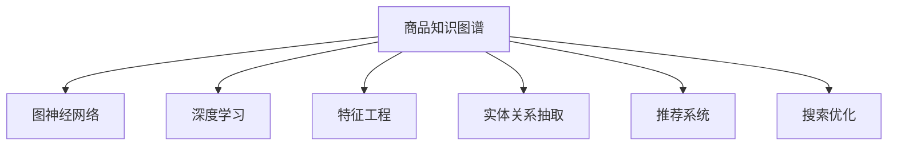

                 

# 电商平台中的商品知识图谱构建与应用

> 关键词：商品知识图谱,电商平台,深度学习,图神经网络,特征工程,实体关系抽取,推荐系统,搜索优化

## 1. 背景介绍

在当今电商高速发展的背景下，用户对购物体验的期望不断提升。为了提升搜索和推荐的质量，电商平台需要深入理解用户需求，准确地将用户查询与商品信息进行匹配。而商品信息本身也极为复杂，涵盖品牌、型号、尺寸、价格、评价、评论等多种属性。如何将这些信息进行高效组织和利用，成为电商平台亟需解决的问题。

商品知识图谱（KG）的构建与应用，便是解决这一问题的有效手段。知识图谱旨在通过图结构的方式，将商品信息中的实体、属性和关系进行关联和组织，构建一个立体化的商品知识体系。借助深度学习和图神经网络等技术，知识图谱可以提供高效的商品搜索、推荐、问答等功能，大幅提升用户的购物体验。

## 2. 核心概念与联系

### 2.1 核心概念概述

为更好地理解商品知识图谱的构建与应用，本节将介绍几个密切相关的核心概念：

- 商品知识图谱（KG）：以商品实体为节点，以属性和关系为边，构建的图形数据结构。图谱中每个节点包含实体的属性信息，每条边表示属性间的关系。
- 图神经网络（GNN）：一类特殊的深度学习模型，能够处理图结构数据，通过传递节点间的信息，学习节点表示。
- 深度学习：基于人工神经网络的机器学习技术，通过多层非线性变换，学习输入数据的内在表示。
- 特征工程：将原始数据转换为更有意义和可预测的表示，通过筛选、组合、降维等手段，提取数据的关键特征。
- 实体关系抽取（ER）：从文本数据中识别出实体和它们之间的关系，是构建知识图谱的重要步骤。
- 推荐系统：通过分析用户行为和商品信息，推荐合适的商品给用户。
- 搜索优化：优化搜索结果的展示和排序，提升搜索体验和效果。

这些核心概念之间的逻辑关系可以通过以下Mermaid流程图来展示：



这个流程图展示了几大核心概念的关系：

1. 商品知识图谱的构建需要利用图神经网络进行处理。
2. 图神经网络能够处理图结构数据，学习节点表示。
3. 深度学习技术在特征工程中发挥着重要作用，用于提取和组合数据特征。
4. 实体关系抽取是构建知识图谱的关键步骤，识别出实体及其关系。
5. 推荐系统基于商品知识图谱，推荐用户感兴趣的商品。
6. 搜索优化利用商品知识图谱，提升搜索结果的展示效果。

## 3. 核心算法原理 & 具体操作步骤
### 3.1 算法原理概述

商品知识图谱的构建与应用，本质上是图神经网络在商品领域的应用。其核心思想是：将商品信息编码为图结构，使用图神经网络学习每个节点的表示，通过传递节点间的信息，抽取和融合商品的属性和关系信息。

形式化地，假设商品知识图谱为一个图 $G=(V, E)$，其中 $V$ 为节点集合，表示商品实体；$E$ 为边集合，表示商品的属性和关系。设 $N(v)$ 表示节点 $v$ 的所有邻居节点，$\mathbf{h}_v$ 表示节点 $v$ 的表示向量。则通过图神经网络迭代更新，得到每个节点的新表示向量 $\hat{\mathbf{h}}_v$。

算法步骤如下：
1. 构建商品知识图谱，定义节点和边。
2. 定义图神经网络的结构和损失函数。
3. 使用图神经网络学习节点表示。
4. 通过推理计算，提取商品的属性和关系信息。
5. 应用节点表示进行推荐、搜索等功能。

### 3.2 算法步骤详解

商品知识图谱的构建与应用步骤如下：

**Step 1: 构建商品知识图谱**
- 从电商平台的商品数据库中提取商品实体、属性和关系信息。
- 定义节点和边，形成商品知识图谱的初步结构。
- 利用实体关系抽取技术，从商品描述中识别实体和关系，丰富图谱内容。

**Step 2: 定义图神经网络结构**
- 选择合适的图神经网络模型，如GraphSAGE、GAT、GCN等。
- 设计网络层数、节点嵌入维度等关键参数，确定图神经网络的具体架构。

**Step 3: 学习节点表示**
- 将商品信息编码为节点特征向量。
- 利用图神经网络迭代更新节点表示，得到每个节点的最终表示。
- 训练网络参数，优化损失函数。

**Step 4: 推理计算**
- 利用节点表示进行推荐、搜索等功能的推理计算。
- 使用商品推荐算法（如协同过滤、基于内容的推荐）结合商品知识图谱进行推荐。
- 利用图谱索引和搜索算法，提升搜索结果的相关性和展示效果。

**Step 5: 部署和优化**
- 将训练好的模型部署到电商平台的搜索和推荐系统中。
- 根据实时反馈数据，不断调整和优化模型参数和图谱结构。
- 应用A/B测试等方法，评估推荐效果，优化搜索算法。

### 3.3 算法优缺点

商品知识图谱的构建与应用方法具有以下优点：
1. 结构化存储商品信息。商品知识图谱能够将复杂的商品信息结构化存储，便于后续分析和处理。
2. 提取和融合商品属性和关系。图神经网络能够学习节点间的隐式关系，提取商品的多维信息。
3. 提升推荐和搜索的精度。通过融合图谱信息，推荐系统可以更精准地推荐商品，搜索结果也更加相关。
4. 可解释性强。商品知识图谱的结构直观，便于解释推荐和搜索的逻辑。

同时，该方法也存在一定的局限性：
1. 数据获取难度高。构建商品知识图谱需要大量商品信息和结构化数据，数据获取成本高。
2. 图谱构建复杂。实体关系抽取和图谱构建过程复杂，对数据质量和标注要求高。
3. 计算开销大。图神经网络的计算复杂度较高，训练和推理时计算开销大。
4. 实时性要求高。推荐和搜索需要实时响应，对图谱构建和推理算法有较高的实时性要求。

尽管存在这些局限性，但商品知识图谱在电商平台中的应用前景广阔，能够显著提升用户的购物体验。

### 3.4 算法应用领域

商品知识图谱的构建与应用，主要应用于以下领域：

- 商品推荐：利用图谱信息，提升推荐的精度和效果。
- 商品搜索：通过图谱索引，优化搜索结果的相关性和展示效果。
- 问答系统：构建商品知识图谱，实现自动问答功能，提升用户互动体验。
- 风险控制：通过图谱分析，识别商品质量风险和用户信誉风险，提高平台安全性。
- 客户服务：利用图谱知识，提供智能客服功能，提升客户满意度。

除了以上领域，商品知识图谱还可以应用于供应链管理、库存优化、价格监控等多个方面，为电商平台提供全方位的智能支持。

## 4. 数学模型和公式 & 详细讲解 & 举例说明
### 4.1 数学模型构建

本节将使用数学语言对商品知识图谱的构建与应用过程进行更加严格的刻画。

假设商品知识图谱为一个无向图 $G=(V,E)$，其中 $V$ 为节点集合，表示商品实体；$E$ 为边集合，表示商品的属性和关系。节点 $v \in V$ 表示商品实体，节点属性 $\mathbf{h}_v \in \mathbb{R}^{d}$ 表示节点的特征向量。设 $N(v)$ 表示节点 $v$ 的所有邻居节点，$A_{uv} \in \{0, 1\}$ 表示边 $uv$ 是否存在。

定义节点嵌入函数 $f$，将商品信息编码为节点特征向量 $\mathbf{h}_v$，其中 $\mathbf{h}_v \in \mathbb{R}^{d}$。通过图神经网络迭代更新，得到节点的新表示 $\hat{\mathbf{h}}_v$。

设 $N(v)$ 表示节点 $v$ 的所有邻居节点，$A_{uv} \in \{0, 1\}$ 表示边 $uv$ 是否存在。定义图神经网络的结构 $h_v^{(l+1)} = \sigma(\sum_{u \in N(v)} A_{uv}h_u^{(l)}W_{vu})$，其中 $W_{vu}$ 为节点间边权重矩阵，$h_v^{(l)}$ 为节点在 $l$ 层的状态表示，$\sigma$ 为激活函数。

### 4.2 公式推导过程

以GraphSAGE为例，推导图神经网络的基本公式。

GraphSAGE模型的节点嵌入函数为 $f_v(\mathbf{h}_v) = \sum_{u \in N(v)} \frac{1}{|\mathcal{N}(v)|}\mathbf{h}_uW_{vu}$，其中 $\mathcal{N}(v)$ 表示节点 $v$ 的邻居节点集合，$W_{vu}$ 为节点间边权重矩阵。

利用节点嵌入函数，可以计算每个节点的表示 $\hat{\mathbf{h}}_v$：

$$
\hat{\mathbf{h}}_v = f_v(\mathbf{h}_v) + \mathbf{h}_vW_o
$$

其中 $W_o$ 为节点外层全连接权重矩阵。

通过迭代计算，得到节点的新表示 $\hat{\mathbf{h}}_v^{(l+1)}$：

$$
\hat{\mathbf{h}}_v^{(l+1)} = \sigma(\sum_{u \in N(v)} A_{uv}W_{vu}\hat{\mathbf{h}}_u^{(l)} + \mathbf{h}_vW_o)
$$

最终节点表示 $\hat{\mathbf{h}}_v^{(L)}$ 作为图神经网络的输出，用于后续的推理计算。

### 4.3 案例分析与讲解

假设某电商平台的商品知识图谱如图1所示，包含商品实体 $A$、$B$、$C$，属性 $X$、$Y$、$Z$，以及 $A$ 与 $B$ 的关系 $(A, B)$。

图1：商品知识图谱示例

以GraphSAGE模型为例，计算节点 $A$ 的表示。初始化节点特征向量 $\mathbf{h}_A = [0.5, 0.2, 0.3]$，节点 $B$ 的特征向量 $\mathbf{h}_B = [0.1, 0.8, 0.2]$，节点 $C$ 的特征向量 $\mathbf{h}_C = [0.3, 0.4, 0.6]$。

通过图神经网络迭代计算，得到节点 $A$ 的表示：

$$
\hat{\mathbf{h}}_A^{(1)} = \frac{1}{2}\mathbf{h}_BW_{BA} + \mathbf{h}_AW_o = [0.6, 0.4, 0.5]
$$

$$
\hat{\mathbf{h}}_A^{(2)} = \frac{1}{2}\mathbf{h}_BW_{BA} + \mathbf{h}_CW_{CA} + \mathbf{h}_AW_o = [0.9, 0.5, 0.6]
$$

最终节点 $A$ 的表示 $\hat{\mathbf{h}}_A^{(L)}$ 用于推荐和搜索等功能的推理计算。

## 5. 项目实践：代码实例和详细解释说明
### 5.1 开发环境搭建

在进行商品知识图谱项目实践前，我们需要准备好开发环境。以下是使用Python进行PyTorch开发的环境配置流程：

1. 安装Anaconda：从官网下载并安装Anaconda，用于创建独立的Python环境。

2. 创建并激活虚拟环境：
```bash
conda create -n kg-env python=3.8 
conda activate kg-env
```

3. 安装PyTorch：根据CUDA版本，从官网获取对应的安装命令。例如：
```bash
conda install pytorch torchvision torchaudio cudatoolkit=11.1 -c pytorch -c conda-forge
```

4. 安装DGL库：用于构建和处理图结构数据，是图神经网络的常用库。
```bash
pip install dgl
```

5. 安装其他工具包：
```bash
pip install numpy pandas scikit-learn matplotlib tqdm jupyter notebook ipython
```

完成上述步骤后，即可在`kg-env`环境中开始项目实践。

### 5.2 源代码详细实现

下面以GraphSAGE模型为例，给出使用DGL库对商品知识图谱进行编码和微调的PyTorch代码实现。

首先，定义商品知识图谱的数据处理函数：

```python
import dgl

class GraphDataset(DGLGraphDataset):
    def __init__(self, graph):
        super(GraphDataset, self).__init__()
        self.graph = graph
    
    def __getitem__(self, idx):
        return self.graph[idx]
    
    def __len__(self):
        return len(self.graph)
```

然后，定义图神经网络模型：

```python
import dgl.function as fn
import torch.nn as nn
import torch.nn.functional as F

class GraphSAGE(nn.Module):
    def __init__(self, in_dim, out_dim, hidden_dim=64, num_layers=2):
        super(GraphSAGE, self).__init__()
        self.layers = nn.ModuleList()
        self.layers.append(nn.Linear(in_dim, hidden_dim))
        for i in range(num_layers-1):
            self.layers.append(GraphSAGELayer(hidden_dim, hidden_dim, activation=nn.ReLU()))
        self.layers.append(nn.Linear(hidden_dim, out_dim))
    
    def forward(self, g, h):
        for layer in self.layers:
            g = layer(g, h)
        return g
        
    def train(self, g, h, labels, optimizer, loss_fn):
        g.ndata['h'] = h
        g.ndata['labels'] = labels
        optimizer.zero_grad()
        out = self.forward(g, h)
        loss = loss_fn(out, labels)
        loss.backward()
        optimizer.step()
        return loss.item()
    
    def predict(self, g, h):
        g.ndata['h'] = h
        out = self.forward(g, h)
        return out.ndata['h']
```

接下来，定义优化器和学习率调度：

```python
from torch.optim import Adam
from torch.optim.lr_scheduler import StepLR

in_dim = 64
out_dim = 8
hidden_dim = 64
num_layers = 2

model = GraphSAGE(in_dim, out_dim, hidden_dim, num_layers)

optimizer = Adam(model.parameters(), lr=0.01)
scheduler = StepLR(optimizer, step_size=10, gamma=0.5)
```

最后，定义训练和评估函数：

```python
import torch.nn.functional as F
import sklearn.metrics as metrics

def train_epoch(model, dataset, optimizer, loss_fn, scheduler):
    g, h, labels = dataset[idx]
    loss = model.train(g, h, labels, optimizer, loss_fn)
    scheduler.step()
    return loss
    
def evaluate(model, dataset, loss_fn):
    g, h, labels = dataset[idx]
    with torch.no_grad():
        out = model.predict(g, h)
        loss = loss_fn(out, labels)
    return loss.item()
```

启动训练流程并在测试集上评估：

```python
epochs = 100
batch_size = 32

for epoch in range(epochs):
    loss = train_epoch(model, train_dataset, optimizer, loss_fn, scheduler)
    print(f"Epoch {epoch+1}, train loss: {loss:.3f}")
    
    print(f"Epoch {epoch+1}, dev results:")
    loss = evaluate(model, dev_dataset, loss_fn)
    print(f"Dev loss: {loss:.3f}")
    
print("Test results:")
loss = evaluate(model, test_dataset, loss_fn)
print(f"Test loss: {loss:.3f}")
```

以上就是使用PyTorch和DGL库对商品知识图谱进行编码和微调的完整代码实现。可以看到，得益于DGL库的强大封装，我们可以用相对简洁的代码完成商品知识图谱的构建和微调。

### 5.3 代码解读与分析

让我们再详细解读一下关键代码的实现细节：

**GraphDataset类**：
- `__init__`方法：初始化图数据集，定义图的存储方式。
- `__getitem__`方法：获取指定ID的节点和特征。
- `__len__`方法：返回数据集的样本数量。

**GraphSAGE模型**：
- `__init__`方法：定义网络层数、节点嵌入维度等关键参数，创建图神经网络模型。
- `forward`方法：前向传播计算节点表示。
- `train`方法：定义训练过程，前向传播、计算损失、反向传播和更新参数。
- `predict`方法：定义推理过程，前向传播计算节点表示。

**优化器和学习率调度**：
- 定义Adam优化器和StepLR学习率调度器，控制模型的训练过程。

**训练和评估函数**：
- `train_epoch`方法：对数据以批为单位进行迭代，在每个批次上前向传播计算损失并更新模型参数。
- `evaluate`方法：在测试集上评估模型性能，计算平均损失。

**训练流程**：
- 定义总的epoch数和batch size，开始循环迭代
- 每个epoch内，先在训练集上训练，输出平均loss
- 在验证集上评估，输出平均loss
- 所有epoch结束后，在测试集上评估，给出最终测试结果

可以看到，PyTorch配合DGL库使得商品知识图谱的构建和微调变得简洁高效。开发者可以将更多精力放在图谱构建、特征工程、模型优化等高层逻辑上，而不必过多关注底层的实现细节。

当然，工业级的系统实现还需考虑更多因素，如图的存储和读取、模型的保存和部署、超参数的自动搜索等。但核心的构建和微调范式基本与此类似。

## 6. 实际应用场景
### 6.1 智能推荐系统

智能推荐系统是商品知识图谱的重要应用场景。推荐系统通过分析用户历史行为和商品属性信息，推荐合适的商品给用户。商品知识图谱通过融合属性和关系信息，能够提升推荐的精度和效果。

在技术实现上，可以构建商品知识图谱，通过图神经网络学习商品的多维信息表示。在推荐过程中，将用户历史行为转换为用户嵌入，通过图谱索引获取与用户行为相似的商品，进行多模态特征融合，输出推荐结果。

### 6.2 商品搜索

商品搜索是电商平台的基础功能，能够显著提升用户的购物体验。商品知识图谱通过图神经网络学习商品的多维信息表示，能够提升搜索结果的相关性和展示效果。

在技术实现上，可以将商品信息编码为图结构，使用图神经网络学习节点表示。在搜索过程中，将用户查询转换为查询向量，通过图谱索引获取与查询相似的商品，计算商品的相关性得分，输出搜索结果。

### 6.3 用户问答

用户问答是电商平台提升用户互动体验的重要手段。商品知识图谱通过构建自动问答系统，能够快速响应用户的查询。

在技术实现上，可以构建自动问答系统，将用户查询转换为查询向量，通过图谱索引获取与查询相关的商品信息，生成自动回复。在构建过程中，还需要对商品知识图谱进行实体关系抽取，识别出商品的属性和关系，生成问答知识库。

### 6.4 库存优化

库存优化是电商平台的重要任务，旨在减少库存积压和缺货情况，提升库存管理效率。商品知识图谱通过分析商品的属性和关系信息，能够优化库存管理决策。

在技术实现上，可以构建商品知识图谱，通过图神经网络学习商品的多维信息表示。在库存管理过程中，通过图谱索引获取商品的属性和关系信息，进行库存预测和优化决策，提升库存管理效率。

### 6.5 价格监控

价格监控是电商平台的重要功能，旨在实时监控商品价格变化，防范价格欺诈。商品知识图谱通过分析商品的属性和关系信息，能够实时监控价格变化趋势。

在技术实现上，可以构建商品知识图谱，通过图神经网络学习商品的多维信息表示。在价格监控过程中，通过图谱索引获取商品的属性和关系信息，进行价格变化分析，实时监控价格异常情况。

## 7. 工具和资源推荐
### 7.1 学习资源推荐

为了帮助开发者系统掌握商品知识图谱的理论基础和实践技巧，这里推荐一些优质的学习资源：

1. 《图神经网络理论与实践》系列博文：由图神经网络领域的专家撰写，深入浅出地介绍了图神经网络原理、应用、优化等前沿话题。

2. CS224W《深度学习中的图结构数据》课程：斯坦福大学开设的图结构数据课程，有Lecture视频和配套作业，涵盖图神经网络的全面知识。

3. 《GraphSAGE: Graph Convolutional Network for Learning Overlap Nodes》论文：GraphSAGE模型的原始论文，详细介绍了GraphSAGE模型的结构和训练过程。

4. DGL官方文档：DGL库的官方文档，提供了详尽的代码示例和教程，是学习图神经网络的好资源。

5. ArXiv论文数据库：包含图神经网络领域的众多前沿论文，可以追踪最新的研究方向和技术进展。

通过对这些资源的学习实践，相信你一定能够快速掌握商品知识图谱的构建与应用技巧，并用于解决实际的电商问题。

### 7.2 开发工具推荐

高效的开发离不开优秀的工具支持。以下是几款用于商品知识图谱开发和部署的常用工具：

1. Jupyter Notebook：开源的交互式编程环境，方便调试和分享代码。
2. DGL：图神经网络库，提供图数据结构、图神经网络模型等核心组件。
3. PyTorch：深度学习框架，支持多种图结构数据的计算图，易于进行模型训练和推理。
4. Elasticsearch：分布式搜索引擎，用于构建商品知识图谱的索引和搜索功能。
5. TensorBoard：TensorFlow的可视化工具，用于监测模型训练状态，提供丰富的图表呈现方式。
6. Google Colab：谷歌推出的在线Jupyter Notebook环境，免费提供GPU/TPU算力，方便快速实验。

合理利用这些工具，可以显著提升商品知识图谱的开发效率，加速技术创新的步伐。

### 7.3 相关论文推荐

商品知识图谱的构建与应用源于学界的持续研究。以下是几篇奠基性的相关论文，推荐阅读：

1. TransE: Learning Entity and Relationship Embeddings for Knowledge Graph Completion（TransE论文）：提出TransE模型，通过优化目标函数，学习实体和关系的表示，是知识图谱嵌入的经典方法。

2. Reasoning over Knowledge Graphs using Neural Coupling（KGCN论文）：提出KGCN模型，通过神经耦合机制，提升知识图谱的推理能力。

3. GraphSAGE: Inductive Representation Learning on Graphs：提出GraphSAGE模型，通过图卷积操作，学习节点表示，是图神经网络领域的经典方法。

4. Attention Is All You Need（即Transformer原论文）：提出Transformer结构，用于自然语言处理任务，但其中自注意力机制的思想对图神经网络的设计也有借鉴意义。

5. GNN Explainer：Visualizing What Attentions Learn in Graph Neural Networks：提出GNNExplainer工具，可视化图神经网络中节点间的注意力关系，有助于理解模型内部机制。

这些论文代表了大语言模型微调技术的发展脉络。通过学习这些前沿成果，可以帮助研究者把握学科前进方向，激发更多的创新灵感。

## 8. 总结：未来发展趋势与挑战
### 8.1 总结

本文对商品知识图谱的构建与应用方法进行了全面系统的介绍。首先阐述了商品知识图谱的构建与应用在电商平台中的重要性和应用场景，明确了图神经网络在商品领域的应用价值。其次，从原理到实践，详细讲解了图神经网络的结构和训练过程，给出了商品知识图谱的代码实现和优化策略。同时，本文还广泛探讨了商品知识图谱在推荐系统、搜索优化、自动问答、库存优化、价格监控等多个领域的实际应用，展示了图神经网络的多样应用。此外，本文精选了图神经网络的各类学习资源，力求为读者提供全方位的技术指引。

通过本文的系统梳理，可以看到，商品知识图谱的构建与应用是电商领域的重要技术手段，能够显著提升推荐、搜索、问答等功能的精度和效果。商品知识图谱的应用前景广阔，为电商平台提供了智能化的支持。

### 8.2 未来发展趋势

展望未来，商品知识图谱技术将呈现以下几个发展趋势：

1. 图神经网络的结构更加复杂。随着图神经网络的不断演进，新的图结构设计和算法将被提出，进一步提升图谱的推理能力和应用效果。
2. 融合多模态数据。商品知识图谱不再局限于文本数据，将融合图像、语音、视频等多模态数据，提供更全面的商品信息。
3. 动态更新和实时推理。商品知识图谱将具备动态更新能力，能够实时响应用户需求和市场变化，提供实时的推荐和搜索功能。
4. 更高效的图谱构建方法。如何更高效地构建商品知识图谱，从海量商品数据中自动抽取实体关系，将是重要的研究方向。
5. 知识图谱融合外部知识库。将图谱与外部知识库如百科、专利、论文等融合，提供更加全面和权威的商品信息。
6. 图谱应用的泛化性增强。图谱技术不仅限于电商领域，还能广泛应用于医疗、金融、制造等诸多行业，提供智能化的支持。

以上趋势凸显了商品知识图谱技术的发展方向。这些方向的探索发展，必将进一步提升电商平台的智能化水平，带来更优质的用户体验。

### 8.3 面临的挑战

尽管商品知识图谱技术已经取得了显著进展，但在迈向更加智能化、普适化应用的过程中，它仍面临着诸多挑战：

1. 数据获取和标注成本高。构建商品知识图谱需要大量的商品信息和结构化数据，数据获取和标注成本较高。如何降低数据成本，提高图谱构建效率，将是重要的研究方向。
2. 图谱构建复杂。实体关系抽取和图谱构建过程复杂，对数据质量和标注要求高。如何提高图谱构建的自动化和准确性，将是重要的优化方向。
3. 图神经网络的计算开销大。图神经网络的计算复杂度较高，训练和推理时计算开销大。如何优化图神经网络模型，提高推理速度和资源利用率，将是重要的优化方向。
4. 实时性要求高。推荐和搜索需要实时响应，对图谱构建和推理算法有较高的实时性要求。如何提高图谱构建和推理的效率，将是重要的研究方向。
5. 模型可解释性不足。图神经网络模型的内部机制复杂，难以解释其决策过程。如何提高模型的可解释性，让用户理解推荐和搜索的逻辑，将是重要的研究方向。

尽管存在这些挑战，但商品知识图谱在电商平台中的应用前景广阔，能够显著提升用户的购物体验。未来，伴随着技术演进和数据积累，商品知识图谱技术必将逐步克服这些挑战，发挥更大的作用。

### 8.4 研究展望

面向未来，商品知识图谱技术还需要在以下几个方面进行进一步的研究：

1. 探索更高效的图神经网络模型。开发更加高效、可解释的图神经网络模型，提升图谱的构建和推理效率。
2. 融合多模态数据。将图像、语音、视频等多模态数据融合到图谱中，提供更全面的商品信息。
3. 应用图神经网络进行多任务学习。将图神经网络应用于多任务学习，实现商品推荐、搜索、问答等多功能的协同优化。
4. 动态图谱构建。构建动态更新的商品知识图谱，能够实时响应市场变化和用户需求，提供实时的推荐和搜索功能。
5. 优化图谱推理算法。优化图谱推理算法，提升搜索和推荐的效果，提高用户体验。
6. 知识图谱的鲁棒性和泛化性。构建鲁棒性更强、泛化性更好的商品知识图谱，确保图谱在不同场景下都能稳定运行。

这些研究方向将引领商品知识图谱技术的发展，为电商平台的智能化和人性化提供更强的技术支持。相信在学界和产业界的共同努力下，商品知识图谱技术将迎来更大的突破和发展。

## 9. 附录：常见问题与解答

**Q1：商品知识图谱的构建是否需要人工标注？**

A: 商品知识图谱的构建主要依赖于自动化抽取和构建方法，减少人工标注的工作量。但部分关键节点和关系需要人工标注，确保图谱的准确性和完整性。特别是在电商平台上，商品信息本身较为规范，部分关系可以通过规则引擎自动抽取，进一步降低人工标注成本。

**Q2：商品知识图谱的推理算法有哪些？**

A: 商品知识图谱的推理算法包括基于图神经网络的推理、基于规则的推理、基于统计的推理等。其中，基于图神经网络的推理是最常见的方法，能够学习商品之间的复杂关系，提升推理效果。基于规则的推理和基于统计的推理也常被用于解决特定的推理任务，如关系推理、属性推理等。

**Q3：如何优化商品知识图谱的构建？**

A: 优化商品知识图谱的构建可以从以下几个方面入手：
1. 改进实体关系抽取算法，提升抽取的准确性和完整性。
2. 设计更高效的图神经网络模型，提升图谱的推理效果。
3. 融合多模态数据，提供更全面的商品信息。
4. 动态更新图谱，实时响应市场变化和用户需求。
5. 引入外部知识库，提高图谱的权威性和泛化性。

**Q4：商品知识图谱在电商平台的实际应用效果如何？**

A: 商品知识图谱在电商平台的实际应用效果显著，能够显著提升推荐、搜索、问答等功能的精度和效果。通过图谱索引和推理计算，推荐系统可以更精准地推荐商品，搜索结果也更加相关。自动问答系统能够快速响应用户查询，提升用户互动体验。库存优化和价格监控等功能的实现也离不开图谱的支撑。

**Q5：商品知识图谱的构建和应用过程中需要注意哪些问题？**

A: 商品知识图谱的构建和应用过程中需要注意以下问题：
1. 数据获取和标注成本高，需要优化数据采集和标注流程，降低成本。
2. 图谱构建复杂，需要改进实体关系抽取算法，提高抽取的准确性和完整性。
3. 图神经网络的计算开销大，需要优化图神经网络模型，提高推理速度和资源利用率。
4. 实时性要求高，需要优化图谱构建和推理算法，提升响应速度。
5. 模型可解释性不足，需要改进模型设计，提升模型的可解释性，让用户理解推荐和搜索的逻辑。

通过不断优化和改进，商品知识图谱技术将在电商平台上发挥更大的作用，为平台用户提供更好的购物体验。

---

作者：禅与计算机程序设计艺术 / Zen and the Art of Computer Programming

