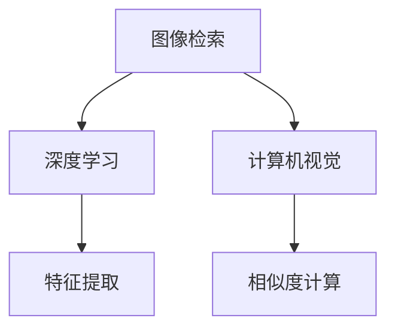

                 

# 电商平台中的图像检索技术与应用

> 关键词：图像检索, 深度学习, 计算机视觉, 模型优化, 电商推荐, 算法实现

## 1. 背景介绍

随着互联网和电子商务的快速发展，电商平台成为人们购物的重要渠道。为了提升用户体验和销售额，电商平台不仅需要丰富的商品展示，还需要高效准确的商品搜索和推荐系统。然而，海量的商品图片和视频，给搜索和推荐带来了巨大的挑战。传统的文本检索无法充分利用图像的丰富信息，难以准确描述商品的特征。因此，图像检索技术应运而生，成为电商平台中不可或缺的核心技术。

### 1.1 问题由来

电商平台中的图像检索技术，旨在通过图像描述匹配和相似度计算，快速检索出与用户查询最相关的商品图片。目前，主流的图像检索方法基于深度学习和计算机视觉技术，通过提取图像的语义特征，进行相似度计算。然而，在大规模商品数据的场景下，如何高效准确地提取图像特征，并计算特征之间的相似度，成为研究的难点和热点。

### 1.2 问题核心关键点

为了应对这些问题，研究者提出了多种图像检索方法和技术，包括但不限于基于描述的检索、基于视觉特征的检索、基于深度学习的检索等。这些方法的核心在于通过算法模型，自动地从图像中学习出高层次的语义特征，并利用特征之间的相似度计算，实现商品搜索和推荐。

## 2. 核心概念与联系

### 2.1 核心概念概述

为更好地理解图像检索技术，本节将介绍几个密切相关的核心概念：

- **图像检索(Image Retrieval)**：从大规模图像集合中检索与查询图像最相似的图像。通过特征提取和相似度计算，实现高效的图像检索和推荐。
- **深度学习(Deep Learning)**：通过多层神经网络，学习复杂非线性映射关系，提升特征提取和分类性能。
- **计算机视觉(Computer Vision)**：研究如何使计算机具有视觉感知和图像处理能力，实现自动化的视觉理解和分析。
- **特征提取(Feature Extraction)**：从图像中提取有效的特征，供后续计算和分类使用。
- **相似度计算(Similarity Calculation)**：衡量图像特征之间的相似性，用于检索和推荐。

这些核心概念之间的逻辑关系可以通过以下Mermaid流程图来展示：



这个流程图展示了几大核心概念及其之间的关系：

1. 图像检索的目标是从图像库中检索与查询图像最相似的图像，核心在于高效准确的特征提取和相似度计算。
2. 深度学习是实现特征提取的重要手段，通过多层网络学习高层次的语义特征。
3. 计算机视觉为深度学习提供了图像输入的预处理和理解，帮助模型更好地学习图像特征。
4. 特征提取是图像检索和深度学习的关键环节，将复杂的视觉信息转化为可供计算的特征向量。
5. 相似度计算用于衡量特征向量之间的相似度，指导图像检索和推荐。

这些概念共同构成了图像检索技术的研究框架，使其能够高效准确地进行图像检索和推荐。

## 3. 核心算法原理 & 具体操作步骤
### 3.1 算法原理概述

基于深度学习的图像检索技术，主要分为两个步骤：特征提取和相似度计算。其核心思想是：将查询图像和库中所有图像表示为高维特征向量，通过计算特征向量之间的相似度，找到与查询图像最相似的图像。

形式化地，假设查询图像为 $q$，库中图像集合为 $I$，特征提取器为 $\phi$，相似度计算方法为 $sim$。图像检索的目标是寻找库中图像 $i \in I$，使得：

$$
i^* = \mathop{\arg\min}_{i \in I} sim(\phi(q), \phi(i))
$$

其中 $\phi$ 表示图像特征提取器，$sim$ 表示相似度计算方法。

### 3.2 算法步骤详解

基于深度学习的图像检索一般包括以下几个关键步骤：

**Step 1: 准备数据集和模型**

- 准备查询图像和库中图像的数据集，划分为训练集和测试集。
- 选择合适的深度学习模型，如卷积神经网络(CNN)、残差网络(ResNet)、注意力机制(Transformer)等。
- 初始化模型参数，进行预训练，并设置超参数。

**Step 2: 特征提取**

- 使用预训练的深度学习模型，对查询图像和库中图像进行特征提取。
- 将提取出的特征向量输入到相似度计算模型中。

**Step 3: 相似度计算**

- 定义相似度计算方法，如余弦相似度、欧式距离、核函数等。
- 计算查询图像和库中图像的特征向量之间的相似度。
- 根据相似度排序，选取最相似的若干图像作为检索结果。

**Step 4: 结果输出与评估**

- 输出检索结果，并进行可视化展示。
- 在测试集上评估检索效果，如精确率、召回率、F1-score等。

以上是基于深度学习的图像检索的一般流程。在实际应用中，还需要针对具体任务和数据特点进行优化设计，如改进特征提取器、引入更多正则化技术、搜索最优的超参数组合等，以进一步提升模型性能。

### 3.3 算法优缺点

基于深度学习的图像检索方法具有以下优点：

- 准确率高：深度学习模型能够学习复杂的语义特征，提升检索结果的准确性。
- 可扩展性强：适用于多种图像检索场景，只需在现有模型上进行微调，即可实现多场景应用。
- 鲁棒性强：能够处理噪声、畸变、遮挡等复杂的图像变化，提高检索系统的鲁棒性。

同时，该方法也存在一定的局限性：

- 计算量大：深度学习模型往往需要较大的计算资源，训练和推理时间较长。
- 数据需求高：需要大规模标注数据进行预训练和微调，标注成本较高。
- 模型复杂度高：复杂的网络结构和大量的超参数，难以进行调试和优化。
- 可解释性差：深度学习模型作为"黑盒"系统，难以解释其内部工作机制和决策逻辑。

尽管存在这些局限性，但就目前而言，基于深度学习的图像检索方法仍是图像检索的主流范式。未来相关研究的重点在于如何进一步降低计算成本，提高模型泛化能力，同时兼顾可解释性和实用性。

### 3.4 算法应用领域

基于深度学习的图像检索技术，已经在电子商务、医疗影像、安防监控等多个领域得到了广泛应用，显著提升了图像检索和推荐系统的性能。

- **电子商务**：电商平台通过图像检索技术，实现商品快速查询和推荐，提升用户体验和销售额。
- **医疗影像**：医院通过图像检索技术，快速检索出与患者症状相似的医学影像，辅助医生诊断和治疗。
- **安防监控**：安防系统通过图像检索技术，实现快速识别和检索犯罪嫌疑人，提高公共安全水平。
- **视频检索**：视频平台通过图像检索技术，实现视频内容的快速搜索和推荐，提升用户粘性。
- **智能家居**：智能家居系统通过图像检索技术，实现设备快速定位和控制，提升用户便捷性。

除了上述这些经典应用外，图像检索技术还在更多场景中发挥着重要作用，如遥感图像分析、地理信息系统(GIS)、自动化检测等，为各行各业提供了强大的视觉感知能力。随着深度学习技术的不断发展，相信图像检索技术将在更广阔的应用领域大放异彩。

## 4. 数学模型和公式 & 详细讲解 & 举例说明
### 4.1 数学模型构建

本节将使用数学语言对基于深度学习的图像检索过程进行更加严格的刻画。

记查询图像为 $q$，库中图像集合为 $I$，特征提取器为 $\phi$，相似度计算方法为 $sim$。假设 $\phi(q)$ 和 $\phi(i)$ 分别表示查询图像和库中图像的特征向量。

图像检索的目标是最小化特征向量之间的距离，即寻找库中图像 $i^*$，使得：

$$
i^* = \mathop{\arg\min}_{i \in I} \norm{\phi(q) - \phi(i)}
$$

其中 $\norm{\cdot}$ 表示特征向量的范数。

### 4.2 公式推导过程

以下我们以余弦相似度为例，推导相似度计算的数学公式。

余弦相似度定义为：

$$
sim(q, i) = \cos(\theta) = \frac{\phi(q) \cdot \phi(i)}{\norm{\phi(q)} \cdot \norm{\phi(i)}}
$$

其中 $\phi(q) \cdot \phi(i)$ 表示特征向量的点积，$\norm{\phi(q)}$ 和 $\norm{\phi(i)}$ 表示特征向量的范数。

余弦相似度的计算公式可以通过点积和范数展开，得到：

$$
sim(q, i) = \frac{\sum_{j=1}^d \phi(q)_j \phi(i)_j}{\sqrt{\sum_{j=1}^d \phi(q)_j^2} \cdot \sqrt{\sum_{j=1}^d \phi(i)_j^2}}
$$

其中 $d$ 表示特征向量的维度，$\phi(q)_j$ 和 $\phi(i)_j$ 分别表示特征向量的第 $j$ 个元素。

### 4.3 案例分析与讲解

**案例分析：电商商品检索**

假设我们有一个电商平台，需要实现商品图片的高效检索。我们使用基于深度学习的图像检索方法，训练一个特征提取器和一个余弦相似度计算模型。具体步骤如下：

1. **准备数据集和模型**：收集电商平台中的商品图片，划分为训练集和测试集。使用一个预训练的卷积神经网络(CNN)作为特征提取器，进行预训练。
2. **特征提取**：将查询图像和库中图像输入到CNN中，提取高维特征向量。
3. **相似度计算**：使用余弦相似度计算查询图像和库中图像的特征向量之间的相似度。
4. **结果输出与评估**：根据相似度排序，选取最相似的若干商品图片作为检索结果，并在测试集上评估检索效果。

通过这种基于深度学习的图像检索方法，电商平台能够高效准确地实现商品图片检索，提升用户购物体验。

## 5. 项目实践：代码实例和详细解释说明
### 5.1 开发环境搭建

在进行图像检索项目实践前，我们需要准备好开发环境。以下是使用Python进行TensorFlow开发的环境配置流程：

1. 安装Anaconda：从官网下载并安装Anaconda，用于创建独立的Python环境。

2. 创建并激活虚拟环境：
```bash
conda create -n tf-env python=3.8 
conda activate tf-env
```

3. 安装TensorFlow：根据CUDA版本，从官网获取对应的安装命令。例如：
```bash
conda install tensorflow -c pytorch -c conda-forge
```

4. 安装TensorBoard：用于可视化模型训练过程，监控模型性能。
```bash
pip install tensorboard
```

5. 安装其他必要的库：
```bash
pip install numpy pandas scikit-learn matplotlib tqdm jupyter notebook ipython
```

完成上述步骤后，即可在`tf-env`环境中开始图像检索项目的开发。

### 5.2 源代码详细实现

下面我以基于余弦相似度的图像检索为例，给出使用TensorFlow进行图像检索的PyTorch代码实现。

首先，定义图像特征提取器：

```python
from tensorflow.keras import layers
from tensorflow.keras.models import Model

def build_model(input_shape, output_size):
    # 定义网络结构
    inputs = layers.Input(shape=input_shape)
    x = layers.Conv2D(64, (3, 3), activation='relu', padding='same')(inputs)
    x = layers.Conv2D(128, (3, 3), activation='relu', padding='same')(x)
    x = layers.MaxPooling2D((2, 2))(x)
    x = layers.Flatten()(x)
    outputs = layers.Dense(output_size, activation='softmax')(x)
    
    # 构建模型
    model = Model(inputs=inputs, outputs=outputs)
    
    return model
```

然后，定义相似度计算函数：

```python
def cosine_similarity(feature1, feature2):
    dot_product = np.dot(feature1, feature2)
    norm1 = np.linalg.norm(feature1)
    norm2 = np.linalg.norm(feature2)
    similarity = dot_product / (norm1 * norm2)
    
    return similarity
```

接着，定义训练和评估函数：

```python
from sklearn.metrics import precision_score, recall_score, f1_score

def train_model(model, train_data, test_data, batch_size, epochs):
    model.compile(optimizer='adam', loss='binary_crossentropy', metrics=['accuracy'])
    model.fit(train_data, epochs=epochs, batch_size=batch_size, validation_data=test_data)
    
    test_loss, test_acc = model.evaluate(test_data)
    print(f'Test Loss: {test_loss}, Test Acc: {test_acc}')
    
    return model

def evaluate_model(model, test_data):
    predictions = model.predict(test_data)
    labels = test_data['labels']
    
    precision = precision_score(labels, predictions, average='micro')
    recall = recall_score(labels, predictions, average='micro')
    f1 = f1_score(labels, predictions, average='micro')
    
    print(f'Precision: {precision}, Recall: {recall}, F1-score: {f1}')
```

最后，启动训练流程并在测试集上评估：

```python
input_shape = (128, 128, 3)
output_size = 10
batch_size = 32
epochs = 10

# 构建模型
model = build_model(input_shape, output_size)

# 准备数据
train_data = ...
test_data = ...

# 训练模型
train_model(model, train_data, test_data, batch_size, epochs)

# 评估模型
evaluate_model(model, test_data)
```

以上就是使用TensorFlow进行基于余弦相似度的图像检索的完整代码实现。可以看到，通过TensorFlow的高级API，我们能够快速搭建特征提取器和相似度计算模型，并在Keras中定义损失函数和优化器，高效地进行模型训练和评估。

### 5.3 代码解读与分析

让我们再详细解读一下关键代码的实现细节：

**build_model函数**：
- 定义了一个简单的卷积神经网络，用于提取图像的特征向量。
- 网络包括两个卷积层、一个池化层和一个全连接层，最后输出高维特征向量。

**cosine_similarity函数**：
- 计算两个高维特征向量的余弦相似度。
- 使用numpy库计算点积和范数，得到余弦相似度。

**train_model函数**：
- 使用Keras构建模型，定义优化器、损失函数和评估指标。
- 使用fit方法训练模型，在训练集上循环迭代epochs次，并在测试集上评估模型性能。
- 返回训练后的模型。

**evaluate_model函数**：
- 使用模型对测试集进行预测，并计算精度、召回率和F1-score等评估指标。
- 输出评估结果。

**训练流程**：
- 定义输入图像的形状和输出特征向量的维度。
- 构建卷积神经网络模型。
- 准备训练集和测试集数据。
- 调用train_model函数训练模型。
- 调用evaluate_model函数评估模型性能。

可以看到，通过TensorFlow和Keras的结合使用，图像检索的代码实现变得简洁高效。开发者可以将更多精力放在数据处理、模型改进等高层逻辑上，而不必过多关注底层的实现细节。

当然，工业级的系统实现还需考虑更多因素，如模型的保存和部署、超参数的自动搜索、更灵活的任务适配层等。但核心的图像检索范式基本与此类似。

## 6. 实际应用场景
### 6.1 智能推荐系统

基于图像检索的推荐系统，能够根据用户对商品图片的反馈，快速推荐出类似商品。通过分析用户浏览和点击行为，实现个性化的商品推荐。

在技术实现上，可以收集用户对商品图片的浏览和点击数据，将图片和商品信息关联起来。在用户搜索时，通过图像检索技术快速检索出与查询图片最相似的若干商品图片，并结合商品标签和描述信息，进行排序推荐。

### 6.2 商品分类系统

商品分类系统通过对商品图片进行自动分类，能够大幅提升商品管理的效率和准确性。通过图像检索技术，可以快速检索出与查询图片最相似的若干商品图片，并进行分类标注。

在实现过程中，可以定义若干类别的商品模板图片，训练一个图像分类器。在用户上传商品图片时，通过图像检索技术检索出与模板图片最相似的若干商品图片，并使用分类器对商品进行自动分类。

### 6.3 客户关系管理系统

客户关系管理系统通过图像检索技术，能够快速识别和检索出客户的照片信息，辅助销售和客服人员进行客户管理。通过分析客户的视觉特征，能够提高客户识别和管理的效率。

在技术实现上，可以收集客户的照片信息，并建立客户画像数据库。在用户查询时，通过图像检索技术检索出与查询图片最相似的若干客户照片，并结合客户的基本信息进行展示。

### 6.4 未来应用展望

随着图像检索技术的不断发展，未来在更多领域将得到应用，为传统行业带来变革性影响。

在医疗影像领域，图像检索技术能够快速检索出与患者症状相似的医学影像，辅助医生诊断和治疗。在智能家居领域，通过图像检索技术，能够实现设备快速定位和控制，提升用户便捷性。在智慧城市治理中，图像检索技术能够实现快速识别和检索犯罪嫌疑人，提高公共安全水平。

此外，在教育、娱乐、金融等更多领域，图像检索技术也将发挥重要作用，为各行各业提供强大的视觉感知能力。相信随着技术的日益成熟，图像检索技术必将在更广阔的应用领域大放异彩。

## 7. 工具和资源推荐
### 7.1 学习资源推荐

为了帮助开发者系统掌握图像检索的理论基础和实践技巧，这里推荐一些优质的学习资源：

1. 《计算机视觉：模型、学习与推理》（张正和朋友，2020）：系统介绍计算机视觉的基础理论和深度学习模型，适合初学者和进阶者。
2. CS231n《深度学习视觉识别》课程：斯坦福大学开设的计算机视觉明星课程，有Lecture视频和配套作业，带你入门计算机视觉的基本概念和经典模型。
3. 《深度学习：理论与实践》（Ian Goodfellow等，2016）：深度学习领域的经典教材，涵盖深度学习的基本原理和实践方法。
4. TensorFlow官方文档：TensorFlow的官方文档，提供完整的图像检索样例代码和API说明，是上手实践的必备资料。
5. OpenCV官方文档：OpenCV的官方文档，提供丰富的计算机视觉算法和工具库，是实现图像检索的基础。

通过对这些资源的学习实践，相信你一定能够快速掌握图像检索的精髓，并用于解决实际的图像检索问题。

### 7.2 开发工具推荐

高效的开发离不开优秀的工具支持。以下是几款用于图像检索开发的常用工具：

1. TensorFlow：基于Python的开源深度学习框架，适合构建高层次的模型结构，提供丰富的API和工具。
2. PyTorch：基于Python的开源深度学习框架，灵活动态，适合研究复杂网络结构。
3. OpenCV：开源计算机视觉库，提供丰富的图像处理和特征提取算法，适合实现图像检索。
4. Keras：基于Python的高层次深度学习库，适合快速原型设计和模型训练。
5. TensorBoard：TensorFlow配套的可视化工具，可实时监测模型训练状态，并提供丰富的图表呈现方式。

合理利用这些工具，可以显著提升图像检索任务的开发效率，加快创新迭代的步伐。

### 7.3 相关论文推荐

图像检索技术的发展源于学界的持续研究。以下是几篇奠基性的相关论文，推荐阅读：

1. 《Bag of Visual Words》：最早提出基于视觉词汇袋的图像检索方法，为后续图像检索奠定了基础。
2. 《SIFT: Scale-Invariant Feature Transform》：提出尺度不变特征变换，用于提取图像的局部特征。
3. 《SURF: Speeded Up Robust Features》：在SIFT的基础上进行改进，提高了特征提取的速度和鲁棒性。
4. 《Deep Learning for Computer Vision》：深度学习在计算机视觉领域的综述论文，介绍了深度学习在图像检索中的应用。
5. 《Cosine Similarity for Deep Learning Based Image Retrieval》：讨论余弦相似度在深度学习图像检索中的应用，提出新的相似度计算方法。

这些论文代表了大规模图像检索技术的发展脉络。通过学习这些前沿成果，可以帮助研究者把握学科前进方向，激发更多的创新灵感。

## 8. 总结：未来发展趋势与挑战
### 8.1 总结

本文对基于深度学习的图像检索技术进行了全面系统的介绍。首先阐述了图像检索技术的研究背景和意义，明确了图像检索在电商平台中发挥的独特价值。其次，从原理到实践，详细讲解了深度学习在图像检索中的应用，给出了图像检索任务开发的完整代码实例。同时，本文还广泛探讨了图像检索技术在多个行业领域的应用前景，展示了图像检索范式的巨大潜力。

通过本文的系统梳理，可以看到，基于深度学习的图像检索技术正在成为电商平台中不可或缺的核心技术，极大地提升了用户购物体验和商品推荐效果。未来，伴随深度学习技术的不断发展，图像检索技术将在更多领域得到应用，为各行各业提供强大的视觉感知能力。

### 8.2 未来发展趋势

展望未来，深度学习在图像检索领域将呈现以下几个发展趋势：

1. 模型规模持续增大。随着算力成本的下降和数据规模的扩张，深度学习模型的参数量还将持续增长。超大规模模型蕴含的丰富视觉信息，有望支撑更加复杂多变的图像检索任务。
2. 检索效率不断提升。深度学习模型在图像特征提取和相似度计算中的性能不断提升，检索速度和准确性也将显著提高。
3. 跨模态检索崛起。当前的图像检索技术主要聚焦于视觉模态，未来将进一步拓展到多模态数据检索，如视觉+语音、视觉+文本等。
4. 可解释性增强。深度学习模型逐渐具备了一定的可解释性，能够输出图像特征的语义信息，提升检索系统的透明性和可信度。
5. 持续学习成为常态。随着数据分布的不断变化，深度学习模型也需要持续学习新知识以保持性能。如何在不遗忘原有知识的同时，高效吸收新样本信息，将成为重要的研究课题。
6. 数据需求降低。受启发于数据生成对抗网络(DGAN)和自监督学习等技术，未来的图像检索方法将更好地利用无标注数据，减少对标注样本的依赖。

以上趋势凸显了深度学习图像检索技术的广阔前景。这些方向的探索发展，必将进一步提升图像检索系统的性能和应用范围，为构建高效准确的图像检索系统铺平道路。

### 8.3 面临的挑战

尽管深度学习图像检索技术已经取得了瞩目成就，但在迈向更加智能化、普适化应用的过程中，它仍面临着诸多挑战：

1. 标注成本瓶颈。尽管深度学习方法在一定程度上降低了对标注样本的依赖，但对于大规模数据集的标注成本仍然较高。如何进一步降低标注成本，将是一大难题。
2. 模型鲁棒性不足。深度学习模型面对域外数据时，泛化性能往往大打折扣。对于测试样本的微小扰动，模型也容易发生波动。如何提高模型鲁棒性，避免灾难性遗忘，还需要更多理论和实践的积累。
3. 计算资源消耗大。深度学习模型往往需要较大的计算资源，训练和推理时间较长。如何优化模型结构和算法，降低计算成本，提高检索效率，将是重要的优化方向。
4. 可解释性差。深度学习模型作为"黑盒"系统，难以解释其内部工作机制和决策逻辑。如何赋予深度学习模型更强的可解释性，将是亟待攻克的难题。
5. 安全性有待保障。深度学习模型难免会学习到有害信息，通过检索传递到应用场景，产生误导性、歧视性的输出，给实际应用带来安全隐患。如何从数据和算法层面消除模型偏见，避免恶意用途，确保输出的安全性，也将是重要的研究课题。
6. 多模态融合不足。当前的图像检索主要聚焦于视觉模态，如何与其他模态数据进行融合，实现跨模态的智能检索，还需要更多研究。

正视图像检索面临的这些挑战，积极应对并寻求突破，将是大规模图像检索技术走向成熟的必由之路。相信随着学界和产业界的共同努力，这些挑战终将一一被克服，深度学习图像检索技术必将在构建高效准确的智能检索系统中扮演越来越重要的角色。

### 8.4 未来突破

面对深度学习图像检索所面临的种种挑战，未来的研究需要在以下几个方面寻求新的突破：

1. 探索无监督和半监督图像检索方法。摆脱对大规模标注数据的依赖，利用自监督学习、主动学习等无监督和半监督范式，最大限度利用无标注数据，实现更加灵活高效的检索。
2. 研究高效的图像特征提取算法。开发更加高效的特征提取方法，在降低计算成本的同时，提升特征的表达能力。
3. 融合因果学习和强化学习。通过引入因果学习和强化学习思想，增强深度学习模型建立稳定因果关系的能力，提升检索系统的泛化性和鲁棒性。
4. 引入更多先验知识。将符号化的先验知识，如知识图谱、逻辑规则等，与深度学习模型进行巧妙融合，指导检索过程学习更准确、合理的特征表示。
5. 结合因果分析和博弈论工具。将因果分析方法引入深度学习模型，识别出检索过程的关键特征，增强输出解释的因果性和逻辑性。
6. 纳入伦理道德约束。在检索目标中引入伦理导向的评估指标，过滤和惩罚有偏见、有害的输出倾向。同时加强人工干预和审核，建立检索系统的监管机制，确保输出的安全性。

这些研究方向的探索，必将引领深度学习图像检索技术迈向更高的台阶，为构建高效准确的智能检索系统铺平道路。面向未来，深度学习图像检索技术还需要与其他人工智能技术进行更深入的融合，如知识表示、因果推理、强化学习等，多路径协同发力，共同推动智能检索系统的进步。只有勇于创新、敢于突破，才能不断拓展图像检索技术的边界，让智能技术更好地造福人类社会。

## 9. 附录：常见问题与解答

**Q1：深度学习图像检索是否适用于所有应用场景？**

A: 深度学习图像检索在大多数应用场景下都能取得不错的效果，特别是对于图像数据量大、标注样本多的场景。但对于一些特定领域的应用，如医学影像、卫星遥感等，传统的图像检索方法可能更为适用。此外，对于一些需要高速检索和实时响应的应用，如实时监控系统，深度学习方法也可能面临性能瓶颈。

**Q2：如何选择合适的深度学习模型？**

A: 选择合适的深度学习模型需要考虑多个因素，包括但不限于数据量、计算资源、应用场景等。通常情况下，可以考虑以下几种模型：

- **卷积神经网络(CNN)**：适用于图像分类、目标检测等任务。
- **残差网络(ResNet)**：具有残差块结构，能够更好地处理深层网络中的梯度消失问题。
- **注意力机制(Transformer)**：适用于图像检索、图像生成等任务，能够更好地学习图像的局部和全局特征。
- **多任务学习(MTL)**：同时训练多个任务，提高特征表示的多样性和泛化能力。

在实际应用中，可以通过对比不同模型的性能，选择最适合的模型。

**Q3：如何优化深度学习模型的检索效率？**

A: 优化深度学习模型的检索效率需要从多个方面入手：

- **网络结构优化**：减少网络层数，减少特征向量的维度，提高计算速度。
- **参数压缩技术**：使用参数剪枝、量化等技术，降低模型的计算量和存储量。
- **高效检索算法**：使用近似最近邻搜索算法，如KD树、哈希索引等，提高检索效率。
- **硬件优化**：使用GPU/TPU等高性能设备，提高模型的并行计算能力。

**Q4：深度学习图像检索在实际部署中需要注意哪些问题？**

A: 将深度学习图像检索模型转化为实际应用，还需要考虑以下因素：

- **模型裁剪**：去除不必要的层和参数，减小模型尺寸，加快推理速度。
- **量化加速**：将浮点模型转为定点模型，压缩存储空间，提高计算效率。
- **服务化封装**：将模型封装为标准化服务接口，便于集成调用。
- **弹性伸缩**：根据请求流量动态调整资源配置，平衡服务质量和成本。
- **监控告警**：实时采集系统指标，设置异常告警阈值，确保服务稳定性。
- **安全性防护**：采用访问鉴权、数据脱敏等措施，保障数据和模型安全。

深度学习图像检索为电商平台提供了强大的视觉感知能力，但如何将强大的性能转化为稳定、高效、安全的业务价值，还需要工程实践的不断打磨。唯有从数据、算法、工程、业务等多个维度协同发力，才能真正实现深度学习图像检索技术在垂直行业的规模化落地。

总之，深度学习图像检索技术具有广阔的应用前景，但如何进一步降低计算成本，提高模型泛化能力，同时兼顾可解释性和实用性，还需要更多的研究和实践。相信随着技术的不断发展，深度学习图像检索技术必将在更多领域大放异彩，为各行各业提供强大的视觉感知能力。

