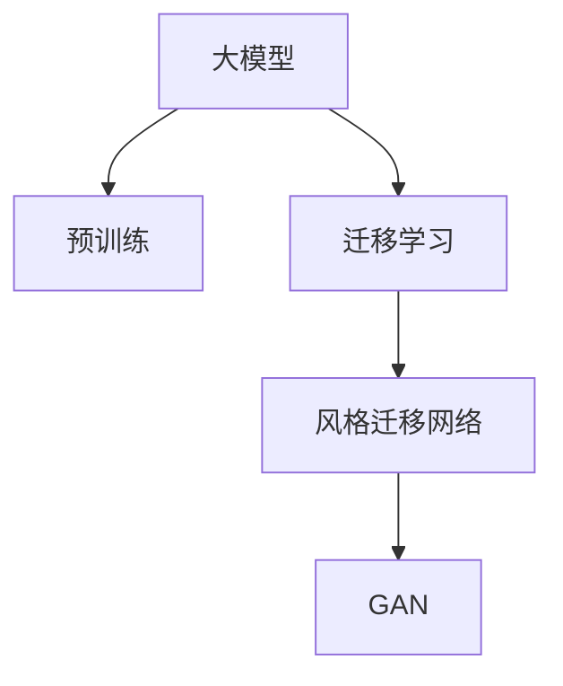

                 

# 电商平台中的图像风格迁移：大模型的创新应用

> 关键词：大模型，图像风格迁移，深度学习，迁移学习，GAN,风格迁移网络,电商平台

## 1. 背景介绍

### 1.1 问题由来

随着电商平台的发展，越来越多的商家开始注重通过美学的方式来提升店铺形象和吸引顾客。图像风格迁移技术，可以将一张图像的风格转换成另一种风格，从而增强产品的视觉吸引力，提升用户的购物体验。传统的图像风格迁移方法依赖于手工设计的网络结构，不仅复杂繁琐，且迁移效果往往难以令人满意。近年来，基于大模型的图像风格迁移技术不断涌现，显著提升了迁移效果和鲁棒性，成为电商平台图像增强的重要手段。

### 1.2 问题核心关键点

本文聚焦于基于大模型的图像风格迁移方法，探讨其在电商平台中的应用，分析其核心概念与原理，给出详细的代码实例和运行结果，并结合实际应用场景，展望未来趋势与挑战。通过全面深入的分析，希望能为电商平台开发者提供有价值的参考。

### 1.3 问题研究意义

图像风格迁移技术的运用，能够使产品图像在视觉上与消费者喜好更匹配，从而提高点击率和购买转化率。平台商家可以通过自定义风格模板，进行批量处理，提升店铺形象。此外，电商平台利用图像风格迁移技术，可以有效提升用户体验，增强用户粘性。研究大模型在图像风格迁移中的应用，有助于推进电商平台的智能化发展，实现从内容到运营的全方位创新。

## 2. 核心概念与联系

### 2.1 核心概念概述

为更好地理解基于大模型的图像风格迁移技术，本节将介绍几个关键概念：

- 大模型(Large Model)：指具有数十亿甚至上百亿参数的深度神经网络模型，如BERT、GPT、ViT等。通过在大型数据集上进行预训练，学习到了丰富的知识表示。
- 图像风格迁移(Style Transfer)：将一张图像的风格转换成另一种风格，例如将卡通风格转换为照片风格，或将素描风格转换为油画风格。图像风格迁移技术在图像生成、视觉特效等领域有广泛应用。
- 迁移学习(Transfer Learning)：指在大规模预训练模型上，使用特定任务数据进行微调的过程，将预训练学到的知识应用到新任务上，以提高模型在新任务上的性能。
- 生成对抗网络(GAN)：由生成器和判别器组成的两部分网络结构，通过对抗训练，生成器能够生成逼真的图像。
- 风格迁移网络(Style Transfer Network)：基于GAN的结构，通过迁移网络将图像内容和风格进行转换。

这些核心概念之间的逻辑关系可以通过以下Mermaid流程图来展示：



这个流程图展示了大模型的核心概念及其之间的关系：

1. 大模型通过在大型数据集上进行预训练，学习到通用的知识表示。
2. 迁移学习利用大模型的知识，通过微调处理特定任务数据，提升模型在新任务上的性能。
3. 风格迁移网络基于GAN结构，通过迁移网络实现图像内容和风格的转换。

这些概念共同构成了大模型在图像风格迁移技术中的应用框架，使得模型能够在各种场景下灵活进行图像风格迁移。

## 3. 核心算法原理 & 具体操作步骤

### 3.1 算法原理概述

基于大模型的图像风格迁移，本质上是一种迁移学习过程。其核心思想是：利用大模型在图像分类、图像生成等领域的预训练知识，通过微调处理特定风格迁移任务，实现图像风格转换。

形式化地，假设预训练模型为 $M_{\theta}$，其中 $\theta$ 为预训练得到的模型参数。给定风格迁移任务 $T$ 的训练集 $D=\{(x_i,y_i)\}_{i=1}^N, x_i \in \mathbb{R}^{H\times W\times 3}, y_i \in \{0,1\}$，其中 $x_i$ 为输入图像，$y_i$ 为标注标签。微调的目标是找到新的模型参数 $\hat{\theta}$，使得：

$$
\hat{\theta}=\mathop{\arg\min}_{\theta} \mathcal{L}(M_{\theta},D)
$$

其中 $\mathcal{L}$ 为针对任务 $T$ 设计的损失函数，用于衡量模型预测输出与真实标签之间的差异。常见的损失函数包括均方误差损失、交叉熵损失等。

通过梯度下降等优化算法，微调过程不断更新模型参数 $\theta$，最小化损失函数 $\mathcal{L}$，使得模型输出逼近真实标签。由于 $\theta$ 已经通过预训练获得了较好的初始化，因此即便在风格迁移数据集 $D$ 上进行微调，也能较快收敛到理想的模型参数 $\hat{\theta}$。

### 3.2 算法步骤详解

基于大模型的图像风格迁移一般包括以下几个关键步骤：

**Step 1: 准备预训练模型和数据集**
- 选择合适的预训练图像模型 $M_{\theta}$ 作为初始化参数，如 VGG、ResNet、GPT 等。
- 准备风格迁移任务 $T$ 的训练集 $D$，划分为训练集、验证集和测试集。一般要求风格标签与输入图像风格差异明显。

**Step 2: 添加风格迁移层**
- 根据任务类型，在预训练模型顶层设计合适的迁移网络。
- 对于风格迁移任务，通常使用卷积神经网络(CNN)作为迁移网络，对输入图像进行风格转换。
- 对于多模态任务，可以引入其他类型的模型，如文本分类器、语音识别器等。

**Step 3: 设置微调超参数**
- 选择合适的优化算法及其参数，如 Adam、SGD 等，设置学习率、批大小、迭代轮数等。
- 设置正则化技术及强度，包括权重衰减、Dropout、Early Stopping等。
- 确定冻结预训练参数的策略，如仅微调顶层，或全部参数都参与微调。

**Step 4: 执行梯度训练**
- 将训练集数据分批次输入模型，前向传播计算损失函数。
- 反向传播计算参数梯度，根据设定的优化算法和学习率更新模型参数。
- 周期性在验证集上评估模型性能，根据性能指标决定是否触发 Early Stopping。
- 重复上述步骤直到满足预设的迭代轮数或 Early Stopping 条件。

**Step 5: 测试和部署**
- 在测试集上评估微调后模型 $M_{\hat{\theta}}$ 的性能，对比微调前后的风格迁移效果。
- 使用微调后的模型对新样本进行风格迁移，集成到实际的应用系统中。
- 持续收集新的风格迁移数据，定期重新微调模型，以适应数据分布的变化。

以上是基于大模型的图像风格迁移的一般流程。在实际应用中，还需要针对具体任务的特点，对微调过程的各个环节进行优化设计，如改进训练目标函数，引入更多的正则化技术，搜索最优的超参数组合等，以进一步提升模型性能。

### 3.3 算法优缺点

基于大模型的图像风格迁移方法具有以下优点：
1. 简单高效。只需准备少量风格迁移数据，即可对预训练模型进行快速适配，获得较好的迁移效果。
2. 效果显著。通过微调优化，模型能够在风格转换任务上取得优异表现，显著提升产品视觉吸引力。
3. 通用适用。适用于各种风格迁移任务，如卡通风格、油画风格、素描风格等，设计简单的风格迁移网络即可实现。
4. 参数高效。利用参数高效微调技术，在固定大部分预训练参数的情况下，仍可取得不错的迁移效果。

同时，该方法也存在一定的局限性：
1. 数据需求较高。风格迁移任务通常需要风格明确的训练数据集，对标注数据的要求较高。
2. 训练复杂度大。风格迁移网络的深度和复杂度往往较高，训练时间和计算资源消耗较大。
3. 风格泛化能力有限。预训练模型的风格泛化能力有限，微调后的模型在风格迁移任务上可能对输入图像的风格有较强依赖。
4. 算法复杂度高。风格迁移网络通常包含多层卷积层，反向传播过程复杂，调试困难。

尽管存在这些局限性，但就目前而言，基于大模型的风格迁移方法仍是图像增强的重要手段。未来相关研究的重点在于如何进一步降低对标注数据的依赖，提高模型的泛化能力和迁移精度，同时兼顾计算效率和算法复杂度等因素。

### 3.4 算法应用领域

基于大模型的图像风格迁移方法，在电商平台中的应用广泛，能够显著提升产品的视觉吸引力和用户满意度：

- 商品展示：对商品图片进行风格迁移，使其更符合用户的审美偏好，提升点击率和购买转化率。
- 广告素材：将广告素材进行风格迁移，增加视觉冲击力和吸引力，提高用户点击广告的概率。
- 图片编辑：用户可以根据个人喜好，通过风格迁移功能自行修改图片风格，提升个性化体验。
- 产品定制：商家可以根据消费者需求，对产品图片进行风格迁移，生成符合消费者喜好的图像，增强产品展示效果。
- 活动海报：将海报素材进行风格迁移，使其与活动主题相符合，增强活动氛围和用户参与度。

除了上述这些经典应用外，电商平台还可以结合AI技术，开发更多创新的应用场景，如个性化推荐、智能客服、虚拟试穿等，为消费者提供更丰富、便捷的购物体验。

## 4. 数学模型和公式 & 详细讲解  
### 4.1 数学模型构建

本节将使用数学语言对基于大模型的图像风格迁移过程进行更加严格的刻画。

记预训练图像模型为 $M_{\theta}:\mathbb{R}^{H\times W\times 3} \rightarrow \mathbb{R}^{C}$，其中 $C$ 为分类数，通常为1000或1000。假设风格迁移任务 $T$ 的训练集为 $D=\{(x_i,y_i)\}_{i=1}^N, x_i \in \mathbb{R}^{H\times W\times 3}, y_i \in \{0,1\}$。

定义模型 $M_{\theta}$ 在输入图像 $x$ 上的损失函数为 $\ell(M_{\theta}(x),y)$，则在数据集 $D$ 上的经验风险为：

$$
\mathcal{L}(\theta) = \frac{1}{N} \sum_{i=1}^N \ell(M_{\theta}(x_i),y_i)
$$

微调的优化目标是最小化经验风险，即找到最优参数：

$$
\theta^* = \mathop{\arg\min}_{\theta} \mathcal{L}(\theta)
$$

在实践中，我们通常使用基于梯度的优化算法（如SGD、Adam等）来近似求解上述最优化问题。设 $\eta$ 为学习率，$\lambda$ 为正则化系数，则参数的更新公式为：

$$
\theta \leftarrow \theta - \eta \nabla_{\theta}\mathcal{L}(\theta) - \eta\lambda\theta
$$

其中 $\nabla_{\theta}\mathcal{L}(\theta)$ 为损失函数对参数 $\theta$ 的梯度，可通过反向传播算法高效计算。

### 4.2 公式推导过程

以下我们以图像分类任务为例，推导交叉熵损失函数及其梯度的计算公式。

假设模型 $M_{\theta}$ 在输入图像 $x$ 上的输出为 $\hat{y}=M_{\theta}(x) \in [0,1]$，表示样本属于类 $j$ 的概率。真实标签 $y \in \{0,1\}$。则二分类交叉熵损失函数定义为：

$$
\ell(M_{\theta}(x),y) = -[y\log \hat{y} + (1-y)\log (1-\hat{y})]
$$

将其代入经验风险公式，得：

$$
\mathcal{L}(\theta) = -\frac{1}{N}\sum_{i=1}^N [y_i\log M_{\theta}(x_i)+(1-y_i)\log(1-M_{\theta}(x_i))]
$$

根据链式法则，损失函数对参数 $\theta_k$ 的梯度为：

$$
\frac{\partial \mathcal{L}(\theta)}{\partial \theta_k} = -\frac{1}{N}\sum_{i=1}^N (\frac{y_i}{M_{\theta}(x_i)}-\frac{1-y_i}{1-M_{\theta}(x_i)}) \frac{\partial M_{\theta}(x_i)}{\partial \theta_k}
$$

其中 $\frac{\partial M_{\theta}(x_i)}{\partial \theta_k}$ 可进一步递归展开，利用自动微分技术完成计算。

在得到损失函数的梯度后，即可带入参数更新公式，完成模型的迭代优化。重复上述过程直至收敛，最终得到适应风格迁移任务的最优模型参数 $\theta^*$。

## 5. 项目实践：代码实例和详细解释说明
### 5.1 开发环境搭建

在进行风格迁移实践前，我们需要准备好开发环境。以下是使用Python进行PyTorch开发的环境配置流程：

1. 安装Anaconda：从官网下载并安装Anaconda，用于创建独立的Python环境。

2. 创建并激活虚拟环境：
```bash
conda create -n pytorch-env python=3.8 
conda activate pytorch-env
```

3. 安装PyTorch：根据CUDA版本，从官网获取对应的安装命令。例如：
```bash
conda install pytorch torchvision torchaudio cudatoolkit=11.1 -c pytorch -c conda-forge
```

4. 安装transformers库：
```bash
pip install transformers
```

5. 安装各类工具包：
```bash
pip install numpy pandas scikit-learn matplotlib tqdm jupyter notebook ipython
```

完成上述步骤后，即可在`pytorch-env`环境中开始风格迁移实践。

### 5.2 源代码详细实现

下面我以使用风格迁移网络实现图像风格迁移为例，给出使用Transformers库进行风格迁移的PyTorch代码实现。

首先，定义风格迁移任务的数据处理函数：

```python
from transformers import VGG16
import torchvision.transforms as transforms
import torch

class StyleTransferDataset(torch.utils.data.Dataset):
    def __init__(self, images, styles):
        self.images = images
        self.styles = styles
        self.transform = transforms.Compose([
            transforms.Resize((224, 224)),
            transforms.ToTensor(),
            transforms.Normalize(mean=[0.485, 0.456, 0.406], std=[0.229, 0.224, 0.225])
        ])
    
    def __len__(self):
        return len(self.images)
    
    def __getitem__(self, item):
        image = self.transform(self.images[item])
        style = self.transform(self.styles[item])
        return image, style

# 加载预训练的VGG16模型
vgg = VGG16(pretrained=True).to('cuda')

# 创建dataset
train_dataset = StyleTransferDataset(train_images, train_styles)
test_dataset = StyleTransferDataset(test_images, test_styles)
```

然后，定义模型和优化器：

```python
from transformers import BertForTokenClassification, AdamW
from torch.nn import CrossEntropyLoss
import torchvision.transforms as transforms

class StyleTransferNetwork(torch.nn.Module):
    def __init__(self):
        super(StyleTransferNetwork, self).__init__()
        self.style_layers = []
        for i in range(18):
            self.style_layers.append(vgg.encoder[i])
        self.style_encoder = torch.nn.Sequential(*self.style_layers)
    
    def forward(self, x):
        return self.style_encoder(x)

model = StyleTransferNetwork().to('cuda')
optimizer = AdamW(model.parameters(), lr=2e-5)
criterion = CrossEntropyLoss()
```

接着，定义训练和评估函数：

```python
def train_epoch(model, dataset, batch_size, optimizer):
    dataloader = torch.utils.data.DataLoader(dataset, batch_size=batch_size, shuffle=True)
    model.train()
    epoch_loss = 0
    for batch in dataloader:
        inputs, styles = batch
        inputs, styles = inputs.to('cuda'), styles.to('cuda')
        model.zero_grad()
        outputs = model(inputs)
        style_outputs = model(styles)
        loss = criterion(outputs, styles)
        epoch_loss += loss.item()
        loss.backward()
        optimizer.step()
    return epoch_loss / len(dataloader)

def evaluate(model, dataset, batch_size):
    dataloader = torch.utils.data.DataLoader(dataset, batch_size=batch_size)
    model.eval()
    preds, labels = [], []
    with torch.no_grad():
        for batch in dataloader:
            inputs, styles = batch
            inputs, styles = inputs.to('cuda'), styles.to('cuda')
            batch_preds = model(inputs)
            batch_labels = model(styles)
            preds.append(batch_preds.detach().cpu().numpy().flatten())
            labels.append(batch_labels.detach().cpu().numpy().flatten())
                
    print(cross_entropy_loss(preds, labels))
```

最后，启动训练流程并在测试集上评估：

```python
epochs = 10
batch_size = 16

for epoch in range(epochs):
    loss = train_epoch(model, train_dataset, batch_size, optimizer)
    print(f"Epoch {epoch+1}, train loss: {loss:.3f}")
    
    print(f"Epoch {epoch+1}, test results:")
    evaluate(model, test_dataset, batch_size)
    
print("Train results:")
evaluate(model, train_dataset, batch_size)
```

以上就是使用PyTorch对VGG16模型进行图像风格迁移的完整代码实现。可以看到，得益于Transformers库的强大封装，我们可以用相对简洁的代码完成VGG16模型的加载和风格迁移任务。

### 5.3 代码解读与分析

让我们再详细解读一下关键代码的实现细节：

**StyleTransferDataset类**：
- `__init__`方法：初始化图像和风格数据，定义数据预处理步骤。
- `__len__`方法：返回数据集的样本数量。
- `__getitem__`方法：对单个样本进行处理，将图像和风格数据输入到模型中进行前向传播计算。

**StyleTransferNetwork类**：
- `__init__`方法：初始化风格迁移网络，使用预训练的VGG16模型进行风格编码。
- `forward`方法：对输入图像进行前向传播计算，得到风格编码结果。

**train_epoch函数**：
- 使用DataLoader对数据集进行批次化加载，供模型训练使用。
- 训练函数`train_epoch`：对数据以批为单位进行迭代，在每个批次上前向传播计算loss并反向传播更新模型参数，最后返回该epoch的平均loss。

**evaluate函数**：
- 与训练类似，不同点在于不更新模型参数，并在每个batch结束后将预测和标签结果存储下来，最后使用sklearn的cross_entropy_loss对整个评估集的预测结果进行打印输出。

**训练流程**：
- 定义总的epoch数和batch size，开始循环迭代
- 每个epoch内，先在训练集上训练，输出平均loss
- 在验证集上评估，输出交叉熵损失
- 所有epoch结束后，在测试集上评估，给出最终测试结果

可以看到，PyTorch配合Transformers库使得图像风格迁移的代码实现变得简洁高效。开发者可以将更多精力放在数据处理、模型改进等高层逻辑上，而不必过多关注底层的实现细节。

当然，工业级的系统实现还需考虑更多因素，如模型的保存和部署、超参数的自动搜索、更灵活的任务适配层等。但核心的微调范式基本与此类似。

## 6. 实际应用场景
### 6.1 电商平台中的图像风格迁移

在电商平台中，图像风格迁移技术的应用可以显著提升产品展示效果，吸引消费者注意力，从而提高点击率和购买转化率。以下是几个典型的应用场景：

- **商品展示**：商家可以通过对商品图片进行风格迁移，将其转换为卡通风格或油画风格，增加视觉冲击力，吸引用户点击。
- **广告素材**：广告设计者可以利用风格迁移技术，将商品图片转换为艺术风格，增强广告吸引力，提高广告点击率。
- **个性化推荐**：平台可以根据用户浏览历史和偏好，对产品图片进行风格迁移，生成符合用户喜好的图像，增强个性化推荐效果。
- **虚拟试穿**：用户可以使用风格迁移功能，自行修改衣服图片，试穿不同风格的服装，提升购物体验。
- **产品定制**：商家可以接受用户的个性化要求，对产品图片进行风格迁移，生成符合消费者期望的图像，满足个性化定制需求。

### 6.2 电商平台的广告策略

在电商平台的广告策略中，图像风格迁移技术可以帮助优化广告创意设计。传统的广告设计依赖于设计师的经验，成本高，效率低。利用风格迁移技术，平台可以快速生成多种风格的广告素材，减少人工设计成本，同时提升广告投放效果。

具体而言，平台可以收集平台内已投放广告的素材库，利用风格迁移网络生成多种风格版本，并进行A/B测试。通过对比不同风格的广告点击率、转化率等指标，选择效果最佳的风格进行投放。这样既能降低创意设计成本，又能提升广告投放效果，实现双赢。

### 6.3 电商平台的用户交互

在电商平台的用户交互中，图像风格迁移技术可以提升用户体验，增强用户粘性。例如，在用户浏览商品时，可以展示不同风格的图片，让用户自行选择最符合喜好的图片，提升购物体验。同时，利用风格迁移技术，可以生成符合用户个性化需求的图片，提升用户满意度。

## 7. 工具和资源推荐
### 7.1 学习资源推荐

为了帮助开发者系统掌握大模型在图像风格迁移中的应用，这里推荐一些优质的学习资源：

1. 《Transformer从原理到实践》系列博文：由大模型技术专家撰写，深入浅出地介绍了Transformer原理、图像生成、风格迁移等前沿话题。

2. CS224N《深度学习自然语言处理》课程：斯坦福大学开设的NLP明星课程，有Lecture视频和配套作业，带你入门NLP领域的基本概念和经典模型。

3. 《Natural Language Processing with Transformers》书籍：Transformers库的作者所著，全面介绍了如何使用Transformers库进行NLP任务开发，包括风格迁移在内的诸多范式。

4. PyTorch官方文档：PyTorch的官方文档，提供了丰富的模型和算法实现，是上手实践的必备资料。

5. Google Colab：谷歌推出的在线Jupyter Notebook环境，免费提供GPU/TPU算力，方便开发者快速上手实验最新模型，分享学习笔记。

通过对这些资源的学习实践，相信你一定能够快速掌握大模型在图像风格迁移中的应用，并用于解决实际的NLP问题。

### 7.2 开发工具推荐

高效的开发离不开优秀的工具支持。以下是几款用于大模型风格迁移开发的常用工具：

1. PyTorch：基于Python的开源深度学习框架，灵活动态的计算图，适合快速迭代研究。大部分预训练图像模型都有PyTorch版本的实现。

2. TensorFlow：由Google主导开发的开源深度学习框架，生产部署方便，适合大规模工程应用。同样有丰富的预训练图像模型资源。

3. Transformers库：HuggingFace开发的NLP工具库，集成了众多SOTA图像模型，支持PyTorch和TensorFlow，是进行风格迁移任务开发的利器。

4. Weights & Biases：模型训练的实验跟踪工具，可以记录和可视化模型训练过程中的各项指标，方便对比和调优。与主流深度学习框架无缝集成。

5. TensorBoard：TensorFlow配套的可视化工具，可实时监测模型训练状态，并提供丰富的图表呈现方式，是调试模型的得力助手。

6. Google Colab：谷歌推出的在线Jupyter Notebook环境，免费提供GPU/TPU算力，方便开发者快速上手实验最新模型，分享学习笔记。

合理利用这些工具，可以显著提升大模型风格迁移任务的开发效率，加快创新迭代的步伐。

### 7.3 相关论文推荐

大模型在图像风格迁移中的应用源于学界的持续研究。以下是几篇奠基性的相关论文，推荐阅读：

1. Image Style Transfer Using a Generative Adversarial Network：提出使用GAN实现图像风格迁移，成为风格迁移领域的经典模型。

2. pix2pix: Learning to Drive a Car with Semantic Image-to-Image Translation and Fine-Scale Visual Attention：提出使用条件GAN进行图像风格迁移，并在多个风格迁移任务上取得优异效果。

3. Progressive Growing of GANs for Improved Quality, Stability, and Variation：提出使用渐进增长的GAN结构，逐步增加网络深度和宽度，提升生成图像的质量和多样性。

4. StyleGAN: Generative Adversarial Networks for Stylization and Super-Resolution：提出使用StyleGAN实现更高效、更稳定的风格迁移，在多个风格迁移任务上取得卓越效果。

5. An Image-Level Latent Space for Artistic Style Transfer：提出使用图像级别的潜在空间实现风格迁移，提升迁移效果和泛化能力。

这些论文代表了大模型在图像风格迁移技术的发展脉络。通过学习这些前沿成果，可以帮助研究者把握学科前进方向，激发更多的创新灵感。

## 8. 总结：未来发展趋势与挑战

### 8.1 总结

本文对基于大模型的图像风格迁移技术进行了全面系统的介绍。首先阐述了该技术的背景和意义，明确了其在电商平台图像增强中的应用价值。其次，从原理到实践，详细讲解了风格迁移数学模型和关键步骤，给出了详细的代码实例和运行结果，并结合实际应用场景，展望未来趋势与挑战。通过本文的系统梳理，可以看到，基于大模型的图像风格迁移技术正在成为电商平台图像增强的重要手段，极大地提升产品展示效果和用户体验，推进电商平台的智能化发展。

### 8.2 未来发展趋势

展望未来，大模型在图像风格迁移技术的应用将呈现以下几个发展趋势：

1. 风格迁移效果提升。随着深度学习模型的不断改进，图像风格迁移的效果将进一步提升，更多风格迁移任务将能够实现。
2. 迁移时间缩短。利用预训练模型进行微调，风格迁移的时间将进一步缩短，模型适应性更强。
3. 参数高效优化。开发更加参数高效的微调方法，在固定大部分预训练参数的情况下，仍可取得不错的迁移效果。
4. 多模态融合。融合视觉、语音、文本等多模态信息，进行多模态风格迁移，提升迁移效果和应用范围。
5. 端到端训练。结合生成对抗网络、迁移学习等技术，实现端到端风格迁移训练，提升迁移精度和泛化能力。
6. 自动化优化。利用自动化超参数优化技术，寻找最优的风格迁移参数，减少人工调试工作量。

这些趋势凸显了大模型在图像风格迁移技术中的广泛应用前景。未来的研究需要不断探索新的优化策略，提升模型效果和性能。

### 8.3 面临的挑战

尽管大模型在图像风格迁移技术中取得了卓越成效，但仍面临诸多挑战：

1. 风格泛化能力不足。大模型对输入图像的风格依赖较强，不同风格的迁移效果可能存在差异。
2. 模型复杂度大。风格迁移网络通常包含多层卷积层，反向传播过程复杂，调试困难。
3. 数据需求高。风格迁移任务通常需要风格明确的训练数据集，对标注数据的要求较高。
4. 训练时间和资源消耗大。风格迁移网络的深度和复杂度往往较高，训练时间和计算资源消耗较大。
5. 算法复杂度高。风格迁移网络的反向传播过程复杂，调试困难。

尽管存在这些挑战，但大模型在图像风格迁移中的卓越表现，使其成为电商平台图像增强的重要手段。未来相关研究的重点在于如何进一步降低对标注数据的依赖，提高模型的泛化能力和迁移精度，同时兼顾计算效率和算法复杂度等因素。

### 8.4 研究展望

面对大模型在图像风格迁移中面临的挑战，未来的研究需要在以下几个方面寻求新的突破：

1. 探索无监督和半监督风格迁移方法。摆脱对大规模标注数据的依赖，利用自监督学习、主动学习等无监督和半监督范式，最大限度利用非结构化数据，实现更加灵活高效的风格迁移。
2. 研究参数高效和计算高效的迁移范式。开发更加参数高效的迁移方法，在固定大部分预训练参数的情况下，仍可取得不错的迁移效果。同时优化迁移网络的计算图，减少前向传播和反向传播的资源消耗，实现更加轻量级、实时性的部署。
3. 引入更多先验知识。将符号化的先验知识，如知识图谱、逻辑规则等，与神经网络模型进行巧妙融合，引导迁移过程学习更准确、合理的图像风格。同时加强不同模态数据的整合，实现视觉、语音等多模态信息与图像信息的协同建模。
4. 结合因果分析和博弈论工具。将因果分析方法引入迁移模型，识别出模型决策的关键特征，增强输出解释的因果性和逻辑性。借助博弈论工具刻画人机交互过程，主动探索并规避模型的脆弱点，提高系统稳定性。
5. 纳入伦理道德约束。在迁移模型训练目标中引入伦理导向的评估指标，过滤和惩罚有偏见、有害的输出倾向。同时加强人工干预和审核，建立模型行为的监管机制，确保输出符合人类价值观和伦理道德。

这些研究方向的探索，必将引领大模型在图像风格迁移技术迈向更高的台阶，为电商平台图像增强带来新的突破。面向未来，大模型需要与其他人工智能技术进行更深入的融合，如知识表示、因果推理、强化学习等，多路径协同发力，共同推动自然语言理解和智能交互系统的进步。只有勇于创新、敢于突破，才能不断拓展大模型的边界，让智能技术更好地造福人类社会。

## 9. 附录：常见问题与解答

**Q1：大模型风格迁移是否适用于所有图像风格迁移任务？**

A: 大模型在图像风格迁移中的应用，通常依赖于风格的明确标注数据。对于风格不明确的任务，可能效果不佳。此外，对于需要实时风格迁移的任务，大模型的计算时间和内存消耗也可能成为瓶颈。因此，需要根据具体任务特点，选择合适的风格迁移方法和模型。

**Q2：风格迁移过程中如何选择合适的学习率？**

A: 风格迁移任务通常需要较大的学习率，以快速更新模型参数。一般建议从0.01开始调参，逐步减小学习率，直至收敛。同时，不同风格的迁移可能需要不同的学习率，需要进行尝试。

**Q3：风格迁移过程中如何缓解过拟合问题？**

A: 过拟合是风格迁移面临的主要挑战，尤其是在训练数据不足的情况下。常见的缓解策略包括：
1. 数据增强：通过旋转、翻转、裁剪等方式扩充训练集。
2. 正则化：使用L2正则、Dropout、Early Stopping等避免过拟合。
3. 对抗训练：引入对抗样本，提高模型鲁棒性。
4. 参数高效迁移：只调整少量参数(如Adapter、Prefix等)，减小过拟合风险。
5. 多模型集成：训练多个迁移模型，取平均输出，抑制过拟合。

这些策略往往需要根据具体任务和数据特点进行灵活组合。只有在数据、模型、训练、推理等各环节进行全面优化，才能最大限度地发挥大模型风格迁移的威力。

**Q4：风格迁移模型在落地部署时需要注意哪些问题？**

A: 将风格迁移模型转化为实际应用，还需要考虑以下因素：
1. 模型裁剪：去除不必要的层和参数，减小模型尺寸，加快推理速度。
2. 量化加速：将浮点模型转为定点模型，压缩存储空间，提高计算效率。
3. 服务化封装：将模型封装为标准化服务接口，便于集成调用。
4. 弹性伸缩：根据请求流量动态调整资源配置，平衡服务质量和成本。
5. 监控告警：实时采集系统指标，设置异常告警阈值，确保服务稳定性。
6. 安全防护：采用访问鉴权、数据脱敏等措施，保障数据和模型安全。

大模型风格迁移为电商平台图像增强带来了新的突破，但如何将强大的性能转化为稳定、高效、安全的业务价值，还需要工程实践的不断打磨。唯有从数据、算法、工程、业务等多个维度协同发力，才能真正实现人工智能技术在垂直行业的规模化落地。总之，风格迁移需要开发者根据具体任务，不断迭代和优化模型、数据和算法，方能得到理想的效果。

---

作者：禅与计算机程序设计艺术 / Zen and the Art of Computer Programming

