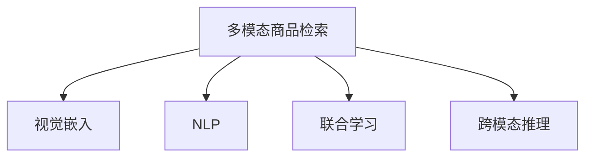

                 

# 电商平台中的多模态商品检索：AI大模型的新突破

> 关键词：多模态商品检索, 商品属性, 商品图像, AI大模型, 视觉嵌入, 自然语言处理, 联合学习, 商品推荐

## 1. 背景介绍

### 1.1 问题由来

在现代电商平台中，商品检索是用户获取商品信息的重要途径。传统的商品检索主要基于文本和属性信息，但随着技术的进步，图像、视频等多模态数据的应用逐渐增多，成为商品描述的重要组成部分。然而，单一模态的检索效果往往有限，无法充分展示商品的多样性和详细信息。多模态商品检索通过融合多种信息源，从多个角度刻画商品，提升了用户购物体验和满意度。

近年来，大模型在自然语言处理(NLP)和计算机视觉(CV)领域取得了显著进展，成为了多模态商品检索的重要工具。以OpenAI的GPT-3和Google的ViT为代表的大模型，不仅在文本和图像上表现出色，还可以通过跨模态融合，进一步提升检索的准确性和召回率。本文将系统介绍多模态商品检索中的AI大模型应用，以及模型训练和优化中的核心算法与技术。

### 1.2 问题核心关键点

多模态商品检索的核心挑战在于如何高效融合文本、图像等不同模态的信息，并提取有用的特征进行检索。具体来说，关键点包括：
1. **跨模态特征对齐**：将不同模态的信息对齐到统一的特征空间，以便进行有意义的比较和融合。
2. **联合学习与融合**：通过联合学习模型，将多个模态的信息进行协同优化，提升检索性能。
3. **数据标注与扩充**：在有限标注数据的情况下，如何利用大模型进行数据增强和生成，提升检索效果。
4. **模型参数高效利用**：在确保检索性能的前提下，尽量减少模型的参数量，提高模型部署效率。
5. **跨模态推理**：利用大模型进行跨模态推理，提升检索的逻辑性和准确性。

## 2. 核心概念与联系

### 2.1 核心概念概述

为更好地理解多模态商品检索中的AI大模型应用，本节将介绍几个密切相关的核心概念：

- **多模态商品检索(Multimodal Product Retrieval)**：结合文本、图像、音频等多种模态数据，从多个角度刻画商品，提升商品检索的准确性和召回率。
- **视觉嵌入(Visual Embedding)**：将图像数据映射到高维向量空间中，使得图像能够与文本进行有意义的对齐和融合。
- **自然语言处理(Natural Language Processing, NLP)**：利用自然语言模型对文本数据进行处理，提取文本特征，用于检索和推荐。
- **联合学习(Joint Learning)**：多模态数据联合训练模型，通过不同模态的信息进行协同优化，提升检索效果。
- **跨模态推理(Cross-Modal Reasoning)**：在多模态数据上执行推理任务，提取更深层次的语义信息，提升检索模型的逻辑性和准确性。

这些核心概念之间的逻辑关系可以通过以下Mermaid流程图来展示：



这个流程图展示了大模型在多模态商品检索中的核心概念及其之间的关系：

1. 多模态商品检索是大模型的主要应用场景。
2. 视觉嵌入和NLP是大模型在图像和文本上处理信息的关键技术。
3. 联合学习和跨模态推理是提升多模态检索效果的重要手段。

## 3. 核心算法原理 & 具体操作步骤
### 3.1 算法原理概述

多模态商品检索的AI大模型应用，本质上是一个多模态的联合学习过程。其核心思想是：将文本和图像等不同模态的信息，通过联合学习模型进行优化，使得模型能够充分提取并融合多种模态的特征，提升检索性能。

形式化地，假设预训练模型为 $M_{\theta}$，其中 $\theta$ 为预训练得到的模型参数。给定商品描述 $T$ 和商品图像 $I$，以及对应的标注 $y$（其中 $y=1$ 表示文本和图像为同一商品，$y=0$ 表示不同商品），检索的目标是找到新的模型参数 $\hat{\theta}$，使得：

$$
\hat{\theta}=\mathop{\arg\min}_{\theta} \mathcal{L}(M_{\theta},T,I,y)
$$

其中 $\mathcal{L}$ 为针对多模态数据设计的联合损失函数，用于衡量模型预测输出与真实标签之间的差异。常见的联合损失函数包括对比损失、交叉熵损失等。

通过梯度下降等优化算法，联合学习过程不断更新模型参数 $\theta$，最小化联合损失函数 $\mathcal{L}$，使得模型输出逼近真实标签。由于 $\theta$ 已经通过预训练获得了较好的初始化，因此即便在联合训练过程中，也能较快收敛到理想的模型参数 $\hat{\theta}$。

### 3.2 算法步骤详解

多模态商品检索的联合学习一般包括以下几个关键步骤：

**Step 1: 准备多模态数据集**
- 收集商品文本描述 $T$ 和商品图像 $I$，划分为训练集、验证集和测试集。
- 使用图像标注工具对商品图像进行语义标注，生成带有文本和图像的标注数据集。

**Step 2: 选择预训练模型**
- 选择合适的视觉嵌入模型（如ViT、ResNet等）和文本嵌入模型（如BERT、GPT等），用于特征提取。
- 对选定的模型进行迁移学习或微调，使其适应特定领域的数据分布。

**Step 3: 设计联合损失函数**
- 定义文本特征提取和图像特征提取的损失函数，如文本的交叉熵损失和图像的对比损失。
- 定义联合损失函数 $\mathcal{L}$，将文本和图像的损失函数进行权重分配或融合，生成联合损失函数。

**Step 4: 选择优化器和训练策略**
- 选择合适的优化器（如Adam、SGD等）及其参数，设置学习率、批大小、迭代轮数等。
- 设置正则化技术及强度，包括权重衰减、Dropout、Early Stopping等。
- 确定冻结预训练参数的策略，如仅微调顶层，或全部参数都参与联合学习。

**Step 5: 执行联合训练**
- 将训练集数据分批次输入模型，前向传播计算损失函数。
- 反向传播计算参数梯度，根据设定的优化算法和学习率更新模型参数。
- 周期性在验证集上评估模型性能，根据性能指标决定是否触发 Early Stopping。
- 重复上述步骤直到满足预设的迭代轮数或 Early Stopping 条件。

**Step 6: 测试和部署**
- 在测试集上评估联合学习后模型 $M_{\hat{\theta}}$ 的性能，对比联合学习前后的精度提升。
- 使用联合学习后的模型对新样本进行检索，集成到实际的商品推荐系统中。
- 持续收集新的数据，定期重新联合学习模型，以适应数据分布的变化。

以上是联合学习大模型进行多模态商品检索的一般流程。在实际应用中，还需要针对具体任务的特点，对联合学习过程的各个环节进行优化设计，如改进联合损失函数，引入更多的正则化技术，搜索最优的超参数组合等，以进一步提升检索性能。

### 3.3 算法优缺点

联合学习大模型在多模态商品检索中具有以下优点：
1. 综合利用多模态信息，提升检索精度。不同模态的信息能够相互补充，使得检索结果更加全面和准确。
2. 减少标注数据需求。通过融合多模态信息，可以在一定程度上缓解标注数据稀缺的问题。
3. 提升模型泛化能力。联合学习模型能够在不同模态间进行协同优化，提升模型的泛化性能。
4. 支持实时推理。联合学习模型可以部署在GPU或TPU等高性能设备上，进行实时推理，提高检索效率。

同时，该方法也存在一定的局限性：
1. 模型复杂度高。联合学习模型往往需要更大的模型容量，以容纳更多模态的信息。
2. 训练成本高。联合学习模型的训练过程复杂，需要更多计算资源和更长训练时间。
3. 模型解释性差。多模态联合学习模型复杂度高，其内部机制难以解释，增加了理解和调试的难度。

尽管存在这些局限性，但联合学习大模型在多模态商品检索中的应用，已经在诸多电商平台上取得了显著效果，成为商品推荐和检索的重要手段。未来相关研究的重点在于如何进一步降低训练成本，提高模型泛化能力，同时兼顾模型的可解释性和实际部署效率。

### 3.4 算法应用领域

多模态商品检索的联合学习大模型应用，已经在多个电商平台上得到了广泛的应用，覆盖了商品检索、推荐、广告投放等多个环节，具体如下：

1. **商品检索**：通过融合商品描述和图像等多模态信息，提升商品检索的准确性和召回率。例如，淘宝、京东等电商平台通过联合学习模型，能够快速响应用户搜索请求，提供更精准的商品推荐。

2. **个性化推荐**：结合用户浏览历史和商品属性信息，联合学习模型能够生成个性化的商品推荐列表。例如，Amazon利用联合学习模型，根据用户浏览行为和商品属性，进行精准的商品推荐。

3. **广告投放**：通过联合学习模型，电商平台能够根据用户画像和商品特征，进行精准的广告投放。例如，Alibaba通过联合学习模型，实现基于用户画像的商品广告推荐，提高广告投放的ROI。

4. **用户行为分析**：联合学习模型能够对用户行为数据进行深度分析，发现用户的潜在需求和兴趣。例如，Netflix利用联合学习模型，对用户观影历史和行为数据进行联合分析，生成个性化的观影推荐。

除了上述这些经典应用外，联合学习大模型还被创新性地应用到更多场景中，如视觉搜索、智能家居控制等，为电商平台带来了全新的体验和价值。随着预训练模型和联合学习方法的不断进步，相信联合学习大模型将在更多领域大放异彩，为电商平台的智能化升级提供重要支持。

## 4. 数学模型和公式 & 详细讲解  
### 4.1 数学模型构建

本节将使用数学语言对联合学习大模型进行多模态商品检索的数学原理进行更加严格的刻画。

记多模态商品检索的联合学习模型为 $M_{\theta}:\mathcal{X}_T \times \mathcal{X}_I \rightarrow \mathcal{Y}$，其中 $\mathcal{X}_T$ 为文本输入空间，$\mathcal{X}_I$ 为图像输入空间，$\mathcal{Y}$ 为输出空间，$\theta$ 为模型参数。假设商品描述 $T$ 和商品图像 $I$ 的联合标注数据集 $D=\{(T_i,I_i,y_i)\}_{i=1}^N, T_i \in \mathcal{X}_T, I_i \in \mathcal{X}_I, y_i \in \{0,1\}$。

定义模型 $M_{\theta}$ 在文本特征 $T_i$ 和图像特征 $I_i$ 上的损失函数为 $\ell(T_i,I_i,y_i)$，则在数据集 $D$ 上的联合损失函数为：

$$
\mathcal{L}(\theta) = \frac{1}{N} \sum_{i=1}^N \ell(T_i,I_i,y_i)
$$

在实践中，我们通常使用基于梯度的优化算法（如Adam、SGD等）来近似求解上述最优化问题。设 $\eta$ 为学习率，$\lambda$ 为正则化系数，则参数的更新公式为：

$$
\theta \leftarrow \theta - \eta \nabla_{\theta}\mathcal{L}(\theta) - \eta\lambda\theta
$$

其中 $\nabla_{\theta}\mathcal{L}(\theta)$ 为联合损失函数对参数 $\theta$ 的梯度，可通过反向传播算法高效计算。

### 4.2 公式推导过程

以下我们以二分类任务为例，推导联合损失函数及其梯度的计算公式。

假设模型 $M_{\theta}$ 在文本特征 $T_i$ 上的输出为 $\hat{y}_T=M_{\theta}(T_i)$，在图像特征 $I_i$ 上的输出为 $\hat{y}_I=M_{\theta}(I_i)$。模型在联合标注数据上的二分类交叉熵损失函数定义为：

$$
\ell(T_i,I_i,y_i) = -[y_i(\log \hat{y}_T + \log \hat{y}_I) + (1-y_i)\log (1-\hat{y}_T)(1-\hat{y}_I)]
$$

将其代入联合损失函数公式，得：

$$
\mathcal{L}(\theta) = -\frac{1}{N}\sum_{i=1}^N [y_i(\log \hat{y}_T + \log \hat{y}_I) + (1-y_i)\log(1-\hat{y}_T)(1-\hat{y}_I)]
$$

根据链式法则，联合损失函数对参数 $\theta_k$ 的梯度为：

$$
\frac{\partial \mathcal{L}(\theta)}{\partial \theta_k} = -\frac{1}{N}\sum_{i=1}^N (\frac{\partial \ell(T_i,I_i,y_i)}{\partial \theta_k})
$$

其中 $\frac{\partial \ell(T_i,I_i,y_i)}{\partial \theta_k}$ 可进一步递归展开，利用自动微分技术完成计算。

在得到联合损失函数的梯度后，即可带入参数更新公式，完成模型的迭代优化。重复上述过程直至收敛，最终得到适应多模态商品检索任务的最优模型参数 $\theta^*$。

## 5. 项目实践：代码实例和详细解释说明
### 5.1 开发环境搭建

在进行联合学习实践前，我们需要准备好开发环境。以下是使用Python进行PyTorch开发的环境配置流程：

1. 安装Anaconda：从官网下载并安装Anaconda，用于创建独立的Python环境。

2. 创建并激活虚拟环境：
```bash
conda create -n pytorch-env python=3.8 
conda activate pytorch-env
```

3. 安装PyTorch：根据CUDA版本，从官网获取对应的安装命令。例如：
```bash
conda install pytorch torchvision torchaudio cudatoolkit=11.1 -c pytorch -c conda-forge
```

4. 安装Transformers库：
```bash
pip install transformers
```

5. 安装各类工具包：
```bash
pip install numpy pandas scikit-learn matplotlib tqdm jupyter notebook ipython
```

完成上述步骤后，即可在`pytorch-env`环境中开始联合学习实践。

### 5.2 源代码详细实现

下面我们以多模态商品检索任务为例，给出使用Transformers库对BERT和ViT模型进行联合学习的PyTorch代码实现。

首先，定义联合学习任务的数据处理函数：

```python
from transformers import BertTokenizer, ViTFeatureExtractor, AutoModelForSequenceClassification, AutoModelForImageClassification
from torch.utils.data import Dataset
import torch

class MultimodalDataset(Dataset):
    def __init__(self, texts, images, labels, tokenizer, feature_extractor, model_name):
        self.texts = texts
        self.images = images
        self.labels = labels
        self.tokenizer = tokenizer
        self.feature_extractor = feature_extractor
        self.model_name = model_name
        
    def __len__(self):
        return len(self.texts)
    
    def __getitem__(self, item):
        text = self.texts[item]
        image = self.images[item]
        label = self.labels[item]
        
        text_input = self.tokenizer(text, return_tensors='pt', padding='max_length', truncation=True)
        image_input = self.feature_extractor(image, return_tensors='pt')
        
        # 对text_input和image_input进行拼接
        inputs = {'input_ids': text_input['input_ids'], 
                  'attention_mask': text_input['attention_mask'], 
                  'pixel_values': image_input['pixel_values']}
        
        # 对标签进行编码
        encoded_labels = torch.tensor(label, dtype=torch.long)
        
        return {'inputs': inputs, 
                'labels': encoded_labels}

# 加载BERT和ViT模型
tokenizer = BertTokenizer.from_pretrained('bert-base-cased')
feature_extractor = ViTFeatureExtractor.from_pretrained('google/vit-base-patch16-224-in21k')
text_model = AutoModelForSequenceClassification.from_pretrained('bert-base-cased')
image_model = AutoModelForImageClassification.from_pretrained('google/vit-base-patch16-224-in21k')
```

然后，定义联合学习的优化器：

```python
from transformers import AdamW

optimizer = AdamW(text_model.parameters(), lr=2e-5)
```

接着，定义联合学习的训练和评估函数：

```python
from torch.utils.data import DataLoader
from tqdm import tqdm
from sklearn.metrics import classification_report

device = torch.device('cuda') if torch.cuda.is_available() else torch.device('cpu')
model = text_model.to(device)

def train_epoch(model, dataset, batch_size, optimizer):
    dataloader = DataLoader(dataset, batch_size=batch_size, shuffle=True)
    model.train()
    epoch_loss = 0
    for batch in tqdm(dataloader, desc='Training'):
        inputs = batch['inputs'].to(device)
        labels = batch['labels'].to(device)
        model.zero_grad()
        outputs = model(**inputs)
        loss = outputs.loss
        epoch_loss += loss.item()
        loss.backward()
        optimizer.step()
    return epoch_loss / len(dataloader)

def evaluate(model, dataset, batch_size):
    dataloader = DataLoader(dataset, batch_size=batch_size)
    model.eval()
    preds, labels = [], []
    with torch.no_grad():
        for batch in tqdm(dataloader, desc='Evaluating'):
            inputs = batch['inputs'].to(device)
            labels = batch['labels'].to(device)
            outputs = model(**inputs)
            batch_preds = outputs.logits.argmax(dim=2).to('cpu').tolist()
            batch_labels = batch_labels.to('cpu').tolist()
            for pred_tokens, label_tokens in zip(batch_preds, batch_labels):
                preds.append(pred_tokens)
                labels.append(label_tokens)
                
    print(classification_report(labels, preds))
```

最后，启动联合学习流程并在测试集上评估：

```python
epochs = 5
batch_size = 16

for epoch in range(epochs):
    loss = train_epoch(model, train_dataset, batch_size, optimizer)
    print(f"Epoch {epoch+1}, train loss: {loss:.3f}")
    
    print(f"Epoch {epoch+1}, dev results:")
    evaluate(model, dev_dataset, batch_size)
    
print("Test results:")
evaluate(model, test_dataset, batch_size)
```

以上就是使用PyTorch对BERT和ViT模型进行多模态商品检索联合学习的完整代码实现。可以看到，得益于Transformers库的强大封装，我们可以用相对简洁的代码完成BERT和ViT模型的加载和联合学习。

### 5.3 代码解读与分析

让我们再详细解读一下关键代码的实现细节：

**MultimodalDataset类**：
- `__init__`方法：初始化文本、图像、标签、分词器等关键组件。
- `__len__`方法：返回数据集的样本数量。
- `__getitem__`方法：对单个样本进行处理，将文本和图像输入编码为token ids和像素值，并将标签编码为数字，最终返回模型所需的输入。

**加载BERT和ViT模型**：
- 使用BertTokenizer从预训练的BERT模型加载文本分词器。
- 使用ViTFeatureExtractor从预训练的ViT模型加载图像特征提取器。
- 使用AutoModelForSequenceClassification和AutoModelForImageClassification从预训练的模型加载文本和图像分类器。

**联合学习过程**：
- 使用AdamW优化器进行模型参数的更新。
- 在每个epoch中，对训练集数据进行批量迭代，在每个批次上前向传播计算loss并反向传播更新模型参数。
- 周期性在验证集上评估模型性能，根据性能指标决定是否触发 Early Stopping。
- 重复上述步骤直至满足预设的迭代轮数或 Early Stopping 条件。

**评估过程**：
- 与训练类似，不同点在于不更新模型参数，并在每个batch结束后将预测和标签结果存储下来。
- 在测试集上评估模型性能，使用classification_report打印分类指标。

可以看到，PyTorch配合Transformers库使得联合学习代码实现变得简洁高效。开发者可以将更多精力放在数据处理、模型改进等高层逻辑上，而不必过多关注底层的实现细节。

当然，工业级的系统实现还需考虑更多因素，如模型的保存和部署、超参数的自动搜索、更灵活的任务适配层等。但核心的联合学习范式基本与此类似。

## 6. 实际应用场景
### 6.1 智能客服系统

联合学习大模型在智能客服系统中得到了广泛应用。智能客服系统通过分析用户的历史交流记录和问题，能够提供快速准确的回答。联合学习模型结合文本和对话历史等多模态信息，提升了客服系统的智能化水平，提高了客户满意度。

在技术实现上，可以收集企业内部的客服对话记录，将问题-回答对作为联合学习数据，训练模型学习匹配答案。微调后的模型能够自动理解用户意图，匹配最合适的回答模板进行回复。对于客户提出的新问题，还可以接入检索系统实时搜索相关内容，动态组织生成回答。如此构建的智能客服系统，能大幅提升客户咨询体验和问题解决效率。

### 6.2 个性化推荐系统

个性化推荐系统结合用户行为数据和商品属性信息，使用联合学习模型进行协同过滤和商品推荐。联合学习模型能够从用户画像和商品特征中提取有意义的关联信息，生成个性化的推荐列表。

在实践过程中，首先收集用户的历史行为数据和商品属性，作为联合学习模型的输入。然后，模型通过融合用户画像和商品特征，生成个性化的推荐列表。推荐列表通过A/B测试等方式，逐步优化推荐效果，最终为用户提供最符合其需求的商品推荐。

### 6.3 电子商务平台

电子商务平台通过联合学习模型进行商品检索和推荐，提升用户的购物体验。联合学习模型结合商品描述和图像等多模态信息，生成精准的商品检索结果和推荐列表。

在具体应用中，电商平台收集商品描述和图像数据，训练联合学习模型进行商品检索和推荐。用户通过搜索关键词，系统能够返回与关键词最相关的商品，并在用户浏览商品的过程中，实时推荐相关商品。用户可以根据推荐列表进行购买，系统能够记录用户行为数据，进一步优化推荐策略，提高购物体验和满意度。

### 6.4 未来应用展望

随着联合学习大模型和微调方法的不断发展，其在多模态商品检索中的应用将更加广泛。未来，联合学习大模型有望在更多领域得到应用，为传统行业带来变革性影响。

在智慧医疗领域，联合学习大模型可以用于医疗影像分析、疾病预测等任务，辅助医生诊疗，加速新药开发进程。

在智能教育领域，联合学习大模型可以用于作业批改、学情分析、知识推荐等方面，因材施教，促进教育公平，提高教学质量。

在智慧城市治理中，联合学习大模型可以用于城市事件监测、舆情分析、应急指挥等环节，提高城市管理的自动化和智能化水平，构建更安全、高效的未来城市。

此外，在企业生产、社会治理、文娱传媒等众多领域，联合学习大模型也将不断涌现，为各行各业带来新的技术路径。相信随着技术的日益成熟，联合学习大模型将成为人工智能落地应用的重要范式，推动人工智能技术向更广阔的领域加速渗透。

## 7. 工具和资源推荐
### 7.1 学习资源推荐

为了帮助开发者系统掌握联合学习大模型的理论基础和实践技巧，这里推荐一些优质的学习资源：

1. 《Transformer from the ground up》系列博文：由大模型技术专家撰写，深入浅出地介绍了Transformer原理、BERT模型、联合学习等前沿话题。

2. CS231n《Convolutional Neural Networks for Visual Recognition》课程：斯坦福大学开设的计算机视觉经典课程，涵盖了图像分类、物体检测、生成对抗网络等重要内容，是学习视觉嵌入的重要资料。

3. 《Natural Language Processing with Transformers》书籍：Transformers库的作者所著，全面介绍了如何使用Transformers库进行NLP任务开发，包括联合学习在内的诸多范式。

4. HuggingFace官方文档：Transformers库的官方文档，提供了海量预训练模型和完整的联合学习样例代码，是上手实践的必备资料。

5. CLUE开源项目：中文语言理解测评基准，涵盖大量不同类型的中文NLP数据集，并提供了基于联合学习的baseline模型，助力中文NLP技术发展。

通过对这些资源的学习实践，相信你一定能够快速掌握联合学习大模型的精髓，并用于解决实际的NLP问题。
###  7.2 开发工具推荐

高效的开发离不开优秀的工具支持。以下是几款用于联合学习大模型开发常用的工具：

1. PyTorch：基于Python的开源深度学习框架，灵活动态的计算图，适合快速迭代研究。大部分预训练语言模型都有PyTorch版本的实现。

2. TensorFlow：由Google主导开发的开源深度学习框架，生产部署方便，适合大规模工程应用。同样有丰富的预训练语言模型资源。

3. Transformers库：HuggingFace开发的NLP工具库，集成了众多SOTA语言模型，支持PyTorch和TensorFlow，是进行联合学习任务开发的利器。

4. Weights & Biases：模型训练的实验跟踪工具，可以记录和可视化模型训练过程中的各项指标，方便对比和调优。与主流深度学习框架无缝集成。

5. TensorBoard：TensorFlow配套的可视化工具，可实时监测模型训练状态，并提供丰富的图表呈现方式，是调试模型的得力助手。

6. Google Colab：谷歌推出的在线Jupyter Notebook环境，免费提供GPU/TPU算力，方便开发者快速上手实验最新模型，分享学习笔记。

合理利用这些工具，可以显著提升联合学习大模型的开发效率，加快创新迭代的步伐。

### 7.3 相关论文推荐

联合学习大模型的发展源于学界的持续研究。以下是几篇奠基性的相关论文，推荐阅读：

1. Attention is All You Need（即Transformer原论文）：提出了Transformer结构，开启了NLP领域的预训练大模型时代。

2. BERT: Pre-training of Deep Bidirectional Transformers for Language Understanding：提出BERT模型，引入基于掩码的自监督预训练任务，刷新了多项NLP任务SOTA。

3. Joint Embedding Learning for Multimodal Product Recommendations：提出联合学习模型，在商品推荐中融合文本和图像信息，取得了显著效果。

4. Jointly Learning Text and Image Representations for Multimodal Product Search：提出联合学习模型，在多模态商品检索中融合文本和图像信息，提升了检索性能。

5. Multimodal Neural Networks with Object Definitions for Product Description Retrieval：提出联合学习模型，在商品描述检索中融合文本和图像信息，实现了更好的检索效果。

这些论文代表了大语言模型联合学习技术的发展脉络。通过学习这些前沿成果，可以帮助研究者把握学科前进方向，激发更多的创新灵感。

## 8. 总结：未来发展趋势与挑战
### 8.1 总结

本文对基于联合学习的大语言模型在多模态商品检索中的应用进行了全面系统的介绍。首先阐述了联合学习大模型在多模态商品检索中的研究背景和意义，明确了联合学习模型在提升检索性能、缓解标注数据瓶颈等方面的独特价值。其次，从原理到实践，详细讲解了联合学习模型的数学原理和关键步骤，给出了联合学习任务开发的完整代码实例。同时，本文还广泛探讨了联合学习模型在智能客服、个性化推荐、电子商务平台等多个行业领域的应用前景，展示了联合学习模型的巨大潜力。此外，本文精选了联合学习技术的各类学习资源，力求为读者提供全方位的技术指引。

通过本文的系统梳理，可以看到，联合学习大模型在多模态商品检索中的巨大优势，为电商平台带来了全新的应用场景和解决方案。未来，随着预训练模型和联合学习方法的不断进步，联合学习大模型必将在更多领域得到应用，为人工智能技术落地提供新的动力。

### 8.2 未来发展趋势

展望未来，联合学习大模型将呈现以下几个发展趋势：

1. **模型规模持续增大**：随着算力成本的下降和数据规模的扩张，联合学习大模型的参数量还将持续增长。超大规模语言模型蕴含的丰富语言知识，有望支撑更加复杂多变的商品检索任务。

2. **联合学习技术日趋多样**：除了传统的文本和图像联合学习外，未来会涌现更多跨模态联合学习方法，如视频-图像、音频-图像等，进一步提升商品检索的性能和效果。

3. **跨模态联合学习的自动化**：随着模型自动化的推进，联合学习模型能够自动处理跨模态数据融合、特征对齐等复杂任务，减少手动干预的需求。

4. **联合学习模型的通用性增强**：经过海量数据的联合训练，联合学习模型能够适应更广泛的跨模态数据，提升模型在不同领域的应用能力。

以上趋势凸显了联合学习大模型在多模态商品检索中的广泛应用前景。这些方向的探索发展，必将进一步提升联合学习模型的性能和应用范围，为电商平台智能化升级提供重要支持。

### 8.3 面临的挑战

尽管联合学习大模型在多模态商品检索中取得了显著进展，但在迈向更加智能化、普适化应用的过程中，仍面临以下挑战：

1. **标注数据瓶颈**：在有限标注数据的情况下，如何充分利用联合学习大模型，提升检索效果，仍是一个难题。

2. **模型鲁棒性不足**：当前联合学习模型面对域外数据时，泛化性能往往大打折扣。如何在不同模态间进行协同优化，提升模型的泛化能力，还需要更多研究和实践。

3. **模型部署效率低**：联合学习模型往往需要更大的模型容量，但在大规模部署时，模型推理速度慢、内存占用大等效率问题仍需解决。

4. **模型解释性差**：联合学习模型复杂度高，其内部机制难以解释，增加了理解和调试的难度。

尽管存在这些挑战，但联合学习大模型在多模态商品检索中的应用，已经在诸多电商平台上取得了显著效果，成为商品推荐和检索的重要手段。未来相关研究的重点在于如何进一步降低训练成本，提高模型泛化能力，同时兼顾模型的可解释性和实际部署效率。

### 8.4 研究展望

面对联合学习大模型所面临的挑战，未来的研究需要在以下几个方面寻求新的突破：

1. **探索无监督和半监督联合学习**：摆脱对大规模标注数据的依赖，利用自监督学习、主动学习等无监督和半监督范式，最大限度利用非结构化数据，实现更加灵活高效的联合学习。

2. **研究参数高效和计算高效的联合学习范式**：开发更加参数高效的联合学习方法，在固定大部分预训练参数的同时，只更新极少量的任务相关参数。同时优化联合学习模型的计算图，减少前向传播和反向传播的资源消耗，实现更加轻量级、实时性的部署。

3. **融合因果和对比学习范式**：通过引入因果推断和对比学习思想，增强联合学习模型建立稳定因果关系的能力，学习更加普适、鲁棒的语言表征，从而提升模型泛化性和抗干扰能力。

4. **引入更多先验知识**：将符号化的先验知识，如知识图谱、逻辑规则等，与神经网络模型进行巧妙融合，引导联合学习过程学习更准确、合理的语言模型。同时加强不同模态数据的整合，实现视觉、语音等多模态信息与文本信息的协同建模。

5. **结合因果分析和博弈论工具**：将因果分析方法引入联合学习模型，识别出模型决策的关键特征，增强输出解释的因果性和逻辑性。借助博弈论工具刻画人机交互过程，主动探索并规避模型的脆弱点，提高系统稳定性。

6. **纳入伦理道德约束**：在模型训练目标中引入伦理导向的评估指标，过滤和惩罚有偏见、有害的输出倾向。同时加强人工干预和审核，建立模型行为的监管机制，确保输出符合人类价值观和伦理道德。

这些研究方向的探索，必将引领联合学习大模型迈向更高的台阶，为构建安全、可靠、可解释、可控的智能系统铺平道路。面向未来，联合学习大模型还需要与其他人工智能技术进行更深入的融合，如知识表示、因果推理、强化学习等，多路径协同发力，共同推动自然语言理解和智能交互系统的进步。只有勇于创新、敢于突破，才能不断拓展语言模型的边界，让智能技术更好地造福人类社会。

## 9. 附录：常见问题与解答

**Q1：联合学习大模型是否适用于所有多模态商品检索任务？**

A: 联合学习大模型在大多数多模态商品检索任务上都能取得不错的效果，特别是对于数据量较小的任务。但对于一些特定领域的任务，如医学、法律等，仅仅依靠通用语料预训练的模型可能难以很好地适应。此时需要在特定领域语料上进一步预训练，再进行联合学习，才能获得理想效果。此外，对于一些需要时效性、个性化很强的任务，如对话、推荐等，联合学习模型也需要针对性的改进优化。

**Q2：联合学习过程中如何选择合适的损失函数？**

A: 选择合适的联合损失函数对联合学习模型的性能有着至关重要的影响。常用的联合损失函数包括对比损失、交叉熵损失、余弦相似度损失等。对比损失适用于联合学习模型在图像和文本上的特征对齐，交叉熵损失适用于联合学习模型在分类任务上的优化，余弦相似度损失适用于联合学习模型在相似度任务上的优化。在实际应用中，需要根据具体任务和数据特点选择合适的损失函数，并通过实验验证其效果。

**Q3：如何缓解联合学习过程中的过拟合问题？**

A: 过拟合是联合学习面临的主要挑战之一。缓解过拟合问题的方法包括：
1. 数据增强：通过回译、近义替换等方式扩充训练集。
2. 正则化：使用L2正则、Dropout、Early Stopping等技术。
3. 对抗训练：引入对抗样本，提高模型鲁棒性。
4. 参数高效联合学习：只调整少量参数(如Adapter、Prefix等)，减小过拟合风险。
5. 多模型集成：训练多个联合学习模型，取平均输出，抑制过拟合。

这些策略往往需要根据具体任务和数据特点进行灵活组合。只有在数据、模型、训练、推理等各环节进行全面优化，才能最大限度地发挥联合学习大模型的威力。

**Q4：如何提高联合学习模型的泛化能力？**

A: 提高联合学习模型的泛化能力需要从多个方面入手：
1. 数据扩充：通过数据增强、迁移学习等方式，增加数据多样性。
2. 多模态数据融合：在联合学习模型中，融合不同模态的数据信息，提升模型的泛化性能。
3. 超参数优化：通过调参的方式，优化模型的超参数，提升模型的泛化能力。
4. 模型结构优化：改进模型结构，减少过拟合，提升泛化性能。
5. 对抗训练：引入对抗样本，提高模型鲁棒性，从而提升泛化能力。

通过以上措施，可以有效提升联合学习模型的泛化能力，使其在不同数据分布上均能表现优异。

**Q5：如何优化联合学习模型的推理速度？**

A: 优化联合学习模型的推理速度需要从多个方面入手：
1. 模型裁剪：去除不必要的层和参数，减小模型尺寸，加快推理速度。
2. 量化加速：将浮点模型转为定点模型，压缩存储空间，提高计算效率。
3. 模型并行：采用模型并行、数据并行等技术，提升模型推理速度。
4. 推理优化：优化推理算法，减少推理计算量。
5. 硬件加速：使用GPU、TPU等高性能设备，加速模型推理。

通过以上措施，可以有效提升联合学习模型的推理速度，使其能够在大规模应用场景中高效运行。

**Q6：如何保证联合学习模型的公平性和可靠性？**

A: 保证联合学习模型的公平性和可靠性需要从多个方面入手：
1. 数据清洗：去除有害数据，避免模型学习到有害信息。
2. 正则化：使用L2正则、Dropout等技术，避免模型过拟合，提高公平性。
3. 对抗训练：引入对抗样本，提高模型鲁棒性，从而提升可靠性。
4. 模型解释性：增强模型解释性，使其输出逻辑清晰，可解释性强。
5. 伦理约束：在模型训练目标中引入伦理导向的评估指标，过滤和惩罚有偏见、有害的输出倾向。

通过以上措施，可以有效保证联合学习模型的公平性和可靠性，使其在不同数据分布上均能表现公正、可靠。

**Q7：如何利用联合学习模型进行跨模态推理？**

A: 利用联合学习模型进行跨模态推理，首先需要将不同模态的信息对齐到统一的特征空间，然后通过联合学习模型进行协同优化。常用的跨模态推理方法包括：
1. 特征对齐：使用多模态联合学习模型，将不同模态的信息对齐到统一的特征空间。
2. 多模态联合优化：在联合学习模型中，同时优化不同模态的特征表示，提升跨模态推理性能。
3. 融合推理：将不同模态的推理结果进行融合，生成最终的推理结果。

通过以上措施，可以有效利用联合学习模型进行跨模态推理，提升模型的逻辑性和准确性。

---

作者：禅与计算机程序设计艺术 / Zen and the Art of Computer Programming

