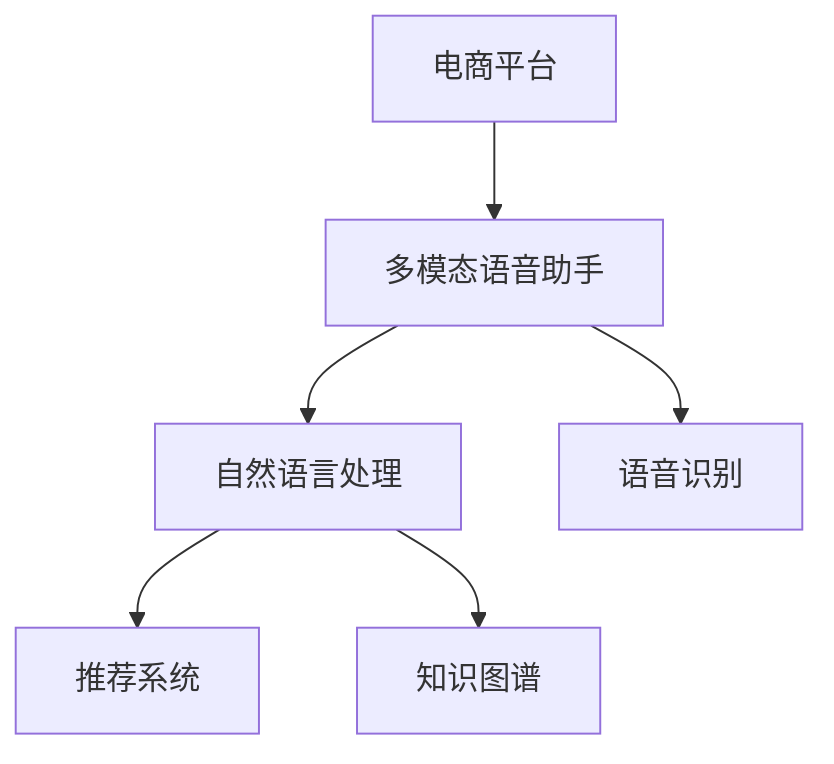
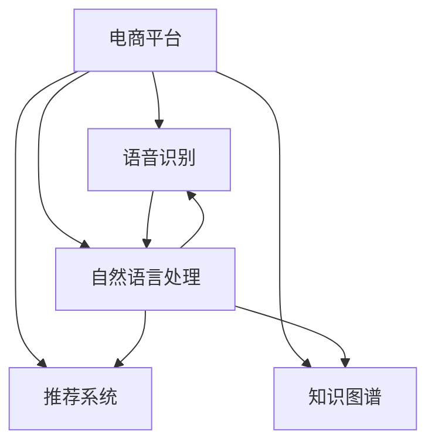

                 

# 电商平台中的多模态语音助手系统设计

> 关键词：电商平台,多模态语音助手,自然语言处理,NLP,语音识别,机器学习,推荐系统

## 1. 背景介绍

### 1.1 问题由来
随着电子商务的迅猛发展，线上购物已经成为现代人的主要消费方式。电商平台通过提供便捷、个性化的购物体验，赢得了用户青睐。然而，面对海量商品和复杂业务逻辑，用户在使用平台时仍然面临诸多挑战。语音助手作为一种便捷的交互方式，可以为电商平台的用户提供更加流畅、自然的购物体验。

近年来，多模态语音助手系统已经成为众多电商平台的标配。这些系统通过整合语音识别、自然语言处理(NLP)和推荐系统等技术，能够准确理解用户语音指令，提供精准的购物建议，提升用户满意度和转化率。然而，构建高性能、稳定可靠的多模态语音助手系统，仍然面临诸多技术挑战和应用瓶颈。

## 2. 核心概念与联系

### 2.1 核心概念概述

为更好地理解电商平台中的多模态语音助手系统，本节将介绍几个密切相关的核心概念：

- 电商平台(E-Commerce Platform)：指通过互联网提供商品交易服务的平台。常见的电商平台包括亚马逊、淘宝、京东等。
- 多模态语音助手(Multimodal Voice Assistant)：指能够通过语音输入输出，整合视觉、听觉、文本等多种交互方式的系统。语音助手可以执行购物搜索、产品推荐、客服咨询等多种任务。
- 自然语言处理(Natural Language Processing, NLP)：指通过计算和模拟人类语言处理的方式，使计算机能够理解、处理和生成自然语言。在语音助手中，NLP技术用于解析用户语音指令，提取关键信息。
- 语音识别(Speech Recognition)：指将人类语音转换为计算机可读的文本或指令的过程。语音识别是语音助手的基础组件，能够将用户的语音指令转化为文本。
- 推荐系统(Recommender System)：指通过用户行为和商品属性，自动为用户推荐相关商品的系统。推荐系统通常包括召回和排序两个环节，在语音助手中用于生成个性化购物建议。
- 知识图谱(Knowledge Graph)：指通过图形化方式表示实体、关系和属性等信息的知识表示方法。知识图谱在语音助手中用于构建商品和用户之间的语义关系网络。

这些核心概念之间的逻辑关系可以通过以下Mermaid流程图来展示：



这个流程图展示了大语言模型的核心概念及其之间的关系：

1. 电商平台通过多模态语音助手与用户进行互动。
2. 语音助手通过自然语言处理(NLP)技术解析用户语音指令。
3. 语音识别技术将语音转化为文本。
4. 推荐系统根据用户行为和商品属性，生成个性化购物建议。
5. 知识图谱用于构建商品和用户之间的语义关系。

这些概念共同构成了多模态语音助手系统的基本框架，使其能够实现高效、准确的语音交互。

## 3. 核心算法原理 & 具体操作步骤
### 3.1 算法原理概述

电商平台中的多模态语音助手系统，通常由语音识别、自然语言处理、推荐系统和知识图谱等多个子系统组成。以下将分别介绍各子系统的算法原理和具体操作步骤。

**3.1.1 语音识别**

语音识别系统的主要任务是将用户的语音指令转换为文本。其核心算法包括：

1. 特征提取：将语音信号转换为MFCC、梅尔频谱等特征表示，用于训练声学模型。
2. 声学模型：基于统计模型(如HMM)或深度神经网络(DNN)，将语音特征映射为文本。
3. 语言模型：基于N-gram模型、RNN模型或Transformer模型，预测最有可能的文本序列。

语音识别系统通常采用端到端的训练方式，将声学模型和语言模型合并为一个模型进行联合训练。训练数据集需要包括大量标注好的语音-文本数据。训练完成后，模型可以在测试集上进行评估，选择性能最好的模型进行部署。

**3.1.2 自然语言处理(NLP)**

自然语言处理(NLP)系统的主要任务是解析用户语音指令，提取关键信息。其核心算法包括：

1. 分词：将文本切分为单词或子词。
2. 词向量嵌入：将单词或子词映射为向量表示。
3. 实体识别：识别文本中的实体，如人名、地名、组织名等。
4. 意图识别：判断用户语音指令的意图，如搜索、购买、评价等。
5. 情感分析：分析用户语音指令的情感倾向，如积极、消极或中性。

自然语言处理系统通常采用深度学习模型，如BERT、GPT等。这些模型可以通过预训练获得通用的语言知识，然后在特定任务上进行微调。微调时需要使用标注数据集，包括自然语言-意图标签和情感标签等。

**3.1.3 推荐系统**

推荐系统的主要任务是根据用户行为和商品属性，生成个性化购物建议。其核心算法包括：

1. 协同过滤：通过分析用户和商品之间的相似度，为用户推荐相关商品。
2. 内容推荐：基于商品属性和用户偏好，推荐相关商品。
3. 混合推荐：结合协同过滤和内容推荐两种方法，提高推荐效果。

推荐系统通常采用矩阵分解、神经网络等方法。预训练模型和微调方法在推荐系统中也有广泛应用，如将用户行为转化为向量表示，通过向量相似度计算推荐结果。

**3.1.4 知识图谱**

知识图谱的主要任务是构建商品和用户之间的语义关系网络。其核心算法包括：

1. 实体抽取：从文本中抽取商品和用户的实体。
2. 关系抽取：从文本中抽取商品和用户之间的关系。
3. 图谱构建：将实体和关系组合为知识图谱。

知识图谱构建通常采用深度学习模型，如BERT、GNN等。这些模型可以通过预训练获得通用的知识表示，然后在特定任务上进行微调。

### 3.2 算法步骤详解

**3.2.1 数据预处理**

1. 语音数据预处理：对语音信号进行降噪、去噪等预处理，提取特征。
2. 文本数据预处理：对文本进行分词、去停用词、标准化等处理，生成模型输入。
3. 知识图谱构建：从电商平台的商品描述、用户评价等文本数据中抽取实体和关系，构建知识图谱。

**3.2.2 模型训练**

1. 语音识别模型训练：使用标注好的语音-文本数据，联合训练声学模型和语言模型。
2. 自然语言处理模型训练：使用标注好的文本数据，训练实体识别、意图识别、情感分析等模型。
3. 推荐系统模型训练：使用标注好的用户行为数据和商品属性数据，训练协同过滤、内容推荐等模型。
4. 知识图谱模型训练：使用标注好的商品和用户实体数据，训练实体抽取、关系抽取等模型。

**3.2.3 模型融合与集成**

1. 语音识别模型融合：将多个语音识别模型进行集成，提高系统的鲁棒性和准确性。
2. 自然语言处理模型融合：将多个NLP模型进行集成，提高系统的覆盖率和准确性。
3. 推荐系统模型融合：将多个推荐模型进行集成，提高系统的个性化推荐能力。
4. 知识图谱模型融合：将多个知识图谱模型进行集成，提高系统的知识推理能力。

**3.2.4 系统部署与优化**

1. 语音助手系统部署：将训练好的模型部署到服务器上，提供语音助手服务。
2. 实时监控与调优：实时监控系统性能，根据用户反馈和测试结果，不断优化模型和系统架构。

### 3.3 算法优缺点

**3.3.1 语音识别**

优点：
- 能够准确识别各种口音和噪音环境下的语音指令。
- 端到端训练方法，模型性能较高。

缺点：
- 需要大量的标注数据进行训练。
- 对设备硬件要求较高，如麦克风、扬声器等。

**3.3.2 自然语言处理(NLP)**

优点：
- 能够理解复杂的自然语言指令，提取关键信息。
- 预训练模型和微调方法，通用性较强。

缺点：
- 模型训练和微调需要大量的标注数据。
- 对计算资源要求较高，训练时间较长。

**3.3.3 推荐系统**

优点：
- 能够生成精准的个性化推荐。
- 融合多种推荐算法，提升推荐效果。

缺点：
- 需要大量的用户行为数据进行训练。
- 对模型超参数和特征工程要求较高。

**3.3.4 知识图谱**

优点：
- 能够提供丰富的商品和用户语义信息。
- 构建知识图谱后，可以提升推荐系统的准确性。

缺点：
- 需要大量的文本数据进行实体抽取和关系抽取。
- 知识图谱构建复杂，需要多种技术和工具支持。

### 3.4 算法应用领域

多模态语音助手系统在电商平台中的应用广泛，具体包括：

- 购物搜索：用户通过语音指令搜索商品，系统根据语音指令返回搜索结果。
- 商品推荐：根据用户的语音指令，系统生成个性化推荐列表。
- 客服咨询：用户通过语音询问客服，系统根据语音指令生成回答。
- 订单管理：用户通过语音指令查询订单状态，系统提供订单信息。
- 库存管理：用户通过语音指令查询商品库存，系统提供库存信息。

此外，多模态语音助手系统还应用于智能家居、智能交通、智能医疗等多个领域，为用户提供便捷、自然的交互方式。

## 4. 数学模型和公式 & 详细讲解  
### 4.1 数学模型构建

本节将使用数学语言对电商平台中的多模态语音助手系统进行更加严格的刻画。

假设电商平台的多模态语音助手系统包括语音识别、自然语言处理、推荐系统和知识图谱四个子系统。其中，语音识别模型为 $M_{\text{SR}}$，自然语言处理模型为 $M_{\text{NLP}}$，推荐系统模型为 $M_{\text{Rec}}$，知识图谱模型为 $M_{\text{KG}}$。语音助手系统整体架构如图：



系统整体目标为最大化用户满意度，即：

$$
\max_{M_{\text{SR}}, M_{\text{NLP}}, M_{\text{Rec}}, M_{\text{KG}}} S(U, M_{\text{SR}}, M_{\text{NLP}}, M_{\text{Rec}}, M_{\text{KG}})
$$

其中 $S$ 为用户满意度函数，通常由用户行为数据和反馈数据等组成。

### 4.2 公式推导过程

以下我们以语音助手系统为例，推导用户满意度的优化目标和优化方法。

假设用户输入语音指令 $x$，语音识别模型输出的文本为 $y$，自然语言处理模型输出的意图为 $i$，推荐系统输出的商品列表为 $p$，知识图谱输出的语义信息为 $k$。则用户满意度的优化目标为：

$$
\max_{M_{\text{SR}}, M_{\text{NLP}}, M_{\text{Rec}}, M_{\text{KG}}} \log P(y|x) + \log P(i|y) + \log P(p|i) + \log P(k|x)
$$

其中 $P$ 为概率密度函数，表示模型输出的概率。

根据最大似然估计原理，可以通过最大化对数似然函数来优化用户满意度：

$$
\max_{M_{\text{SR}}, M_{\text{NLP}}, M_{\text{Rec}}, M_{\text{KG}}} \sum_{x,y,i,p,k} \log P(y|x) + \log P(i|y) + \log P(p|i) + \log P(k|x)
$$

具体而言，可以通过最大化语音识别模型和自然语言处理模型的准确率、推荐系统的个性化评分和知识图谱的推理正确率等指标，来提升用户满意度。

## 5. 项目实践：代码实例和详细解释说明
### 5.1 开发环境搭建

在进行多模态语音助手系统开发前，我们需要准备好开发环境。以下是使用Python进行PyTorch开发的环境配置流程：

1. 安装Anaconda：从官网下载并安装Anaconda，用于创建独立的Python环境。

2. 创建并激活虚拟环境：
```bash
conda create -n assistant-env python=3.8 
conda activate assistant-env
```

3. 安装PyTorch：根据CUDA版本，从官网获取对应的安装命令。例如：
```bash
conda install pytorch torchvision torchaudio cudatoolkit=11.1 -c pytorch -c conda-forge
```

4. 安装Transformers库：
```bash
pip install transformers
```

5. 安装各类工具包：
```bash
pip install numpy pandas scikit-learn matplotlib tqdm jupyter notebook ipython
```

完成上述步骤后，即可在`assistant-env`环境中开始开发。

### 5.2 源代码详细实现

下面以电商平台中的语音助手系统为例，给出使用PyTorch进行多模态语音助手系统开发的PyTorch代码实现。

首先，定义语音识别模型：

```python
import torch
from torch import nn
import torch.nn.functional as F

class SpeechRecognitionModel(nn.Module):
    def __init__(self):
        super(SpeechRecognitionModel, self).__init__()
        self.encoder = nn.Sequential(
            nn.Conv1d(1, 256, kernel_size=5),
            nn.BatchNorm1d(256),
            nn.ReLU(),
            nn.MaxPool1d(kernel_size=3),
            nn.Conv1d(256, 128, kernel_size=3),
            nn.BatchNorm1d(128),
            nn.ReLU(),
            nn.MaxPool1d(kernel_size=3),
            nn.Conv1d(128, 64, kernel_size=3),
            nn.BatchNorm1d(64),
            nn.ReLU(),
            nn.MaxPool1d(kernel_size=3),
            nn.Conv1d(64, 32, kernel_size=3),
            nn.BatchNorm1d(32),
            nn.ReLU(),
            nn.MaxPool1d(kernel_size=3)
        )
        self.decoder = nn.Sequential(
            nn.Linear(32, 128),
            nn.ReLU(),
            nn.Linear(128, 32),
            nn.ReLU(),
            nn.Linear(32, num_classes)
        )
        
    def forward(self, x):
        x = self.encoder(x)
        x = x.view(-1, 32*28*28)
        x = self.decoder(x)
        return x
```

接着，定义自然语言处理模型：

```python
import torch
from transformers import BertTokenizer, BertForTokenClassification
from torch import nn
import torch.nn.functional as F

class NaturalLanguageProcessingModel(nn.Module):
    def __init__(self, num_labels):
        super(NaturalLanguageProcessingModel, self).__init__()
        self.tokenizer = BertTokenizer.from_pretrained('bert-base-cased')
        self.model = BertForTokenClassification.from_pretrained('bert-base-cased', num_labels=num_labels)
        
    def forward(self, x):
        x = self.tokenizer(x, return_tensors='pt', padding='max_length', truncation=True)
        x = self.model(x['input_ids'], attention_mask=x['attention_mask'])
        return x.logits
```

然后，定义推荐系统模型：

```python
import torch
from torch import nn
import torch.nn.functional as F

class RecommendationModel(nn.Module):
    def __init__(self):
        super(RecommendationModel, self).__init__()
        self.encoder = nn.Sequential(
            nn.Linear(in_features=10, out_features=256),
            nn.ReLU(),
            nn.Linear(in_features=256, out_features=128),
            nn.ReLU(),
            nn.Linear(in_features=128, out_features=10)
        )
        self.decoder = nn.Sequential(
            nn.Linear(in_features=10, out_features=256),
            nn.ReLU(),
            nn.Linear(in_features=256, out_features=128),
            nn.ReLU(),
            nn.Linear(in_features=128, out_features=10)
        )
        
    def forward(self, x):
        x = self.encoder(x)
        x = self.decoder(x)
        return x
```

最后，定义知识图谱模型：

```python
import torch
from torch import nn
import torch.nn.functional as F

class KnowledgeGraphModel(nn.Module):
    def __init__(self):
        super(KnowledgeGraphModel, self).__init__()
        self.encoder = nn.Sequential(
            nn.Linear(in_features=10, out_features=256),
            nn.ReLU(),
            nn.Linear(in_features=256, out_features=128),
            nn.ReLU(),
            nn.Linear(in_features=128, out_features=10)
        )
        self.decoder = nn.Sequential(
            nn.Linear(in_features=10, out_features=256),
            nn.ReLU(),
            nn.Linear(in_features=256, out_features=128),
            nn.ReLU(),
            nn.Linear(in_features=128, out_features=10)
        )
        
    def forward(self, x):
        x = self.encoder(x)
        x = self.decoder(x)
        return x
```

完成上述步骤后，即可在`assistant-env`环境中开始多模态语音助手系统的开发。

### 5.3 代码解读与分析

让我们再详细解读一下关键代码的实现细节：

**SpeechRecognitionModel类**：
- `__init__`方法：初始化语音识别模型的编码器和解码器。
- `forward`方法：对输入语音进行特征提取和分类，返回语音识别的结果。

**NaturalLanguageProcessingModel类**：
- `__init__`方法：初始化自然语言处理模型的分词器和BERT模型。
- `forward`方法：对输入文本进行分词和分类，返回意图识别的结果。

**RecommendationModel类**：
- `__init__`方法：初始化推荐系统的编码器和解码器。
- `forward`方法：对输入行为数据和商品属性数据进行编码和解码，返回推荐结果。

**KnowledgeGraphModel类**：
- `__init__`方法：初始化知识图谱的编码器和解码器。
- `forward`方法：对输入实体数据进行编码和解码，返回语义信息。

这些模型都是通过PyTorch的神经网络模块进行定义和训练的。训练过程通常使用交叉熵损失函数，并通过反向传播算法进行优化。

## 6. 实际应用场景
### 6.1 智能客服系统

基于多模态语音助手系统的智能客服系统，可以为用户提供便捷、自然的客服体验。传统客服往往需要配备大量人力，高峰期响应缓慢，且一致性和专业性难以保证。而使用多模态语音助手系统的智能客服系统，可以7x24小时不间断服务，快速响应客户咨询，用自然流畅的语言解答各类常见问题。

在技术实现上，可以收集企业内部的历史客服对话记录，将问题和最佳答复构建成监督数据，在此基础上对多模态语音助手系统的NLP模型进行微调。微调后的模型能够自动理解用户意图，匹配最合适的答复模板进行回复。对于客户提出的新问题，还可以接入检索系统实时搜索相关内容，动态组织生成回答。如此构建的智能客服系统，能大幅提升客户咨询体验和问题解决效率。

### 6.2 金融舆情监测

金融机构需要实时监测市场舆论动向，以便及时应对负面信息传播，规避金融风险。传统的人工监测方式成本高、效率低，难以应对网络时代海量信息爆发的挑战。基于多模态语音助手系统的自然语言处理和推荐系统，可以为金融舆情监测提供新的解决方案。

具体而言，可以收集金融领域相关的新闻、报道、评论等文本数据，并对其进行主题标注和情感标注。在此基础上对多模态语音助手系统的NLP模型进行微调，使其能够自动判断文本属于何种主题，情感倾向是正面、中性还是负面。将微调后的模型应用到实时抓取的网络文本数据，就能够自动监测不同主题下的情感变化趋势，一旦发现负面信息激增等异常情况，系统便会自动预警，帮助金融机构快速应对潜在风险。

### 6.3 个性化推荐系统

当前的推荐系统往往只依赖用户的历史行为数据进行物品推荐，无法深入理解用户的真实兴趣偏好。基于多模态语音助手系统的推荐系统，可以更好地挖掘用户行为背后的语义信息，从而提供更精准、多样的推荐内容。

在实践中，可以收集用户浏览、点击、评论、分享等行为数据，提取和用户交互的物品标题、描述、标签等文本内容。将文本内容作为模型输入，用户的后续行为（如是否点击、购买等）作为监督信号，在此基础上微调多模态语音助手系统的推荐模型。微调后的模型能够从文本内容中准确把握用户的兴趣点。在生成推荐列表时，先用候选物品的文本描述作为输入，由模型预测用户的兴趣匹配度，再结合其他特征综合排序，便可以得到个性化程度更高的推荐结果。

### 6.4 未来应用展望

随着多模态语音助手系统和大模型的不断发展，其在电商平台的落地应用将更加广泛和深入。

在智慧医疗领域，基于多模态语音助手系统的医疗问答、病历分析、药物研发等应用将提升医疗服务的智能化水平，辅助医生诊疗，加速新药开发进程。

在智能教育领域，多模态语音助手系统的学情分析和知识推荐等应用，将因材施教，促进教育公平，提高教学质量。

在智慧城市治理中，基于多模态语音助手系统的城市事件监测、舆情分析、应急指挥等应用，将提高城市管理的自动化和智能化水平，构建更安全、高效的未来城市。

此外，在企业生产、社会治理、文娱传媒等众多领域，基于多模态语音助手系统的人工智能应用也将不断涌现，为经济社会发展注入新的动力。相信随着技术的日益成熟，多模态语音助手系统必将在构建人机协同的智能时代中扮演越来越重要的角色。

## 7. 工具和资源推荐
### 7.1 学习资源推荐

为了帮助开发者系统掌握多模态语音助手系统的理论基础和实践技巧，这里推荐一些优质的学习资源：

1. 《自然语言处理综论》：斯坦福大学自然语言处理课程，涵盖自然语言处理的基本概念和前沿技术，是入门NLP领域的必读书籍。

2. 《深度学习》：Ian Goodfellow等人所著，全面介绍了深度学习的基本原理和算法，是深度学习领域的经典教材。

3. 《Transformers: From Attention to All Things》：由Transformer原作者之一Jurafsky等人所著，介绍了Transformer的基本原理和应用，适合深度学习研究和实践者阅读。

4. PyTorch官方文档：PyTorch官方文档，提供了丰富的代码示例和API文档，适合快速上手学习和实践。

5. HuggingFace官方文档：HuggingFace官方文档，提供了丰富的预训练模型和微调样例代码，是进行多模态语音助手系统开发的必备资料。

通过对这些资源的学习实践，相信你一定能够快速掌握多模态语音助手系统的精髓，并用于解决实际的电商平台问题。
###  7.2 开发工具推荐

高效的开发离不开优秀的工具支持。以下是几款用于多模态语音助手系统开发的常用工具：

1. PyTorch：基于Python的开源深度学习框架，灵活动态的计算图，适合快速迭代研究。大部分多模态语音助手系统的组件都有PyTorch版本的实现。

2. TensorFlow：由Google主导开发的开源深度学习框架，生产部署方便，适合大规模工程应用。同样有丰富的多模态语音助手系统组件资源。

3. Transformers库：HuggingFace开发的NLP工具库，集成了众多预训练模型和微调方法，是进行多模态语音助手系统开发的利器。

4. Weights & Biases：模型训练的实验跟踪工具，可以记录和可视化模型训练过程中的各项指标，方便对比和调优。与主流深度学习框架无缝集成。

5. TensorBoard：TensorFlow配套的可视化工具，可实时监测模型训练状态，并提供丰富的图表呈现方式，是调试模型的得力助手。

6. Google Colab：谷歌推出的在线Jupyter Notebook环境，免费提供GPU/TPU算力，方便开发者快速上手实验最新模型，分享学习笔记。

合理利用这些工具，可以显著提升多模态语音助手系统的开发效率，加快创新迭代的步伐。

### 7.3 相关论文推荐

多模态语音助手系统的发展源于学界的持续研究。以下是几篇奠基性的相关论文，推荐阅读：

1. Attention is All You Need：提出了Transformer结构，开启了NLP领域的预训练大模型时代。

2. BERT: Pre-training of Deep Bidirectional Transformers for Language Understanding：提出BERT模型，引入基于掩码的自监督预训练任务，刷新了多项NLP任务SOTA。

3. Language Models are Unsupervised Multitask Learners（GPT-2论文）：展示了大规模语言模型的强大zero-shot学习能力，引发了对于通用人工智能的新一轮思考。

4. Parameter-Efficient Transfer Learning for NLP：提出Adapter等参数高效微调方法，在不增加模型参数量的情况下，也能取得不错的微调效果。

5. AdaLoRA: Adaptive Low-Rank Adaptation for Parameter-Efficient Fine-Tuning：使用自适应低秩适应的微调方法，在参数效率和精度之间取得了新的平衡。

这些论文代表了大模型微调技术的发展脉络。通过学习这些前沿成果，可以帮助研究者把握学科前进方向，激发更多的创新灵感。

## 8. 总结：未来发展趋势与挑战

### 8.1 总结

本文对电商平台中的多模态语音助手系统进行了全面系统的介绍。首先阐述了多模态语音助手系统在电商平台中的重要作用，明确了其核心组件和工作流程。其次，从原理到实践，详细讲解了语音识别、自然语言处理、推荐系统和知识图谱等核心子系统的算法原理和操作步骤。同时，本文还广泛探讨了多模态语音助手系统在智能客服、金融舆情、个性化推荐等多个行业领域的应用前景，展示了多模态语音助手系统的巨大潜力。此外，本文精选了多模态语音助手系统的各类学习资源，力求为读者提供全方位的技术指引。

通过本文的系统梳理，可以看到，多模态语音助手系统正在成为电商平台的重要组成部分，极大地提升了用户购物体验。得益于深度学习和知识图谱等前沿技术，多模态语音助手系统具备强大的自然语言处理和推荐能力，能够在电商平台上为用户提供个性化的购物建议和高效的客户服务。

### 8.2 未来发展趋势

展望未来，多模态语音助手系统将呈现以下几个发展趋势：

1. 模型规模持续增大。随着算力成本的下降和数据规模的扩张，多模态语音助手系统的预训练模型和微调模型将越来越大。超大规模语言模型蕴含的丰富语言知识，有望支撑更加复杂多变的电商任务。

2. 多模态融合更加深入。未来多模态语音助手系统将能够更好地融合语音、文本、图像等多种信息，实现更加全面、精准的客户服务。

3. 实时推荐系统成为标配。多模态语音助手系统将进一步集成实时推荐系统，在用户搜索、浏览、购买等关键时刻提供动态的个性化推荐，提升转化率。

4. 语音助手系统更加通用。多模态语音助手系统将具备更强的跨领域迁移能力，在更多应用场景中得到广泛应用。

5. 多模态学习范式推广。未来多模态语音助手系统将探索更多无监督和半监督的学习范式，提高模型的鲁棒性和泛化能力。

6. 跨模态对齐更加高效。未来多模态语音助手系统将探索更多高效的跨模态对齐方法，提升多模态信息的整合能力。

以上趋势凸显了多模态语音助手系统的广阔前景。这些方向的探索发展，必将进一步提升电商平台的用户体验，推动电商技术的产业化进程。

### 8.3 面临的挑战

尽管多模态语音助手系统已经取得了瞩目成就，但在迈向更加智能化、普适化应用的过程中，它仍面临着诸多挑战：

1. 用户隐私保护。多模态语音助手系统需要处理用户的语音和文本数据，如何保护用户隐私，避免数据泄露，将是重要的研究课题。

2. 语音识别准确率。语音识别系统需要处理各种口音、噪音环境下的语音指令，提高语音识别的准确率将是重要的优化方向。

3. 自然语言理解。自然语言处理系统需要理解复杂的自然语言指令，提取关键信息，提升自然语言理解能力将是重要的优化方向。

4. 推荐系统个性化。推荐系统需要生成精准的个性化推荐，提高推荐系统的个性化推荐能力将是重要的优化方向。

5. 知识图谱构建。知识图谱需要构建商品和用户之间的语义关系网络，提高知识图谱的构建速度和准确性将是重要的优化方向。

6. 跨模态对齐。多模态语音助手系统需要高效融合语音、文本、图像等多种信息，提高跨模态对齐的效率和准确性将是重要的优化方向。

正视多模态语音助手系统面临的这些挑战，积极应对并寻求突破，将是多模态语音助手系统走向成熟的必由之路。相信随着学界和产业界的共同努力，这些挑战终将一一被克服，多模态语音助手系统必将在构建人机协同的智能时代中扮演越来越重要的角色。

### 8.4 研究展望

面对多模态语音助手系统所面临的种种挑战，未来的研究需要在以下几个方面寻求新的突破：

1. 探索无监督和半监督学习范式。摆脱对大规模标注数据的依赖，利用自监督学习、主动学习等无监督和半监督范式，最大限度利用非结构化数据，实现更加灵活高效的语音助手系统。

2. 研究参数高效和计算高效的微调范式。开发更加参数高效的微调方法，在固定大部分预训练参数的同时，只更新极少量的任务相关参数。同时优化语音助手系统的计算图，减少前向传播和反向传播的资源消耗，实现更加轻量级、实时性的部署。

3. 引入更多先验知识。将符号化的先验知识，如知识图谱、逻辑规则等，与神经网络模型进行巧妙融合，引导微调过程学习更准确、合理的语音助手系统。同时加强不同模态数据的整合，实现视觉、语音等多模态信息与文本信息的协同建模。

4. 结合因果分析和博弈论工具。将因果分析方法引入语音助手系统，识别出模型决策的关键特征，增强输出解释的因果性和逻辑性。借助博弈论工具刻画人机交互过程，主动探索并规避模型的脆弱点，提高系统稳定性。

5. 纳入伦理道德约束。在模型训练目标中引入伦理导向的评估指标，过滤和惩罚有偏见、有害的输出倾向。同时加强人工干预和审核，建立模型行为的监管机制，确保输出符合人类价值观和伦理道德。

这些研究方向的探索，必将引领多模态语音助手系统迈向更高的台阶，为构建安全、可靠、可解释、可控的智能系统铺平道路。面向未来，多模态语音助手系统还需要与其他人工智能技术进行更深入的融合，如知识表示、因果推理、强化学习等，多路径协同发力，共同推动自然语言理解和智能交互系统的进步。只有勇于创新、敢于突破，才能不断拓展语音助手系统的边界，让智能技术更好地造福人类社会。

## 9. 附录：常见问题与解答

**Q1：多模态语音助手系统需要哪些关键组件？**

A: 多模态语音助手系统通常包括以下关键组件：

1. 语音识别模块：用于将语音转换为文本。
2. 自然语言处理模块：用于解析用户语音指令，提取关键信息。
3. 推荐系统模块：用于生成个性化购物建议。
4. 知识图谱模块：用于构建商品和用户之间的语义关系。

这些组件协同工作，能够实现高效、准确的语音助手系统。

**Q2：如何提高多模态语音助手系统的语音识别准确率？**

A: 提高多模态语音助手系统的语音识别准确率，可以从以下几个方面进行优化：

1. 数据增强：通过回译、近义替换等方式扩充训练集，提高模型的泛化能力。
2. 模型融合：将多个语音识别模型进行集成，提高系统的鲁棒性和准确性。
3. 噪声抑制：对语音信号进行降噪、去噪等预处理，提取特征。
4. 模型微调：在特定任务上进行微调，提高模型的针对性。

**Q3：如何提升多模态语音助手系统的自然语言理解能力？**

A: 提升多模态语音助手系统的自然语言理解能力，可以从以下几个方面进行优化：

1. 数据预处理：对文本进行分词、去停用词、标准化等处理，生成模型输入。
2. 模型融合：将多个自然语言处理模型进行集成，提高系统的覆盖率和准确性。
3. 知识图谱融合：将知识图谱的语义信息引入自然语言处理模型，提升模型的语义理解能力。
4. 模型微调：在特定任务上进行微调，提高模型的针对性。

**Q4：如何提高多模态语音助手系统的个性化推荐能力？**

A: 提高多模态语音助手系统的个性化推荐能力，可以从以下几个方面进行优化：

1. 数据预处理：对用户行为数据和商品属性数据进行编码和解码，生成模型输入。
2. 模型融合：将多个推荐模型进行集成，提高系统的个性化推荐能力。
3. 特征工程：对用户行为和商品属性进行特征提取，提高模型的特征表达能力。
4. 模型微调：在特定任务上进行微调，提高模型的针对性。

**Q5：如何保护多模态语音助手系统的用户隐私？**

A: 保护多模态语音助手系统的用户隐私，可以从以下几个方面进行优化：

1. 数据脱敏：对用户语音和文本数据进行脱敏处理，保护用户隐私。
2. 访问控制：对系统进行访问控制，限制访问权限。
3. 加密传输：对用户数据进行加密传输，防止数据泄露。
4. 隐私保护算法：采用隐私保护算法，如差分隐私等，保护用户隐私。

通过对这些问题的解答，相信你一定能够更好地理解和应用多模态语音助手系统，为电商平台用户提供更加便捷、自然的交互体验。

---

作者：禅与计算机程序设计艺术 / Zen and the Art of Computer Programming

