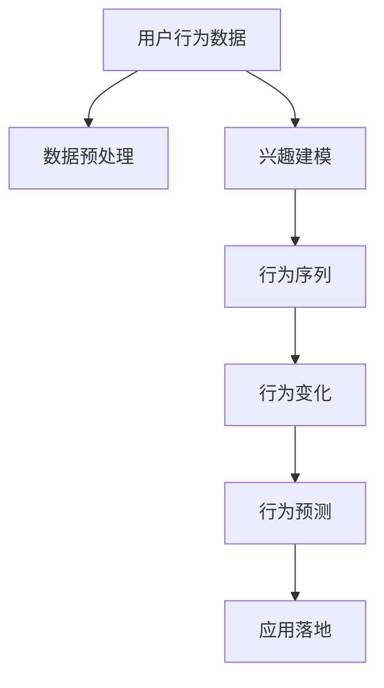
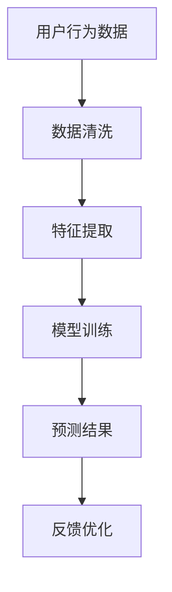

                 

# 电商平台中的用户兴趣迁移轨迹分析

## 1. 背景介绍

### 1.1 问题由来
随着电子商务的蓬勃发展，电商平台的用户规模和交易量持续增长，如何更好地理解用户行为，提升用户体验和满意度，成为电商企业关注的重点。特别是在个性化推荐、搜索优化、用户留存等方面，用户兴趣迁移轨迹分析已成为关键技术手段。

### 1.2 问题核心关键点
用户兴趣迁移轨迹分析是指通过对用户在电商平台上的一系列行为数据（如浏览、点击、购买、评论等）进行建模和分析，理解用户的兴趣变化趋势，从而预测用户未来行为，提供更精准的个性化推荐和定向广告。其主要包括以下几个方面：

- **行为数据采集**：收集用户在电商平台上的所有行为数据，包括历史浏览记录、点击行为、购买记录、评价反馈等。
- **数据预处理**：对采集到的行为数据进行清洗、归一化、特征提取等预处理操作，提升数据质量。
- **兴趣建模**：利用机器学习或深度学习模型，对用户的行为数据进行建模，分析用户的兴趣偏好和变化轨迹。
- **轨迹预测**：通过预测模型，预测用户未来行为，包括兴趣变化、购买意愿等。
- **应用落地**：根据预测结果，对用户进行个性化推荐、定向广告投放等，提升用户体验和平台收益。

本文将从以上几个方面，系统介绍电商平台中的用户兴趣迁移轨迹分析方法。

## 2. 核心概念与联系

### 2.1 核心概念概述

为更好地理解用户兴趣迁移轨迹分析，本节将介绍几个关键概念：

- **用户行为数据**：用户在电商平台上的所有操作行为记录，包括浏览、点击、购买、评价等。
- **兴趣模型**：通过分析用户行为数据，构建用户兴趣偏好的数学或神经网络模型，用于预测用户未来行为。
- **行为序列**：用户在电商平台上的一系列操作行为的时间顺序，如浏览商品、查看详情、加入购物车、完成购买等。
- **行为变化**：用户兴趣随时间的变化，可以通过计算不同时间点的兴趣强度或类型，反映用户兴趣的迁移轨迹。
- **行为预测**：基于已有的用户行为数据和兴趣模型，预测用户未来的行为和偏好。

这些概念之间的关系通过以下Mermaid流程图来展示：



### 2.2 核心概念原理和架构的 Mermaid 流程图

以下是一个简单的用户行为数据分析流程：



这个流程图展示了用户行为数据分析的完整流程：

1. **数据清洗**：对原始数据进行去重、填补缺失值、异常值处理等操作，确保数据质量。
2. **特征提取**：从用户行为数据中提取关键特征，如点击次数、停留时长、购买金额等。
3. **模型训练**：使用机器学习或深度学习模型，如协同过滤、序列模型等，对用户行为数据进行建模，学习用户兴趣和行为规律。
4. **预测结果**：利用训练好的模型，对用户未来行为进行预测，如下一次浏览、购买行为等。
5. **反馈优化**：根据预测结果和实际行为对比，对模型进行反馈和优化，提升预测精度。

这些步骤相互关联，构成了用户兴趣迁移轨迹分析的核心架构。

## 3. 核心算法原理 & 具体操作步骤

### 3.1 算法原理概述

用户兴趣迁移轨迹分析的核心算法原理是基于时序数据的预测和建模。通过分析用户行为数据的时间序列特征，构建用户兴趣随时间变化的模型，从而预测用户未来的行为和偏好。

具体来说，用户兴趣迁移轨迹分析包括三个主要步骤：

1. **行为序列建模**：通过时序数据建模方法，如时间序列分析、隐马尔可夫模型、递归神经网络等，对用户行为序列进行建模。
2. **兴趣强度估计**：利用机器学习或深度学习模型，对用户在不同时间点的兴趣强度进行估计，分析用户兴趣的变化轨迹。
3. **行为预测**：基于已有的用户兴趣模型和行为数据，预测用户未来的行为，如下一次浏览、购买行为等。

### 3.2 算法步骤详解

以下是用户兴趣迁移轨迹分析的主要操作步骤：

**Step 1: 数据采集与预处理**

- **数据采集**：通过电商平台的用户行为数据接口，收集用户的所有操作行为数据，包括浏览记录、点击行为、购买记录、评价反馈等。
- **数据清洗**：对采集到的数据进行去重、填补缺失值、异常值处理等操作，确保数据质量。
- **特征提取**：从用户行为数据中提取关键特征，如点击次数、停留时长、购买金额等。

**Step 2: 行为序列建模**

- **序列建模**：使用时间序列分析、隐马尔可夫模型、递归神经网络等方法，对用户行为序列进行建模，学习行为序列的规律和特征。
- **特征选择**：根据建模结果，选择对用户行为预测有较大影响的特征。

**Step 3: 兴趣强度估计**

- **兴趣建模**：利用机器学习或深度学习模型，对用户在不同时间点的兴趣强度进行估计，分析用户兴趣的变化轨迹。
- **强度计算**：通过计算不同时间点的兴趣强度，反映用户兴趣的迁移轨迹。

**Step 4: 行为预测**

- **预测模型训练**：使用历史行为数据和兴趣强度模型，训练预测模型，预测用户未来的行为。
- **预测结果应用**：根据预测结果，对用户进行个性化推荐、定向广告投放等，提升用户体验和平台收益。

### 3.3 算法优缺点

用户兴趣迁移轨迹分析方法具有以下优点：

- **个性化推荐**：通过分析用户兴趣变化轨迹，提供更精准的个性化推荐，提升用户体验和满意度。
- **行为预测**：预测用户未来行为，提前进行推荐和广告投放，提升点击率和转化率。
- **实时优化**：根据实时反馈数据，不断优化预测模型，提升预测精度。

同时，该方法也存在一些局限性：

- **数据依赖**：预测效果高度依赖于数据质量，需要大量高质量的标注数据。
- **模型复杂**：需要使用复杂的模型和算法，对计算资源和数据处理能力有较高要求。
- **隐私问题**：用户行为数据涉及隐私保护，需要严格的隐私保护措施。
- **模型泛化**：模型对新用户和新行为的泛化能力有限，可能需要不断迭代更新模型。

### 3.4 算法应用领域

用户兴趣迁移轨迹分析在电商平台中有着广泛的应用，主要包括以下几个方面：

- **个性化推荐系统**：基于用户兴趣迁移轨迹，对用户进行个性化推荐，提升点击率和转化率。
- **搜索优化**：分析用户搜索行为，优化搜索结果排序，提高搜索体验。
- **广告投放**：预测用户兴趣变化，进行定向广告投放，提升广告效果。
- **用户留存**：分析用户行为轨迹，预测用户流失风险，进行挽留操作。

## 4. 数学模型和公式 & 详细讲解 & 举例说明

### 4.1 数学模型构建

用户兴趣迁移轨迹分析的数学模型主要包括两部分：行为序列建模和兴趣强度估计。

- **行为序列建模**：通常使用时间序列分析、隐马尔可夫模型、递归神经网络等方法，对用户行为序列进行建模，学习行为序列的规律和特征。
- **兴趣强度估计**：利用机器学习或深度学习模型，对用户在不同时间点的兴趣强度进行估计，分析用户兴趣的变化轨迹。

以下是一个简单的行为序列建模和兴趣强度估计的数学模型：

- **行为序列模型**：
  $$
  P(X_{t+1}|X_{t},\theta) = P(X_{t+1}|X_{t},X_{t-1},\ldots,X_0)
  $$
  其中，$X_t$ 表示用户在时间$t$的行为数据，$\theta$为模型参数。

- **兴趣强度模型**：
  $$
  I_t = f(X_0,X_1,\ldots,X_{t-1},\theta)
  $$
  其中，$I_t$ 表示用户在时间$t$的兴趣强度，$f$为兴趣强度估计函数。

### 4.2 公式推导过程

以下以递归神经网络（RNN）为例，推导行为序列建模的公式。

假设用户行为序列为 $\{X_t\}_{t=0}^{T-1}$，其中 $X_t$ 表示用户在时间$t$的行为数据。使用RNN对行为序列进行建模，可以得到：

$$
\begin{aligned}
h_t &= f(h_{t-1},X_t,\theta) \\
P(X_{t+1}|X_t,\theta) &= g(h_t,\theta)
\end{aligned}
$$

其中，$h_t$ 表示时间$t$的隐藏状态，$f$和$g$分别为RNN的转换函数和输出函数，$\theta$为模型参数。

在实际应用中，还可以引入注意力机制、循环神经网络（LSTM、GRU）等改进算法，进一步提升模型性能。

### 4.3 案例分析与讲解

以下通过一个简单的案例，展示用户兴趣迁移轨迹分析的实际应用。

假设有一用户A，在电商平台上的浏览行为序列为：浏览商品1，停留1分钟，浏览商品2，停留2分钟，购买商品2。使用递归神经网络对其进行建模，可以得到以下结果：

- **行为序列模型**：
  $$
  P(X_{t+1}|X_{t},\theta) = P(X_{t+1}|X_{t},X_{t-1},\ldots,X_0)
  $$

- **兴趣强度模型**：
  $$
  I_t = f(X_0,X_1,\ldots,X_{t-1},\theta)
  $$

根据用户A的浏览行为，可以预测其下一次可能浏览的商品，提升个性化推荐的效果。

## 5. 项目实践：代码实例和详细解释说明

### 5.1 开发环境搭建

在进行用户兴趣迁移轨迹分析的实践前，我们需要准备好开发环境。以下是使用Python进行PyTorch开发的环境配置流程：

1. 安装Anaconda：从官网下载并安装Anaconda，用于创建独立的Python环境。

2. 创建并激活虚拟环境：
```bash
conda create -n pytorch-env python=3.8 
conda activate pytorch-env
```

3. 安装PyTorch：根据CUDA版本，从官网获取对应的安装命令。例如：
```bash
conda install pytorch torchvision torchaudio cudatoolkit=11.1 -c pytorch -c conda-forge
```

4. 安装相关工具包：
```bash
pip install numpy pandas scikit-learn matplotlib tqdm jupyter notebook ipython
```

完成上述步骤后，即可在`pytorch-env`环境中开始项目实践。

### 5.2 源代码详细实现

以下是使用PyTorch进行用户兴趣迁移轨迹分析的Python代码实现：

```python
import torch
import torch.nn as nn
import torch.optim as optim
from torch.utils.data import DataLoader
import pandas as pd
import numpy as np

# 定义RNN模型
class RNN(nn.Module):
    def __init__(self, input_size, hidden_size, output_size):
        super(RNN, self).__init__()
        self.hidden_size = hidden_size
        self.i2h = nn.Linear(input_size + hidden_size, hidden_size)
        self.i2o = nn.Linear(input_size + hidden_size, output_size)
        self.softmax = nn.LogSoftmax(dim=1)

    def forward(self, input, hidden):
        combined = torch.cat((input, hidden), 1)
        hidden = self.i2h(combined)
        output = self.i2o(combined)
        output = self.softmax(output)
        return output, hidden

    def initHidden(self):
        return torch.zeros(1, self.hidden_size)

# 读取用户行为数据
df = pd.read_csv('user_behavior.csv')
# 定义特征和标签
features = df[['click', '停留时长', '浏览时间']]
labels = df[['购买']]
# 将数据转化为Tensor
X = torch.FloatTensor(features.values)
y = torch.LongTensor(labels.values)
# 定义模型和优化器
model = RNN(input_size=2, hidden_size=32, output_size=2)
optimizer = optim.Adam(model.parameters(), lr=0.001)
# 定义损失函数
criterion = nn.CrossEntropyLoss()
# 训练模型
for epoch in range(100):
    hidden = model.initHidden()
    for i in range(len(X)):
        output, hidden = model(X[i], hidden)
        loss = criterion(output, y[i])
        optimizer.zero_grad()
        loss.backward()
        optimizer.step()
        print('Epoch:', epoch+1, 'Loss:', loss.item())
# 预测用户兴趣
test_data = pd.read_csv('test_data.csv')
test_X = test_data[['click', '停留时长', '浏览时间']]
test_X = torch.FloatTensor(test_X.values)
hidden = model.initHidden()
for i in range(len(test_X)):
    output, hidden = model(test_X[i], hidden)
    predict = torch.max(output, 1)[1].item()
    print('Predict:', predict)
```

### 5.3 代码解读与分析

**RNN模型定义**：
- 定义了一个简单的RNN模型，包含一个隐藏层和一个输出层，使用Adam优化器进行训练。
- 在`forward`方法中，首先将输入数据和隐藏状态进行拼接，然后通过线性变换得到隐藏状态和输出，最终使用Softmax进行归一化。
- `initHidden`方法用于初始化隐藏状态。

**数据读取与预处理**：
- 使用Pandas读取用户行为数据，并将其转化为Tensor格式。
- 定义特征和标签，特征包括点击次数、停留时长、浏览时间，标签为是否购买。
- 将数据转化为Tensor格式，方便模型训练。

**模型训练**：
- 使用交叉熵损失函数进行模型训练，迭代100次。
- 在每个迭代中，初始化隐藏状态，对每个输入进行前向传播，计算损失并反向传播更新模型参数。

**预测用户兴趣**：
- 读取测试数据，并使用模型进行预测。
- 对每个输入进行前向传播，输出预测结果，并使用Softmax归一化得到预测类别。

## 6. 实际应用场景

### 6.1 智能推荐系统

用户兴趣迁移轨迹分析在智能推荐系统中有着广泛应用。通过分析用户的历史行为数据，预测用户未来的兴趣和需求，提供个性化的商品推荐，提升用户体验和平台收益。

在技术实现上，可以构建一个基于用户兴趣迁移轨迹的推荐系统，实时监测用户行为数据，并根据预测结果进行动态推荐。推荐系统可以集成到电商平台的用户界面，对用户进行实时推荐，提升用户购买意愿。

### 6.2 搜索优化

在电商搜索中，用户往往需要浏览大量商品才能找到满意的商品。通过分析用户搜索行为，优化搜索结果排序，能够显著提升搜索体验和点击率。

具体而言，可以构建一个搜索行为分析模型，对用户搜索关键词和浏览商品序列进行建模，预测用户最有可能点击的商品。根据预测结果，对搜索结果进行排序，提升搜索精度和用户体验。

### 6.3 广告投放

广告投放是电商平台的重要收入来源。通过预测用户兴趣变化，进行定向广告投放，能够提高广告点击率和转化率，提升广告投放效果。

在广告投放中，可以构建一个用户兴趣预测模型，对用户的浏览和点击行为进行建模，预测用户是否对某类广告感兴趣。根据预测结果，进行定向投放，提升广告效果。

### 6.4 用户留存

用户留存是电商平台的重要指标。通过分析用户行为轨迹，预测用户流失风险，进行挽留操作，能够提高用户留存率，提升平台收益。

在用户留存中，可以构建一个用户流失预测模型，对用户的浏览、购买、评价等行为进行建模，预测用户是否有可能流失。根据预测结果，进行针对性的挽留操作，提高用户留存率。

## 7. 工具和资源推荐

### 7.1 学习资源推荐

为了帮助开发者系统掌握用户兴趣迁移轨迹分析的理论基础和实践技巧，这里推荐一些优质的学习资源：

1. 《深度学习入门》：由深度学习大牛Ian Goodfellow所写，深入浅出地介绍了深度学习的基本概念和实践技巧。
2. 《Python深度学习》：由Francois Chollet所写，介绍了如何使用Keras进行深度学习建模。
3. 《自然语言处理综论》：由Christopher Manning等人所写，介绍了NLP领域的基本概念和经典模型。
4. Coursera的深度学习课程：由DeepLearning.AI提供的深度学习课程，涵盖深度学习的基础、实践和前沿应用。
5. PyTorch官方文档：PyTorch的官方文档，提供了丰富的教程和样例代码，是学习PyTorch的重要资源。

通过对这些资源的学习实践，相信你一定能够快速掌握用户兴趣迁移轨迹分析的精髓，并用于解决实际的电商问题。

### 7.2 开发工具推荐

高效的开发离不开优秀的工具支持。以下是几款用于用户兴趣迁移轨迹分析开发的常用工具：

1. PyTorch：基于Python的开源深度学习框架，灵活动态的计算图，适合快速迭代研究。大部分深度学习模型都有PyTorch版本的实现。
2. TensorFlow：由Google主导开发的开源深度学习框架，生产部署方便，适合大规模工程应用。同样有丰富的深度学习模型资源。
3. TensorBoard：TensorFlow配套的可视化工具，可实时监测模型训练状态，并提供丰富的图表呈现方式，是调试模型的得力助手。
4. Weights & Biases：模型训练的实验跟踪工具，可以记录和可视化模型训练过程中的各项指标，方便对比和调优。
5. Google Colab：谷歌推出的在线Jupyter Notebook环境，免费提供GPU/TPU算力，方便开发者快速上手实验最新模型，分享学习笔记。

合理利用这些工具，可以显著提升用户兴趣迁移轨迹分析的开发效率，加快创新迭代的步伐。

### 7.3 相关论文推荐

用户兴趣迁移轨迹分析的研究源于学界的持续研究。以下是几篇奠基性的相关论文，推荐阅读：

1. "User Behavior Prediction using Recurrent Neural Networks"（使用RNN进行用户行为预测）：介绍了如何使用RNN对用户行为进行建模，预测用户未来行为。
2. "LSTM Networks for Human Activity Classification Using Wearable Accelerometers"（使用LSTM进行人体活动分类）：介绍了如何使用LSTM对时间序列数据进行建模，进行活动分类。
3. "Deep Architectures for Time Series Prediction"（深度学习在时间序列预测中的应用）：介绍了深度学习在时间序列预测中的应用，如RNN、LSTM等。
4. "Generating Sequences with Recurrent Neural Networks"（使用RNN生成序列）：介绍了如何使用RNN进行序列生成，如文本生成、语音生成等。
5. "Attention-Based Architectures for Large-Scale Activity Recognition"（基于注意力机制的活动识别）：介绍了如何使用注意力机制进行时间序列数据建模，提升预测效果。

这些论文代表了大语言模型微调技术的发展脉络。通过学习这些前沿成果，可以帮助研究者把握学科前进方向，激发更多的创新灵感。

## 8. 总结：未来发展趋势与挑战

### 8.1 研究成果总结

用户兴趣迁移轨迹分析在电商平台中具有重要应用价值，通过分析用户行为数据，预测用户未来行为，提升个性化推荐、搜索优化、广告投放、用户留存等指标，带来显著的用户体验和平台收益提升。

### 8.2 未来发展趋势

展望未来，用户兴趣迁移轨迹分析技术将呈现以下几个发展趋势：

1. **多模态数据融合**：未来的推荐系统将更多地融合多模态数据，如文本、图片、视频、音频等，提升推荐效果。
2. **实时动态推荐**：随着实时数据采集和处理技术的进步，未来的推荐系统将能够进行实时动态推荐，提升用户体验。
3. **跨领域应用拓展**：用户兴趣迁移轨迹分析技术将拓展到更多领域，如金融、医疗、教育等，带来新的应用场景和挑战。
4. **自动化优化**：未来的推荐系统将更多地使用自动化优化算法，如强化学习、优化调度等，提升推荐效果和系统效率。
5. **隐私保护和公平性**：随着用户对隐私和公平性要求的提高，未来的推荐系统将更多地考虑隐私保护和公平性问题，保障用户权益。

### 8.3 面临的挑战

尽管用户兴趣迁移轨迹分析技术在电商中已经取得了显著效果，但在迈向更加智能化、普适化应用的过程中，仍面临诸多挑战：

1. **数据质量和隐私保护**：用户行为数据的采集和处理过程中，如何保证数据质量、隐私保护和数据安全，是一个重要问题。
2. **模型复杂度和计算成本**：用户兴趣迁移轨迹分析需要使用复杂的模型和算法，对计算资源和数据处理能力有较高要求。
3. **实时性要求**：实时推荐和动态优化需要高效的模型计算和数据处理能力，如何提升系统实时性，是一个重要问题。
4. **多样性和个性化**：如何平衡个性化推荐和多样性推荐，提升用户满意度和平台收益，是一个重要问题。
5. **用户隐私和公平性**：如何保障用户隐私和公平性，避免算法歧视，是一个重要问题。

### 8.4 研究展望

面对用户兴趣迁移轨迹分析所面临的种种挑战，未来的研究需要在以下几个方面寻求新的突破：

1. **多模态数据融合**：将文本、图片、视频、音频等多模态数据进行融合，提升推荐效果。
2. **实时动态推荐**：结合实时数据采集和处理技术，进行实时动态推荐，提升用户体验。
3. **自动化优化**：使用自动化优化算法，如强化学习、优化调度等，提升推荐效果和系统效率。
4. **隐私保护和公平性**：加强隐私保护和公平性研究，保障用户权益。
5. **跨领域应用拓展**：将用户兴趣迁移轨迹分析技术拓展到更多领域，如金融、医疗、教育等。

这些研究方向的探索，必将引领用户兴趣迁移轨迹分析技术迈向更高的台阶，为构建更加智能化、普适化的推荐系统提供新的突破。

## 9. 附录：常见问题与解答

**Q1：用户兴趣迁移轨迹分析是否适用于所有电商平台？**

A: 用户兴趣迁移轨迹分析在大多数电商平台上都能取得不错的效果，特别是对于数据量较大的平台。但对于一些数据质量较差的平台，需要进一步的数据清洗和特征工程。

**Q2：用户兴趣迁移轨迹分析是否适用于所有用户行为数据？**

A: 用户兴趣迁移轨迹分析适用于结构化或半结构化的用户行为数据，如浏览记录、点击行为、购买记录等。但对于非结构化数据，如文本评论、图片数据等，需要进行额外的处理和特征提取。

**Q3：如何提升用户兴趣迁移轨迹分析的预测精度？**

A: 提升用户兴趣迁移轨迹分析的预测精度，可以从以下几个方面入手：

- **数据质量**：保证数据采集和处理的准确性，避免数据缺失、异常等问题。
- **特征工程**：对用户行为数据进行特征提取和选择，保留有意义的特征。
- **模型优化**：使用更先进的深度学习模型，如LSTM、GRU、Transformer等，提升模型性能。
- **模型集成**：结合多个模型进行集成预测，提升预测精度。
- **实时优化**：根据实时反馈数据，不断优化模型和算法，提升预测效果。

这些措施可以显著提升用户兴趣迁移轨迹分析的预测精度，带来更好的用户体验和平台收益。

**Q4：用户兴趣迁移轨迹分析在应用落地时需要注意哪些问题？**

A: 用户兴趣迁移轨迹分析在应用落地时，需要注意以下几个问题：

- **用户隐私**：在数据采集和处理过程中，需要严格保护用户隐私，遵守相关法律法规。
- **模型解释性**：保证模型的解释性和透明性，便于用户理解和信任。
- **实时处理**：在实时推荐和动态优化过程中，需要保证系统的实时性，避免延迟和卡顿。
- **系统稳定**：确保系统的稳定性和可靠性，避免因系统故障带来的用户体验下降。
- **持续优化**：根据实时反馈数据，不断优化模型和算法，提升预测精度。

这些措施可以确保用户兴趣迁移轨迹分析在应用落地时，能够实现良好的用户体验和平台收益。

