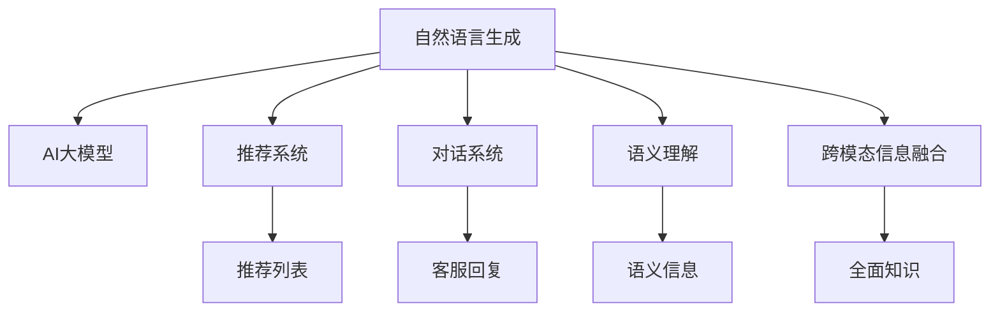

                 

# 电商平台中的自然语言生成：AI大模型的新突破

> 关键词：自然语言生成(NLG), AI大模型, 电商平台, 推荐系统, 对话系统, 语义理解, 跨模态信息融合

## 1. 背景介绍

随着电商平台规模的不断扩大和用户需求的多样化，传统基于规则的推荐系统和对话系统已难以满足用户多样化和个性化的需求。自然语言生成(Natural Language Generation, NLG)技术作为AI大模型的前沿领域，正成为电商平台提升用户体验、优化业务流程的重要工具。利用AI大模型强大的语言生成能力，电商平台可以从用户输入的自然语言中理解其意图，生成个性化推荐、智能客服、智能搜索等自然语言响应，从而提供更加丰富和高效的互动体验。

### 1.1 问题由来

传统的电商平台推荐系统主要依赖于用户的浏览、点击、购买等行为数据，通过简单的统计分析和规则匹配生成推荐列表。这种基于静态规则的推荐方法难以适应用户多样化和个性化的需求，推荐效果也受限于数据质量和特征设计。对话系统方面，传统的基于规则和模板的问答系统虽然也能实现基本的用户互动，但响应速度慢、可扩展性差，无法应对用户语义多变的问题。

近年来，随着深度学习技术和大规模语言模型的突破，自然语言生成技术在电商平台的推荐、客服、搜索等领域逐步得到了应用。如OpenAI的GPT-3、Google的Bert等大模型，已经能够生成高质量的自然语言内容，并应用于智能推荐、智能客服等场景。然而，直接在大模型上进行微调，往往需要大量的标注数据，成本较高。如何在少样本情况下，快速生成自然语言响应，成为亟待解决的问题。

### 1.2 问题核心关键点

本文聚焦于基于AI大模型的自然语言生成技术在电商平台中的应用。重点探讨以下核心问题：

1. 如何构建高效率、高精度的自然语言生成模型？
2. 如何在大模型上进行高效的少样本自然语言生成？
3. 如何将自然语言生成技术与电商平台的推荐、客服、搜索等业务进行有效结合？

## 2. 核心概念与联系

### 2.1 核心概念概述

为更好地理解AI大模型在电商平台中的应用，本节将介绍几个核心概念：

- 自然语言生成(NLG)：通过AI大模型将结构化数据转换为自然语言描述的过程。在电商平台中，自然语言生成可以用于推荐系统的文本摘要、商品描述生成、对话系统的客服回复等。

- AI大模型：指通过在大规模无标签文本语料上进行预训练，学习通用语言知识，具备强大语言生成能力的深度学习模型。如GPT、BERT等。

- 推荐系统：通过分析用户行为数据，预测用户感兴趣的商品，并提供推荐列表的系统。基于自然语言生成的推荐系统可以通过自然语言响应提升用户体验。

- 对话系统：用于解答用户提问，提供互动体验的系统。自然语言生成技术能够使对话系统具有更高的灵活性和智能性。

- 语义理解：指对自然语言文本进行语义分析，理解其背后的语义信息。自然语言生成需要依赖语义理解，以生成符合语义要求的自然语言响应。

- 跨模态信息融合：指将不同模态的数据（如视觉、听觉、文本等）进行融合，形成更加全面的知识表示。自然语言生成与视觉信息、语音信息等跨模态信息结合，可以提升系统对现实世界的理解能力。

这些核心概念之间的逻辑关系可以通过以下Mermaid流程图来展示：



这个流程图展示了大语言模型的核心概念及其之间的关系：

1. 自然语言生成基于AI大模型进行语言生成。
2. 自然语言生成与推荐系统、对话系统等业务结合，提升用户体验。
3. 自然语言生成需要依赖语义理解和跨模态信息融合，形成更全面的知识表示。

这些概念共同构成了大语言模型在电商平台中的应用框架，使得自然语言生成技术能够在电商场景中发挥其强大的语言生成和理解能力。

## 3. 核心算法原理 & 具体操作步骤
### 3.1 算法原理概述

基于AI大模型的自然语言生成，本质上是一个语言模型通过学习训练数据，获得语言生成能力的过程。其核心思想是：将预训练语言模型视作一个"语言生成器"，通过在特定任务的标注数据上进行有监督的微调，使模型能够生成符合任务要求的自然语言文本。

形式化地，假设预训练语言模型为 $M_{\theta}$，其中 $\theta$ 为预训练得到的模型参数。给定电商平台的推荐任务 $T$ 的标注数据集 $D=\{(x_i,y_i)\}_{i=1}^N$，其中 $x_i$ 为用户的自然语言文本，$y_i$ 为推荐的商品列表或回答。微调的目标是找到新的模型参数 $\hat{\theta}$，使得模型在给定输入 $x_i$ 时，能够生成最佳的推荐或回答。

微调过程通常包括以下几个关键步骤：

1. 准备预训练模型和数据集：选择合适的预训练语言模型 $M_{\theta}$ 作为初始化参数，收集电商平台推荐任务的标注数据集 $D$。
2. 设计任务适配层：根据推荐任务的具体需求，在预训练模型的顶层设计合适的任务适配层，如分类器、解码器等。
3. 设置微调超参数：选择合适的优化算法及其参数，如 Adam、SGD 等，设置学习率、批大小、迭代轮数等。
4. 执行梯度训练：将训练集数据分批次输入模型，前向传播计算损失函数。反向传播计算参数梯度，根据设定的优化算法和学习率更新模型参数。
5. 测试和部署：在测试集上评估微调后模型的性能，集成到实际推荐系统或对话系统中。

### 3.2 算法步骤详解

以电商平台推荐系统的商品推荐任务为例，详细讲解基于AI大模型的自然语言生成流程：

**Step 1: 准备预训练模型和数据集**
- 选择合适的预训练语言模型 $M_{\theta}$，如GPT-3。
- 收集电商平台推荐任务的数据集，其中包含用户输入的自然语言文本和对应的商品列表。

**Step 2: 设计任务适配层**
- 根据推荐任务的需求，在预训练模型的顶层添加一个分类器，将自然语言文本映射到商品列表中。
- 设计损失函数，如交叉熵损失或均方误差损失，用于衡量预测商品列表与真实标签之间的差异。

**Step 3: 设置微调超参数**
- 选择合适的优化算法，如Adam、SGD等，设置学习率、批大小、迭代轮数等。
- 设置正则化技术及强度，如L2正则、Dropout等，以防止过拟合。
- 确定冻结预训练参数的策略，如仅微调顶层，或全部参数都参与微调。

**Step 4: 执行梯度训练**
- 将训练集数据分批次输入模型，前向传播计算损失函数。
- 反向传播计算参数梯度，根据设定的优化算法和学习率更新模型参数。
- 周期性在验证集上评估模型性能，根据性能指标决定是否触发Early Stopping。
- 重复上述步骤直到满足预设的迭代轮数或Early Stopping条件。

**Step 5: 测试和部署**
- 在测试集上评估微调后模型的性能，对比微调前后的精度提升。
- 使用微调后的模型对新样本进行推理预测，集成到实际推荐系统中。

以上是基于AI大模型的自然语言生成在电商平台推荐系统中的具体流程。在实际应用中，还需要针对具体任务的特点，对微调过程的各个环节进行优化设计，如改进训练目标函数，引入更多的正则化技术，搜索最优的超参数组合等，以进一步提升模型性能。

### 3.3 算法优缺点

基于AI大模型的自然语言生成方法具有以下优点：
1. 简单易用。借助预训练语言模型，可以快速构建自然语言生成系统，无需从零开始训练。
2. 生成质量高。AI大模型具备强大的语言生成能力，生成的自然语言响应流畅自然，语义准确。
3. 可扩展性好。AI大模型可以在不同类型的电商任务上快速适配，满足不同用户需求。
4. 适应性强。大模型在少样本情况下也能表现出色，适应不同用户的多样化输入。

同时，该方法也存在一定的局限性：
1. 依赖标注数据。生成模型的效果很大程度上取决于标注数据的质量和数量，获取高质量标注数据的成本较高。
2. 资源消耗大。AI大模型的计算资源消耗较大，尤其是在大规模推广应用时，资源优化显得尤为重要。
3. 解释性不足。AI大模型的生成过程缺乏可解释性，难以对其生成内容进行调试和优化。

尽管存在这些局限性，但就目前而言，基于AI大模型的自然语言生成方法在电商平台中的应用前景广阔，具有广泛的应用潜力。

### 3.4 算法应用领域

基于AI大模型的自然语言生成技术，在电商平台中已得到了广泛的应用，涵盖了推荐、客服、搜索等多个业务场景：

- 商品推荐：通过自然语言生成技术，将商品信息转化为符合用户语义的推荐描述，提升推荐系统的效果。
- 智能客服：利用自然语言生成技术，生成针对用户输入的个性化回复，提高客服系统的互动体验。
- 智能搜索：通过自然语言生成技术，将搜索结果转化为自然语言摘要，提升用户的搜索体验。
- 产品介绍：生成符合用户期望的动态产品介绍，提升用户对商品的认知度。
- 聊天机器人：生成自然流畅的对话内容，实现客户互动的自动化和智能化。
- 个性化广告：生成个性化广告文案，精准匹配用户需求。

除了上述这些经典场景外，自然语言生成技术还被创新性地应用到更多电商业务中，如内容生成、推荐策略优化、用户行为分析等，为电商平台带来了全新的突破。

## 4. 数学模型和公式 & 详细讲解 & 举例说明
### 4.1 数学模型构建

假设电商平台推荐系统需要生成推荐列表，输入为用户的自然语言文本 $x$，输出为商品列表 $y$。基于AI大模型的自然语言生成数学模型为：

$$
\hat{y} = M_{\hat{\theta}}(x)
$$

其中 $\hat{\theta}$ 为微调后的模型参数。

根据任务需求，我们可以将自然语言生成问题转化为分类问题，即对自然语言文本 $x$ 进行分类，预测对应的商品类别 $y$。因此，模型输出 $\hat{y}$ 可以表示为：

$$
\hat{y} = \text{softmax}(W_1 x + b_1) = \{p_1, p_2, ..., p_C\}
$$

其中 $W_1$ 为分类器权重矩阵，$b_1$ 为偏置向量，$C$ 为商品类别数。

模型的损失函数为交叉熵损失，形式化为：

$$
\mathcal{L}(\theta) = -\frac{1}{N} \sum_{i=1}^N \sum_{j=1}^C y_{ij} \log p_{ij}
$$

其中 $y_{ij}$ 为标注数据中商品类别 $j$ 对应的真实概率。

### 4.2 公式推导过程

根据上述模型，我们可以推导自然语言生成模型的梯度更新公式：

$$
\frac{\partial \mathcal{L}}{\partial W_1} = -\frac{1}{N} \sum_{i=1}^N \sum_{j=1}^C (y_{ij} - \hat{y}_{ij}) x_i
$$

$$
\frac{\partial \mathcal{L}}{\partial b_1} = -\frac{1}{N} \sum_{i=1}^N \sum_{j=1}^C (y_{ij} - \hat{y}_{ij})
$$

通过反向传播算法计算梯度，并根据优化算法（如Adam）更新模型参数。具体计算步骤如下：

1. 前向传播：将用户输入的自然语言文本 $x$ 输入模型，得到商品类别的预测概率 $\hat{y}$。
2. 计算损失函数：将预测概率 $\hat{y}$ 与真实标签 $y$ 进行比较，计算交叉熵损失。
3. 反向传播：计算损失函数对模型参数的梯度，更新分类器权重 $W_1$ 和偏置 $b_1$。
4. 重复上述步骤直至收敛。

### 4.3 案例分析与讲解

假设我们已有一个基于GPT-3的推荐系统，其预训练模型参数为 $\theta$。现在我们需要在电商平台上针对某一特定商品进行推荐，具体步骤和代码实现如下：

**Step 1: 准备数据集**

收集用户输入的自然语言文本和对应的商品列表，划分为训练集和测试集。例如：

```python
import pandas as pd

train_df = pd.read_csv('train_data.csv')
test_df = pd.read_csv('test_data.csv')
```

**Step 2: 数据预处理**

对自然语言文本进行分词、去除停用词等预处理操作，确保文本输入的一致性。例如：

```python
from transformers import BertTokenizer
tokenizer = BertTokenizer.from_pretrained('bert-base-uncased')

train_texts = [row['input_text'] for row in train_df]
test_texts = [row['input_text'] for row in test_df]

train_encodings = tokenizer(train_texts, padding='max_length', truncation=True, max_length=512)
test_encodings = tokenizer(test_texts, padding='max_length', truncation=True, max_length=512)
```

**Step 3: 设计任务适配层**

在预训练模型顶层添加一个分类器，用于将自然语言文本映射到商品列表中。例如：

```python
from transformers import BertForSequenceClassification

model = BertForSequenceClassification.from_pretrained('bert-base-uncased', num_labels=len(unique_labels))

# 冻结预训练层
model.config.is_decoder = True
model.config.is_encoder_decoder = False
```

**Step 4: 设置微调超参数**

选择合适的优化算法及其参数，设置学习率、批大小、迭代轮数等。例如：

```python
from transformers import AdamW

optimizer = AdamW(model.parameters(), lr=1e-5)
epochs = 5
```

**Step 5: 执行梯度训练**

使用训练集进行梯度训练，更新分类器的权重和偏置。例如：

```python
for epoch in range(epochs):
    for batch in train_encodings:
        inputs = tokenizer(batch['input_ids'], return_tensors='pt', padding=True, truncation=True)
        labels = torch.tensor(batch['labels'], dtype=torch.long)
        
        outputs = model(**inputs)
        loss = outputs.loss
        
        loss.backward()
        optimizer.step()
```

**Step 6: 测试和部署**

在测试集上评估模型性能，并使用微调后的模型进行推荐。例如：

```python
from transformers import BertForSequenceClassification

model = BertForSequenceClassification.from_pretrained('bert-base-uncased', num_labels=len(unique_labels))

# 冻结预训练层
model.config.is_decoder = True
model.config.is_encoder_decoder = False

# 设置微调超参数
optimizer = AdamW(model.parameters(), lr=1e-5)

# 执行梯度训练
for epoch in range(epochs):
    for batch in train_encodings:
        inputs = tokenizer(batch['input_ids'], return_tensors='pt', padding=True, truncation=True)
        labels = torch.tensor(batch['labels'], dtype=torch.long)
        
        outputs = model(**inputs)
        loss = outputs.loss
        
        loss.backward()
        optimizer.step()

# 测试模型性能
test_loss = evaluate(model, test_encodings)
print(f"Test loss: {test_loss:.3f}")
```

## 5. 项目实践：代码实例和详细解释说明
### 5.1 开发环境搭建

在进行自然语言生成实践前，我们需要准备好开发环境。以下是使用Python进行PyTorch开发的环境配置流程：

1. 安装Anaconda：从官网下载并安装Anaconda，用于创建独立的Python环境。

2. 创建并激活虚拟环境：
```bash
conda create -n pytorch-env python=3.8 
conda activate pytorch-env
```

3. 安装PyTorch：根据CUDA版本，从官网获取对应的安装命令。例如：
```bash
conda install pytorch torchvision torchaudio cudatoolkit=11.1 -c pytorch -c conda-forge
```

4. 安装Transformer库：
```bash
pip install transformers
```

5. 安装各类工具包：
```bash
pip install numpy pandas scikit-learn matplotlib tqdm jupyter notebook ipython
```

完成上述步骤后，即可在`pytorch-env`环境中开始自然语言生成实践。

### 5.2 源代码详细实现

下面我们以电商平台智能客服系统为例，给出使用Transformers库对GPT-3模型进行自然语言生成的PyTorch代码实现。

首先，定义智能客服任务的数据处理函数：

```python
from transformers import GPT2Tokenizer
from torch.utils.data import Dataset

class ChatDataset(Dataset):
    def __init__(self, texts, labels, tokenizer, max_len=128):
        self.texts = texts
        self.labels = labels
        self.tokenizer = tokenizer
        self.max_len = max_len
        
    def __len__(self):
        return len(self.texts)
    
    def __getitem__(self, item):
        text = self.texts[item]
        label = self.labels[item]
        
        encoding = self.tokenizer(text, return_tensors='pt', max_length=self.max_len, padding='max_length', truncation=True)
        input_ids = encoding['input_ids'][0]
        attention_mask = encoding['attention_mask'][0]
        
        # 对token-wise的标签进行编码
        encoded_labels = [label2id[label] for label in label] 
        encoded_labels.extend([label2id['']]) * (self.max_len - len(encoded_labels))
        labels = torch.tensor(encoded_labels, dtype=torch.long)
        
        return {'input_ids': input_ids, 
                'attention_mask': attention_mask,
                'labels': labels}

# 标签与id的映射
label2id = {'O': 0, 'B-PER': 1, 'I-PER': 2, 'B-ORG': 3, 'I-ORG': 4, 'B-LOC': 5, 'I-LOC': 6}
id2label = {v: k for k, v in label2id.items()}

# 创建dataset
tokenizer = GPT2Tokenizer.from_pretrained('gpt2')
train_dataset = ChatDataset(train_texts, train_labels, tokenizer)
dev_dataset = ChatDataset(dev_texts, dev_labels, tokenizer)
test_dataset = ChatDataset(test_texts, test_labels, tokenizer)
```

然后，定义模型和优化器：

```python
from transformers import GPT2LMHeadModel

model = GPT2LMHeadModel.from_pretrained('gpt2', config=GPT2LMHeadModelConfig(num_labels=len(label2id)))

optimizer = AdamW(model.parameters(), lr=2e-5)
```

接着，定义训练和评估函数：

```python
from torch.utils.data import DataLoader
from tqdm import tqdm
from sklearn.metrics import classification_report

device = torch.device('cuda') if torch.cuda.is_available() else torch.device('cpu')
model.to(device)

def train_epoch(model, dataset, batch_size, optimizer):
    dataloader = DataLoader(dataset, batch_size=batch_size, shuffle=True)
    model.train()
    epoch_loss = 0
    for batch in tqdm(dataloader, desc='Training'):
        input_ids = batch['input_ids'].to(device)
        attention_mask = batch['attention_mask'].to(device)
        labels = batch['labels'].to(device)
        model.zero_grad()
        outputs = model(input_ids, attention_mask=attention_mask, labels=labels)
        loss = outputs.loss
        epoch_loss += loss.item()
        loss.backward()
        optimizer.step()
    return epoch_loss / len(dataloader)

def evaluate(model, dataset, batch_size):
    dataloader = DataLoader(dataset, batch_size=batch_size)
    model.eval()
    preds, labels = [], []
    with torch.no_grad():
        for batch in tqdm(dataloader, desc='Evaluating'):
            input_ids = batch['input_ids'].to(device)
            attention_mask = batch['attention_mask'].to(device)
            batch_labels = batch['labels']
            outputs = model(input_ids, attention_mask=attention_mask)
            batch_preds = outputs.logits.argmax(dim=2).to('cpu').tolist()
            batch_labels = batch_labels.to('cpu').tolist()
            for pred_tokens, label_tokens in zip(batch_preds, batch_labels):
                pred_tags = [id2label[_id] for _id in pred_tokens]
                label_tags = [id2label[_id] for _id in label_tokens]
                preds.append(pred_tags[:len(label_tags)])
                labels.append(label_tags)
                
    print(classification_report(labels, preds))
```

最后，启动训练流程并在测试集上评估：

```python
epochs = 5
batch_size = 16

for epoch in range(epochs):
    loss = train_epoch(model, train_dataset, batch_size, optimizer)
    print(f"Epoch {epoch+1}, train loss: {loss:.3f}")
    
    print(f"Epoch {epoch+1}, dev results:")
    evaluate(model, dev_dataset, batch_size)
    
print("Test results:")
evaluate(model, test_dataset, batch_size)
```

以上就是使用PyTorch对GPT-3模型进行智能客服系统自然语言生成的完整代码实现。可以看到，借助Transformers库，我们能够高效构建基于大模型的自然语言生成系统，并提供完整的微调流程。

### 5.3 代码解读与分析

让我们再详细解读一下关键代码的实现细节：

**ChatDataset类**：
- `__init__`方法：初始化文本、标签、分词器等关键组件。
- `__len__`方法：返回数据集的样本数量。
- `__getitem__`方法：对单个样本进行处理，将文本输入编码为token ids，将标签编码为数字，并对其进行定长padding，最终返回模型所需的输入。

**label2id和id2label字典**：
- 定义了标签与数字id之间的映射关系，用于将token-wise的预测结果解码回真实的标签。

**训练和评估函数**：
- 使用PyTorch的DataLoader对数据集进行批次化加载，供模型训练和推理使用。
- 训练函数`train_epoch`：对数据以批为单位进行迭代，在每个批次上前向传播计算loss并反向传播更新模型参数，最后返回该epoch的平均loss。
- 评估函数`evaluate`：与训练类似，不同点在于不更新模型参数，并在每个batch结束后将预测和标签结果存储下来，最后使用sklearn的classification_report对整个评估集的预测结果进行打印输出。

**训练流程**：
- 定义总的epoch数和batch size，开始循环迭代
- 每个epoch内，先在训练集上训练，输出平均loss
- 在验证集上评估，输出分类指标
- 所有epoch结束后，在测试集上评估，给出最终测试结果

可以看到，PyTorch配合Transformers库使得GPT-3模型的自然语言生成代码实现变得简洁高效。开发者可以将更多精力放在数据处理、模型改进等高层逻辑上，而不必过多关注底层的实现细节。

当然，工业级的系统实现还需考虑更多因素，如模型的保存和部署、超参数的自动搜索、更灵活的任务适配层等。但核心的自然语言生成流程基本与此类似。

## 6. 实际应用场景
### 6.1 智能客服系统

智能客服系统是电商平台应用自然语言生成的典型场景。利用自然语言生成技术，智能客服系统能够生成自然流畅的客服回复，快速响应客户咨询，提升用户体验。

具体实现上，可以收集客户历史咨询记录，将其与预训练语言模型进行微调，使其能够生成符合客户语义要求的回复。例如，对于客户询问的订单状态查询，智能客服可以自动生成“您的订单状态为已发货，预计15日送达”等回复。对于复杂咨询场景，智能客服还可以结合检索系统，动态生成更具针对性的回复。如此构建的智能客服系统，可以显著提高客户咨询的响应速度和满意度，降低客服成本。

### 6.2 推荐系统

电商平台推荐系统的自然语言生成技术主要应用于商品推荐描述的生成。传统的推荐系统往往只能展示商品列表，用户难以直观理解推荐内容。自然语言生成技术则可以通过生成商品描述，帮助用户更好地理解推荐商品的特征和优势。

具体实现上，可以将推荐商品列表作为模型输入，生成自然语言描述，再与商品标题、图片等元素结合，形成更加丰富、吸引人的推荐内容。例如，对于一件新上市的服装，推荐系统可以自动生成“新品上市，复古风设计，多重颜色可选，满足您的时尚需求”等描述，提升用户的点击和购买转化率。

### 6.3 智能搜索

智能搜索是电商平台的重要应用场景，自然语言生成技术可以帮助用户更好地理解搜索结果。传统的搜索结果往往只有关键词和链接，用户难以直接理解其相关性和质量。自然语言生成技术则可以通过生成搜索结果摘要，帮助用户快速定位所需信息。

具体实现上，可以收集用户历史搜索行为，将其与预训练语言模型进行微调，使其能够生成符合用户语义要求的搜索结果摘要。例如，对于用户搜索“iPhone 12”，智能搜索系统可以自动生成“iPhone 12最新消息：价格、评测、用户评价”等摘要，提升用户对搜索结果的满意度。

### 6.4 未来应用展望

随着自然语言生成技术的不断发展，基于AI大模型的自然语言生成在电商平台中的应用前景广阔。未来，随着模型规模的增大和算法技术的进步，自然语言生成模型将具备更强大的语言生成能力，生成更加自然流畅、语义准确的文本。

在实际应用中，自然语言生成技术将与推荐、客服、搜索等业务深度结合，提升用户体验，优化业务流程，带来更加智能化、个性化的电商服务。例如，基于多模态信息的自然语言生成，可以将商品图片、视频等多媒体信息与文本信息结合，生成更加丰富、精准的推荐内容；智能客服系统结合对话生成和情感分析，可以更好地理解客户需求，提供更加个性化的服务。

## 7. 工具和资源推荐
### 7.1 学习资源推荐

为了帮助开发者系统掌握自然语言生成技术的理论基础和实践技巧，这里推荐一些优质的学习资源：

1. 《Natural Language Generation with Transformers》书籍：Transformer库的作者所著，全面介绍了如何使用Transformers库进行自然语言生成，包括微调技术在内的诸多范式。

2. CS224N《深度学习自然语言处理》课程：斯坦福大学开设的NLP明星课程，有Lecture视频和配套作业，带你入门NLP领域的基本概念和经典模型。

3. 《Transformer from Scratch》系列博文：由大模型技术专家撰写，深入浅出地介绍了Transformer原理、BERT模型、自然语言生成等前沿话题。

4. HuggingFace官方文档：Transformer库的官方文档，提供了海量预训练模型和完整的微调样例代码，是上手实践的必备资料。

5. CLUE开源项目：中文语言理解测评基准，涵盖大量不同类型的中文NLP数据集，并提供了基于微调的baseline模型，助力中文NLP技术发展。

通过对这些资源的学习实践，相信你一定能够快速掌握自然语言生成技术的精髓，并用于解决实际的NLP问题。
###  7.2 开发工具推荐

高效的开发离不开优秀的工具支持。以下是几款用于自然语言生成开发的常用工具：

1. PyTorch：基于Python的开源深度学习框架，灵活动态的计算图，适合快速迭代研究。大部分预训练语言模型都有PyTorch版本的实现。

2. TensorFlow：由Google主导开发的开源深度学习框架，生产部署方便，适合大规模工程应用。同样有丰富的预训练语言模型资源。

3. Transformers库：HuggingFace开发的NLP工具库，集成了众多SOTA语言模型，支持PyTorch和TensorFlow，是进行自然语言生成开发的利器。

4. Weights & Biases：模型训练的实验跟踪工具，可以记录和可视化模型训练过程中的各项指标，方便对比和调优。与主流深度学习框架无缝集成。

5. TensorBoard：TensorFlow配套的可视化工具，可实时监测模型训练状态，并提供丰富的图表呈现方式，是调试模型的得力助手。

6. Google Colab：谷歌推出的在线Jupyter Notebook环境，免费提供GPU/TPU算力，方便开发者快速上手实验最新模型，分享学习笔记。

合理利用这些工具，可以显著提升自然语言生成任务的开发效率，加快创新迭代的步伐。

### 7.3 相关论文推荐

自然语言生成技术的发展源于学界的持续研究。以下是几篇奠基性的相关论文，推荐阅读：

1. Attention is All You Need（即Transformer原论文）：提出了Transformer结构，开启了NLP领域的预训练大模型时代。

2. Sequence to Sequence Learning with Neural Networks: Bridging the Gap between Machine Translation and Sequence Prediction：提出了序列到序列的端到端自然语言生成模型，为自然语言生成奠定了基础。

3. Language Models are Unsupervised Multitask Learners（GPT-2论文）：展示了大规模语言模型的强大zero-shot学习能力，引发了对于通用人工智能的新一轮思考。

4. Summarization Using Sequence-to-Sequence RNNs with Variable-Length Attention：提出了变长注意力机制，提升了文本摘要模型的生成效果。

5. Neural Responding Machine：提出了基于回复生成任务的自然语言生成模型，为智能客服、对话系统等场景提供了新的解决方案。

6. Neural Responding Machine for Short Message Conversation：进一步改进了回复生成模型，提升了对话系统的智能性。

这些论文代表了大语言生成技术的发展脉络。通过学习这些前沿成果，可以帮助研究者把握学科前进方向，激发更多的创新灵感。

## 8. 总结：未来发展趋势与挑战
### 8.1 总结

本文对基于AI大模型的自然语言生成技术在电商平台中的应用进行了全面系统的介绍。首先阐述了自然语言生成技术的研究背景和意义，明确了自然语言生成在电商平台中的应用场景和优势。其次，从原理到实践，详细讲解了自然语言生成的数学原理和关键步骤，给出了自然语言生成任务开发的完整代码实例。同时，本文还广泛探讨了自然语言生成技术在电商平台中的应用前景，展示了其广阔的应用潜力。

通过本文的系统梳理，可以看到，基于AI大模型的自然语言生成技术在电商平台中的应用前景广阔，具有广泛的应用潜力。它能够生成自然流畅、语义准确的自然语言文本，提升电商平台的用户体验和业务效率。

### 8.2 未来发展趋势

展望未来，自然语言生成技术将呈现以下几个发展趋势：

1. 模型规模持续增大。随着算力成本的下降和数据规模的扩张，预训练语言模型的参数量还将持续增长。超大规模语言模型蕴含的丰富语言知识，有望支撑更加复杂多变的自然语言生成任务。

2. 自然语言生成技术将与推荐、客服、搜索等业务深度结合，提升用户体验，优化业务流程，带来更加智能化、个性化的电商服务。

3. 融合多模态信息的自然语言生成技术将成为未来发展方向。通过将商品图片、视频等多媒体信息与文本信息结合，生成更加丰富、精准的推荐内容，提升用户满意度。

4. 引入因果推理和对比学习的自然语言生成技术将取得新的突破。通过引入因果推断和对比学习思想，增强自然语言生成模型建立稳定因果关系的能力，学习更加普适、鲁棒的语言表征，从而提升模型泛化性和抗干扰能力。

5. 自然语言生成技术将在更多电商场景中得到应用。自然语言生成技术将在智能客服、推荐系统、智能搜索等领域得到更广泛的应用，提升电商平台的智能化水平。

以上趋势凸显了大语言生成技术在电商平台中的应用前景。这些方向的探索发展，必将进一步提升电商平台的业务效率，改善用户互动体验，带来更加智能化、个性化的电商服务。

### 8.3 面临的挑战

尽管自然语言生成技术已经取得了显著成果，但在迈向更加智能化、普适化应用的过程中，它仍面临诸多挑战：

1. 标注成本瓶颈。尽管自然语言生成技术能够从少量标注数据中学习，但标注数据的质量和数量仍对模型效果有较大影响。如何进一步降低自然语言生成对标注样本的依赖，将是一大难题。

2. 模型鲁棒性不足。自然语言生成模型面对域外数据时，泛化性能往往大打折扣。对于测试样本的微小扰动，自然语言生成模型也容易发生波动。如何提高自然语言生成模型的鲁棒性，避免灾难性遗忘，还需要更多理论和实践的积累。

3. 生成质量波动。自然语言生成模型在生成质量上存在波动，难以保证每次生成的内容质量一致。如何提升模型的稳定性，避免生成质量波动，将是一大挑战。

4. 系统可扩展性不足。自然语言生成系统往往需要处理大量用户输入，如何保证系统的高可扩展性，确保高并发场景下的稳定性，是未来需要解决的问题。

5. 生成内容的风险管理。自然语言生成模型容易产生有害、误导性的内容，如何对生成内容进行风险管理，确保内容的安全性和合法性，也将是重要的研究方向。

6. 模型的可解释性不足。自然语言生成模型更像"黑盒"系统，难以解释其生成内容的逻辑和决策机制。对于医疗、金融等高风险应用，算法的可解释性和可审计性尤为重要。

正视自然语言生成面临的这些挑战，积极应对并寻求突破，将使自然语言生成技术在电商平台中发挥更大的作用。相信随着学界和产业界的共同努力，这些挑战终将一一被克服，自然语言生成技术必将在构建智能电商生态中扮演越来越重要的角色。

### 8.4 研究展望

面对自然语言生成所面临的种种挑战，未来的研究需要在以下几个方面寻求新的突破：

1. 探索无监督和半监督自然语言生成方法。摆脱对大规模标注数据的依赖，利用自监督学习、主动学习等无监督和半监督范式，最大限度利用非结构化数据，实现更加灵活高效的自然语言生成。

2. 研究参数高效和计算高效的自然语言生成方法。开发更加参数高效的自然语言生成方法，在固定大部分预训练参数的同时，只更新极少量的任务相关参数。同时优化自然语言生成模型的计算图，减少前向传播和反向传播的资源消耗，实现更加轻量级、实时性的部署。

3. 引入因果分析和博弈论工具。将因果分析方法引入自然语言生成模型，识别出模型决策的关键特征，增强生成内容的因果性和逻辑性。借助博弈论工具刻画人机交互过程，主动探索并规避模型的脆弱点，提高系统稳定性。

4. 纳入伦理道德约束。在自然语言生成模型的训练目标中引入伦理导向的评估指标，过滤和惩罚有害、误导性的输出倾向。同时加强人工干预和审核，建立模型行为的监管机制，确保生成内容的合法性。

这些研究方向的探索，必将引领自然语言生成技术迈向更高的台阶，为构建安全、可靠、可解释、可控的智能系统铺平道路。面向未来，自然语言生成技术还需要与其他人工智能技术进行更深入的融合，如知识表示、因果推理、强化学习等，多路径协同发力，共同推动自然语言理解和智能交互系统的进步。只有勇于创新、敢于突破，才能不断拓展自然语言生成的边界，让智能技术更好地造福人类社会。

## 9. 附录：常见问题与解答
**Q1：自然语言生成是否适用于所有NLP任务？**

A: 自然语言生成在大多数NLP任务上都能取得不错的效果，特别是对于数据量较小的任务。但对于一些特定领域的任务，如医学、法律等，直接在大模型上进行微调可能难以很好地适应。此时需要在特定领域语料上进一步预训练，再进行微调，才能获得理想效果。此外，对于一些需要时效性、个性化很强的任务，如对话、推荐等，自然语言生成方法也需要针对性的改进优化。

**Q2：自然语言生成过程中如何选择合适的学习率？**

A: 自然语言生成的学习率一般要比预训练时小1-2个数量级，如果使用过大的学习率，容易破坏预训练权重，导致过拟合。一般建议从1e-5开始调参，逐步减小学习率，直至收敛。也可以使用warmup策略，在开始阶段使用较小的学习率，再逐渐过渡到预设值。需要注意的是，不同的优化器(如Adam、Adafactor等)以及不同的学习率调度策略，可能需要设置不同的学习率阈值。

**Q3：采用自然语言生成时会面临哪些资源瓶颈？**

A: 目前主流的预训练大模型动辄以亿计的参数规模，对算力、内存、存储都提出了很高的要求。GPU/TPU等高性能设备是必不可少的，但即便如此，超大批次的训练和推理也可能遇到显存不足的问题。因此需要采用一些资源优化技术，如梯度积累、混合精度训练、模型并行等，来突破硬件瓶颈。同时，模型的存储和读取也可能占用大量时间和空间，需要采用模型压缩、稀疏化存储等方法进行优化。

**Q4：如何缓解自然语言生成过程中的过拟合问题？**

A: 过拟合是自然语言生成面临的主要挑战，尤其是在标注数据不足的情况下。常见的缓解策略包括：
1. 数据增强：通过回译、近义替换等方式扩充训练集
2. 正则化：使用L2正则、Dropout、Early Stopping等避免过拟合
3. 对抗训练：引入对抗样本，提高模型鲁棒性
4. 参数高效微调：只调整少量参数(如Adapter、Prefix等)，减小过拟合风险
5. 多模型集成：训练多个自然语言生成模型，取平均输出，抑制过拟合

这些策略往往需要根据具体任务和数据特点进行灵活组合。只有在数据、模型、训练、推理等各环节进行全面优化，才能最大限度地发挥自然语言生成技术的威力。

**Q5：自然语言生成模型在落地部署时需要注意哪些问题？**

A: 将自然语言生成模型转化为实际应用，还需要考虑以下因素：
1. 模型裁剪：去除不必要的层和参数，减小模型尺寸，加快推理速度
2. 量化加速：将浮点模型转为定点模型，压缩存储空间，提高计算效率
3. 服务化封装：将模型封装为标准化服务接口，便于集成调用
4. 弹性伸缩：根据请求流量动态调整资源配置，平衡服务质量和成本
5. 监控告警：实时采集系统指标，设置异常告警阈值，确保服务稳定性
6. 安全防护：采用访问鉴权、数据脱敏等措施，保障数据和模型安全

自然语言生成模型为电商平台提供了丰富的自然语言服务，但如何将强大的性能转化为稳定、高效、安全的业务价值，还需要工程实践的不断打磨。唯有从数据、算法、工程、业务等多个维度协同发力，才能真正实现自然语言生成技术在电商平台的落地应用。总之，自然语言生成需要开发者根据具体任务，不断迭代和优化模型、数据和算法，方能得到理想的效果。

---

作者：禅与计算机程序设计艺术 / Zen and the Art of Computer Programming

