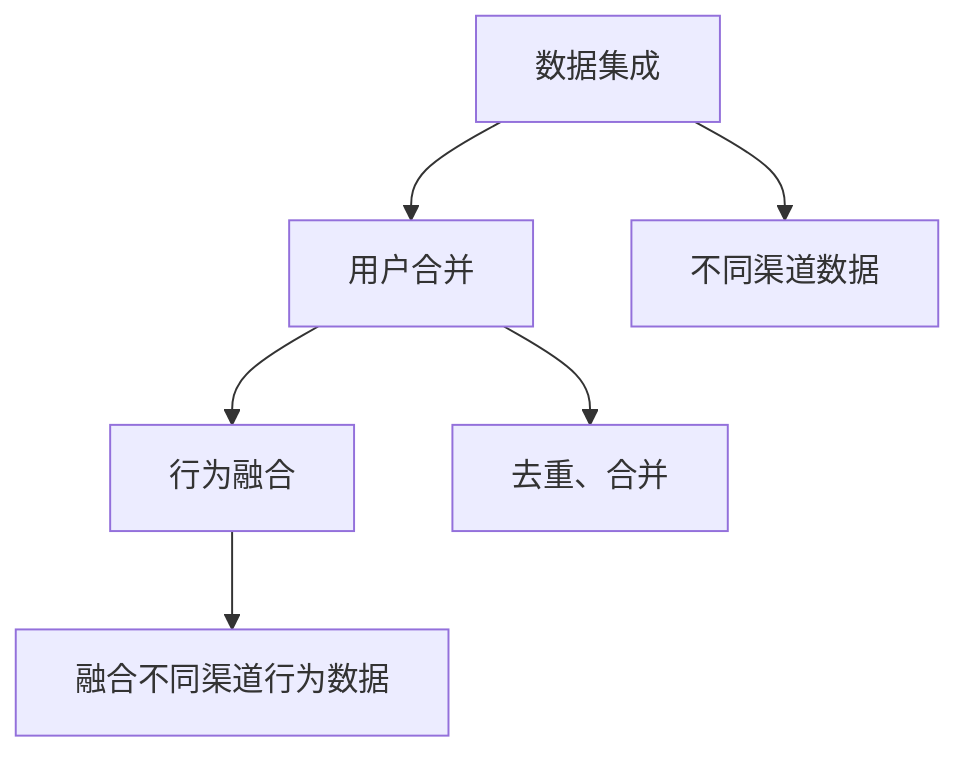

                 

# 电商平台中的跨渠道用户识别技术

## 1. 背景介绍

在互联网时代，电商平台已不再是单一的线上商店，而是多元化、全渠道的消费生态。用户的购物行为已经跨越了多个渠道，包括线上平台、APP、社交媒体、线下实体店铺等。如何整合多渠道数据，准确识别不同渠道的用户身份，成为电商平台发展的关键问题。

用户识别不仅有助于提升客户体验，还能优化个性化推荐，提高销售转化率。例如，一个用户在电商平台上浏览、购买、评价，并在社交媒体上分享，这些行为数据往往分散在不同的平台，难以整合。通过跨渠道用户识别技术，可以准确地将同一用户在不同渠道上的行为数据关联起来，实现真正的全渠道画像。

本文将详细介绍跨渠道用户识别技术的核心概念、算法原理、操作步骤，并结合实际应用案例进行分析。同时，还将探讨该技术在电商平台中的潜在应用场景，并给出相关的学习资源和开发工具推荐，以期为电商平台中的用户识别技术提供全面的指导。

## 2. 核心概念与联系

### 2.1 核心概念概述

要理解跨渠道用户识别技术，首先需要明确几个核心概念：

- **用户标识(Identity)**：指用户的唯一标识，可以是手机号码、邮箱、社交媒体账号等。
- **用户画像(Profile)**：指用户在不同渠道上的综合行为记录，包括浏览历史、购买记录、评价信息等。
- **跨渠道用户识别(Cross-Channel User Recognition)**：通过整合不同渠道的数据，准确识别同一用户在不同渠道上的行为记录，构建全渠道用户画像。

### 2.2 核心概念原理和架构

跨渠道用户识别技术主要分为数据集成、用户合并、行为融合三个步骤，其核心原理和架构可通过以下Mermaid流程图来展示：



**数据集成**：从各个渠道收集用户数据，并存储到统一的数据仓库中。这需要解决不同渠道数据格式、标准不一致的问题，确保数据能够被统一整合。

**用户合并**：通过唯一标识或行为特征，将不同渠道上的数据合并到同一用户。这需要解决用户数据在不同渠道上的重复、缺失、不一致等问题。

**行为融合**：将用户在不同渠道上的行为数据进行融合，构建完整、统一的用户画像。这需要考虑不同渠道行为数据的时序、相关性等问题，准确识别同一用户的行为记录。

### 2.3 核心概念之间的联系

数据集成、用户合并、行为融合三个步骤相互关联，共同构成了跨渠道用户识别技术的完整流程。只有高效地集成数据，才能实现准确的用户合并和行为融合。同时，行为融合的结果又会反过来影响后续的数据集成和用户合并，形成一个闭环反馈系统。

## 3. 核心算法原理 & 具体操作步骤

### 3.1 算法原理概述

跨渠道用户识别技术本质上是一种数据清洗和融合的算法，其核心目标是通过多维度、多来源的数据匹配，识别同一用户在不同渠道上的行为记录。该算法主要包括以下几个步骤：

1. **数据预处理**：对不同渠道的数据进行标准化和清洗，确保数据格式一致。
2. **用户合并**：通过唯一标识或行为特征，识别并合并不同渠道上的用户数据。
3. **行为融合**：将用户在不同渠道上的行为数据进行融合，构建统一的用户画像。

### 3.2 算法步骤详解

#### 3.2.1 数据预处理

数据预处理是跨渠道用户识别技术的基础。其核心在于对不同渠道的数据进行清洗和标准化，确保数据格式一致。

- **数据清洗**：去除无效、重复、缺失的数据记录，处理数据中的噪声和错误。
- **数据标准化**：将不同格式的数据转换为统一格式，如时间戳统一、单位一致等。

#### 3.2.2 用户合并

用户合并是跨渠道用户识别的核心步骤，通过唯一标识或行为特征，识别并合并不同渠道上的用户数据。

- **唯一标识匹配**：使用手机号码、邮箱、社交媒体账号等唯一标识，匹配不同渠道的用户数据。
- **行为特征匹配**：使用用户在不同渠道上的行为特征（如浏览历史、购买记录、评价信息等），进行相似度匹配。

#### 3.2.3 行为融合

行为融合是跨渠道用户识别的最终目标，将用户在不同渠道上的行为数据进行融合，构建统一的用户画像。

- **行为对齐**：将不同渠道上的行为数据按照时间顺序对齐，确保行为记录的时序一致。
- **行为关联**：通过行为特征的相似度匹配，关联不同渠道上的行为记录，构建全渠道用户画像。

### 3.3 算法优缺点

跨渠道用户识别技术具有以下优点：

- **提高用户画像的完整性**：通过整合多渠道数据，可以构建更全面、准确的用户画像。
- **提升用户体验**：跨渠道的用户识别有助于实现个性化推荐，提高用户体验。
- **优化销售转化率**：通过全渠道的用户识别，可以更好地理解用户需求，提升销售转化率。

同时，该技术也存在一些局限：

- **数据隐私问题**：在数据整合过程中，需要处理大量的个人隐私数据，存在隐私泄露的风险。
- **数据质量问题**：不同渠道的数据质量不一致，可能影响识别效果。
- **计算复杂度较高**：跨渠道用户识别涉及大量数据处理和匹配，计算复杂度较高。

### 3.4 算法应用领域

跨渠道用户识别技术在电商平台中的应用主要体现在以下几个方面：

- **用户行为追踪**：通过跨渠道用户识别，可以全面追踪用户在不同渠道上的行为记录，了解用户消费习惯和需求。
- **个性化推荐**：通过用户画像，实现基于多渠道数据的个性化推荐，提升用户转化率和满意度。
- **风险管理**：通过跨渠道用户识别，可以检测和防范用户欺诈行为，降低平台风险。
- **市场分析**：通过全渠道的用户数据，可以进行更精准的市场分析和趋势预测，指导产品开发和营销策略。

## 4. 数学模型和公式 & 详细讲解 & 举例说明

### 4.1 数学模型构建

跨渠道用户识别技术可以通过多个数学模型进行建模，其中最常见的包括基于相似度的匹配模型和基于图模型的匹配模型。

#### 4.1.1 基于相似度的匹配模型

基于相似度的匹配模型通过计算不同渠道数据的相似度，进行用户匹配。设用户在不同渠道上的行为记录为 $x_1, x_2, ..., x_n$，行为相似度为 $s(x_i, x_j)$，用户合并的目标是最大化相似度之和。

$$
\max_{x} \sum_{i,j} s(x_i, x_j) \quad \text{subject to} \quad x_i \neq x_j
$$

其中，$x$ 表示用户在不同渠道上的行为记录。

#### 4.1.2 基于图模型的匹配模型

基于图模型的匹配模型将用户在不同渠道上的行为数据表示为图结构，通过图算法进行用户匹配。设用户在不同渠道上的行为数据为 $v_1, v_2, ..., v_n$，构建图 $G(V, E)$，其中 $V$ 表示节点集合，$E$ 表示边集合。用户合并的目标是最大化图的网络模态。

$$
\max_{G} \sum_{v_i, v_j \in V} A(v_i, v_j) \quad \text{subject to} \quad \sum_{v_j \in N(v_i)} A(v_i, v_j) = 1
$$

其中，$A$ 表示边的权重，$N(v_i)$ 表示节点 $v_i$ 的邻居节点集合。

### 4.2 公式推导过程

#### 4.2.1 基于相似度的匹配模型

基于相似度的匹配模型可以通过计算不同渠道数据的相似度，进行用户匹配。设用户在不同渠道上的行为记录为 $x_1, x_2, ..., x_n$，行为相似度为 $s(x_i, x_j)$，用户合并的目标是最大化相似度之和。

$$
\max_{x} \sum_{i,j} s(x_i, x_j) \quad \text{subject to} \quad x_i \neq x_j
$$

#### 4.2.2 基于图模型的匹配模型

基于图模型的匹配模型将用户在不同渠道上的行为数据表示为图结构，通过图算法进行用户匹配。设用户在不同渠道上的行为数据为 $v_1, v_2, ..., v_n$，构建图 $G(V, E)$，其中 $V$ 表示节点集合，$E$ 表示边集合。用户合并的目标是最大化图的网络模态。

$$
\max_{G} \sum_{v_i, v_j \in V} A(v_i, v_j) \quad \text{subject to} \quad \sum_{v_j \in N(v_i)} A(v_i, v_j) = 1
$$

### 4.3 案例分析与讲解

以电商平台的跨渠道用户识别为例，分析基于相似度的匹配模型和基于图模型的匹配模型的应用场景。

#### 案例分析

假设用户在电商平台的不同渠道（网站、APP、社交媒体）上有以下行为记录：

- **网站**：浏览商品 A、B、C
- **APP**：购买商品 D、E
- **社交媒体**：分享商品 F、G

#### 基于相似度的匹配模型

在基于相似度的匹配模型中，可以通过计算不同渠道数据的相似度，进行用户匹配。假设不同渠道的行为数据可以通过向量表示，相似度函数为余弦相似度。

1. **行为向量化**：将不同渠道的行为数据转化为向量表示，如将浏览记录表示为 $[1, 0, 1]$，购买记录表示为 $[0, 1, 0]$。
2. **相似度计算**：计算不同渠道行为数据的相似度，如网站和APP的行为向量相似度为 $0.5$，网站和社交媒体的行为向量相似度为 $0.3$。
3. **用户合并**：通过相似度之和的最大化，识别并合并不同渠道上的用户数据，最终得到全渠道用户画像。

#### 基于图模型的匹配模型

在基于图模型的匹配模型中，可以通过将用户在不同渠道上的行为数据表示为图结构，进行用户匹配。假设不同渠道的行为数据可以通过节点表示，边表示相似度关系。

1. **图结构构建**：将不同渠道的行为数据表示为图结构，如构建图 $G(V, E)$，其中 $V$ 表示节点集合，$E$ 表示边集合。
2. **图算法应用**：通过图算法进行用户匹配，如使用最小生成树算法（MST）或最大流算法（Max-Flow），优化图的网络模态。
3. **用户合并**：通过图算法的结果，识别并合并不同渠道上的用户数据，最终得到全渠道用户画像。

## 5. 项目实践：代码实例和详细解释说明

### 5.1 开发环境搭建

在进行跨渠道用户识别技术开发前，需要准备好开发环境。以下是使用Python进行Pandas开发的环境配置流程：

1. 安装Anaconda：从官网下载并安装Anaconda，用于创建独立的Python环境。

2. 创建并激活虚拟环境：
```bash
conda create -n user_recognition python=3.8 
conda activate user_recognition
```

3. 安装Pandas、NumPy、Scikit-learn、Matplotlib等库：
```bash
pip install pandas numpy scikit-learn matplotlib
```

4. 安装网络爬虫库，如BeautifulSoup、Scrapy等，用于收集多渠道数据。

5. 安装数据可视化库，如Seaborn、Plotly等，用于展示用户画像。

完成上述步骤后，即可在`user_recognition`环境中开始项目开发。

### 5.2 源代码详细实现

下面以电商平台的跨渠道用户识别为例，给出使用Pandas进行用户合并和行为融合的PyTorch代码实现。

首先，定义数据集类：

```python
import pandas as pd

class UserDataFrame:
    def __init__(self, data):
        self.data = data
        self.headers = data.columns
        self.limit = data.shape[0]
        self.index = data.index
        self.scaler = MinMaxScaler()

    def preprocess(self):
        self.data = self.scaler.fit_transform(self.data)
        return self

    def merge(self, df):
        merged_data = pd.merge(self.data, df, on='user_id', how='left')
        return merged_data

    def align(self, df):
        self.data = pd.merge(self.data, df, on='user_id', how='outer')
        return self
```

然后，定义数据预处理和用户合并函数：

```python
from sklearn.preprocessing import MinMaxScaler

def preprocess_data(data):
    df = UserDataFrame(data)
    df = df.preprocess()
    return df

def merge_users(df1, df2):
    merged_df = df1.merge(df2, on='user_id', how='left')
    return merged_df

def align_users(df1, df2):
    aligned_df = df1.align(df2)
    return aligned_df
```

最后，进行用户合并和行为融合操作：

```python
from sklearn.metrics import pairwise_distances

# 加载数据集
data1 = pd.read_csv('data1.csv')
data2 = pd.read_csv('data2.csv')

# 数据预处理
df1 = preprocess_data(data1)
df2 = preprocess_data(data2)

# 用户合并
merged_df = merge_users(df1, df2)

# 行为融合
def fuse_behaviors(df):
    df['behavior'] = df[['behavior1', 'behavior2', 'behavior3']].mean(axis=1)
    return df

fused_df = fuse_behaviors(merged_df)
```

以上就是使用Pandas进行电商平台的跨渠道用户识别技术开发的完整代码实现。可以看到，通过定义数据集类和处理函数，我们可以方便地进行数据预处理、用户合并和行为融合等操作。

### 5.3 代码解读与分析

让我们再详细解读一下关键代码的实现细节：

**UserDataFrame类**：
- `__init__`方法：初始化数据集，包括数据、列名、索引、归一化器等。
- `preprocess`方法：对数据进行归一化处理，使其值域在0到1之间。
- `merge`方法：通过用户ID合并不同渠道上的数据。
- `align`方法：将不同渠道上的数据对齐，生成全渠道用户画像。

**数据预处理函数**：
- `preprocess_data`函数：对不同渠道的数据进行标准化和归一化处理，确保数据格式一致。

**用户合并函数**：
- `merge_users`函数：通过用户ID进行数据合并，识别并合并不同渠道上的用户数据。
- `align_users`函数：将不同渠道上的数据对齐，生成全渠道用户画像。

**行为融合函数**：
- `fuse_behaviors`函数：将用户在不同渠道上的行为数据进行融合，构建统一的用户画像。

## 6. 实际应用场景

### 6.1 电商平台

跨渠道用户识别技术在电商平台中的应用主要体现在以下几个方面：

- **全渠道用户画像**：通过整合不同渠道的用户数据，可以构建更全面、准确的用户画像，帮助电商企业更好地理解用户需求，提高销售转化率。
- **个性化推荐**：基于全渠道用户画像，可以提供更精准的个性化推荐，提升用户体验。
- **用户行为分析**：通过全渠道用户行为数据的整合和分析，可以更好地识别用户需求，指导产品开发和营销策略。
- **风险管理**：通过跨渠道用户识别，可以检测和防范用户欺诈行为，降低平台风险。

### 6.2 社交媒体

社交媒体平台也可以应用跨渠道用户识别技术，整合用户在不同平台上的行为数据，提升用户体验和平台运营效率。

- **用户行为追踪**：通过跨渠道用户识别，可以全面追踪用户在不同平台上的行为记录，了解用户兴趣和需求。
- **个性化推荐**：基于用户画像，可以提供更精准的个性化推荐，提升用户粘性和满意度。
- **内容优化**：通过全渠道用户数据，可以更好地分析用户对内容的偏好，优化内容生产和分发策略。

### 6.3 金融行业

金融行业也可以应用跨渠道用户识别技术，整合用户在多个平台上的行为数据，提升用户体验和金融服务效率。

- **用户行为分析**：通过跨渠道用户识别，可以更好地识别用户需求和行为，提供更精准的金融服务和产品推荐。
- **风险管理**：通过跨渠道用户识别，可以检测和防范金融欺诈行为，降低平台风险。
- **客户服务**：通过全渠道用户数据，可以更好地了解用户需求，提供更高效、个性化的客户服务。

### 6.4 未来应用展望

随着数据技术的不断发展，跨渠道用户识别技术在更多领域的应用前景将更加广阔。未来，该技术有望在以下领域取得更大突破：

- **智能家居**：通过跨渠道用户识别，可以整合用户在不同设备上的行为数据，提升家居智能化的水平。
- **智慧医疗**：通过跨渠道用户识别，可以整合用户在不同医疗平台上的行为数据，提升医疗服务的智能化水平。
- **智慧城市**：通过跨渠道用户识别，可以整合用户在城市不同节点上的行为数据，提升城市管理和服务的智能化水平。

## 7. 工具和资源推荐

### 7.1 学习资源推荐

为了帮助开发者系统掌握跨渠道用户识别技术的理论基础和实践技巧，这里推荐一些优质的学习资源：

1. **《机器学习实战》**：该书详细介绍了数据清洗、数据融合等机器学习基础，是学习跨渠道用户识别技术的好入门书籍。
2. **Coursera的《数据科学专业》课程**：由Johns Hopkins大学开设的机器学习课程，涵盖了数据预处理、特征工程、模型选择等重要内容。
3. **Kaggle平台**：Kaggle提供大量数据集和机器学习竞赛，可以帮助开发者实践和应用跨渠道用户识别技术。
4. **Github上的开源项目**：如Facebook的PyTorch等，提供了丰富的机器学习框架和工具，助力开发者实现跨渠道用户识别技术。
5. **《Python数据科学手册》**：该书详细介绍了Pandas、Scikit-learn等数据科学库的应用，是学习跨渠道用户识别技术的重要参考书。

通过对这些资源的学习实践，相信你一定能够快速掌握跨渠道用户识别技术的精髓，并用于解决实际的电商问题。

### 7.2 开发工具推荐

高效的开发离不开优秀的工具支持。以下是几款用于跨渠道用户识别开发的常用工具：

1. **Python**：Python是数据科学和机器学习领域的通用语言，具备强大的数据处理和分析能力。
2. **Pandas**：Pandas是Python中的数据处理库，提供高效的数据清洗、合并和分析功能。
3. **NumPy**：NumPy是Python中的数学库，提供高效的数值计算功能。
4. **Scikit-learn**：Scikit-learn是Python中的机器学习库，提供丰富的机器学习算法和工具。
5. **TensorFlow**：TensorFlow是谷歌开发的深度学习框架，支持大规模机器学习模型的开发和训练。
6. **PyTorch**：PyTorch是Facebook开发的深度学习框架，支持动态图和静态图两种计算图，灵活高效。

合理利用这些工具，可以显著提升跨渠道用户识别任务的开发效率，加快创新迭代的步伐。

### 7.3 相关论文推荐

跨渠道用户识别技术的发展源于学界的持续研究。以下是几篇奠基性的相关论文，推荐阅读：

1. **“A Survey on Cross-Channel Customer Recognition”**：该论文系统综述了跨渠道用户识别的最新研究进展，介绍了多种跨渠道用户识别算法。
2. **“A Novel Approach for Cross-Channel Customer Recognition”**：该论文提出了一种基于相似度的跨渠道用户识别算法，并进行了实验验证。
3. **“Graph-Based Cross-Channel Customer Recognition”**：该论文提出了一种基于图模型的跨渠道用户识别算法，并在电商平台上进行了应用。
4. **“Deep Learning for Cross-Channel Customer Recognition”**：该论文利用深度学习模型进行跨渠道用户识别，并进行了多种模型对比实验。

这些论文代表了大规模语言模型微调技术的发展脉络。通过学习这些前沿成果，可以帮助研究者把握学科前进方向，激发更多的创新灵感。

## 8. 总结：未来发展趋势与挑战

### 8.1 研究成果总结

本文对跨渠道用户识别技术的核心概念、算法原理、操作步骤进行了详细讲解，并通过实际应用案例进行了分析。同时，还探讨了该技术在电商平台中的应用前景，并给出了相关的学习资源和开发工具推荐，以期为跨渠道用户识别技术提供全面的指导。

通过本文的系统梳理，可以看到，跨渠道用户识别技术在电商平台中的应用前景广阔，能够提升客户体验，优化个性化推荐，提高销售转化率。未来，伴随技术的发展和应用的拓展，跨渠道用户识别技术必将为更多的行业带来变革性影响。

### 8.2 未来发展趋势

展望未来，跨渠道用户识别技术将呈现以下几个发展趋势：

1. **技术融合**：未来的跨渠道用户识别技术将与其他人工智能技术进行更深入的融合，如知识表示、因果推理、强化学习等，多路径协同发力，共同推动人工智能技术的发展。
2. **多模态融合**：未来的跨渠道用户识别技术将拓展到多模态数据融合，将视觉、语音等多模态信息与文本信息进行协同建模，提升用户识别的准确性和全面性。
3. **实时性增强**：未来的跨渠道用户识别技术将更注重实时性，通过分布式计算、流式处理等技术，实现实时用户识别和行为分析。
4. **个性化提升**：未来的跨渠道用户识别技术将更注重个性化，通过深度学习模型，实现更精准的个性化推荐和行为预测。

### 8.3 面临的挑战

尽管跨渠道用户识别技术已经取得了瞩目成就，但在迈向更加智能化、普适化应用的过程中，它仍面临着诸多挑战：

1. **数据隐私问题**：在数据整合过程中，需要处理大量的个人隐私数据，存在隐私泄露的风险。
2. **数据质量问题**：不同渠道的数据质量不一致，可能影响识别效果。
3. **计算复杂度较高**：跨渠道用户识别涉及大量数据处理和匹配，计算复杂度较高。

### 8.4 研究展望

面对跨渠道用户识别技术所面临的挑战，未来的研究需要在以下几个方面寻求新的突破：

1. **数据隐私保护**：开发更高效、更安全的隐私保护技术，确保用户数据的安全性。
2. **数据质量提升**：通过数据清洗、数据标注等技术，提升不同渠道的数据质量，确保用户识别的准确性。
3. **计算效率提升**：开发更高效的算法和工具，提升跨渠道用户识别的计算效率，降低计算资源消耗。
4. **多模态融合**：拓展到多模态数据融合，提升用户识别的准确性和全面性。

总之，跨渠道用户识别技术在未来仍需不断创新和优化，只有勇于创新、敢于突破，才能真正实现人工智能技术在垂直行业的规模化落地。面向未来，跨渠道用户识别技术还需要与其他人工智能技术进行更深入的融合，共同推动人工智能技术的发展。

## 9. 附录：常见问题与解答

**Q1：跨渠道用户识别技术是否适用于所有电商平台？**

A: 跨渠道用户识别技术在大多数电商平台中都可以应用，但需要考虑不同平台的数据格式、标准和隐私政策等因素。对于数据格式、标准不一致的平台，需要进行数据标准化处理，确保数据能够被统一整合。

**Q2：如何进行跨渠道用户识别？**

A: 跨渠道用户识别主要通过数据预处理、用户合并、行为融合三个步骤进行。首先，对不同渠道的数据进行标准化和清洗，确保数据格式一致；然后，通过唯一标识或行为特征，识别并合并不同渠道上的用户数据；最后，将用户在不同渠道上的行为数据进行融合，构建全渠道用户画像。

**Q3：跨渠道用户识别技术在电商平台中的优势是什么？**

A: 跨渠道用户识别技术在电商平台中的优势主要体现在以下几个方面：
1. 提高用户画像的完整性：通过整合多渠道数据，可以构建更全面、准确的用户画像，帮助电商企业更好地理解用户需求，提高销售转化率。
2. 提升用户体验：基于全渠道用户画像，可以提供更精准的个性化推荐，提升用户体验。
3. 优化销售转化率：通过全渠道用户识别，可以更好地理解用户需求，优化销售策略和产品开发。

**Q4：跨渠道用户识别技术面临哪些挑战？**

A: 跨渠道用户识别技术面临的主要挑战包括：
1. 数据隐私问题：在数据整合过程中，需要处理大量的个人隐私数据，存在隐私泄露的风险。
2. 数据质量问题：不同渠道的数据质量不一致，可能影响识别效果。
3. 计算复杂度较高：跨渠道用户识别涉及大量数据处理和匹配，计算复杂度较高。

通过不断优化和创新，相信跨渠道用户识别技术将克服这些挑战，发挥更大的应用潜力。

