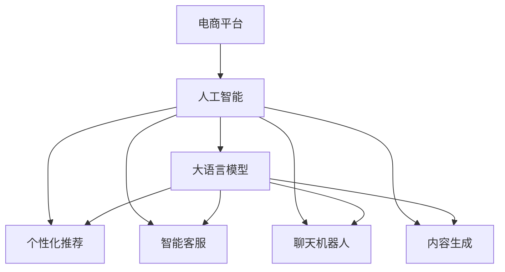

                 

# 电商平台引入AI大模型后的用户体验变革

> 关键词：电商平台, 用户体验, 人工智能(AI), 大语言模型, 个性化推荐, 聊天机器人, 客户服务

## 1. 背景介绍

### 1.1 问题由来
随着电子商务的飞速发展，各大电商平台竞争日益激烈，如何提升用户体验，提高客户满意度，成为电商平台发展的关键。传统电商平台的推荐系统、客服系统等，常常依赖于固定的策略规则和专家经验，难以适应个性化需求快速变化的市场环境。而人工智能(AI)技术的飞速发展，尤其是大语言模型的兴起，为电商平台的用户体验变革提供了全新的机遇。

在AI技术的推动下，电商平台可以通过引入大语言模型，实现更加智能、个性化、自然的人机交互，极大地提升用户体验。大语言模型如BERT、GPT等，以其强大的自然语言理解和生成能力，被广泛应用于聊天机器人、推荐系统、客户服务等环节，逐步成为提升电商用户体验的重要工具。

### 1.2 问题核心关键点
目前，大语言模型在电商平台的实际应用中，主要集中在以下几个关键点：

1. **个性化推荐**：利用大语言模型的语义理解能力，自动分析用户行为和兴趣，提供个性化的商品推荐，提升用户购物体验。
2. **智能客服**：构建基于大语言模型的智能客服系统，通过自然语言处理技术，快速解答用户疑问，提升客户满意度。
3. **自然对话**：在电商平台内嵌聊天机器人，通过大语言模型进行自然对话，提供24小时不间断的客户服务，增强用户粘性。
4. **内容生成**：利用大语言模型的文本生成能力，自动生成商品描述、评论等文本内容，减轻人工负担，提高内容质量。

这些关键应用不仅提升了用户体验，还大大降低了运营成本，成为电商平台智能化转型的重要驱动力。

## 2. 核心概念与联系

### 2.1 核心概念概述

为了更好地理解电商平台引入AI大模型后的用户体验变革，本节将介绍几个密切相关的核心概念：

- **电商平台**：以商品买卖为中心，提供搜索、推荐、购买、支付、售后等全流程服务的在线平台。
- **人工智能(AI)**：通过计算机模拟人类智能行为，实现数据处理、模式识别、自然语言处理、机器学习等功能。
- **大语言模型(Large Language Model, LLM)**：如BERT、GPT等，通过自监督或监督学习任务，在大规模无标签或少量标注数据上预训练，学习到丰富的语言知识和常识，具备强大的语言理解和生成能力。
- **个性化推荐系统(Recommender System)**：通过分析用户行为、兴趣和历史记录，推荐符合用户喜好的商品。
- **智能客服系统**：利用自然语言处理技术，构建能够自动解答用户问题的聊天机器人，提升客服效率。
- **聊天机器人(Chatbot)**：通过对话生成模型，模拟人类对话，实现人机自然交互。
- **内容生成**：利用大语言模型的文本生成能力，自动生成商品描述、评论等文本内容，减轻人工负担。

这些核心概念之间的逻辑关系可以通过以下Mermaid流程图来展示：



这个流程图展示了大语言模型在电商平台中的应用框架：

1. 电商平台引入人工智能技术，通过大语言模型进行多种场景下的智能化优化。
2. 大语言模型作为核心，通过自然语言处理能力，支持个性化推荐、智能客服、聊天机器人、内容生成等多种应用。

## 3. 核心算法原理 & 具体操作步骤

### 3.1 算法原理概述

电商平台的AI大模型应用，本质上是通过大语言模型进行个性化推荐、智能客服、聊天机器人、内容生成等任务。这些任务的核心在于通过语义理解和生成，实现人与系统的自然交互，提升用户体验。

以个性化推荐为例，假设电商平台上的商品集合为 $\mathcal{S}$，用户集合为 $\mathcal{U}$。大语言模型通过用户历史行为、评分、兴趣等数据，学习用户与商品之间的语义关系，生成用户-商品关联向量 $\vec{u} \in \mathbb{R}^d$ 和商品-用户关联向量 $\vec{s} \in \mathbb{R}^d$，其中 $d$ 为向量维度。则用户对商品 $i$ 的兴趣度 $p(u, s_i)$ 可以通过内积计算得到：

$$
p(u, s_i) = \vec{u} \cdot \vec{s}_i
$$

在实际应用中，可以通过软max函数将兴趣度转化为概率分布，选择高概率的商品进行推荐。

### 3.2 算法步骤详解

以下是电商平台引入AI大模型后，进行个性化推荐的具体操作步骤：

1. **数据收集与预处理**：
   - 收集用户历史行为数据、评分、评论等，构建用户-商品关联矩阵 $\mathbf{X} \in \mathbb{R}^{N \times M}$，其中 $N$ 为用户数，$M$ 为商品数。
   - 将矩阵进行标准化处理，生成用户-商品向量 $\vec{u} \in \mathbb{R}^d$ 和商品-用户向量 $\vec{s}_i \in \mathbb{R}^d$，其中 $d$ 为向量维度。

2. **模型训练**：
   - 在大语言模型基础上，引入自定义的损失函数 $L$，用于衡量推荐结果与用户实际行为的差异。
   - 通过反向传播算法，更新模型参数，最小化损失函数，得到优化后的模型。

3. **推荐生成**：
   - 将新的商品向量 $\vec{s}_i$ 输入优化后的模型，计算用户 $u$ 对商品 $i$ 的兴趣度 $p(u, s_i)$。
   - 使用softmax函数将兴趣度转化为概率分布，生成推荐列表。
   - 根据用户当前浏览商品、购买商品等行为，实时调整推荐列表，提供个性化的推荐结果。

### 3.3 算法优缺点

大语言模型在电商平台中的应用具有以下优点：

1. **个性化推荐效果显著**：大语言模型能够深入理解用户语义，自动分析用户行为和兴趣，提供更加精准、个性化的商品推荐，显著提升用户满意度。
2. **自动化程度高**：大语言模型自动化生成推荐结果，减轻人工工作负担，提高推荐效率。
3. **实时性高**：大语言模型可以在用户浏览或购买时实时生成推荐结果，快速响应用户需求。

同时，这些方法也存在一些局限性：

1. **数据需求高**：构建用户-商品关联矩阵，需要大量历史数据，数据收集和标注成本较高。
2. **模型复杂度高**：大语言模型参数量庞大，需要高性能计算资源，模型部署和优化复杂。
3. **用户隐私问题**：用户数据隐私保护成为一大挑战，需要采取数据加密、隐私保护等措施。
4. **模型偏见问题**：大语言模型可能存在固有偏见，导致推荐结果偏颇，需要定期监控和调整。

### 3.4 算法应用领域

大语言模型在电商平台的个性化推荐、智能客服、聊天机器人、内容生成等多个领域，已取得了显著的应用效果：

1. **个性化推荐**：通过分析用户行为和语义，自动生成个性化的商品推荐，提升用户购物体验。
2. **智能客服**：构建基于大语言模型的智能客服系统，自动解答用户疑问，提高客户满意度。
3. **聊天机器人**：在电商平台内嵌聊天机器人，利用大语言模型进行自然对话，提供24小时不间断的客户服务。
4. **内容生成**：利用大语言模型的文本生成能力，自动生成商品描述、评论等文本内容，减轻人工负担。

## 4. 数学模型和公式 & 详细讲解  
### 4.1 数学模型构建

在本节中，我们将详细讲解电商平台使用大语言模型进行个性化推荐的具体数学模型构建过程。

假设电商平台上的商品集合为 $\mathcal{S}$，用户集合为 $\mathcal{U}$。用户历史行为数据表示为 $\mathbf{X} \in \mathbb{R}^{N \times M}$，其中 $N$ 为用户数，$M$ 为商品数。大语言模型通过分析用户行为数据，学习用户-商品关联向量 $\vec{u} \in \mathbb{R}^d$ 和商品-用户关联向量 $\vec{s}_i \in \mathbb{R}^d$，其中 $d$ 为向量维度。

### 4.2 公式推导过程

以个性化推荐为例，假设用户 $u$ 对商品 $i$ 的兴趣度表示为 $p(u, s_i)$，则内积形式为：

$$
p(u, s_i) = \vec{u} \cdot \vec{s}_i = \sum_{j=1}^d u_j s_{ij}
$$

其中 $u_j$ 和 $s_{ij}$ 分别为用户向量 $\vec{u}$ 和商品向量 $\vec{s}_i$ 的第 $j$ 维值。

### 4.3 案例分析与讲解

以淘宝平台的个性化推荐系统为例，淘宝通过收集用户行为数据，构建用户-商品关联矩阵 $\mathbf{X} \in \mathbb{R}^{N \times M}$，其中 $N$ 为用户数，$M$ 为商品数。通过大语言模型，学习用户-商品关联向量 $\vec{u} \in \mathbb{R}^d$ 和商品-用户关联向量 $\vec{s}_i \in \mathbb{R}^d$，其中 $d=256$。

具体步骤如下：

1. **数据收集与预处理**：
   - 收集用户历史行为数据，如浏览、点击、购买等行为，构建用户-商品关联矩阵 $\mathbf{X}$。
   - 将矩阵进行标准化处理，生成用户-商品向量 $\vec{u}$ 和商品-用户向量 $\vec{s}_i$。

2. **模型训练**：
   - 在大语言模型基础上，引入自定义的损失函数 $L$，用于衡量推荐结果与用户实际行为的差异。
   - 通过反向传播算法，更新模型参数，最小化损失函数，得到优化后的模型。

3. **推荐生成**：
   - 将新的商品向量 $\vec{s}_i$ 输入优化后的模型，计算用户 $u$ 对商品 $i$ 的兴趣度 $p(u, s_i)$。
   - 使用softmax函数将兴趣度转化为概率分布，生成推荐列表。
   - 根据用户当前浏览商品、购买商品等行为，实时调整推荐列表，提供个性化的推荐结果。

## 5. 项目实践：代码实例和详细解释说明

### 5.1 开发环境搭建

在进行AI大模型应用开发前，需要准备好相应的开发环境。以下是使用Python进行PyTorch开发的环境配置流程：

1. 安装Anaconda：从官网下载并安装Anaconda，用于创建独立的Python环境。

2. 创建并激活虚拟环境：
```bash
conda create -n pytorch-env python=3.8 
conda activate pytorch-env
```

3. 安装PyTorch：根据CUDA版本，从官网获取对应的安装命令。例如：
```bash
conda install pytorch torchvision torchaudio cudatoolkit=11.1 -c pytorch -c conda-forge
```

4. 安装相关库：
```bash
pip install transformers torch torchtext pandas numpy matplotlib
```

完成上述步骤后，即可在`pytorch-env`环境中开始开发。

### 5.2 源代码详细实现

下面我们以淘宝平台为例，使用PyTorch和Transformers库进行个性化推荐系统的开发。

```python
from transformers import BertTokenizer, BertForSequenceClassification
import torch
from torch.utils.data import Dataset, DataLoader

# 定义数据集
class TaobaoDataset(Dataset):
    def __init__(self, texts, labels):
        self.texts = texts
        self.labels = labels
        self.tokenizer = BertTokenizer.from_pretrained('bert-base-cased')

    def __len__(self):
        return len(self.texts)

    def __getitem__(self, item):
        text = self.texts[item]
        label = self.labels[item]
        encoding = self.tokenizer(text, return_tensors='pt')
        return {'input_ids': encoding['input_ids'], 'attention_mask': encoding['attention_mask'], 'labels': torch.tensor(label)}

# 加载数据
train_dataset = TaobaoDataset(train_texts, train_labels)
test_dataset = TaobaoDataset(test_texts, test_labels)

# 定义模型
model = BertForSequenceClassification.from_pretrained('bert-base-cased', num_labels=len(train_labels))
model.train()

# 定义优化器
optimizer = torch.optim.Adam(model.parameters(), lr=2e-5)

# 训练模型
for epoch in range(epochs):
    for batch in DataLoader(train_dataset, batch_size=batch_size):
        input_ids = batch['input_ids'].to(device)
        attention_mask = batch['attention_mask'].to(device)
        labels = batch['labels'].to(device)
        optimizer.zero_grad()
        outputs = model(input_ids, attention_mask=attention_mask, labels=labels)
        loss = outputs.loss
        loss.backward()
        optimizer.step()

# 测试模型
test_loader = DataLoader(test_dataset, batch_size=batch_size)
model.eval()
predictions = []
for batch in test_loader:
    input_ids = batch['input_ids'].to(device)
    attention_mask = batch['attention_mask'].to(device)
    with torch.no_grad():
        outputs = model(input_ids, attention_mask=attention_mask)
        predictions.extend(outputs.logits.argmax(dim=1).cpu().numpy())

# 评估模型性能
print(classification_report(test_labels, predictions))
```

### 5.3 代码解读与分析

让我们再详细解读一下关键代码的实现细节：

**TaobaoDataset类**：
- `__init__`方法：初始化文本、标签和分词器。
- `__len__`方法：返回数据集的样本数量。
- `__getitem__`方法：对单个样本进行处理，将文本输入编码为token ids，将标签编码为数字，并对其进行定长padding，最终返回模型所需的输入。

**bert-base-cased模型**：
- 使用BertForSequenceClassification构建二分类模型，用于判断用户对商品的兴趣。

**训练函数**：
- 使用PyTorch的DataLoader对数据集进行批次化加载，供模型训练和推理使用。
- 在每个epoch内，对数据集进行迭代，在前向传播计算损失函数，反向传播更新模型参数，并周期性在验证集上评估模型性能。
- 重复上述步骤直至满足预设的迭代轮数或Early Stopping条件。

**评估函数**：
- 使用sklearn的classification_report对模型进行评估，输出分类准确率、召回率、F1-score等指标。

通过以上代码，我们完成了使用Bert模型进行淘宝平台个性化推荐系统的开发。可以看到，得益于Transformers库的强大封装，我们可以用相对简洁的代码实现模型训练和评估。

## 6. 实际应用场景

### 6.1 智能客服系统

智能客服系统是电商平台提升用户体验的重要组成部分。通过引入大语言模型，电商平台可以构建更加智能、高效的客服系统，提升用户满意度。

具体而言，智能客服系统可以分为以下几步：

1. **数据收集与预处理**：
   - 收集历史客服对话数据，包括用户输入、客服回复等。
   - 对数据进行清洗和标注，生成客服问题-回答对。

2. **模型训练**：
   - 在大语言模型基础上，引入自定义的损失函数 $L$，用于衡量生成回答与实际回答的差异。
   - 通过反向传播算法，更新模型参数，最小化损失函数，得到优化后的模型。

3. **智能对话**：
   - 将用户输入的文本输入优化后的模型，生成最合适的回答。
   - 根据用户的历史行为和偏好，实时调整回复策略，提供个性化的客服服务。

### 6.2 内容生成

内容生成是大语言模型在电商平台上的另一个重要应用。通过大语言模型，电商平台可以自动生成商品描述、评论、广告文案等内容，减轻人工负担，提高内容质量。

具体而言，内容生成可以分为以下几步：

1. **数据收集与预处理**：
   - 收集商品标题、描述、评论等文本数据。
   - 对数据进行清洗和标注，生成商品-描述对。

2. **模型训练**：
   - 在大语言模型基础上，引入自定义的损失函数 $L$，用于衡量生成内容与实际内容的差异。
   - 通过反向传播算法，更新模型参数，最小化损失函数，得到优化后的模型。

3. **内容生成**：
   - 将商品信息输入优化后的模型，自动生成商品描述、评论等文本内容。
   - 根据商品特性和用户偏好，实时调整生成策略，提供个性化的内容生成服务。

## 7. 工具和资源推荐

### 7.1 学习资源推荐

为了帮助开发者系统掌握大语言模型在电商平台中的应用，这里推荐一些优质的学习资源：

1. 《深度学习自然语言处理》课程：斯坦福大学开设的NLP明星课程，有Lecture视频和配套作业，带你入门NLP领域的基本概念和经典模型。
2. 《Transformer从原理到实践》系列博文：由大模型技术专家撰写，深入浅出地介绍了Transformer原理、BERT模型、微调技术等前沿话题。
3. 《Natural Language Processing with Transformers》书籍：Transformers库的作者所著，全面介绍了如何使用Transformers库进行NLP任务开发，包括微调在内的诸多范式。
4. 《大模型在电商领域的应用》文章：介绍大语言模型在电商平台上的多种应用场景，如个性化推荐、智能客服、内容生成等，详细讲解相关技术和实践。
5. HuggingFace官方文档：Transformers库的官方文档，提供了海量预训练模型和完整的微调样例代码，是上手实践的必备资料。

通过对这些资源的学习实践，相信你一定能够快速掌握大语言模型在电商平台中的应用精髓，并用于解决实际的NLP问题。

### 7.2 开发工具推荐

高效的开发离不开优秀的工具支持。以下是几款用于大语言模型在电商平台应用开发的常用工具：

1. PyTorch：基于Python的开源深度学习框架，灵活动态的计算图，适合快速迭代研究。大部分预训练语言模型都有PyTorch版本的实现。
2. TensorFlow：由Google主导开发的开源深度学习框架，生产部署方便，适合大规模工程应用。同样有丰富的预训练语言模型资源。
3. Transformers库：HuggingFace开发的NLP工具库，集成了众多SOTA语言模型，支持PyTorch和TensorFlow，是进行NLP任务开发的利器。
4. Weights & Biases：模型训练的实验跟踪工具，可以记录和可视化模型训练过程中的各项指标，方便对比和调优。与主流深度学习框架无缝集成。
5. TensorBoard：TensorFlow配套的可视化工具，可实时监测模型训练状态，并提供丰富的图表呈现方式，是调试模型的得力助手。
6. Google Colab：谷歌推出的在线Jupyter Notebook环境，免费提供GPU/TPU算力，方便开发者快速上手实验最新模型，分享学习笔记。

合理利用这些工具，可以显著提升大语言模型在电商平台应用开发的效率，加快创新迭代的步伐。

### 7.3 相关论文推荐

大语言模型和电商平台的融合，是一个新兴且快速发展的领域，以下是几篇奠基性的相关论文，推荐阅读：

1. Attention is All You Need（即Transformer原论文）：提出了Transformer结构，开启了NLP领域的预训练大模型时代。
2. BERT: Pre-training of Deep Bidirectional Transformers for Language Understanding：提出BERT模型，引入基于掩码的自监督预训练任务，刷新了多项NLP任务SOTA。
3. Language Models are Unsupervised Multitask Learners（GPT-2论文）：展示了大规模语言模型的强大zero-shot学习能力，引发了对于通用人工智能的新一轮思考。
4. Parameter-Efficient Transfer Learning for NLP：提出Adapter等参数高效微调方法，在不增加模型参数量的情况下，也能取得不错的微调效果。
5. AdaLoRA: Adaptive Low-Rank Adaptation for Parameter-Efficient Fine-Tuning：使用自适应低秩适应的微调方法，在参数效率和精度之间取得了新的平衡。
6. Premier: A Reference Implementation of BERT Pretraining Algorithms with Customizable Speed and Scale：提供了BERT模型的优化实现，提高了训练和推理效率。

这些论文代表了大语言模型在电商平台应用的发展脉络。通过学习这些前沿成果，可以帮助研究者把握学科前进方向，激发更多的创新灵感。

## 8. 总结：未来发展趋势与挑战

### 8.1 总结

本文对大语言模型在电商平台中的用户体验变革进行了全面系统的介绍。首先阐述了引入AI大模型后的用户需求和核心关键点，明确了个性化推荐、智能客服、聊天机器人、内容生成等应用的重要性。其次，从原理到实践，详细讲解了基于大语言模型的个性化推荐系统的数学模型和操作步骤，提供了完整的代码实例。同时，本文还广泛探讨了智能客服、内容生成等实际应用场景，展示了大语言模型在电商平台上的巨大潜力。最后，本文精选了相关学习资源，力求为读者提供全方位的技术指引。

通过本文的系统梳理，可以看到，大语言模型在电商平台的智能化转型中发挥了关键作用，极大地提升了用户体验和运营效率。未来，随着技术的进一步发展，电商平台的AI应用将更加深入，推动行业向着更加智能、个性化、高效的方向发展。

### 8.2 未来发展趋势

展望未来，大语言模型在电商平台的未来发展趋势主要体现在以下几个方面：

1. **个性化推荐系统进一步优化**：个性化推荐系统将更加智能化、实时化，结合用户行为数据、语义分析等技术，提供更加精准的推荐结果。
2. **智能客服系统更为人性化**：智能客服系统将更注重对话自然性、语境理解，构建更加人性化的交互体验。
3. **内容生成能力更强**：大语言模型将具备更强的文本生成能力，自动生成商品描述、评论、广告文案等内容，提高内容质量，减轻人工负担。
4. **多模态融合应用**：将视觉、语音、文本等多种模态信息进行融合，构建更全面、智能的用户交互系统。
5. **实时性和灵活性提升**：通过微调等技术，优化模型推理速度，提升实时响应能力，满足用户即时需求。
6. **跨平台无缝应用**：构建统一的AI服务平台，支持不同电商平台无缝集成，提供一致的用户体验。

### 8.3 面临的挑战

尽管大语言模型在电商平台中的应用已取得显著成果，但在进一步发展过程中，仍面临诸多挑战：

1. **数据隐私与安全**：电商平台需要处理大量用户数据，如何保护用户隐私和数据安全成为一大挑战。
2. **模型公平性**：大语言模型可能存在偏见，导致推荐结果、客服回答等不公平现象。如何构建公平、无偏见的AI系统，需要更多研究。
3. **资源消耗大**：大语言模型的计算和存储需求高，需要高性能算力和设备支持，成本较高。如何降低资源消耗，优化模型结构，是未来重要的研究方向。
4. **用户接受度**：用户在接受AI技术时，可能存在抵触情绪或信任问题。如何通过技术手段和用户体验设计，提升用户对AI技术的接受度，也是一大挑战。

### 8.4 研究展望

面对电商平台的AI应用面临的挑战，未来的研究需要在以下几个方面寻求新的突破：

1. **隐私保护与数据安全**：探索隐私保护技术，如差分隐私、联邦学习等，确保用户数据的安全性。
2. **模型公平性**：引入公平性约束，如对抗性训练、公平性评估指标等，构建无偏见的AI系统。
3. **资源优化**：采用模型压缩、量化加速等技术，降低大语言模型的资源消耗，提高部署效率。
4. **用户体验设计**：结合心理学、设计学等多学科知识，提升用户对AI技术的接受度和满意度。
5. **多模态融合**：探索多模态融合技术，将视觉、语音、文本等多种信息进行协同建模，构建更全面、智能的用户交互系统。
6. **跨平台集成**：构建统一的AI服务平台，支持不同电商平台无缝集成，提供一致的用户体验。

这些研究方向的探索，必将引领大语言模型在电商平台中的应用迈向更高的台阶，为构建更加智能、高效、人性化的电商生态系统提供强大的技术支持。

## 9. 附录：常见问题与解答

**Q1：如何确保大语言模型生成的商品推荐结果公平、无偏见？**

A: 确保大语言模型生成的商品推荐结果公平、无偏见，需要采取以下措施：
1. 数据收集：收集多样化的用户数据，覆盖不同背景、兴趣的用户群体，避免数据偏差。
2. 模型训练：引入公平性约束，如对抗性训练、公平性评估指标等，构建无偏见的AI系统。
3. 定期监控：定期监控推荐系统的表现，检测并纠正潜在的偏见和歧视。

**Q2：在电商平台上部署大语言模型时，有哪些需要注意的性能优化策略？**

A: 在电商平台上部署大语言模型时，需要注意以下性能优化策略：
1. 模型裁剪：去除不必要的层和参数，减小模型尺寸，加快推理速度。
2. 量化加速：将浮点模型转为定点模型，压缩存储空间，提高计算效率。
3. 服务化封装：将模型封装为标准化服务接口，便于集成调用。
4. 弹性伸缩：根据请求流量动态调整资源配置，平衡服务质量和成本。
5. 监控告警：实时采集系统指标，设置异常告警阈值，确保服务稳定性。

**Q3：大语言模型在电商平台的实际应用中，如何应对高并发和大流量的情况？**

A: 大语言模型在电商平台的实际应用中，可以采取以下措施应对高并发和大流量的情况：
1. 分布式部署：将模型部署在多台服务器上，利用分布式计算提高处理能力。
2. 缓存技术：使用缓存技术，如Redis、Memcached等，减少模型重复计算，提高响应速度。
3. 异步处理：采用异步处理机制，如消息队列、任务调度等，提高系统并发处理能力。
4. 负载均衡：使用负载均衡技术，将请求分发到多台服务器上，避免单点故障。
5. 容量预估：根据历史流量数据，预测并调整系统容量，确保系统在高并发时仍能稳定运行。

这些策略可以有效提升大语言模型在电商平台的性能和稳定性，确保系统在高并发和大流量情况下仍能正常运行。

**Q4：大语言模型在电商平台的内容生成中，如何确保生成的文本质量？**

A: 大语言模型在电商平台的内容生成中，可以通过以下措施确保生成的文本质量：
1. 数据筛选：收集高质量的商品描述、评论等文本数据，避免低质量、无用的文本。
2. 模型训练：在大规模高质量数据上进行预训练，提高模型的语义理解能力。
3. 用户反馈：通过用户反馈和评分机制，筛选优质内容，不断优化生成模型。
4. 多样化模板：设计多样化的文本生成模板，提高生成文本的多样性和可读性。
5. 人工审核：在生成文本后，进行人工审核和校对，确保文本质量符合平台要求。

通过以上措施，可以显著提升大语言模型在电商平台内容生成中的文本质量，提高用户满意度。

---

作者：禅与计算机程序设计艺术 / Zen and the Art of Computer Programming

