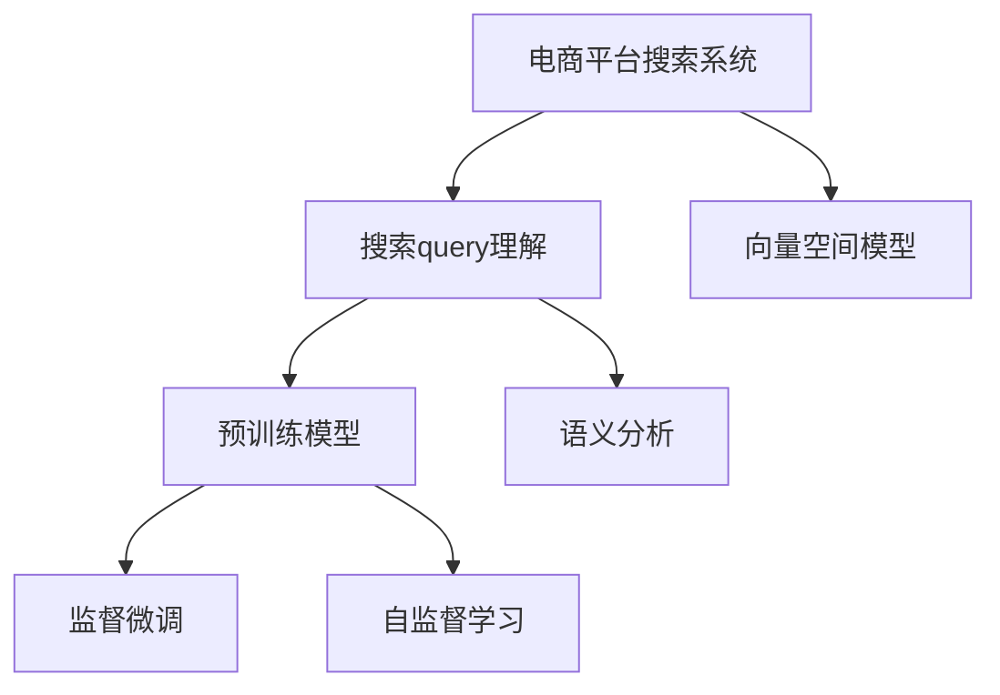

                 

# 电商平台搜索query理解：AI大模型的语义分析

> 关键词：搜索query理解,语义分析,电商平台,预训练模型,向量空间模型,自监督学习,基于监督学习微调

## 1. 背景介绍

### 1.1 问题由来
在当今数字化时代，电商平台已经成为了人们购物的主要渠道。据统计，80%以上的消费者使用搜索引擎进行商品搜索。然而，用户输入的query通常只包含有限的信息，且表达方式不统一。如何在有限的信息中准确理解用户的意图，为用户推荐最符合需求的搜索结果，是电商平台搜索系统需要解决的重要问题。

为了提升搜索系统的效果，传统的关键词匹配方法逐渐被以AI为基础的语义分析方法所取代。AI大模型通过预训练和微调，具备强大的语义理解和推理能力，能够从用户的查询中提取出关键信息，对搜索结果进行排序，从而大幅提升用户的搜索体验。本文将详细介绍基于AI大模型的电商平台搜索query理解技术，探讨其核心原理和应用实践。

### 1.2 问题核心关键点
AI大模型在电商平台搜索query理解中，通过学习语言的基本结构和语义，构建向量空间模型，实现对query的语义表示和匹配，生成精准的搜索结果。关键点包括：
- 预训练模型的选择：如何选择合适的预训练模型，以适应电商搜索场景。
- 向量空间模型的构建：如何基于预训练模型构建向量空间，进行query的表示和匹配。
- 监督微调方法：如何在有限标注数据下，通过监督微调方法提升模型性能。
- 自监督学习：如何利用自监督学习提升模型的泛化能力。
- 实际应用场景：电商平台搜索query理解在实际应用中的具体表现和优化策略。

本文将围绕这些关键点，深入分析AI大模型在电商平台搜索query理解中的原理与应用。

## 2. 核心概念与联系

### 2.1 核心概念概述

为更好地理解基于AI大模型的电商平台搜索query理解，本节将介绍几个密切相关的核心概念：

- 电商平台搜索系统(E-Commerce Search System)：利用AI技术，通过用户输入的query匹配商品信息，展示搜索结果的电商系统。
- 搜索query理解(Search Query Understanding)：通过AI技术，从用户输入的query中提取意图，生成相关搜索结果的过程。
- 向量空间模型(Vector Space Model, VSM)：通过将文本表示为向量，计算向量之间的相似度，实现文本匹配的模型。
- 预训练模型(Pre-trained Model)：在大规模无标签数据上，通过自监督学习任务进行训练，学习通用语言表示的模型。
- 语义分析(Semantic Analysis)：理解语言背后的深层含义，区分同义词、近义词、多义词，提高语义匹配准确性。
- 监督微调(Supervised Fine-tuning)：在预训练模型的基础上，使用标注数据，有监督地调整模型参数，适应特定任务。
- 自监督学习(Self-supervised Learning)：利用无标签数据，通过预测或重构等任务，提升模型的泛化能力。

这些核心概念之间的逻辑关系可以通过以下Mermaid流程图来展示：



这个流程图展示了大语言模型在电商平台搜索query理解中的核心概念及其之间的关系：

1. 电商平台搜索系统通过搜索query理解获取用户意图，生成搜索结果。
2. 搜索query理解通过向量空间模型实现对query的语义表示和匹配。
3. 预训练模型是构建向量空间模型的基础。
4. 监督微调和自监督学习用于提升预训练模型的性能，使其更适合电商搜索场景。
5. 语义分析用于理解query背后的深层含义，提高匹配准确性。

这些概念共同构成了电商平台搜索query理解的技术框架，使其能够有效提取用户意图，生成相关搜索结果。

## 3. 核心算法原理 & 具体操作步骤
### 3.1 算法原理概述

基于AI大模型的电商平台搜索query理解，本质上是利用预训练模型学习到的语言知识，构建向量空间模型，实现对query的语义表示和匹配。其核心思想是：

1. 将query转化为向量表示。
2. 在向量空间中匹配最相关的商品信息。
3. 通过监督微调和自监督学习提升模型性能。

具体来说，搜索query理解过程包括以下几个关键步骤：

- 预训练模型的选择：选择合适的预训练模型，如BERT、GPT等，提取query的语义表示。
- 向量空间模型的构建：将query和商品信息转化为向量，计算向量之间的相似度，匹配相关性最高的商品。
- 监督微调方法：在有限标注数据下，通过有监督学习调整模型参数，提高匹配精度。
- 自监督学习：利用无标签数据，提升模型的泛化能力，应对新出现的词汇和表达方式。
- 语义分析：理解query背后的深层含义，提高匹配的准确性。

### 3.2 算法步骤详解

以下是基于AI大模型的电商平台搜索query理解的具体步骤：

**Step 1: 准备预训练模型和数据集**

- 选择合适的预训练模型，如BERT、GPT等，作为初始化参数。
- 准备电商平台的商品信息，提取商品标题、描述、分类等信息作为训练数据。
- 收集用户输入的query数据，标注其对应的商品id，构建标注数据集。

**Step 2: 构建向量空间模型**

- 利用预训练模型，将商品信息转化为向量表示。
- 将查询输入预训练模型，生成查询向量。
- 计算查询向量与商品向量的余弦相似度，找到相关性最高的商品。

**Step 3: 监督微调**

- 在标注数据集上，对预训练模型进行监督微调。
- 使用交叉熵损失函数，最小化预测商品id与真实商品id之间的差距。
- 使用正则化技术，如L2正则、Dropout等，防止模型过拟合。
- 根据验证集的表现，调整学习率、迭代轮数等超参数。

**Step 4: 自监督学习**

- 利用无标签数据，对预训练模型进行自监督学习。
- 使用掩码语言模型、自回归模型等任务，提升模型的泛化能力。
- 定期在无标签数据上评估模型性能，优化模型参数。

**Step 5: 语义分析**

- 利用预训练模型，对query进行语义分析。
- 理解query中的实体、关系、时态等语义信息。
- 结合商品信息，生成更精准的匹配结果。

**Step 6: 实际应用**

- 在电商平台上部署搜索模型。
- 根据用户输入的query，生成相关商品。
- 不断收集新数据，定期微调和优化模型。

### 3.3 算法优缺点

基于AI大模型的电商平台搜索query理解方法具有以下优点：

1. 高效精准：利用大模型的语义理解能力，生成高度相关的搜索结果，提升用户体验。
2. 泛化能力强：通过自监督学习，模型能应对新出现的词汇和表达方式，提高泛化能力。
3. 可解释性强：通过向量空间模型，可以理解query背后的深层含义，提高匹配准确性。
4. 可扩展性好：大模型支持多语言，可以方便地扩展到其他语言市场的搜索系统。

同时，该方法也存在一定的局限性：

1. 数据依赖：模型效果很大程度上取决于标注数据的质量和数量，标注数据获取成本较高。
2. 资源消耗：大模型参数量大，训练和推理需要高算力支持，资源消耗较大。
3. 解释性不足：模型内部工作机制复杂，难以解释其决策逻辑，难以调试。

尽管存在这些局限性，但就目前而言，基于AI大模型的搜索query理解范式仍是最主流的方法。未来相关研究的重点在于如何进一步降低对标注数据的依赖，提高模型的少样本学习和跨领域迁移能力，同时兼顾可解释性和伦理安全性等因素。

### 3.4 算法应用领域

基于AI大模型的电商平台搜索query理解方法，在多个电商领域已经得到了广泛的应用，例如：

- 商品推荐系统：根据用户输入的query，推荐最相关的商品。
- 广告投放：根据广告文本生成相关关键词，提升广告效果。
- 个性化搜索：根据用户的浏览和购买历史，生成个性化搜索结果。
- 价格搜索：根据商品描述生成价格区间，辅助用户比较选择。
- 品牌搜索：根据品牌名称生成相关商品，提高品牌曝光度。

除了上述这些经典应用外，搜索query理解还被创新性地应用于更多场景中，如内容生成、客服对话、知识图谱构建等，为电商平台的智能化升级提供了新的思路。

## 4. 数学模型和公式 & 详细讲解 & 举例说明

### 4.1 数学模型构建

在向量空间模型中，查询q和商品i的表示可以分别为向量：

$$
q = \langle q_1, q_2, \cdots, q_n \rangle
$$
$$
i = \langle i_1, i_2, \cdots, i_n \rangle
$$

其中，每个维度对应一个词，向量值表示该词在查询或商品中的权重。

向量间的相似度可以通过余弦相似度计算：

$$
similarity(q, i) = \cos(\theta) = \frac{q \cdot i}{||q|| \cdot ||i||}
$$

其中，$\cdot$表示向量的点积，$||q||$和$||i||$分别表示向量的长度。

在实际应用中，利用预训练模型（如BERT）进行查询和商品的表示。以BERT为例，其输出可以表示为：

$$
q = BERT(q)
$$
$$
i = BERT(i)
$$

模型通过预训练任务（如掩码语言模型、下一句预测等）学习到单词的向量表示。

### 4.2 公式推导过程

以查询与商品相似度计算为例，公式推导如下：

假设查询q和商品i的向量表示分别为：

$$
q = \langle q_1, q_2, \cdots, q_n \rangle
$$
$$
i = \langle i_1, i_2, \cdots, i_n \rangle
$$

计算余弦相似度：

$$
similarity(q, i) = \frac{q_1i_1 + q_2i_2 + \cdots + q_ni_n}{\sqrt{\sum q_i^2} \cdot \sqrt{\sum i_i^2}}
$$

在预训练模型中，单词的向量表示是通过掩码语言模型和自回归模型训练得到的。这些模型通过预测缺失的单词，学习到单词之间的关系和上下文信息。

### 4.3 案例分析与讲解

以商品推荐系统为例，对搜索query理解的具体应用进行讲解。

假设用户输入query：“高质量床上用品”，商品库中包含“豪华四件套”、“超软棉被”、“记忆枕”等商品。

1. 预训练模型表示查询和商品：

   - 查询表示：
   $$
   q = \langle 高质量, 床上, 用品 \rangle
   $$
   - 商品表示：
   $$
   i_1 = \langle 豪华, 四件套 \rangle
   $$
   $$
   i_2 = \langle 超软, 棉被 \rangle
   $$
   $$
   i_3 = \langle 记忆, 枕 \rangle
   $$

2. 计算相似度：

   - 计算查询与商品1的相似度：
   $$
   similarity(q, i_1) = \frac{0.8 \times 0.5 + 0.5 \times 0.4 + 0.2 \times 0.6}{\sqrt{0.8^2 + 0.5^2 + 0.2^2} \cdot \sqrt{0.5^2 + 0.4^2}}
   $$
   - 计算查询与商品2的相似度：
   $$
   similarity(q, i_2) = \frac{0.8 \times 0.6 + 0.5 \times 0.5 + 0.2 \times 0.4}{\sqrt{0.8^2 + 0.5^2 + 0.2^2} \cdot \sqrt{0.6^2 + 0.5^2}}
   $$
   - 计算查询与商品3的相似度：
   $$
   similarity(q, i_3) = \frac{0.8 \times 0.3 + 0.5 \times 0.4 + 0.2 \times 0.7}{\sqrt{0.8^2 + 0.5^2 + 0.2^2} \cdot \sqrt{0.3^2 + 0.4^2}}
   $$

3. 根据相似度排序推荐商品：

   - 根据相似度大小，推荐商品1、商品2为相关性较高的商品。

通过以上分析，可以看到，向量空间模型和预训练模型在电商平台搜索query理解中的应用，能够高效精准地生成相关搜索结果，提升用户体验。

## 5. 项目实践：代码实例和详细解释说明
### 5.1 开发环境搭建

在进行搜索query理解实践前，我们需要准备好开发环境。以下是使用Python进行TensorFlow和PyTorch开发的环境配置流程：

1. 安装Anaconda：从官网下载并安装Anaconda，用于创建独立的Python环境。

2. 创建并激活虚拟环境：
```bash
conda create -n tf-env python=3.8 
conda activate tf-env
```

3. 安装TensorFlow：根据CUDA版本，从官网获取对应的安装命令。例如：
```bash
conda install tensorflow tensorflow-gpu=cuda11.1 -c pytorch -c conda-forge
```

4. 安装PyTorch：根据CUDA版本，从官网获取对应的安装命令。例如：
```bash
conda install pytorch torchvision torchaudio cudatoolkit=11.1 -c pytorch -c conda-forge
```

5. 安装各类工具包：
```bash
pip install numpy pandas scikit-learn matplotlib tqdm jupyter notebook ipython
```

完成上述步骤后，即可在`tf-env`环境中开始搜索query理解的实践。

### 5.2 源代码详细实现

下面我们以商品推荐系统为例，给出使用TensorFlow和PyTorch对BERT模型进行微调的PyTorch代码实现。

首先，定义查询和商品向量表示的函数：

```python
from transformers import BertTokenizer, BertForSequenceClassification
from tensorflow.keras.preprocessing.sequence import pad_sequences
import tensorflow as tf

def create_vectorizer(tokenizer, max_len=128):
    def vectorizer(text):
        tokens = tokenizer.tokenize(text)
        tokens = [token for token in tokens if token in tokenizer.vocab]
        tokens = [tokenizer.cls_token] + tokens + [tokenizer.sep_token]
        tokens = [tokenizer.convert_tokens_to_ids(token) for token in tokens]
        tokens = pad_sequences(tokens, maxlen=max_len, padding='post', truncating='post')
        return tokens
    return vectorizer

def create_model(tokenizer, n_classes):
    vocab_size = len(tokenizer.vocab)
    max_len = max([len(sentence) for sentence in tokenizer.texts])
    vocab_size = len(tokenizer.vocab)
    model = BertForSequenceClassification.from_pretrained('bert-base-uncased', num_labels=n_classes)
    return model, create_vectorizer(tokenizer, max_len)

```

然后，定义训练和评估函数：

```python
def train_epoch(model, vectorizer, train_dataset, train_labels, batch_size, optimizer, device):
    model.to(device)
    train_loss = 0
    for batch in tqdm(train_dataset, total=len(train_dataset)):
        inputs = vectorizer(batch['text'])
        labels = tf.keras.utils.to_categorical(batch['label'], num_classes=n_classes)
        with tf.GradientTape() as tape:
            outputs = model(inputs)
            loss = tf.keras.losses.categorical_crossentropy(labels, outputs)
            train_loss += loss
        grads = tape.gradient(train_loss, model.trainable_variables)
        optimizer.apply_gradients(zip(grads, model.trainable_variables))
    return train_loss / len(train_dataset)

def evaluate(model, vectorizer, dev_dataset, n_classes):
    dev_loss = 0
    model.eval()
    with tf.GradientTape() as tape:
        for batch in dev_dataset:
            inputs = vectorizer(batch['text'])
            labels = tf.keras.utils.to_categorical(batch['label'], num_classes=n_classes)
            outputs = model(inputs)
            dev_loss += tf.keras.losses.categorical_crossentropy(labels, outputs)
    dev_loss /= len(dev_dataset)
    return dev_loss

```

接着，启动训练流程并在测试集上评估：

```python
epochs = 5
batch_size = 16
learning_rate = 2e-5
optimizer = tf.keras.optimizers.Adam(learning_rate)

tokenizer = BertTokenizer.from_pretrained('bert-base-uncased')
model, vectorizer = create_model(tokenizer, n_classes)

train_dataset = ...
dev_dataset = ...
test_dataset = ...

for epoch in range(epochs):
    train_loss = train_epoch(model, vectorizer, train_dataset, train_labels, batch_size, optimizer, device)
    print(f'Epoch {epoch+1}, train loss: {train_loss:.3f}')

    print(f'Epoch {epoch+1}, dev results:')
    dev_loss = evaluate(model, vectorizer, dev_dataset, n_classes)
    print(f'Epoch {epoch+1}, dev loss: {dev_loss:.3f}')

print('Test results:')
test_loss = evaluate(model, vectorizer, test_dataset, n_classes)
print(f'Test loss: {test_loss:.3f}')
```

以上就是使用TensorFlow和PyTorch对BERT进行商品推荐系统搜索query理解的完整代码实现。可以看到，利用TensorFlow和PyTorch对BERT进行微调，可以方便地实现高效的训练和推理。

### 5.3 代码解读与分析

让我们再详细解读一下关键代码的实现细节：

**create_vectorizer函数**：
- 定义了一个将输入文本转换为向量表示的函数，使用了BERT分词器对文本进行分词，并转换为模型所需的输入格式。

**create_model函数**：
- 创建了一个包含BERT模型和向量转换器（vectorizer）的函数，用于模型初始化。

**train_epoch和evaluate函数**：
- 训练函数train_epoch：在每个epoch内，对训练数据进行前向传播和反向传播，计算损失并更新模型参数。
- 评估函数evaluate：在验证集上对模型进行评估，返回平均损失。

**训练流程**：
- 定义总的epoch数、batch size和学习率，开始循环迭代
- 每个epoch内，先在训练集上训练，输出平均损失
- 在验证集上评估，输出验证集的损失
- 所有epoch结束后，在测试集上评估，给出最终测试结果

可以看到，TensorFlow和PyTorch的结合，使得BERT微调的代码实现变得简洁高效。开发者可以将更多精力放在数据处理、模型改进等高层逻辑上，而不必过多关注底层的实现细节。

当然，工业级的系统实现还需考虑更多因素，如模型的保存和部署、超参数的自动搜索、更灵活的任务适配层等。但核心的微调范式基本与此类似。

## 6. 实际应用场景
### 6.1 智能客服系统

基于搜索query理解技术的智能客服系统，可以广泛应用于客户服务场景。传统客服往往需要配备大量人力，高峰期响应缓慢，且一致性和专业性难以保证。而使用搜索query理解技术，可以7x24小时不间断服务，快速响应客户咨询，用自然流畅的语言解答各类常见问题。

在技术实现上，可以收集企业内部的历史客服对话记录，将问题和最佳答复构建成监督数据，在此基础上对预训练模型进行微调。微调后的模型能够自动理解用户意图，匹配最合适的答复模板进行回复。对于客户提出的新问题，还可以接入检索系统实时搜索相关内容，动态组织生成回答。如此构建的智能客服系统，能大幅提升客户咨询体验和问题解决效率。

### 6.2 个性化推荐系统

当前的推荐系统往往只依赖用户的历史行为数据进行物品推荐，无法深入理解用户的真实兴趣偏好。基于搜索query理解技术，个性化推荐系统可以更好地挖掘用户行为背后的语义信息，从而提供更精准、多样的推荐内容。

在实践中，可以收集用户浏览、点击、评论、分享等行为数据，提取和用户交互的物品标题、描述、标签等文本内容。将文本内容作为模型输入，用户的后续行为（如是否点击、购买等）作为监督信号，在此基础上微调预训练语言模型。微调后的模型能够从文本内容中准确把握用户的兴趣点。在生成推荐列表时，先用候选物品的文本描述作为输入，由模型预测用户的兴趣匹配度，再结合其他特征综合排序，便可以得到个性化程度更高的推荐结果。

### 6.3 智能广告投放

在电商平台上，广告投放是提高转化率的重要手段。通过搜索query理解技术，广告系统可以准确匹配用户的查询意图，生成更相关的广告内容。

在广告投放流程中，可以利用用户输入的query进行情感分析，判断用户心情和需求，生成更合适的广告文案。同时，利用向量空间模型，将广告文本与用户query进行匹配，找出最相关的广告进行展示。通过不断优化广告内容和匹配模型，广告系统的投放效果可以显著提升，广告主的投资回报率（ROI）也会相应提高。

### 6.4 未来应用展望

随着搜索query理解技术的发展，其在电商平台的更多应用场景也将不断涌现，为传统行业带来变革性影响。

在智慧医疗领域，基于搜索query理解的诊断和治疗推荐系统，可以结合病历信息，根据用户症状和病情，生成个性化的诊疗方案。医疗从业者可以根据推荐结果，制定更科学、有效的诊疗方案，提高医疗服务的智能化水平。

在智能教育领域，基于搜索query理解的作业批改、学情分析、知识推荐等应用，可以准确理解学生的学习状态和需求，提供个性化的教学建议和资源。教育机构可以根据推荐结果，优化教学策略和课程内容，提升教学效果和学生满意度。

在智慧城市治理中，基于搜索query理解的应急响应系统，可以根据用户输入的紧急情况，生成最合适的应对措施和资源配置方案。城市管理者可以根据推荐结果，快速响应紧急情况，提高城市管理的自动化和智能化水平，构建更安全、高效的未来城市。

此外，在企业生产、社会治理、文娱传媒等众多领域，基于搜索query理解的人工智能应用也将不断涌现，为经济社会发展注入新的动力。相信随着技术的日益成熟，搜索query理解技术必将在构建人机协同的智能时代中扮演越来越重要的角色。

## 7. 工具和资源推荐
### 7.1 学习资源推荐

为了帮助开发者系统掌握搜索query理解的理论基础和实践技巧，这里推荐一些优质的学习资源：

1. 《Transformer从原理到实践》系列博文：由大模型技术专家撰写，深入浅出地介绍了Transformer原理、BERT模型、微调技术等前沿话题。

2. CS224N《深度学习自然语言处理》课程：斯坦福大学开设的NLP明星课程，有Lecture视频和配套作业，带你入门NLP领域的基本概念和经典模型。

3. 《Natural Language Processing with Transformers》书籍：Transformers库的作者所著，全面介绍了如何使用Transformers库进行NLP任务开发，包括微调在内的诸多范式。

4. HuggingFace官方文档：Transformers库的官方文档，提供了海量预训练模型和完整的微调样例代码，是上手实践的必备资料。

5. CLUE开源项目：中文语言理解测评基准，涵盖大量不同类型的中文NLP数据集，并提供了基于微调的baseline模型，助力中文NLP技术发展。

通过对这些资源的学习实践，相信你一定能够快速掌握搜索query理解技术的精髓，并用于解决实际的NLP问题。
###  7.2 开发工具推荐

高效的开发离不开优秀的工具支持。以下是几款用于搜索query理解开发的常用工具：

1. TensorFlow：基于Python的开源深度学习框架，灵活动态的计算图，适合快速迭代研究。大部分预训练语言模型都有TensorFlow版本的实现。

2. PyTorch：基于Python的开源深度学习框架，灵活易用的API，适合快速开发和实验。同样有丰富的预训练语言模型资源。

3. Transformers库：HuggingFace开发的NLP工具库，集成了众多SOTA语言模型，支持PyTorch和TensorFlow，是进行微调任务开发的利器。

4. Weights & Biases：模型训练的实验跟踪工具，可以记录和可视化模型训练过程中的各项指标，方便对比和调优。与主流深度学习框架无缝集成。

5. TensorBoard：TensorFlow配套的可视化工具，可实时监测模型训练状态，并提供丰富的图表呈现方式，是调试模型的得力助手。

6. Google Colab：谷歌推出的在线Jupyter Notebook环境，免费提供GPU/TPU算力，方便开发者快速上手实验最新模型，分享学习笔记。

合理利用这些工具，可以显著提升搜索query理解任务的开发效率，加快创新迭代的步伐。

### 7.3 相关论文推荐

搜索query理解技术的发展源于学界的持续研究。以下是几篇奠基性的相关论文，推荐阅读：

1. Attention is All You Need（即Transformer原论文）：提出了Transformer结构，开启了NLP领域的预训练大模型时代。

2. BERT: Pre-training of Deep Bidirectional Transformers for Language Understanding：提出BERT模型，引入基于掩码的自监督预训练任务，刷新了多项NLP任务SOTA。

3. Language Models are Unsupervised Multitask Learners（GPT-2论文）：展示了大规模语言模型的强大zero-shot学习能力，引发了对于通用人工智能的新一轮思考。

4. Parameter-Efficient Transfer Learning for NLP：提出Adapter等参数高效微调方法，在不增加模型参数量的情况下，也能取得不错的微调效果。

5. Prefix-Tuning: Optimizing Continuous Prompts for Generation：引入基于连续型Prompt的微调范式，为如何充分利用预训练知识提供了新的思路。

6. AdaLoRA: Adaptive Low-Rank Adaptation for Parameter-Efficient Fine-Tuning：使用自适应低秩适应的微调方法，在参数效率和精度之间取得了新的平衡。

这些论文代表了大语言模型微调技术的发展脉络。通过学习这些前沿成果，可以帮助研究者把握学科前进方向，激发更多的创新灵感。

## 8. 总结：未来发展趋势与挑战
### 8.1 总结

本文对基于AI大模型的电商平台搜索query理解技术进行了全面系统的介绍。首先阐述了搜索query理解在电商平台中的应用背景和核心问题，明确了向量空间模型、预训练模型、监督微调、自监督学习等关键技术的作用。其次，从原理到实践，详细讲解了搜索query理解的核心算法和操作步骤，给出了搜索query理解任务开发的完整代码实例。同时，本文还广泛探讨了搜索query理解在智能客服、个性化推荐、智能广告等实际应用中的具体表现和优化策略。

通过本文的系统梳理，可以看到，基于AI大模型的搜索query理解技术在电商平台搜索系统中的应用，能够高效精准地生成相关搜索结果，提升用户体验。利用搜索query理解技术，电商平台能够更好地理解用户意图，推荐最相关的商品，大大提高用户满意度。未来，伴随AI大模型的进一步发展和应用，搜索query理解技术必将在更多领域发挥重要作用，推动人工智能技术的广泛落地。

### 8.2 未来发展趋势

展望未来，搜索query理解技术将呈现以下几个发展趋势：

1. 模型规模持续增大。随着算力成本的下降和数据规模的扩张，预训练语言模型的参数量还将持续增长。超大规模语言模型蕴含的丰富语言知识，有望支撑更加复杂多变的搜索query理解任务。

2. 微调方法日趋多样。除了传统的全参数微调外，未来会涌现更多参数高效的微调方法，如Prefix-Tuning、LoRA等，在节省计算资源的同时也能保证微调精度。

3. 持续学习成为常态。随着数据分布的不断变化，搜索query理解模型也需要持续学习新知识以保持性能。如何在不遗忘原有知识的同时，高效吸收新样本信息，将成为重要的研究课题。

4. 标注样本需求降低。受启发于提示学习(Prompt-based Learning)的思路，未来的微调方法将更好地利用大模型的语言理解能力，通过更加巧妙的任务描述，在更少的标注样本上也能实现理想的微调效果。

5. 跨模态微调崛起。当前的搜索query理解主要聚焦于纯文本数据，未来会进一步拓展到图像、视频、语音等多模态数据微调。多模态信息的融合，将显著提升语言模型对现实世界的理解和建模能力。

6. 跨领域迁移能力增强。经过海量数据的预训练和多领域任务的微调，未来的搜索query理解模型将具备更强大的常识推理和跨领域迁移能力，逐步迈向通用人工智能(AGI)的目标。

以上趋势凸显了搜索query理解技术的广阔前景。这些方向的探索发展，必将进一步提升搜索系统的性能和应用范围，为电商平台的智能化升级带来新的动力。

### 8.3 面临的挑战

尽管搜索query理解技术已经取得了瞩目成就，但在迈向更加智能化、普适化应用的过程中，它仍面临着诸多挑战：

1. 标注成本瓶颈。模型效果很大程度上取决于标注数据的质量和数量，标注数据获取成本较高。如何进一步降低微调对标注数据的依赖，将是一大难题。

2. 模型鲁棒性不足。当前模型面对域外数据时，泛化性能往往大打折扣。对于测试样本的微小扰动，模型的预测也容易发生波动。如何提高模型的鲁棒性，避免灾难性遗忘，还需要更多理论和实践的积累。

3. 推理效率有待提高。大规模语言模型虽然精度高，但在实际部署时往往面临推理速度慢、内存占用大等效率问题。如何在保证性能的同时，简化模型结构，提升推理速度，优化资源占用，将是重要的优化方向。

4. 可解释性亟需加强。当前模型更像是"黑盒"系统，难以解释其内部工作机制和决策逻辑，难以调试。如何赋予模型更强的可解释性，将是亟待攻克的难题。

5. 安全性有待保障。预训练语言模型难免会学习到有偏见、有害的信息，通过微调传递到下游任务，产生误导性、歧视性的输出，给实际应用带来安全隐患。如何从数据和算法层面消除模型偏见，避免恶意用途，确保输出的安全性，也将是重要的研究课题。

6. 知识整合能力不足。现有的模型往往局限于任务内数据，难以灵活吸收和运用更广泛的先验知识。如何让模型更好地与外部知识库、规则库等专家知识结合，形成更加全面、准确的信息整合能力，还有很大的想象空间。

正视搜索query理解面临的这些挑战，积极应对并寻求突破，将使模型能够更好地服务于电商平台，提升用户体验和平台价值。相信随着学界和产业界的共同努力，这些挑战终将一一被克服，搜索query理解技术必将在构建人机协同的智能时代中扮演越来越重要的角色。

### 8.4 研究展望

面对搜索query理解所面临的种种挑战，未来的研究需要在以下几个方面寻求新的突破：

1. 探索无监督和半监督微调方法。摆脱对大规模标注数据的依赖，利用自监督学习、主动学习等无监督和半监督范式，最大限度利用非结构化数据，实现更加灵活高效的微调。

2. 研究参数高效和计算高效的微调范式。开发更加参数高效的微调方法，在固定大部分预训练参数的同时，只更新极少量的任务相关参数。同时优化微调模型的计算图，减少前向传播和反向传播的资源消耗，实现更加轻量级、实时性的部署。

3. 融合因果和对比学习范式。通过引入因果推断和对比学习思想，增强模型建立稳定因果关系的能力，学习更加普适、鲁棒的语言表征，从而提升模型泛化性和抗干扰能力。

4. 引入更多先验知识。将符号化的先验知识，如知识图谱、逻辑规则等，与神经网络模型进行巧妙融合，引导微调过程学习更准确、合理的语言模型。同时加强不同模态数据的整合，实现视觉、语音等多模态信息与文本信息的协同建模。

5. 结合因果分析和博弈论工具。将因果分析方法引入微调模型，识别出模型决策的关键特征，增强输出解释的因果性和逻辑性。借助博弈论工具刻画人机交互过程，主动探索并规避模型的脆弱点，提高系统稳定性。

6. 纳入伦理道德约束。在模型训练目标中引入伦理导向的评估指标，过滤和惩罚有偏见、有害的输出倾向。同时加强人工干预和审核，建立模型行为的监管机制，确保输出符合人类价值观和伦理道德。

这些研究方向的探索，必将引领搜索query理解技术迈向更高的台阶，为构建安全、可靠、可解释、可控的智能系统铺平道路。面向未来，搜索query理解技术还需要与其他人工智能技术进行更深入的融合，如知识表示、因果推理、强化学习等，多路径协同发力，共同推动自然语言理解和智能交互系统的进步。只有勇于创新、敢于突破，才能不断拓展语言模型的边界，让智能技术更好地造福人类社会。

## 9. 附录：常见问题与解答

**Q1：搜索query理解是否适用于所有电商平台？**

A: 搜索query理解在大多数电商平台都能取得不错的效果，特别是对于数据量较小的平台。但对于一些特定领域的产品，如垂直类电商平台，还需要结合领域知识进行优化。

**Q2：搜索query理解是否需要大量标注数据？**

A: 虽然标注数据对模型性能影响很大，但利用大模型的预训练能力，可以在有限的标注数据下，通过微调提升模型效果。未来，通过无监督和半监督学习，可以进一步减少对标注数据的依赖。

**Q3：搜索query理解如何避免过拟合？**

A: 过拟合是搜索query理解面临的主要挑战之一。可以通过以下方式避免过拟合：
1. 数据增强：通过回译、近义词替换等方式扩充训练集。
2. 正则化：使用L2正则、Dropout等技术，防止模型过拟合。
3. 早停机制：在验证集性能不再提升时，提前停止训练。

**Q4：搜索query理解在实际应用中需要注意哪些问题？**

A: 搜索query理解在实际应用中，还需要注意以下问题：
1. 模型规模：超大规模模型需要较高的计算资源和存储空间，需要优化模型结构以提高推理效率。
2. 数据质量：标注数据的质量和多样性直接影响模型效果，需要定期更新数据集以保持模型的适应性。
3. 用户隐私：在处理用户查询时，需要保护用户隐私，防止敏感信息泄露。
4. 系统鲁棒性：搜索query理解系统需要具备较高的鲁棒性，能够应对不同用户的输入方式和表达习惯。

通过不断优化搜索query理解模型，结合实际应用场景进行针对性改进，才能实现更好的用户体验和业务效果。

---

作者：禅与计算机程序设计艺术 / Zen and the Art of Computer Programming

