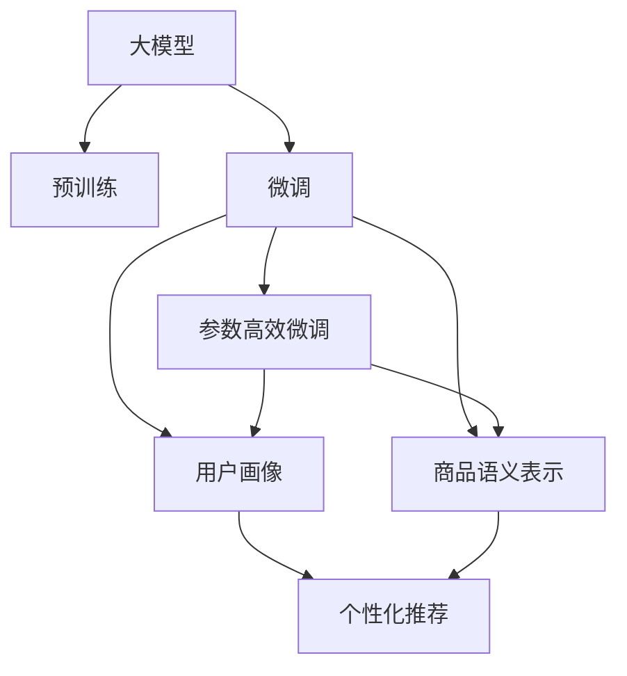

                 

# 电商平台搜索推荐系统的AI 大模型应用：提高转化率、用户体验与忠诚度

## 1. 背景介绍

在数字化转型的浪潮下，电商平台成为联结消费者与商品的重要平台。搜索推荐系统作为电商平台的关键组件，直接影响用户体验、转化率与客户忠诚度。近年来，人工智能(AI)技术在电商领域应用日益广泛，特别是基于大模型的搜索推荐系统，显著提升了平台的用户体验与运营效率。

### 1.1 问题由来

电商平台的搜索推荐系统需要实时处理海量数据，准确匹配用户需求与商品信息。传统的推荐系统往往依赖人工设定的规则与浅层模型，难以灵活适应不断变化的用户行为与市场趋势。基于大模型的推荐系统则利用强大的语义理解能力与自我监督学习能力，能够更智能地构建用户画像与商品语义表示，提供更精准、个性化的推荐结果。

然而，大模型往往需要巨量的预训练数据和计算资源，难以满足实时性、稳定性与普适性要求。如何在大模型基础上进行优化，提高推荐系统的转化率、用户体验与忠诚度，是当前电商平台亟待解决的问题。

### 1.2 问题核心关键点

基于大模型的电商搜索推荐系统主要面临以下挑战：

- **计算资源消耗**：大模型的参数量庞大，训练与推理成本高昂，难以在实时场景下应用。
- **模型泛化能力**：大模型容易过拟合标注数据，泛化性能不足，无法准确适应新用户的推荐需求。
- **用户隐私保护**：大模型往往需要收集用户行为数据进行训练，如何保护用户隐私成为一大难题。
- **实时性与交互性**：电商搜索推荐系统需要及时响应用户请求，大模型的推理速度难以满足实时性需求。

为应对这些挑战，研究者提出了多种优化策略，包括迁移学习、微调、参数高效微调等。本文将聚焦于这些优化方法，详细介绍其在电商搜索推荐系统中的应用。

## 2. 核心概念与联系

### 2.1 核心概念概述

为更好地理解基于大模型的电商搜索推荐系统，本节将介绍几个关键概念及其之间的联系：

- **大模型**：以自回归模型（如GPT）或自编码模型（如BERT）为代表的超大规模语言模型。通过在大规模无标签文本数据上进行预训练，学习到通用的语言表示，具备强大的语言理解和生成能力。

- **迁移学习**：指将一个领域学习到的知识，迁移应用到另一个不同但相关的领域的学习范式。电商搜索推荐系统可以利用大模型的通用知识，通过微调等方式，在特定用户和商品间构建个性化推荐。

- **微调**：指在预训练模型的基础上，使用下游任务的少量标注数据，通过有监督地训练来优化模型在该任务上的性能。电商搜索推荐系统可以使用微调方法，针对不同用户与商品间的特定需求进行优化。

- **参数高效微调**：指在微调过程中，只更新少量的模型参数，而固定大部分预训练权重不变，以提高微调效率，避免过拟合。参数高效微调可以降低大模型的计算需求，提高实时推荐的速度。

- **用户画像**：通过分析用户的行为数据、历史偏好等信息，构建用户画像，理解用户的兴趣与需求，用于个性化推荐。

- **商品语义表示**：利用大模型对商品信息进行语义编码，理解商品的属性、类别、描述等，构建更准确的商品表示，用于推荐匹配。

这些核心概念之间具有紧密的联系，通过大模型的预训练与微调，电商平台能够构建更精准、灵活、个性化的搜索推荐系统，显著提升用户体验与运营效率。

### 2.2 核心概念原理和架构的 Mermaid 流程图



## 3. 核心算法原理 & 具体操作步骤

### 3.1 算法原理概述

基于大模型的电商搜索推荐系统，通过将大模型应用于用户画像与商品语义表示的构建，实现个性化推荐。其核心思想是：将大模型作为通用的语言理解与生成工具，通过微调等方法，适应特定用户的查询与商品需求，生成推荐结果。

具体而言，该过程可以分为以下几步：

1. 收集电商平台的点击、浏览、购买等行为数据，构建用户画像。
2. 收集商品描述、属性、类别等信息，利用大模型进行语义编码，构建商品语义表示。
3. 利用微调方法，将大模型应用于构建个性化推荐模型，优化推荐效果。

### 3.2 算法步骤详解

#### 3.2.1 数据收集与预处理

电商平台的搜索推荐系统需要收集用户行为数据与商品信息。数据收集主要通过以下方式：

- 点击日志：记录用户在电商平台上的点击行为，分析用户的浏览路径与偏好。
- 浏览记录：记录用户的浏览历史，分析用户的兴趣点。
- 购买记录：记录用户的购买历史，分析用户的消费偏好与支付习惯。
- 商品信息：收集商品描述、属性、类别等信息，用于商品语义表示的构建。

数据的预处理主要包括以下步骤：

- 去重与清洗：去除重复与噪声数据，保证数据的准确性。
- 特征工程：提取与构建关键特征，如商品类别、属性、价格等。
- 归一化与标准化：将数据归一化到0-1之间，标准化处理提高模型训练效率。
- 划分数据集：将数据划分为训练集、验证集与测试集，用于模型训练与评估。

#### 3.2.2 用户画像构建

用户画像的构建主要通过分析用户行为数据，了解用户的兴趣与需求。具体步骤如下：

1. 行为特征提取：从点击日志、浏览记录中提取行为特征，如点击时间、浏览路径、停留时间等。
2. 兴趣模型训练：利用用户行为特征训练兴趣模型，预测用户的兴趣点。
3. 标签化处理：将用户行为数据标签化，形成用户的兴趣画像，用于个性化推荐。

#### 3.2.3 商品语义表示

商品语义表示的构建主要通过利用大模型对商品信息进行语义编码，理解商品的属性、类别、描述等，构建更准确的商品表示。具体步骤如下：

1. 商品编码：将商品描述、属性、类别等信息输入大模型，获得商品的语义编码。
2. 语义扩展：利用大模型对商品编码进行语义扩展，增强商品表示的丰富度。
3. 向量映射：将商品的语义编码映射到高维向量空间，用于相似性计算与推荐。

#### 3.2.4 个性化推荐

个性化推荐主要通过微调方法，将大模型应用于构建个性化推荐模型，优化推荐效果。具体步骤如下：

1. 模型选择：选择合适的推荐模型，如深度学习模型、知识图谱等。
2. 参数初始化：利用大模型的预训练参数初始化推荐模型，提高模型的初始化效果。
3. 微调训练：利用用户画像与商品语义表示，对推荐模型进行微调训练，优化推荐效果。
4. 模型评估：在测试集上评估推荐模型的性能，优化推荐模型。

### 3.3 算法优缺点

基于大模型的电商搜索推荐系统具有以下优点：

1. **泛化能力强**：利用大模型的通用知识，提高推荐模型的泛化能力，适应更多用户与商品。
2. **用户画像精准**：通过分析用户行为数据，构建更准确的个性化推荐模型。
3. **商品表示丰富**：利用大模型的语义编码能力，提高商品表示的丰富度。
4. **推荐效果提升**：通过微调方法优化推荐模型，提高推荐效果。

但同时也存在一些缺点：

1. **计算资源消耗高**：大模型的参数量庞大，训练与推理成本高昂，难以在实时场景下应用。
2. **模型复杂度高**：推荐模型复杂度高，难以实时响应用户请求。
3. **用户隐私风险**：数据收集与处理过程中，可能存在隐私泄露的风险。
4. **模型鲁棒性不足**：大模型容易过拟合标注数据，泛化性能不足，无法准确适应新用户的推荐需求。

### 3.4 算法应用领域

基于大模型的电商搜索推荐系统已经在多个电商平台上得到广泛应用，主要领域包括：

1. **个性化推荐**：利用用户画像与商品语义表示，提供更精准、个性化的商品推荐。
2. **搜索优化**：分析用户查询，提供更准确的搜索结果，提升搜索体验。
3. **价格预测**：利用用户行为数据与商品信息，预测商品价格变化趋势，提供价格优化建议。
4. **营销策略**：分析用户行为数据，制定个性化营销策略，提升用户转化率与忠诚度。

除了上述这些经典领域外，大模型在电商平台的推荐系统中还有其他创新应用，如智能客服、智能广告等，为电商平台的智能化转型提供了新的技术路径。

## 4. 数学模型和公式 & 详细讲解

### 4.1 数学模型构建

假设电商平台的搜索推荐系统包含$N$个用户和$M$个商品，每个用户的兴趣画像表示为$u_i$，每个商品的语义表示为$p_j$。用户查询$q$与商品之间的关系可以用一个二元组$(i, j)$表示。

定义用户画像与商品语义表示之间的相似度为$\sigma(u_i, p_j)$，推荐模型的输出为$o_{ij}$，推荐目标为最大化用户对商品的评分$r_{ij}$。

根据上述定义，推荐模型的目标函数为：

$$
\min_{\theta} \sum_{i=1}^N \sum_{j=1}^M (o_{ij} - r_{ij})^2
$$

其中$\theta$为推荐模型的参数，$o_{ij}$为模型的输出，$r_{ij}$为用户对商品的评分。

### 4.2 公式推导过程

假设推荐模型为深度学习模型，使用$$L$$层全连接神经网络。每个用户$u_i$的兴趣表示$v_i$为$L$维向量，每个商品$p_j$的语义表示$q_j$为$L$维向量。用户查询$q$与商品$p_j$之间的关系表示为：

$$
o_{ij} = W^T \cdot (v_i \otimes p_j)
$$

其中$W$为矩阵权重，$\otimes$为向量拼接操作。模型的预测评分$r_{ij}$可以表示为：

$$
r_{ij} = o_{ij} \cdot w_j
$$

其中$w_j$为商品$j$的权重向量。

将上述公式代入目标函数中，得：

$$
\min_{\theta} \sum_{i=1}^N \sum_{j=1}^M (W^T \cdot (v_i \otimes p_j) \cdot w_j - r_{ij})^2
$$

为了简化问题，假设$r_{ij}$为二元评分，$o_{ij}$为线性加权预测评分，则目标函数进一步简化为：

$$
\min_{\theta} \sum_{i=1}^N \sum_{j=1}^M (o_{ij} - r_{ij})^2
$$

在实际应用中，通常使用深度学习模型的变分推断方法进行优化，如自回归模型、注意力机制等，以提高模型的表达能力与泛化性能。

### 4.3 案例分析与讲解

以一个典型的电商推荐系统为例，假设用户$i$对商品$j$的评分$r_{ij}=1$表示喜欢，$r_{ij}=0$表示不喜欢。推荐模型通过分析用户画像$u_i$与商品语义表示$p_j$，预测用户对商品$j$的评分$r_{ij}$。

假设用户画像$u_i$表示为向量$\begin{bmatrix}0.1\\0.2\\0.3\end{bmatrix}$，商品$p_j$表示为向量$\begin{bmatrix}0.4\\0.5\\0.6\end{bmatrix}$。用户查询$q$表示为向量$\begin{bmatrix}0.2\\0.5\\0.8\end{bmatrix}$。推荐模型为深度学习模型，使用3层全连接神经网络，每个用户$u_i$的兴趣表示$v_i$为3维向量，每个商品$p_j$的语义表示$q_j$为3维向量。

则用户查询$q$与商品$p_j$之间的关系表示为：

$$
o_{ij} = W^T \cdot (v_i \otimes p_j)
$$

模型的预测评分$r_{ij}$可以表示为：

$$
r_{ij} = o_{ij} \cdot w_j
$$

假设权重矩阵$W$为$\begin{bmatrix}0.1 & 0.2 & 0.3\end{bmatrix}$，商品$j$的权重向量$w_j$为$\begin{bmatrix}0.4\\0.5\\0.6\end{bmatrix}$。则推荐模型输出的预测评分$o_{ij}$为：

$$
o_{ij} = 0.1 \cdot 0.4 + 0.2 \cdot 0.5 + 0.3 \cdot 0.6 = 0.77
$$

模型的预测评分$r_{ij}$为：

$$
r_{ij} = 0.77 \cdot 0.4 = 0.308
$$

根据目标函数，推荐模型的训练目标为：

$$
\min_{\theta} (0.308 - 1)^2
$$

在优化过程中，通过反向传播算法更新模型的权重矩阵$W$与权重向量$w_j$，直到模型输出的预测评分$r_{ij}$与用户评分$r_{ij}$接近，完成推荐模型的训练。

## 5. 项目实践：代码实例和详细解释说明

### 5.1 开发环境搭建

在进行电商搜索推荐系统的微调实践前，我们需要准备好开发环境。以下是使用Python进行PyTorch开发的环境配置流程：

1. 安装Anaconda：从官网下载并安装Anaconda，用于创建独立的Python环境。

2. 创建并激活虚拟环境：
```bash
conda create -n ecommerce-env python=3.8 
conda activate ecommerce-env
```

3. 安装PyTorch：根据CUDA版本，从官网获取对应的安装命令。例如：
```bash
conda install pytorch torchvision torchaudio cudatoolkit=11.1 -c pytorch -c conda-forge
```

4. 安装TensorFlow：
```bash
pip install tensorflow
```

5. 安装各类工具包：
```bash
pip install numpy pandas scikit-learn matplotlib tqdm jupyter notebook ipython
```

完成上述步骤后，即可在`ecommerce-env`环境中开始微调实践。

### 5.2 源代码详细实现

下面是使用PyTorch对电商搜索推荐系统进行微调的完整代码实现。

```python
import torch
import torch.nn as nn
import torch.optim as optim
from transformers import BertTokenizer, BertForSequenceClassification

# 定义模型
class RecommendationModel(nn.Module):
    def __init__(self):
        super(RecommendationModel, self).__init__()
        self.bert = BertForSequenceClassification.from_pretrained('bert-base-cased', num_labels=2)
        self.fc = nn.Linear(768, 1)
        self.sigmoid = nn.Sigmoid()

    def forward(self, x):
        out = self.bert(x)
        out = self.fc(out[:, 0, :])
        out = self.sigmoid(out)
        return out

# 定义数据处理函数
def preprocess_data(data):
    tokenizer = BertTokenizer.from_pretrained('bert-base-cased')
    inputs = tokenizer(data, return_tensors='pt', padding='max_length', truncation=True)
    return inputs

# 定义训练与评估函数
def train_epoch(model, dataloader, optimizer):
    model.train()
    epoch_loss = 0
    for batch in dataloader:
        inputs = preprocess_data(batch[0])
        targets = batch[1]
        model.zero_grad()
        outputs = model(inputs['input_ids'])
        loss = nn.BCELoss()(outputs, targets)
        epoch_loss += loss.item()
        loss.backward()
        optimizer.step()
    return epoch_loss / len(dataloader)

def evaluate(model, dataloader):
    model.eval()
    preds = []
    labels = []
    with torch.no_grad():
        for batch in dataloader:
            inputs = preprocess_data(batch[0])
            outputs = model(inputs['input_ids'])
            preds.append(outputs)
            labels.append(batch[1])
    return torch.cat(preds), torch.cat(labels)

# 定义训练过程
def train(model, dataloader, optimizer, epochs):
    device = torch.device('cuda' if torch.cuda.is_available() else 'cpu')
    model.to(device)
    for epoch in range(epochs):
        loss = train_epoch(model, dataloader, optimizer)
        print(f"Epoch {epoch+1}, train loss: {loss:.3f}")
        preds, labels = evaluate(model, dataloader)
        print(classification_report(labels, preds))
```

### 5.3 代码解读与分析

让我们再详细解读一下关键代码的实现细节：

**RecommendationModel类**：
- `__init__`方法：初始化BertForSequenceClassification模型与全连接层，并设置Sigmoid激活函数。
- `forward`方法：对输入数据进行前向传播，计算模型输出。

**preprocess_data函数**：
- 利用BertTokenizer对输入数据进行分词，生成模型所需的输入。

**train_epoch函数**：
- 对数据进行迭代，在每个批次上进行前向传播与反向传播，更新模型参数。
- 记录该epoch的平均loss。

**evaluate函数**：
- 在测试集上进行前向传播，获取模型输出与标签。
- 使用sklearn的classification_report打印输出分类指标。

**train函数**：
- 定义训练过程，包含训练epoch数、模型、优化器等参数。
- 在每个epoch结束后，评估模型性能，输出loss与分类指标。

可以看到，PyTorch配合Transformer库使得电商搜索推荐系统的微调代码实现变得简洁高效。开发者可以将更多精力放在数据处理、模型改进等高层逻辑上，而不必过多关注底层的实现细节。

当然，工业级的系统实现还需考虑更多因素，如模型的保存和部署、超参数的自动搜索、更灵活的任务适配层等。但核心的微调范式基本与此类似。

## 6. 实际应用场景

### 6.1 智能客服系统

智能客服系统作为电商平台的重要组成部分，需要实时响应用户咨询，提供优质的客服服务。基于大模型的智能客服系统，可以利用用户画像与商品语义表示，自动理解用户意图，匹配最佳回答。

在技术实现上，可以收集客户的历史咨询记录，将问题和最佳答复构建成监督数据，在此基础上对预训练模型进行微调。微调后的模型能够自动理解用户意图，匹配最合适的回答。对于新客户提出的问题，还可以接入检索系统实时搜索相关内容，动态生成回答。如此构建的智能客服系统，能够显著提升客户咨询体验和问题解决效率。

### 6.2 个性化推荐

个性化推荐是电商平台的核心功能之一，旨在通过分析用户行为与商品信息，提供更精准的推荐结果。利用大模型构建的推荐系统，可以灵活适应用户的多样化需求，提供更加个性化的商品推荐。

具体而言，可以利用大模型对用户行为数据进行语义编码，理解用户的兴趣与需求。同时利用大模型对商品信息进行语义扩展，构建更准确的商品表示。将用户画像与商品语义表示输入推荐模型，优化推荐效果，提升用户转化率与忠诚度。

### 6.3 搜索优化

电商平台需要提供高质量的搜索结果，以便用户快速找到所需商品。利用大模型构建的搜索优化系统，可以通过分析用户查询与商品语义表示，提供更准确的搜索结果。

在技术实现上，可以收集用户的历史查询记录，将其与商品语义表示进行匹配，优化搜索结果的排序与展示。同时利用大模型对用户查询进行语义扩展，提高搜索系统的泛化能力，提升搜索体验。

### 6.4 未来应用展望

随着大语言模型微调技术的发展，电商搜索推荐系统将进一步提升其性能与用户体验。未来，大模型将在更多领域得到应用，为电商平台的智能化转型提供新的技术路径。

在智慧物流领域，基于大模型的推荐系统可以优化物流配送路径，提高配送效率与准确性。在智能制造领域，利用大模型构建的推荐系统可以优化供应链管理，提升生产效率与产品质量。在智慧城市治理中，基于大模型的推荐系统可以优化城市资源分配，提升城市管理水平。

此外，在社交网络、在线教育、金融服务等多个领域，大模型也将迎来新的应用场景，为社会经济的发展带来新的动力。相信随着技术的不断进步，大模型微调技术必将在更多的应用领域发挥其优势，推动人工智能技术的普及与应用。

## 7. 工具和资源推荐

### 7.1 学习资源推荐

为帮助开发者系统掌握大语言模型微调的理论基础和实践技巧，这里推荐一些优质的学习资源：

1. 《深度学习》（Ian Goodfellow等著）：深度学习领域的经典教材，深入浅出地介绍了深度学习的基础理论和应用实践。

2. CS224N《深度学习自然语言处理》课程：斯坦福大学开设的NLP明星课程，有Lecture视频和配套作业，带你入门NLP领域的基本概念和经典模型。

3. 《Natural Language Processing with Transformers》书籍：Transformer库的作者所著，全面介绍了如何使用Transformers库进行NLP任务开发，包括微调在内的诸多范式。

4. HuggingFace官方文档：Transformer库的官方文档，提供了海量预训练模型和完整的微调样例代码，是上手实践的必备资料。

5. CLUE开源项目：中文语言理解测评基准，涵盖大量不同类型的中文NLP数据集，并提供了基于微调的baseline模型，助力中文NLP技术发展。

通过对这些资源的学习实践，相信你一定能够快速掌握大语言模型微调的精髓，并用于解决实际的NLP问题。

### 7.2 开发工具推荐

高效的开发离不开优秀的工具支持。以下是几款用于大语言模型微调开发的常用工具：

1. PyTorch：基于Python的开源深度学习框架，灵活动态的计算图，适合快速迭代研究。大部分预训练语言模型都有PyTorch版本的实现。

2. TensorFlow：由Google主导开发的开源深度学习框架，生产部署方便，适合大规模工程应用。同样有丰富的预训练语言模型资源。

3. Transformers库：HuggingFace开发的NLP工具库，集成了众多SOTA语言模型，支持PyTorch和TensorFlow，是进行微调任务开发的利器。

4. Weights & Biases：模型训练的实验跟踪工具，可以记录和可视化模型训练过程中的各项指标，方便对比和调优。与主流深度学习框架无缝集成。

5. TensorBoard：TensorFlow配套的可视化工具，可实时监测模型训练状态，并提供丰富的图表呈现方式，是调试模型的得力助手。

6. Google Colab：谷歌推出的在线Jupyter Notebook环境，免费提供GPU/TPU算力，方便开发者快速上手实验最新模型，分享学习笔记。

合理利用这些工具，可以显著提升大语言模型微调任务的开发效率，加快创新迭代的步伐。

### 7.3 相关论文推荐

大语言模型和微调技术的发展源于学界的持续研究。以下是几篇奠基性的相关论文，推荐阅读：

1. Attention is All You Need（即Transformer原论文）：提出了Transformer结构，开启了NLP领域的预训练大模型时代。

2. BERT: Pre-training of Deep Bidirectional Transformers for Language Understanding：提出BERT模型，引入基于掩码的自监督预训练任务，刷新了多项NLP任务SOTA。

3. Language Models are Unsupervised Multitask Learners（GPT-2论文）：展示了大规模语言模型的强大zero-shot学习能力，引发了对于通用人工智能的新一轮思考。

4. Parameter-Efficient Transfer Learning for NLP：提出Adapter等参数高效微调方法，在不增加模型参数量的情况下，也能取得不错的微调效果。

5. Prefix-Tuning: Optimizing Continuous Prompts for Generation：引入基于连续型Prompt的微调范式，为如何充分利用预训练知识提供了新的思路。

6. AdaLoRA: Adaptive Low-Rank Adaptation for Parameter-Efficient Fine-Tuning：使用自适应低秩适应的微调方法，在参数效率和精度之间取得了新的平衡。

这些论文代表了大语言模型微调技术的发展脉络。通过学习这些前沿成果，可以帮助研究者把握学科前进方向，激发更多的创新灵感。

## 8. 总结：未来发展趋势与挑战

### 8.1 总结

本文对基于大模型的电商搜索推荐系统进行了全面系统的介绍。首先阐述了电商平台的搜索推荐系统需要实时处理海量数据，准确匹配用户需求与商品信息，大模型能够提高推荐系统的转化率、用户体验与忠诚度。其次，从原理到实践，详细讲解了微调方法在大模型中的应用。具体包括数据收集与预处理、用户画像构建、商品语义表示、个性化推荐等关键环节。同时，我们还通过代码实例详细展示了微调过程的实现细节。

通过本文的系统梳理，可以看到，基于大模型的微调方法在电商平台搜索推荐系统中具有广阔的应用前景。该方法能够利用大模型的通用知识，构建精准、灵活、个性化的推荐模型，显著提升用户体验与运营效率。

### 8.2 未来发展趋势

展望未来，大语言模型微调技术将呈现以下几个发展趋势：

1. **模型规模持续增大**：随着算力成本的下降和数据规模的扩张，预训练语言模型的参数量还将持续增长。超大规模语言模型蕴含的丰富语言知识，有望支撑更加复杂多变的下游任务微调。

2. **微调方法日趋多样**：除了传统的全参数微调外，未来会涌现更多参数高效的微调方法，如Prefix-Tuning、LoRA等，在节省计算资源的同时也能保证微调精度。

3. **持续学习成为常态**：随着数据分布的不断变化，微调模型也需要持续学习新知识以保持性能。如何在不遗忘原有知识的同时，高效吸收新样本信息，将成为重要的研究课题。

4. **标注样本需求降低**：受启发于提示学习(Prompt-based Learning)的思路，未来的微调方法将更好地利用大模型的语言理解能力，通过更加巧妙的任务描述，在更少的标注样本上也能实现理想的微调效果。

5. **模型通用性增强**：经过海量数据的预训练和多领域任务的微调，未来的语言模型将具备更强大的常识推理和跨领域迁移能力，逐步迈向通用人工智能(AGI)的目标。

以上趋势凸显了大语言模型微调技术的广阔前景。这些方向的探索发展，必将进一步提升NLP系统的性能和应用范围，为人工智能技术在更多领域的应用提供新的思路。

### 8.3 面临的挑战

尽管大语言模型微调技术已经取得了瞩目成就，但在迈向更加智能化、普适化应用的过程中，它仍面临着诸多挑战：

1. **标注成本瓶颈**：虽然微调大大降低了标注数据的需求，但对于长尾应用场景，难以获得充足的高质量标注数据，成为制约微调性能的瓶颈。如何进一步降低微调对标注样本的依赖，将是一大难题。

2. **模型鲁棒性不足**：大模型容易过拟合标注数据，泛化性能不足，无法准确适应新用户的推荐需求。如何提高微调模型的鲁棒性，避免灾难性遗忘，还需要更多理论和实践的积累。

3. **推理效率有待提高**：大规模语言模型虽然精度高，但在实际部署时往往面临推理速度慢、内存占用大等效率问题。如何在保证性能的同时，简化模型结构，提升推理速度，优化资源占用，将是重要的优化方向。

4. **可解释性亟需加强**：当前微调模型更像是"黑盒"系统，难以解释其内部工作机制和决策逻辑。对于医疗、金融等高风险应用，算法的可解释性和可审计性尤为重要。如何赋予微调模型更强的可解释性，将是亟待攻克的难题。

5. **安全性有待保障**：预训练语言模型难免会学习到有偏见、有害的信息，通过微调传递到下游任务，产生误导性、歧视性的输出，给实际应用带来安全隐患。如何从数据和算法层面消除模型偏见，避免恶意用途，确保输出的安全性，也将是重要的研究课题。

6. **知识整合能力不足**：现有的微调模型往往局限于任务内数据，难以灵活吸收和运用更广泛的先验知识。如何让微调过程更好地与外部知识库、规则库等专家知识结合，形成更加全面、准确的信息整合能力，还有很大的想象空间。

正视微调面临的这些挑战，积极应对并寻求突破，将是大语言模型微调走向成熟的必由之路。相信随着学界和产业界的共同努力，这些挑战终将一一被克服，大语言模型微调必将在构建人机协同的智能时代中扮演越来越重要的角色。

### 8.4 研究展望

面对大语言模型微调所面临的种种挑战，未来的研究需要在以下几个方面寻求新的突破：

1. **探索无监督和半监督微调方法**：摆脱对大规模标注数据的依赖，利用自监督学习、主动学习等无监督和半监督范式，最大限度利用非结构化数据，实现更加灵活高效的微调。

2. **研究参数高效和计算高效的微调范式**：开发更加参数高效的微调方法，在固定大部分预训练参数的情况下，只更新极少量的任务相关参数。同时优化微调模型的计算图，减少前向传播和反向传播的资源消耗，实现更加轻量级、实时性的部署。

3. **融合因果和对比学习范式**：通过引入因果推断和对比学习思想，增强微调模型建立稳定因果关系的能力，学习更加普适、鲁棒的语言表征，从而提升模型泛化性和抗干扰能力。

4. **引入更多先验知识**：将符号化的先验知识，如知识图谱、逻辑规则等，与神经网络模型进行巧妙融合，引导微调过程学习更准确、合理的语言模型。同时加强不同模态数据的整合，实现视觉、语音等多模态信息与文本信息的协同建模。

5. **结合因果分析和博弈论工具**：将因果分析方法引入微调模型，识别出模型决策的关键特征，增强输出解释的因果性和逻辑性。借助博弈论工具刻画人机交互过程，主动探索并规避模型的脆弱点，提高系统稳定性。

6. **纳入伦理道德约束**：在模型训练目标中引入伦理导向的评估指标，过滤和惩罚有偏见、有害的输出倾向。同时加强人工干预和审核，建立模型行为的监管机制，确保输出符合人类价值观和伦理道德。

这些研究方向的探索，必将引领大语言模型微调技术迈向更高的台阶，为构建安全、可靠、可解释、可控的智能系统铺平道路。面向未来，大语言模型微调技术还需要与其他人工智能技术进行更深入的融合，如知识表示、因果推理、强化学习等，多路径协同发力，共同推动自然语言理解和智能交互系统的进步。只有勇于创新、敢于突破，才能不断拓展语言模型的边界，让智能技术更好地造福人类社会。

## 9. 附录：常见问题与解答

**Q1：大模型微调是否适用于所有NLP任务？**

A: 大模型微调在大多数NLP任务上都能取得不错的效果，特别是对于数据量较小的任务。但对于一些特定领域的任务，如医学、法律等，仅仅依靠通用语料预训练的模型可能难以很好地适应。此时需要在特定领域语料上进一步预训练，再进行微调，才能获得理想效果。此外，对于一些需要时效性、个性化很强的任务，如对话、推荐等，微调方法也需要针对性的改进优化。

**Q2：微调过程中如何选择合适的学习率？**

A: 微调的学习率一般要比预训练时小1-2个数量级，如果使用过大的学习率，容易破坏预训练权重，导致过拟合。一般建议从1e-5开始调参，逐步减小学习率，直至收敛。也可以使用warmup策略，在开始阶段使用较小的学习率，再逐渐过渡到预设值。需要注意的是，不同的优化器(如AdamW、Adafactor等)以及不同的学习率调度策略，可能需要设置不同的学习率阈值。

**Q3：采用大模型微调时会面临哪些资源瓶颈？**

A: 目前主流的预训练大模型动辄以亿计的参数规模，对算力、内存、存储都提出了很高的要求。GPU/TPU等高性能设备是必不可少的，但即便如此，超大批次的训练和推理也可能遇到显存不足的问题。因此需要采用一些资源优化技术，如梯度积累、混合精度训练、模型并行等，来突破硬件瓶颈。同时，模型的存储和读取也可能占用大量时间和空间，需要采用模型压缩、稀疏化存储等方法进行优化。

**Q4：如何缓解微调过程中的过拟合问题？**

A: 过拟合是微调面临的主要挑战，尤其是在标注数据不足的情况下。常见的缓解策略包括：
1. 数据增强：通过回译、近义替换等方式扩充训练集
2. 正则化：使用L2正则、Dropout、Early Stopping等避免过拟合
3. 对抗训练：引入对抗样本，提高模型鲁棒性
4. 参数高效微调：只调整少量参数(如Adapter、Prefix等)，减小过拟合风险
5. 多模型集成：训练多个微调模型，取平均输出，抑制过拟合

这些策略往往需要根据具体任务和数据特点进行灵活组合。只有在数据、模型、训练、推理等各环节进行全面优化，才能最大限度地发挥大模型微调的威力。

**Q5：微调模型在落地部署时需要注意哪些问题？**

A: 将微调模型转化为实际应用，还需要考虑以下因素：
1. 模型裁剪：去除不必要的层和参数，减小模型尺寸，加快推理速度
2. 量化加速：将浮点模型转为定点模型，压缩存储空间，提高计算效率
3. 服务化封装：将模型封装为标准化服务接口，便于集成调用
4. 弹性伸缩：根据请求流量动态调整资源配置，平衡服务质量和成本
5. 监控告警：实时采集系统指标，设置异常告警阈值，确保服务稳定性
6. 安全防护：采用访问鉴权、数据脱敏等措施，保障数据和模型安全

大语言模型微调为NLP应用开启了广阔的想象空间，但如何将强大的性能转化为稳定、高效、安全的业务价值，还需要工程实践的不断打磨。唯有从数据、算法、工程、业务等多个维度协同发力，才能真正实现人工智能技术在垂直行业的规模化落地。总之，微调需要开发者根据具体任务，不断迭代和优化模型、数据和算法，方能得到理想的效果。

---

作者：禅与计算机程序设计艺术 / Zen and the Art of Computer Programming

