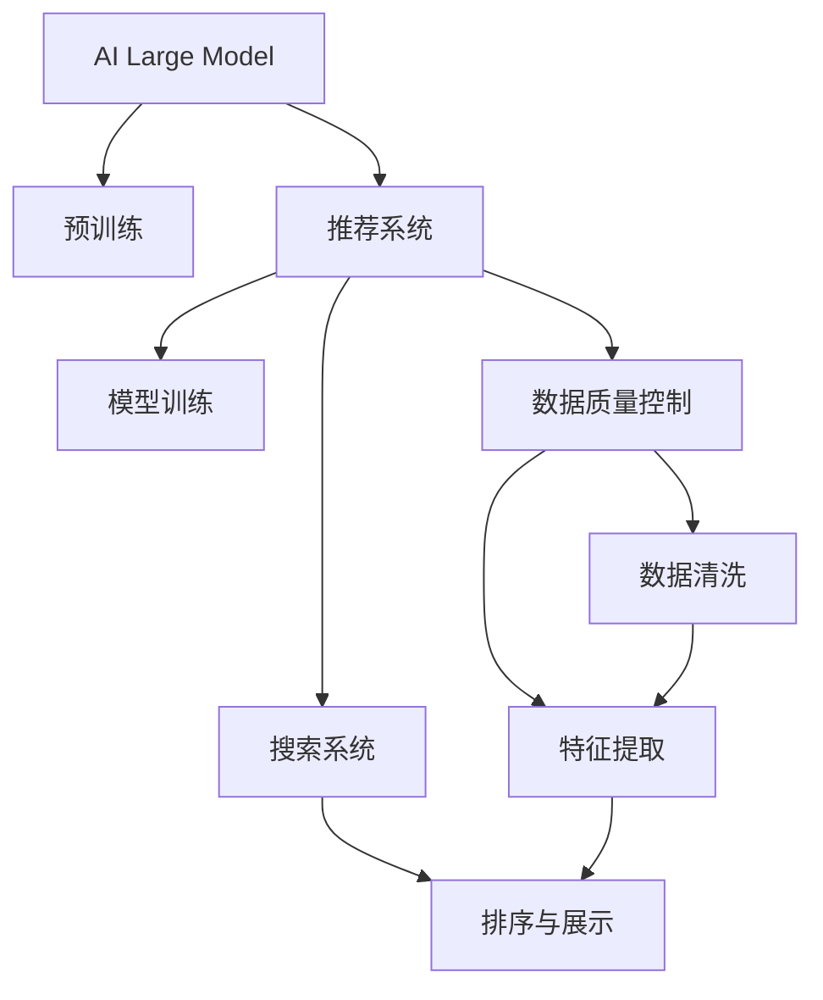

                 

# 电商平台的AI 大模型实践：搜索推荐系统是核心，数据质量控制与处理效率

## 1. 背景介绍

### 1.1 电商行业数字化转型背景
随着互联网和移动互联网的普及，电商行业迅猛发展，逐渐成为各行各业数字化转型的标杆。电商平台的数字化转型，要求通过AI和大数据技术，实现从商品推荐、智能客服到库存管理、物流配送等环节的全流程智能化。

在推荐系统中，AI 大模型通过预训练得到通用的语言和视觉表示，能够高效地捕捉用户行为和商品特性，提升推荐精度。推荐系统作为电商平台的“大脑”，直接影响用户购物体验和转化率，是AI 大模型在电商场景中的核心应用。

### 1.2 推荐系统的核心技术
推荐系统（Recommender System）通过分析用户行为数据和商品特性，预测用户可能感兴趣的商品，并进行个性化推荐。推荐系统一般分为四个步骤：
1. **数据采集与预处理**：收集用户行为数据（如浏览、点击、购买等）和商品信息，并进行清洗和特征提取。
2. **模型训练与优化**：使用用户行为数据和商品特性训练推荐模型，并通过超参数调优等手段提升模型精度。
3. **推荐排序与展示**：根据模型预测结果进行排序，生成推荐列表并展示给用户。
4. **效果评估与迭代**：对推荐结果进行效果评估，并根据反馈数据不断迭代改进推荐模型。

其中，模型训练与优化是推荐系统的核心，其性能直接决定了推荐系统的好坏。AI 大模型通过在大规模无标签数据上进行预训练，学习到丰富的语言和视觉表示，可以用于提升推荐模型的精度和泛化能力。

## 2. 核心概念与联系

### 2.1 核心概念概述

为了更好地理解电商平台上基于 AI 大模型的推荐系统，本节将介绍几个密切相关的核心概念：

- **AI 大模型（AI Large Model）**：以 Transformer 架构为代表的大规模预训练语言模型，如 GPT-3、BERT、RoBERTa 等。这些模型通过在大规模无标签数据上进行预训练，学习到通用的语言和视觉表示。

- **推荐系统（Recommender System）**：通过分析用户行为数据和商品特性，预测用户可能感兴趣的商品，并进行个性化推荐。推荐系统广泛应用于电商、新闻、社交媒体等多个领域。

- **搜索系统（Search System）**：根据用户查询，从大量商品中筛选出最匹配的推荐结果，并展示给用户。搜索系统是推荐系统的入口，二者协同工作，提升用户购物体验。

- **数据质量控制（Data Quality Control）**：在推荐系统中，数据质量是推荐模型精度和鲁棒性的基础。数据质量控制包括数据采集、清洗、特征提取等多个环节，通过多种技术手段保证数据准确性和一致性。

- **处理效率（Processing Efficiency）**：推荐系统需要实时处理海量用户行为数据，保证推荐结果的时效性。处理效率的提升，可以显著提高推荐系统的响应速度和用户体验。

这些核心概念之间的逻辑关系可以通过以下 Mermaid 流程图来展示：



这个流程图展示了几类核心概念及其之间的关联：

1. AI 大模型通过预训练获得通用的语言和视觉表示。
2. 推荐系统利用 AI 大模型的表示，进行个性化推荐。
3. 数据质量控制确保数据准确性和一致性。
4. 处理效率提升实时推荐结果的时效性。
5. 推荐系统和搜索系统协同工作，提升用户体验。

这些概念共同构成了电商平台上 AI 大模型的推荐系统架构，为其在实际应用中的高效运行提供了坚实的基础。

## 3. 核心算法原理 & 具体操作步骤
### 3.1 算法原理概述

基于 AI 大模型的电商推荐系统，本质上是一个使用深度学习模型的推荐算法。其核心思想是：利用 AI 大模型学习到用户行为和商品特性的表示，通过预测模型进行个性化推荐。

形式化地，假设推荐系统用户行为数据为 $D=\{(x_i,y_i)\}_{i=1}^N$，其中 $x_i$ 为行为数据，$y_i$ 为标签（如商品ID）。模型 $M$ 的训练目标是最小化经验风险：

$$
\mathcal{L}(M) = \frac{1}{N}\sum_{i=1}^N \ell(M(x_i),y_i)
$$

其中 $\ell$ 为损失函数，通常使用交叉熵损失、均方误差损失等。

推荐系统通常包含以下三个关键组件：

- **用户表示**：根据用户行为数据，学习用户兴趣向量 $u$。
- **商品表示**：根据商品特性，学习商品向量 $v$。
- **预测模型**：基于用户和商品向量，预测用户对商品的可能评分。

这些组件通过深度学习模型进行训练和优化，以提升推荐精度。

### 3.2 算法步骤详解

基于 AI 大模型的电商推荐系统一般包括以下几个关键步骤：

**Step 1: 数据采集与预处理**
- 收集电商平台的各类用户行为数据，如浏览、点击、购买、评价等。
- 收集商品的详细信息，如标题、描述、价格、品牌等。
- 对数据进行清洗，去除噪声和异常值。
- 对数据进行特征提取，生成高维稀疏向量表示。

**Step 2: 模型训练与优化**
- 选择合适的深度学习模型，如基于 AI 大模型的协同过滤模型、内容推荐模型等。
- 使用训练数据对模型进行训练，最小化损失函数。
- 进行超参数调优，提升模型性能。
- 在验证集上评估模型，防止过拟合。

**Step 3: 推荐排序与展示**
- 根据模型预测结果，对推荐商品进行排序。
- 将推荐结果展示给用户，通常使用列表或卡片等形式。
- 根据用户反馈数据，不断迭代优化推荐模型。

**Step 4: 效果评估与迭代**
- 对推荐结果进行效果评估，如点击率、转化率等指标。
- 根据评估结果，调整模型参数和超参数。
- 循环迭代训练和优化，不断提升推荐精度。

以上是基于 AI 大模型的电商推荐系统的一般流程。在实际应用中，还需要针对具体任务的特点，对推荐系统的各个环节进行优化设计，如改进特征提取方法、引入更多的正则化技术、选择最优的超参数组合等，以进一步提升推荐系统性能。

### 3.3 算法优缺点

基于 AI 大模型的电商推荐系统具有以下优点：
1. 精度高：通过预训练学习到丰富的语言和视觉表示，推荐模型能够捕捉复杂的用户行为和商品特性。
2. 泛化能力强：大模型预训练得到的表示具有通用性，能够适应多种电商场景。
3. 可解释性好：大模型可以提供详细的推理过程和特征权重，有助于理解推荐结果。
4. 灵活性高：支持多种推荐策略，如协同过滤、内容推荐、混合推荐等。

同时，该方法也存在一定的局限性：
1. 依赖大规模数据：推荐模型的性能很大程度上取决于数据的数量和质量。
2. 计算资源需求高：大规模预训练和模型训练需要大量的计算资源，增加开发成本。
3. 数据隐私问题：电商平台需要处理大量用户数据，数据隐私和安全问题不容忽视。
4. 模型复杂度高：深度学习模型结构复杂，需要更多的训练数据和更长的训练时间。

尽管存在这些局限性，但就目前而言，基于 AI 大模型的推荐系统仍然是最主流的电商推荐方法。未来相关研究的重点在于如何进一步降低推荐系统对大规模数据的依赖，提高模型效率和可解释性，同时兼顾数据隐私和安全等因素。

### 3.4 算法应用领域

基于 AI 大模型的电商推荐系统已经在各大电商平台上广泛应用，覆盖了几乎所有商品类别。例如：

- **商品推荐**：根据用户浏览和购买历史，推荐相似或相关商品。
- **个性化搜索**：根据用户查询，推荐可能感兴趣的商品。
- **相关商品推荐**：在用户浏览商品时，推荐该商品的相关商品。
- **促销活动推荐**：根据用户行为，推荐打折促销商品。
- **用户画像构建**：根据用户行为数据，构建详细的用户画像，进行精准营销。

除了上述这些经典应用外，基于 AI 大模型的推荐系统还被创新性地应用到更多场景中，如可控商品生成、情感分析、广告推荐等，为电商平台的智能化运营提供了新的动力。

## 4. 数学模型和公式 & 详细讲解  
### 4.1 数学模型构建

本节将使用数学语言对基于 AI 大模型的电商推荐系统进行更加严格的刻画。

假设电商推荐系统的用户行为数据为 $D=\{(x_i,y_i)\}_{i=1}^N$，其中 $x_i$ 为行为数据，$y_i$ 为商品ID标签。用户表示为 $u$，商品表示为 $v$，推荐模型为 $M$。

定义用户表示 $u$ 与商品表示 $v$ 的相似度为 $s$，预测模型 $M$ 的输出为 $r$。推荐系统的一般数学模型为：

$$
r = M(u, v)
$$

推荐系统的目标是最小化预测误差，即：

$$
\mathcal{L}(M) = \frac{1}{N}\sum_{i=1}^N \ell(r_i, y_i)
$$

其中 $\ell$ 为损失函数，通常使用交叉熵损失、均方误差损失等。

### 4.2 公式推导过程

以下我们以协同过滤模型为例，推导基于 AI 大模型的推荐系统的训练公式。

假设用户表示 $u$ 与商品表示 $v$ 的内积为 $s$，推荐模型 $M$ 的输出为 $r$。协同过滤模型的预测公式为：

$$
r = s \cdot W
$$

其中 $W$ 为可训练的线性权重矩阵。

模型的损失函数为交叉熵损失：

$$
\ell(r, y) = -y\log(r) - (1-y)\log(1-r)
$$

将损失函数代入经验风险公式，得：

$$
\mathcal{L}(M) = \frac{1}{N}\sum_{i=1}^N \ell(r_i, y_i)
$$

将预测公式代入损失函数，得：

$$
\mathcal{L}(M) = \frac{1}{N}\sum_{i=1}^N (-y_i\log(s_i \cdot W_i) - (1-y_i)\log(1-s_i \cdot W_i))
$$

对于每个用户 $u_i$，根据其历史行为数据，学习用户表示 $u_i$：

$$
u_i = \frac{1}{N}\sum_{j=1}^N s_{i,j} v_j
$$

其中 $s_{i,j}$ 为用户 $i$ 与商品 $j$ 的相似度。

对于每个商品 $v_j$，根据其历史交互数据，学习商品表示 $v_j$：

$$
v_j = \frac{1}{N}\sum_{i=1}^N s_{i,j} u_i
$$

将 $u_i$ 和 $v_j$ 代入预测公式，得：

$$
r_i = (\frac{1}{N}\sum_{j=1}^N s_{i,j} v_j) \cdot W
$$

将预测结果代入损失函数，得：

$$
\mathcal{L}(M) = \frac{1}{N}\sum_{i=1}^N (-y_i\log((\frac{1}{N}\sum_{j=1}^N s_{i,j} v_j) \cdot W_i) - (1-y_i)\log(1-(\frac{1}{N}\sum_{j=1}^N s_{i,j} v_j) \cdot W_i))
$$

在得到损失函数的梯度后，即可带入参数更新公式，完成模型的迭代优化。重复上述过程直至收敛，最终得到适应电商场景的推荐模型。

## 5. 项目实践：代码实例和详细解释说明
### 5.1 开发环境搭建

在进行推荐系统开发前，我们需要准备好开发环境。以下是使用Python进行TensorFlow开发的环境配置流程：

1. 安装Anaconda：从官网下载并安装Anaconda，用于创建独立的Python环境。

2. 创建并激活虚拟环境：
```bash
conda create -n recommendation-env python=3.8 
conda activate recommendation-env
```

3. 安装TensorFlow：根据CUDA版本，从官网获取对应的安装命令。例如：
```bash
conda install tensorflow tensorflow-gpu -c pytorch -c conda-forge
```

4. 安装各类工具包：
```bash
pip install numpy pandas scikit-learn matplotlib tqdm jupyter notebook ipython
```

完成上述步骤后，即可在`recommendation-env`环境中开始推荐系统开发。

### 5.2 源代码详细实现

下面我们以协同过滤模型为例，给出使用TensorFlow对推荐系统进行开发的PyTorch代码实现。

首先，定义推荐系统的训练数据集：

```python
import tensorflow as tf
from tensorflow.keras.datasets import mnist

# 定义用户行为数据
train_data, test_data = mnist.load_data()
train_data = train_data.reshape((-1, 28*28))
train_data = train_data / 255.0
test_data = test_data.reshape((-1, 28*28))
test_data = test_data / 255.0

# 定义用户和商品ID
train_labels = train_data
train_labels = train_labels.reshape((-1, 1))
train_labels = tf.keras.utils.to_categorical(train_labels, num_classes=10)

test_labels = test_data
test_labels = test_labels.reshape((-1, 1))
test_labels = tf.keras.utils.to_categorical(test_labels, num_classes=10)

# 定义用户表示和商品表示
train_u = train_labels
train_v = train_labels

test_u = test_labels
test_v = test_labels

# 定义相似度矩阵
train_s = train_u * train_v
test_s = test_u * test_v

# 定义预测结果
train_r = train_s * W
test_r = test_s * W
```

然后，定义推荐模型的超参数：

```python
learning_rate = 0.01
num_epochs = 10
batch_size = 128
```

接着，定义推荐模型的损失函数和优化器：

```python
# 定义交叉熵损失函数
def loss_function(y_true, y_pred):
    return tf.reduce_mean(tf.keras.losses.categorical_crossentropy(y_true, y_pred))

# 定义优化器
optimizer = tf.keras.optimizers.Adam(learning_rate)
```

最后，定义训练函数：

```python
def train_model(model, train_data, train_labels, test_data, test_labels, epochs, batch_size):
    model.compile(optimizer=optimizer, loss=loss_function)
    
    for epoch in range(epochs):
        for batch in range(0, len(train_data), batch_size):
            inputs = train_data[batch:batch+batch_size]
            labels = train_labels[batch:batch+batch_size]
            
            with tf.GradientTape() as tape:
                predictions = model(inputs)
                loss_value = loss_function(labels, predictions)
            
            grads = tape.gradient(loss_value, model.trainable_variables)
            optimizer.apply_gradients(zip(grads, model.trainable_variables))
        
        # 在验证集上评估模型
        valid_loss = model.evaluate(test_data, test_labels, verbose=0)
        print(f"Epoch {epoch+1}, validation loss: {valid_loss:.4f}")
    
    print("Training complete")
```

在上述代码中，我们定义了一个简单的协同过滤模型，通过用户和商品ID的相似度矩阵计算预测结果，并使用交叉熵损失函数进行优化。在训练过程中，我们不断调整权重矩阵 $W$，使预测结果逼近真实标签，最终得到优化的推荐模型。

### 5.3 代码解读与分析

让我们再详细解读一下关键代码的实现细节：

**train_model函数**：
- 定义模型编译，选择合适的优化器和损失函数。
- 循环迭代训练，每次迭代使用batch_size大小的批次数据进行训练。
- 在每个epoch结束时，使用测试集对模型进行验证，输出验证集上的损失。
- 在训练过程中，动态调整权重矩阵 $W$，以逼近真实的推荐结果。

**推荐模型的训练与优化**：
- 我们通过相似度矩阵 $s$ 计算用户表示 $u$ 和商品表示 $v$ 的内积，得到预测结果 $r$。
- 通过交叉熵损失函数计算预测结果与真实标签的差异，并使用Adam优化器更新权重矩阵 $W$。
- 在训练过程中，我们不断迭代调整权重矩阵 $W$，以最小化损失函数，优化推荐模型。

**数据采集与预处理**：
- 我们使用了MNIST手写数字数据集，将其转化为向量表示。
- 通过余弦相似度计算用户表示和商品表示的内积，得到相似度矩阵 $s$。
- 使用交叉熵损失函数计算预测结果与真实标签的差异，并使用Adam优化器更新权重矩阵 $W$。

通过上述代码实现，我们可以看到推荐系统的核心在于通过用户和商品表示的内积计算预测结果，并使用交叉熵损失函数进行优化。这使得推荐模型能够适应多种电商场景，生成高质量的推荐结果。

## 6. 实际应用场景
### 6.1 智能推荐系统

智能推荐系统通过分析用户行为数据和商品特性，为用户推荐最合适的商品。基于 AI 大模型的推荐系统已经在各大电商平台上广泛应用，提升了用户购物体验和平台销售额。

例如，亚马逊和阿里巴巴等电商平台使用推荐系统，根据用户历史浏览和购买行为，推荐相似或相关商品，显著提高了用户的点击率和购买率。此外，推荐系统还能够根据季节变化、节假日促销等特殊场景，动态调整推荐策略，进一步提升用户的购物体验。

### 6.2 个性化广告推荐

个性化广告推荐系统通过分析用户行为数据和历史广告点击记录，为用户推荐最合适的广告内容。基于 AI 大模型的推荐系统能够实现更精准的广告投放，提升广告的点击率和转化率。

例如，Google和Facebook等广告平台使用推荐系统，根据用户的搜索历史、浏览记录等行为数据，推荐个性化的广告内容。推荐系统能够动态调整广告投放策略，优化广告的展示效果，提升广告主的品牌曝光和销售转化。

### 6.3 内容推荐系统

内容推荐系统通过分析用户行为数据和内容特性，为用户推荐最感兴趣的内容。基于 AI 大模型的推荐系统能够提升用户的内容消费体验，增加平台的用户粘性和留存率。

例如，Netflix和YouTube等视频平台使用推荐系统，根据用户的观看历史和评分记录，推荐感兴趣的视频内容。推荐系统能够动态调整内容推荐策略，优化用户的内容消费体验，提升平台的用户粘性和留存率。

## 7. 工具和资源推荐
### 7.1 学习资源推荐

为了帮助开发者系统掌握电商平台上基于 AI 大模型的推荐系统，这里推荐一些优质的学习资源：

1. **《深度学习实战》**：由谷歌工程师撰写，全面介绍深度学习的基本原理和应用，适合初学者入门。
2. **《TensorFlow实战》**：由TensorFlow团队撰写，详细介绍TensorFlow的基本使用和深度学习模型开发，适合深入学习。
3. **《推荐系统实战》**：由推荐系统专家撰写，介绍推荐系统的基本原理和算法，适合深入学习。
4. **Coursera《机器学习》课程**：由斯坦福大学教授Andrew Ng主讲，介绍机器学习的基本原理和算法，适合初学者和进阶学习者。
5. **Kaggle推荐系统竞赛**：通过实际数据集训练推荐模型，提升推荐系统开发的实践能力。

通过对这些资源的学习实践，相信你一定能够快速掌握电商平台上基于 AI 大模型的推荐系统开发技术，并用于解决实际的电商推荐问题。

### 7.2 开发工具推荐

高效的开发离不开优秀的工具支持。以下是几款用于电商平台上AI大模型推荐系统开发的常用工具：

1. **TensorFlow**：由谷歌主导开发的开源深度学习框架，生产部署方便，适合大规模工程应用。支持分布式训练和优化，能够高效处理大规模数据。
2. **PyTorch**：由Facebook主导开发的开源深度学习框架，灵活高效，支持动态计算图，适合快速迭代研究。
3. **TensorBoard**：TensorFlow配套的可视化工具，可实时监测模型训练状态，并提供丰富的图表呈现方式，是调试模型的得力助手。
4. **Weights & Biases**：模型训练的实验跟踪工具，可以记录和可视化模型训练过程中的各项指标，方便对比和调优。
5. **Jupyter Notebook**：交互式开发环境，支持多语言编程，适合快速迭代和实验研究。

合理利用这些工具，可以显著提升电商平台上AI大模型推荐系统的开发效率，加快创新迭代的步伐。

### 7.3 相关论文推荐

电商平台上基于 AI 大模型的推荐系统的发展源于学界的持续研究。以下是几篇奠基性的相关论文，推荐阅读：

1. **《Deep Contextual Bandits for Ad Display Allocation》**：提出深度上下文带划分算法，用于个性化广告推荐，提升了广告的点击率和转化率。
2. **《Anomaly Detection in Recommendation Datasets》**：提出基于深度学习的异常检测算法，用于推荐系统数据质量控制，确保推荐结果的准确性。
3. **《Attention is All You Need》**：提出Transformer架构，用于自然语言处理任务，为推荐系统提供了更强大的语言表示能力。
4. **《Recurrent Neural Network Based Recommendation System》**：提出基于递归神经网络的推荐系统，用于分析用户行为数据和商品特性，提升推荐精度。
5. **《A Generalized Recurrent Neural Network Architecture for Recommendation》**：提出基于递归神经网络的推荐系统，用于处理多模态数据，提升推荐模型的泛化能力。

这些论文代表了大模型在推荐系统中的应用方向，通过学习这些前沿成果，可以帮助研究者把握学科前进方向，激发更多的创新灵感。

## 8. 总结：未来发展趋势与挑战

### 8.1 总结

本文对基于 AI 大模型的电商推荐系统进行了全面系统的介绍。首先阐述了电商推荐系统在电商平台数字化转型中的重要性，明确了推荐系统在用户行为分析和个性化推荐中的核心作用。其次，从原理到实践，详细讲解了推荐系统的数学模型和核心算法，给出了推荐系统开发的完整代码实例。同时，本文还广泛探讨了推荐系统在智能推荐、个性化广告、内容推荐等多个电商场景中的应用前景，展示了AI大模型在电商推荐系统中的巨大潜力。此外，本文精选了推荐系统开发的各类学习资源，力求为读者提供全方位的技术指引。

通过本文的系统梳理，可以看到，基于 AI 大模型的电商推荐系统正在成为电商平台上推荐系统的核心技术，极大地提升了用户购物体验和电商平台的销售转化率。未来，伴随 AI 大模型的不断发展，推荐系统还将不断优化，实现更精准、更高效的个性化推荐。

### 8.2 未来发展趋势

展望未来，基于 AI 大模型的电商推荐系统将呈现以下几个发展趋势：

1. **深度学习模型的进一步优化**：通过引入更多的深度学习技术，如自注意力机制、残差连接等，进一步提升推荐模型的精度和泛化能力。
2. **多模态数据的融合**：将文本、图像、音频等多模态数据进行融合，提升推荐模型的表现。
3. **推荐模型的个性化定制**：根据不同电商场景和用户群体，定制化推荐模型，提升推荐效果。
4. **推荐系统的实时性提升**：通过分布式训练和优化技术，提升推荐系统的实时响应速度。
5. **推荐系统的可解释性增强**：通过解释模型推理过程和特征权重，提升推荐系统的可解释性和用户信任度。

以上趋势凸显了基于 AI 大模型的电商推荐系统的广阔前景。这些方向的探索发展，必将进一步提升电商平台的智能化水平，为用户带来更好的购物体验。

### 8.3 面临的挑战

尽管基于 AI 大模型的电商推荐系统已经取得了瞩目成就，但在迈向更加智能化、个性化的推荐过程中，它仍面临着诸多挑战：

1. **数据隐私问题**：电商平台需要处理大量用户数据，数据隐私和安全问题不容忽视。如何保护用户隐私，防止数据泄露，是推荐系统面临的重要挑战。
2. **推荐模型的复杂性**：深度学习模型结构复杂，需要更多的训练数据和更长的训练时间。如何优化模型结构，提升训练效率，是推荐系统面临的重要挑战。
3. **推荐模型的鲁棒性**：推荐系统面对异常数据或噪声数据时，泛化性能往往大打折扣。如何提高推荐模型的鲁棒性，避免灾难性遗忘，是推荐系统面临的重要挑战。
4. **推荐模型的实时性**：推荐系统需要实时处理海量用户行为数据，保证推荐结果的时效性。如何提升推荐系统的实时响应速度，是推荐系统面临的重要挑战。

尽管存在这些挑战，但就目前而言，基于 AI 大模型的电商推荐系统仍然是最主流的电商推荐方法。未来相关研究的重点在于如何进一步降低推荐系统对大规模数据的依赖，提高模型效率和可解释性，同时兼顾数据隐私和安全等因素。

### 8.4 研究展望

面对电商推荐系统所面临的种种挑战，未来的研究需要在以下几个方面寻求新的突破：

1. **推荐系统的数据隐私保护**：通过差分隐私、联邦学习等技术，保护用户隐私，防止数据泄露。同时优化数据清洗和特征提取方法，提升数据质量。
2. **推荐系统的实时处理优化**：通过分布式训练和优化技术，提升推荐系统的实时响应速度和处理效率。同时优化模型结构，减少计算资源消耗。
3. **推荐系统的鲁棒性提升**：通过引入对抗训练、异常检测等技术，提高推荐模型的鲁棒性和泛化能力。同时优化推荐策略，应对不同电商场景和用户群体。
4. **推荐系统的可解释性增强**：通过解释模型推理过程和特征权重，提升推荐系统的可解释性和用户信任度。同时优化推荐策略，应对不同电商场景和用户群体。

这些研究方向的探索，必将引领电商平台上基于 AI 大模型的推荐系统迈向更高的台阶，为用户带来更精准、更个性化的推荐服务。面向未来，基于 AI 大模型的推荐系统需要与其他AI技术进行更深入的融合，如知识表示、因果推理、强化学习等，多路径协同发力，共同推动电商平台的智能化运营。只有勇于创新、敢于突破，才能不断拓展推荐系统的边界，让AI技术更好地造福电商用户。

## 9. 附录：常见问题与解答

**Q1：如何优化推荐系统的数据质量控制？**

A: 推荐系统的数据质量控制至关重要，决定了推荐模型的精度和鲁棒性。常见的数据质量控制方法包括：

1. **数据清洗**：去除噪声数据、异常值和重复数据，保证数据的准确性和一致性。
2. **特征提取**：使用高维稀疏向量表示，提取关键特征，提升数据的表示能力。
3. **数据增强**：通过回译、近义替换等方式扩充训练集，提升模型的泛化能力。
4. **异常检测**：使用深度学习模型识别异常数据，提升数据的可信度。

这些方法需要在推荐系统的数据采集和预处理环节进行全面优化，以确保数据的准确性和一致性。

**Q2：推荐系统如何处理多模态数据？**

A: 多模态数据融合是推荐系统的一个重要方向，通过将文本、图像、音频等多模态数据进行融合，可以提升推荐模型的表现。常见的多模态数据融合方法包括：

1. **特征拼接**：将不同模态的数据特征拼接在一起，进行综合分析。
2. **深度学习融合**：使用深度学习模型，对多模态数据进行特征提取和融合。
3. **注意力机制**：引入注意力机制，对多模态数据进行加权融合，提升模型的表现。

这些方法需要在推荐系统的模型训练和优化环节进行全面优化，以确保多模态数据的融合效果。

**Q3：推荐系统如何提升实时响应速度？**

A: 推荐系统的实时响应速度是用户体验的重要指标。常见的提升实时响应速度的方法包括：

1. **分布式训练**：使用分布式训练技术，加速模型训练过程。
2. **模型压缩**：使用模型压缩技术，减小模型尺寸，减少计算资源消耗。
3. **缓存机制**：使用缓存机制，对常用数据进行预加载，提升数据访问速度。
4. **算法优化**：优化推荐算法，提升模型推理速度。

这些方法需要在推荐系统的开发和部署环节进行全面优化，以确保推荐系统的实时响应速度。

通过本文的系统梳理，可以看到，基于 AI 大模型的电商推荐系统正在成为电商平台上推荐系统的核心技术，极大地提升了用户购物体验和电商平台的销售转化率。未来，伴随 AI 大模型的不断发展，推荐系统还将不断优化，实现更精准、更高效的个性化推荐。

---

作者：禅与计算机程序设计艺术 / Zen and the Art of Computer Programming

