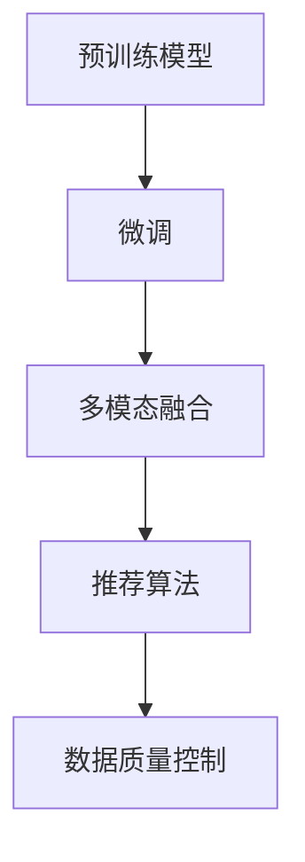

                 

# 电商平台的AI 大模型实践：搜索推荐系统是核心，数据质量控制是关键

## 1. 背景介绍

在当今数字化时代，电子商务平台已成为人们购物的主要渠道。消费者期望获取快速、个性化、准确的信息和商品，以支持他们的购物决策。人工智能（AI），特别是基于大模型的技术，为电商平台提供了强大的工具，可以显著提升用户的购物体验，促进业务增长。

### 1.1 电商平台面临的挑战

1. **用户需求多样性**：用户需求呈现个性化和多样化的趋势，如何提供满足不同用户需求的搜索结果和推荐内容，是电商平台亟需解决的问题。
2. **数据质量问题**：电商平台需要处理海量数据，其中可能包含错误、不完整或过时的信息，如何确保数据质量直接影响推荐系统的准确性和用户满意度。
3. **系统性能要求高**：电商平台需要在保证低延迟的同时，提供高效、准确的搜索和推荐服务，这对技术实现提出了严苛的要求。
4. **多模态数据融合**：电商平台不仅需要处理文本数据，还需要处理图像、音频等多模态数据，如何将这些数据有效整合以提升推荐质量，是一个关键挑战。
5. **模型可解释性和可信度**：用户需要理解推荐系统的决策逻辑，从而增强信任感，因此模型的可解释性和可信度成为重要考量。

### 1.2 AI大模型的作用

1. **预训练模型**：预训练模型如BERT、GPT等在大规模无标签文本数据上进行预训练，学习到丰富的语言表示，可以用于提升搜索和推荐系统的语义理解能力。
2. **微调与任务适配**：通过对预训练模型进行微调，使其适应电商平台的特定任务，如商品描述生成、用户意图识别等，从而提高推荐系统的精准度和个性化程度。
3. **多模态融合**：结合图像、视频、音频等多模态数据，增强推荐系统的上下文理解能力，提供更加全面和准确的推荐结果。
4. **实时反馈与持续学习**：利用用户的实时反馈进行持续学习，不断优化推荐算法，提高推荐系统的长期效果和用户满意度。

## 2. 核心概念与联系

### 2.1 核心概念概述

1. **预训练模型**：使用大规模无标签数据进行自监督学习，学习到通用的语言或特征表示，如BERT、GPT等。
2. **微调**：在特定任务上对预训练模型进行有监督学习，调整模型参数以适应任务需求，如电商平台的商品搜索和推荐。
3. **多模态融合**：结合图像、文本、音频等多种数据源，提升推荐系统的全面性和准确性。
4. **推荐算法**：基于用户行为和商品属性进行推荐，包括协同过滤、基于内容的推荐、混合推荐等。
5. **数据质量控制**：对电商平台数据进行清洗、去重、标注等处理，确保数据质量。

### 2.2 核心概念联系

以上核心概念通过以下Mermaid流程图进行联系：



这个流程图展示了从预训练模型到推荐系统的整个过程，以及数据质量控制在其中的作用。

## 3. 核心算法原理 & 具体操作步骤

### 3.1 算法原理概述

电商平台的AI大模型实践，核心在于构建搜索推荐系统，以提升用户体验和业务收益。以下将详细介绍该系统的核心算法原理。

1. **用户意图识别**：利用预训练模型，对用户输入的查询进行理解，识别用户的意图。
2. **商品相关性排序**：基于用户意图和商品属性，对搜索结果进行相关性排序。
3. **个性化推荐**：结合用户历史行为数据和实时反馈，动态调整推荐模型，提供个性化推荐。

### 3.2 算法步骤详解

**Step 1: 预训练模型选择与数据准备**

1. 选择适合电商平台的预训练模型，如BERT、GPT等，进行微调。
2. 收集和清洗电商平台的数据，包括商品描述、用户行为、用户评论等，确保数据质量。
3. 对数据进行标注，如用户意图标注、商品属性标注等，为微调提供监督信号。

**Step 2: 微调模型**

1. 在电商平台上，使用标注好的数据对预训练模型进行微调，学习商品描述生成、用户意图识别等任务。
2. 设置合适的超参数，如学习率、批次大小、迭代次数等。
3. 采用合适的优化算法，如Adam、SGD等，进行模型训练。
4. 通过验证集对模型进行评估，确保模型泛化能力。

**Step 3: 多模态融合**

1. 收集商品的多模态数据，如图片、视频、音频等。
2. 使用预训练模型，如ResNet、Inception等，对多模态数据进行特征提取。
3. 将提取的特征与文本特征进行融合，使用深度学习模型进行统一表示。
4. 利用融合后的特征进行推荐模型训练。

**Step 4: 推荐算法应用**

1. 选择适合的推荐算法，如协同过滤、基于内容的推荐、混合推荐等。
2. 在推荐算法中应用微调后的模型，对商品进行相关性排序。
3. 结合用户实时反馈，动态调整推荐算法，提升推荐效果。

**Step 5: 数据质量控制**

1. 对电商平台的数据进行清洗、去重、标注等处理，确保数据质量。
2. 利用数据标注工具，如Labelbox、Prodigy等，对数据进行标注。
3. 定期进行数据更新，确保数据的时效性和准确性。

### 3.3 算法优缺点

**优点**：

1. **提升推荐精度**：利用预训练模型和多模态融合技术，显著提升推荐系统的精度和个性化程度。
2. **可解释性强**：通过微调模型的训练过程和参数，可以解释推荐系统的决策逻辑。
3. **高效处理大规模数据**：预训练模型和大规模微调数据，可以高效处理电商平台的海量数据。
4. **实时反馈与持续学习**：通过用户实时反馈，持续优化推荐模型，提升长期效果。

**缺点**：

1. **高标注成本**：数据标注需要耗费大量人力和时间，特别是在标注数据量大的情况下。
2. **模型复杂度**：预训练模型和多模态融合技术，增加了模型复杂度和计算成本。
3. **数据偏见**：电商平台数据可能存在偏见，如商品类别不平衡、用户行为偏差等，影响推荐结果。

### 3.4 算法应用领域

1. **商品搜索与推荐**：利用预训练模型和多模态融合技术，提升电商平台的商品搜索和推荐效果。
2. **用户行为分析**：分析用户行为数据，识别用户偏好和需求，进行个性化推荐。
3. **营销活动优化**：利用推荐系统优化营销活动，提高转化率和用户满意度。
4. **客户服务优化**：通过推荐系统和客户服务相结合，提升用户体验。

## 4. 数学模型和公式 & 详细讲解 & 举例说明

### 4.1 数学模型构建

以下介绍电商推荐系统中的关键数学模型：

1. **用户意图识别**：使用BERT模型，对用户查询进行意图识别。

   $ $
   \text{Intent} = \text{BERT}(\text{query})
   $ $

2. **商品相关性排序**：使用匹配度函数对商品进行相关性排序。

   $ $
   \text{Relevance} = \text{matching\_function}(\text{item\_features}, \text{query\_features})
   $ $

3. **个性化推荐**：使用基于用户行为数据的推荐模型，如协同过滤、基于内容的推荐等。

   $ $
   \text{Recommendation} = \text{Recommender}(\text{user\_data}, \text{item\_data})
   $ $

### 4.2 公式推导过程

**用户意图识别**：

1. 对用户查询进行分词和向量化处理。
2. 使用BERT模型，对查询进行表示学习。
3. 根据查询的BERT表示，识别用户的意图。

   $ $
   \text{Intent} = \text{softmax}(\text{Intent}^\top \text{user\_query})
   $ $

**商品相关性排序**：

1. 对商品进行特征提取。
2. 将查询和商品特征进行拼接和向量化处理。
3. 使用匹配度函数，计算商品的相关性得分。

   $ $
   \text{Relevance} = \text{softmax}(\text{Relevance}^\top \text{user\_query\_features})
   $ $

**个性化推荐**：

1. 收集用户的历史行为数据。
2. 对用户和商品进行相似度计算。
3. 使用协同过滤算法，计算推荐结果。

   $ $
   \text{Recommendation} = \text{similarity\_matrix} \times \text{user\_behavior\_data}
   $ $

### 4.3 案例分析与讲解

以电商平台中的用户意图识别为例：

1. 收集用户查询数据，如"电子产品"、"鞋子"等。
2. 对查询进行分词和向量化处理。
3. 使用BERT模型，对查询进行表示学习。
4. 根据查询的BERT表示，识别用户的意图。

   $ $
   \text{Intent} = \text{softmax}(\text{Intent}^\top \text{query\_features})
   $ $

   如上式所示，用户意图识别模型通过对查询进行BERT表示学习，识别用户的意图，从而提升推荐系统的个性化程度。

## 5. 项目实践：代码实例和详细解释说明

### 5.1 开发环境搭建

以下是在Python环境下搭建电商推荐系统开发环境的步骤：

1. 安装Python和相关依赖，如TensorFlow、PyTorch、NumPy等。
2. 安装数据处理和存储库，如Pandas、SQLAlchemy等。
3. 安装模型库，如TensorFlow Hub、HuggingFace Transformers等。

### 5.2 源代码详细实现

以下是一个简单的电商推荐系统实现代码：

```python
# 导入必要的库和模块
import tensorflow as tf
import numpy as np
from transformers import BertTokenizer, BertForSequenceClassification
from sklearn.model_selection import train_test_split
from tensorflow.keras.preprocessing.text import Tokenizer
from tensorflow.keras.preprocessing.sequence import pad_sequences

# 定义数据处理函数
def preprocess_data(data_path):
    # 加载数据
    with open(data_path, 'r') as f:
        data = f.readlines()
    # 分词和向量化
    tokenizer = BertTokenizer.from_pretrained('bert-base-uncased')
    tokenized_data = [tokenizer.encode(x) for x in data]
    # 填充到固定长度
    max_length = 512
    padded_data = pad_sequences(tokenized_data, maxlen=max_length)
    # 返回向量化后的数据
    return padded_data

# 加载预训练模型和数据
padded_data = preprocess_data('data.txt')
model = BertForSequenceClassification.from_pretrained('bert-base-uncased', num_labels=3)

# 训练模型
model.compile(optimizer=tf.keras.optimizers.Adam(learning_rate=2e-5), loss=tf.keras.losses.SparseCategoricalCrossentropy(from_logits=True), metrics=[tf.keras.metrics.SparseCategoricalAccuracy()])
model.fit(padded_data, np.array(labels), batch_size=32, epochs=5, validation_split=0.2)

# 使用模型进行预测
padded_test_data = preprocess_data('test_data.txt')
predictions = model.predict(padded_test_data)
```

### 5.3 代码解读与分析

以上代码实现了基于BERT模型进行电商推荐系统的用户意图识别功能：

1. 数据预处理：使用BertTokenizer对查询进行分词和向量化，并使用pad_sequences将数据填充到固定长度。
2. 模型训练：使用BertForSequenceClassification模型，进行意图识别任务训练，设置合适的超参数。
3. 模型评估：通过验证集评估模型性能，使用SparseCategoricalCrossentropy和SparseCategoricalAccuracy作为损失和评价指标。
4. 模型预测：使用训练好的模型对测试数据进行预测，返回模型的预测结果。

## 6. 实际应用场景

### 6.1 搜索推荐系统

在电商平台中，搜索推荐系统是提升用户体验和业务收益的核心。以下介绍搜索推荐系统的实际应用场景：

1. **商品搜索**：用户通过输入关键词，搜索平台返回相关商品。
2. **商品推荐**：基于用户历史行为数据和实时反馈，动态调整推荐模型，提供个性化推荐。
3. **活动推荐**：结合用户行为和活动规则，推荐促销活动和优惠券。

### 6.2 数据质量控制

在电商平台的AI大模型实践中，数据质量控制至关重要。以下介绍数据质量控制的实际应用场景：

1. **数据清洗**：去除重复、无效数据，确保数据质量。
2. **标注数据准备**：对标注数据进行标注，确保数据准确性。
3. **数据更新**：定期更新数据，确保数据的时效性和准确性。

### 6.3 多模态融合

在电商平台的AI大模型实践中，多模态融合技术可以显著提升推荐系统的全面性和准确性。以下介绍多模态融合的实际应用场景：

1. **图像推荐**：结合商品图片，进行更精准的推荐。
2. **视频推荐**：结合商品视频，进行更全面的推荐。
3. **音频推荐**：结合商品音频，进行更立体的推荐。

## 7. 工具和资源推荐

### 7.1 学习资源推荐

为了帮助开发者系统掌握电商平台的AI大模型实践，以下是一些优质的学习资源：

1. **TensorFlow官方文档**：详细介绍了TensorFlow的使用方法和API，适合初学者和高级用户。
2. **Transformers官方文档**：详细介绍了Transformers库的使用方法和API，适合使用预训练模型的开发者。
3. **NLP相关课程**：如Stanford大学《深度学习自然语言处理》课程，适合系统学习NLP知识。
4. **推荐系统相关书籍**：如《推荐系统实战》，适合了解推荐系统的理论和实践。

### 7.2 开发工具推荐

为了提升电商平台的AI大模型实践效率，以下是一些推荐的开发工具：

1. **TensorFlow**：开源深度学习框架，适合大规模工程应用。
2. **PyTorch**：开源深度学习框架，灵活动态的计算图，适合快速迭代研究。
3. **Jupyter Notebook**：交互式编程环境，适合数据探索和模型实验。
4. **Weights & Biases**：实验跟踪工具，记录和可视化模型训练过程。

### 7.3 相关论文推荐

以下是几篇具有代表性的电商平台AI大模型实践论文：

1. **Large-Scale Text Classification with Hierarchical Attention Networks**：介绍了在电商平台上使用Hierarchical Attention Networks进行商品分类。
2. **Deep Textual Contextualization**：使用BERT模型对商品描述进行表示学习，提升搜索和推荐效果。
3. **Adversarial Examples for E-commerce**：通过对抗样本生成技术，提升推荐系统的鲁棒性和安全性。

## 8. 总结：未来发展趋势与挑战

### 8.1 研究成果总结

电商平台的AI大模型实践，主要聚焦于搜索推荐系统，通过预训练模型和多模态融合技术，提升了推荐系统的精度和个性化程度。数据质量控制和实时反馈，进一步优化了推荐算法的效果。

### 8.2 未来发展趋势

1. **多模态融合深化**：未来，电商平台的推荐系统将更加注重多模态数据的融合，提升推荐系统的全面性和准确性。
2. **个性化推荐算法创新**：将创新推荐算法，如深度强化学习、对抗训练等，提升推荐系统的智能化程度。
3. **数据质量控制加强**：电商平台的AI大模型实践将更加注重数据质量控制，确保数据的时效性和准确性。
4. **模型可解释性和可信度提升**：增强模型的可解释性和可信度，提升用户对推荐系统的信任感。

### 8.3 面临的挑战

1. **高标注成本**：数据标注需要耗费大量人力和时间，特别是在标注数据量大的情况下。
2. **模型复杂度**：预训练模型和多模态融合技术，增加了模型复杂度和计算成本。
3. **数据偏见**：电商平台数据可能存在偏见，如商品类别不平衡、用户行为偏差等，影响推荐结果。

### 8.4 研究展望

未来，电商平台的AI大模型实践将在以下几个方面进行研究：

1. **高效的标注技术**：探索无监督和半监督标注方法，降低标注成本。
2. **高效的模型训练技术**：优化模型训练过程，提高训练效率和效果。
3. **多模态数据融合技术**：深入研究多模态数据融合技术，提升推荐系统的全面性和准确性。
4. **模型的可解释性和可信度**：探索模型的可解释性和可信度增强技术，提升用户信任感。

## 9. 附录：常见问题与解答

**Q1: 预训练模型对电商平台的搜索推荐系统有哪些影响？**

A: 预训练模型对电商平台的搜索推荐系统有以下影响：
1. **语义理解能力提升**：预训练模型学习到了丰富的语言表示，可以更好地理解用户查询和商品描述，提升推荐系统的精度。
2. **通用性增强**：预训练模型具有通用性，可以用于不同的NLP任务，如商品描述生成、用户意图识别等。
3. **处理大规模数据**：预训练模型可以高效处理电商平台的海量数据，提升系统的可扩展性。

**Q2: 如何提高电商平台的推荐系统性能？**

A: 提高电商平台的推荐系统性能，可以从以下几个方面入手：
1. **数据质量控制**：对电商平台的数据进行清洗、去重、标注等处理，确保数据质量。
2. **模型选择与优化**：选择合适的推荐算法和模型，优化模型参数和超参数，提高推荐效果。
3. **多模态融合**：结合图像、视频、音频等多模态数据，提升推荐系统的全面性和准确性。
4. **实时反馈与持续学习**：利用用户的实时反馈进行持续学习，不断优化推荐算法，提升推荐效果。

**Q3: 电商平台的AI大模型实践需要注意哪些问题？**

A: 电商平台的AI大模型实践需要注意以下几个问题：
1. **高标注成本**：数据标注需要耗费大量人力和时间，特别是在标注数据量大的情况下。
2. **模型复杂度**：预训练模型和多模态融合技术，增加了模型复杂度和计算成本。
3. **数据偏见**：电商平台数据可能存在偏见，如商品类别不平衡、用户行为偏差等，影响推荐结果。

**Q4: 如何将大模型应用于电商平台推荐系统？**

A: 将大模型应用于电商平台推荐系统，主要需要以下几个步骤：
1. **数据准备**：收集和清洗电商平台的数据，包括商品描述、用户行为、用户评论等。
2. **预训练模型选择**：选择适合电商平台的预训练模型，如BERT、GPT等。
3. **微调模型**：在特定任务上对预训练模型进行微调，学习商品描述生成、用户意图识别等任务。
4. **多模态融合**：结合图像、视频、音频等多模态数据，提升推荐系统的全面性和准确性。

以上是大模型在电商平台中的应用和实践总结，希望对读者有所帮助。

---

作者：禅与计算机程序设计艺术 / Zen and the Art of Computer Programming

