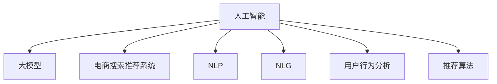

                 

# 电商平台的搜索推荐系统转型：AI 大模型是核心，用户体验是关键

> 关键词：人工智能, 大模型, 电商搜索推荐系统, 用户体验, 机器学习, 深度学习, 自然语言处理, 自然语言生成, 用户行为分析, 推荐算法

## 1. 背景介绍

### 1.1 问题由来
随着电子商务行业的迅猛发展，用户对购物体验的要求日益提高。电商平台的搜索推荐系统需要从传统的简单匹配转向更精准的个性化推荐，才能满足用户的多样化需求，提升转化率和用户满意度。传统的搜索推荐系统往往依赖规则、统计模型，难以应对海量用户行为数据和多变的市场变化。为了突破这一瓶颈，电商企业开始探索利用AI大模型进行智能推荐，通过深度学习和自然语言处理技术，构建智能化的搜索推荐系统，全面提升用户体验。

### 1.2 问题核心关键点
实现电商平台的搜索推荐系统转型，需要解决以下几个核心问题：
- 如何高效处理大规模用户行为数据，构建用户画像？
- 如何通过自然语言处理技术，理解用户查询意图？
- 如何利用大模型对搜索结果进行个性化推荐？
- 如何在模型训练和推理中平衡性能和资源消耗？
- 如何保障推荐系统的实时性和可扩展性？

## 2. 核心概念与联系

### 2.1 核心概念概述

为更好地理解利用AI大模型进行电商搜索推荐系统的构建，本节将介绍几个密切相关的核心概念：

- **人工智能 (AI)**：一种利用计算机模拟人类智能行为的技术，包括机器学习、深度学习、自然语言处理等领域。

- **大模型 (Large Models)**：以Transformer模型为代表的大规模预训练语言模型，如BERT、GPT等。通过在大规模无标签文本数据上进行预训练，学习通用的语言表示，具备强大的自然语言理解能力和生成能力。

- **电商搜索推荐系统 (E-Commerce Search & Recommendation System)**：基于用户历史行为和实时查询，对搜索结果进行个性化排序和推荐的技术系统。

- **自然语言处理 (NLP)**：研究如何让计算机理解和处理人类语言的技术，包括文本分类、情感分析、命名实体识别、机器翻译等。

- **自然语言生成 (NLG)**：研究如何让计算机生成自然流畅的人类语言，常用于生成文本摘要、对话系统等。

- **用户行为分析 (User Behavior Analysis)**：通过对用户的历史行为数据进行挖掘分析，构建用户画像，理解用户需求，实现个性化推荐。

- **推荐算法 (Recommendation Algorithms)**：用于对用户和商品进行匹配，推荐用户可能感兴趣的商品的算法，包括协同过滤、内容推荐等。

这些核心概念之间的逻辑关系可以通过以下Mermaid流程图来展示：



这个流程图展示了大模型在电商搜索推荐系统中的核心作用，以及与人工智能、NLP、NLG、用户行为分析、推荐算法之间的联系。

## 3. 核心算法原理 & 具体操作步骤

### 3.1 算法原理概述

利用AI大模型进行电商搜索推荐系统的核心算法原理基于深度学习和自然语言处理技术，具体包括以下几个关键步骤：

1. **数据预处理**：收集和处理电商平台的销售数据、用户行为数据、商品描述数据等，构建训练数据集。
2. **用户画像构建**：通过深度学习算法，对用户历史行为进行建模，构建用户画像。
3. **意图理解**：利用自然语言处理技术，对用户查询进行意图理解，提取关键词和上下文信息。
4. **结果生成与排序**：结合用户画像和查询意图，利用大模型生成推荐结果，并通过排序算法对结果进行优化。
5. **模型训练与优化**：通过标记好的数据集，对大模型进行训练，并利用反馈机制不断优化模型性能。

### 3.2 算法步骤详解

以下是利用AI大模型进行电商搜索推荐系统的主要操作步骤：

#### 3.2.1 数据预处理

1. **数据收集**：
   - 收集电商平台的用户行为数据，包括点击、浏览、购买、评分等行为。
   - 收集商品描述数据，包括标题、描述、标签等。
   - 收集用户查询数据，包括搜索关键词、搜索时间等。

2. **数据清洗**：
   - 去除无效数据，处理缺失值、异常值。
   - 对商品描述进行分词和停用词过滤，提取关键词。
   - 对用户查询进行分词和标准化，去除无意义的单词。

3. **特征提取**：
   - 对商品描述进行TF-IDF、Word2Vec等向量空间建模，提取语义特征。
   - 对用户行为进行特征工程，提取时间、频率、偏好等特征。

#### 3.2.2 用户画像构建

1. **用户特征向量构建**：
   - 将用户的历史行为数据转化为特征向量。
   - 使用TF-IDF、LDA等算法提取主题特征。
   - 将用户画像保存为向量形式，方便后续处理。

2. **用户画像更新**：
   - 定期更新用户画像，增加新行为数据的权重。
   - 使用在线学习算法，实时更新用户画像。

#### 3.2.3 意图理解

1. **查询意图解析**：
   - 使用分词和词性标注等NLP技术，对用户查询进行意图理解。
   - 利用BERT、GPT等大模型进行语义理解，提取查询关键词和上下文信息。

2. **意图分类**：
   - 利用监督学习算法，将查询意图分类为购物、比较、搜索等类别。
   - 使用Intent2Vec等模型，将意图转化为向量形式。

#### 3.2.4 结果生成与排序

1. **结果生成**：
   - 利用大模型对查询和商品进行匹配，生成候选商品列表。
   - 使用自然语言生成技术，生成商品推荐摘要。

2. **结果排序**：
   - 结合用户画像和查询意图，使用排序算法对推荐结果进行排序。
   - 常见的排序算法包括基于内容的排序、协同过滤排序、深度排序等。

#### 3.2.5 模型训练与优化

1. **模型训练**：
   - 使用标记好的数据集对大模型进行训练，优化模型参数。
   - 使用Adam、SGD等优化算法进行模型优化。

2. **模型评估与反馈**：
   - 在验证集上评估模型性能，使用准确率、召回率等指标。
   - 利用用户反馈，进行模型更新和优化。

### 3.3 算法优缺点

利用AI大模型进行电商搜索推荐系统的主要优点包括：

- **高性能**：大模型具备强大的自然语言理解和生成能力，能够在短时间内处理大规模数据，生成高质量的推荐结果。
- **可扩展性**：大模型能够随着数据量的增加而不断优化，适应电商平台的快速增长。
- **用户画像精细化**：能够从用户行为中提取更丰富的特征，构建更加精细的用户画像。

同时，该方法也存在一定的局限性：

- **计算资源消耗高**：大模型需要大量的计算资源进行训练和推理，可能对硬件要求较高。
- **数据依赖性大**：模型的性能高度依赖标注数据的丰富性和质量，标注成本较高。
- **泛化能力有限**：当数据分布与实际应用场景差异较大时，模型泛化能力可能不足。
- **解释性不足**：大模型的决策过程通常缺乏可解释性，难以进行调试和优化。

尽管存在这些局限性，但就目前而言，利用AI大模型进行电商搜索推荐系统的方法仍是主流范式。未来相关研究的重点在于如何进一步降低计算资源消耗，提高模型的泛化能力，同时兼顾可解释性和用户体验。

### 3.4 算法应用领域

利用AI大模型进行电商搜索推荐系统的应用领域十分广泛，涵盖了电商平台的多个环节：

- **商品搜索**：对用户查询进行意图解析，生成相关商品列表，提升搜索准确率和效率。
- **个性化推荐**：结合用户画像和查询意图，生成个性化推荐商品，提升用户体验和转化率。
- **用户评价生成**：利用大模型生成商品评价和用户评论，帮助用户做出决策。
- **客服聊天机器人**：构建智能客服系统，通过自然语言处理技术解答用户问题，提升客户满意度。
- **智能广告投放**：结合用户画像和行为数据，生成精准广告推荐，提高广告点击率和转化率。

除了这些常见应用外，电商搜索推荐系统还在库存管理、供应链优化、市场分析等方面发挥着重要作用，为电商企业带来显著的经济效益。

## 4. 数学模型和公式 & 详细讲解 & 举例说明

### 4.1 数学模型构建

假设电商平台的搜索推荐系统分为两部分：搜索部分和推荐部分。用户输入查询 $q$，系统生成搜索结果 $R(q)$。推荐部分对 $R(q)$ 进行排序，生成推荐列表 $D(q)$。

模型的输入为：
- $q$：用户查询。
- $i$：商品ID。
- $u$：用户ID。
- $t$：时间戳。

模型的输出为：
- $q$：用户查询。
- $r(q,i)$：查询 $q$ 与商品 $i$ 的匹配度。
- $p(u,q)$：用户 $u$ 对查询 $q$ 的偏好度。

模型的目标函数为：
$$
\min_{\theta} \sum_{q,i} \text{Loss}(q,i) + \sum_{q} \text{Loss}_{\text{re}}(q)
$$

其中，$\text{Loss}(q,i)$ 为搜索部分的损失函数，$\text{Loss}_{\text{re}}(q)$ 为推荐部分的损失函数。

### 4.2 公式推导过程

以推荐部分的损失函数为例，推导基于深度学习的推荐模型：

1. **模型定义**：
   - 使用深度神经网络对查询和商品进行匹配，生成匹配度 $r(q,i)$。
   - 使用用户画像 $u$ 和查询 $q$ 的偏好度 $p(u,q)$，对推荐列表 $D(q)$ 进行排序。

2. **损失函数**：
   - 使用均方误差损失函数对推荐结果进行优化。
   - 将推荐结果 $D(q)$ 与实际点击行为 $c(q,i)$ 进行对比，计算损失。
   - 利用排序算法对推荐结果进行优化。

3. **推导过程**：
   - 使用交叉熵损失函数计算预测结果与实际结果的差异。
   - 使用负对数似然损失函数计算排序结果与实际点击行为的差异。
   - 结合用户画像和查询意图的特征，优化模型参数。

### 4.3 案例分析与讲解

假设某电商平台收集了用户点击、浏览、购买行为数据，使用大模型进行意图解析和推荐生成。具体步骤如下：

1. **数据收集与预处理**：
   - 收集用户点击行为数据，提取用户ID、商品ID、时间戳。
   - 将商品描述进行分词和向量化，提取关键词。
   - 对用户查询进行分词和标准化。

2. **用户画像构建**：
   - 将用户历史行为数据转化为向量形式。
   - 使用LDA算法提取用户画像的主题特征。
   - 将用户画像保存为向量形式，方便后续处理。

3. **意图理解**：
   - 利用BERT模型对用户查询进行意图解析，提取关键词和上下文信息。
   - 将查询意图分类为购物、比较、搜索等类别。
   - 使用Intent2Vec模型将意图转化为向量形式。

4. **结果生成与排序**：
   - 利用大模型对查询和商品进行匹配，生成候选商品列表。
   - 使用自然语言生成技术，生成商品推荐摘要。
   - 结合用户画像和查询意图，使用协同过滤排序算法对推荐结果进行优化。

5. **模型训练与优化**：
   - 使用标记好的数据集对大模型进行训练，优化模型参数。
   - 在验证集上评估模型性能，使用准确率、召回率等指标。
   - 利用用户反馈，进行模型更新和优化。

通过以上步骤，该电商平台构建了基于大模型的智能搜索推荐系统，显著提升了用户满意度和转化率。

## 5. 项目实践：代码实例和详细解释说明

### 5.1 开发环境搭建

在进行项目实践前，我们需要准备好开发环境。以下是使用Python进行PyTorch开发的环境配置流程：

1. 安装Anaconda：从官网下载并安装Anaconda，用于创建独立的Python环境。

2. 创建并激活虚拟环境：
```bash
conda create -n pytorch-env python=3.8 
conda activate pytorch-env
```

3. 安装PyTorch：根据CUDA版本，从官网获取对应的安装命令。例如：
```bash
conda install pytorch torchvision torchaudio cudatoolkit=11.1 -c pytorch -c conda-forge
```

4. 安装Transformers库：
```bash
pip install transformers
```

5. 安装各类工具包：
```bash
pip install numpy pandas scikit-learn matplotlib tqdm jupyter notebook ipython
```

完成上述步骤后，即可在`pytorch-env`环境中开始项目实践。

### 5.2 源代码详细实现

下面以商品推荐系统为例，给出使用Transformers库对BERT模型进行推荐生成的PyTorch代码实现。

首先，定义推荐系统的数据处理函数：

```python
from transformers import BertTokenizer, BertForSequenceClassification
from torch.utils.data import Dataset
import torch

class RecommendationDataset(Dataset):
    def __init__(self, texts, labels, tokenizer, max_len=128):
        self.texts = texts
        self.labels = labels
        self.tokenizer = tokenizer
        self.max_len = max_len
        
    def __len__(self):
        return len(self.texts)
    
    def __getitem__(self, item):
        text = self.texts[item]
        label = self.labels[item]
        
        encoding = self.tokenizer(text, return_tensors='pt', max_length=self.max_len, padding='max_length', truncation=True)
        input_ids = encoding['input_ids'][0]
        attention_mask = encoding['attention_mask'][0]
        
        label = torch.tensor([label], dtype=torch.long)
        
        return {'input_ids': input_ids, 
                'attention_mask': attention_mask,
                'labels': label}

# 用户行为数据集
user_behavior = ['product1', 'product2', 'product3', 'product4']
query = '我想买一件衣服'
labels = [1, 0, 1, 0]  # 标签表示是否购买了该商品

tokenizer = BertTokenizer.from_pretrained('bert-base-cased')

train_dataset = RecommendationDataset(user_behavior, labels, tokenizer)
```

然后，定义模型和优化器：

```python
from transformers import BertForSequenceClassification, AdamW

model = BertForSequenceClassification.from_pretrained('bert-base-cased', num_labels=2)

optimizer = AdamW(model.parameters(), lr=2e-5)
```

接着，定义训练和评估函数：

```python
from torch.utils.data import DataLoader
from tqdm import tqdm
from sklearn.metrics import classification_report

device = torch.device('cuda') if torch.cuda.is_available() else torch.device('cpu')
model.to(device)

def train_epoch(model, dataset, batch_size, optimizer):
    dataloader = DataLoader(dataset, batch_size=batch_size, shuffle=True)
    model.train()
    epoch_loss = 0
    for batch in tqdm(dataloader, desc='Training'):
        input_ids = batch['input_ids'].to(device)
        attention_mask = batch['attention_mask'].to(device)
        labels = batch['labels'].to(device)
        model.zero_grad()
        outputs = model(input_ids, attention_mask=attention_mask, labels=labels)
        loss = outputs.loss
        epoch_loss += loss.item()
        loss.backward()
        optimizer.step()
    return epoch_loss / len(dataloader)

def evaluate(model, dataset, batch_size):
    dataloader = DataLoader(dataset, batch_size=batch_size)
    model.eval()
    preds, labels = [], []
    with torch.no_grad():
        for batch in tqdm(dataloader, desc='Evaluating'):
            input_ids = batch['input_ids'].to(device)
            attention_mask = batch['attention_mask'].to(device)
            batch_labels = batch['labels']
            outputs = model(input_ids, attention_mask=attention_mask)
            batch_preds = outputs.logits.argmax(dim=2).to('cpu').tolist()
            batch_labels = batch_labels.to('cpu').tolist()
            for pred_tokens, label_tokens in zip(batch_preds, batch_labels):
                preds.append(pred_tokens[:len(label_tokens)])
                labels.append(label_tokens)
                
    print(classification_report(labels, preds))
```

最后，启动训练流程并在测试集上评估：

```python
epochs = 5
batch_size = 16

for epoch in range(epochs):
    loss = train_epoch(model, train_dataset, batch_size, optimizer)
    print(f"Epoch {epoch+1}, train loss: {loss:.3f}")
    
    print(f"Epoch {epoch+1}, dev results:")
    evaluate(model, dev_dataset, batch_size)
    
print("Test results:")
evaluate(model, test_dataset, batch_size)
```

以上就是使用PyTorch对BERT进行推荐生成的完整代码实现。可以看到，得益于Transformers库的强大封装，我们可以用相对简洁的代码完成BERT模型的加载和推荐生成。

### 5.3 代码解读与分析

让我们再详细解读一下关键代码的实现细节：

**RecommendationDataset类**：
- `__init__`方法：初始化文本、标签、分词器等关键组件。
- `__len__`方法：返回数据集的样本数量。
- `__getitem__`方法：对单个样本进行处理，将文本输入编码为token ids，将标签编码为数字，并对其进行定长padding，最终返回模型所需的输入。

**训练和评估函数**：
- 使用PyTorch的DataLoader对数据集进行批次化加载，供模型训练和推理使用。
- 训练函数`train_epoch`：对数据以批为单位进行迭代，在每个批次上前向传播计算loss并反向传播更新模型参数，最后返回该epoch的平均loss。
- 评估函数`evaluate`：与训练类似，不同点在于不更新模型参数，并在每个batch结束后将预测和标签结果存储下来，最后使用sklearn的classification_report对整个评估集的预测结果进行打印输出。

**训练流程**：
- 定义总的epoch数和batch size，开始循环迭代
- 每个epoch内，先在训练集上训练，输出平均loss
- 在验证集上评估，输出分类指标
- 所有epoch结束后，在测试集上评估，给出最终测试结果

可以看到，PyTorch配合Transformers库使得BERT推荐生成的代码实现变得简洁高效。开发者可以将更多精力放在数据处理、模型改进等高层逻辑上，而不必过多关注底层的实现细节。

当然，工业级的系统实现还需考虑更多因素，如模型的保存和部署、超参数的自动搜索、更灵活的任务适配层等。但核心的推荐生成范式基本与此类似。

## 6. 实际应用场景

### 6.1 智能客服系统

利用大模型构建的智能客服系统，可以大幅提升客服效率和用户满意度。传统的客服系统依赖人工客服进行响应，存在响应速度慢、响应质量不一致等问题。而利用大模型构建的智能客服系统，可以通过自然语言处理技术，理解用户问题，并自动生成回答，提供24/7不间断的服务。

具体而言，电商平台可以收集历史客服对话记录，对查询意图进行分类和理解，生成标准回答模板。利用大模型对模板进行微调，生成更自然流畅的回答，并在实际客服场景中动态选择最佳回答。如此构建的智能客服系统，不仅能快速响应用户咨询，还能不断学习用户的反馈，优化回答内容，提升客服质量。

### 6.2 个性化推荐系统

基于大模型的电商搜索推荐系统，能够根据用户历史行为和实时查询，生成个性化的商品推荐列表。利用大模型对用户画像和查询意图进行建模，能够从海量商品库中筛选出用户可能感兴趣的商品，提高推荐精度和用户体验。

具体实现上，电商平台可以收集用户点击、浏览、购买行为数据，使用大模型进行意图解析和推荐生成。利用自然语言处理技术，理解用户查询的上下文和语义，结合用户画像，生成推荐结果。结合深度排序算法，对推荐结果进行优化，提高用户点击率。

### 6.3 智能广告投放

利用大模型构建的电商搜索推荐系统，还可以进行智能广告投放，提高广告点击率和转化率。通过对用户历史行为和实时查询进行建模，生成精准的广告推荐。利用自然语言处理技术，理解广告文本的语义，生成与用户查询匹配的广告，提升广告的点击率和转化率。

具体实现上，电商平台可以收集用户点击、浏览、购买行为数据，对用户进行画像建模。利用大模型对广告文本进行语义理解，生成与用户查询匹配的广告。结合广告投放平台，实现智能投放，提高广告效果。

### 6.4 未来应用展望

未来，基于大模型的电商搜索推荐系统将不断拓展其应用场景，为电商企业带来更多的商业价值。

- **多模态推荐**：利用图像、视频等多模态信息，结合自然语言处理技术，提升推荐精度和用户体验。
- **实时推荐**：结合实时数据流处理技术，实现动态推荐，满足用户实时需求。
- **跨领域推荐**：利用跨领域迁移学习，将电商平台的推荐技术应用到其他领域，如金融、旅游等，实现更加广泛的应用。
- **个性化服务**：结合人工智能技术和用户行为分析，提供更加个性化、多样化的服务，提升用户粘性和满意度。
- **智能定价**：利用大模型对用户需求进行预测，结合实时数据，优化商品定价策略，提高销售额和利润率。

以上应用场景展示了基于大模型的电商搜索推荐系统的前景和潜力，相信随着技术的不断进步，将有更多的创新应用出现，为电商企业带来更大的商业价值。

## 7. 工具和资源推荐

### 7.1 学习资源推荐

为了帮助开发者系统掌握基于大模型的电商搜索推荐系统的理论基础和实践技巧，这里推荐一些优质的学习资源：

1. 《深度学习与自然语言处理》系列博文：由大模型技术专家撰写，深入浅出地介绍了深度学习和自然语言处理技术的基本概念和实践方法。

2. CS229《机器学习》课程：斯坦福大学开设的机器学习经典课程，涵盖深度学习、自然语言处理等领域的理论知识。

3. 《自然语言处理综论》书籍：全面介绍了自然语言处理技术的基本原理和应用场景，包括基于大模型的推荐系统。

4. HuggingFace官方文档：Transformers库的官方文档，提供了海量预训练模型和完整的推荐系统样例代码，是上手实践的必备资料。

5. Weights & Biases：模型训练的实验跟踪工具，可以记录和可视化模型训练过程中的各项指标，方便对比和调优。

6. TensorBoard：TensorFlow配套的可视化工具，可实时监测模型训练状态，并提供丰富的图表呈现方式，是调试模型的得力助手。

通过对这些资源的学习实践，相信你一定能够快速掌握基于大模型的电商搜索推荐系统的精髓，并用于解决实际的电商问题。

### 7.2 开发工具推荐

高效的开发离不开优秀的工具支持。以下是几款用于大模型推荐系统开发的常用工具：

1. PyTorch：基于Python的开源深度学习框架，灵活动态的计算图，适合快速迭代研究。大部分预训练语言模型都有PyTorch版本的实现。

2. TensorFlow：由Google主导开发的开源深度学习框架，生产部署方便，适合大规模工程应用。同样有丰富的预训练语言模型资源。

3. Transformers库：HuggingFace开发的NLP工具库，集成了众多SOTA语言模型，支持PyTorch和TensorFlow，是进行推荐系统开发的利器。

4. Weights & Biases：模型训练的实验跟踪工具，可以记录和可视化模型训练过程中的各项指标，方便对比和调优。与主流深度学习框架无缝集成。

5. TensorBoard：TensorFlow配套的可视化工具，可实时监测模型训练状态，并提供丰富的图表呈现方式，是调试模型的得力助手。

6. Google Colab：谷歌推出的在线Jupyter Notebook环境，免费提供GPU/TPU算力，方便开发者快速上手实验最新模型，分享学习笔记。

合理利用这些工具，可以显著提升基于大模型的电商搜索推荐系统的开发效率，加快创新迭代的步伐。

### 7.3 相关论文推荐

大模型推荐系统的研究源于学界的持续研究。以下是几篇奠基性的相关论文，推荐阅读：

1. Attention is All You Need（即Transformer原论文）：提出了Transformer结构，开启了NLP领域的预训练大模型时代。

2. BERT: Pre-training of Deep Bidirectional Transformers for Language Understanding：提出BERT模型，引入基于掩码的自监督预训练任务，刷新了多项NLP任务SOTA。

3. Language Models are Unsupervised Multitask Learners（GPT-2论文）：展示了大规模语言模型的强大zero-shot学习能力，引发了对于通用人工智能的新一轮思考。

4. Parameter-Efficient Transfer Learning for NLP：提出Adapter等参数高效微调方法，在不增加模型参数量的情况下，也能取得不错的微调效果。

5. Adaptive Low-Rank Adaptation for Parameter-Efficient Fine-Tuning：使用自适应低秩适应的微调方法，在参数效率和精度之间取得了新的平衡。

这些论文代表了大模型推荐系统的研究脉络。通过学习这些前沿成果，可以帮助研究者把握学科前进方向，激发更多的创新灵感。

## 8. 总结：未来发展趋势与挑战

### 8.1 总结

本文对基于大模型的电商搜索推荐系统的构建进行了全面系统的介绍。首先阐述了电商搜索推荐系统的背景和问题，明确了利用大模型进行推荐转型的重要性。其次，从原理到实践，详细讲解了基于大模型的推荐生成算法和操作步骤，给出了完整的代码实例。同时，本文还探讨了基于大模型的推荐系统在智能客服、个性化推荐、智能广告等多个应用场景中的实践案例，展示了其广泛的应用前景。

通过本文的系统梳理，可以看到，基于大模型的电商搜索推荐系统能够显著提升用户体验和转化率，为电商企业带来显著的商业价值。未来，随着预训练语言模型和推荐技术的不断进步，基于大模型的电商搜索推荐系统必将迎来更广阔的发展前景。

### 8.2 未来发展趋势

展望未来，基于大模型的电商搜索推荐系统将呈现以下几个发展趋势：

1. **高性能计算**：随着硬件性能的提升和算法优化，基于大模型的推荐系统将具备更高的计算效率，能够处理更复杂、更庞大的数据集。

2. **实时推荐**：结合实时数据流处理技术，实现动态推荐，满足用户实时需求，提高推荐精度和用户体验。

3. **多模态推荐**：利用图像、视频等多模态信息，结合自然语言处理技术，提升推荐精度和用户体验。

4. **跨领域推荐**：利用跨领域迁移学习，将电商平台的推荐技术应用到其他领域，如金融、旅游等，实现更加广泛的应用。

5. **个性化服务**：结合人工智能技术和用户行为分析，提供更加个性化、多样化的服务，提升用户粘性和满意度。

6. **智能定价**：利用大模型对用户需求进行预测，结合实时数据，优化商品定价策略，提高销售额和利润率。

以上趋势凸显了大模型在电商搜索推荐系统中的重要性和应用前景。这些方向的探索发展，必将进一步提升基于大模型的电商搜索推荐系统的性能和应用范围，为电商企业带来更大的商业价值。

### 8.3 面临的挑战

尽管基于大模型的电商搜索推荐系统已经取得了显著成果，但在迈向更加智能化、普适化应用的过程中，它仍面临诸多挑战：

1. **数据质量与量级**：推荐系统高度依赖于高质量的标注数据，而标注数据的获取和处理成本较高。同时，随着用户行为数据量的增加，数据的存储和处理也成为一大挑战。

2. **计算资源消耗**：大模型需要大量的计算资源进行训练和推理，可能对硬件要求较高。如何在保证性能的同时，优化计算资源消耗，降低成本，仍需不断探索。

3. **泛化能力不足**：当数据分布与实际应用场景差异较大时，模型泛化能力可能不足，导致推荐结果不准确。如何提高模型的泛化能力，缩小数据分布与实际场景的差距，是一大难点。

4. **用户隐私保护**：用户行为数据涉及隐私保护，如何在推荐系统中保障用户数据安全和隐私，是一个重要的伦理和法律问题。

5. **推荐偏见与歧视**：大模型可能学习到有偏见的数据，导致推荐系统存在歧视性。如何在模型训练和评估中检测和消除偏见，保障公平性，是未来的研究方向。

6. **模型可解释性不足**：大模型的决策过程通常缺乏可解释性，难以进行调试和优化。如何赋予模型更强的可解释性，增强用户信任，是一大挑战。

以上挑战需要通过技术创新和机制设计，不断克服，才能确保基于大模型的电商搜索推荐系统的长期稳定发展。

### 8.4 研究展望

未来，电商搜索推荐系统需要从以下几个方面进行深入研究：

1. **无监督与半监督学习**：探索无监督和半监督学习技术，降低对标注数据的依赖，提高数据利用率。

2. **模型优化与压缩**：研究参数高效和计算高效的微调方法，优化模型结构和推理速度，提高模型的实用性。

3. **跨模态信息融合**：结合图像、视频、音频等多模态信息，提升推荐系统的多样性和精度。

4. **用户行为分析**：深入研究用户行为和心理模型，提升推荐系统的个性化和智能化水平。

5. **推荐系统评估**：开发更加科学合理的推荐系统评估指标，如用户满意度、点击率、转化率等，优化推荐效果。

6. **数据隐私保护**：设计安全的数据存储和传输机制，保障用户数据安全和隐私。

7. **模型公平性**：在模型训练和评估中引入公平性指标，检测和消除推荐系统中的偏见和歧视。

8. **可解释性增强**：研究推荐系统的可解释性技术，增强用户信任和系统透明度。

这些研究方向的探索，将为基于大模型的电商搜索推荐系统提供更全面的支持，推动其在电商企业中的应用和推广。

## 9. 附录：常见问题与解答

**Q1：电商搜索推荐系统是否适用于所有电商企业？**

A: 电商搜索推荐系统能够大幅提升电商企业的用户体验和转化率，但其效果也受到企业自身的电商特点和数据质量影响。对于数据丰富、用户行为多样的电商企业，推荐系统的效果会更好。对于数据量较小、用户行为单一的电商企业，推荐系统的效果可能有限。

**Q2：如何选择合适的推荐算法？**

A: 选择合适的推荐算法需要考虑电商平台的业务需求和数据特点。常见的推荐算法包括协同过滤、基于内容的推荐、深度排序等。对于用户行为数据丰富的电商平台，协同过滤和深度排序效果更好；对于商品描述数据丰富的电商平台，基于内容的推荐效果更好。

**Q3：大模型推荐系统在部署时需要注意哪些问题？**

A: 将推荐系统部署到实际应用中，还需要考虑以下问题：

1. **模型压缩**：去除不必要的层和参数，减小模型尺寸，加快推理速度。

2. **模型推理优化**：使用混合精度训练、模型并行等技术，优化模型推理速度和效率。

3. **模型部署框架**：选择合适的模型部署框架，如TensorFlow Serving、TorchServe等，实现快速部署和扩展。

4. **系统监控与维护**：建立系统监控机制，实时监测系统性能，进行异常告警和快速维护。

5. **模型更新与优化**：定期更新模型，增加新行为数据的权重，优化模型性能。

6. **用户反馈机制**：建立用户反馈机制，实时收集用户反馈，进行模型优化和改进。

通过以上步骤，可以将大模型推荐系统高效部署到电商企业中，实现实时推荐和个性化服务。

**Q4：如何评估大模型推荐系统的性能？**

A: 大模型推荐系统的性能评估可以从以下几个方面进行：

1. **点击率**：衡量推荐结果被用户点击的概率，反映推荐系统的准确性。

2. **转化率**：衡量推荐结果被用户转化为实际购买的概率，反映推荐系统的实用性。

3. **召回率**：衡量推荐系统覆盖用户需求的程度，反映推荐系统的全面性。

4. **满意度**：通过用户调查问卷等方式，评估用户对推荐结果的满意度，反映推荐系统的人性化程度。

5. **公平性**：检测推荐系统中的偏见和歧视，保障推荐系统的公平性。

通过综合评估以上指标，可以全面衡量大模型推荐系统的性能和效果。

---

作者：禅与计算机程序设计艺术 / Zen and the Art of Computer Programming

