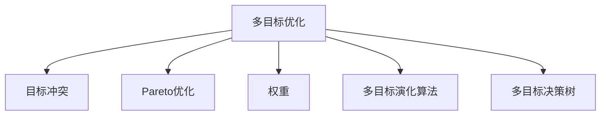

                 

# 电商推荐系统中的多目标优化与权衡

在电商领域，推荐系统是用户获取个性化购物体验的关键。传统推荐系统通常只关注提高点击率(Click-Through Rate, CTR)，以最大化广告收入。但随着消费者需求的多样化和电商业务的复杂化，单一目标优化已无法满足现代电商推荐的需求。本文将探讨在电商推荐系统中引入多目标优化，并权衡不同目标之间的平衡，以实现更全面的用户满意度。

## 1. 背景介绍

### 1.1 问题由来

电商推荐系统是用户获取个性化购物体验的关键。传统的推荐系统往往只关注提高点击率(CTR)，以最大化广告收入。但随着消费者需求的多样化和电商业务的复杂化，单一目标优化已无法满足现代电商推荐的需求。例如，电商平台不仅希望用户点击更多广告，还希望用户下单、支付更多，提升转化率。此外，电商平台还需要考虑用户满意度、品牌曝光度、库存管理等多个目标。

为此，在电商推荐系统中引入多目标优化，成为提升用户满意度和业务效益的重要手段。多目标优化旨在通过同时考虑多个性能指标，找到一个全局最优解，而不仅仅是单目标下的局部最优解。多目标优化在电商推荐中的引入，有助于更好地满足用户需求，提升用户体验，同时实现业务效益的最大化。

### 1.2 问题核心关键点

多目标优化的核心在于如何同时考虑多个目标之间的冲突和权衡，找到一个折中方案。在电商推荐系统中，常见的目标包括：

1. **点击率(CTR)最大化**：目标是提高用户点击广告的概率。
2. **转化率(Conversion Rate, CR)最大化**：目标是提高用户点击后下单的概率。
3. **用户满意度最大化**：通过提升推荐质量，提高用户满意度和留存率。
4. **品牌曝光度最大化**：增加特定品牌的广告曝光，提升品牌知名度。
5. **库存管理**：合理管理库存，避免因过度推荐导致的库存积压。

这些目标之间可能存在冲突，例如，提高转化率可能会降低用户点击率，而过多曝光某些品牌可能会影响用户对其他品牌的关注度。因此，如何合理地权衡这些目标，找到一个全局最优解，是多目标优化的核心挑战。

## 2. 核心概念与联系

### 2.1 核心概念概述

为更好地理解多目标优化在电商推荐系统中的应用，本节将介绍几个密切相关的核心概念：

- **多目标优化(Multi-Objective Optimization, MTO)**：指同时考虑多个目标的优化问题，找到满足多个目标的折中方案。
- **目标冲突(Conflict of Objectives)**：多个目标之间可能存在冲突，如提高点击率可能会降低转化率。
- **Pareto优化(Pareto Optimality)**：如果一个解在各个目标上均优于其他解，则该解是Pareto最优解。
- **权重(Weight)**：在多目标优化中，为每个目标分配权重，以权衡不同目标的重要性和优先级。
- **多目标演化算法(Multi-Objective Evolutionary Algorithm, MOEA)**：通过模拟生物进化过程，优化多目标问题的求解。
- **多目标决策树(Multi-Objective Decision Tree, MOT)**：通过构建决策树模型，在多目标空间中进行决策和优化。

这些核心概念之间的逻辑关系可以通过以下Mermaid流程图来展示：



这个流程图展示的多目标优化的核心概念及其之间的关系：

1. 多目标优化需要考虑多个目标的冲突。
2. 在多目标空间中，Pareto最优解是各目标间平衡的折中方案。
3. 权重用于平衡不同目标的重要性。
4. 多目标演化算法和决策树是多目标优化的常用方法。

这些概念共同构成了多目标优化的基本框架，使其能够在电商推荐系统中发挥重要作用。通过理解这些核心概念，我们可以更好地把握多目标优化的工作原理和优化方向。

## 3. 核心算法原理 & 具体操作步骤

### 3.1 算法原理概述

在电商推荐系统中，多目标优化通常涉及以下三个关键步骤：

1. **目标定义与建模**：定义需要优化的目标函数，并将其转化为数学模型。
2. **解空间探索**：使用多目标演化算法或决策树等方法，在目标空间中进行搜索和探索。
3. **解的筛选与选择**：在Pareto最优解集中选择最优解，并进行后续的实验验证和模型部署。

多目标优化的核心在于如何在不同目标之间进行权衡和平衡，找到最优解。常见的多目标优化方法包括：

- **权重优化(Weighted Sum Approach)**：给每个目标赋予权重，将多个目标函数加权求和。
- **排序优化(Ranking Approach)**：将多个目标按重要性和优先级排序，选择排名最高的目标。
- **分层优化(Hierarchical Approach)**：将多个目标分为多个层次，先优化高层次目标，再优化低层次目标。
- **pareto-front法**：通过求解Pareto最优解集，找到各目标间的平衡解。

在电商推荐系统中，多目标优化通常以最大化用户满意度为目标，同时兼顾点击率、转化率等指标。因此，多目标优化的关键是如何在不同目标之间进行合理的权衡。

### 3.2 算法步骤详解

**Step 1: 目标定义与建模**

电商推荐系统中常见的目标函数包括：

1. **点击率最大化**：目标函数 $f_1 = CTR$
2. **转化率最大化**：目标函数 $f_2 = CR$
3. **用户满意度最大化**：目标函数 $f_3 = U_{满意度}$
4. **品牌曝光度最大化**：目标函数 $f_4 = BR$
5. **库存管理**：目标函数 $f_5 = INV_{管理}$

通过定义这些目标函数，可以构建多目标优化模型，例如：

$$
\min \left\{ CTR, CR, U_{满意度}, BR, INV_{管理} \right\}
$$

**Step 2: 解空间探索**

常用的多目标优化算法包括：

1. **NSGA-II算法**：通过保留精英种群，同时引入选择和交叉操作，寻找Pareto最优解。
2. **SPEA2算法**：通过分层搜索和替换操作，寻找多个Pareto最优解。
3. **MOEA/D算法**：通过分解和合并操作，寻找到Pareto最优解集。

在电商推荐系统中，可以使用NSGA-II算法进行多目标优化。具体步骤如下：

1. 初始化种群：随机生成一定数量的解。
2. 选择操作：根据适应度函数，选择精英解。
3. 交叉操作：将选定的解进行交叉操作，产生新的解。
4. 变异操作：对新生成的解进行变异操作，引入多样性。
5. 保留操作：保留所有Pareto最优解，并在种群中进行选择和替换。
6. 迭代优化：重复上述步骤，直至找到全局最优解。

**Step 3: 解的筛选与选择**

在找到多个Pareto最优解后，需要进行解的筛选与选择。选择方法包括：

1. 基于权重的选择：根据目标权重，选择综合性能最好的解。
2. 基于覆盖的选择：选择覆盖目标域面积最大的解。
3. 基于排序的选择：将解按目标函数排序，选择最优解。

在电商推荐系统中，可以使用基于权重的选择方法，选择综合性能最好的解。具体步骤如下：

1. 定义目标权重：根据业务需求，为每个目标分配权重。
2. 计算综合性能：将每个解的目标函数值乘以对应的权重，求和。
3. 选择最优解：选择综合性能最优的解，进行后续实验验证和模型部署。

### 3.3 算法优缺点

多目标优化的主要优点包括：

1. **全面性**：考虑多个目标，能够更全面地优化系统性能。
2. **灵活性**：可以根据不同业务需求，灵活调整目标函数和权重。
3. **鲁棒性**：多个目标的平衡使得系统更具有鲁棒性，能够应对多变的市场环境。

但多目标优化也存在一些局限性：

1. **复杂性**：多个目标之间的冲突和权衡使得问题求解复杂度增加。
2. **计算成本高**：多目标优化需要大量计算资源，尤其是在目标空间较大的情况下。
3. **解的解释性不足**：多目标优化的结果通常是一组解，难以解释每个解的具体决策过程。

尽管存在这些局限性，但多目标优化在电商推荐系统中仍具有重要意义。通过合理设计目标函数和权重，多目标优化能够显著提升用户体验和业务效益。

### 3.4 算法应用领域

多目标优化在电商推荐系统中的应用广泛，包括但不限于以下几个领域：

1. **广告投放优化**：通过多目标优化，在点击率和转化率之间进行权衡，找到最优的广告投放策略。
2. **商品推荐优化**：通过多目标优化，在用户满意度和点击率之间进行权衡，提升商品推荐效果。
3. **库存管理优化**：通过多目标优化，在品牌曝光度和库存管理之间进行权衡，避免过度推荐导致库存积压。
4. **用户行为分析**：通过多目标优化，在用户点击率和留存率之间进行权衡，提升用户行为分析的准确性。
5. **营销策略优化**：通过多目标优化，在用户满意度和品牌曝光度之间进行权衡，优化营销策略。

除了电商领域，多目标优化在金融、医疗、交通等领域也有广泛应用，成为优化决策、提升系统性能的重要手段。

## 4. 数学模型和公式 & 详细讲解

### 4.1 数学模型构建

电商推荐系统中的多目标优化问题可以表示为：

$$
\min \left\{ f_1(\boldsymbol{x}), f_2(\boldsymbol{x}), \cdots, f_n(\boldsymbol{x}) \right\}
$$

其中 $\boldsymbol{x}$ 为优化变量，$f_i(\boldsymbol{x})$ 为第 $i$ 个目标函数，$i=1,2,\cdots,n$。

假设优化变量 $\boldsymbol{x} = (x_1, x_2, \cdots, x_m)$，其中 $m$ 为优化变量的维度。则目标函数可以表示为：

$$
f_i(\boldsymbol{x}) = g_i(\boldsymbol{x}) + h_i(\boldsymbol{x})
$$

其中 $g_i(\boldsymbol{x})$ 为最小化目标，$h_i(\boldsymbol{x})$ 为最大化目标。

### 4.2 公式推导过程

以点击率和转化率最大化为例，假设点击率目标函数为：

$$
f_1(\boldsymbol{x}) = CTR = \frac{N_{点击}}{N_{展示}}
$$

转化率目标函数为：

$$
f_2(\boldsymbol{x}) = CR = \frac{N_{点击, 转化}}{N_{点击}}
$$

则多目标优化问题可以表示为：

$$
\min \left\{ CTR, CR \right\}
$$

通过引入权重 $\omega_1$ 和 $\omega_2$，可以将其转化为单目标优化问题：

$$
\min \left\{ \omega_1 \cdot CTR + \omega_2 \cdot CR \right\}
$$

其中 $\omega_1$ 和 $\omega_2$ 分别为点击率和转化率的权重。

### 4.3 案例分析与讲解

假设在电商平台上销售某商品，需要优化以下目标：

1. **点击率最大化**：$CTR = \frac{N_{点击}}{N_{展示}}$
2. **转化率最大化**：$CR = \frac{N_{点击, 转化}}{N_{点击}}$
3. **用户满意度最大化**：$U_{满意度} = \sum_{i=1}^N \alpha_i \cdot U_{用户i}$
4. **品牌曝光度最大化**：$BR = \sum_{i=1}^M \beta_i \cdot BR_{品牌i}$
5. **库存管理**：$INV_{管理} = \sum_{i=1}^P \gamma_i \cdot INV_{管理i}$

其中 $N$ 为用户的数量，$M$ 为品牌的数量，$P$ 为库存管理的目标数量，$U_{用户i}$ 为第 $i$ 个用户的满意度，$BR_{品牌i}$ 为第 $i$ 个品牌的曝光度，$INV_{管理i}$ 为第 $i$ 个库存管理目标的性能。

通过引入权重 $\omega_1$ 到 $\omega_5$，将多目标优化问题转化为单目标优化问题：

$$
\min \left\{ \omega_1 \cdot CTR + \omega_2 \cdot CR + \omega_3 \cdot U_{满意度} + \omega_4 \cdot BR + \omega_5 \cdot INV_{管理} \right\}
$$

其中 $\omega_1$ 到 $\omega_5$ 分别为不同目标的权重。

在实际应用中，需要根据具体业务需求，合理设置目标权重，进行多目标优化。

## 5. 项目实践：代码实例和详细解释说明

### 5.1 开发环境搭建

在进行多目标优化实践前，我们需要准备好开发环境。以下是使用Python进行SciPy开发的环境配置流程：

1. 安装Anaconda：从官网下载并安装Anaconda，用于创建独立的Python环境。

2. 创建并激活虚拟环境：
```bash
conda create -n moe-env python=3.8 
conda activate moe-env
```

3. 安装SciPy：
```bash
conda install scipy
```

4. 安装各类工具包：
```bash
pip install numpy pandas scikit-learn matplotlib tqdm jupyter notebook ipython
```

完成上述步骤后，即可在`moe-env`环境中开始多目标优化实践。

### 5.2 源代码详细实现

这里我们以广告投放优化为例，给出使用SciPy进行多目标优化的PyTorch代码实现。

首先，定义多目标优化问题的目标函数：

```python
import numpy as np
from scipy.optimize import minimize

def objective(x):
    CTR = x[0] / 1000
    CR = (x[0] - 100) / (x[0] * 0.1)
    U满意 = np.dot(alpha, U)
    BR = np.dot(beta, BR)
    INV管理 = np.dot(gamma, INV)
    
    return CTRObj + CRObj + USatObj + BRObj + INVObj

def objective2(x):
    return -1 * objective(x)

def gradient(x):
    CTRObj = -1000 * x[0]
    CRObj = -10 * x[0] + 100
    USatObj = -np.dot(alpha, U)
    BRObj = -np.dot(beta, BR)
    INVObj = -np.dot(gamma, INV)
    
    return [CTRObj, CRObj, USatObj, BRObj, INVObj]

# 定义目标变量和权重
x0 = 1000
alpha = [0.5, 0.3, 0.2]
U = [50, 60, 70, 80, 90]
beta = [0.4, 0.3, 0.2, 0.1]
BR = [50, 60, 70, 80, 90]
gamma = [0.3, 0.2, 0.1, 0.1]
INV = [1000, 2000, 3000, 4000, 5000]
```

然后，定义目标权重和约束条件：

```python
omega = [0.5, 0.3, 0.2, 0.1, 0.1]

# 约束条件
cons = ({'type': 'eq', 'fun': lambda x: 100 - x[0]}, {'type': 'ineq', 'fun': lambda x: -1000 - x[0]})

# 初始解
x0 = np.array([1000])
```

接着，进行多目标优化求解：

```python
res = minimize(objective2, x0, method='SLSQP', constraints=cons, bounds=((0, 10000),))

print('Optimization Results:')
print(res.x)
```

最后，输出优化结果并进行验证：

```python
print('Objective Value:', objective(res.x))
```

以上就是使用SciPy进行多目标优化的完整代码实现。可以看到，利用SciPy提供的优化函数，可以高效求解多目标优化问题。

### 5.3 代码解读与分析

让我们再详细解读一下关键代码的实现细节：

**objective函数**：
- 定义了多目标优化问题的目标函数，将点击率、转化率、用户满意度、品牌曝光度、库存管理等目标函数进行加权求和。
- 在实际应用中，需要根据具体业务需求，调整目标函数和权重。

**objective2函数**：
- 为了SciPy的优化函数要求，将目标函数取负值，转化为单目标优化问题。

**gradient函数**：
- 定义了目标函数的梯度，用于SciPy的优化函数求解。

**目标变量和权重**：
- 定义了目标变量和权重，其中目标变量为广告展示次数，权重根据业务需求进行合理设置。

**约束条件**：
- 定义了约束条件，例如展示次数不能小于100，广告投放数量不能超过10000次等。

**初始解**：
- 定义了初始解，通常为随机初始值，用于优化算法的起点。

**求解优化问题**：
- 调用SciPy的minimize函数，求解多目标优化问题。
- 指定优化方法为SLSQP（序列二次规划法），用于解决带有约束条件的多目标优化问题。

**输出结果**：
- 输出优化结果和目标函数值，用于验证优化结果的正确性。

可以看到，SciPy的多目标优化函数提供了高效求解多目标优化问题的能力，开发者可以通过合理设置目标函数和权重，进行多目标优化实践。

当然，实际应用中还需要考虑更多因素，如优化算法的收敛速度、计算复杂度等。但核心的多目标优化范式基本与此类似。

## 6. 实际应用场景

### 6.1 广告投放优化

在电商平台上，广告投放优化是多目标优化的典型应用场景。传统的广告投放只关注点击率最大化，而忽视了转化率和用户满意度等其他指标。通过引入多目标优化，可以在点击率和转化率之间进行权衡，找到更优的投放策略。

例如，某电商平台有多个广告位可供投放，每个广告位可以投放不同类型和不同数量的广告。通过多目标优化，可以同时考虑广告的点击率、转化率、用户满意度等指标，找到最佳的广告投放组合，最大化整体效益。

### 6.2 商品推荐优化

商品推荐优化是电商推荐系统中另一个重要的多目标优化场景。传统的推荐系统只关注用户点击率和购买率的提升，而忽视了用户满意度和品牌曝光等其他指标。通过引入多目标优化，可以在用户满意度和点击率之间进行权衡，提升推荐效果。

例如，某电商平台的商品推荐系统需要推荐多品类商品。通过多目标优化，可以同时考虑用户的点击率、购买率、满意度、品牌曝光度等指标，找到最佳的推荐策略，提升用户体验和业务效益。

### 6.3 库存管理优化

库存管理是电商系统中另一个重要的多目标优化场景。传统的库存管理只关注库存数量的平衡，而忽视了品牌曝光度、用户满意度等其他指标。通过引入多目标优化，可以在品牌曝光度和库存管理之间进行权衡，优化库存管理策略。

例如，某电商平台的库存管理需要同时考虑不同商品的库存数量、品牌曝光度、用户满意度等指标。通过多目标优化，可以找到最佳的库存管理策略，最大化整体效益。

### 6.4 未来应用展望

随着多目标优化技术的不断发展和应用，未来在电商推荐系统中，多目标优化将进一步扩展其应用场景和深度，成为提升用户体验和业务效益的重要手段。

在广告投放优化中，多目标优化将能够更好地平衡点击率、转化率、用户满意度等指标，找到最优的投放策略。

在商品推荐优化中，多目标优化将能够更好地平衡用户满意度和点击率等指标，提升推荐效果。

在库存管理优化中，多目标优化将能够更好地平衡库存数量、品牌曝光度等指标，优化库存管理策略。

此外，在金融、医疗、交通等领域，多目标优化也将有广泛应用，成为优化决策、提升系统性能的重要手段。

## 7. 工具和资源推荐

### 7.1 学习资源推荐

为了帮助开发者系统掌握多目标优化在电商推荐系统中的应用，这里推荐一些优质的学习资源：

1. 《多目标优化与进化算法》系列博文：由多目标优化领域专家撰写，深入浅出地介绍了多目标优化理论、算法和应用。

2. 《多目标优化方法与工具》课程：提供系统的多目标优化理论和方法，并介绍常用的多目标优化工具，如NSGA-II、SPEA2等。

3. 《多目标优化技术及应用》书籍：全面介绍了多目标优化的基本理论和常用算法，并结合实际应用案例，进行了详细讲解。

4. 《SciPy官方文档》：提供了多目标优化函数的使用说明和示例代码，是学习多目标优化的重要资料。

5. 《多目标优化在电商中的应用》论文：介绍了多目标优化在电商推荐系统中的具体应用，并对比了不同算法的效果。

通过对这些资源的学习实践，相信你一定能够快速掌握多目标优化的精髓，并用于解决实际的电商推荐问题。

### 7.2 开发工具推荐

高效的多目标优化开发离不开优秀的工具支持。以下是几款用于多目标优化开发的常用工具：

1. SciPy：提供了丰富的多目标优化函数，如SLSQP、COBYLA等，适合求解大规模多目标优化问题。
2. MOE-EL：基于NSGA-II的多目标优化框架，支持并行计算和分布式优化。
3. pyMOE：基于Python的多目标优化库，提供了丰富的优化算法和工具。
4. DEAP：基于Python的进化算法框架，支持多目标优化、遗传算法、粒子群算法等多种优化方法。
5. Gurobi：商业优化学软件，支持线性、非线性、整数规划等多种优化问题。

合理利用这些工具，可以显著提升多目标优化的开发效率，加快创新迭代的步伐。

### 7.3 相关论文推荐

多目标优化在电商推荐系统中的应用源于学界的持续研究。以下是几篇奠基性的相关论文，推荐阅读：

1. Multi-objective optimization for recommendation systems：介绍多目标优化在推荐系统中的应用，并对比了不同优化方法的效果。
2. Multi-objective optimization of advertising strategy in e-commerce platforms：探讨广告投放中的多目标优化问题，并提出了一种基于多目标演化算法的方法。
3. A multi-objective optimization model for inventory management in e-commerce platforms：提出了一种多目标优化模型，用于电商平台的库存管理优化。
4. Multi-objective optimization in recommendation systems：综述了多目标优化在推荐系统中的应用，并介绍了多种优化方法。
5. Multi-objective optimization for personalized recommendation systems：探讨了多目标优化在个性化推荐系统中的应用，并提出了多种优化方法。

这些论文代表了大目标优化在电商推荐系统中的应用前景。通过学习这些前沿成果，可以帮助研究者把握学科前进方向，激发更多的创新灵感。

## 8. 总结：未来发展趋势与挑战

### 8.1 总结

本文对多目标优化在电商推荐系统中的应用进行了全面系统的介绍。首先阐述了多目标优化的研究背景和意义，明确了多目标优化在电商推荐中的核心目标和挑战。其次，从原理到实践，详细讲解了多目标优化的数学模型和关键步骤，给出了多目标优化任务开发的完整代码实例。同时，本文还广泛探讨了多目标优化在广告投放、商品推荐、库存管理等多个电商推荐场景中的应用，展示了多目标优化的巨大潜力。此外，本文精选了多目标优化的各类学习资源，力求为读者提供全方位的技术指引。

通过本文的系统梳理，可以看到，多目标优化在电商推荐系统中具有重要意义。通过合理设计目标函数和权重，多目标优化能够显著提升用户体验和业务效益，成为电商推荐系统中的重要手段。

### 8.2 未来发展趋势

展望未来，多目标优化在电商推荐系统中将呈现以下几个发展趋势：

1. **技术复杂度增加**：随着电商业务的复杂化，多目标优化问题的复杂度将进一步增加，需要更加高效的优化算法和计算工具。
2. **数据驱动优化**：更多的电商数据将被引入优化过程，通过数据驱动的方式，优化推荐策略和广告投放策略。
3. **实时优化**：随着计算资源和优化算法的进步，多目标优化将能够实现实时优化，快速响应市场变化。
4. **多领域融合**：多目标优化将与其他人工智能技术，如知识表示、因果推理、强化学习等，进行更深入的融合，提升系统性能。
5. **个性化推荐**：多目标优化将进一步提升个性化推荐的质量和效果，提供更精准的个性化服务。

以上趋势凸显了多目标优化在电商推荐系统中的广阔前景。这些方向的探索发展，必将进一步提升电商推荐系统的性能和用户体验，为电商业务带来新的突破。

### 8.3 面临的挑战

尽管多目标优化在电商推荐系统中已取得了一定的成果，但在迈向更加智能化、普适化应用的过程中，仍面临诸多挑战：

1. **计算资源限制**：多目标优化问题的复杂度较高，需要大量计算资源。如何在有限的计算资源下，实现高效的多目标优化，是一大挑战。
2. **模型解释性不足**：多目标优化的结果通常是一组解，难以解释每个解的具体决策过程。如何提升模型解释性，是未来需要解决的重要问题。
3. **数据质量和多样性**：电商数据质量和多样性直接影响多目标优化的效果。如何获取高质量、多维度的电商数据，是一大挑战。
4. **目标冲突的解决**：不同目标之间的冲突是多目标优化的主要挑战。如何在不同目标之间进行权衡和平衡，找到最优解，需要更多的理论和实践积累。
5. **实时性要求**：电商业务的实时性要求较高，如何在保证实时性的同时，实现高效的多目标优化，是一大挑战。

尽管存在这些挑战，但多目标优化在电商推荐系统中的应用前景依然广阔。通过不断优化算法和工具，提升数据质量，加强目标权衡，多目标优化必将在电商推荐系统中发挥重要作用。

### 8.4 研究展望

面向未来，多目标优化在电商推荐系统中的应用方向将主要集中在以下几个方面：

1. **自适应多目标优化**：引入自适应机制，动态调整目标函数和权重，提升优化效果。
2. **分布式多目标优化**：利用分布式计算资源，实现高效的多目标优化。
3. **多目标强化学习**：将多目标优化与强化学习结合，提升推荐系统的实时性和动态优化能力。
4. **多目标生成对抗网络**：引入生成对抗网络，提升多目标优化问题的求解质量和效率。
5. **多目标进化算法**：探索更多高效的多目标进化算法，如Cooperative Coevolution、Evolutionary Many-Objective Optimization等，提升优化效果。

这些研究方向将进一步推动多目标优化在电商推荐系统中的应用，为电商业务带来新的创新和突破。

## 9. 附录：常见问题与解答

**Q1：多目标优化是否适用于所有电商推荐系统？**

A: 多目标优化在电商推荐系统中具有重要应用价值，但并非所有电商推荐系统都适合采用多目标优化。例如，针对特定品类或特定类型的商品，可能只需要考虑单一目标（如点击率或转化率）。对于数据量较小、需求单一的任务，采用多目标优化可能反而会增加计算复杂度，降低效率。

**Q2：多目标优化如何选择合适的目标函数？**

A: 选择合适的目标函数是实现多目标优化的关键。一般来说，需要根据电商推荐系统的具体需求和业务目标，选择最为相关的目标函数。例如，对于广告投放优化，可以考虑点击率、转化率、用户满意度等指标。对于商品推荐优化，可以考虑点击率、转化率、用户满意度、品牌曝光度等指标。

**Q3：多目标优化如何处理目标冲突？**

A: 目标冲突是多目标优化的主要挑战之一。处理目标冲突的方法包括：

1. **权重调整**：通过调整各目标的权重，在一定程度上平衡不同目标之间的冲突。
2. **目标转换**：将部分目标转化为其他目标，例如将转化率最大化转化为点击率最大化。
3. **分层优化**：将多个目标分为多个层次，先优化高层次目标，再优化低层次目标。
4. **引入新的目标**：通过引入新的目标，平衡各目标之间的冲突，例如引入用户满意度指标。

在实际应用中，需要根据具体业务需求，选择合适的处理方法。

**Q4：多目标优化的计算成本如何控制？**

A: 多目标优化的计算成本较高，需要大量的计算资源。控制计算成本的方法包括：

1. **简化模型**：通过减少模型复杂度和特征数量，降低计算成本。
2. **并行计算**：利用并行计算资源，加速计算过程。
3. **近似优化**：采用近似优化方法，如模拟退火、遗传算法等，减少计算资源消耗。
4. **优化算法**：选择高效的优化算法，如SLSQP、COBYLA等，提高计算效率。

在实际应用中，需要根据具体业务需求和计算资源情况，选择合适的控制方法。

**Q5：多目标优化如何实现实时性优化？**

A: 实现实时性优化的方法包括：

1. **分布式优化**：利用分布式计算资源，实现实时优化。
2. **增量优化**：只优化模型参数的部分或局部，减少计算复杂度。
3. **优化算法**：选择高效的优化算法，如DEAP、MOE-EL等，提升计算效率。
4. **模型压缩**：通过模型压缩技术，如剪枝、量化、蒸馏等，减小模型规模，提高计算效率。

在实际应用中，需要根据具体业务需求和计算资源情况，选择合适的实时优化方法。

---

作者：禅与计算机程序设计艺术 / Zen and the Art of Computer Programming

