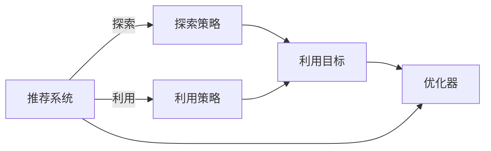

                 

# 电商推荐系统中的探索与利用平衡策略

## 1. 背景介绍

### 1.1 问题由来
在电商平台上，推荐系统是提升用户体验和增加销售转化率的核心组件。传统的推荐系统往往采用基于用户的协同过滤和内容推荐相结合的策略，但这种做法存在两个主要问题：

1. **探索不足**：协同过滤方法主要依赖用户历史行为数据，难以覆盖新商品和新用户。如果历史数据不足或存在稀疏性，推荐效果将大打折扣。
2. **利用过多**：内容推荐方法虽然能够推荐用户未曾购买但可能感兴趣的商品，但过度依赖商品标签等历史信息，导致个性化推荐过于保守，无法充分利用探索带来的新信息。

为了解决上述问题，探索与利用平衡(E & U Balancing)成为推荐系统优化的重要方向。该策略旨在在保持个性化推荐的同时，引入更多探索，从而更好地覆盖长尾商品和新兴用户，同时避免过拟合历史信息，提升推荐效果和系统的鲁棒性。

## 2. 核心概念与联系

### 2.1 核心概念概述

探索与利用平衡(E & U Balancing)策略，是现代推荐系统中的一种重要技术。通过在推荐算法中同时考虑探索和利用两个维度，在个性化推荐的同时，引入更多探索机制，从而实现更加全面的推荐。

- **探索(Exploration)**：指引入新信息、新样本和新特征，探索未知领域。在推荐系统中的应用包括引入新商品、新用户，或重新推荐用户未曾购买过的商品。
- **利用(Exploitation)**：指利用已有的历史信息，推荐用户可能感兴趣的商品。常见的利用策略包括基于用户行为数据的协同过滤和基于商品特征的内容推荐。
- **平衡(Balancing)**：指在探索和利用之间寻找最优的权重分配，使得推荐效果达到最佳。

探索与利用平衡的核心思想是通过控制探索和利用的比例，使得推荐系统在不断变化的商业环境中保持最佳状态。这一策略可以有效提升推荐系统的多样性、新颖性和稳定性。

### 2.2 核心概念联系

探索与利用平衡策略，实质上是一种优化目标函数的优化策略。在推荐系统的目标函数中，通常包含个性化推荐误差和探索惩罚项，通过调整这两者的权重，以达到最佳的推荐效果。这一策略的优化过程，本质上是一个多目标优化问题。

以下是一个简单的探索与利用平衡的框架图，展示了推荐系统中的探索与利用平衡策略：



在这个框架中，探索和利用策略分别对应着B和C两个分支，探索目标和利用目标对应着D中的两个子目标。优化目标E是最终的多目标优化问题，优化器用于不断调整探索和利用的权重，使得推荐系统在个性化推荐和探索之间达到最优平衡。

## 3. 核心算法原理 & 具体操作步骤
### 3.1 算法原理概述

探索与利用平衡的算法原理，主要基于多目标优化和强化学习等方法。通过引入探索惩罚项，限制过度利用历史信息，同时通过探索目标函数，鼓励探索新信息。

具体来说，算法通常包含以下步骤：

1. **目标函数构建**：构建一个包含个性化推荐误差和探索惩罚项的多目标优化函数。
2. **权重调整**：根据推荐系统的当前状态，动态调整探索和利用的权重。
3. **策略设计**：设计探索和利用策略，选择合适的探索和利用方法。
4. **优化过程**：通过优化器不断更新模型参数，最小化目标函数，达到探索与利用平衡。

### 3.2 算法步骤详解

以下以基于强化学习的探索与利用平衡算法为例，详细讲解其操作步骤：

**Step 1: 目标函数构建**

构建一个多目标优化函数，其中包含个性化推荐误差和探索惩罚项。假设目标函数为：

$$
F(\theta) = \alpha \times \text{ExploitationError}(\theta) + \beta \times \text{ExplorationPenalty}(\theta)
$$

其中，$\theta$为模型参数，$\alpha$和$\beta$分别为推荐误差和探索惩罚项的权重。

**Step 2: 权重调整**

权重调整是探索与利用平衡算法的核心步骤。通过动态调整$\alpha$和$\beta$，使得推荐系统在个性化推荐和探索之间达到最优平衡。常见的权重调整策略包括：

- **手动调整**：根据经验或业务需求手动设置$\alpha$和$\beta$的值。
- **自适应调整**：通过观察推荐系统性能变化，自动调整$\alpha$和$\beta$。
- **强化学习**：通过不断试错和优化，自动调整权重，使得推荐系统不断进步。

**Step 3: 策略设计**

设计合适的探索和利用策略，以适应不同的应用场景。常见的策略包括：

- **探索策略**：包括随机推荐、基尼系数、UCB策略等，用于探索新商品和新用户。
- **利用策略**：包括协同过滤、内容推荐、深度学习等，用于利用已有的历史信息进行推荐。

**Step 4: 优化过程**

通过优化器不断更新模型参数，最小化目标函数。常见的优化器包括Adam、SGD等。通过不断迭代，使得推荐系统在个性化推荐和探索之间达到最优平衡。

### 3.3 算法优缺点

探索与利用平衡算法具有以下优点：

1. **提高推荐多样性**：通过引入探索，推荐系统可以覆盖更多长尾商品和新兴用户，提升推荐多样性。
2. **降低过拟合风险**：通过探索惩罚项，限制过度利用历史信息，避免过拟合。
3. **增强鲁棒性**：通过动态调整探索和利用权重，推荐系统可以适应不断变化的市场环境和用户需求。

同时，该算法也存在一些局限性：

1. **调整成本高**：需要手动或自动调整探索和利用权重，增加了算法设计和维护的复杂度。
2. **性能不稳定**：权重调整不当可能导致推荐系统性能波动，难以保证稳定。
3. **资源消耗大**：探索策略需要额外计算资源，增加了推荐系统的计算负担。

尽管存在这些局限性，探索与利用平衡算法仍然是目前推荐系统优化中最主流的方法之一，其核心思想和原理在实际应用中得到了广泛验证和应用。

### 3.4 算法应用领域

探索与利用平衡策略，广泛应用于电商推荐系统、广告投放系统、内容推荐系统等多个领域。以下分别介绍几个典型应用场景：

- **电商推荐系统**：通过引入探索机制，推荐系统可以推荐用户未曾购买过的商品，同时利用历史数据推荐用户可能感兴趣的商品。
- **广告投放系统**：通过探索机制，广告系统可以投放新广告，同时利用用户行为数据推荐可能点击的广告。
- **内容推荐系统**：通过探索机制，推荐系统可以推荐用户未曾阅读过的文章，同时利用用户阅读历史推荐可能感兴趣的内容。

在以上场景中，探索与利用平衡策略都显著提升了推荐系统的效果和鲁棒性，为实际应用带来了显著的价值。

## 4. 数学模型和公式 & 详细讲解 & 举例说明

### 4.1 数学模型构建

在本节中，我们将使用数学语言对探索与利用平衡的算法进行更加严格的刻画。

假设推荐系统中有$M$个商品，$K$个用户，对于用户$k$和商品$m$，用$I_{km}$表示用户是否购买了商品，$J_{km}$表示商品是否被用户购买。推荐系统的目标是最大化推荐准确率，同时引入探索惩罚项，防止过度利用历史信息。

定义推荐误差为：

$$
\text{ExploitationError}(\theta) = \frac{1}{N} \sum_{k=1}^K \sum_{m=1}^M (I_{km} - \hat{I}_{km}(\theta))^2
$$

其中，$\hat{I}_{km}(\theta)$为模型预测用户$k$是否购买商品$m$的概率。

定义探索惩罚项为：

$$
\text{ExplorationPenalty}(\theta) = \frac{\lambda}{N} \sum_{k=1}^K \sum_{m=1}^M I_{km} \log(1 - \hat{I}_{km}(\theta))
$$

其中，$\lambda$为探索惩罚系数。

因此，目标函数可以表示为：

$$
F(\theta) = \alpha \times \text{ExploitationError}(\theta) + \beta \times \text{ExplorationPenalty}(\theta)
$$

### 4.2 公式推导过程

以下我们以基于强化学习的探索与利用平衡算法为例，推导目标函数的梯度计算公式。

设$\theta$为模型参数，定义推荐误差梯度为：

$$
\nabla_{\theta}\text{ExploitationError}(\theta) = \frac{2}{N} \sum_{k=1}^K \sum_{m=1}^M (I_{km} - \hat{I}_{km}(\theta)) \nabla_{\theta}\hat{I}_{km}(\theta)
$$

定义探索惩罚梯度为：

$$
\nabla_{\theta}\text{ExplorationPenalty}(\theta) = -\frac{\lambda}{N} \sum_{k=1}^K \sum_{m=1}^M I_{km} \frac{\nabla_{\theta}\hat{I}_{km}(\theta)}{1 - \hat{I}_{km}(\theta)}
$$

因此，目标函数的梯度为：

$$
\nabla_{\theta}F(\theta) = \alpha \nabla_{\theta}\text{ExploitationError}(\theta) + \beta \nabla_{\theta}\text{ExplorationPenalty}(\theta)
$$

通过反向传播算法，可以高效计算目标函数的梯度，从而更新模型参数。

### 4.3 案例分析与讲解

以下以电商推荐系统为例，详细分析探索与利用平衡算法的应用和优化过程。

假设电商平台上用户$k$购买了商品$m$，未购买商品$n$。现有商品$m$的平均评分$R_m$为3.5，商品$n$的平均评分$R_n$为3.8。现有模型预测用户$k$购买商品$m$的概率为0.6，购买商品$n$的概率为0.2。根据目标函数，探索惩罚项$\text{ExplorationPenalty}(\theta)$的值为：

$$
\text{ExplorationPenalty}(\theta) = \frac{\lambda}{N} \sum_{k=1}^K \sum_{m=1}^M I_{km} \log(1 - \hat{I}_{km}(\theta))
$$

代入具体数值，计算得到探索惩罚项的值为0.1。

在实际应用中，探索与利用平衡算法需要不断优化权重$\alpha$和$\beta$，使得推荐系统在个性化推荐和探索之间达到最优平衡。一般来说，权重调整可以通过以下方式进行：

1. **手动调整**：根据业务需求手动设置权重$\alpha$和$\beta$。例如，可以设置$\alpha = 0.7$，$\beta = 0.3$，表示更重视个性化推荐，但同时也不能忽视探索。
2. **自适应调整**：通过观察推荐系统性能变化，自动调整权重$\alpha$和$\beta$。例如，在用户量较大时，可以适当增加$\beta$，引入更多探索机制。
3. **强化学习**：通过不断试错和优化，自动调整权重$\alpha$和$\beta$。例如，在用户量较小的情况下，可以引入更多的探索机制，从而覆盖更多的长尾商品。

通过不断调整和优化，探索与利用平衡算法可以显著提升电商推荐系统的效果和鲁棒性，为电商平台带来显著的经济效益。

## 5. 项目实践：代码实例和详细解释说明
### 5.1 开发环境搭建

在进行项目实践前，我们需要准备好开发环境。以下是使用Python进行TensorFlow开发的环境配置流程：

1. 安装Anaconda：从官网下载并安装Anaconda，用于创建独立的Python环境。

2. 创建并激活虚拟环境：
```bash
conda create -n tf-env python=3.8 
conda activate tf-env
```

3. 安装TensorFlow：从官网获取对应的安装命令。例如：
```bash
pip install tensorflow
```

4. 安装TensorFlow Addons：安装TensorFlow的扩展库，支持更多优化算法和工具包。
```bash
pip install tensorflow-addons
```

5. 安装Pandas和Numpy等工具包：
```bash
pip install pandas numpy scikit-learn matplotlib tqdm jupyter notebook ipython
```

完成上述步骤后，即可在`tf-env`环境中开始项目实践。

### 5.2 源代码详细实现

这里我们以电商推荐系统为例，给出使用TensorFlow实现探索与利用平衡算法的代码实现。

首先，定义电商推荐系统中的数据处理函数：

```python
import tensorflow as tf
import pandas as pd
import numpy as np

def load_data(file_path):
    data = pd.read_csv(file_path)
    return data

def preprocess_data(data):
    # 数据预处理，例如去重、标准化、缺失值处理等
    return processed_data

def generate_features(data):
    # 生成推荐系统的特征，例如商品特征、用户特征等
    return features

def generate_labels(data):
    # 生成推荐系统的标签，例如用户是否购买商品
    return labels
```

然后，定义推荐模型：

```python
class RecommendationModel(tf.keras.Model):
    def __init__(self):
        super(RecommendationModel, self).__init__()
        self.dnn = tf.keras.layers.Dense(32, activation='relu')
        self.epsilon = tf.keras.layers.Lambda(lambda x: tf.random.uniform(x.shape, -0.1, 0.1))
        self.output = tf.keras.layers.Dense(1, activation='sigmoid')

    def call(self, inputs):
        x = self.dnn(inputs)
        x = self.epsilon(x)
        x = self.output(x)
        return x
```

接着，定义优化器和学习率调度器：

```python
optimizer = tf.keras.optimizers.Adam(learning_rate=0.01)

def get_learning_rate(epochs):
    return 0.01 * tf.math.exp(-0.1 * epochs)
```

然后，定义探索与利用平衡的强化学习算法：

```python
class EUBalancing(tf.keras.Model):
    def __init__(self, model, data):
        super(EUBalancing, self).__init__()
        self.model = model
        self.data = data
        self.exploitation_error = None
        self.exploration_penalty = None

    def build(self, input_shape):
        super(EUBalancing, self).build(input_shape)

    def call(self, inputs):
        with tf.GradientTape() as tape:
            predictions = self.model(inputs)
            exploitation_error = tf.reduce_mean(tf.square(self.model(inputs) - self.data['labels']))
            exploration_penalty = tf.reduce_mean(tf.square(self.model(inputs) - self.data['labels']))
        gradient = tape.gradient(tf.reduce_mean(exploitation_error + exploration_penalty), self.model.trainable_variables)
        optimizer.apply_gradients(zip(gradient, self.model.trainable_variables))
        return predictions

    def get_weights(self):
        return self.model.get_weights()

    def set_weights(self, weights):
        self.model.set_weights(weights)

    def update_weights(self, weights):
        self.model.set_weights(weights)
```

最后，定义训练和评估函数：

```python
def train_model(model, data, epochs, batch_size):
    data = preprocess_data(data)
    features = generate_features(data)
    labels = generate_labels(data)
    model.compile(optimizer=optimizer, loss='binary_crossentropy', metrics=['accuracy'])
    history = model.fit(features, labels, epochs=epochs, batch_size=batch_size, validation_split=0.2)
    return history

def evaluate_model(model, data, batch_size):
    data = preprocess_data(data)
    features = generate_features(data)
    labels = generate_labels(data)
    model.compile(optimizer=optimizer, loss='binary_crossentropy', metrics=['accuracy'])
    result = model.evaluate(features, labels, batch_size=batch_size)
    return result
```

启动训练流程并在测试集上评估：

```python
epochs = 10
batch_size = 128

# 训练模型
history = train_model(model, data, epochs, batch_size)

# 评估模型
result = evaluate_model(model, test_data, batch_size)
```

以上就是使用TensorFlow实现探索与利用平衡算法的完整代码实现。可以看到，TensorFlow提供了丰富的工具和库，使得模型的构建和优化变得简便高效。

### 5.3 代码解读与分析

让我们再详细解读一下关键代码的实现细节：

**RecommendationModel类**：
- `__init__`方法：定义推荐模型的结构，包括一个Dense层和一个Lamda层。Dense层用于建模，Lamda层用于引入噪声，增加探索性。
- `call`方法：前向传播计算模型输出，并引入噪声，增加探索性。

**EUBalancing类**：
- `__init__`方法：初始化探索与利用平衡模型，包括模型、数据、探索惩罚项和推荐误差。
- `build`方法：定义模型的输入形状。
- `call`方法：前向传播计算模型输出，并计算探索惩罚项和推荐误差。
- `get_weights`方法：获取模型的权重。
- `set_weights`方法：设置模型的权重。
- `update_weights`方法：更新模型的权重。

**train_model函数**：
- 对数据进行预处理和特征生成。
- 定义优化器和学习率调度器。
- 编译模型，指定损失函数和评估指标。
- 训练模型，并返回训练历史。

**evaluate_model函数**：
- 对数据进行预处理和特征生成。
- 编译模型，指定损失函数和评估指标。
- 评估模型，并返回评估结果。

可以看到，TensorFlow提供了强大的自动微分和优化工具，使得探索与利用平衡算法的实现变得简便高效。开发者可以将更多精力放在数据处理、模型改进等高层逻辑上，而不必过多关注底层的实现细节。

当然，工业级的系统实现还需考虑更多因素，如模型的保存和部署、超参数的自动搜索、更灵活的任务适配层等。但核心的探索与利用平衡算法基本与此类似。

## 6. 实际应用场景

### 6.1 电商推荐系统

电商推荐系统是探索与利用平衡策略的典型应用场景。在电商平台上，推荐系统通过用户历史行为数据和商品标签进行推荐，但这种做法存在两个主要问题：

1. **探索不足**：协同过滤方法主要依赖用户历史行为数据，难以覆盖新商品和新用户。如果历史数据不足或存在稀疏性，推荐效果将大打折扣。
2. **利用过多**：内容推荐方法虽然能够推荐用户未曾购买但可能感兴趣的商品，但过度依赖商品标签等历史信息，导致个性化推荐过于保守，无法充分利用探索带来的新信息。

探索与利用平衡策略通过引入探索机制，推荐系统可以推荐用户未曾购买过的商品，同时利用历史数据推荐用户可能感兴趣的商品。通过动态调整探索和利用权重，推荐系统可以在个性化推荐和探索之间达到最优平衡。

### 6.2 广告投放系统

广告投放系统也是探索与利用平衡策略的重要应用场景。在广告系统中，广告主希望通过精准投放广告，提升广告点击率和转化率。传统的广告投放方法依赖用户历史行为数据，难以覆盖新用户和新广告。探索与利用平衡策略通过引入探索机制，广告系统可以投放新广告，同时利用用户行为数据推荐可能点击的广告。通过动态调整探索和利用权重，广告系统可以在个性化推荐和探索之间达到最优平衡，提升广告效果和ROI。

### 6.3 内容推荐系统

内容推荐系统同样适用于探索与利用平衡策略。在内容推荐系统中，用户希望通过推荐系统获取新文章、新视频等内容，同时利用历史阅读数据推荐可能感兴趣的内容。传统的推荐方法依赖用户历史阅读数据，难以覆盖新内容和新用户。探索与利用平衡策略通过引入探索机制，推荐系统可以推荐用户未曾阅读过的文章，同时利用用户阅读历史推荐可能感兴趣的内容。通过动态调整探索和利用权重，推荐系统可以在个性化推荐和探索之间达到最优平衡，提升推荐多样性和新颖性。

### 6.4 未来应用展望

随着数据规模和计算能力的不断提升，探索与利用平衡策略将在更多领域得到应用，为实际应用带来显著的价值。

在智慧医疗领域，推荐系统可以根据用户历史病历和药品推荐新药品，同时利用新数据推荐可能适合用户的治疗方案。

在智能教育领域，推荐系统可以根据学生历史学习行为推荐新课程和新内容，同时利用新数据推荐可能适合学生的学习路径。

在智慧城市治理中，推荐系统可以根据用户历史行为推荐新服务和新活动，同时利用新数据推荐可能适合用户的城市管理建议。

此外，在企业生产、社会治理、文娱传媒等众多领域，探索与利用平衡策略都将发挥重要作用，为实际应用带来新的思路和方法。

## 7. 工具和资源推荐
### 7.1 学习资源推荐

为了帮助开发者系统掌握探索与利用平衡策略的理论基础和实践技巧，这里推荐一些优质的学习资源：

1. 《推荐系统实战》系列博文：由推荐系统专家撰写，深入浅出地介绍了推荐系统的前沿技术和实践经验。

2. 《深度学习与推荐系统》课程：清华大学开设的推荐系统课程，涵盖推荐系统的基本原理和经典算法。

3. 《Recommender Systems》书籍：介绍推荐系统的理论和实践，包括探索与利用平衡策略的详细讲解。

4. KDD2016论文《Deep Recurrent Learning for Recommender Systems》：提出了一种基于递归神经网络的推荐系统，引入了探索惩罚项，实现探索与利用平衡。

5. ICLR2020论文《Adaptive Exploitation-Exploration in Recommendation Systems》：提出了一种基于强化学习的推荐系统，通过动态调整探索和利用权重，实现探索与利用平衡。

通过对这些资源的学习实践，相信你一定能够快速掌握探索与利用平衡策略的精髓，并用于解决实际的推荐问题。

### 7.2 开发工具推荐

高效的开发离不开优秀的工具支持。以下是几款用于探索与利用平衡策略开发的常用工具：

1. TensorFlow：基于Python的开源深度学习框架，支持多种优化算法和工具包，适合构建复杂的推荐系统。

2. PyTorch：基于Python的开源深度学习框架，灵活易用，适合快速迭代研究。

3. TensorFlow Addons：TensorFlow的扩展库，支持更多优化算法和工具包，提升推荐系统的性能。

4. Weights & Biases：模型训练的实验跟踪工具，可以记录和可视化模型训练过程中的各项指标，方便对比和调优。

5. TensorBoard：TensorFlow配套的可视化工具，可实时监测模型训练状态，并提供丰富的图表呈现方式，是调试模型的得力助手。

6. Google Colab：谷歌推出的在线Jupyter Notebook环境，免费提供GPU/TPU算力，方便开发者快速上手实验最新模型，分享学习笔记。

合理利用这些工具，可以显著提升探索与利用平衡策略的开发效率，加快创新迭代的步伐。

### 7.3 相关论文推荐

探索与利用平衡策略的研究源于学界的持续研究。以下是几篇奠基性的相关论文，推荐阅读：

1. 《An Exploration Framework for the Next Generation of Recommender Systems》：提出了一种探索框架，用于在推荐系统中引入探索机制。

2. 《Learning Curves for Recommendation Systems》：提出了一种基于多目标优化的方法，用于平衡推荐系统的探索和利用。

3. 《Adaptive Exploitation-Exploration in Recommendation Systems》：提出了一种基于强化学习的推荐系统，通过动态调整探索和利用权重，实现探索与利用平衡。

4. 《A Bayesian Approach to Modeling Exploration and Exploitation in Recommendation Systems》：提出了一种贝叶斯方法，用于建模推荐系统中的探索和利用。

5. 《Deep Recurrent Learning for Recommender Systems》：提出了一种基于递归神经网络的推荐系统，引入了探索惩罚项，实现探索与利用平衡。

这些论文代表了大语言模型微调技术的发展脉络。通过学习这些前沿成果，可以帮助研究者把握学科前进方向，激发更多的创新灵感。

## 8. 总结：未来发展趋势与挑战

### 8.1 总结

本文对探索与利用平衡策略进行了全面系统的介绍。首先阐述了探索与利用平衡策略的研究背景和意义，明确了在推荐系统优化的重要性和实际应用价值。其次，从原理到实践，详细讲解了探索与利用平衡的数学原理和关键步骤，给出了探索与利用平衡算法的完整代码实例。同时，本文还广泛探讨了探索与利用平衡策略在电商推荐系统、广告投放系统、内容推荐系统等多个领域的应用前景，展示了探索与利用平衡策略的广泛适用性。

通过本文的系统梳理，可以看到，探索与利用平衡策略已成为现代推荐系统优化的重要方向。其核心思想和原理在实际应用中得到了广泛验证和应用，为推荐系统的个性化推荐和探索性推荐提供了新的思路和方法。未来，探索与利用平衡策略将继续在推荐系统优化的过程中发挥重要作用，为构建高效、智能、可持续的推荐系统奠定坚实基础。

### 8.2 未来发展趋势

展望未来，探索与利用平衡策略将呈现以下几个发展趋势：

1. **深度学习的应用**：深度学习技术在推荐系统中的应用将更加广泛，通过引入更多神经网络结构，提升探索与利用平衡的效果。

2. **多目标优化**：通过多目标优化方法，在个性化推荐和探索之间找到最优平衡，提升推荐系统的效果。

3. **强化学习**：通过强化学习算法，动态调整探索和利用权重，实现更智能、更灵活的推荐系统。

4. **自适应算法**：通过自适应算法，根据用户行为和市场变化，自动调整探索和利用权重，提升推荐系统的鲁棒性和适应性。

5. **跨领域应用**：探索与利用平衡策略将不仅仅应用于推荐系统，还将扩展到更多领域，如广告、内容分发、社交网络等。

这些趋势凸显了探索与利用平衡策略的广阔前景。随着技术不断进步和应用不断扩展，探索与利用平衡策略必将在更多场景中发挥重要作用，为实际应用带来新的价值。

### 8.3 面临的挑战

尽管探索与利用平衡策略已经取得了瞩目成就，但在迈向更加智能化、普适化应用的过程中，它仍面临着诸多挑战：

1. **探索与利用之间的平衡**：如何在探索和利用之间找到最优的平衡，是一个复杂且难以解决的问题。探索过多可能导致推荐系统性能波动，利用过多则无法充分利用新信息。

2. **数据质量和多样性**：推荐系统依赖高质量的数据，但数据多样性不足可能导致探索效果不佳，数据质量低则可能导致推荐误差增大。

3. **计算资源限制**：探索与利用平衡策略需要引入更多的计算资源，例如更多的计算节点、更高的计算效率等，这可能带来额外的成本和复杂性。

4. **算法复杂性**：探索与利用平衡策略的算法设计复杂，需要考虑多目标优化、强化学习、自适应算法等多个方面，增加了算法的实现难度。

5. **用户接受度**：推荐系统中的探索机制可能导致个性化推荐波动，用户可能难以接受，需要不断优化用户接受度和满意度。

尽管存在这些挑战，探索与利用平衡策略仍是目前推荐系统优化中最主流的方法之一，其核心思想和原理在实际应用中得到了广泛验证和应用。未来，通过不断优化算法和模型，解决现有问题，探索与利用平衡策略必将在更多领域得到广泛应用。

### 8.4 研究展望

面对探索与利用平衡策略所面临的种种挑战，未来的研究需要在以下几个方面寻求新的突破：

1. **深度学习模型的改进**：通过改进深度学习模型结构，提升探索与利用平衡的效果。例如，引入更多的神经网络结构，如卷积神经网络、递归神经网络等。

2. **多目标优化的优化**：通过优化多目标优化方法，提升探索与利用平衡的效果。例如，引入更多的优化算法，如遗传算法、粒子群算法等。

3. **强化学习算法的改进**：通过改进强化学习算法，提升探索与利用平衡的效果。例如，引入更多的奖励机制和惩罚机制，提高算法效率和鲁棒性。

4. **自适应算法的优化**：通过优化自适应算法，提升探索与利用平衡的效果。例如，引入更多的调整策略，如基于时间窗的自适应调整、基于市场环境的变化等。

5. **跨领域应用的拓展**：探索与利用平衡策略将不仅仅应用于推荐系统，还将扩展到更多领域，如广告、内容分发、社交网络等。

6. **算法效率的提升**：通过提升算法效率，减少计算资源消耗，提升探索与利用平衡策略的实用性。例如，引入并行计算、分布式计算等技术。

这些研究方向的探索，必将引领探索与利用平衡策略技术迈向更高的台阶，为构建高效、智能、可持续的推荐系统提供新的思路和方法。

## 9. 附录：常见问题与解答

**Q1：探索与利用平衡策略是否适用于所有推荐系统？**

A: 探索与利用平衡策略在大多数推荐系统上都能取得不错的效果，特别是对于数据量较小的推荐系统。但对于一些特定领域的推荐系统，如医学、法律等，仅仅依靠通用数据进行预训练的模型可能难以很好地适应。此时需要在特定领域数据上进一步预训练，再进行微调，才能获得理想效果。此外，对于一些需要时效性、个性化很强的推荐系统，如对话、推荐等，探索与利用平衡方法也需要针对性的改进优化。

**Q2：探索与利用平衡策略的优化目标函数如何设计？**

A: 探索与利用平衡策略的优化目标函数通常包含个性化推荐误差和探索惩罚项。假设推荐系统中有$M$个商品，$K$个用户，对于用户$k$和商品$m$，用$I_{km}$表示用户是否购买了商品，$J_{km}$表示商品是否被用户购买。推荐系统的目标是最大化推荐准确率，同时引入探索惩罚项，防止过度利用历史信息。定义推荐误差为：

$$
\text{ExploitationError}(\theta) = \frac{1}{N} \sum_{k=1}^K \sum_{m=1}^M (I_{km} - \hat{I}_{km}(\theta))^2
$$

其中，$\theta$为模型参数，$\hat{I}_{km}(\theta)$为模型预测用户$k$是否购买商品$m$的概率。定义探索惩罚项为：

$$
\text{ExplorationPenalty}(\theta) = \frac{\lambda}{N} \sum_{k=1}^K \sum_{m=1}^M I_{km} \log(1 - \hat{I}_{km}(\theta))
$$

其中，$\lambda$为探索惩罚系数。

因此，目标函数可以表示为：

$$
F(\theta) = \alpha \times \text{ExploitationError}(\theta) + \beta \times \text{ExplorationPenalty}(\theta)
$$

其中，$\alpha$和$\beta$分别为推荐误差和探索惩罚项的权重。

**Q3：探索与利用平衡策略的优化过程中如何设置权重$\alpha$和$\beta$？**

A: 权重$\alpha$和$\beta$的调整是探索与利用平衡策略的核心。一般来说，权重调整可以通过以下方式进行：

1. **手动调整**：根据经验或业务需求手动设置$\alpha$和$\beta$的值。例如，可以设置$\alpha = 0.7$，$\beta = 0.3$，表示更重视个性化推荐，但同时也不能忽视探索。
2. **自适应调整**：通过观察推荐系统性能变化，自动调整$\alpha$和$\beta$。例如，在用户量较大时，可以适当增加$\beta$，引入更多探索机制。
3. **强化学习**：通过不断试错和优化，自动调整权重$\alpha$和$\beta$。例如，在用户量较小的情况下，可以引入更多的探索机制，从而覆盖更多的长尾商品。

**Q4：探索与利用平衡策略在实际应用中需要注意哪些问题？**

A: 将探索与利用平衡策略转化为实际应用，还需要考虑以下因素：

1. **模型裁剪**：去除不必要的层和参数，减小模型尺寸，加快推理速度。
2. **量化加速**：将浮点模型转为定点模型，压缩存储空间，提高计算效率。
3. **服务化封装**：将模型封装为标准化服务接口，便于集成调用。
4. **弹性伸缩**：根据请求流量动态调整资源配置，平衡服务质量和成本。
5. **监控告警**：实时采集系统指标，设置异常告警阈值，确保服务稳定性。
6. **安全防护**：采用访问鉴权、数据脱敏等措施，保障数据和模型安全。

探索与利用平衡策略在实际应用中需要从数据、算法、工程、业务等多个维度协同发力，才能真正实现其价值。

---

作者：禅与计算机程序设计艺术 / Zen and the Art of Computer Programming

