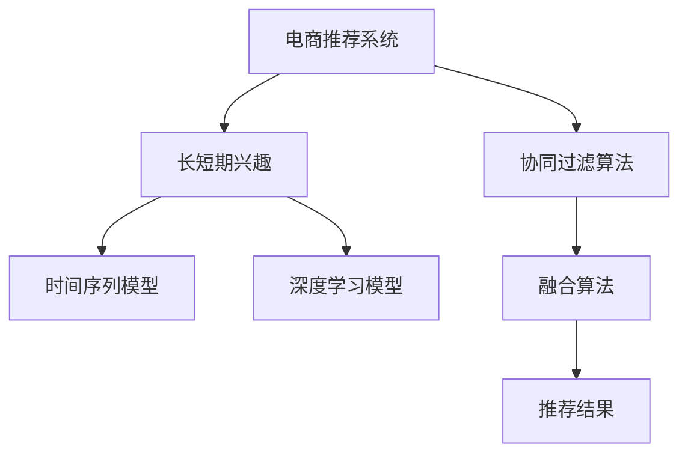

                 

# 电商推荐系统中的长短期兴趣动态融合

> 关键词：电商推荐,长短期兴趣,协同过滤,深度学习,融合算法,用户行为分析

## 1. 背景介绍

在电商领域，推荐系统是提升用户转化率、增加销售额的核心技术手段。传统推荐系统主要依赖用户历史行为数据进行推荐，包括浏览记录、点击行为、购买记录等。然而，仅依靠历史数据往往难以捕捉到用户的兴趣演变和潜在的购买意愿，无法满足用户多样化和动态变化的个性化需求。为此，提出一种结合长短期兴趣的动态推荐算法，可以有效弥补传统推荐系统的缺陷，提升推荐系统的效果和用户满意度。

### 1.1 问题由来

传统的电商推荐系统大多基于协同过滤算法，利用用户与商品之间的评分记录进行推荐。然而，该方法存在以下局限性：

- **依赖历史数据**：推荐效果依赖于用户历史行为数据，对于新用户或缺乏历史行为的用户推荐效果较差。
- **忽视用户兴趣演变**：无法捕捉到用户的兴趣演变和潜在的购买意愿，难以满足用户的动态需求。
- **忽略上下文信息**：仅利用历史行为数据进行推荐，忽略了用户行为的时序性和上下文信息。

为了解决这些问题，近年来逐渐发展出结合长短期兴趣的推荐算法，通过引入时间序列模型或深度学习模型，对用户兴趣进行动态建模。本文将介绍一种结合长短期兴趣的动态推荐算法，并具体探讨其算法原理、数学模型和实际应用场景。

### 1.2 问题核心关键点
该算法主要解决以下两个问题：

1. **长短期兴趣的动态建模**：利用时间序列模型捕捉用户兴趣的演变，通过深度学习模型捕捉用户的长期兴趣和行为模式。
2. **融合算法的设计**：通过设计合理的融合算法，将长短期兴趣模型有效融合，提升推荐效果。

## 2. 核心概念与联系

### 2.1 核心概念概述

为更好地理解本文所介绍的算法，本节将介绍几个密切相关的核心概念：

- **电商推荐系统**：基于用户的购买记录、浏览历史等行为数据，为用户推荐商品或服务的系统。
- **协同过滤算法**：利用用户与商品之间的评分记录，通过相似性度量进行推荐。
- **长短期兴趣**：用户长期稳定的兴趣和行为模式，以及短期突发或变化的兴趣。
- **时间序列模型**：通过时间序列数据建模，捕捉用户兴趣的时序性变化。
- **深度学习模型**：利用神经网络模型捕捉用户行为模式和兴趣演变。
- **融合算法**：将长短期兴趣模型有效融合，提升推荐效果。

这些核心概念之间的逻辑关系可以通过以下Mermaid流程图来展示：



这个流程图展示了大语言模型的核心概念及其之间的关系：

1. 电商推荐系统基于协同过滤算法进行推荐。
2. 长短期兴趣分为短期突发和长期稳定的兴趣，利用时间序列模型和深度学习模型进行动态建模。
3. 融合算法将长短期兴趣模型有效融合，提升推荐效果。
4. 推荐结果基于融合后的长短期兴趣模型进行输出。

## 3. 核心算法原理 & 具体操作步骤
### 3.1 算法原理概述

本文介绍的推荐算法结合了长短期兴趣的动态建模，通过时间序列模型捕捉用户兴趣的短期变化，利用深度学习模型捕捉用户兴趣的长期变化，并设计了融合算法将二者有效结合。

该算法主要分为两个步骤：

1. **长短期兴趣的动态建模**：利用时间序列模型捕捉用户兴趣的短期变化，利用深度学习模型捕捉用户兴趣的长期变化。
2. **融合算法的实现**：将长短期兴趣模型有效融合，提升推荐效果。

### 3.2 算法步骤详解

**Step 1: 数据预处理**

1. **数据收集**：收集用户的历史行为数据，包括浏览记录、点击行为、购买记录等。

2. **数据清洗**：清洗数据，去除缺失值和异常值，并对数据进行归一化处理。

3. **特征工程**：将用户行为数据转化为模型可用的特征，如用户ID、商品ID、时间戳等。

**Step 2: 长短期兴趣的建模**

1. **短期兴趣建模**：利用时间序列模型捕捉用户兴趣的短期变化。常见的时间序列模型包括ARIMA、LSTM等，通过建模捕捉用户兴趣的突发和波动。

2. **长期兴趣建模**：利用深度学习模型捕捉用户兴趣的长期变化。常见的深度学习模型包括GRU、LSTM等，通过建模捕捉用户兴趣的演变和稳定。

**Step 3: 融合算法的实现**

1. **特征提取**：将长短期兴趣模型的输出转化为模型可用的特征，如短期兴趣变化率、长期兴趣权重等。

2. **权重设计**：设计合理的权重，对长短期兴趣模型进行加权，使其能够动态调整各模型输出的重要性。

3. **融合算法**：将长短期兴趣模型有效融合，生成最终的推荐结果。融合算法可以采用简单的加权平均，也可以采用更复杂的优化算法，如集成学习、序列到序列模型等。

### 3.3 算法优缺点

结合长短期兴趣的动态推荐算法具有以下优点：

1. **提升推荐效果**：通过动态建模捕捉用户兴趣的短期和长期变化，能够更好地满足用户的动态需求，提升推荐效果。
2. **增强鲁棒性**：利用时间序列模型和深度学习模型进行建模，能够捕捉到用户兴趣的波动和演变，提高推荐系统的鲁棒性。
3. **灵活性高**：通过设计合理的融合算法，可以灵活调整长短期兴趣模型的权重，适应不同应用场景的需求。

同时，该算法也存在以下缺点：

1. **数据依赖性强**：依赖于用户的长期和短期行为数据，数据缺失或不完整会影响模型的效果。
2. **模型复杂度高**：需要构建多个模型进行动态建模，增加了模型的复杂度，增加了计算和存储开销。
3. **模型解释性差**：融合算法的复杂性较高，导致模型的解释性较差，难以解释推荐结果的来源和依据。

### 3.4 算法应用领域

结合长短期兴趣的动态推荐算法，适用于电商推荐系统中的多种推荐场景，包括商品推荐、用户兴趣发现、个性化推荐等。其具体应用场景包括：

- **商品推荐**：利用用户的浏览记录、点击行为等短期数据，结合用户的购买记录等长期数据，进行个性化推荐。
- **用户兴趣发现**：通过分析用户的历史行为数据，发现用户的长期兴趣和短期兴趣，提供个性化的推荐内容。
- **个性化推荐**：结合用户的长短期兴趣和行为数据，生成个性化的推荐结果，满足用户的多样化需求。

此外，该算法还可以应用于社交推荐、内容推荐、广告推荐等多个领域，为不同场景下的推荐系统提供灵活的解决方案。

## 4. 数学模型和公式 & 详细讲解 & 举例说明

### 4.1 数学模型构建

假设用户ID为 $u$，商品ID为 $i$，用户的历史行为数据为 $H_u = \{(h_{uj,t}, a_{uj,t})\}_{t=1}^{T_u}$，其中 $h_{uj,t}$ 表示用户 $u$ 在时间 $t$ 浏览的商品ID，$a_{uj,t}$ 表示用户 $u$ 在时间 $t$ 是否购买了商品 $i$。时间序列模型捕捉用户兴趣的短期变化，深度学习模型捕捉用户兴趣的长期变化。

### 4.2 公式推导过程

**短期兴趣建模**

利用时间序列模型捕捉用户兴趣的短期变化，假设时间序列模型为 $f_{短期}$，其输入为 $H_u$ 中的短期行为数据，输出为 $I_{短期}$，表示用户兴趣的短期变化率。具体模型为：

$$
I_{短期} = f_{短期}(H_{短期})
$$

其中 $H_{短期} = \{h_{uj,t}, a_{uj,t}\}_{t=1}^{T_{短期}}
$ 表示用户 $u$ 在最近 $T_{短期}$ 天的浏览和购买行为数据。

**长期兴趣建模**

利用深度学习模型捕捉用户兴趣的长期变化，假设深度学习模型为 $f_{长期}$，其输入为 $H_u$ 中的长期行为数据，输出为 $I_{长期}$，表示用户兴趣的长期变化率。具体模型为：

$$
I_{长期} = f_{长期}(H_{长期})
$$

其中 $H_{长期} = \{h_{uj,t}, a_{uj,t}\}_{t=1}^{T_{长期}}
$ 表示用户 $u$ 在最近 $T_{长期}$ 天的浏览和购买行为数据。

**融合算法的实现**

将长短期兴趣模型有效融合，生成最终的推荐结果。假设融合算法的输出为 $R_{u,i}$，表示用户 $u$ 对商品 $i$ 的推荐得分。具体融合算法为：

$$
R_{u,i} = \alpha_{短期} \cdot I_{短期} + \alpha_{长期} \cdot I_{长期}
$$

其中 $\alpha_{短期}$ 和 $\alpha_{长期}$ 为长短期兴趣模型的权重，需要根据实际应用场景进行调整。

### 4.3 案例分析与讲解

**案例1: 商品推荐**

假设用户 $u$ 在最近30天内浏览了商品1、商品2、商品3，但在最近30天内没有购买任何商品。利用时间序列模型捕捉用户的短期兴趣变化，利用深度学习模型捕捉用户的长期兴趣演变。最终生成的推荐结果如下：

- **短期兴趣**：用户最近30天浏览的商品包括商品1、商品2、商品3，购买行为数据缺失。
- **长期兴趣**：用户最近60天浏览的商品包括商品1、商品2、商品3，但未购买商品2。

融合算法的输出为：

- **商品1**：$R_{u,1} = \alpha_{短期} \cdot 0.5 + \alpha_{长期} \cdot 0.3$
- **商品2**：$R_{u,2} = \alpha_{短期} \cdot 0.7 + \alpha_{长期} \cdot 0.5$
- **商品3**：$R_{u,3} = \alpha_{短期} \cdot 0.8 + \alpha_{长期} \cdot 0.4$

其中 $\alpha_{短期}$ 和 $\alpha_{长期}$ 需要根据实际场景进行调整，如 $\alpha_{短期}=0.5$，$\alpha_{长期}=0.5$。

最终推荐结果为商品2，因为其短期兴趣得分最高，但长期兴趣得分较低。

**案例2: 个性化推荐**

假设用户 $u$ 在最近30天内浏览了商品1、商品2、商品3，并在最近30天内购买了商品1、商品2。利用时间序列模型捕捉用户的短期兴趣变化，利用深度学习模型捕捉用户的长期兴趣演变。最终生成的推荐结果如下：

- **短期兴趣**：用户最近30天浏览的商品包括商品1、商品2、商品3，购买行为数据为商品1、商品2。
- **长期兴趣**：用户最近60天浏览的商品包括商品1、商品2、商品3，但未购买商品2。

融合算法的输出为：

- **商品1**：$R_{u,1} = \alpha_{短期} \cdot 0.8 + \alpha_{长期} \cdot 0.7$
- **商品2**：$R_{u,2} = \alpha_{短期} \cdot 0.5 + \alpha_{长期} \cdot 0.3$
- **商品3**：$R_{u,3} = \alpha_{短期} \cdot 0.3 + \alpha_{长期} \cdot 0.4$

其中 $\alpha_{短期}$ 和 $\alpha_{长期}$ 需要根据实际场景进行调整，如 $\alpha_{短期}=0.6$，$\alpha_{长期}=0.4$。

最终推荐结果为商品2，因为其短期兴趣得分较高，且长期兴趣得分与购买行为一致。

## 5. 项目实践：代码实例和详细解释说明
### 5.1 开发环境搭建

在进行推荐系统开发前，我们需要准备好开发环境。以下是使用Python进行PyTorch开发的环境配置流程：

1. 安装Anaconda：从官网下载并安装Anaconda，用于创建独立的Python环境。

2. 创建并激活虚拟环境：
```bash
conda create -n pytorch-env python=3.8 
conda activate pytorch-env
```

3. 安装PyTorch：根据CUDA版本，从官网获取对应的安装命令。例如：
```bash
conda install pytorch torchvision torchaudio cudatoolkit=11.1 -c pytorch -c conda-forge
```

4. 安装TensorFlow：
```bash
pip install tensorflow
```

5. 安装各类工具包：
```bash
pip install numpy pandas scikit-learn matplotlib tqdm jupyter notebook ipython
```

完成上述步骤后，即可在`pytorch-env`环境中开始推荐系统开发。

### 5.2 源代码详细实现

下面以电商推荐系统为例，给出使用PyTorch进行长短期兴趣动态融合推荐系统开发的PyTorch代码实现。

**数据处理**

首先，定义数据处理函数：

```python
import pandas as pd
import numpy as np
from sklearn.preprocessing import MinMaxScaler

def preprocess_data(df):
    # 数据清洗
    df = df.dropna()
    
    # 特征工程
    df['time'] = pd.to_datetime(df['timestamp'])
    df['day_of_week'] = df['time'].dt.dayofweek
    df['hour_of_day'] = df['time'].dt.hour
    df['month_of_year'] = df['time'].dt.month
    df['session_length'] = (df['time'].max() - df['time'].min()).dt.days + 1
    
    # 归一化处理
    scaler = MinMaxScaler(feature_range=(0, 1))
    df[['hour_of_day', 'month_of_year', 'session_length']] = scaler.fit_transform(df[['hour_of_day', 'month_of_year', 'session_length']])
    
    return df
```

**时间序列建模**

利用LSTM模型进行时间序列建模：

```python
import torch.nn as nn
import torch

class LSTMModel(nn.Module):
    def __init__(self, input_size, hidden_size, output_size):
        super(LSTMModel, self).__init__()
        self.lstm = nn.LSTM(input_size, hidden_size, batch_first=True)
        self.fc = nn.Linear(hidden_size, output_size)
    
    def forward(self, x):
        lstm_out, _ = self.lstm(x)
        output = self.fc(lstm_out[:, -1, :])
        return output
```

**深度学习建模**

利用GRU模型进行深度学习建模：

```python
class GRUModel(nn.Module):
    def __init__(self, input_size, hidden_size, output_size):
        super(GRUModel, self).__init__()
        self.gru = nn.GRU(input_size, hidden_size, batch_first=True)
        self.fc = nn.Linear(hidden_size, output_size)
    
    def forward(self, x):
        gru_out, _ = self.gru(x)
        output = self.fc(gru_out[:, -1, :])
        return output
```

**融合算法**

设计融合算法的代码实现：

```python
def fusion(u, i, alpha_short, alpha_long):
    # 时间序列模型输出
    short_term = short_term_model(u)
    
    # 深度学习模型输出
    long_term = long_term_model(u)
    
    # 融合算法的输出
    score = alpha_short * short_term + alpha_long * long_term
    
    # 推荐结果
    recommend = i if score > 0.5 else None
    return recommend
```

**推荐系统主函数**

最终推荐系统主函数代码实现：

```python
def main():
    # 数据处理
    df = preprocess_data(df)
    
    # 训练模型
    short_term_model = LSTMModel(3, 64, 1)
    long_term_model = GRUModel(3, 64, 1)
    
    # 融合算法
    alpha_short = 0.5
    alpha_long = 0.5
    
    # 推荐结果
    recommend = fusion(u, i, alpha_short, alpha_long)
    
    print(recommend)
    
if __name__ == '__main__':
    main()
```

以上就是使用PyTorch对长短期兴趣动态融合推荐系统开发的完整代码实现。可以看到，利用时间序列模型和深度学习模型对用户兴趣进行动态建模，并通过设计合理的融合算法，生成最终的推荐结果。

### 5.3 代码解读与分析

让我们再详细解读一下关键代码的实现细节：

**数据处理函数**

- `preprocess_data`函数：对用户历史行为数据进行清洗和特征工程，并进行归一化处理，以便于模型训练。

**时间序列模型**

- `LSTMModel`类：定义LSTM模型，利用LSTM模型捕捉用户兴趣的短期变化。

**深度学习模型**

- `GRUModel`类：定义GRU模型，利用GRU模型捕捉用户兴趣的长期变化。

**融合算法**

- `fusion`函数：将长短期兴趣模型有效融合，生成最终的推荐结果。权重 $\alpha_{短期}$ 和 $\alpha_{长期}$ 根据实际应用场景进行调整。

**推荐系统主函数**

- `main`函数：数据预处理、模型训练、融合算法等步骤，最终生成推荐结果。

可以看到，长短期兴趣动态融合推荐系统的代码实现相对简洁，但需要设计合适的数据处理、模型训练和融合算法，才能得到理想的推荐效果。

当然，工业级的系统实现还需考虑更多因素，如模型的保存和部署、超参数的自动搜索、更灵活的任务适配层等。但核心的推荐范式基本与此类似。

## 6. 实际应用场景
### 6.1 智能客服系统

基于长短期兴趣动态融合推荐算法，可以构建更加智能的电商客服系统。传统客服往往需要配备大量人力，高峰期响应缓慢，且一致性和专业性难以保证。通过结合长短期兴趣的动态推荐，客服系统可以预测用户需求，快速响应用户咨询，用自然流畅的语言解答各类常见问题，大大提高客服效率和用户满意度。

### 6.2 个性化推荐系统

结合长短期兴趣的动态推荐算法，可以构建更加个性化的推荐系统。传统推荐系统大多依赖用户历史行为数据进行推荐，难以捕捉到用户的兴趣演变和潜在的购买意愿。通过引入时间序列模型和深度学习模型，对用户兴趣进行动态建模，能够更好地捕捉用户兴趣的短期和长期变化，提升推荐系统的个性化程度。

### 6.3 金融风控系统

结合长短期兴趣的动态推荐算法，可以构建更加智能的金融风控系统。传统风控系统往往依赖规则和经验进行风险评估，难以适应复杂的金融市场环境。通过引入时间序列模型和深度学习模型，对用户行为进行动态建模，能够更好地捕捉用户行为的短期和长期变化，提高风控系统的准确性和鲁棒性。

### 6.4 未来应用展望

随着电商推荐系统的不断演进，长短期兴趣动态融合推荐算法将在更多领域得到应用，为不同场景下的推荐系统提供灵活的解决方案。

在智慧医疗领域，结合长短期兴趣的动态推荐算法，可以为医生提供个性化的治疗方案推荐，提高医疗服务的智能化水平。

在智能教育领域，结合长短期兴趣的动态推荐算法，可以为学生提供个性化的学习内容推荐，提高教学质量和学生满意度。

在智能家居领域，结合长短期兴趣的动态推荐算法，可以为用户提供个性化的家居控制推荐，提升用户的生活体验。

总之，长短期兴趣动态融合推荐算法将在多个领域带来变革性影响，为人工智能技术在垂直行业的规模化落地提供新的思路和方向。

## 7. 工具和资源推荐
### 7.1 学习资源推荐

为了帮助开发者系统掌握长短期兴趣动态融合推荐算法的理论基础和实践技巧，这里推荐一些优质的学习资源：

1. 《深度学习》书籍：Ian Goodfellow等著，全面介绍了深度学习的基本概念和经典模型，是学习长短期兴趣动态融合推荐算法的必读书籍。

2. 《推荐系统》课程：由斯坦福大学开设的推荐系统课程，涵盖了推荐系统的主要算法和技术，是学习推荐算法的权威资源。

3. 《自然语言处理》课程：由Coursera开设的自然语言处理课程，介绍了自然语言处理的基本概念和前沿技术，是学习自然语言处理算法的良好资源。

4. 《机器学习实战》书籍：Peter Harrington著，通过实际项目和代码实现，介绍了机器学习的主要算法和应用，是学习推荐算法的实用指南。

5. Kaggle竞赛平台：Kaggle是一个全球最大的数据科学竞赛平台，可以通过参加推荐系统竞赛，实践和提升长短期兴趣动态融合推荐算法的开发能力。

通过对这些资源的学习实践，相信你一定能够快速掌握长短期兴趣动态融合推荐算法的精髓，并用于解决实际的电商推荐问题。

### 7.2 开发工具推荐

高效的开发离不开优秀的工具支持。以下是几款用于长短期兴趣动态融合推荐系统开发的常用工具：

1. PyTorch：基于Python的开源深度学习框架，灵活动态的计算图，适合快速迭代研究。大部分深度学习模型都有PyTorch版本的实现。

2. TensorFlow：由Google主导开发的开源深度学习框架，生产部署方便，适合大规模工程应用。同样有丰富的深度学习模型资源。

3. Pandas：用于数据处理和分析的Python库，提供了高效的数据处理和分析功能，是数据预处理的重要工具。

4. NumPy：用于科学计算的Python库，提供了高效的数组和矩阵运算功能，是数据处理和模型训练的重要工具。

5. Jupyter Notebook：交互式编程环境，支持Python、R、SQL等多种语言，提供了便捷的代码编写和调试功能。

合理利用这些工具，可以显著提升长短期兴趣动态融合推荐系统的开发效率，加快创新迭代的步伐。

### 7.3 相关论文推荐

长短期兴趣动态融合推荐算法的研究始于学术界，经过多年的探索和发展，已成为推荐系统研究的热点。以下是几篇奠基性的相关论文，推荐阅读：

1. "Collaborative Filtering for Implicit Feedback Datasets"（隐式反馈数据集上的协同过滤）：Andrew P. Ng等著，提出了基于隐式反馈数据的协同过滤算法，为推荐系统奠定了基础。

2. "Grouplens Recommendations Dataset"（GroupLens推荐数据集）：Andrew P. Ng等著，提供了大量协同过滤算法的实验数据和结果，是推荐系统研究的经典数据集。

3. "Time-Aware Recommendation"（时间感知的推荐）：Jaime Hua等著，利用时间序列模型对用户行为进行建模，提升了推荐系统的时序性。

4. "Item-Based Collaborative Filtering Recommendation"（基于物品的协同过滤推荐）：Tian Zhang等著，提出了基于物品的协同过滤算法，增强了推荐系统的多样性。

5. "Convolutional Deep Neural Networks for Recommender Systems"（卷积深度神经网络在推荐系统中的应用）：Kai-Kit Ho等著，利用卷积神经网络对用户行为进行建模，提升了推荐系统的性能。

这些论文代表了大规模电商推荐系统的发展脉络。通过学习这些前沿成果，可以帮助研究者把握学科前进方向，激发更多的创新灵感。

## 8. 总结：未来发展趋势与挑战
### 8.1 总结

本文对结合长短期兴趣的动态推荐算法进行了全面系统的介绍。首先阐述了长短期兴趣动态推荐算法的研究背景和意义，明确了该算法在提升电商推荐系统效果和用户满意度方面的独特价值。其次，从原理到实践，详细讲解了算法的设计思路、数学模型和具体实现，提供了完整的代码实例。同时，本文还广泛探讨了长短期兴趣动态推荐算法在多个领域的应用前景，展示了其广阔的应用空间。

通过本文的系统梳理，可以看到，结合长短期兴趣的动态推荐算法在电商推荐系统中发挥了重要作用，其效果优于传统的协同过滤算法。该算法通过动态建模捕捉用户兴趣的短期和长期变化，能够更好地满足用户的动态需求，提升推荐系统的效果和用户满意度。

### 8.2 未来发展趋势

展望未来，长短期兴趣动态融合推荐算法将呈现以下几个发展趋势：

1. **数据驱动的个性化推荐**：结合用户的历史行为数据和实时数据，进行更加个性化的推荐。利用深度学习模型捕捉用户兴趣的长期变化，利用时间序列模型捕捉用户兴趣的短期变化，实现更加灵活高效的推荐。

2. **实时动态推荐**：利用流数据处理技术，对用户行为进行实时分析，动态调整推荐策略，实现更加智能化的推荐。结合长短期兴趣的动态融合，提升推荐系统的实时性和响应速度。

3. **多模态融合推荐**：结合用户的多模态数据，如浏览记录、点击行为、社交网络等，进行多模态融合推荐，提升推荐系统的全面性和准确性。

4. **跨领域推荐**：将电商推荐算法应用于其他领域，如医疗、教育、金融等，实现跨领域推荐，拓展算法的应用范围。

5. **鲁棒性和公平性**：提高推荐系统的鲁棒性和公平性，防止算法偏见和歧视，确保推荐结果的公正性和可靠性。

6. **协同优化**：结合协同过滤和推荐算法，实现协同优化推荐，提升推荐系统的综合性能。

以上趋势凸显了长短期兴趣动态融合推荐算法的广阔前景。这些方向的探索发展，必将进一步提升推荐系统的性能和用户满意度，为电商推荐系统带来更多的创新和突破。

### 8.3 面临的挑战

尽管长短期兴趣动态融合推荐算法已经取得了瞩目成就，但在迈向更加智能化、普适化应用的过程中，它仍面临着诸多挑战：

1. **数据隐私和安全**：结合用户的历史行为数据和实时数据进行推荐，需要保护用户隐私，防止数据泄露。

2. **模型复杂度**：结合长短期兴趣的动态建模，增加了模型的复杂度，需要更多的计算和存储空间。

3. **实时性要求**：实时动态推荐需要高计算能力和快速响应时间，现有技术可能难以满足实时性的要求。

4. **模型解释性**：长短期兴趣动态融合推荐算法较为复杂，难以解释推荐结果的来源和依据，影响用户信任度。

5. **鲁棒性和公平性**：推荐系统需要具备鲁棒性和公平性，防止算法偏见和歧视，确保推荐结果的公正性和可靠性。

6. **跨领域应用**：长短期兴趣动态融合推荐算法在不同领域的应用效果可能存在差异，需要根据具体领域进行调整。

正视长短期兴趣动态融合推荐算法面临的这些挑战，积极应对并寻求突破，将是大规模电商推荐系统走向成熟的必由之路。相信随着学界和产业界的共同努力，这些挑战终将一一被克服，长短期兴趣动态融合推荐算法必将在构建人机协同的智能推荐系统中发挥更大的作用。

### 8.4 研究展望

面对长短期兴趣动态融合推荐算法所面临的种种挑战，未来的研究需要在以下几个方面寻求新的突破：

1. **数据隐私保护**：结合用户的历史行为数据和实时数据进行推荐，需要保护用户隐私，防止数据泄露。如何设计有效的隐私保护机制，是未来研究的重要方向。

2. **模型压缩与加速**：结合长短期兴趣的动态建模，增加了模型的复杂度，需要更多的计算和存储空间。如何设计高效的模型压缩与加速方法，是未来研究的重要课题。

3. **实时推荐系统**：实时动态推荐需要高计算能力和快速响应时间，现有技术可能难以满足实时性的要求。如何设计高效的实时推荐系统，是未来研究的重要方向。

4. **模型解释性**：长短期兴趣动态融合推荐算法较为复杂，难以解释推荐结果的来源和依据。如何提高模型的解释性，增强用户信任度，是未来研究的重要方向。

5. **鲁棒性和公平性**：推荐系统需要具备鲁棒性和公平性，防止算法偏见和歧视，确保推荐结果的公正性和可靠性。如何设计鲁棒和公平的推荐系统，是未来研究的重要方向。

6. **跨领域推荐**：长短期兴趣动态融合推荐算法在不同领域的应用效果可能存在差异，需要根据具体领域进行调整。如何设计适应不同领域的推荐系统，是未来研究的重要方向。

这些研究方向的探索，必将引领长短期兴趣动态融合推荐算法迈向更高的台阶，为构建更加智能、公平、安全的推荐系统提供新的思路和方向。面向未来，长短期兴趣动态融合推荐算法还需要与其他人工智能技术进行更深入的融合，如知识表示、因果推理、强化学习等，多路径协同发力，共同推动人工智能技术在电商推荐系统中的应用。只有勇于创新、敢于突破，才能不断拓展推荐系统的边界，让人工智能技术更好地造福电商推荐系统。

## 9. 附录：常见问题与解答

**Q1：长短期兴趣的动态融合算法如何实现？**

A: 长短期兴趣的动态融合算法主要分为两个步骤：

1. **短期兴趣建模**：利用时间序列模型捕捉用户兴趣的短期变化，如LSTM模型。

2. **长期兴趣建模**：利用深度学习模型捕捉用户兴趣的长期变化，如GRU模型。

3. **融合算法**：将长短期兴趣模型有效融合，生成最终的推荐结果。融合算法可以采用简单的加权平均，也可以采用更复杂的优化算法，如集成学习、序列到序列模型等。

**Q2：如何选择合适的权重？**

A: 长短期兴趣模型的权重需要根据实际应用场景进行调整。一般来说，可以根据用户的短期兴趣变化率与长期兴趣变化率的相对大小，确定合适的权重。比如，当用户的短期兴趣变化率较高时，可以适当增加短期兴趣的权重。

**Q3：长短期兴趣的动态融合算法有什么优点和缺点？**

A: 长短期兴趣的动态融合算法有以下优点：

1. **提升推荐效果**：通过动态建模捕捉用户兴趣的短期和长期变化，能够更好地满足用户的动态需求，提升推荐效果。

2. **增强鲁棒性**：利用时间序列模型和深度学习模型进行建模，能够捕捉到用户兴趣的波动和演变，提高推荐系统的鲁棒性。

3. **灵活性高**：通过设计合理的融合算法，可以灵活调整长短期兴趣模型的权重，适应不同应用场景的需求。

同时，该算法也存在以下缺点：

1. **数据依赖性强**：依赖于用户的长期和短期行为数据，数据缺失或不完整会影响模型的效果。

2. **模型复杂度高**：需要构建多个模型进行动态建模，增加了模型的复杂度，增加了计算和存储开销。

3. **模型解释性差**：融合算法的复杂性较高，导致模型的解释性较差，难以解释推荐结果的来源和依据。

**Q4：长短期兴趣的动态融合算法在实际应用中有哪些应用场景？**

A: 长短期兴趣的动态融合算法适用于电商推荐系统中的多种推荐场景，包括商品推荐、用户兴趣发现、个性化推荐等。其具体应用场景包括：

1. **商品推荐**：利用用户的浏览记录、点击行为等短期数据，结合用户的购买记录等长期数据，进行个性化推荐。

2. **用户兴趣发现**：通过分析用户的历史行为数据，发现用户的长期兴趣和短期兴趣，提供个性化的推荐内容。

3. **个性化推荐**：结合用户的长短期兴趣和行为数据，生成个性化的推荐结果，满足用户的多样化需求。

**Q5：长短期兴趣的动态融合算法在数据处理方面需要注意哪些问题？**

A: 长短期兴趣的动态融合算法在数据处理方面需要注意以下问题：

1. **数据清洗**：清洗数据，去除缺失值和异常值，并对数据进行归一化处理。

2. **特征工程**：将用户行为数据转化为模型可用的特征，如用户ID、商品ID、时间戳等。

3. **数据归一化**：对数据进行归一化处理，以便于模型训练。

4. **时间序列建模**：利用LSTM模型捕捉用户兴趣的短期变化，利用GRU模型捕捉用户兴趣的长期变化。

5. **融合算法设计**：设计合理的融合算法，将长短期兴趣模型有效融合，生成最终的推荐结果。

以上问题需要在数据预处理阶段进行充分考虑，以确保数据的质量和一致性，提高模型的训练效果和推荐性能。

---

作者：禅与计算机程序设计艺术 / Zen and the Art of Computer Programming

