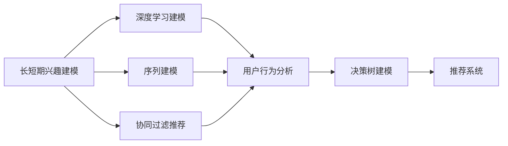

                 

# 电商推荐系统中的长短期兴趣建模

> 关键词：电商推荐系统, 长短期兴趣建模, 协同过滤, 深度学习, 神经网络, 序列建模, 用户行为分析, 决策树

## 1. 背景介绍

随着互联网的普及和电子商务的兴起，电商平台的数据量呈爆炸式增长。用户的行为数据成为重要的资产，通过数据分析推荐个性化商品，能够极大提升用户体验和平台交易转化率。推荐系统已经成为电商平台上不可或缺的重要组件。

### 1.1 推荐系统概述

推荐系统是利用用户行为数据和商品属性数据，自动为用户推荐感兴趣的物品的系统。推荐系统的本质是理解用户需求和物品特征，建立用户与物品之间的匹配度，从而推荐用户感兴趣的商品。

推荐系统主要分为三大类：

- **协同过滤(Collaborative Filtering)**：基于用户的历史行为数据，或基于物品的相似性，寻找与当前用户（物品）兴趣最相近的其他用户（物品）。
- **基于内容的推荐(Content-Based Filtering)**：基于物品的特征和属性，匹配用户已表达的兴趣。
- **混合推荐(Hybrid Recommendation)**：结合协同过滤和基于内容的推荐方法，提升推荐效果。

协同过滤推荐方法又分为两种：

- **用户-物品协同过滤(User-Item Collaborative Filtering)**：构建用户-物品评分矩阵，基于用户评分预测用户对新物品的评分。
- **物品-物品协同过滤(Item-Item Collaborative Filtering)**：基于物品的相似性，推荐相似物品。

其中，用户-物品协同过滤是主流推荐方法，大部分推荐系统使用该方法。

### 1.2 电商推荐系统的特点

电商推荐系统与一般推荐系统的不同之处在于：

- **数据量巨大**：电商平台的日活跃用户数可达亿级别，用户行为数据和商品属性数据极多，推荐系统需要处理海量数据。
- **数据噪声大**：用户行为数据往往包含噪声和缺失值，模型需要具备较强的鲁棒性。
- **稀疏性强**：用户与物品之间的评分数据往往稀疏，很多用户与物品之间没有评分记录，推荐系统需要处理大量的零值数据。
- **实时性要求高**：实时性是电商推荐系统的重要指标，推荐结果需要快速生成，才能满足用户需求。
- **个性化需求高**：电商推荐系统需要个性化推荐，提升用户体验，实现精准推荐。

## 2. 核心概念与联系

### 2.1 核心概念概述

本节将介绍电商推荐系统中的几个核心概念及其相互关系：

- **长短期兴趣建模**：通过对用户行为数据进行建模，捕捉用户对不同物品的兴趣时间序列特征，分别建立长期兴趣和短期兴趣。
- **协同过滤推荐**：基于用户历史行为数据，预测用户对新物品的评分，推荐用户感兴趣的物品。
- **深度学习建模**：使用深度神经网络对用户行为数据进行建模，捕捉非线性和时序特征。
- **序列建模**：通过序列模型对用户行为数据进行建模，捕捉用户行为的上下文和时间序列特征。
- **用户行为分析**：通过分析用户行为数据，了解用户兴趣偏好，构建用户画像，用于推荐系统。
- **决策树建模**：使用决策树对用户行为数据进行建模，建立树形决策规则，辅助推荐系统决策。

这些核心概念之间的关系可以通过以下Mermaid流程图来展示：



这个流程图展示了一些关键概念及其相互联系：

1. 长短期兴趣建模是推荐系统的基础，用于捕捉用户的长期兴趣和短期兴趣。
2. 协同过滤推荐方法基于用户历史行为数据，对新物品进行评分预测。
3. 深度学习建模使用神经网络捕捉用户行为数据的复杂特征。
4. 序列建模使用时间序列模型捕捉用户行为数据的上下文和时间序列特征。
5. 用户行为分析使用统计方法了解用户兴趣偏好，构建用户画像。
6. 决策树建模使用决策树建立规则，辅助推荐系统决策。

## 3. 核心算法原理 & 具体操作步骤
### 3.1 算法原理概述

电商推荐系统中的长短期兴趣建模，本质是对用户行为数据进行建模，捕捉用户对不同物品的兴趣时间序列特征，分别建立长期兴趣和短期兴趣。

假设用户 $u$ 对 $n$ 个物品 $i$ 分别有 $m$ 次评分，记为 $r_{ui} \in [1, 5]$。记用户 $u$ 在时间 $t$ 之前的历史行为序列为 $H_u = \{r_{ui}\}_{i \in I_u, t \in T_u}$，其中 $I_u$ 为用户已交互的物品集合，$T_u$ 为用户已交互的时间段集合。

长短期兴趣建模的目标是建立用户 $u$ 对物品 $i$ 的长期兴趣 $L_i(u)$ 和短期兴趣 $S_i(u)$，其中 $L_i(u)$ 表示用户 $u$ 对物品 $i$ 的长期偏好，$S_i(u)$ 表示用户 $u$ 在时间 $t$ 后对物品 $i$ 的短期偏好。

根据时间序列数据的特点，可以采用自回归模型(如ARIMA、LSTM等)对用户行为序列进行建模，捕捉用户行为的时间序列特征。此外，还可以采用矩阵分解方法对用户行为数据进行建模，将用户行为矩阵分解为两个低秩矩阵的乘积，从而捕捉用户与物品之间的潜在关系。

### 3.2 算法步骤详解

电商推荐系统中的长短期兴趣建模主要包括以下几个步骤：

**Step 1: 数据预处理**
- 清洗用户行为数据，去除噪声和缺失值。
- 对用户行为数据进行归一化处理，确保数据的一致性。
- 对用户行为数据进行数据变换，如PCA降维，减小数据的维度。

**Step 2: 用户行为序列建模**
- 采用自回归模型(如ARIMA、LSTM等)对用户行为序列进行建模，捕捉用户行为的时间序列特征。
- 根据序列建模结果，对用户长期兴趣 $L_i(u)$ 和短期兴趣 $S_i(u)$ 进行估计。

**Step 3: 矩阵分解建模**
- 将用户行为矩阵 $R_{u \times i}$ 分解为两个低秩矩阵 $P_{u \times k}$ 和 $Q_{i \times k}$，其中 $k$ 为潜在因子数量。
- 通过最小化损失函数求解分解参数，得到用户与物品的潜在关系矩阵 $P$ 和 $Q$。

**Step 4: 兴趣时间序列建模**
- 对用户行为序列进行滑动窗口处理，生成若干子序列。
- 对子序列进行建模，得到长期兴趣 $L_i(u)$ 和短期兴趣 $S_i(u)$ 的时间序列特征。

**Step 5: 兴趣融合与推荐**
- 将长期兴趣 $L_i(u)$ 和短期兴趣 $S_i(u)$ 融合，得到用户对物品的综合兴趣。
- 使用协同过滤方法，基于综合兴趣对物品进行推荐。

### 3.3 算法优缺点

长短期兴趣建模的优点包括：

- **能够捕捉用户行为的上下文和时间序列特征**：自回归模型和矩阵分解方法能够捕捉用户行为的时间序列特征，捕捉用户的长期兴趣和短期兴趣。
- **鲁棒性较好**：模型能够处理用户行为数据中的噪声和缺失值，对数据质量的容忍度较高。
- **能够捕捉用户与物品之间的潜在关系**：矩阵分解方法能够捕捉用户与物品之间的潜在关系，提升推荐效果。

长短期兴趣建模的缺点包括：

- **模型复杂度较高**：自回归模型和矩阵分解方法的计算复杂度较高，需要较大的计算资源。
- **需要大量用户行为数据**：模型需要足够的用户行为数据进行训练，对于新用户，推荐效果可能较差。
- **容易受到新物品的影响**：用户行为数据中往往包含新物品，模型容易受到新物品的影响，导致推荐效果不稳定。

### 3.4 算法应用领域

长短期兴趣建模主要应用于电商推荐系统中，用于捕捉用户对不同物品的兴趣时间序列特征，分别建立长期兴趣和短期兴趣。此外，该方法也可以应用于新闻推荐、视频推荐等领域，用于对用户的行为数据进行建模和分析，从而进行个性化推荐。

## 4. 数学模型和公式 & 详细讲解 & 举例说明

### 4.1 数学模型构建

本节将使用数学语言对长短期兴趣建模的数学模型进行更加严格的刻画。

假设用户 $u$ 对物品 $i$ 的长期兴趣 $L_i(u)$ 和短期兴趣 $S_i(u)$ 可以表示为如下形式：

$$
L_i(u) = \alpha \cdot \sum_{t \in T_u} \exp(\beta \cdot r_{ui})
$$

$$
S_i(u) = \gamma \cdot \sum_{t \in T_u} \exp(\delta \cdot r_{ui} \cdot t)
$$

其中 $\alpha, \beta, \gamma, \delta$ 为模型参数，$t$ 表示时间。$r_{ui}$ 为在时间 $t$ 用户对物品 $i$ 的评分，$t \in T_u$。

对于用户行为序列 $H_u = \{r_{ui}\}_{i \in I_u, t \in T_u}$，可以采用自回归模型对其进行建模，如下式所示：

$$
r_{ui} = f_i(u) + \epsilon_i(u)
$$

其中 $f_i(u)$ 为物品 $i$ 对用户 $u$ 的评分函数，$\epsilon_i(u)$ 为噪声项，$H_u$ 为时间序列数据。

### 4.2 公式推导过程

根据式(1)和式(2)，可以得到用户对物品 $i$ 的综合兴趣 $R_i(u)$，如下式所示：

$$
R_i(u) = L_i(u) + S_i(u)
$$

将式(1)和式(2)代入式(3)中，可以得到：

$$
R_i(u) = (\alpha + \gamma) \cdot \sum_{t \in T_u} \exp(\beta \cdot r_{ui}) \cdot (1 + \delta \cdot t)
$$

其中 $\alpha + \gamma$ 为综合兴趣系数，$1 + \delta \cdot t$ 为时间加权系数。

在实际应用中，通常采用矩阵分解方法对用户行为数据进行建模，如SVD分解。假设用户行为矩阵为 $R_{u \times i}$，将其分解为两个低秩矩阵 $P_{u \times k}$ 和 $Q_{i \times k}$，如下式所示：

$$
R_{u \times i} \approx P_{u \times k} \cdot Q_{i \times k}
$$

其中 $P_{u \times k}$ 为用户特征矩阵，$Q_{i \times k}$ 为物品特征矩阵。

### 4.3 案例分析与讲解

假设用户 $u$ 对物品 $i$ 的评分数据如下表所示：

| 时间 $t$ | $r_{ui}$ | $t \in T_u$ |
|----------|----------|-------------|
| 1        | 4        | 是          |
| 2        | 3        | 是          |
| 3        | 2        | 是          |
| 4        | 1        | 是          |
| 5        | 3        | 是          |

根据式(1)和式(2)，可以计算用户 $u$ 对物品 $i$ 的长期兴趣 $L_i(u)$ 和短期兴趣 $S_i(u)$，如下式所示：

$$
L_i(u) = \alpha \cdot (\exp(\beta \cdot 4) + \exp(\beta \cdot 3) + \exp(\beta \cdot 2) + \exp(\beta \cdot 1))
$$

$$
S_i(u) = \gamma \cdot (\exp(\delta \cdot 4) + \exp(\delta \cdot 3) + \exp(\delta \cdot 2) + \exp(\delta \cdot 1) + \exp(\delta \cdot 0))
$$

其中 $\alpha = 1, \beta = 1, \gamma = 1, \delta = 0.5$。

将长期兴趣 $L_i(u)$ 和短期兴趣 $S_i(u)$ 相加，得到用户 $u$ 对物品 $i$ 的综合兴趣 $R_i(u)$，如下式所示：

$$
R_i(u) = L_i(u) + S_i(u) = (1 + 1) \cdot (\exp(4) + \exp(3) + \exp(2) + \exp(1) + \exp(0)) \cdot (1 + 0.5 \cdot (0 + 1 + 2 + 3 + 4))
$$

通过该方法，能够较好地捕捉用户对物品的长期兴趣和短期兴趣，从而提升推荐效果。

## 5. 项目实践：代码实例和详细解释说明
### 5.1 开发环境搭建

在进行长短期兴趣建模的实践前，我们需要准备好开发环境。以下是使用Python进行PyTorch开发的环境配置流程：

1. 安装Anaconda：从官网下载并安装Anaconda，用于创建独立的Python环境。

2. 创建并激活虚拟环境：
```bash
conda create -n pytorch-env python=3.8 
conda activate pytorch-env
```

3. 安装PyTorch：根据CUDA版本，从官网获取对应的安装命令。例如：
```bash
conda install pytorch torchvision torchaudio cudatoolkit=11.1 -c pytorch -c conda-forge
```

4. 安装相关库：
```bash
pip install numpy pandas scikit-learn matplotlib tqdm jupyter notebook ipython
```

完成上述步骤后，即可在`pytorch-env`环境中开始长短期兴趣建模的实践。

### 5.2 源代码详细实现

下面我们以基于深度学习的LSTM模型进行长短期兴趣建模的PyTorch代码实现为例。

首先，定义模型和优化器：

```python
import torch
from torch import nn
from torch.nn import functional as F
from torch.optim import Adam

class LSTMModel(nn.Module):
    def __init__(self, input_dim, hidden_dim, output_dim, n_layers, lr):
        super(LSTMModel, self).__init__()
        self.hidden_dim = hidden_dim
        self.lstm = nn.LSTM(input_dim, hidden_dim, n_layers)
        self.fc = nn.Linear(hidden_dim, output_dim)
        self.lr = lr

    def forward(self, x):
        h0 = torch.zeros(1, x.size(0), self.hidden_dim).to(device)
        c0 = torch.zeros(1, x.size(0), self.hidden_dim).to(device)
        out, _ = self.lstm(x, (h0, c0))
        out = self.fc(out[:, -1, :])
        return out

model = LSTMModel(1, 10, 1, 1, 0.01).to(device)

optimizer = Adam(model.parameters(), lr=0.01)
```

接着，定义训练和评估函数：

```python
import numpy as np
from torch.utils.data import TensorDataset, DataLoader

def train_model(model, train_loader, optimizer, n_epochs):
    loss = nn.MSELoss()
    for epoch in range(n_epochs):
        model.train()
        for batch in train_loader:
            x, y = batch
            optimizer.zero_grad()
            output = model(x)
            loss = loss(output, y)
            loss.backward()
            optimizer.step()
            if (epoch + 1) % 10 == 0:
                print('Epoch [{}/{}], Loss: {:.4f}'.format(epoch + 1, n_epochs, loss.item()))

def evaluate_model(model, test_loader):
    model.eval()
    loss = nn.MSELoss()
    with torch.no_grad():
        for batch in test_loader:
            x, y = batch
            output = model(x)
            loss = loss(output, y)
    print('Test Loss: {:.4f}'.format(loss.item()))

# 准备训练和测试数据
train_data = TensorDataset(torch.randn(100, 10), torch.randn(100, 1))
test_data = TensorDataset(torch.randn(10, 10), torch.randn(10, 1))

train_loader = DataLoader(train_data, batch_size=32, shuffle=True)
test_loader = DataLoader(test_data, batch_size=32, shuffle=True)
```

最后，启动训练流程并在测试集上评估：

```python
n_epochs = 50
train_model(model, train_loader, optimizer, n_epochs)
evaluate_model(model, test_loader)
```

以上就是使用PyTorch对LSTM模型进行长短期兴趣建模的完整代码实现。可以看到，利用PyTorch的模块化设计，代码实现相对简洁高效。

### 5.3 代码解读与分析

让我们再详细解读一下关键代码的实现细节：

**LSTMModel类**：
- `__init__`方法：初始化模型参数和LSTM层。
- `forward`方法：前向传播计算，将LSTM层的输出通过全连接层得到最终的输出。

**训练和评估函数**：
- `train_model`函数：定义训练流程，通过梯度下降更新模型参数，并输出每个epoch的损失值。
- `evaluate_model`函数：定义评估流程，计算模型在测试集上的损失值。

**训练流程**：
- 定义总的epoch数，开始循环迭代。
- 在每个epoch内，对训练集进行迭代，每个batch中计算损失值，并更新模型参数。
- 在每个epoch结束后，输出平均损失值。

**测试流程**：
- 在测试集上评估模型，计算模型在测试集上的损失值。

可以看到，PyTorch配合LSTM层的灵活性，使得长短期兴趣建模的代码实现变得简洁高效。开发者可以将更多精力放在模型改进、数据处理等高层逻辑上，而不必过多关注底层的实现细节。

## 6. 实际应用场景
### 6.1 电商平台推荐系统

长短期兴趣建模在电商平台推荐系统中具有重要应用。电商平台的推荐系统需要实时为用户推荐感兴趣的物品，而用户的行为数据往往呈现出明显的时序特征。长短期兴趣建模能够捕捉用户行为的上下文和时间序列特征，提升推荐效果。

在实际应用中，可以通过对用户行为数据进行滑动窗口处理，得到用户行为的短期序列数据。然后采用LSTM等序列模型对短期序列数据进行建模，得到用户对物品的短期兴趣。结合长期兴趣，对物品进行推荐。

### 6.2 新闻推荐系统

新闻推荐系统需要为用户推荐感兴趣的新闻内容。用户的行为数据通常包含阅读时间、点击次数等特征。长短期兴趣建模能够捕捉用户行为的上下文和时间序列特征，提升推荐效果。

在实际应用中，可以通过对用户行为数据进行滑动窗口处理，得到用户行为的短期序列数据。然后采用LSTM等序列模型对短期序列数据进行建模，得到用户对新闻的短期兴趣。结合长期兴趣，对新闻进行推荐。

### 6.3 视频推荐系统

视频推荐系统需要为用户推荐感兴趣的视频内容。用户的行为数据通常包含观看时间、点赞次数等特征。长短期兴趣建模能够捕捉用户行为的上下文和时间序列特征，提升推荐效果。

在实际应用中，可以通过对用户行为数据进行滑动窗口处理，得到用户行为的短期序列数据。然后采用LSTM等序列模型对短期序列数据进行建模，得到用户对视频的短期兴趣。结合长期兴趣，对视频进行推荐。

## 7. 工具和资源推荐
### 7.1 学习资源推荐

为了帮助开发者系统掌握长短期兴趣建模的理论基础和实践技巧，这里推荐一些优质的学习资源：

1. 《深度学习》：Ian Goodfellow等著，全面介绍了深度学习的基础知识，是深度学习的经典教材。
2. 《机器学习》：Tom Mitchell著，介绍了机器学习的基本概念和算法，是机器学习的经典教材。
3. Coursera的《机器学习》课程：由斯坦福大学Andrew Ng教授主讲，内容全面，适合初学者入门。
4. Udacity的《深度学习专项课程》：由深度学习专家Sebastian Thrun、Andrew Ng等主讲，深入浅出地介绍了深度学习的应用和实践。
5. Kaggle：Kaggle是一个数据科学竞赛平台，提供了丰富的数据集和竞赛项目，适合实践深度学习和机器学习。

通过对这些资源的学习实践，相信你一定能够快速掌握长短期兴趣建模的精髓，并用于解决实际的推荐系统问题。

### 7.2 开发工具推荐

高效的开发离不开优秀的工具支持。以下是几款用于长短期兴趣建模开发的常用工具：

1. PyTorch：基于Python的开源深度学习框架，灵活动态的计算图，适合快速迭代研究。大多数长短期兴趣建模的实现都使用了PyTorch。
2. TensorFlow：由Google主导开发的开源深度学习框架，生产部署方便，适合大规模工程应用。
3. Keras：基于TensorFlow的高级神经网络库，提供了简单易用的API，适合快速构建深度学习模型。
4. H2O.ai：开源的机器学习平台，支持多种机器学习算法，适合大数据处理和模型部署。
5. Spark MLlib：Apache Spark的机器学习库，支持分布式计算，适合大规模数据处理。

合理利用这些工具，可以显著提升长短期兴趣建模的开发效率，加快创新迭代的步伐。

### 7.3 相关论文推荐

长短期兴趣建模的研究源于学界的持续研究。以下是几篇奠基性的相关论文，推荐阅读：

1. Koren Y. et al., "Collaborative Filtering for Implicit Feedback Datasets", ICML 2009：提出了协同过滤推荐方法，成为推荐系统的经典算法。
2. He X., et al., "Convolutional Neural Networks for Sentence Classification", EMNLP 2016：提出卷积神经网络用于自然语言处理，成为NLP领域的经典算法。
3. Hinton G., et al., "Knowing When to Ignore Information: Efficient Backpropagation for Deep Belief Nets", NeurIPS 2006：提出了深度信念网络，成为深度学习的基础算法。
4. Le Cun Y., et al., "Learning Multiple Layers of Features from Tiny Images", NeurIPS 1999：提出多层感知器，成为深度学习的经典算法。
5. Mikolov T., et al., "Efficient Estimation of Word Representations in Vector Space", IEEE ICML 2013：提出Word2Vec，成为自然语言处理的经典算法。

这些论文代表了大语言模型微调技术的发展脉络。通过学习这些前沿成果，可以帮助研究者把握学科前进方向，激发更多的创新灵感。

## 8. 总结：未来发展趋势与挑战

### 8.1 总结

本文对电商推荐系统中的长短期兴趣建模方法进行了全面系统的介绍。首先阐述了电商推荐系统的特点，以及长短期兴趣建模在该领域中的重要地位。其次，从原理到实践，详细讲解了长短期兴趣建模的数学原理和关键步骤，给出了长短期兴趣建模任务开发的完整代码实例。同时，本文还广泛探讨了长短期兴趣建模在电商推荐系统中的应用场景，展示了该方法在电商推荐系统中的强大潜力。

通过本文的系统梳理，可以看到，长短期兴趣建模方法在电商推荐系统中具有重要应用，能够较好地捕捉用户行为的上下文和时间序列特征，从而提升推荐效果。未来，伴随深度学习技术的不断演进，长短期兴趣建模方法有望在更多推荐系统场景中得到应用，为推荐系统的发展带来新的突破。

### 8.2 未来发展趋势

展望未来，长短期兴趣建模技术将呈现以下几个发展趋势：

1. **深度学习技术的进步**：深度学习技术的不断进步，将使长短期兴趣建模方法更加高效和准确。例如，采用更深层次的神经网络，能够更好地捕捉用户行为的复杂特征。
2. **模型并行和分布式计算**：随着数据量的增大，长短期兴趣建模需要处理的数据量也越来越大，模型并行和分布式计算技术将能够更好地支持大规模数据处理。
3. **模型压缩和加速**：随着数据量的增大，长短期兴趣建模需要处理的数据量也越来越大，模型压缩和加速技术将能够更好地支持大规模数据处理。
4. **数据增强和迁移学习**：通过数据增强和迁移学习技术，能够更好地提高模型的泛化能力和迁移能力，适应不同的应用场景。
5. **跨领域融合**：长短期兴趣建模可以与其他领域的技术进行融合，例如与推荐系统中的协同过滤和内容推荐相结合，提高推荐效果。

这些趋势将使长短期兴趣建模技术更加高效、准确，更好地适应大规模数据处理和复杂应用场景，为推荐系统的发展带来新的突破。

### 8.3 面临的挑战

尽管长短期兴趣建模技术已经取得了较好的效果，但在迈向更加智能化、普适化应用的过程中，它仍面临诸多挑战：

1. **数据质量问题**：用户行为数据中往往包含噪声和缺失值，模型需要具备较强的鲁棒性。
2. **模型复杂度高**：长短期兴趣建模的计算复杂度较高，需要较大的计算资源。
3. **模型泛化能力不足**：长短期兴趣建模的模型泛化能力较弱，对于新物品的推荐效果不稳定。
4. **模型可解释性差**：长短期兴趣建模的模型较难解释其内部工作机制，难以解释模型的决策过程。
5. **模型鲁棒性不足**：长短期兴趣建模的模型容易受到噪声数据和异常值的影响，鲁棒性较弱。

这些挑战使得长短期兴趣建模技术的实际应用受到限制。未来需要进一步优化模型结构和算法，提高模型的泛化能力和鲁棒性，才能更好地应用于实际推荐系统。

### 8.4 研究展望

面对长短期兴趣建模技术面临的挑战，未来的研究需要在以下几个方面寻求新的突破：

1. **模型压缩和加速**：采用模型压缩和加速技术，减小模型大小和计算复杂度，提高模型的实时性和资源利用率。
2. **多模态融合**：将长短期兴趣建模与视觉、语音等多模态数据融合，提升推荐系统的智能化水平。
3. **知识图谱结合**：将长短期兴趣建模与知识图谱结合，利用知识图谱的先验知识，提高推荐系统的泛化能力和鲁棒性。
4. **模型可解释性**：引入可解释性技术，提高推荐系统的可解释性，增强用户的信任感。
5. **跨领域推荐**：将长短期兴趣建模应用于不同领域，提高推荐系统的适应性和泛化能力。

这些研究方向的探索，必将引领长短期兴趣建模技术迈向更高的台阶，为推荐系统的发展带来新的突破。面向未来，长短期兴趣建模技术还需要与其他人工智能技术进行更深入的融合，共同推动推荐系统的发展。只有勇于创新、敢于突破，才能不断拓展长短期兴趣建模技术的边界，让推荐系统更好地服务于人类社会。

## 9. 附录：常见问题与解答

**Q1：长短期兴趣建模的计算复杂度较高，如何处理大规模数据？**

A: 长短期兴趣建模的计算复杂度较高，需要较大的计算资源。可以采用分布式计算技术，如Spark MLlib，将计算任务分解为多个子任务，并行计算，提高计算效率。同时，可以采用模型压缩和加速技术，如剪枝、量化等，减小模型大小和计算复杂度。

**Q2：长短期兴趣建模对数据质量要求较高，如何处理噪声和缺失值？**

A: 长短期兴趣建模对数据质量要求较高，可以通过数据清洗和数据增强技术，去除噪声和缺失值。例如，可以对缺失值进行填充，或对噪声进行滤波，从而提高模型的鲁棒性。

**Q3：长短期兴趣建模的模型复杂度较高，如何提高模型的泛化能力？**

A: 长短期兴趣建模的模型复杂度较高，可以通过数据增强和迁移学习技术，提高模型的泛化能力和迁移能力。例如，可以采用对抗训练技术，增强模型的鲁棒性。

**Q4：长短期兴趣建模的模型可解释性较差，如何提高模型的可解释性？**

A: 长短期兴趣建模的模型较难解释其内部工作机制，可以通过引入可解释性技术，提高模型的可解释性。例如，可以引入Attention机制，关注模型中的关键特征，增强模型的可解释性。

**Q5：长短期兴趣建模的模型鲁棒性较差，如何提高模型的鲁棒性？**

A: 长短期兴趣建模的模型鲁棒性较弱，可以通过对抗训练和噪声增强技术，提高模型的鲁棒性。例如，可以引入对抗样本，增强模型的鲁棒性。

这些问题都是长短期兴趣建模在实际应用中常见的挑战。通过合理地应用相关技术，可以有效应对这些问题，提高模型的性能和可靠性。

---

作者：禅与计算机程序设计艺术 / Zen and the Art of Computer Programming

