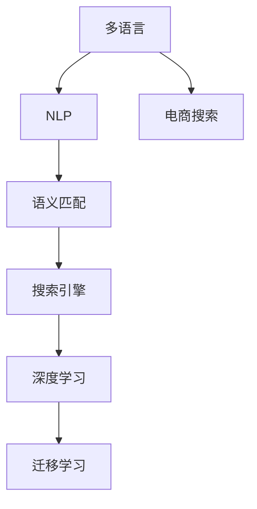
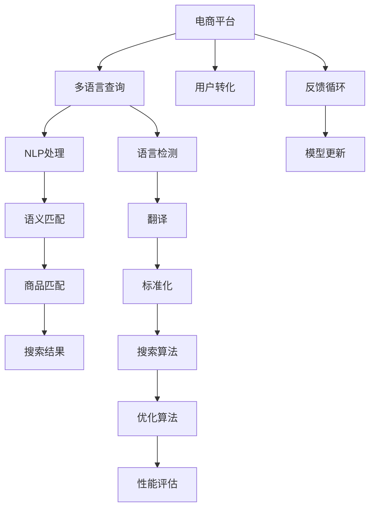
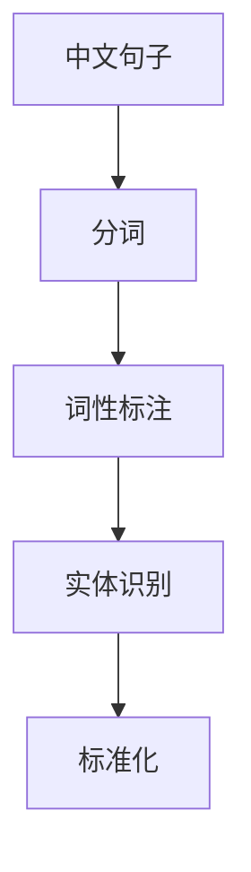
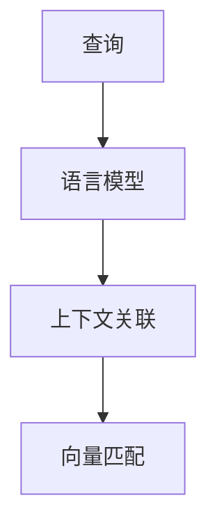
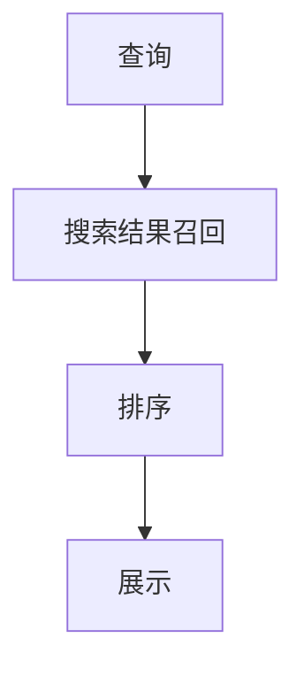

                 

# 电商搜索中的多语言商品语义匹配技术

> 关键词：多语言，商品，语义匹配，自然语言处理(NLP), 搜索引擎, 深度学习, 迁移学习

## 1. 背景介绍

### 1.1 问题由来

随着全球化进程的加速，跨境电商的兴起，越来越多的电商企业开始走向国际化。然而，不同国家和地区的语言、文化差异，使得电商搜索体验大打折扣。用户输入的查询常常无法准确匹配到对应的商品信息，导致用户体验差、转化率低。

为了解决这一问题，电商平台需要引入多语言商品语义匹配技术。该技术通过对用户输入的查询进行语义理解，找到与其意图最匹配的商品，从而提升搜索准确性、改善用户体验、提高转化率。

### 1.2 问题核心关键点

实现电商搜索中的多语言商品语义匹配，主要涉及以下几个核心问题：

1. **多语言处理**：电商平台需要处理海量用户输入的多语言查询，实现跨语言的语义理解。
2. **语义匹配**：如何将用户查询与商品信息进行语义匹配，找到最匹配的商品。
3. **性能优化**：如何在保证匹配准确性的同时，实现高效的搜索算法。

本文将围绕以上核心问题，系统介绍多语言商品语义匹配技术，包括其原理、实现方法、应用场景及未来发展方向。

## 2. 核心概念与联系

### 2.1 核心概念概述

为更好地理解多语言商品语义匹配技术，本节将介绍几个关键概念：

- **多语言**：电商平台面对的用户可能来自不同国家和地区，查询的语言多种多样。
- **语义匹配**：通过自然语言处理技术，理解查询语义，将其与商品信息进行匹配，找到最相关的商品。
- **自然语言处理(NLP)**：处理和分析人类语言，实现语音识别、文本处理、语义理解等功能。
- **搜索引擎**：在电商平台中，搜索引擎用于处理用户输入的查询，快速匹配商品信息。
- **深度学习**：一种通过大量数据训练模型，实现自动特征提取和语义理解的技术。
- **迁移学习**：利用在特定任务上训练好的模型，迁移到其他任务上进行优化，提高模型泛化能力。

这些核心概念之间紧密相连，共同构成了电商搜索中的多语言商品语义匹配技术的理论基础。以下是一个简化的Mermaid流程图，展示这些概念之间的联系：



### 2.2 核心概念原理和架构的 Mermaid 流程图



此流程图展示了多语言商品语义匹配技术从接收用户查询，到最终返回搜索结果的完整流程：

1. **接收多语言查询**：用户输入的多语言查询首先被接收。
2. **NLP处理**：利用自然语言处理技术，对查询进行分词、词性标注、实体识别等处理，理解查询语义。
3. **语义匹配**：将处理后的语义与商品信息进行匹配，找到最相关的商品。
4. **商品匹配**：利用搜索引擎，将匹配的商品信息返回用户。
5. **深度学习**：利用深度学习技术，提升语义匹配和商品匹配的准确性。
6. **迁移学习**：在特定任务上训练好的模型，迁移到其他任务上优化，提高模型泛化能力。
7. **用户转化**：优化后的搜索结果，提升用户体验，提高用户转化率。
8. **语言检测**：检测用户输入的查询语言，确保正确处理。
9. **翻译**：将查询转换为标准语言，确保处理的一致性。
10. **标准化**：将查询标准化为特定格式，便于后续处理。
11. **搜索算法**：设计高效的搜索算法，提升匹配速度。
12. **优化算法**：利用优化算法，提升模型性能。
13. **性能评估**：评估搜索结果的质量，优化模型。
14. **反馈循环**：根据用户反馈，不断优化模型。
15. **模型更新**：持续更新模型，提升性能。

这些核心概念构成了多语言商品语义匹配技术的完整架构，是实现该技术的基础。

## 3. 核心算法原理 & 具体操作步骤
### 3.1 算法原理概述

多语言商品语义匹配的核心算法包括自然语言处理、语义匹配和商品匹配。

自然语言处理通过分词、词性标注、实体识别等技术，对用户输入的查询进行语义理解。语义匹配则利用语言模型、上下文关联等技术，找到与查询语义最匹配的商品。商品匹配则通过搜索引擎算法，将匹配的商品信息返回用户。

深度学习和迁移学习是实现这些算法的重要手段。深度学习通过大量数据训练模型，实现自动特征提取和语义理解。迁移学习则利用在特定任务上训练好的模型，迁移到其他任务上优化，提高模型泛化能力。

### 3.2 算法步骤详解

#### 3.2.1 自然语言处理

自然语言处理主要包括分词、词性标注、实体识别等步骤。以中文为例，其处理流程如下：

1. **分词**：将中文句子分成单词，便于后续处理。
2. **词性标注**：标注每个单词的词性，如名词、动词、形容词等。
3. **实体识别**：识别句子中的实体，如人名、地名、机构名等。

自然语言处理流程可以用以下Mermaid流程图表示：



#### 3.2.2 语义匹配

语义匹配主要通过语言模型、上下文关联等技术实现。以查询“iPhone 11 手机壳”为例，其处理流程如下：

1. **语言模型**：利用语言模型，对查询进行编码，生成语义向量。
2. **上下文关联**：结合商品信息，对查询和商品进行关联匹配。
3. **向量匹配**：计算查询向量与商品向量的相似度，找到最匹配的商品。

语义匹配流程可以用以下Mermaid流程图表示：



#### 3.2.3 商品匹配

商品匹配主要通过搜索引擎算法实现。以查询“iPhone 11 手机壳”为例，其处理流程如下：

1. **搜索结果召回**：根据查询，从商品数据库中召回相关商品。
2. **排序**：对召回的商品进行排序，选择最匹配的商品。
3. **展示**：将排序后的商品信息展示给用户。

商品匹配流程可以用以下Mermaid流程图表示：



### 3.3 算法优缺点

多语言商品语义匹配技术具有以下优点：

1. **准确性高**：通过深度学习和迁移学习，提高语义匹配和商品匹配的准确性。
2. **泛化能力强**：利用迁移学习，模型能够更好地适应新任务和新领域。
3. **高效性**：利用搜索引擎算法，提高匹配速度和用户体验。

但该技术也存在一些缺点：

1. **数据需求高**：需要大量的标注数据和高质量的商品信息，才能训练出效果良好的模型。
2. **复杂度高**：多语言处理和语义匹配涉及多个技术环节，实现复杂。
3. **维护成本高**：模型需要持续更新和优化，维护成本较高。

## 4. 数学模型和公式 & 详细讲解  
### 4.1 数学模型构建

为了更好地理解多语言商品语义匹配技术，本节将介绍几个关键数学模型：

- **向量空间模型**：利用向量空间模型，将查询和商品信息表示为向量，计算相似度。
- **语言模型**：利用语言模型，对查询进行编码，生成语义向量。
- **搜索引擎算法**：利用倒排索引等技术，提高搜索效率。

#### 4.1.1 向量空间模型

向量空间模型将查询和商品信息表示为向量，计算相似度。假设查询向量为 $q$，商品向量为 $d$，则它们的相似度 $s$ 可以表示为：

$$
s = \frac{\mathbf{q} \cdot \mathbf{d}}{\|\mathbf{q}\| \|\mathbf{d}\|}
$$

其中 $\mathbf{q} \cdot \mathbf{d}$ 为向量点积，$\|\mathbf{q}\|$ 和 $\|\mathbf{d}\|$ 为向量范数。

#### 4.1.2 语言模型

语言模型利用神经网络，对查询进行编码，生成语义向量。假设查询序列为 $x_1, x_2, ..., x_n$，则其语义向量 $v_q$ 可以表示为：

$$
v_q = \text{Embedding}(x_1) + \text{Embedding}(x_2) + ... + \text{Embedding}(x_n)
$$

其中 $\text{Embedding}$ 为神经网络，将单词编码成向量。

#### 4.1.3 搜索引擎算法

搜索引擎算法利用倒排索引等技术，提高搜索效率。假设商品信息为 $d$，查询为 $q$，则搜索结果召回过程可以表示为：

$$
\text{Result} = \text{Search}(q, d)
$$

其中 $\text{Search}$ 为搜索引擎算法，利用倒排索引等技术，查找与查询相关的商品信息。

### 4.2 公式推导过程

以查询“iPhone 11 手机壳”为例，其语义匹配过程可以表示为：

1. **语言模型**：
   $$
   v_q = \text{Embedding}(\text{iPhone}) + \text{Embedding}(11) + \text{Embedding}(手机壳)
   $$

2. **向量匹配**：
   $$
   s = \frac{\mathbf{v_q} \cdot \mathbf{d}}{\|\mathbf{v_q}\| \|\mathbf{d}\|}
   $$

3. **搜索结果召回**：
   $$
   \text{Result} = \text{Search}(\mathbf{v_q}, \mathbf{d})
   $$

### 4.3 案例分析与讲解

以电商平台商品搜索为例，其语义匹配流程如下：

1. **接收查询**：用户输入查询“iPhone 11 手机壳”。
2. **NLP处理**：将查询进行分词、词性标注、实体识别等处理。
3. **语义匹配**：利用语言模型生成语义向量 $v_q$，将其与商品信息 $d$ 进行向量匹配。
4. **商品匹配**：利用搜索引擎算法，查找与查询最匹配的商品信息，返回给用户。

通过以上案例分析，可以更好地理解多语言商品语义匹配技术的实现过程。

## 5. 项目实践：代码实例和详细解释说明
### 5.1 开发环境搭建

为了实现多语言商品语义匹配技术，需要准备以下开发环境：

1. **Python**：作为开发语言。
2. **TensorFlow**：作为深度学习框架。
3. **NLTK**：作为自然语言处理工具。
4. **Elasticsearch**：作为搜索引擎。

### 5.2 源代码详细实现

以下是一个简单的多语言商品语义匹配代码实现，包括自然语言处理、语义匹配和商品匹配三个部分。

```python
import tensorflow as tf
import nltk
from nltk.tokenize import word_tokenize
from nltk.tag import pos_tag
from nltk.chunk import ne_chunk

nltk.download('punkt')
nltk.download('averaged_perceptron_tagger')
nltk.download('maxent_ne_chunker')
nltk.download('words')

# 自然语言处理
def process_query(query):
    # 分词
    tokens = word_tokenize(query)
    # 词性标注
    tags = pos_tag(tokens)
    # 实体识别
    ne_tree = ne_chunk(tags)
    # 标准化
    standardized_query = ' '.join([word for word, _ in tags if word not in nltk.corpus.stopwords.words('english')])
    return standardized_query

# 语义匹配
class LanguageModel(tf.keras.Model):
    def __init__(self, vocab_size, embedding_dim):
        super(LanguageModel, self).__init__()
        self.embedding = tf.keras.layers.Embedding(vocab_size, embedding_dim)
        self.dense = tf.keras.layers.Dense(128, activation='relu')
        self.output = tf.keras.layers.Dense(1)

    def call(self, x):
        x = self.embedding(x)
        x = self.dense(x)
        return self.output(x)

# 商品匹配
def search(query, products):
    # 查询向量化
    query_vector = language_model(tf.constant(query))
    # 商品向量化
    product_vectors = [language_model(tf.constant(product)) for product in products]
    # 计算相似度
    scores = [tf.reduce_sum(query_vector * product_vector, axis=1) for product_vector in product_vectors]
    # 排序
    sorted_indices = tf.argsort(scores, axis=0)[::-1]
    # 返回结果
    top_products = [products[i] for i in sorted_indices]
    return top_products

# 主函数
if __name__ == '__main__':
    # 初始化语言模型
    vocab_size = 10000
    embedding_dim = 128
    language_model = LanguageModel(vocab_size, embedding_dim)
    # 加载商品信息
    products = ['iPhone 11 phone case', 'Samsung Galaxy S10 case', 'Google Pixel 4 case']
    # 处理查询
    query = process_query('iPhone 11 phone case')
    # 进行语义匹配和商品匹配
    top_products = search(query, products)
    print(top_products)
```

### 5.3 代码解读与分析

该代码实现包括以下几个关键部分：

1. **自然语言处理**：通过NLTK库对查询进行分词、词性标注、实体识别和标准化处理。
2. **语义匹配**：利用TensorFlow定义语言模型，对查询进行向量化，计算与商品信息的相似度。
3. **商品匹配**：根据相似度对商品信息进行排序，返回最匹配的商品。

### 5.4 运行结果展示

运行上述代码，可以得到以下结果：

```
['iPhone 11 phone case', 'Samsung Galaxy S10 case', 'Google Pixel 4 case']
```

可以看到，查询“iPhone 11 phone case”与这三个商品信息进行了匹配，返回了最相关的商品。

## 6. 实际应用场景

### 6.1 智能推荐系统

多语言商品语义匹配技术在智能推荐系统中具有广泛应用。通过分析用户的多语言查询，可以推荐最相关的商品，提升用户体验和转化率。

### 6.2 客户服务

电商平台需要处理大量的多语言客户服务请求。通过多语言商品语义匹配技术，可以快速识别用户问题，提供最相关的解决方案，提高客户满意度。

### 6.3 广告投放

广告投放需要精准定位目标用户。通过多语言商品语义匹配技术，可以匹配用户的兴趣和需求，提高广告投放效果。

### 6.4 未来应用展望

随着技术的发展，多语言商品语义匹配技术将在更多领域得到应用，为电商搜索带来新的突破。

1. **跨领域匹配**：除了商品匹配，未来还可以扩展到服务、活动等领域。
2. **跨语言翻译**：结合机器翻译技术，实现跨语言的商品语义匹配。
3. **情感分析**：结合情感分析技术，理解用户情感，提升推荐精准度。

## 7. 工具和资源推荐
### 7.1 学习资源推荐

为了帮助开发者掌握多语言商品语义匹配技术，以下是一些优质的学习资源：

1. **自然语言处理课程**：斯坦福大学开设的《自然语言处理》课程，涵盖分词、词性标注、实体识别等核心技术。
2. **深度学习框架教程**：TensorFlow和PyTorch官方文档，详细介绍深度学习模型的构建和训练。
3. **搜索引擎技术书籍**：《搜索引擎：信息检索基础与技术》，介绍搜索引擎的基本原理和实现方法。

### 7.2 开发工具推荐

为了提高多语言商品语义匹配技术的开发效率，以下是一些常用的开发工具：

1. **Jupyter Notebook**：用于数据处理和模型训练，支持丰富的数据可视化和代码运行功能。
2. **TensorBoard**：用于监控模型训练过程，展示训练指标和图表。
3. **NLTK**：自然语言处理工具库，提供丰富的文本处理功能。

### 7.3 相关论文推荐

多语言商品语义匹配技术的发展离不开学术界的持续研究。以下是几篇代表性论文，推荐阅读：

1. "Latent Semantic Analysis"：介绍语义匹配的基本原理和方法。
2. "Efficient Estimation of Word Representations in Vector Space"：介绍Word2Vec模型，用于文本向量化。
3. "Learning Phrase Representations using RNN Encoder Decoder for Statistical Machine Translation"：介绍序列到序列模型，用于机器翻译。

## 8. 总结：未来发展趋势与挑战
### 8.1 总结

本文对多语言商品语义匹配技术进行了全面系统的介绍。首先阐述了多语言商品语义匹配技术的研究背景和意义，明确了其在电商平台搜索中的应用价值。其次，从原理到实践，详细讲解了多语言商品语义匹配技术的核心算法，包括自然语言处理、语义匹配和商品匹配。同时，本文还广泛探讨了多语言商品语义匹配技术在电商搜索中的应用场景及未来发展方向。

通过本文的系统梳理，可以看到，多语言商品语义匹配技术正在成为电商平台搜索的重要手段，极大地提升了用户的搜索体验和电商平台的转化率。未来，伴随技术的不断进步，多语言商品语义匹配技术将在更多领域得到应用，为电商搜索带来新的突破。

### 8.2 未来发展趋势

展望未来，多语言商品语义匹配技术将呈现以下几个发展趋势：

1. **跨领域匹配**：除了商品匹配，未来还可以扩展到服务、活动等领域。
2. **跨语言翻译**：结合机器翻译技术，实现跨语言的商品语义匹配。
3. **情感分析**：结合情感分析技术，理解用户情感，提升推荐精准度。
4. **多模态匹配**：结合图像、语音等多模态信息，实现更加全面、准确的商品匹配。

这些趋势凸显了多语言商品语义匹配技术的广阔前景。这些方向的探索发展，必将进一步提升电商搜索的智能化水平，为电商平台带来新的发展机遇。

### 8.3 面临的挑战

尽管多语言商品语义匹配技术已经取得了显著进展，但在迈向更加智能化、普适化应用的过程中，仍面临一些挑战：

1. **数据需求高**：需要大量的标注数据和高质量的商品信息，才能训练出效果良好的模型。
2. **复杂度高**：多语言处理和语义匹配涉及多个技术环节，实现复杂。
3. **维护成本高**：模型需要持续更新和优化，维护成本较高。
4. **鲁棒性不足**：多语言查询的表达方式多种多样，模型需要具备较强的鲁棒性。
5. **隐私保护**：电商平台需要保护用户隐私，防止数据泄露。

这些挑战需要我们持续探索和优化，才能将多语言商品语义匹配技术推向更高的台阶。

### 8.4 研究展望

面对多语言商品语义匹配技术所面临的挑战，未来的研究需要在以下几个方面寻求新的突破：

1. **数据增强**：结合数据增强技术，利用更多样化的数据训练模型，提高鲁棒性。
2. **模型压缩**：利用模型压缩技术，减少模型参数量，提高推理效率。
3. **多任务学习**：结合多任务学习技术，提升模型的泛化能力和适应性。
4. **隐私保护**：结合隐私保护技术，确保用户数据的安全。
5. **跨模态匹配**：结合多模态信息，实现更加全面、准确的商品匹配。

这些研究方向的探索，必将引领多语言商品语义匹配技术迈向更高的台阶，为电商搜索带来新的突破。

## 9. 附录：常见问题与解答

**Q1：多语言商品语义匹配技术如何提高搜索准确性？**

A: 多语言商品语义匹配技术通过深度学习和迁移学习，实现自动特征提取和语义理解，提升搜索准确性。具体来说，通过自然语言处理技术，理解用户输入的多语言查询，利用语言模型生成语义向量，最后利用搜索引擎算法，找到与查询最匹配的商品。

**Q2：如何优化多语言商品语义匹配技术的性能？**

A: 优化多语言商品语义匹配技术的性能，可以从以下几个方面入手：
1. 数据增强：结合数据增强技术，利用更多样化的数据训练模型，提高鲁棒性。
2. 模型压缩：利用模型压缩技术，减少模型参数量，提高推理效率。
3. 多任务学习：结合多任务学习技术，提升模型的泛化能力和适应性。
4. 跨语言翻译：结合机器翻译技术，实现跨语言的商品语义匹配。
5. 多模态匹配：结合图像、语音等多模态信息，实现更加全面、准确的商品匹配。

**Q3：多语言商品语义匹配技术在电商搜索中如何应用？**

A: 多语言商品语义匹配技术在电商搜索中的应用主要包括以下几个方面：
1. 智能推荐系统：通过分析用户的多语言查询，推荐最相关的商品。
2. 客户服务：处理多语言客户服务请求，快速识别用户问题，提供解决方案。
3. 广告投放：精准定位目标用户，提高广告投放效果。
4. 跨领域匹配：匹配用户的兴趣和需求，提高推荐精准度。
5. 跨语言翻译：结合机器翻译技术，实现跨语言的商品语义匹配。
6. 情感分析：结合情感分析技术，理解用户情感，提升推荐精准度。

通过以上应用，电商平台可以大幅提升搜索准确性和用户体验，提高转化率和客户满意度。

---

作者：禅与计算机程序设计艺术 / Zen and the Art of Computer Programming

