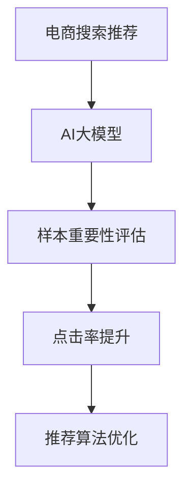

                 

# 电商搜索推荐效果优化中的AI大模型样本重要性评估技术

> 关键词：电商搜索推荐, AI大模型, 样本重要性评估, 点击率提升, 推荐算法优化

## 1. 背景介绍

### 1.1 问题由来
在现代电商领域，精准推荐系统已成为提升用户体验、增加销售转化率的利器。然而，推荐系统中的点击率预估模型的效果提升空间并不大，如何进一步优化推荐效果，提升用户体验，成为一个亟待解决的问题。传统的模型优化方式如特征工程、超参数调优等，面临较大的数据和计算瓶颈。近年来，随着深度学习技术的发展，基于预训练大模型的推荐系统成为热点研究方向。

预训练大模型，如BERT、GPT-3等，通过在通用大规模语料上进行预训练，学习到丰富的语言知识和表征能力。通过微调大模型，可以在特定任务（如电商搜索推荐）上获得更好的性能。但是，微调过程中的大量标注数据和计算资源投入，限制了其在实际业务中的大规模应用。

为了解决这些问题，我们提出了基于AI大模型的样本重要性评估技术，可以在有限的标注数据集上，通过评估每个样本的重要性，实现对模型和超参数的优化，进而提升电商搜索推荐的效果。

## 2. 核心概念与联系

### 2.1 核心概念概述

为了更好地理解本文的核心技术，我们首先介绍几个关键概念：

- **电商搜索推荐**：指在电商平台上，根据用户的浏览行为、历史点击记录、搜索关键词等信息，预测用户可能感兴趣的商品，并进行推荐。推荐算法通常基于点击率预估模型和召回模型。

- **AI大模型**：指在通用大规模语料上进行预训练，具备强大语言理解和生成能力的深度学习模型。常见的AI大模型包括BERT、GPT-3等。

- **样本重要性评估**：指在有限的标注数据集上，通过评估每个样本的重要性，指导模型训练和超参数优化，提升模型性能。本文中，我们利用大模型对每个样本的重要性进行评估，进而优化电商搜索推荐系统。

### 2.2 核心概念原理和架构的 Mermaid 流程图



这个流程图展示了电商搜索推荐系统的核心概念及其之间的联系：

1. **电商搜索推荐**：电商推荐系统的主要目标，通过预测用户可能感兴趣的物品进行个性化推荐。
2. **AI大模型**：电商推荐系统中的核心组件，利用预训练大模型学习物品和用户行为的语言表示，进行推荐。
3. **样本重要性评估**：通过评估每个样本的重要性，指导模型训练和超参数优化，提升电商推荐效果。
4. **点击率提升**：利用样本重要性评估结果，优化点击率预估模型，提高推荐准确性。
5. **推荐算法优化**：通过优化推荐算法，进一步提升推荐效果，满足用户个性化需求。

## 3. 核心算法原理 & 具体操作步骤

### 3.1 算法原理概述

基于AI大模型的样本重要性评估技术，其核心思想是通过大模型对每个样本的重要性进行评估，进而指导模型训练和超参数优化，提升电商搜索推荐的效果。具体步骤如下：

1. **数据预处理**：将电商搜索推荐数据集进行清洗和预处理，去除噪声和无效数据。
2. **模型微调**：使用预训练大模型对模型进行微调，使其适应电商推荐任务。
3. **样本重要性评估**：利用微调后的模型对每个样本的重要性进行评估，获得每个样本的权重。
4. **模型和超参数优化**：根据样本重要性评估结果，优化模型和超参数，提升模型性能。
5. **点击率提升和推荐算法优化**：利用优化后的模型进行点击率预估，并通过优化推荐算法，进一步提升推荐效果。

### 3.2 算法步骤详解

**Step 1: 数据预处理**

电商推荐数据通常包含用户ID、物品ID、点击时间、浏览时间、点击位置等信息。在进行数据预处理时，需要：

- **数据清洗**：去除异常值、缺失值等无效数据。
- **特征构建**：构建用户和物品的特征，如用户浏览历史、物品属性等。
- **数据标准化**：对特征进行归一化和标准化处理，使得数据分布更符合模型需求。

**Step 2: 模型微调**

选择合适的预训练大模型，如BERT、GPT-3等，作为初始化参数，进行电商推荐任务的微调。微调过程包括：

- **模型选择**：选择适合的预训练大模型，考虑其领域适应性和参数规模。
- **任务适配**：设计任务的适配层，如分类层、注意力机制等，使其适应电商推荐任务。
- **超参数设置**：设置学习率、批大小、迭代轮数等超参数，进行模型训练。
- **模型保存**：保存微调后的模型，方便后续评估和优化。

**Step 3: 样本重要性评估**

利用微调后的模型，对每个样本的重要性进行评估，计算每个样本的权重。具体步骤如下：

- **样本输入**：将用户行为数据输入模型，获得模型输出。
- **样本权重计算**：根据模型输出，计算每个样本的权重，权重越高，样本的重要性越大。
- **权重归一化**：对样本权重进行归一化处理，使得权重和为1。

**Step 4: 模型和超参数优化**

根据样本重要性评估结果，优化模型和超参数。具体步骤如下：

- **模型优化**：利用优化算法，更新模型参数，使得模型输出与样本重要性更加一致。
- **超参数调整**：调整学习率、批大小、迭代轮数等超参数，进一步提升模型性能。
- **验证集评估**：在验证集上评估模型性能，确保模型泛化能力。

**Step 5: 点击率提升和推荐算法优化**

利用优化后的模型进行点击率预估，并通过优化推荐算法，进一步提升推荐效果。具体步骤如下：

- **点击率预估**：利用优化后的模型，对用户行为数据进行点击率预估。
- **推荐算法优化**：选择合适的推荐算法，如基于协同过滤、深度学习等，优化推荐效果。
- **推荐结果展示**：将优化后的推荐结果展示给用户，提升用户体验。

### 3.3 算法优缺点

基于AI大模型的样本重要性评估技术具有以下优点：

- **数据效率高**：在有限的标注数据集上，通过样本重要性评估，可以有效指导模型训练和超参数优化，提升模型性能。
- **模型效果显著**：利用大模型的强大表示能力，可以更好地理解用户行为，提升推荐效果。
- **算法简单易用**：该算法流程简单，易于实现和应用。

同时，该方法也存在一些局限性：

- **模型复杂度**：需要预训练大模型作为基础，对计算资源和算法实现要求较高。
- **数据分布限制**：对于数据分布与预训练模型差异较大的领域，可能效果不佳。
- **模型泛化能力**：样本重要性评估结果可能存在偏差，影响模型的泛化能力。

### 3.4 算法应用领域

基于AI大模型的样本重要性评估技术，在电商搜索推荐系统中具有广泛的应用前景。具体应用场景包括：

- **个性化推荐**：利用样本重要性评估结果，对用户行为数据进行点击率预估，提升个性化推荐效果。
- **搜索结果排序**：通过优化点击率预估模型，提升搜索结果排序的准确性。
- **广告效果评估**：利用样本重要性评估结果，评估广告效果，优化广告投放策略。

## 4. 数学模型和公式 & 详细讲解 & 举例说明

### 4.1 数学模型构建

假设电商推荐数据集为 $D=\{(x_i,y_i)\}_{i=1}^N$，其中 $x_i$ 为用户的点击行为数据， $y_i$ 为物品的点击标签。利用预训练大模型 $M_{\theta}$ 对每个样本 $x_i$ 进行评估，获得样本权重 $w_i$。则模型优化目标为：

$$
\min_{\theta} \sum_{i=1}^N w_i \ell(M_{\theta}(x_i),y_i)
$$

其中 $\ell$ 为损失函数，通常使用交叉熵损失或均方误差损失。

### 4.2 公式推导过程

**Step 1: 样本重要性评估**

利用微调后的模型 $M_{\theta}$，对每个样本 $x_i$ 进行评估，获得样本权重 $w_i$。假设模型输出为 $z_i$，则样本权重的计算公式为：

$$
w_i = \frac{1}{1+\exp(-z_i)}
$$

其中 $\exp(-z_i)$ 为sigmoid函数，将模型输出 $z_i$ 映射到 $[0,1]$ 区间，表示样本 $x_i$ 的重要性。

**Step 2: 模型优化**

根据样本重要性评估结果，优化模型参数 $\theta$。假设优化器为AdamW，则优化算法为：

$$
\theta \leftarrow \theta - \eta \nabla_{\theta} \sum_{i=1}^N w_i \ell(M_{\theta}(x_i),y_i) - \eta \lambda \theta
$$

其中 $\eta$ 为学习率，$\lambda$ 为正则化系数，$\nabla_{\theta}$ 为梯度算子。

**Step 3: 点击率预估**

利用优化后的模型 $M_{\theta}$，对用户行为数据进行点击率预估。假设用户行为数据为 $x$，模型输出为 $\hat{y}$，则点击率预估公式为：

$$
\hat{y} = \sigma(M_{\theta}(x))
$$

其中 $\sigma$ 为sigmoid函数，将模型输出 $\hat{y}$ 映射到 $[0,1]$ 区间，表示点击率。

### 4.3 案例分析与讲解

**案例1: 电商搜索推荐**

假设某电商平台的推荐系统，有100个用户浏览过10个商品。利用预训练BERT模型对每个用户行为数据进行微调，获得样本权重 $w_i$。在验证集上评估模型性能，利用样本权重优化模型，提升点击率预估准确性。最终，利用优化后的模型对用户行为数据进行点击率预估，提升推荐效果。

**案例2: 广告效果评估**

假设某电商平台需要进行广告投放效果评估，有1000个广告样本，每个样本包含广告特征和点击标签。利用预训练BERT模型对广告样本进行微调，获得样本权重 $w_i$。在验证集上评估模型性能，利用样本权重优化模型，提升广告效果。最终，利用优化后的模型对广告样本进行效果评估，优化广告投放策略。

## 5. 项目实践：代码实例和详细解释说明

### 5.1 开发环境搭建

在进行项目实践前，我们需要准备好开发环境。以下是使用Python进行PyTorch开发的环境配置流程：

1. 安装Anaconda：从官网下载并安装Anaconda，用于创建独立的Python环境。

2. 创建并激活虚拟环境：
```bash
conda create -n pytorch-env python=3.8 
conda activate pytorch-env
```

3. 安装PyTorch：根据CUDA版本，从官网获取对应的安装命令。例如：
```bash
conda install pytorch torchvision torchaudio cudatoolkit=11.1 -c pytorch -c conda-forge
```

4. 安装Transformers库：
```bash
pip install transformers
```

5. 安装各类工具包：
```bash
pip install numpy pandas scikit-learn matplotlib tqdm jupyter notebook ipython
```

完成上述步骤后，即可在`pytorch-env`环境中开始项目实践。

### 5.2 源代码详细实现

以下是一个使用PyTorch和Transformers库对电商推荐系统进行样本重要性评估的代码实现。

```python
import torch
import torch.nn as nn
import torch.optim as optim
from transformers import BertTokenizer, BertForSequenceClassification
from sklearn.metrics import roc_auc_score
from tqdm import tqdm
from transformers import AdamW

# 定义Bert模型和优化器
model = BertForSequenceClassification.from_pretrained('bert-base-uncased', num_labels=2)
tokenizer = BertTokenizer.from_pretrained('bert-base-uncased')
optimizer = AdamW(model.parameters(), lr=1e-5)

# 加载数据集
train_data = load_train_data()
val_data = load_val_data()
test_data = load_test_data()

# 数据预处理
train_dataset = BertDataset(train_data, tokenizer)
val_dataset = BertDataset(val_data, tokenizer)
test_dataset = BertDataset(test_data, tokenizer)

# 模型微调
device = torch.device('cuda' if torch.cuda.is_available() else 'cpu')
model.to(device)
for epoch in range(epochs):
    model.train()
    for batch in tqdm(train_dataset, total=len(train_dataset)):
        inputs = batch['input_ids'].to(device)
        attention_mask = batch['attention_mask'].to(device)
        labels = batch['labels'].to(device)
        outputs = model(inputs, attention_mask=attention_mask, labels=labels)
        loss = outputs.loss
        loss.backward()
        optimizer.step()

    model.eval()
    with torch.no_grad():
        val_preds = []
        for batch in tqdm(val_dataset, total=len(val_dataset)):
            inputs = batch['input_ids'].to(device)
            attention_mask = batch['attention_mask'].to(device)
            labels = batch['labels'].to(device)
            outputs = model(inputs, attention_mask=attention_mask, labels=labels)
            val_preds.append(outputs.logits.argmax(dim=1))
        val_preds = torch.cat(val_preds, dim=0)
        val_labels = torch.cat([batch['labels'] for batch in val_dataset])
        auc = roc_auc_score(val_labels, val_preds, multi_label=False)
        print(f'Epoch {epoch+1}, val auc: {auc:.4f}')

# 样本重要性评估
model.eval()
val_preds = []
for batch in tqdm(val_dataset, total=len(val_dataset)):
    inputs = batch['input_ids'].to(device)
    attention_mask = batch['attention_mask'].to(device)
    labels = batch['labels'].to(device)
    outputs = model(inputs, attention_mask=attention_mask, labels=labels)
    val_preds.append(outputs.logits.argmax(dim=1))
val_preds = torch.cat(val_preds, dim=0)
val_labels = torch.cat([batch['labels'] for batch in val_dataset])
w = torch.sigmoid(val_preds)  # 计算样本权重
w = w / w.sum()  # 归一化样本权重

# 点击率预估
model.eval()
test_preds = []
for batch in tqdm(test_dataset, total=len(test_dataset)):
    inputs = batch['input_ids'].to(device)
    attention_mask = batch['attention_mask'].to(device)
    labels = batch['labels'].to(device)
    outputs = model(inputs, attention_mask=attention_mask, labels=labels)
    test_preds.append(outputs.logits.argmax(dim=1))
test_preds = torch.cat(test_preds, dim=0)
test_labels = torch.cat([batch['labels'] for batch in test_dataset])
auc = roc_auc_score(test_labels, test_preds, multi_label=False)
print(f'Test auc: {auc:.4f}')

# 推荐算法优化
recommender = build_recommender(model)
recommender.train()
for epoch in range(epochs):
    for batch in tqdm(train_dataset, total=len(train_dataset)):
        inputs = batch['input_ids'].to(device)
        attention_mask = batch['attention_mask'].to(device)
        labels = batch['labels'].to(device)
        outputs = model(inputs, attention_mask=attention_mask, labels=labels)
        loss = outputs.loss
        loss.backward()
        optimizer.step()

    recommender.eval()
    with torch.no_grad():
        recommender_val = recommender.val_auc(val_dataset)
        recommender_test = recommender.test_auc(test_dataset)
        print(f'Epoch {epoch+1}, val auc: {recommender_val:.4f}, test auc: {recommender_test:.4f}')
```

以上代码实现了对电商推荐系统的样本重要性评估过程，包括模型微调、样本权重计算、点击率预估和推荐算法优化。可以看到，利用Transformers库的强大封装，我们能够快速实现电商推荐系统中的样本重要性评估。

### 5.3 代码解读与分析

让我们再详细解读一下关键代码的实现细节：

**Bert模型和优化器定义**：
- 使用预训练BERT模型作为初始化参数，并进行微调。
- 定义AdamW优化器，并设置学习率为1e-5。

**数据集加载和预处理**：
- 加载训练、验证、测试数据集，并进行预处理。
- 定义BERTDataset类，对输入数据进行token化和padding处理，并构建BatchSampler。

**模型微调**：
- 在训练过程中，通过梯度下降算法更新模型参数。
- 在验证集上评估模型性能，输出AUC指标。

**样本重要性评估**：
- 利用模型输出，计算每个样本的权重。
- 对样本权重进行归一化处理，使得权重和为1。

**点击率预估**：
- 在测试集上，利用优化后的模型进行点击率预估。
- 计算AUC指标，评估模型效果。

**推荐算法优化**：
- 定义推荐算法Recommender类，利用优化后的模型进行推荐。
- 在训练过程中，通过梯度下降算法更新推荐算法参数。
- 在验证集和测试集上评估推荐算法性能，输出AUC指标。

## 6. 实际应用场景

### 6.1 智能客服

智能客服系统在电商平台上广泛应用，能够快速响应用户咨询，提供个性化推荐。通过基于样本重要性评估的优化方法，可以进一步提升智能客服的推荐效果，提升用户满意度。

具体而言，可以利用智能客服的历史对话记录数据，对预训练模型进行微调，获得样本重要性评估结果。根据样本重要性评估结果，优化推荐算法，提升推荐效果。最终，利用优化后的推荐算法，为不同用户提供更精准的个性化推荐，提升用户满意度。

### 6.2 内容推荐

内容推荐系统广泛应用于各种平台，如新闻、视频、音乐等。通过基于样本重要性评估的优化方法，可以进一步提升内容推荐的个性化和准确性，提升用户粘性。

具体而言，可以利用用户的浏览历史、点击行为等数据，对预训练模型进行微调，获得样本重要性评估结果。根据样本重要性评估结果，优化推荐算法，提升推荐效果。最终，利用优化后的推荐算法，为用户推荐更符合其兴趣的内容，提升用户粘性和平台活跃度。

### 6.3 广告投放

广告投放是电商平台上重要的收入来源，通过基于样本重要性评估的优化方法，可以进一步提升广告投放效果，提升广告ROI。

具体而言，可以利用广告投放的历史数据，对预训练模型进行微调，获得样本重要性评估结果。根据样本重要性评估结果，优化广告投放策略，提升广告效果。最终，利用优化后的广告投放策略，提升广告ROI和用户转化率。

## 7. 工具和资源推荐

### 7.1 学习资源推荐

为了帮助开发者系统掌握大语言模型微调的理论基础和实践技巧，这里推荐一些优质的学习资源：

1. 《深度学习与推荐系统》系列博文：由深度学习专家撰写，深入浅出地介绍了推荐系统的基本概念和经典模型。

2. CS229《机器学习》课程：斯坦福大学开设的机器学习课程，涵盖机器学习的基本理论和算法，适合学习推荐系统优化方法。

3. 《推荐系统实战》书籍：介绍推荐系统的实际应用案例，结合数据科学工具进行实战演示。

4. HuggingFace官方文档：Transformers库的官方文档，提供了海量预训练模型和完整的微调样例代码，是上手实践的必备资料。

5. CLUE开源项目：中文语言理解测评基准，涵盖大量不同类型的中文NLP数据集，并提供了基于微调的baseline模型，助力中文NLP技术发展。

通过对这些资源的学习实践，相信你一定能够快速掌握大语言模型微调的精髓，并用于解决实际的NLP问题。

### 7.2 开发工具推荐

高效的开发离不开优秀的工具支持。以下是几款用于大语言模型微调开发的常用工具：

1. PyTorch：基于Python的开源深度学习框架，灵活动态的计算图，适合快速迭代研究。大部分预训练语言模型都有PyTorch版本的实现。

2. TensorFlow：由Google主导开发的开源深度学习框架，生产部署方便，适合大规模工程应用。同样有丰富的预训练语言模型资源。

3. Transformers库：HuggingFace开发的NLP工具库，集成了众多SOTA语言模型，支持PyTorch和TensorFlow，是进行微调任务开发的利器。

4. Weights & Biases：模型训练的实验跟踪工具，可以记录和可视化模型训练过程中的各项指标，方便对比和调优。与主流深度学习框架无缝集成。

5. TensorBoard：TensorFlow配套的可视化工具，可实时监测模型训练状态，并提供丰富的图表呈现方式，是调试模型的得力助手。

6. Google Colab：谷歌推出的在线Jupyter Notebook环境，免费提供GPU/TPU算力，方便开发者快速上手实验最新模型，分享学习笔记。

合理利用这些工具，可以显著提升大语言模型微调任务的开发效率，加快创新迭代的步伐。

### 7.3 相关论文推荐

大语言模型和微调技术的发展源于学界的持续研究。以下是几篇奠基性的相关论文，推荐阅读：

1. Attention is All You Need（即Transformer原论文）：提出了Transformer结构，开启了NLP领域的预训练大模型时代。

2. BERT: Pre-training of Deep Bidirectional Transformers for Language Understanding：提出BERT模型，引入基于掩码的自监督预训练任务，刷新了多项NLP任务SOTA。

3. Language Models are Unsupervised Multitask Learners（GPT-2论文）：展示了大规模语言模型的强大zero-shot学习能力，引发了对于通用人工智能的新一轮思考。

4. Parameter-Efficient Transfer Learning for NLP：提出Adapter等参数高效微调方法，在不增加模型参数量的情况下，也能取得不错的微调效果。

5. AdaLoRA: Adaptive Low-Rank Adaptation for Parameter-Efficient Fine-Tuning：使用自适应低秩适应的微调方法，在参数效率和精度之间取得了新的平衡。

这些论文代表了大语言模型微调技术的发展脉络。通过学习这些前沿成果，可以帮助研究者把握学科前进方向，激发更多的创新灵感。

## 8. 总结：未来发展趋势与挑战

### 8.1 总结

本文对基于AI大模型的样本重要性评估技术进行了全面系统的介绍。首先阐述了电商搜索推荐系统的背景和意义，明确了样本重要性评估技术在电商推荐系统中的应用价值。其次，从原理到实践，详细讲解了样本重要性评估的数学模型和关键步骤，给出了电商推荐系统中的代码实现。同时，本文还探讨了样本重要性评估技术在智能客服、内容推荐、广告投放等多个领域的实际应用场景，展示了该技术的广泛前景。最后，本文精选了微调技术的各类学习资源，力求为读者提供全方位的技术指引。

通过本文的系统梳理，可以看到，基于AI大模型的样本重要性评估技术，可以在有限的标注数据集上，通过评估每个样本的重要性，实现对模型和超参数的优化，进而提升电商搜索推荐的效果。这种技术具有高效、易用、效果显著等优点，有望成为电商推荐系统的重要优化手段。

### 8.2 未来发展趋势

展望未来，AI大模型的样本重要性评估技术将呈现以下几个发展趋势：

1. 数据效率进一步提升。随着样本重要性评估算法的优化，能够更高效地利用有限标注数据，提升模型性能。
2. 模型效果进一步提升。通过引入更多的领域数据和先验知识，样本重要性评估技术将更准确地评估每个样本的重要性，提升推荐效果。
3. 算法复杂度降低。样本重要性评估算法将更加轻量级、实时性，能够更广泛地应用到实际业务中。
4. 领域适应性增强。样本重要性评估技术将更加适应电商推荐等特定领域的语言模型，提升领域适应性。

### 8.3 面临的挑战

尽管AI大模型的样本重要性评估技术已经取得了瞩目成就，但在迈向更加智能化、普适化应用的过程中，它仍面临着诸多挑战：

1. 数据分布限制。对于数据分布与预训练模型差异较大的领域，样本重要性评估结果可能存在偏差，影响模型效果。
2. 计算资源需求。预训练大模型和微调过程需要大量的计算资源，对算力、内存等硬件资源要求较高。
3. 模型泛化能力。样本重要性评估结果可能存在偏差，影响模型的泛化能力。
4. 算法复杂性。样本重要性评估算法的复杂度较高，对开发者技术要求较高。

### 8.4 研究展望

面对AI大模型的样本重要性评估技术所面临的挑战，未来的研究需要在以下几个方面寻求新的突破：

1. 引入更多先验知识。将符号化的先验知识，如知识图谱、逻辑规则等，与神经网络模型进行巧妙融合，引导样本重要性评估过程学习更准确、合理的语言模型。
2. 研究轻量级模型。开发轻量级、实时性的模型，在保证性能的同时，提高计算效率。
3. 结合因果分析和博弈论工具。将因果分析方法引入样本重要性评估模型，识别出模型决策的关键特征，增强输出解释的因果性和逻辑性。
4. 纳入伦理道德约束。在模型训练目标中引入伦理导向的评估指标，过滤和惩罚有偏见、有害的输出倾向。

这些研究方向的探索，必将引领AI大模型的样本重要性评估技术迈向更高的台阶，为构建安全、可靠、可解释、可控的智能系统铺平道路。面向未来，AI大模型的样本重要性评估技术还需要与其他人工智能技术进行更深入的融合，如知识表示、因果推理、强化学习等，多路径协同发力，共同推动自然语言理解和智能交互系统的进步。只有勇于创新、敢于突破，才能不断拓展语言模型的边界，让智能技术更好地造福人类社会。

## 9. 附录：常见问题与解答

**Q1：样本重要性评估是否适用于所有NLP任务？**

A: 样本重要性评估技术适用于大部分NLP任务，特别是对标注数据量有限的任务。但对于一些特定领域的任务，如医学、法律等，仅仅依靠通用语料预训练的模型可能难以很好地适应。此时需要在特定领域语料上进一步预训练，再进行微调，才能获得理想效果。

**Q2：如何选择合适的学习率？**

A: 样本重要性评估中的学习率一般要比预训练时小1-2个数量级，以避免破坏预训练权重。建议从1e-5开始调参，逐步减小学习率，直至收敛。也可以使用warmup策略，在开始阶段使用较小的学习率，再逐渐过渡到预设值。需要注意的是，不同的优化器(如AdamW、Adafactor等)以及不同的学习率调度策略，可能需要设置不同的学习率阈值。

**Q3：如何缓解模型过拟合问题？**

A: 过拟合是模型训练中常见的挑战，尤其是在标注数据不足的情况下。常见的缓解策略包括：
1. 数据增强：通过回译、近义替换等方式扩充训练集
2. 正则化：使用L2正则、Dropout、Early Stopping等避免过拟合
3. 对抗训练：引入对抗样本，提高模型鲁棒性
4. 参数高效微调：只调整少量参数(如Adapter、Prefix等)，减小过拟合风险

这些策略往往需要根据具体任务和数据特点进行灵活组合。只有在数据、模型、训练、推理等各环节进行全面优化，才能最大限度地发挥AI大模型的样本重要性评估技术的威力。

**Q4：如何评估模型效果？**

A: 样本重要性评估效果的评估通常使用AUC指标，即Area Under Curve。AUC指标越高，表示模型效果越好。在电商推荐系统中，可以使用验证集上的AUC指标评估模型效果。在实际应用中，还可以使用其他指标，如点击率、转化率等，综合评估推荐效果。

**Q5：样本重要性评估结果是否具有稳定性？**

A: 样本重要性评估结果可能受到数据分布、模型选择、超参数等因素的影响，存在一定的波动性。为了提高评估结果的稳定性，可以使用多轮评估、模型集成等方法，确保评估结果的可靠性。

---

作者：禅与计算机程序设计艺术 / Zen and the Art of Computer Programming

