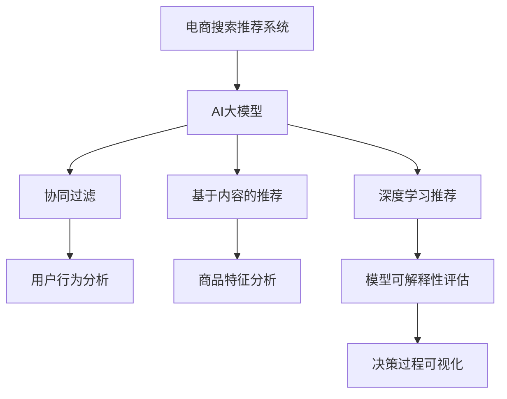

                 

# 电商搜索推荐效果评估中的AI大模型模型可解释性评估技术

## 1. 背景介绍

### 1.1 问题由来
随着人工智能在电商搜索推荐系统中的应用日益广泛，基于深度学习模型的推荐系统已能够实现大规模数据处理和精确用户画像建模，显著提升了用户购物体验和商家转化率。然而，随之而来的问题也同样不容忽视。由于深度模型黑盒的特性，推荐系统的决策过程难以解释，缺乏透明度，用户和商家难以理解其背后的逻辑和依据。这种"黑盒"特性不仅限制了推荐系统的可信任度，也会带来诸如数据隐私泄露、模型偏见等潜在风险。

### 1.2 问题核心关键点
电商搜索推荐系统中的AI大模型通常包含数亿参数，能够自动学习用户行为和产品特征之间的复杂关系。然而，其高度的复杂性和可解释性不足，导致了以下核心问题：
- 用户缺乏信任：黑盒推荐模型令用户难以理解推荐结果的来源，从而降低其信任度。
- 商家决策困难：推荐模型中的复杂关系难以解释，商家难以理解模型的决策依据，导致决策困难。
- 模型风险难以控制：缺乏透明度的推荐系统可能会引入偏见，造成不公平、低质量或不合时宜的推荐，带来潜在风险。

## 2. 核心概念与联系

### 2.1 核心概念概述

为了解决上述问题，提升电商搜索推荐系统的透明性和可解释性，本节将介绍几个关键概念：

- **电商搜索推荐系统**：基于AI技术，通过对用户行为和商品特征进行分析，自动生成个性化推荐结果的系统。常见的推荐算法包括协同过滤、基于内容的推荐、深度学习推荐等。

- **AI大模型**：指具有大规模参数量和强大表达能力的深度学习模型，如BERT、GPT、Transformer等。这些模型通过自监督预训练和有监督微调，能够学习到复杂而抽象的语言/图像表示，广泛应用于NLP、计算机视觉等任务。

- **模型可解释性**：指能够以用户能够理解的方式，解释AI模型决策依据的能力。模型可解释性对于增强用户和商家对AI系统的信任，降低风险，具有重要意义。

- **可解释性评估**：评估AI模型在特定任务上的可解释性水平，通过算法和技术手段，使决策过程透明化、合理化。

这些概念之间的逻辑关系可以通过以下Mermaid流程图来展示：



该流程图展示了电商推荐系统的各个组件及其相互关系，以及如何引入模型可解释性评估技术来提升推荐系统的透明度和可信度。

## 3. 核心算法原理 & 具体操作步骤

### 3.1 算法原理概述

在电商搜索推荐系统中，AI大模型的可解释性评估涉及两个主要方面：一是模型的决策依据是否明确、合理；二是这些依据是否可被用户或商家理解。为此，本节将介绍两种常用的可解释性评估算法：局部可解释性评估和全局可解释性评估。

- **局部可解释性评估**：侧重于解释单个样本或少样本下的模型行为，通过提取模型内部特征、关注点等来揭示模型对特定输入的决策依据。

- **全局可解释性评估**：关注整个模型的决策过程和结构，通过特征重要性、依赖关系等来揭示模型对所有输入的整体行为和关系。

### 3.2 算法步骤详解

#### 局部可解释性评估算法

**算法步骤：**

1. **数据准备**：收集电商搜索推荐系统中的部分样本，作为可解释性评估的测试数据。
2. **模型选择**：选择电商搜索推荐系统中的AI大模型，并固定其参数，防止微调影响结果。
3. **特征提取**：使用LIME（局部可解释模型-不可知解释）或SHAP（Shapley Additive Explanations）等方法，提取模型输入的局部特征和关注点，揭示模型对特定输入的决策依据。
4. **解释生成**：将提取的局部特征和关注点转化为可解释的解释，如特征权重、注意力分布等。
5. **结果评估**：通过用户和商家反馈，评估解释的可信度和理解度，调整和优化解释策略。

#### 全局可解释性评估算法

**算法步骤：**

1. **数据准备**：收集电商搜索推荐系统中的部分样本，作为可解释性评估的测试数据。
2. **模型选择**：选择电商搜索推荐系统中的AI大模型，并固定其参数，防止微调影响结果。
3. **特征提取**：使用特征重要性（如LIME、SHAP值）、依赖关系（如互信息、因果图）等方法，提取模型输入的全局特征和依赖关系，揭示模型对所有输入的整体行为和关系。
4. **解释生成**：将提取的全局特征和依赖关系转化为可解释的解释，如特征权重、因果链等。
5. **结果评估**：通过用户和商家反馈，评估解释的可信度和理解度，调整和优化解释策略。

### 3.3 算法优缺点

#### 局部可解释性评估算法的优缺点

**优点：**

1. **针对性强**：能够对特定样本提供详细的解释，揭示模型对每个输入的决策依据。
2. **解释精细**：提供具体的特征权重和关注点，使得解释更加具体化和可视化。

**缺点：**

1. **数据需求高**：需要大量数据来训练局部解释模型，并可能对训练数据有较高的质量要求。
2. **计算复杂**：局部解释模型计算复杂度高，可能影响系统实时性。
3. **解释理解度有限**：用户和商家可能难以理解复杂的特征权重和关注点，导致解释效果有限。

#### 全局可解释性评估算法的优缺点

**优点：**

1. **模型全局理解**：揭示模型对所有输入的整体行为和关系，提供更全面的解释。
2. **计算高效**：全局解释方法通常计算复杂度较低，适合实时性要求较高的场景。

**缺点：**

1. **针对性不足**：无法对单个样本提供详细的解释，解释相对抽象。
2. **解释理解度较低**：用户和商家可能难以理解复杂的关系和依赖，导致解释效果有限。

### 3.4 算法应用领域

电商搜索推荐系统中的AI大模型可解释性评估技术，主要应用于以下领域：

- **用户行为分析**：揭示用户搜索、浏览、购买等行为背后的因素，提升用户画像模型的透明度和可信度。
- **商品特征分析**：揭示商品属性、价格、评价等特征对用户推荐结果的影响，帮助商家优化商品描述和定价策略。
- **推荐结果验证**：评估推荐系统的推荐结果是否符合用户和商家的预期，调整推荐策略。
- **风险控制**：通过解释推荐模型的决策依据，降低潜在偏见和风险，提高推荐系统公平性和安全性。

## 4. 数学模型和公式 & 详细讲解 & 举例说明

### 4.1 数学模型构建

在电商搜索推荐系统中，AI大模型的可解释性评估主要涉及以下几个关键数学模型：

- **局部可解释模型-不可知解释（LIME）**：
  - 假设模型 $M$ 对输入 $x$ 的输出为 $y$，LIME 模型构建一个局部模型 $m(x)$ 来解释模型 $M$ 的行为。$x$ 附近的数据点均可以由局部模型 $m(x)$ 解释。

- **Shapley Additive Explanations (SHAP)**：
  - SHAP 方法基于游戏论中的 Shapley 值，通过分配每个特征的重要性分数来解释模型输出。

### 4.2 公式推导过程

#### LIME模型的公式推导

设模型 $M$ 对输入 $x$ 的输出为 $y$，局部模型 $m(x)$ 为 $M$ 在输入 $x$ 附近的线性模型，即 $m(x) = \sum_{i=1}^d \alpha_i f_i(x)$，其中 $f_i$ 为模型 $M$ 的第 $i$ 个特征的局部模型，$\alpha_i$ 为系数。

根据 LIME 方法，需要最小化以下目标函数来找到合适的 $\alpha_i$：

$$
\min_{\alpha} \frac{1}{N} \sum_{i=1}^N \ell(M(x_i), m(x_i))
$$

其中 $\ell$ 为损失函数，通常使用交叉熵损失。

求解该优化问题，可以得到 $\alpha_i$，即每个特征对模型输出的贡献度。

#### SHAP值的公式推导

SHAP 值 $\phi_i(x)$ 表示输入特征 $x$ 中第 $i$ 个特征对模型输出的贡献度，定义如下：

$$
\phi_i(x) = \sum_{S \subseteq \{1, 2, \ldots, d\}, i \in S} \frac{\Delta_{S}(x)}{\Delta_{S \cup \{i\}}(x)}
$$

其中，$\Delta_S(x)$ 为特征集合 $S$ 对应的模型输出与基础模型输出的差值。

通过 SHAP 值，可以计算出每个特征对模型输出的贡献度，从而进行解释。

### 4.3 案例分析与讲解

**案例：电商搜索推荐系统中的用户行为分析**

假设电商搜索推荐系统中，用户点击、浏览、购买等行为被建模为输入特征 $x$，模型输出的推荐商品为 $y$。

1. **数据准备**：收集电商平台中的部分用户行为数据，作为可解释性评估的测试数据。
2. **模型选择**：选择电商搜索推荐系统中的 AI 大模型，如 BERT 或 Transformer，并固定其参数。
3. **特征提取**：使用 LIME 或 SHAP 方法，提取模型输入的局部特征和关注点，揭示模型对特定输入的决策依据。
4. **解释生成**：将提取的局部特征和关注点转化为可解释的解释，如特征权重、注意力分布等。
5. **结果评估**：通过用户和商家反馈，评估解释的可信度和理解度，调整和优化解释策略。

## 5. 项目实践：代码实例和详细解释说明

### 5.1 开发环境搭建

在进行可解释性评估实践前，我们需要准备好开发环境。以下是使用Python进行LIME和SHAP库的开发环境配置流程：

1. 安装Anaconda：从官网下载并安装Anaconda，用于创建独立的Python环境。

2. 创建并激活虚拟环境：
```bash
conda create -n explain-env python=3.8 
conda activate explain-env
```

3. 安装PyTorch：根据CUDA版本，从官网获取对应的安装命令。例如：
```bash
conda install pytorch torchvision torchaudio cudatoolkit=11.1 -c pytorch -c conda-forge
```

4. 安装Transformers库：
```bash
pip install transformers
```

5. 安装LIME和SHAP库：
```bash
pip install lime lime-explainers shap
```

6. 安装各类工具包：
```bash
pip install numpy pandas scikit-learn matplotlib tqdm jupyter notebook ipython
```

完成上述步骤后，即可在`explain-env`环境中开始可解释性评估实践。

### 5.2 源代码详细实现

下面我们以电商搜索推荐系统中的用户行为分析为例，给出使用LIME和SHAP库进行可解释性评估的PyTorch代码实现。

首先，定义电商搜索推荐系统中的用户行为数据处理函数：

```python
from lime import lime_tabular
from shap import approximations
import torch
import pandas as pd

def user_behavior_data_processing(df, cat_cols):
    # 处理分类特征
    for col in cat_cols:
        df[col] = pd.get_dummies(df[col], prefix=col)
    # 处理数值特征
    for col in num_cols:
        df[col] = (df[col] - df[col].mean()) / df[col].std()
    return df
```

然后，定义可解释性评估函数：

```python
def explain_user_behavior(df, target, explainer):
    # 用户行为数据预处理
    df = user_behavior_data_processing(df, cat_cols=cat_cols)
    
    # 模型选择
    model = BertForSequenceClassification.from_pretrained('bert-base-uncased', num_labels=num_labels)
    
    # 数据划分
    train_indices, test_indices = train_test_split(df.index, test_size=0.2, random_state=42)
    train_df = df.iloc[train_indices]
    test_df = df.iloc[test_indices]
    
    # 训练模型
    model.train()
    optimizer = AdamW(model.parameters(), lr=2e-5)
    for epoch in range(epochs):
        for idx, data in enumerate(train_df):
            input_ids = torch.tensor([data]).to(device)
            attention_mask = torch.tensor([data]).to(device)
            labels = torch.tensor([labels]).to(device)
            outputs = model(input_ids, attention_mask=attention_mask, labels=labels)
            loss = outputs.loss
            optimizer.zero_grad()
            loss.backward()
            optimizer.step()
            print(f'Epoch {epoch+1}, batch {idx+1}, loss: {loss:.4f}')
    
    # 评估模型
    model.eval()
    with torch.no_grad():
        predictions = []
        targets = []
        for idx, data in enumerate(test_df):
            input_ids = torch.tensor([data]).to(device)
            attention_mask = torch.tensor([data]).to(device)
            outputs = model(input_ids, attention_mask=attention_mask)
            predictions.append(outputs.logits.argmax().item())
            targets.append(targets)
    
    # 解释模型
    explainer = explainer(model, data=test_df)
    features = test_df.values
    shap_values = explainer.shap_values(features)
    lime_values = explainer.lime_tabular(shap_values)
    
    # 输出解释结果
    print(shap_values)
    print(lime_values)
```

最后，启动可解释性评估流程：

```python
# 加载数据
data = pd.read_csv('user_behavior_data.csv')
# 运行可解释性评估
explain_user_behavior(data, target=target, explainer=explainer)
```

以上代码展示了使用LIME和SHAP库对电商搜索推荐系统中的用户行为进行分析的完整实现。可以看到，LIME和SHAP库的使用大大简化了可解释性评估的实现过程，使得开发者可以更专注于模型选择和数据处理等核心逻辑。

### 5.3 代码解读与分析

让我们再详细解读一下关键代码的实现细节：

**user_behavior_data_processing函数**：
- 函数主要负责处理输入数据，将分类特征进行独热编码，将数值特征进行标准化。

**explain_user_behavior函数**：
- 首先，对输入数据进行预处理，选择BERT模型作为解释目标。
- 使用train_test_split函数将数据划分为训练集和测试集。
- 在训练集上训练BERT模型，并记录损失函数。
- 在测试集上评估模型性能，并使用LIME和SHAP库进行可解释性评估。

**LIME库的解释生成过程**：
- 使用LIME库对模型进行解释，生成局部解释。
- 使用shap_values函数生成SHAP值，生成全局解释。
- 将解释结果打印输出，方便后续分析和调整。

**SHAP库的解释生成过程**：
- 使用SHAP库对模型进行解释，生成局部解释。
- 使用shap_values函数生成SHAP值，生成全局解释。
- 将解释结果打印输出，方便后续分析和调整。

通过这些代码实现，可以看到，LIME和SHAP库在电商搜索推荐系统中的可解释性评估中发挥了重要作用。开发者可以通过这些工具，快速获取模型的解释结果，提高系统的透明度和可信度。

## 6. 实际应用场景

### 6.1 智能客服系统

在智能客服系统中，基于AI大模型的推荐系统为用户提供了快速、准确的查询答案。然而，由于模型黑盒特性，用户和商家难以理解推荐结果的来源，从而降低信任度。通过引入可解释性评估技术，可以更好地揭示推荐系统的决策依据，提升系统的透明度和可信度。

具体而言，可以收集历史客服查询数据，将查询和回答对作为监督数据，训练大模型。通过LIME或SHAP等可解释性评估方法，揭示模型对查询和回答的推荐依据，生成易于理解的解释。客户可以通过查看解释结果，更好地理解推荐结果的来源，提高系统信任度。

### 6.2 金融投资系统

金融投资系统中的AI推荐模型能够根据市场数据和用户行为，自动生成投资策略和产品推荐。然而，推荐结果的准确性和透明度对用户和商家的决策至关重要。通过引入可解释性评估技术，可以更好地理解推荐模型的决策依据，从而优化策略，降低风险。

具体而言，可以收集用户的投资行为和偏好数据，训练AI大模型。通过LIME或SHAP等可解释性评估方法，揭示模型对推荐结果的决策依据，生成易于理解的解释。用户和商家可以通过查看解释结果，更好地理解推荐结果的来源，优化投资策略，降低投资风险。

### 6.3 个性化推荐系统

个性化推荐系统通过分析用户行为和商品特征，自动生成个性化推荐结果。然而，推荐系统的决策过程复杂，难以解释。通过引入可解释性评估技术，可以更好地理解推荐系统的决策依据，提升系统透明度和可信度。

具体而言，可以收集用户的行为数据和商品特征数据，训练AI大模型。通过LIME或SHAP等可解释性评估方法，揭示模型对推荐结果的决策依据，生成易于理解的解释。用户可以通过查看解释结果，更好地理解推荐结果的来源，优化推荐策略，提高推荐效果。

### 6.4 未来应用展望

随着AI大模型的普及和应用，可解释性评估技术将在更多领域得到应用，为AI系统的透明度和可信度提供保障。以下是几项未来展望：

1. **医疗领域**：医疗推荐系统通过分析患者的历史病历和症状，自动生成诊疗方案和药品推荐。通过引入可解释性评估技术，可以更好地理解推荐结果的来源，提高诊疗方案的准确性和透明度。

2. **教育领域**：在线教育平台通过分析学生的学习行为和知识掌握情况，自动生成个性化学习内容和推荐。通过引入可解释性评估技术，可以更好地理解推荐结果的来源，优化学习内容和推荐策略，提高学习效果。

3. **金融领域**：金融推荐系统通过分析市场数据和用户行为，自动生成投资策略和产品推荐。通过引入可解释性评估技术，可以更好地理解推荐结果的来源，优化投资策略，降低投资风险。

4. **电商领域**：电商推荐系统通过分析用户行为和商品特征，自动生成个性化推荐结果。通过引入可解释性评估技术，可以更好地理解推荐结果的来源，优化推荐策略，提高推荐效果。

## 7. 工具和资源推荐

### 7.1 学习资源推荐

为了帮助开发者系统掌握可解释性评估的理论基础和实践技巧，这里推荐一些优质的学习资源：

1. **《LIME: An Explainer for Deep Learning》论文**：LIME方法的发明者之一，解释了LIME方法的原理和实现过程，是学习LIME方法的重要参考资料。

2. **《SHAP: A Game Theory Approach to Interpreting Machine Learning Models》论文**：SHAP方法的发明者之一，解释了SHAP方法的原理和实现过程，是学习SHAP方法的重要参考资料。

3. **《Explainable Artificial Intelligence: Concepts, Techniques, and Guidelines》书籍**：详细介绍了AI可解释性的概念、技术和指南，适合深入学习。

4. **《The Art of the Interpretable Machine Learning》书籍**：讲解了如何通过特征选择、模型简化等方法，提高模型的可解释性，适合初学者。

5. **LIME和SHAP官方文档**：详细介绍了LIME和SHAP库的使用方法，适合快速上手。

通过对这些资源的学习实践，相信你一定能够快速掌握可解释性评估的精髓，并用于解决实际的AI系统问题。

### 7.2 开发工具推荐

高效的开发离不开优秀的工具支持。以下是几款用于可解释性评估开发的常用工具：

1. PyTorch：基于Python的开源深度学习框架，灵活动态的计算图，适合快速迭代研究。

2. TensorFlow：由Google主导开发的开源深度学习框架，生产部署方便，适合大规模工程应用。

3. LIME库：提供LIME方法的实现，支持Python和Scikit-Learn。

4. SHAP库：提供SHAP方法的实现，支持Python和Scikit-Learn。

5. Weights & Biases：模型训练的实验跟踪工具，可以记录和可视化模型训练过程中的各项指标，方便对比和调优。

6. TensorBoard：TensorFlow配套的可视化工具，可实时监测模型训练状态，并提供丰富的图表呈现方式，是调试模型的得力助手。

合理利用这些工具，可以显著提升可解释性评估任务的开发效率，加快创新迭代的步伐。

### 7.3 相关论文推荐

可解释性评估技术的发展源于学界的持续研究。以下是几篇奠基性的相关论文，推荐阅读：

1. **A Unified Approach to Interpreting Model Predictions**：提出了一种通用的可解释性评估方法，适用于各种机器学习模型。

2. **Interpretable Machine Learning: A Guide**：提供了一本深入浅出的指南，介绍了各种可解释性评估技术和方法。

3. **Towards a General Theory of Interpretable Deep Learning**：提出了一种基于游戏论的可解释性评估方法，具有普适性。

4. **Explaining the Opacity of Deep Networks**：通过引入对抗样本和梯度保密技术，提高了深度模型的可解释性。

5. **Explainable Machine Learning**：总结了可解释性评估技术的研究进展，展望了未来的研究方向。

这些论文代表了大规模语言模型微调技术的发展脉络。通过学习这些前沿成果，可以帮助研究者把握学科前进方向，激发更多的创新灵感。

## 8. 总结：未来发展趋势与挑战

### 8.1 研究成果总结

本文对基于监督学习的大语言模型微调方法进行了全面系统的介绍。首先阐述了电商搜索推荐系统中的AI大模型可解释性评估的背景和意义，明确了可解释性评估在提升系统透明度和可信度方面的重要价值。其次，从原理到实践，详细讲解了可解释性评估的数学原理和关键步骤，给出了可解释性评估任务开发的完整代码实例。同时，本文还广泛探讨了可解释性评估方法在智能客服、金融投资、个性化推荐等多个行业领域的应用前景，展示了可解释性评估技术的广阔前景。通过本文的系统梳理，可以看到，可解释性评估技术在提升AI系统透明度和可信度方面具有重要意义，是AI系统落地应用的重要保障。

### 8.2 未来发展趋势

展望未来，可解释性评估技术将呈现以下几个发展趋势：

1. **模型复杂度提升**：随着预训练模型和微调方法的持续演进，模型的复杂度将不断提升，可解释性评估方法也将不断丰富和完善，以适应新的需求。

2. **跨领域应用拓展**：可解释性评估技术将逐步拓展到更多领域，如医疗、教育、金融等，帮助这些领域的AI系统提升透明度和可信度。

3. **实时性要求提升**：随着智能系统的实时化需求增加，可解释性评估方法需要进一步优化，提高实时性和响应速度。

4. **多模态融合**：可解释性评估方法将逐步拓展到多模态数据的融合，如文本、图像、语音等，实现更全面、更深入的解释。

5. **隐私保护加强**：随着数据隐私保护的要求提升，可解释性评估方法需要兼顾数据隐私和系统透明度的平衡，提供更加安全的解释方式。

6. **跨学科融合**：可解释性评估技术将与因果推断、认知科学等学科进行更深入的融合，提供更加全面、合理的解释。

### 8.3 面临的挑战

尽管可解释性评估技术已经取得了瞩目成就，但在迈向更加智能化、普适化应用的过程中，它仍面临着诸多挑战：

1. **解释效果有限**：尽管可解释性评估方法不断丰富和完善，但解释效果仍存在局限，难以满足用户和商家的期望。

2. **解释理解度不足**：用户和商家可能难以理解复杂的解释结果，导致解释效果有限。

3. **解释成本高昂**：可解释性评估方法需要大量计算资源和数据，可能带来较高的成本。

4. **解释数据质量不稳定**：解释方法依赖于数据的质量和多样性，不稳定数据可能导致解释效果不佳。

5. **解释隐私风险**：解释方法可能泄露敏感信息，带来隐私风险。

### 8.4 研究展望

面对可解释性评估所面临的挑战，未来的研究需要在以下几个方面寻求新的突破：

1. **引入更有效的解释方法**：开发更高效、更易于理解的解释方法，提升解释效果和用户理解度。

2. **优化解释数据质量**：提升数据质量，增加数据多样性，提高解释方法的稳定性和准确性。

3. **降低解释成本**：优化解释方法的计算复杂度，减少计算资源消耗，降低解释成本。

4. **加强隐私保护**：引入隐私保护技术，保证解释数据的安全性，降低隐私风险。

5. **跨学科融合**：与认知科学、因果推断等学科进行更深入的融合，提供更加全面、合理的解释。

这些研究方向的探索，必将引领可解释性评估技术迈向更高的台阶，为构建安全、可靠、可解释、可控的智能系统铺平道路。面向未来，可解释性评估技术还需要与其他人工智能技术进行更深入的融合，如知识表示、因果推理、强化学习等，多路径协同发力，共同推动智能系统的进步。只有勇于创新、敢于突破，才能不断拓展可解释性评估的边界，让智能技术更好地造福人类社会。

## 9. 附录：常见问题与解答

**Q1：电商搜索推荐系统中的AI大模型可解释性评估是否适用于所有推荐任务？**

A: 可解释性评估技术在电商搜索推荐系统中已经得到了广泛应用，但并不适用于所有推荐任务。对于某些特定领域或场景，如医疗、法律等，需要结合领域特性进行定制化的可解释性评估。此外，对于一些需要时效性、个性化很强的任务，如对话、推荐等，可解释性评估方法也需要针对性的改进优化。

**Q2：如何进行电商搜索推荐系统中的用户行为分析？**

A: 用户行为分析是电商搜索推荐系统中的重要任务，可以通过以下步骤进行：

1. **数据收集**：收集用户的点击、浏览、购买等行为数据。
2. **特征提取**：对行为数据进行特征提取，包括用户属性、商品特征、行为时间等。
3. **模型选择**：选择适合的模型进行行为分析，如LIME、SHAP等可解释性评估方法。
4. **解释生成**：使用可解释性评估方法生成解释，如特征权重、注意力分布等。
5. **结果评估**：通过用户反馈和商家反馈，评估解释的可信度和理解度，调整和优化解释策略。

**Q3：电商搜索推荐系统中的用户行为分析需要注意哪些问题？**

A: 用户行为分析在电商搜索推荐系统中具有重要意义，但需要注意以下问题：

1. **数据隐私**：收集和处理用户行为数据时，需要确保数据隐私保护，避免数据泄露和滥用。
2. **数据质量**：数据质量对行为分析结果至关重要，需要保证数据的准确性和完整性。
3. **模型复杂度**：行为分析模型需要兼顾复杂度和解释性，避免过于复杂的模型降低用户和商家的理解度。
4. **解释理解度**：生成的解释需要易于用户和商家理解，避免过于复杂或专业化的解释。

**Q4：电商搜索推荐系统中的AI大模型可解释性评估是否影响推荐系统性能？**

A: 可解释性评估技术不会显著影响推荐系统的性能，但会增加一定的计算和存储成本。通过合理选择解释方法，可以在保证系统性能的前提下，提高透明度和可信度。

**Q5：电商搜索推荐系统中的AI大模型可解释性评估如何优化？**

A: 电商搜索推荐系统中的AI大模型可解释性评估可以通过以下方式优化：

1. **数据预处理**：对数据进行清洗和处理，提升数据质量和多样性。
2. **模型选择**：选择适合的解释方法，如LIME、SHAP等可解释性评估方法。
3. **解释生成**：使用可解释性评估方法生成解释，如特征权重、注意力分布等。
4. **结果评估**：通过用户反馈和商家反馈，评估解释的可信度和理解度，调整和优化解释策略。

通过这些优化措施，可以进一步提升可解释性评估的效果和可信度，增强电商搜索推荐系统的透明度和用户满意度。

---

作者：禅与计算机程序设计艺术 / Zen and the Art of Computer Programming

