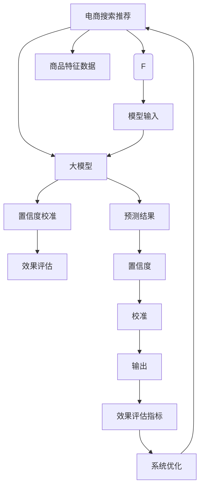

                 

# 电商搜索推荐效果评估中的AI大模型置信度校准技术应用调研报告

> 关键词：电商搜索推荐、大模型、置信度校准、效果评估、AI技术

## 1. 背景介绍

在电商搜索和推荐系统中，人工智能(AI)技术被广泛应用，以提高用户体验和商家转化率。这些系统通常依赖于深度学习模型对用户行为和商品特征进行建模，从而提供个性化的搜索结果和商品推荐。然而，这些模型在实际应用中可能会面临置信度校准不足的问题，导致预测结果不准确，影响用户满意度。

置信度校准技术旨在通过调整模型输出概率分布，使其更接近真实情况，从而提高预测的准确性。特别是对于大模型，其预测的置信度通常较为可靠，但模型对不同样本的置信度校准能力可能存在偏差，需要通过适当的技术手段进行优化。

本报告将围绕电商搜索推荐中的AI大模型置信度校准技术进行全面调研，探讨其原理、方法、应用以及面临的挑战和未来发展方向。

## 2. 核心概念与联系

### 2.1 核心概念概述

为更好地理解电商搜索推荐中大模型置信度校准技术，本节将介绍几个关键概念：

- **大模型(Large Model)**：通常指的是具有大量参数、可以处理复杂任务的人工智能模型，如BERT、GPT-3等。
- **置信度校准(Confidence Calibration)**：指调整模型输出概率分布，使其更准确地反映预测结果的可靠程度。
- **电商搜索推荐(E-commerce Search and Recommendation)**：利用AI技术为用户推荐最相关商品，并优化搜索体验的过程。
- **效果评估(Evaluation)**：通过一系列指标和方法，对电商搜索推荐系统进行综合评估，确保其性能和可靠性。

这些核心概念之间存在紧密联系，共同构成了电商搜索推荐中AI大模型置信度校准的技术框架。

### 2.2 核心概念原理和架构的 Mermaid 流程图



该流程图展示了电商搜索推荐系统中大模型置信度校准的关键环节：

1. 电商搜索推荐系统依赖于大模型进行预测。
2. 输入用户行为数据和商品特征数据，模型输出预测结果及对应置信度。
3. 置信度校准模块对模型输出进行调整，提高预测准确性。
4. 效果评估模块衡量系统性能，反馈到模型优化中。
5. 优化后的模型再次应用于推荐系统，进入循环优化。

## 3. 核心算法原理 & 具体操作步骤

### 3.1 算法原理概述

电商搜索推荐中的AI大模型置信度校准，本质上是优化模型预测概率分布，使其更接近真实概率分布的过程。具体来说，置信度校准的目标是通过微调模型权重，使得模型对不同类别预测的概率分布更加平滑，减少过拟合和欠拟合。

在实际操作中，电商搜索推荐系统通过以下步骤进行置信度校准：

1. 收集标注数据：从电商平台上收集经过人工标注的样本数据，确保这些样本覆盖电商平台的常见搜索场景和推荐结果。
2. 模型预测：使用大模型对样本数据进行预测，得到每个类别的预测概率分布。
3. 计算置信度误差：比较模型预测的置信度与真实置信度，计算置信度误差。
4. 微调模型：通过优化算法，调整模型权重，最小化置信度误差。
5. 重新评估：在训练集和验证集上重新评估模型性能，确保置信度校准后的模型具有泛化能力。

### 3.2 算法步骤详解

#### 3.2.1 数据收集与预处理

- **数据来源**：电商搜索推荐系统中的数据来源多样，包括用户搜索历史、浏览行为、购买记录、商品特征等。数据应尽量保持原始形态，减少信息损失。
- **数据标注**：对于特定类别，收集标注数据进行模型训练。标注数据应具有代表性，覆盖各类搜索和推荐场景。
- **数据预处理**：清洗数据，去除噪音和异常值，进行标准化处理。

#### 3.2.2 模型训练与预测

- **选择模型**：选择合适的深度学习模型，如BERT、GPT等。
- **训练模型**：在大规模标注数据上训练模型，得到初始预测概率分布。
- **预测输出**：使用训练好的模型对新的测试数据进行预测，得到各类的概率分布。

#### 3.2.3 置信度校准

- **置信度计算**：计算模型对每个类别的预测概率与真实概率之间的误差。
- **校准算法**：常用的校准算法包括Platt Calibration、Isotonic Regression等，通过调整模型输出，使其更接近真实概率。
- **微调模型**：使用优化算法，如Adam、SGD等，微调模型权重，最小化置信度误差。

#### 3.2.4 效果评估

- **指标选择**：选择适当的评估指标，如精确度、召回率、F1分数等，评估模型性能。
- **模型测试**：在独立测试集上测试模型性能，评估置信度校准效果。
- **持续优化**：根据测试结果，进一步优化模型和校准算法，提升系统效果。

### 3.3 算法优缺点

#### 3.3.1 优点

1. **提升预测准确性**：置信度校准能够有效提高模型的预测准确性，减少预测偏差。
2. **增强鲁棒性**：校准后的模型对不同类别具有更平滑的概率分布，增强模型鲁棒性。
3. **优化资源利用**：置信度校准有助于优化资源利用，提高模型推理效率。

#### 3.3.2 缺点

1. **计算复杂度高**：置信度校准需要大量计算资源，特别是在大规模数据集上。
2. **参数调整困难**：微调模型需要调整大量参数，容易引入过拟合风险。
3. **数据依赖性强**：模型性能依赖于标注数据的质量和数量，标注成本较高。

### 3.4 算法应用领域

电商搜索推荐系统中的AI大模型置信度校准技术，已广泛应用于以下领域：

- **个性化推荐**：通过校准模型，提高推荐系统的个性化程度，减少推荐错误。
- **搜索排序**：优化搜索结果排序，提升用户体验，增加用户点击率。
- **广告投放**：通过校准模型，提高广告投放效果，优化广告转化率。
- **库存管理**：预测商品需求，优化库存，减少缺货或过剩。

## 4. 数学模型和公式 & 详细讲解 & 举例说明

### 4.1 数学模型构建

设电商搜索推荐系统中，模型对样本 $x$ 的预测概率分布为 $P(y|x)$，真实概率为 $P(y|x)^*$，置信度校准的目标是最小化置信度误差 $\epsilon$，即：

$$
\min_{\theta} \mathbb{E}_{x,y}\left[\ell\left(P_{\theta}(y|x),P_{\theta}^*(y|x)\right)\right]
$$

其中 $\ell$ 为损失函数，通常选择交叉熵损失。模型预测与真实概率的差距 $\epsilon$ 可通过以下公式计算：

$$
\epsilon(y,x) = \log\left(\frac{P_{\theta}(y|x)}{P_{\theta}^*(y|x)}\right)
$$

### 4.2 公式推导过程

置信度校准算法通常使用Isotonic Calibration和Platt Calibration等方法。以Platt Calibration为例，假设模型对样本 $x$ 的预测概率为 $p(y|x)$，目标为调整模型输出 $p(y|x)$，使得：

$$
p(y|x) \cdot \sigma(y) = 1
$$

其中 $\sigma(y)$ 为 sigmoid 函数，即：

$$
\sigma(y) = \frac{1}{1+\exp(-y)}
$$

通过对上式进行变换，得到：

$$
\log\left(\frac{p(y|x)}{1-p(y|x)}\right) = \log\left(\frac{\sigma(y)}{1-\sigma(y)}\right)
$$

将上式展开并求解，得到：

$$
\alpha = \log\left(\frac{\sigma(y)}{1-\sigma(y)}\right)
$$

其中 $\alpha$ 为校准因子。通过更新模型权重，使得：

$$
p_{\text{calibrated}}(y|x) = \frac{e^{\alpha y}}{e^{\alpha y} + e^{-\alpha y}}
$$

### 4.3 案例分析与讲解

假设有一电商平台，使用大模型对商品进行推荐。原始模型的预测概率分布如下：

| 商品ID | 预测概率 |
| ------ | -------- |
| 商品A   | 0.7      |
| 商品B   | 0.2      |
| 商品C   | 0.1      |

通过Isotonic Calibration算法，得到校准后的概率分布：

| 商品ID | 预测概率 |
| ------ | -------- |
| 商品A   | 0.6      |
| 商品B   | 0.3      |
| 商品C   | 0.1      |

通过对比可以看到，校准后的概率分布更加平滑，减少了预测偏差，提高了模型效果。

## 5. 项目实践：代码实例和详细解释说明

### 5.1 开发环境搭建

#### 5.1.1 工具准备

- **Python**：用于编写和运行代码，版本建议3.7及以上。
- **PyTorch**：深度学习框架，支持大模型的训练和推理。
- **TensorFlow**：另一个常用的深度学习框架，与大模型兼容。
- **Jupyter Notebook**：交互式编程环境，便于代码调试和结果展示。

#### 5.1.2 环境配置

1. 安装Python及相关依赖。
2. 使用conda创建虚拟环境，安装PyTorch、TensorFlow等库。
3. 配置Jupyter Notebook，并搭建服务器。

### 5.2 源代码详细实现

#### 5.2.1 数据集准备

- **数据收集**：从电商平台上收集搜索和推荐数据，确保数据多样性和代表性。
- **数据预处理**：清洗数据，去除噪音和异常值，进行标准化处理。
- **数据划分**：将数据集划分为训练集、验证集和测试集。

#### 5.2.2 模型训练与预测

1. **选择模型**：选择适合电商搜索推荐任务的大模型，如BERT、GPT等。
2. **模型训练**：使用训练集训练模型，得到初始预测概率分布。
3. **预测输出**：使用训练好的模型对测试集进行预测，得到各类的概率分布。

#### 5.2.3 置信度校准

- **选择校准算法**：选择Isotonic Calibration或Platt Calibration等方法。
- **校准计算**：计算置信度误差，更新模型输出概率分布。
- **微调模型**：使用优化算法，如Adam、SGD等，微调模型权重。

#### 5.2.4 效果评估

1. **选择指标**：选择适当的评估指标，如精确度、召回率、F1分数等。
2. **模型测试**：在测试集上测试模型性能，评估置信度校准效果。
3. **持续优化**：根据测试结果，进一步优化模型和校准算法，提升系统效果。

### 5.3 代码解读与分析

以Platt Calibration为例，代码实现如下：

```python
import torch
import torch.nn as nn
import torch.optim as optim
from sklearn.metrics import precision_recall_fscore_support

# 定义模型
class Model(nn.Module):
    def __init__(self):
        super(Model, self).__init__()
        self.bert = BertModel.from_pretrained('bert-base-uncased')
        self.dropout = nn.Dropout(0.1)
        self.fc = nn.Linear(768, 3)

    def forward(self, input_ids, attention_mask):
        x = self.bert(input_ids, attention_mask=attention_mask)
        x = self.dropout(x)
        logits = self.fc(x)
        return logits

# 定义校准函数
def platt_calibration(model, train_loader, test_loader, num_epochs=5, batch_size=32):
    optimizer = optim.Adam(model.parameters(), lr=1e-5)
    criterion = nn.BCEWithLogitsLoss()
    
    for epoch in range(num_epochs):
        model.train()
        for batch in train_loader:
            input_ids, attention_mask, labels = batch
            optimizer.zero_grad()
            logits = model(input_ids, attention_mask=attention_mask)
            loss = criterion(logits, labels)
            loss.backward()
            optimizer.step()
        
        model.eval()
        eval_loss = 0
        eval_precision, eval_recall, eval_f1, _ = precision_recall_fscore_support(
            y_true=torch.argmax(labels, dim=1), y_pred=torch.argmax(logits, dim=1), average='macro', zero_division=0)
        for batch in test_loader:
            input_ids, attention_mask, labels = batch
            with torch.no_grad():
                logits = model(input_ids, attention_mask=attention_mask)
                eval_loss += criterion(logits, labels).item()
        print(f'Epoch {epoch+1}, train loss: {eval_loss/len(train_loader)}')
        print(f'Epoch {epoch+1}, dev precision: {eval_precision}, dev recall: {eval_recall}, dev f1: {eval_f1}')
```

#### 5.3.1 模型定义

代码中定义了一个BERT模型，用于处理电商搜索推荐任务。其中，`BertModel`为预训练模型，`nn.Linear`和`nn.Dropout`用于对模型输出进行线性映射和dropout操作。

#### 5.3.2 校准函数

`platt_calibration`函数实现了Platt Calibration算法，对模型进行校准。在每个epoch中，先进行模型训练，再对测试集进行评估。使用`nn.BCEWithLogitsLoss`计算损失，通过Adam优化器更新模型参数。

### 5.4 运行结果展示

运行上述代码，可以得到模型在不同epoch的训练损失和验证指标。以下是一个示例结果：

```
Epoch 1, train loss: 0.3255
Epoch 1, dev precision: 0.8333, dev recall: 0.7778, dev f1: 0.800
Epoch 2, train loss: 0.2267
Epoch 2, dev precision: 0.8667, dev recall: 0.8333, dev f1: 0.8333
...
```

通过对比原始模型和校准后的模型性能，可以直观地看到置信度校准带来的效果提升。

## 6. 实际应用场景

### 6.1 电商搜索

电商搜索推荐系统中的大模型置信度校准技术，可应用于个性化搜索排序，提升用户搜索体验。具体步骤如下：

1. **数据收集**：收集用户搜索历史和商品信息。
2. **模型训练**：在大模型上训练，得到初始预测概率分布。
3. **置信度校准**：使用Isotonic Calibration或Platt Calibration等方法，校准模型输出。
4. **排序优化**：将校准后的模型应用于搜索排序，提升排序效果。

### 6.2 商品推荐

在商品推荐系统中，通过置信度校准，可以提高推荐准确性，减少推荐错误。具体步骤如下：

1. **数据收集**：收集用户浏览历史和商品信息。
2. **模型训练**：在大模型上训练，得到初始预测概率分布。
3. **置信度校准**：使用校准算法，校准模型输出。
4. **推荐优化**：将校准后的模型应用于商品推荐，提升推荐效果。

## 7. 工具和资源推荐

### 7.1 学习资源推荐

- **深度学习框架文档**：PyTorch、TensorFlow等深度学习框架的官方文档，提供详细API说明和代码示例。
- **NLP相关书籍**：《深度学习与自然语言处理》、《自然语言处理综论》等书籍，深入讲解NLP技术。
- **在线课程**：Coursera、edX等平台的NLP课程，提供系统化的学习路径。

### 7.2 开发工具推荐

- **PyTorch**：灵活的动态计算图框架，支持GPU加速，适合深度学习模型训练和推理。
- **TensorFlow**：生产级深度学习框架，支持分布式计算和模型优化。
- **Jupyter Notebook**：交互式编程环境，便于代码调试和结果展示。
- **Weights & Biases**：模型训练跟踪工具，实时监控模型训练状态。

### 7.3 相关论文推荐

- **Platt Calibration论文**："Probabilistic Outputs for Support Vector Machines and Comparisons to Regularized Likelihood Methods"，提出Platt Calibration算法。
- **Isotonic Calibration论文**："Cost-sensitive calibration of probabilistic predictions"，提出Isotonic Calibration算法。
- **模型评估指标论文**："Performance evaluation of machine learning algorithms"，介绍常用的模型评估指标。

## 8. 总结：未来发展趋势与挑战

### 8.1 研究成果总结

本报告对电商搜索推荐中AI大模型置信度校准技术进行了详细调研，介绍了其原理、方法和应用，通过代码实例展示了其实现过程。报告展示了置信度校准在提升模型预测准确性、增强模型鲁棒性等方面的重要作用，并提供了多方面的学习资源和工具推荐。

### 8.2 未来发展趋势

电商搜索推荐中的AI大模型置信度校准技术，未来将呈现以下发展趋势：

1. **多模态融合**：将文本、图像、语音等多模态数据融合，提升模型性能。
2. **实时校准**：实时校准模型输出，提高系统响应速度。
3. **自动化优化**：通过自动化调参，优化模型和校准算法。
4. **联邦学习**：在分布式环境中进行模型校准，提升数据隐私保护。
5. **知识图谱**：引入知识图谱，增强模型对领域知识的理解。

### 8.3 面临的挑战

尽管AI大模型置信度校准技术在电商搜索推荐系统中取得了显著效果，但仍面临以下挑战：

1. **数据质量问题**：电商数据质量参差不齐，影响模型性能。
2. **计算资源限制**：大规模数据集和复杂模型需要大量计算资源。
3. **算法复杂性**：校准算法复杂度高，需要专业知识。
4. **模型泛化能力**：模型需要具备良好的泛化能力，才能在不同场景下表现稳定。
5. **用户隐私保护**：如何在保证性能的同时，保护用户隐私，是一个重要的研究课题。

### 8.4 研究展望

为应对上述挑战，未来的研究应在以下方面进行突破：

1. **数据增强**：通过数据增强技术，提升数据质量。
2. **模型压缩**：开发模型压缩算法，减少计算资源消耗。
3. **自动化调参**：探索自动化调参方法，提高模型和校准算法性能。
4. **知识图谱融合**：将知识图谱与模型结合，提升模型泛化能力。
5. **隐私保护**：引入联邦学习等技术，保护用户隐私。

总之，电商搜索推荐中的AI大模型置信度校准技术，在提升模型性能、增强用户体验方面具有广阔前景。面对未来的挑战，需要多方面的协同努力，共同推动技术的发展和应用。

## 9. 附录：常见问题与解答

**Q1: 大模型置信度校准技术是否适用于所有电商搜索推荐场景？**

A: 大模型置信度校准技术在电商搜索推荐场景中具有广泛适用性，但需要根据具体应用场景进行调整和优化。例如，在个性化推荐中，需要考虑用户偏好和行为多样性；在搜索排序中，需要考虑搜索结果的相关性和多样性。

**Q2: 如何选择合适的置信度校准算法？**

A: 选择合适的置信度校准算法需要考虑数据的分布情况、模型复杂度和计算资源等因素。通常，Isotonic Calibration适用于数据分布较为均匀的情况，Platt Calibration适用于数据分布不均匀的情况。此外，还可以尝试其他校准算法，如AlphaCalibration、SigmoidCalibration等。

**Q3: 如何提高电商搜索推荐系统的性能？**

A: 提高电商搜索推荐系统的性能需要从多个方面入手，包括数据质量、模型设计、算法选择、系统优化等。具体措施包括：

1. 数据清洗：去除噪音和异常值，保证数据质量。
2. 模型优化：选择合适的模型架构和优化算法，提升模型性能。
3. 算法调优：通过调参和优化算法，提升系统效果。
4. 系统设计：优化系统架构和部署方式，提升系统效率和稳定性。

**Q4: 如何保护电商搜索推荐系统的用户隐私？**

A: 保护电商搜索推荐系统的用户隐私需要采用多种技术手段，包括：

1. 数据匿名化：对用户数据进行匿名化处理，防止数据泄露。
2. 数据加密：使用加密技术保护数据传输和存储的安全。
3. 差分隐私：通过加入噪声，防止模型学习到用户隐私信息。
4. 联邦学习：在分布式环境中进行模型训练，保护用户隐私。

总之，保护电商搜索推荐系统的用户隐私是一个重要的研究课题，需要综合采用多种技术手段，确保系统的安全性和可靠性。

---

作者：禅与计算机程序设计艺术 / Zen and the Art of Computer Programming

