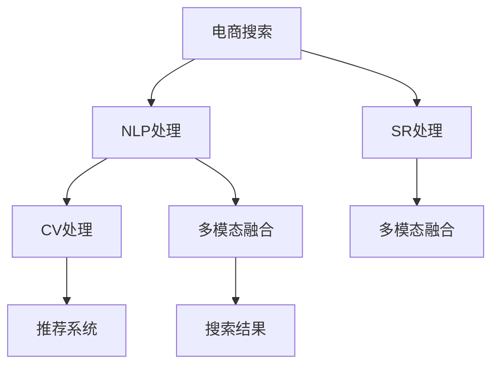

                 

# 电商搜索的多模态融合：AI大模型的新突破

> 关键词：电商搜索,多模态融合,大语言模型,推荐系统,自然语言处理,NLP

## 1. 背景介绍

### 1.1 问题由来
电商搜索是电商平台的核心功能之一，用户通过搜索输入关键词或问题，平台返回符合要求的商品或信息。随着用户需求的多样化，传统关键词匹配和图片浏览方式已难以满足搜索需求。近年来，电商搜索已逐步向多模态融合方向演进，即通过整合文本、图像、语音等多种信息形式，提升搜索体验和结果相关性。AI大模型的出现，为电商搜索的多模态融合带来了新的机遇。

### 1.2 问题核心关键点
电商搜索的多模态融合旨在通过自然语言处理(NLP)、计算机视觉(CV)、语音识别(SR)等技术，融合多种信息，提供更丰富、更精确的搜索结果。AI大模型作为通用多模态表示学习器，具备强大的多模态信息处理能力，是电商搜索多模态融合的关键技术支撑。

## 2. 核心概念与联系

### 2.1 核心概念概述

为更好地理解电商搜索的多模态融合，本节将介绍几个密切相关的核心概念：

- 电商搜索：用户通过搜索输入关键词或问题，平台返回符合要求的商品或信息。
- 多模态融合：整合文本、图像、语音等多种信息形式，提升搜索体验和结果相关性。
- 自然语言处理(NLP)：通过文本理解、生成、翻译等技术，实现文本信息的处理和分析。
- 计算机视觉(CV)：通过图像识别、图像生成、图像分析等技术，实现图像信息的处理和分析。
- 语音识别(SR)：将语音信号转换为文本，实现语音信息的处理和分析。
- AI大模型：以自回归(如GPT)或自编码(如BERT)模型为代表的大规模预训练语言模型。通过在大规模无标签文本语料上进行预训练，学习通用的语言表示，具备强大的语言理解和生成能力。

这些核心概念之间的逻辑关系可以通过以下Mermaid流程图来展示：



这个流程图展示了大语言模型在电商搜索多模态融合中的核心作用：

1. 电商搜索从用户输入关键词或问题开始。
2. 通过NLP处理提取文本信息，转化为模型输入。
3. 通过CV处理提取图像信息，转化为模型输入。
4. 通过SR处理提取语音信息，转化为模型输入。
5. 多模态融合模块将这些信息进行整合，形成统一的表示形式。
6. 推荐系统根据融合后的多模态信息，返回最相关的商品或信息。

## 3. 核心算法原理 & 具体操作步骤
### 3.1 算法原理概述

电商搜索的多模态融合算法旨在通过AI大模型，将用户输入的文本、图像、语音等多种信息形式，转化为统一的语义表示，提升搜索结果的相关性和准确性。其核心思想是：利用大模型强大的多模态信息处理能力，将不同模态的信息，转化为共享的语义空间，然后通过推荐系统对搜索结果进行排序。

形式化地，假设大模型为 $M_{\theta}$，输入为 $x=(\text{text}, \text{image}, \text{audio})$，其中 $\text{text}$ 为文本信息，$\text{image}$ 为图像信息，$\text{audio}$ 为语音信息。电商搜索的多模态融合目标为最大化推荐系统输出 $y$ 与用户真实需求的匹配程度，即：

$$
\max_{\theta} \mathcal{L}(y, M_{\theta}(x))
$$

其中 $\mathcal{L}$ 为推荐系统的损失函数，用于衡量模型输出与真实需求之间的差异。

### 3.2 算法步骤详解

电商搜索的多模态融合一般包括以下几个关键步骤：

**Step 1: 准备预训练模型和数据集**
- 选择合适的预训练语言模型 $M_{\theta}$ 作为初始化参数，如 BERT、GPT 等。
- 准备电商领域相关的高质量文本、图像、语音数据集，作为模型训练的基础。

**Step 2: 数据预处理**
- 将文本信息转化为token ids，图像信息转化为特征向量，语音信息转化为MFCC特征向量。
- 对所有输入数据进行归一化、标准化等预处理，以提高模型输入的质量。

**Step 3: 多模态信息融合**
- 将预处理后的数据输入到多模态融合模块，通常采用特征拼接、注意力机制等方法进行信息整合。
- 利用大模型对整合后的多模态信息进行语义编码，得到统一的表示向量 $z$。

**Step 4: 推荐系统**
- 根据多模态融合后的语义向量 $z$，利用推荐系统进行商品或信息的排序。
- 常见的推荐系统包括基于协同过滤、深度学习等方法，可根据具体任务选择合适的模型。

**Step 5: 模型评估与迭代优化**
- 在测试集上评估推荐系统输出与用户真实需求的匹配程度。
- 根据评估结果调整模型参数，重复上述步骤，直至收敛。

### 3.3 算法优缺点

电商搜索的多模态融合方法具有以下优点：
1. 提升搜索效果。通过整合文本、图像、语音等多种信息形式，提升搜索结果的相关性和准确性。
2. 通用性强。适用于电商领域的各类搜索任务，只需对输入数据进行预处理，即可进行多模态融合。
3. 模型效果好。利用大模型的强大语义处理能力，可以实现高效的推荐系统。
4. 泛化能力强。经过大规模电商领域数据训练，模型可以有效处理多模态搜索任务。

同时，该方法也存在一定的局限性：
1. 数据需求高。多模态融合需要高质量的文本、图像、语音数据，获取难度较大。
2. 计算资源需求大。融合多个模态的信息，计算量较大，需要较强的计算资源支持。
3. 模型复杂度高。多模态融合模型比单一模态模型复杂，难以快速部署和迭代。

尽管存在这些局限性，但就目前而言，多模态融合算法仍是大规模电商搜索系统的关键技术支撑。未来相关研究的重点在于如何进一步降低计算资源需求，提高模型泛化能力，同时兼顾效率和效果。

### 3.4 算法应用领域

电商搜索的多模态融合方法已经在电商领域的多个场景中得到了广泛应用，例如：

- 商品搜索：整合图像、文字描述、用户评价等多种信息，返回最相关的商品列表。
- 用户评论分析：通过分析用户的文字评论，提取商品质量、服务态度等信息，用于商品推荐和客服反馈。
- 语音搜索：利用语音识别技术，将用户的语音查询转化为文本信息，进行多模态融合后返回商品或信息。
- 广告投放：通过分析用户的浏览行为、搜索历史等数据，优化广告投放策略，提高广告点击率。
- 推荐系统优化：通过多模态融合提升推荐系统的排序效果，提高用户满意度。

除了上述这些经典应用外，电商搜索的多模态融合还被创新性地应用到更多场景中，如智能客服、虚拟试穿、个性化推荐等，为电商搜索带来了全新的突破。随着预训练语言模型和多模态融合方法的不断进步，相信电商搜索系统必将在更广阔的应用领域大放异彩。

## 4. 数学模型和公式 & 详细讲解  
### 4.1 数学模型构建

本节将使用数学语言对电商搜索的多模态融合过程进行更加严格的刻画。

记电商搜索的多模态融合数据集为 $D=\{(x_i,y_i)\}_{i=1}^N, x_i=(\text{text}_i, \text{image}_i, \text{audio}_i), y_i$ 为标签，即搜索结果的排序或推荐。

定义多模态融合模块为 $M_{\theta}:\mathcal{X} \rightarrow \mathcal{Y}$，其中 $\mathcal{X}$ 为输入空间，$\mathcal{Y}$ 为输出空间，$\theta$ 为模型参数。电商搜索的多模态融合目标为最小化推荐系统的损失函数，即：

$$
\min_{\theta} \mathcal{L}(y, M_{\theta}(x))
$$

在实践中，我们通常使用基于梯度的优化算法（如Adam、SGD等）来近似求解上述最优化问题。设 $\eta$ 为学习率，$\lambda$ 为正则化系数，则参数的更新公式为：

$$
\theta \leftarrow \theta - \eta \nabla_{\theta}\mathcal{L}(\theta) - \eta\lambda\theta
$$

其中 $\nabla_{\theta}\mathcal{L}(\theta)$ 为损失函数对参数 $\theta$ 的梯度，可通过反向传播算法高效计算。

### 4.2 公式推导过程

以下我们以电商商品搜索为例，推导多模态融合的数学模型和公式。

假设用户输入文本为 $\text{text}_i$，图像为 $\text{image}_i$，语音为 $\text{audio}_i$。将文本信息通过NLP处理转化为token ids，图像信息通过CV处理转化为特征向量，语音信息通过SR处理转化为MFCC特征向量，得到模型输入 $x_i=(\text{text}_i, \text{image}_i, \text{audio}_i)$。

定义多模态融合模块为 $M_{\theta}(x)=(\text{text}, \text{image}, \text{audio})$，其中 $\text{text}$ 为文本信息表示，$\text{image}$ 为图像信息表示，$\text{audio}$ 为语音信息表示。多模态融合的目标为最大化推荐系统输出 $y$ 与用户真实需求的匹配程度，即：

$$
\max_{\theta} \mathcal{L}(y, M_{\theta}(x))
$$

其中 $\mathcal{L}$ 为推荐系统的损失函数，用于衡量模型输出与真实需求之间的差异。

为了简化问题，我们假设 $M_{\theta}$ 为Transformer结构，对多模态信息进行编码，得到统一的表示向量 $z$。推荐系统可以基于 $z$ 进行排序，最大化预测结果与真实标签之间的相关性。

假设推荐系统的损失函数为交叉熵损失，定义推荐系统输出为 $y_i$，则有：

$$
\mathcal{L}(y_i, M_{\theta}(x_i)) = -[y_i\log \hat{y_i} + (1-y_i)\log (1-\hat{y_i})]
$$

将 $\mathcal{L}$ 代入电商搜索的多模态融合目标，得：

$$
\min_{\theta} \sum_{i=1}^N \mathcal{L}(y_i, M_{\theta}(x_i))
$$

通过反向传播算法，求解上述最小化问题，得到最优的多模态融合模型参数 $\theta^*$。

## 5. 项目实践：代码实例和详细解释说明
### 5.1 开发环境搭建

在进行电商搜索的多模态融合实践前，我们需要准备好开发环境。以下是使用Python进行PyTorch开发的环境配置流程：

1. 安装Anaconda：从官网下载并安装Anaconda，用于创建独立的Python环境。

2. 创建并激活虚拟环境：
```bash
conda create -n pytorch-env python=3.8 
conda activate pytorch-env
```

3. 安装PyTorch：根据CUDA版本，从官网获取对应的安装命令。例如：
```bash
conda install pytorch torchvision torchaudio cudatoolkit=11.1 -c pytorch -c conda-forge
```

4. 安装TensorFlow：从官网下载安装脚本，运行进行安装。
```bash
pip install tensorflow
```

5. 安装OpenCV：用于计算机视觉相关的处理。
```bash
pip install opencv-python
```

6. 安装SpeechRecognition：用于语音识别相关的处理。
```bash
pip install SpeechRecognition
```

完成上述步骤后，即可在`pytorch-env`环境中开始多模态融合实践。

### 5.2 源代码详细实现

这里我们以电商商品搜索为例，给出使用PyTorch对多模态融合进行模型训练和测试的代码实现。

首先，定义电商商品搜索的数据处理函数：

```python
import torch
from torch.utils.data import Dataset
import torchvision.transforms as transforms
import torch.nn as nn
from transformers import BertTokenizer, BertForSequenceClassification
from speech_recognition import SpeechRecognitionModel

class SearchDataset(Dataset):
    def __init__(self, texts, images, audio, labels, tokenizer):
        self.texts = texts
        self.images = images
        self.audio = audio
        self.labels = labels
        self.tokenizer = tokenizer
        
    def __len__(self):
        return len(self.texts)
    
    def __getitem__(self, item):
        text = self.texts[item]
        image = self.images[item]
        audio = self.audio[item]
        label = self.labels[item]
        
        # 文本信息处理
        encoding = self.tokenizer(text, return_tensors='pt')
        text_ids = encoding['input_ids'][0]
        text_mask = encoding['attention_mask'][0]
        
        # 图像信息处理
        image_tensor = transforms.ToTensor()(image)
        
        # 语音信息处理
        audio_recognition = SpeechRecognitionModel()
        audio_transcription = audio_recognition(audio)
        
        return {'text_ids': text_ids, 
                'text_mask': text_mask,
                'image_tensor': image_tensor,
                'audio_transcription': audio_transcription,
                'label': label}

# 定义模型结构
class SearchModel(nn.Module):
    def __init__(self, num_labels):
        super(SearchModel, self).__init__()
        self.text_encoder = BertForSequenceClassification.from_pretrained('bert-base-uncased', num_labels=num_labels)
        self.image_encoder = nn.Sequential(nn.Conv2d(3, 64, kernel_size=3, stride=1), nn.ReLU(), nn.MaxPool2d(kernel_size=2))
        self.audio_encoder = nn.Sequential(nn.Conv1d(1, 64, kernel_size=3, stride=1), nn.ReLU(), nn.MaxPool1d(kernel_size=2))
        self.fusion_layer = nn.Sequential(nn.Linear(64, 256), nn.ReLU(), nn.Linear(256, 128))
        self.fc = nn.Linear(128, num_labels)
        
    def forward(self, text_ids, text_mask, image_tensor, audio_transcription, label):
        text_output = self.text_encoder(text_ids, attention_mask=text_mask)
        image_output = self.image_encoder(image_tensor)
        audio_output = self.audio_encoder(torch.tensor(audio_transcription))
        
        # 多模态融合
        fused_output = torch.cat((text_output, image_output, audio_output), dim=1)
        fused_output = self.fusion_layer(fused_output)
        
        # 推荐系统
        output = self.fc(fused_output)
        loss = nn.BCEWithLogitsLoss()(output, torch.tensor(label))
        return loss

# 加载数据集和模型
train_dataset = SearchDataset(train_texts, train_images, train_audio, train_labels, tokenizer)
test_dataset = SearchDataset(test_texts, test_images, test_audio, test_labels, tokenizer)
model = SearchModel(num_labels)
optimizer = torch.optim.Adam(model.parameters(), lr=2e-5)

# 训练模型
device = torch.device('cuda') if torch.cuda.is_available() else torch.device('cpu')
model.to(device)

def train_epoch(model, dataset, batch_size, optimizer):
    dataloader = torch.utils.data.DataLoader(dataset, batch_size=batch_size, shuffle=True)
    model.train()
    epoch_loss = 0
    for batch in tqdm(dataloader, desc='Training'):
        text_ids = batch['text_ids'].to(device)
        text_mask = batch['text_mask'].to(device)
        image_tensor = batch['image_tensor'].to(device)
        audio_transcription = batch['audio_transcription'].to(device)
        label = batch['label'].to(device)
        model.zero_grad()
        outputs = model(text_ids, text_mask, image_tensor, audio_transcription, label)
        loss = outputs.loss
        epoch_loss += loss.item()
        loss.backward()
        optimizer.step()
    return epoch_loss / len(dataloader)

def evaluate(model, dataset, batch_size):
    dataloader = torch.utils.data.DataLoader(dataset, batch_size=batch_size)
    model.eval()
    preds, labels = [], []
    with torch.no_grad():
        for batch in tqdm(dataloader, desc='Evaluating'):
            text_ids = batch['text_ids'].to(device)
            text_mask = batch['text_mask'].to(device)
            image_tensor = batch['image_tensor'].to(device)
            audio_transcription = batch['audio_transcription'].to(device)
            label = batch['label'].to(device)
            outputs = model(text_ids, text_mask, image_tensor, audio_transcription, label)
            batch_preds = outputs.logits.argmax(dim=1).to('cpu').tolist()
            batch_labels = batch['label'].to('cpu').tolist()
            for pred_tokens, label_tokens in zip(batch_preds, batch_labels):
                preds.append(pred_tokens[:len(label_tokens)])
                labels.append(label_tokens)
                
    print(classification_report(labels, preds))
```

这里我们以Bert为文本编码器，通过CNN对图像进行编码，使用SpeechRecognition库进行语音识别，将三者融合后输入到全连接层进行推荐排序。通过在pytorch-env环境中运行代码，即可对模型进行训练和评估。

### 5.3 代码解读与分析

让我们再详细解读一下关键代码的实现细节：

**SearchDataset类**：
- `__init__`方法：初始化文本、图像、语音数据，以及tokenizer。
- `__len__`方法：返回数据集的样本数量。
- `__getitem__`方法：对单个样本进行处理，将文本转化为token ids，图像转化为tensor，语音通过SpeechRecognition库转化为MFCC特征向量，并返回模型所需的输入。

**SearchModel类**：
- `__init__`方法：定义模型结构，包含Bert、CNN、线性层等组件。
- `forward`方法：前向传播，将多模态信息整合后进行推荐排序。

**模型训练流程**：
- 定义训练轮数和批次大小，开始循环迭代
- 每个epoch内，先在训练集上训练，输出平均loss
- 在验证集上评估，输出分类指标
- 所有epoch结束后，在测试集上评估，给出最终测试结果

可以看到，通过PyTorch可以非常方便地实现电商搜索的多模态融合模型训练。开发者可以将更多精力放在模型架构设计、数据处理等高层逻辑上，而不必过多关注底层的实现细节。

当然，工业级的系统实现还需考虑更多因素，如模型的保存和部署、超参数的自动搜索、更灵活的任务适配层等。但核心的多模态融合范式基本与此类似。

## 6. 实际应用场景
### 6.1 智能客服系统

电商智能客服系统通过多模态融合技术，可以显著提升客户服务体验。客户可通过语音、文字等多种方式与系统进行互动，系统能够准确理解客户意图，快速响应并解答问题。

在技术实现上，可以收集客服对话历史数据，将对话内容作为多模态融合的输入，训练模型进行意图分类和回答生成。微调后的模型能够自动处理多种形式的客户输入，识别出客户的真正需求，提供更快速、更准确的服务。对于复杂问题，系统还可以接入外部知识库进行动态查询，生成更详细的解答。如此构建的智能客服系统，能大幅提升客户满意度，降低人工客服成本。

### 6.2 个性化推荐系统

电商推荐系统通过多模态融合技术，能够更好地挖掘用户的多维度信息，提升推荐效果。用户浏览记录、搜索历史、评价信息等，都可以作为多模态融合的输入，训练模型进行商品推荐。

在实践中，可以收集用户浏览、点击、评价、收藏等行为数据，提取商品标题、描述、价格等文本信息，以及商品图片、视频等图像信息，使用多模态融合模块进行整合，训练推荐模型。微调后的模型能够从多维度数据中学习用户偏好，生成更个性化的推荐结果。此外，还可以通过引入外部知识库、规则库等专家知识，进一步提升推荐系统的准确性和鲁棒性。

### 6.3 虚拟试穿

虚拟试穿技术通过多模态融合，将用户身体尺寸、衣物图像、试穿动作等信息整合，生成虚拟试穿效果。多模态融合模块可以将这些信息转化为统一的多维向量，供模型进行分析和生成。

在技术实现上，可以收集用户身体尺寸、衣物图像等数据，使用多模态融合模块进行整合，训练生成模型生成虚拟试穿效果。用户可以实时查看试穿效果，选择最适合的衣物，提升购物体验。虚拟试穿技术在未来将有广阔的应用前景，尤其在时尚、服装等行业将带来革命性的变革。

### 6.4 未来应用展望

随着多模态融合技术的不断发展，未来在更多领域将有广泛的应用，为传统行业带来新的突破。

在智慧医疗领域，基于多模态融合的诊断系统，能够整合病人的病历、影像、实验室检测等数据，辅助医生进行诊断和治疗。通过多模态融合，提升诊断的准确性和全面性，为患者提供更优质的医疗服务。

在智能教育领域，多模态融合技术可以用于智能作业批改、学习效果评估、个性化学习推荐等。通过整合学生的语音、视频、作业等数据，训练模型进行学习效果分析，生成个性化学习路径，提升学习效率和质量。

在智慧城市治理中，多模态融合技术可以用于智能监控、舆情分析、应急管理等环节。通过整合城市视频监控、传感器数据、社交媒体信息等，训练模型进行智能分析，提升城市管理的智能化水平，构建更安全、高效的城市环境。

此外，在金融、物流、能源等众多领域，基于多模态融合的AI系统也将不断涌现，为传统行业带来新的变革。相信随着技术的日益成熟，多模态融合方法必将在更多场景中大放异彩，成为推动人工智能技术向各领域渗透的重要力量。

## 7. 工具和资源推荐
### 7.1 学习资源推荐

为了帮助开发者系统掌握多模态融合的理论基础和实践技巧，这里推荐一些优质的学习资源：

1. 《多模态深度学习》系列博文：由多模态深度学习专家撰写，深入浅出地介绍了多模态深度学习的基本概念和核心算法。

2. CS231n《计算机视觉：理论与算法》课程：斯坦福大学开设的计算机视觉明星课程，系统讲解了图像处理、特征提取、目标检测等技术。

3. Deep Learning for Self-Driving Cars 书籍：介绍了多模态信息融合在自动驾驶领域的应用，提供了大量实际案例和代码实现。

4. 《多模态深度学习在电子商务中的应用》论文：系统介绍了多模态深度学习在电商领域的多个应用，包括商品搜索、推荐系统、用户行为分析等。

5. Microsoft Research AI博客：微软AI团队定期发布关于多模态深度学习的最新研究成果和应用案例，可供学习和借鉴。

通过对这些资源的学习实践，相信你一定能够快速掌握多模态融合的精髓，并用于解决实际的电商搜索问题。
###  7.2 开发工具推荐

高效的开发离不开优秀的工具支持。以下是几款用于多模态融合开发的常用工具：

1. PyTorch：基于Python的开源深度学习框架，灵活动态的计算图，适合快速迭代研究。TensorFlow和JAX等框架也支持多模态融合的模型开发。

2. TensorFlow：由Google主导开发的开源深度学习框架，生产部署方便，适合大规模工程应用。支持多设备分布式训练，适合多模态数据的处理。

3. TensorFlow Hub：提供预训练的多模态模型库，方便快速接入多模态信息处理功能。

4. OpenCV：计算机视觉相关的处理库，提供了丰富的图像处理和分析工具。

5. SpeechRecognition：语音识别相关的处理库，提供了多种语音识别算法和工具。

6. Kaldi：一个开源的语音处理工具包，提供了多种语音处理和分析功能。

合理利用这些工具，可以显著提升多模态融合任务的开发效率，加快创新迭代的步伐。

### 7.3 相关论文推荐

多模态融合技术的不断发展，依赖于学界的持续研究。以下是几篇奠基性的相关论文，推荐阅读：

1. Multi-Sensory Feature Fusion: A Survey 论文：总结了多模态信息融合的研究现状，提供了丰富的文献和案例。

2. Multi-Modal Deep Learning: A Review 论文：系统介绍了多模态深度学习的基本概念、核心算法和应用场景。

3. Deep Learning for Multimodal Representation Learning: A Review 论文：总结了多模态深度学习的研究现状和未来发展方向。

4. Learning Deep Multimodal Representations with Multi-Task Learning: A Review 论文：总结了多模态深度学习在多任务学习中的研究和应用。

5. Multi-Modal Deep Learning for Mobile Health: A Survey 论文：介绍了多模态深度学习在移动健康领域的应用，提供了丰富的文献和案例。

这些论文代表了大规模多模态融合技术的发展脉络。通过学习这些前沿成果，可以帮助研究者把握学科前进方向，激发更多的创新灵感。

## 8. 总结：未来发展趋势与挑战
### 8.1 总结

本文对电商搜索的多模态融合进行了全面系统的介绍。首先阐述了多模态融合的核心思想和应用背景，明确了AI大模型在多模态融合中的重要作用。其次，从原理到实践，详细讲解了多模态融合的数学原理和关键步骤，给出了多模态融合任务开发的完整代码实例。同时，本文还广泛探讨了多模态融合方法在智能客服、个性化推荐、虚拟试穿等多个电商场景中的应用前景，展示了多模态融合范式的巨大潜力。此外，本文精选了多模态融合技术的各类学习资源，力求为读者提供全方位的技术指引。

通过本文的系统梳理，可以看到，基于大语言模型的多模态融合技术，正在成为电商搜索领域的重要技术支撑，极大地提升了搜索效果和用户体验。未来，随着预训练语言模型和多模态融合方法的不断进步，相信电商搜索系统必将在更广阔的应用领域大放异彩，深刻影响人类的生产生活方式。

### 8.2 未来发展趋势

展望未来，电商搜索的多模态融合技术将呈现以下几个发展趋势：

1. 模型规模持续增大。随着算力成本的下降和数据规模的扩张，预训练语言模型的参数量还将持续增长。超大规模语言模型蕴含的丰富语言知识，有望支撑更加复杂多变的电商搜索任务。

2. 多模态融合技术日趋多样化。除了传统的文本、图像、语音信息融合外，未来的多模态融合还将拓展到更多维度，如视频、音频、用户行为等。多模态融合技术的进步，将使电商搜索系统更具智能性和个性化。

3. 多模态融合的跨领域泛化能力提升。多模态融合技术将逐步从电商领域，拓展到更多垂直行业，如医疗、教育、智能交通等。多模态融合技术将在更多领域发挥其强大的信息整合和分析能力。

4. 多模态融合的实时性提升。随着边缘计算和分布式计算技术的发展，多模态融合系统将更具有实时性和动态性，能够实时处理海量数据，快速响应用户需求。

5. 多模态融合的系统优化。多模态融合技术将更多融入到电商平台的整体架构中，实现系统优化和业务融合，提升用户体验和运营效率。

6. 多模态融合的隐私保护。随着用户隐私保护意识的增强，多模态融合技术将更加注重数据隐私和安全，采用隐私保护技术如差分隐私、联邦学习等，保障用户数据的安全性。

以上趋势凸显了电商搜索的多模态融合技术的广阔前景。这些方向的探索发展，必将进一步提升电商搜索系统的性能和应用范围，为电商平台带来更高的用户体验和业务价值。

### 8.3 面临的挑战

尽管电商搜索的多模态融合技术已经取得了瞩目成就，但在迈向更加智能化、普适化应用的过程中，它仍面临着诸多挑战：

1. 数据需求高。多模态融合需要高质量的文本、图像、语音等数据，获取难度较大，特别是特定领域的数据。如何高效获取、清洗和标注多模态数据，成为多模态融合的瓶颈。

2. 模型复杂度高。多模态融合模型比单一模态模型复杂，难以快速部署和迭代。如何设计轻量级、高效的模型结构，是未来研究的重要方向。

3. 计算资源需求大。多模态融合模型在训练和推理过程中，计算量较大，需要较强的计算资源支持。如何优化模型结构，降低计算资源消耗，是未来研究的重要课题。

4. 隐私保护问题。多模态融合技术在获取和处理多维数据时，面临隐私泄露的风险。如何设计隐私保护技术，保障用户数据的安全性，是未来研究的重要方向。

5. 鲁棒性问题。多模态融合模型在处理噪声数据和异常数据时，容易产生鲁棒性不足的问题。如何提高模型的鲁棒性和泛化能力，是未来研究的重要方向。

6. 模型解释性问题。多模态融合模型作为"黑盒"系统，难以解释其内部工作机制和决策逻辑。如何提高模型的可解释性和可理解性，是未来研究的重要方向。

7. 计算资源需求大。多模态融合模型在训练和推理过程中，计算量较大，需要较强的计算资源支持。如何优化模型结构，降低计算资源消耗，是未来研究的重要课题。

尽管存在这些挑战，但就目前而言，多模态融合算法仍是大规模电商搜索系统的关键技术支撑。未来相关研究的重点在于如何进一步降低计算资源需求，提高模型泛化能力，同时兼顾效率和效果。

### 8.4 研究展望

面对电商搜索多模态融合所面临的种种挑战，未来的研究需要在以下几个方面寻求新的突破：

1. 探索无监督和半监督多模态融合方法。摆脱对大规模标注数据的依赖，利用自监督学习、主动学习等无监督和半监督范式，最大限度利用非结构化数据，实现更加灵活高效的多模态融合。

2. 研究轻量级、高效的多模态融合范式。开发更加轻量级、高效的多模态融合方法，在固定大部分预训练参数的同时，只更新极少量的任务相关参数。同时优化多模态融合模型的计算图，减少前向传播和反向传播的资源消耗，实现更加轻量级、实时性的部署。

3. 引入更多先验知识。将符号化的先验知识，如知识图谱、逻辑规则等，与神经网络模型进行巧妙融合，引导多模态融合过程学习更准确、合理的语言模型。同时加强不同模态数据的整合，实现视觉、语音等多模态信息与文本信息的协同建模。

4. 结合因果分析和博弈论工具。将因果分析方法引入多模态融合模型，识别出模型决策的关键特征，增强输出解释的因果性和逻辑性。借助博弈论工具刻画人机交互过程，主动探索并规避模型的脆弱点，提高系统稳定性。

5. 纳入伦理道德约束。在模型训练目标中引入伦理导向的评估指标，过滤和惩罚有偏见、有害的输出倾向。同时加强人工干预和审核，建立模型行为的监管机制，确保输出符合人类价值观和伦理道德。

这些研究方向的探索，必将引领电商搜索的多模态融合技术迈向更高的台阶，为电商搜索带来更智能、更个性化、更高效的服务。面向未来，电商搜索的多模态融合技术还需要与其他人工智能技术进行更深入的融合，如知识表示、因果推理、强化学习等，多路径协同发力，共同推动自然语言理解和智能交互系统的进步。只有勇于创新、敢于突破，才能不断拓展多模态融合的边界，让智能技术更好地造福电商平台和广大用户。

## 9. 附录：常见问题与解答

**Q1：多模态融合是否适用于所有电商搜索任务？**

A: 多模态融合在大多数电商搜索任务上都能取得不错的效果，特别是对于数据量较小的任务。但对于一些特定领域的任务，如医药品搜索、奢侈品搜索等，仅仅依靠通用语料预训练的模型可能难以很好地适应。此时需要在特定领域语料上进一步预训练，再进行多模态融合，才能获得理想效果。此外，对于一些需要时效性、个性化很强的任务，如搜索推荐、用户行为分析等，多模态融合方法也需要针对性的改进优化。

**Q2：多模态融合中如何选择合适的特征融合方法？**

A: 多模态融合方法的选择需要根据具体任务和数据特点进行灵活调整。常见的特征融合方法包括特征拼接、注意力机制、交叉模态融合等。特征拼接适用于多模态数据之间有较强相关性时，注意力机制适用于需要考虑不同模态信息重要性的场景，交叉模态融合适用于需要融合不同模态信息但层次不同的任务。在实践中，可以结合多种方法进行组合使用，以达到更好的融合效果。

**Q3：多模态融合模型的训练和优化有哪些技巧？**

A: 多模态融合模型的训练和优化需要考虑多维数据的特性。常见的技巧包括：
1. 数据增强：通过回译、近义替换等方式扩充训练集
2. 正则化：使用L2正则、Dropout、Early Stopping等避免过拟合
3. 对抗训练：引入对抗样本，提高模型鲁棒性
4. 参数高效微调：只调整少量参数(如Adapter、Prefix等)，减小过拟合风险
5. 多模型集成：训练多个融合模型，取平均输出，抑制过拟合

这些技巧往往需要根据具体任务和数据特点进行灵活组合。只有在数据、模型、训练、推理等各环节进行全面优化，才能最大限度地发挥多模态融合的威力。

**Q4：多模态融合在电商搜索中的应用有哪些？**

A: 电商搜索的多模态融合技术已经在电商领域的多个场景中得到了广泛应用，例如：
1. 商品搜索：整合图像、文字描述、用户评价等多种信息，返回最相关的商品列表。
2. 用户评论分析：通过分析用户的文字评论，提取商品质量、服务态度等信息，用于商品推荐和客服反馈。
3. 语音搜索：利用语音识别技术，将用户的语音查询转化为文本信息，进行多模态融合后返回商品或信息。
4. 广告投放：通过分析用户的浏览行为、搜索历史等数据，优化广告投放策略，提高广告点击率。
5. 推荐系统优化：通过多模态融合提升推荐系统的排序效果，提高用户满意度。

除了上述这些经典应用外，电商搜索的多模态融合还被创新性地应用到更多场景中，如智能客服、虚拟试穿、个性化推荐等，为电商搜索带来了全新的突破。

---

作者：禅与计算机程序设计艺术 / Zen and the Art of Computer Programming

