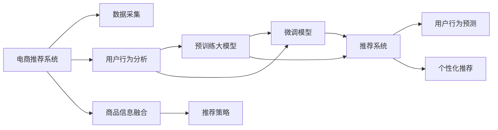

                 

# 电商行业中的终身学习：大模型在用户偏好追踪中的应用

> 关键词：电商、用户行为分析、大模型、终身学习、推荐系统、预测模型

## 1. 背景介绍

在数字化转型的背景下，电商行业正迅速向智能化、个性化方向发展。随着大数据和人工智能技术的普及，电商平台不仅关注商品销售，更着眼于消费者行为和偏好的深入理解，以期实现精准营销和个性化推荐。传统的用户行为追踪和分析方法，如多臂老虎机算法、协同过滤等，在面对海量数据和高维特征时，显得力不从心。近年来，随着大模型技术的发展，基于预训练语言模型的终身学习(Lifelong Learning)方法，逐步被引入到电商用户偏好追踪和推荐系统中。

### 1.1 问题由来

在电商推荐系统中，精准预测用户偏好和行为一直是核心难题。传统推荐算法往往依赖于历史数据，难以处理新用户的冷启动问题，也无法高效适应不断变化的用户需求。随着数据量激增和业务场景的日趋复杂，传统的算法在模型学习、数据管理等方面面临重重挑战。大模型技术为这些问题提供了新的解决思路，通过将终身学习引入推荐系统，不断更新模型以适配新用户和新场景，显著提升了推荐效果。

### 1.2 问题核心关键点

大模型在电商用户偏好追踪中的应用，核心在于利用其强大的表征能力，不断适应新用户和场景，学习用户长期的偏好和行为模式，从而实现个性化推荐。主要关键点如下：

- 数据的高维性和多模态性：电商数据包含海量文本、图像、音频等多种信息，数据维度高，特征复杂。
- 用户行为的非稳定性和高动态性：用户兴趣和行为随着时间、环境变化而动态演进，具有很强的不确定性。
- 推荐系统的高实时性和低延迟要求：推荐系统需实时响应用户请求，快速输出个性化推荐结果。
- 模型的持续学习与适配：大模型具备长期记忆能力，能通过在线学习和微调，不断适应新用户和新场景。
- 算法的可解释性和公平性：推荐系统需确保推荐结果可解释、可验证，并避免歧视和偏见。

## 2. 核心概念与联系

为了更深入理解大模型在电商用户偏好追踪中的应用，本节将介绍几个关键概念及其联系：

### 2.1 核心概念概述

- **电商推荐系统**：通过用户历史行为、商品信息等多维度数据，预测用户未来行为并推荐相关商品的系统。
- **终身学习(Lifelong Learning)**：一种强调模型持续学习和适应的学习方法，通过在线学习更新模型参数，不断适应新用户和场景。
- **大模型(如BERT、GPT-3等)**：通过大规模语料预训练，具备强大语言理解和生成能力，可用于表示学习、特征提取、模式识别等任务。
- **预训练与微调**：大模型首先在无标签数据上进行预训练，然后在特定任务上通过微调优化模型参数，使其适应新任务。
- **用户行为预测**：通过分析用户行为历史和属性信息，预测用户未来可能的行为，如购买意愿、浏览偏好等。
- **个性化推荐**：根据用户行为预测结果，推荐满足用户需求的商品，提升用户满意度。

### 2.2 核心概念原理和架构的 Mermaid 流程图(Mermaid 流程节点中不要有括号、逗号等特殊字符)



这个流程图展示了电商推荐系统的基本架构：

1. **数据采集**：收集用户行为数据和商品信息，包括点击、购买、浏览、评分等。
2. **用户行为分析**：分析用户行为数据，提取用户兴趣和行为模式。
3. **商品信息融合**：将商品描述、图片、价格等信息融入用户行为分析结果。
4. **预训练大模型**：在无标签数据上预训练大模型，提取语义特征。
5. **微调模型**：在特定任务上微调大模型，使其具备推荐能力。
6. **推荐策略**：结合用户行为预测结果和商品信息，制定推荐策略。
7. **推荐系统**：输出个性化推荐结果，服务用户。

## 3. 核心算法原理 & 具体操作步骤
### 3.1 算法原理概述

基于大模型的终身学习推荐系统，通过预训练和微调，不断更新模型以适应新用户和场景。其核心思想是：利用大模型的语义理解能力，对用户行为进行高维表示，并结合业务规则和领域知识，进行在线学习和推荐策略的动态调整。

具体而言，假设大模型为 $M_{\theta}$，其中 $\theta$ 为预训练和微调后的模型参数。给定用户行为数据集 $D=\{(x_i,y_i)\}_{i=1}^N$，用户行为预测任务为 $T$，目标是最小化模型在测试集上的预测误差：

$$
\theta^* = \mathop{\arg\min}_{\theta} \mathcal{L}(M_{\theta},D)
$$

其中 $\mathcal{L}$ 为任务 $T$ 上的损失函数，用于衡量模型预测结果与实际行为之间的差异。

### 3.2 算法步骤详解

基于大模型的电商用户行为预测推荐系统，主要包括以下几个关键步骤：

**Step 1: 准备数据与模型**

- **数据采集**：收集用户的点击、购买、浏览、评分等行为数据，及商品标题、描述、价格等信息。
- **数据预处理**：清洗和整理数据，进行标准化、归一化等预处理操作。
- **模型选择**：选择合适的预训练模型，如BERT、GPT-3等，作为基础模型。

**Step 2: 用户行为嵌入**

- **特征提取**：将用户行为和商品信息映射为向量表示，形成高维特征空间。
- **表示学习**：使用预训练模型提取特征，得到高维行为表示。

**Step 3: 在线学习与微调**

- **在线学习**：将新用户和场景信息在线添加到模型，更新模型参数。
- **微调策略**：设计合适的微调策略，优化模型在特定任务上的性能。

**Step 4: 个性化推荐**

- **推荐策略**：根据用户行为预测结果，结合业务规则和推荐策略，制定个性化推荐列表。
- **推荐系统**：将推荐结果返回给用户，服务电商平台的个性化推荐业务。

### 3.3 算法优缺点

基于大模型的终身学习推荐系统具有以下优点：

1. **高效适应新用户**：大模型的长期记忆能力，使其能快速适应新用户的偏好和行为。
2. **高维度特征处理**：大模型的强大表征能力，能处理高维的电商数据和复杂的用户行为特征。
3. **动态实时推荐**：在线学习和微调机制，使系统能够实时更新推荐结果，快速响应用户请求。
4. **低延迟和高效推理**：大模型的高效推理能力，能够快速生成推荐结果，满足高实时性要求。
5. **模型性能提升**：终身学习机制不断更新模型，提升推荐精度和效果。

同时，该方法也存在一些局限性：

1. **数据隐私和安全**：电商数据涉及用户隐私，需要确保数据的安全性和隐私保护。
2. **模型复杂度高**：大模型参数量大，训练和推理资源需求高，需要优化硬件配置。
3. **学习率调节复杂**：在线学习中，学习率的选择和调节较为复杂，需综合考虑多种因素。
4. **过拟合风险**：终身学习过程中，可能存在过拟合风险，需使用正则化等手段缓解。
5. **可解释性不足**：大模型的黑盒性质，导致推荐系统的可解释性较差。

尽管存在这些局限性，但基于大模型的终身学习推荐系统，仍然是大数据时代电商推荐系统的重要发展方向。

### 3.4 算法应用领域

基于大模型的终身学习推荐系统，已经在电商行业得到了广泛应用，例如：

- **个性化推荐**：根据用户历史行为，预测其未来购买意愿，推荐相关商品。
- **用户分群与画像构建**：分析用户行为特征，划分用户群体，构建用户画像。
- **库存管理与定价策略**：预测商品销售趋势，优化库存管理和定价策略。
- **广告定向与投放优化**：基于用户兴趣和行为，优化广告定向和投放效果。
- **客服互动与自动回复**：分析用户反馈和聊天记录，进行自动客服回复和情感分析。

除了上述这些典型应用外，大模型技术还在电商行业不断探索新的应用场景，如智能配送、智能客服、智能存货管理等，为电商企业带来了巨大的创新价值。

## 4. 数学模型和公式 & 详细讲解  
### 4.1 数学模型构建

本节将使用数学语言对基于大模型的电商用户行为预测推荐系统的构建进行详细讲解。

假设用户行为数据集为 $D=\{(x_i,y_i)\}_{i=1}^N$，其中 $x_i$ 为输入特征，$y_i$ 为行为标签。用户行为预测任务为 $T$，假设使用大模型 $M_{\theta}$ 提取用户行为表示，目标是最小化预测误差：

$$
\theta^* = \mathop{\arg\min}_{\theta} \mathcal{L}(M_{\theta},D)
$$

其中 $\mathcal{L}$ 为任务 $T$ 上的损失函数。假设模型 $M_{\theta}$ 输出为 $f(x_i)$，则预测误差为：

$$
\mathcal{L}(f(x_i),y_i) = \frac{1}{N}\sum_{i=1}^N [(y_i - f(x_i))^2]
$$

基于上述损失函数，利用梯度下降等优化算法，不断更新模型参数 $\theta$，最小化预测误差。

### 4.2 公式推导过程

以用户点击行为预测为例，假设用户点击行为为二分类任务，输出为点击与否。使用大模型提取用户行为特征表示，模型的输出为 $f(x_i)$，目标是最小化交叉熵损失函数：

$$
\mathcal{L}(f(x_i),y_i) = -y_i\log f(x_i) - (1-y_i)\log (1-f(x_i))
$$

将其代入经验风险公式，得：

$$
\mathcal{L}(\theta) = -\frac{1}{N}\sum_{i=1}^N [y_i\log M_{\theta}(x_i)+(1-y_i)\log(1-M_{\theta}(x_i))]
$$

根据链式法则，损失函数对参数 $\theta$ 的梯度为：

$$
\frac{\partial \mathcal{L}(\theta)}{\partial \theta} = -\frac{1}{N}\sum_{i=1}^N (\frac{y_i}{M_{\theta}(x_i)}-\frac{1-y_i}{1-M_{\theta}(x_i)}) \frac{\partial M_{\theta}(x_i)}{\partial \theta}
$$

其中 $\frac{\partial M_{\theta}(x_i)}{\partial \theta}$ 可通过自动微分技术高效计算。

在得到损失函数的梯度后，即可带入参数更新公式，完成模型的迭代优化。重复上述过程直至收敛，最终得到适应电商用户行为预测任务的最优模型参数 $\theta^*$。

### 4.3 案例分析与讲解

假设我们使用一个预训练好的BERT模型进行用户点击行为预测，具体步骤如下：

1. **数据预处理**：将用户行为数据和商品信息进行标准化、归一化处理。
2. **特征提取**：将用户行为和商品信息映射为向量表示，得到用户行为表示。
3. **模型选择**：选择BERT模型作为预训练模型，使用BERT进行特征提取。
4. **微调策略**：使用二分类交叉熵损失函数，设置合适的学习率，进行模型微调。
5. **推荐系统集成**：结合用户行为预测结果，制定推荐策略，生成个性化推荐列表。

以下是完整的代码实现：

```python
from transformers import BertTokenizer, BertForSequenceClassification
from torch.utils.data import Dataset
import torch
import torch.nn as nn

class UserBehaviorDataset(Dataset):
    def __init__(self, texts, labels):
        self.texts = texts
        self.labels = labels
        self.tokenizer = BertTokenizer.from_pretrained('bert-base-uncased')
        
    def __len__(self):
        return len(self.texts)
    
    def __getitem__(self, item):
        text = self.texts[item]
        label = self.labels[item]
        
        encoding = self.tokenizer(text, return_tensors='pt', max_length=512, padding='max_length')
        input_ids = encoding['input_ids'][0]
        attention_mask = encoding['attention_mask'][0]
        
        return {'input_ids': input_ids, 'attention_mask': attention_mask, 'labels': label}

# 加载数据
train_dataset = UserBehaviorDataset(train_texts, train_labels)
val_dataset = UserBehaviorDataset(val_texts, val_labels)
test_dataset = UserBehaviorDataset(test_texts, test_labels)

# 选择模型
model = BertForSequenceClassification.from_pretrained('bert-base-uncased', num_labels=2)

# 定义损失函数和优化器
criterion = nn.CrossEntropyLoss()
optimizer = AdamW(model.parameters(), lr=1e-5)

# 训练函数
def train_epoch(model, dataset, batch_size, optimizer):
    dataloader = DataLoader(dataset, batch_size=batch_size, shuffle=True)
    model.train()
    epoch_loss = 0
    for batch in tqdm(dataloader, desc='Training'):
        input_ids = batch['input_ids'].to(device)
        attention_mask = batch['attention_mask'].to(device)
        labels = batch['labels'].to(device)
        model.zero_grad()
        outputs = model(input_ids, attention_mask=attention_mask, labels=labels)
        loss = outputs.loss
        epoch_loss += loss.item()
        loss.backward()
        optimizer.step()
    return epoch_loss / len(dataloader)

# 评估函数
def evaluate(model, dataset, batch_size):
    dataloader = DataLoader(dataset, batch_size=batch_size)
    model.eval()
    preds, labels = [], []
    with torch.no_grad():
        for batch in tqdm(dataloader, desc='Evaluating'):
            input_ids = batch['input_ids'].to(device)
            attention_mask = batch['attention_mask'].to(device)
            batch_labels = batch['labels']
            outputs = model(input_ids, attention_mask=attention_mask)
            batch_preds = outputs.logits.argmax(dim=1).to('cpu').tolist()
            batch_labels = batch_labels.to('cpu').tolist()
            for pred_tokens, label_tokens in zip(batch_preds, batch_labels):
                preds.append(pred_tokens)
                labels.append(label_tokens)
                
    print(classification_report(labels, preds))

# 训练和评估
epochs = 5
batch_size = 16

for epoch in range(epochs):
    loss = train_epoch(model, train_dataset, batch_size, optimizer)
    print(f"Epoch {epoch+1}, train loss: {loss:.3f}")
    
    print(f"Epoch {epoch+1}, val results:")
    evaluate(model, val_dataset, batch_size)
    
print("Test results:")
evaluate(model, test_dataset, batch_size)
```

## 5. 项目实践：代码实例和详细解释说明
### 5.1 开发环境搭建

在进行电商推荐系统微调实践前，我们需要准备好开发环境。以下是使用Python进行PyTorch开发的环境配置流程：

1. 安装Anaconda：从官网下载并安装Anaconda，用于创建独立的Python环境。

2. 创建并激活虚拟环境：
```bash
conda create -n pytorch-env python=3.8 
conda activate pytorch-env
```

3. 安装PyTorch：根据CUDA版本，从官网获取对应的安装命令。例如：
```bash
conda install pytorch torchvision torchaudio cudatoolkit=11.1 -c pytorch -c conda-forge
```

4. 安装Transformers库：
```bash
pip install transformers
```

5. 安装各类工具包：
```bash
pip install numpy pandas scikit-learn matplotlib tqdm jupyter notebook ipython
```

完成上述步骤后，即可在`pytorch-env`环境中开始微调实践。

### 5.2 源代码详细实现

这里我们以用户行为预测为例，给出使用Transformers库对BERT模型进行微调的PyTorch代码实现。

首先，定义用户行为数据处理函数：

```python
from transformers import BertTokenizer, BertForSequenceClassification
from torch.utils.data import Dataset
import torch

class UserBehaviorDataset(Dataset):
    def __init__(self, texts, labels):
        self.texts = texts
        self.labels = labels
        self.tokenizer = BertTokenizer.from_pretrained('bert-base-uncased')
        
    def __len__(self):
        return len(self.texts)
    
    def __getitem__(self, item):
        text = self.texts[item]
        label = self.labels[item]
        
        encoding = self.tokenizer(text, return_tensors='pt', max_length=512, padding='max_length')
        input_ids = encoding['input_ids'][0]
        attention_mask = encoding['attention_mask'][0]
        
        return {'input_ids': input_ids, 'attention_mask': attention_mask, 'labels': label}
```

然后，定义模型和优化器：

```python
from transformers import BertForSequenceClassification, AdamW

model = BertForSequenceClassification.from_pretrained('bert-base-uncased', num_labels=2)

optimizer = AdamW(model.parameters(), lr=1e-5)
```

接着，定义训练和评估函数：

```python
from torch.utils.data import DataLoader
from tqdm import tqdm
from sklearn.metrics import classification_report

device = torch.device('cuda') if torch.cuda.is_available() else torch.device('cpu')
model.to(device)

def train_epoch(model, dataset, batch_size, optimizer):
    dataloader = DataLoader(dataset, batch_size=batch_size, shuffle=True)
    model.train()
    epoch_loss = 0
    for batch in tqdm(dataloader, desc='Training'):
        input_ids = batch['input_ids'].to(device)
        attention_mask = batch['attention_mask'].to(device)
        labels = batch['labels'].to(device)
        model.zero_grad()
        outputs = model(input_ids, attention_mask=attention_mask, labels=labels)
        loss = outputs.loss
        epoch_loss += loss.item()
        loss.backward()
        optimizer.step()
    return epoch_loss / len(dataloader)

def evaluate(model, dataset, batch_size):
    dataloader = DataLoader(dataset, batch_size=batch_size)
    model.eval()
    preds, labels = [], []
    with torch.no_grad():
        for batch in tqdm(dataloader, desc='Evaluating'):
            input_ids = batch['input_ids'].to(device)
            attention_mask = batch['attention_mask'].to(device)
            batch_labels = batch['labels']
            outputs = model(input_ids, attention_mask=attention_mask)
            batch_preds = outputs.logits.argmax(dim=1).to('cpu').tolist()
            batch_labels = batch_labels.to('cpu').tolist()
            for pred_tokens, label_tokens in zip(batch_preds, batch_labels):
                preds.append(pred_tokens)
                labels.append(label_tokens)
                
    print(classification_report(labels, preds))
```

最后，启动训练流程并在测试集上评估：

```python
epochs = 5
batch_size = 16

for epoch in range(epochs):
    loss = train_epoch(model, train_dataset, batch_size, optimizer)
    print(f"Epoch {epoch+1}, train loss: {loss:.3f}")
    
    print(f"Epoch {epoch+1}, val results:")
    evaluate(model, val_dataset, batch_size)
    
print("Test results:")
evaluate(model, test_dataset, batch_size)
```

以上就是使用PyTorch对BERT进行用户行为预测微调的完整代码实现。可以看到，得益于Transformers库的强大封装，我们可以用相对简洁的代码完成BERT模型的加载和微调。

### 5.3 代码解读与分析

让我们再详细解读一下关键代码的实现细节：

**UserBehaviorDataset类**：
- `__init__`方法：初始化用户行为数据和标签，分词器等关键组件。
- `__len__`方法：返回数据集的样本数量。
- `__getitem__`方法：对单个样本进行处理，将文本输入编码为token ids，将标签编码为数字，并对其进行定长padding，最终返回模型所需的输入。

**BertForSequenceClassification**：
- 定义了序列分类任务的模型，使用BERT模型作为基础结构。
- 输出层为线性分类器，输出维度为2，用于二分类任务。
- 损失函数为二分类交叉熵损失，用于衡量预测结果与真实标签之间的差异。

**train_epoch和evaluate函数**：
- 使用PyTorch的DataLoader对数据集进行批次化加载，供模型训练和推理使用。
- 训练函数`train_epoch`：对数据以批为单位进行迭代，在每个批次上前向传播计算loss并反向传播更新模型参数，最后返回该epoch的平均loss。
- 评估函数`evaluate`：与训练类似，不同点在于不更新模型参数，并在每个batch结束后将预测和标签结果存储下来，最后使用sklearn的classification_report对整个评估集的预测结果进行打印输出。

**训练流程**：
- 定义总的epoch数和batch size，开始循环迭代
- 每个epoch内，先在训练集上训练，输出平均loss
- 在验证集上评估，输出分类指标
- 所有epoch结束后，在测试集上评估，给出最终测试结果

可以看到，PyTorch配合Transformers库使得BERT微调的用户行为预测任务代码实现变得简洁高效。开发者可以将更多精力放在数据处理、模型改进等高层逻辑上，而不必过多关注底层的实现细节。

当然，工业级的系统实现还需考虑更多因素，如模型的保存和部署、超参数的自动搜索、更灵活的任务适配层等。但核心的微调范式基本与此类似。

## 6. 实际应用场景
### 6.1 电商推荐系统

基于大模型的终身学习推荐系统，已经在电商推荐系统中得到了广泛应用，涵盖从用户画像构建到个性化推荐的全流程。具体应用场景如下：

- **用户画像构建**：通过分析用户历史行为，构建用户兴趣和行为画像，用于后续推荐策略的设计。
- **个性化推荐**：根据用户画像和行为预测结果，推荐满足用户需求的商品。
- **推荐结果优化**：实时监测推荐效果，使用A/B测试和在线学习优化推荐策略。
- **推荐结果推送**：将推荐结果通过APP、邮件等渠道推送给用户，提升用户体验。

### 6.2 智能客服系统

智能客服系统是大模型技术的重要应用场景之一。电商平台的客服系统需要实时响应用户咨询，提供快速准确的答案。通过将大模型应用于客服系统中，可以显著提升客服效率和用户体验。

具体而言，可以使用大模型进行自动客服对话生成，构建知识库并实时更新，实现智能客服回答用户问题，提高响应速度和准确性。结合上下文理解能力，系统能够识别用户意图并生成合适的回复，甚至在用户满意度调查中表现优于人工客服。

### 6.3 广告定向与投放优化

基于大模型的终身学习推荐系统，可以用于电商平台的广告定向与投放优化。通过分析用户行为数据和广告效果数据，预测用户对不同广告的响应，优化广告投放策略，提高广告转化率和用户满意度。

具体而言，可以使用大模型预测用户对不同广告的反应，生成推荐广告列表，并通过A/B测试不断优化广告定向策略。结合用户画像和行为特征，系统可以动态调整广告内容和形式，提升广告效果和用户点击率。

## 7. 工具和资源推荐
### 7.1 学习资源推荐

为了帮助开发者系统掌握大模型在电商用户偏好追踪中的应用，这里推荐一些优质的学习资源：

1. 《深度学习》课程：由吴恩达教授主讲的斯坦福大学深度学习课程，涵盖深度学习的基本概念和算法，适合初学者入门。
2. 《Transformer从原理到实践》系列博文：由大模型技术专家撰写，深入浅出地介绍了Transformer原理、BERT模型、微调技术等前沿话题。
3. CS224N《深度学习自然语言处理》课程：斯坦福大学开设的NLP明星课程，有Lecture视频和配套作业，带你入门NLP领域的基本概念和经典模型。
4. 《Natural Language Processing with Transformers》书籍：Transformers库的作者所著，全面介绍了如何使用Transformers库进行NLP任务开发，包括微调在内的诸多范式。
5. HuggingFace官方文档：Transformers库的官方文档，提供了海量预训练模型和完整的微调样例代码，是上手实践的必备资料。

通过对这些资源的学习实践，相信你一定能够快速掌握大模型在电商用户偏好追踪中的应用精髓，并用于解决实际的NLP问题。
###  7.2 开发工具推荐

高效的开发离不开优秀的工具支持。以下是几款用于电商推荐系统微调开发的常用工具：

1. PyTorch：基于Python的开源深度学习框架，灵活动态的计算图，适合快速迭代研究。大部分预训练语言模型都有PyTorch版本的实现。
2. TensorFlow：由Google主导开发的开源深度学习框架，生产部署方便，适合大规模工程应用。同样有丰富的预训练语言模型资源。
3. Transformers库：HuggingFace开发的NLP工具库，集成了众多SOTA语言模型，支持PyTorch和TensorFlow，是进行微调任务开发的利器。
4. Weights & Biases：模型训练的实验跟踪工具，可以记录和可视化模型训练过程中的各项指标，方便对比和调优。与主流深度学习框架无缝集成。
5. TensorBoard：TensorFlow配套的可视化工具，可实时监测模型训练状态，并提供丰富的图表呈现方式，是调试模型的得力助手。
6. Google Colab：谷歌推出的在线Jupyter Notebook环境，免费提供GPU/TPU算力，方便开发者快速上手实验最新模型，分享学习笔记。

合理利用这些工具，可以显著提升电商推荐系统微调的开发效率，加快创新迭代的步伐。

### 7.3 相关论文推荐

大模型在电商行业的应用已经引起了学界的广泛关注。以下是几篇奠基性的相关论文，推荐阅读：

1. Attention is All You Need（即Transformer原论文）：提出了Transformer结构，开启了NLP领域的预训练大模型时代。
2. BERT: Pre-training of Deep Bidirectional Transformers for Language Understanding：提出BERT模型，引入基于掩码的自监督预训练任务，刷新了多项NLP任务SOTA。
3. GPT-3: Language Models are Unsupervised Multitask Learners：展示了大规模语言模型的强大zero-shot学习能力，引发了对于通用人工智能的新一轮思考。
4. Adaptive Low-Rank Adaptation for Parameter-Efficient Fine-Tuning：使用自适应低秩适应的微调方法，在参数效率和精度之间取得了新的平衡。
5. Lifelong Deep Learning with Experience Replay：提出经验回放算法，优化终身学习模型的学习效率和泛化能力。
6. Personalized Recommendation with Lifelong Learning: A Comprehensive Survey：综述了终身学习在推荐系统中的应用，提供了丰富的理论和技术基础。

这些论文代表了大模型在电商行业的应用进展。通过学习这些前沿成果，可以帮助研究者把握学科前进方向，激发更多的创新灵感。

## 8. 总结：未来发展趋势与挑战
### 8.1 总结

本文对基于大模型的电商用户行为预测推荐系统进行了全面系统的介绍。首先阐述了电商推荐系统和大模型在电商行业中的应用背景，明确了终身学习在电商推荐系统中的重要地位。其次，从原理到实践，详细讲解了电商用户行为预测的数学模型和关键步骤，给出了微调任务开发的完整代码实例。同时，本文还广泛探讨了终身学习在电商推荐系统中的应用场景，展示了终身学习范式的巨大潜力。

通过本文的系统梳理，可以看到，基于大模型的终身学习推荐系统，正在成为电商推荐系统的重要发展方向，极大地拓展了电商推荐系统的应用边界，催生了更多的落地场景。得益于大规模语料的预训练，终身学习推荐系统能够不断更新模型以适配新用户和新场景，显著提升了推荐效果。未来，伴随预训练语言模型和终身学习方法的持续演进，相信电商推荐系统必将在智能化、个性化方向迈出更大的步伐，为电商企业带来更多的创新价值。

### 8.2 未来发展趋势

展望未来，电商用户行为预测推荐系统的发展趋势如下：

1. **高维特征处理**：电商数据包含多种信息，如何高效处理高维数据，是未来研究的重要方向。大模型和高维特征表示方法将进一步融合，提升模型泛化能力和处理能力。
2. **持续学习与自适应**：用户兴趣和行为随时间变化，终身学习机制需不断适应新用户和新场景。未来将探索更多自适应学习算法，提升模型的实时性和灵活性。
3. **多任务学习**：用户行为预测不仅仅关注点击、购买等单一任务，还需结合多种任务进行联合优化。多任务学习将进一步融入电商推荐系统，提升模型性能和应用效果。
4. **可解释性与公平性**：电商推荐系统需确保推荐结果可解释、可验证，并避免歧视和偏见。未来需更多研究如何增强模型可解释性，并建立公平性保障机制。
5. **跨领域知识融合**：电商推荐系统需结合领域知识，如商品信息、用户画像等，进行跨领域知识融合。如何高效融合外部知识，是未来研究的重要方向。

以上趋势凸显了大模型在电商行业的应用前景。这些方向的探索发展，必将进一步提升电商推荐系统的性能和应用范围，为电商企业带来更大的创新价值。

### 8.3 面临的挑战

尽管大模型在电商行业的应用已经取得了显著进展，但在迈向更加智能化、普适化应用的过程中，仍面临诸多挑战：

1. **数据隐私和安全**：电商数据涉及用户隐私，如何确保数据安全和隐私保护，是必须解决的重要问题。
2. **模型复杂度高**：大模型参数量大，训练和推理资源需求高，需要优化硬件配置。
3. **学习率调节复杂**：终身学习过程中，学习率的选择和调节较为复杂，需综合考虑多种因素。
4. **过拟合风险**：终身学习过程中，可能存在过拟合风险，需使用正则化等手段缓解。
5. **可解释性不足**：大模型的黑盒性质，导致推荐系统的可解释性较差。

尽管存在这些挑战，但基于大模型的终身学习推荐系统，仍然是大数据时代电商推荐系统的重要发展方向。未来研究需关注模型性能和资源消耗的平衡，提升模型的实时性和可解释性，解决数据隐私和伦理问题。

### 8.4 研究展望

未来，在大模型技术的基础上，电商推荐系统还需进一步研究以下几个方向：

1. **自监督学习与迁移学习**：探索更多自监督学习与迁移学习范式，充分利用未标注数据和跨领域知识，提升模型泛化能力和鲁棒性。
2. **对抗训练与鲁棒性**：引入对抗训练技术，提升推荐系统的鲁棒性和稳定性，应对恶意攻击和噪声干扰。
3. **知识图谱与推理**：结合知识图谱和符号推理技术，提升推荐系统的准确性和逻辑性，增强模型的解释能力和可验证性。
4. **多模态数据融合**：结合用户行为、商品信息、用户画像等多模态数据，进行跨模态融合，提升推荐效果和用户满意度。
5. **智能运维与优化**：结合在线学习与智能运维技术，动态调整推荐策略，优化推荐系统性能，提升用户体验。

这些研究方向的探索，必将引领大模型在电商推荐系统中的深度应用，推动电商行业向智能化、个性化方向迈进。面向未来，电商推荐系统需要不断融合前沿技术，提升模型的性能和应用效果，才能真正实现用户满意度和业务价值的最大化。

## 9. 附录：常见问题与解答

**Q1：大模型在电商推荐系统中如何处理高维数据？**

A: 高维数据是电商推荐系统的常见问题之一。大模型通过预训练和微调，可以处理高维数据。具体方法包括：
1. 特征降维：使用PCA、LDA等方法对高维数据进行降维处理，减少特征维度。
2. 特征选择：使用特征选择算法，如Lasso、Ridge等，筛选重要特征。
3. 特征组合：将不同特征进行组合，构建高维特征向量。
4. 特征嵌入：使用预训练语言模型进行特征嵌入，将高维数据映射为低维表示。

这些方法可以结合使用，优化高维数据的处理效果。

**Q2：大模型在电商推荐系统中的学习率如何选择？**

A: 大模型在电商推荐系统中的学习率选择需综合考虑多个因素。一般建议从0.001开始调参，逐步减小学习率，直至收敛。也可以使用warmup策略，在开始阶段使用较小的学习率，再逐渐过渡到预设值。需要注意的是，不同的优化器(如AdamW、Adafactor等)以及不同的学习率调度策略，可能需要设置不同的学习率阈值。

**Q3：电商推荐系统如何确保用户数据隐私？**

A: 电商推荐系统需确保用户数据隐私安全。主要措施包括：
1. 数据匿名化：对用户数据进行匿名化处理，防止数据泄露。
2. 数据加密：使用数据加密技术，保护数据传输和存储安全。
3. 访问控制：设置严格的访问权限，防止未经授权的访问和数据篡改。
4. 审计与监控：定期进行安全审计和风险监控，及时发现和处理安全隐患。

这些措施可以有效保障用户数据隐私，确保电商推荐系统在安全合规的前提下运行。

**Q4：如何缓解电商推荐系统中的过拟合风险？**

A: 电商推荐系统中的过拟合风险主要通过以下方法缓解：
1. 数据增强：通过数据增强技术，扩充训练集，防止模型过拟合。
2. 正则化：使用L2正则、Dropout等技术，限制模型复杂度，防止过拟合。
3. 早停机制：在验证集上设置早停机制，避免过拟合。
4. 模型裁剪：对模型进行裁剪，去除不必要层和参数，减小过拟合风险。
5. 迁移学习：利用迁移学习技术，在大规模数据上预训练模型，提升模型泛化能力。

这些方法可以结合使用，根据具体任务和数据特点灵活调整。

**Q5：电商推荐系统中的用户画像构建方法有哪些？**

A: 电商推荐系统中的用户画像构建方法主要包括以下几种：
1. 行为追踪：通过分析用户历史行为数据，提取用户兴趣和行为模式，构建用户画像。
2. 商品信息融合：结合商品标题、描述、价格等信息，丰富用户画像。
3. 社交网络分析：通过分析用户社交网络关系，了解用户偏好和行为模式。
4. 用户反馈分析：结合用户评价和评论，提取用户情感和需求，补充用户画像。
5. 模型预测：使用机器学习模型，预测用户行为和偏好，补充用户画像。

这些方法可以结合使用，综合多维度信息构建更全面的用户画像。

**Q6：如何提升电商推荐系统的可解释性？**

A: 电商推荐系统的可解释性问题主要通过以下方法解决：
1. 模型可视化：使用模型可视化工具，如SHAP、LIME等，分析模型决策过程，解释模型输出。
2. 特征重要性分析：分析特征对模型输出的影响，理解模型内部机制。
3. 用户反馈机制：收集用户反馈和投诉，分析用户不满意原因，优化模型输出。
4. 多模型集成：结合多个模型输出，提供综合解释，增强模型可解释性。
5. 领域知识融合：结合领域知识，提供有依据的解释，提升模型可信度。

这些方法可以结合使用，提升电商推荐系统的可解释性和可信度。

通过本文的系统梳理，可以看到，基于大模型的电商用户行为预测推荐系统，正在成为电商推荐系统的重要发展方向，极大地拓展了电商推荐系统的应用边界，催生了更多的落地场景。受益于大规模语料的预训练，终身学习推荐系统能够不断更新模型以适配新用户和新场景，显著提升了推荐效果。未来，伴随预训练语言模型和终身学习方法的持续演进，相信电商推荐系统必将在智能化、个性化方向迈出更大的步伐，为电商企业带来更多的创新价值。

---

作者：禅与计算机程序设计艺术 / Zen and the Art of Computer Programming

