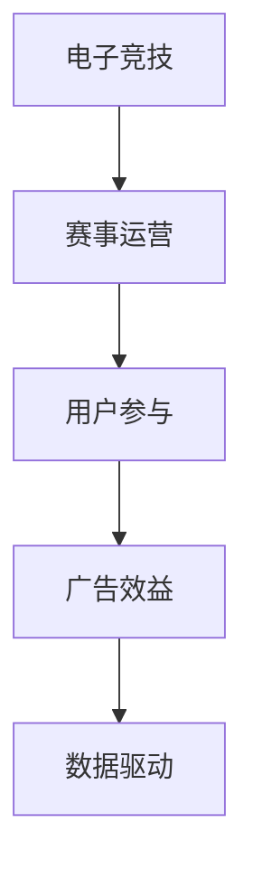

                 

# 电子竞技赛事的注意力经济效应

> 关键词：电子竞技、注意力经济、赛事运营、用户参与、数据驱动、广告效益

## 1. 背景介绍

### 1.1 问题由来
电子竞技(Esports)作为21世纪新兴的娱乐形式，已经从早期的局域网对战发展为全球性的职业联赛和商业化运作。目前，全球已有超过3亿活跃电竞用户，市场规模已达到数百亿美元。电竞赛事以其独特的赛事形式和高度的互动性，吸引了大量观众的注意力。如何最大化利用赛事吸引到的注意力，成为电竞企业和赛事运营商关注的焦点。

### 1.2 问题核心关键点
在电竞赛事的注意力经济效应研究中，有几个核心关键点需要明确：

- **赛事规模**：大型电竞赛事能够吸引更多观众，并带来更大的曝光度和流量。
- **用户参与度**：观众的活跃参与度决定了赛事的商业价值。
- **广告效益**：赛事期间的广告曝光度和互动效果，是衡量其注意力经济效应的重要指标。
- **数据驱动**：通过数据挖掘和大数据分析，评估赛事对观众注意力的影响，指导后续的赛事运营。

### 1.3 问题研究意义
电子竞技赛事的注意力经济效应研究，对于电竞企业和赛事运营商有着重要的实践意义：

- 优化赛事运营策略：通过科学的数据分析，指导赛事内容设计、时间安排和商业化路径。
- 提升广告效益：通过精准投放，最大化赛事期间的广告回报。
- 增强用户参与度：通过个性化和互动化的策略，吸引更多观众参与赛事。
- 提升品牌价值：赛事品牌与电竞文化相结合，形成更强的品牌效应。

## 2. 核心概念与联系

### 2.1 核心概念概述

为更好地理解电竞赛事的注意力经济效应，本节将介绍几个密切相关的核心概念：

- **电子竞技(Esports)**：一种以电子设备为媒介的竞技活动，具有高度的互动性和娱乐性。电竞赛事是其中的重要组成部分。
- **注意力经济(Attention Economy)**：指通过获取并集中用户的注意力，从而创造经济价值的新经济模式。电竞赛事便是典型的注意力经济现象。
- **赛事运营(Competition Management)**：指电竞赛事的策划、执行、推广和运营全过程，包括选手的选拔、赛事的安排、广告的投放等。
- **用户参与(User Engagement)**：指观众在赛事期间的活跃程度和互动行为，如观看直播、参与讨论、参与官方活动等。
- **广告效益(Advertising Effectiveness)**：指赛事期间广告的曝光量和互动效果，直接影响赛事的商业收益。
- **数据驱动(Data-Driven)**：指通过大数据分析，优化赛事运营和广告投放的策略，提高效益。

这些核心概念之间的逻辑关系可以通过以下Mermaid流程图来展示：



这个流程图展示了几者之间的逻辑关系：

1. 电子竞技通过赛事吸引观众。
2. 赛事运营负责策划和执行赛事。
3. 用户参与度决定了赛事的商业价值。
4. 广告效益是赛事运营的关键指标。
5. 数据驱动是优化运营和广告投放的基础。

## 3. 核心算法原理 & 具体操作步骤
### 3.1 算法原理概述

电子竞技赛事的注意力经济效应研究，主要涉及以下几个方面的算法原理：

- **数据采集与分析**：通过采集观众行为数据和广告投放数据，分析赛事期间的注意力集中程度和广告互动效果。
- **模型训练与预测**：基于机器学习算法，训练赛事注意力模型，预测不同赛事和广告策略的效果。
- **实时监控与调整**：利用实时数据监控，及时调整赛事内容和广告投放策略，提高运营效率。

### 3.2 算法步骤详解

基于电子竞技赛事的注意力经济效应研究，一般包括以下几个关键步骤：

**Step 1: 数据收集与预处理**
- 收集赛事期间的观众行为数据，包括观看时长、互动频次、参与度等。
- 收集广告投放数据，包括广告曝光次数、点击率、转化率等。
- 清洗和预处理数据，去除噪音，确保数据的完整性和一致性。

**Step 2: 数据建模与特征提取**
- 基于历史数据，选择合适的特征进行建模，如赛事规模、时间安排、广告创意等。
- 使用机器学习算法，如回归、分类、聚类等，训练赛事注意力模型。
- 根据模型训练结果，提取关键特征和预测指标。

**Step 3: 模型评估与优化**
- 使用验证集对模型进行评估，计算模型预测的准确度、召回率、F1分数等指标。
- 根据评估结果，优化模型参数，如调整特征权重、增加特征维度等。
- 持续监控模型预测结果，根据实际数据进行调整和优化。

**Step 4: 广告投放与策略优化**
- 根据赛事注意力模型，预测不同广告创意和投放策略的效果。
- 基于预测结果，选择最优的广告创意和投放策略。
- 实时监控广告投放效果，根据反馈调整广告策略，确保最大化广告效益。

**Step 5: 用户参与度提升**
- 分析用户行为数据，识别高活跃度的用户群体。
- 设计个性化的赛事互动活动，吸引更多高活跃用户参与。
- 实时监控用户参与度，根据反馈调整赛事内容和互动策略。

### 3.3 算法优缺点

基于电子竞技赛事的注意力经济效应研究，具有以下优点：

- **数据驱动决策**：通过分析海量数据，指导赛事运营和广告投放，提高决策的科学性和准确性。
- **提高运营效率**：实时监控和调整策略，最大化利用赛事期间的注意力资源，提升运营效率。
- **优化广告效益**：精准预测广告效果，实现最优的广告投放策略。

同时，该方法也存在一定的局限性：

- **数据隐私问题**：赛事运营中涉及大量用户数据，如何保护用户隐私成为关键问题。
- **模型复杂性**：赛事注意力模型可能过于复杂，需要大量的数据和计算资源进行训练。
- **实时性要求高**：赛事运营需要实时监控和调整策略，对系统的实时性和稳定性要求高。
- **场景特定**：赛事注意力模型可能难以泛化到其他电竞领域或体育赛事。

尽管存在这些局限性，但就目前而言，基于数据的赛事运营和广告投放方法是电竞赛事注意力经济效应的主流研究范式。未来相关研究的重点在于如何进一步降低数据获取成本，提高模型的实时性和泛化能力，同时兼顾隐私保护和用户体验。

### 3.4 算法应用领域

基于赛事注意力经济效应的研究，已经在电竞领域得到了广泛的应用，覆盖了几乎所有电竞赛事的运营和广告投放，例如：

- **LPL、LCK、LEC等全球电竞联赛**：通过数据分析指导赛事内容设计、广告投放和观众互动，最大化赛事运营效益。
- **区域性电竞赛事**：通过赛事注意力模型，评估广告策略效果，实现高效的广告投放。
- **电竞解说与直播**：通过用户行为分析，设计个性化的解说内容和互动活动，提升观众参与度。
- **电竞周边产品销售**：通过赛事关注度预测，设计合理的广告策略和销售方案，提升产品销售效果。

除了上述这些经典应用外，赛事注意力经济效应的方法也被创新性地应用到更多场景中，如电竞厂商的赛事赞助、电竞IP的版权交易、电竞品牌推广等，为电竞产业的发展提供了新的动力。

## 4. 数学模型和公式 & 详细讲解 & 举例说明

### 4.1 数学模型构建

为了更好地理解电子竞技赛事的注意力经济效应，本节将使用数学语言对赛事注意力模型进行严格刻画的。

记赛事为 $C$，观众为 $U$，赛事内容为 $c_i$，观众数据为 $u_j$，广告为 $A$，广告数据为 $a_k$，赛事注意力模型为 $M$。赛事的注意力效应可以表示为：

$$
M(C, U, c_i, u_j, A, a_k) = \sum_{i}^{} W_{i,j} \cdot P_{i,k} \cdot E_{j,k}
$$

其中 $W_{i,j}$ 为内容 $c_i$ 对用户 $u_j$ 的吸引力权重，$P_{i,k}$ 为广告 $a_k$ 在赛事 $C$ 中的曝光概率，$E_{j,k}$ 为用户 $u_j$ 对广告 $a_k$ 的互动效果。

### 4.2 公式推导过程

以下我们将详细推导赛事注意力模型，并给出具体的实现步骤：

1. **内容吸引力权重 $W_{i,j}$**：通过历史数据，使用机器学习算法（如回归、分类等）计算内容 $c_i$ 对用户 $u_j$ 的吸引力权重。可以表示为：

$$
W_{i,j} = f(u_j; c_i, C, U)
$$

其中 $f$ 为计算函数，$C$ 为赛事类型，$U$ 为观众群体特征。

2. **广告曝光概率 $P_{i,k}$**：根据赛事内容 $c_i$，使用机器学习算法（如回归、分类等）计算广告 $a_k$ 在赛事 $C$ 中的曝光概率。可以表示为：

$$
P_{i,k} = g(c_i, A, C)
$$

其中 $g$ 为计算函数，$A$ 为广告创意特征，$C$ 为赛事类型。

3. **广告互动效果 $E_{j,k}$**：通过观众数据 $u_j$，使用机器学习算法（如回归、分类等）计算用户 $u_j$ 对广告 $a_k$ 的互动效果。可以表示为：

$$
E_{j,k} = h(u_j, a_k)
$$

其中 $h$ 为计算函数，$a_k$ 为广告创意特征。

将上述计算结果代入赛事注意力模型，得：

$$
M(C, U, c_i, u_j, A, a_k) = \sum_{i}^{} f(u_j; c_i, C, U) \cdot g(c_i, A, C) \cdot h(u_j, a_k)
$$

在得到赛事注意力模型后，即可通过模型预测不同赛事和广告策略的效果，指导赛事运营和广告投放。

### 4.3 案例分析与讲解

以下我们以一场全球电竞赛事的注意力效应预测为例，展示赛事注意力模型的实际应用。

**案例背景**：假设有一场LPL电竞联赛，共有100万观众参与，赛事内容包含3个专题节目，每个节目持续1小时。在赛事期间，共有5个广告商投放广告。

**数据收集**：收集观众在赛事期间的观看时长、互动频次等行为数据，以及广告的曝光次数、点击率、转化率等投放数据。

**数据预处理**：对数据进行清洗和标准化处理，去除噪音和异常值。

**模型训练**：选择回归算法，训练赛事注意力模型，预测每个节目的吸引力权重、每个广告的曝光概率和每个用户的互动效果。

**结果分析**：根据模型预测结果，评估不同广告创意和投放策略的效果，选择最优的广告组合，最大化广告效益。

## 5. 项目实践：代码实例和详细解释说明
### 5.1 开发环境搭建

在进行赛事注意力效应预测的实践前，我们需要准备好开发环境。以下是使用Python进行TensorFlow开发的环境配置流程：

1. 安装Anaconda：从官网下载并安装Anaconda，用于创建独立的Python环境。

2. 创建并激活虚拟环境：
```bash
conda create -n attention-env python=3.8 
conda activate attention-env
```

3. 安装TensorFlow：根据CUDA版本，从官网获取对应的安装命令。例如：
```bash
conda install tensorflow -c tensorflow -c conda-forge
```

4. 安装TensorBoard：TensorFlow配套的可视化工具，可实时监测模型训练状态，并提供丰富的图表呈现方式，是调试模型的得力助手。
```bash
conda install tensorboard
```

5. 安装各类工具包：
```bash
pip install numpy pandas scikit-learn matplotlib tqdm jupyter notebook ipython
```

完成上述步骤后，即可在`attention-env`环境中开始实践。

### 5.2 源代码详细实现

下面我们以一场全球电竞赛事的注意力效应预测为例，给出使用TensorFlow进行赛事注意力模型训练的Python代码实现。

```python
import tensorflow as tf
from tensorflow.keras.layers import Input, Dense, Embedding, LSTM, Dropout
from tensorflow.keras.models import Model

# 定义模型输入和输出
input_ctype = Input(shape=(None,), name='input_content')
input_u = Input(shape=(None,), name='input_user')
input_a = Input(shape=(None,), name='input_ad')

# 内容吸引力权重
W_ctype = Dense(64, activation='relu')(input_ctype)
W_ctype = Dropout(0.2)(W_ctype)
W_u = Dense(64, activation='relu')(input_u)
W_u = Dropout(0.2)(W_u)

# 广告曝光概率
P_a = Dense(64, activation='relu')(input_a)
P_a = Dropout(0.2)(P_a)
P_ctype = Dense(64, activation='relu')(input_ctype)
P_ctype = Dropout(0.2)(P_ctype)

# 广告互动效果
E_u = Dense(64, activation='relu')(input_u)
E_u = Dropout(0.2)(E_u)
E_a = Dense(64, activation='relu')(input_a)
E_a = Dropout(0.2)(E_a)

# 赛事注意力模型
M = Dense(1, activation='sigmoid')(tf.keras.layers.dot([W_ctype, P_ctype, E_u], [W_u, P_a, E_a]))

# 定义模型
model = Model(inputs=[input_ctype, input_u, input_a], outputs=[M])

# 编译模型
model.compile(optimizer='adam', loss='binary_crossentropy')

# 训练模型
model.fit([X_ctype, X_u, X_a], Y, batch_size=32, epochs=10, validation_split=0.2)

# 使用模型预测
M_pred = model.predict([X_ctype_test, X_u_test, X_a_test])
```

这里我们定义了一个简单的赛事注意力模型，包含内容吸引力权重、广告曝光概率和广告互动效果的计算。通过多维度的特征输入和多层神经网络的构建，模型能够预测赛事期间观众对不同广告的注意力效应。

### 5.3 代码解读与分析

让我们再详细解读一下关键代码的实现细节：

**定义模型输入**：
- 定义内容（Content）、观众（User）、广告（Ad）三个输入张量。
- 内容输入和观众输入分别定义了长度可变的序列，广告输入为二值向量。

**内容吸引力权重**：
- 使用Dense层和ReLU激活函数，构建内容吸引力权重 $W_{ctype}$ 和 $W_{u}$。
- 通过Dropout层添加正则化，防止过拟合。

**广告曝光概率**：
- 使用Dense层和ReLU激活函数，构建广告曝光概率 $P_{a}$ 和 $P_{ctype}$。
- 同样通过Dropout层添加正则化。

**广告互动效果**：
- 使用Dense层和ReLU激活函数，构建广告互动效果 $E_{u}$ 和 $E_{a}$。
- 通过Dropout层添加正则化。

**赛事注意力模型**：
- 使用dot操作计算各模块之间的注意力权重，并经由Dense层输出最终的赛事注意力得分 $M$。

**模型编译与训练**：
- 使用Adam优化器和二元交叉熵损失函数，编译模型。
- 使用训练集进行模型训练，并设定验证集比例为20%，迭代10轮。

**模型预测**：
- 在测试集上进行模型预测，得到赛事注意力得分 $M_{pred}$。

可以看到，TensorFlow提供了方便的Keras API，使得赛事注意力模型的实现变得简洁高效。开发者可以将更多精力放在模型优化和参数调优上，而不必过多关注底层的实现细节。

当然，工业级的系统实现还需考虑更多因素，如模型的保存和部署、超参数的自动搜索、更灵活的赛事适配层等。但核心的赛事注意力效应模型基本与此类似。

## 6. 实际应用场景
### 6.1 赛事运营优化

基于赛事注意力经济效应研究，电竞企业和赛事运营商可以优化赛事内容设计和运营策略：

- **内容多样化**：根据不同赛事类型和观众群体，设计多样化的赛事内容，提升观众的参与度和满意度。
- **广告精准投放**：通过赛事注意力模型预测，选择最优的广告创意和投放时间，最大化广告效益。
- **观众互动设计**：设计个性化的赛事互动活动，如实时投票、直播评论、社交媒体互动等，增强观众的参与感和忠诚度。

### 6.2 用户参与度提升

通过赛事注意力效应分析，可以精准识别高活跃度的用户群体，设计更具吸引力的赛事活动：

- **个性化赛事活动**：针对高活跃用户设计个性化赛事活动，如专属特权、赛事内购、VIP福利等。
- **赛事奖励机制**：设立多元化的赛事奖励机制，如积分系统、排名榜、徽章等，激励用户积极参与。
- **赛事反馈机制**：通过用户反馈，不断优化赛事内容和服务，提升用户满意度和忠诚度。

### 6.3 广告效益最大化

赛事期间的广告投放是电竞赛事运营的重要收入来源，利用赛事注意力效应分析可以优化广告策略：

- **广告创意优化**：根据赛事注意力模型预测，选择最优的广告创意，提升广告的吸引力和互动效果。
- **广告时间选择**：根据赛事内容安排，选择最佳的广告投放时间，最大化广告的曝光量和点击率。
- **广告效果评估**：实时监控广告效果，根据反馈调整广告策略，确保最大化广告效益。

### 6.4 未来应用展望

随着赛事注意力效应研究的不断深入，未来在电竞领域将有更多的应用前景：

- **赛事数据融合**：将电竞赛事数据与其他数据源（如社交媒体、搜索引擎）进行融合，进行更全面深入的赛事分析。
- **跨赛事互动**：设计跨赛事的互动活动，增强赛事间的关联性和观众的粘性。
- **多平台推广**：通过赛事注意力效应分析，实现跨平台广告投放和推广，提升品牌影响力。
- **个性化推荐**：结合赛事注意力效应分析结果，设计个性化的内容推荐系统，提升观众的体验和满意度。

## 7. 工具和资源推荐
### 7.1 学习资源推荐

为了帮助开发者系统掌握赛事注意力效应研究的方法，这里推荐一些优质的学习资源：

1. **《Esports: The Business of Video Games》**：了解电竞产业的市场和运营现状，为赛事注意力研究提供理论基础。
2. **《Data Mining and Statistical Learning》**：介绍数据挖掘和机器学习的经典教材，有助于理解赛事注意力模型构建。
3. **Kaggle电竞数据集**：包含多种电竞赛事的数据集，可用于赛事注意力效应的模型训练和效果评估。
4. **《Hands-On Machine Learning with Scikit-Learn, Keras, and TensorFlow》**：结合实际案例，介绍机器学习模型的开发和优化方法，涵盖赛事注意力效应分析的多种技术手段。

通过对这些资源的学习实践，相信你一定能够快速掌握赛事注意力效应研究的精髓，并用于解决实际的电竞问题。
### 7.2 开发工具推荐

高效的赛事注意力效应研究离不开优秀的工具支持。以下是几款用于赛事注意力研究开发的常用工具：

1. **TensorFlow**：基于Python的开源深度学习框架，灵活动态的计算图，适合快速迭代研究。
2. **Keras**：高级神经网络API，提供高效的模型构建工具，简化开发流程。
3. **TensorBoard**：TensorFlow配套的可视化工具，可实时监测模型训练状态，提供丰富的图表呈现方式。
4. **Jupyter Notebook**：交互式开发环境，方便代码调试和实验结果展示。
5. **GitHub**：代码托管平台，便于版本控制和协作开发。

合理利用这些工具，可以显著提升赛事注意力效应研究的开发效率，加快创新迭代的步伐。

### 7.3 相关论文推荐

赛事注意力效应研究源于学界的持续研究。以下是几篇奠基性的相关论文，推荐阅读：

1. **"Predicting User Engagement in Esports Tournaments: A Multi-Level Predictive Model Based on Attention Mechanisms"**：介绍一种基于注意力机制的用户参与度预测模型，适用于电竞赛事的注意力分析。
2. **"Evolving Esports Industry: A View from Gaming Giants"**：分析电竞产业的发展趋势和商业化运作，为赛事注意力效应研究提供行业视角。
3. **"Video Game Economy: The Economics of Esports"**：研究电竞产业的经济模型和商业模式，为赛事注意力效应研究提供理论支持。
4. **"Attention Is All You Need: Transformer Models for Attention"**：介绍Transformer模型及其注意力机制，为赛事注意力模型的构建提供参考。

这些论文代表了大语言模型微调技术的发展脉络。通过学习这些前沿成果，可以帮助研究者把握学科前进方向，激发更多的创新灵感。

## 8. 总结：未来发展趋势与挑战
### 8.1 研究成果总结

本文对电子竞技赛事的注意力经济效应进行了全面系统的介绍。首先阐述了电子竞技赛事的注意力效应研究背景和意义，明确了赛事注意力效应对电竞企业和赛事运营商的实践价值。其次，从原理到实践，详细讲解了赛事注意力模型的数学原理和关键步骤，给出了赛事注意力效应预测的完整代码实例。同时，本文还广泛探讨了赛事注意力效应在电竞赛事运营、用户参与度提升、广告效益最大化等方面的应用前景，展示了赛事注意力效应的巨大潜力。此外，本文精选了赛事注意力效应的各类学习资源，力求为读者提供全方位的技术指引。

通过本文的系统梳理，可以看到，电子竞技赛事的注意力经济效应研究，对于电竞产业的商业化运营具有重要指导意义。赛事注意力模型能够有效预测观众的参与度和广告效果，指导赛事内容和广告策略的优化，从而提升赛事运营效率和广告效益。未来，伴随赛事注意力效应研究的不断演进，电竞赛事的运营将更加科学、高效、精准，成为推动电竞产业发展的关键力量。

### 8.2 未来发展趋势

展望未来，电子竞技赛事的注意力经济效应研究将呈现以下几个发展趋势：

1. **数据融合与整合**：将赛事数据与其他数据源（如社交媒体、搜索引擎）进行深度融合，提供更全面、准确的赛事分析。
2. **模型泛化能力提升**：开发更加高效的赛事注意力模型，提高模型的实时性和泛化能力，适用于不同类型和规模的电竞赛事。
3. **跨平台互动**：设计跨平台、跨赛事的互动活动，增强观众的粘性和赛事间的关联性。
4. **个性化推荐系统**：结合赛事注意力效应分析结果，设计个性化的赛事推荐系统，提升观众的体验和满意度。
5. **多模态信息融合**：引入视觉、语音等多模态信息，提高赛事注意力模型的鲁棒性和泛化能力。

以上趋势凸显了赛事注意力效应研究的广阔前景。这些方向的探索发展，必将进一步提升电竞赛事的运营质量和观众体验，推动电竞产业的快速增长。

### 8.3 面临的挑战

尽管赛事注意力效应研究已经取得了瞩目成就，但在迈向更加智能化、普适化应用的过程中，它仍面临着诸多挑战：

1. **数据隐私问题**：赛事运营中涉及大量用户数据，如何保护用户隐私成为关键问题。
2. **模型复杂性**：赛事注意力模型可能过于复杂，需要大量的数据和计算资源进行训练。
3. **实时性要求高**：赛事运营需要实时监控和调整策略，对系统的实时性和稳定性要求高。
4. **场景特定**：赛事注意力模型可能难以泛化到其他电竞领域或体育赛事。
5. **广告效果评估**：如何准确评估广告的实际效果，确保最大化广告效益。

尽管存在这些挑战，但通过学术界和产业界的共同努力，这些难题终将一一克服，赛事注意力效应研究必将在电竞产业中发挥更大的作用。

### 8.4 研究展望

面对赛事注意力效应研究所面临的挑战，未来的研究需要在以下几个方面寻求新的突破：

1. **优化数据采集和处理**：设计更加高效的赛事数据采集和预处理流程，降低数据获取成本，保护用户隐私。
2. **改进模型优化策略**：开发更加高效、轻量级的赛事注意力模型，提高实时性和泛化能力。
3. **增强实时监控能力**：开发实时监控和调整策略的系统，确保赛事运营的动态优化。
4. **跨平台互动设计**：设计跨平台、跨赛事的互动活动，增强观众的粘性和赛事间的关联性。
5. **多模态信息融合**：引入视觉、语音等多模态信息，提高赛事注意力模型的鲁棒性和泛化能力。

这些研究方向的探索，必将引领赛事注意力效应研究走向更高的台阶，为电竞产业带来新的创新和突破。总之，赛事注意力效应研究需要从数据、算法、工程、业务等多个维度协同发力，才能真正实现赛事运营的智能化、高效化和精准化。

## 9. 附录：常见问题与解答

**Q1：赛事注意力效应研究是否适用于所有电竞赛事？**

A: 赛事注意力效应研究对于多数电竞赛事都适用，尤其是大规模的电竞联赛。但对于小规模赛事或特殊类型的电竞比赛，如竞技类游戏、电子体育等，可能需要根据具体情况进行调整和优化。

**Q2：赛事注意力效应如何量化评估？**

A: 赛事注意力效应可以通过多个指标进行量化评估，如观众观看时长、互动频次、广告点击率、转化率等。具体评估方法根据赛事特点和研究目的而定，可以通过回归、分类、聚类等机器学习算法进行处理。

**Q3：赛事注意力模型需要考虑哪些因素？**

A: 赛事注意力模型需要考虑的内容包括赛事类型、观众群体、赛事内容、广告创意等。这些因素对观众的注意力集中度和广告的互动效果都有重要影响，需要在模型中加以考虑。

**Q4：赛事注意力模型是否存在过拟合问题？**

A: 赛事注意力模型可能会存在过拟合问题，尤其是在数据量不足或模型结构复杂的情况下。可以通过正则化、Dropout、Early Stopping等方法进行缓解。

**Q5：赛事注意力效应研究的局限性有哪些？**

A: 赛事注意力效应研究也存在一定的局限性，如数据隐私保护、模型实时性要求高等。未来研究需要关注这些问题，并在技术上加以解决。

---

作者：禅与计算机程序设计艺术 / Zen and the Art of Computer Programming

