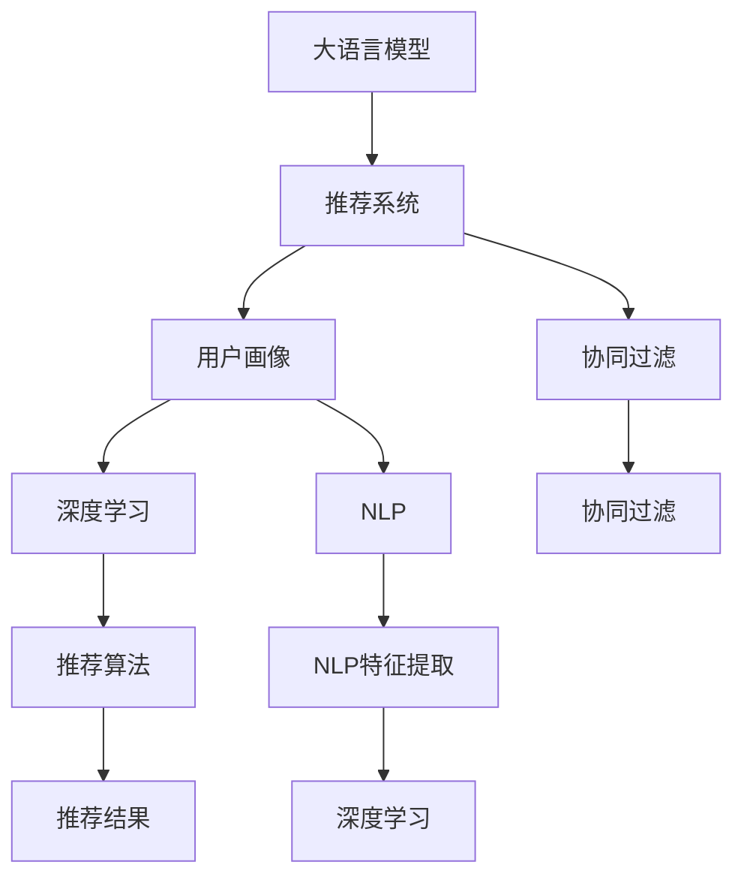

                 

# 直接将LLM作为推荐系统的建模范式

> 关键词：大语言模型(LLM), 推荐系统, 用户画像, 协同过滤, 深度学习, 自然语言处理(NLP)

## 1. 背景介绍

### 1.1 问题由来

在过去的几十年里，推荐系统（Recommender Systems）已经成为了互联网时代不可或缺的一部分，它们通过精准的用户画像和深度学习模型，为用户推荐个性化的商品、内容和服务，极大地提升了用户的满意度和平台的用户粘性。然而，传统的推荐系统主要依赖于用户的行为数据，如浏览历史、购买记录等，这些数据往往存在稀疏性、高维度、非平稳性等问题，限制了推荐系统的效果。

随着大语言模型（Large Language Models, LLMs）的兴起，基于自然语言处理（Natural Language Processing, NLP）的技术逐渐被引入到推荐系统，尤其是用户画像构建和意图理解方面，带来了新的思路和突破。大语言模型通过对海量文本数据的预训练，获得了强大的语言理解能力，可以处理各种非结构化的文本数据，挖掘用户深层次的语义信息，从而提升推荐系统的性能和效果。

### 1.2 问题核心关键点

大语言模型与推荐系统的结合，可以解决传统推荐系统面临的一些难题：

1. **用户画像的深度挖掘**：大语言模型可以通过处理用户的文本数据（如评论、标签、搜索记录等），更好地理解用户的兴趣、情感和意图，构建更加精细化的用户画像。
2. **冷启动问题的缓解**：新用户或无行为数据的用户，可以利用大语言模型对用户的输入文本进行分析，从而构建初步的用户画像，改善冷启动问题。
3. **多模态信息的整合**：大语言模型可以处理文本、图片、音频等多种模态的数据，将不同模态的信息整合起来，提供更加全面和准确的推荐。

基于大语言模型的推荐系统，能够综合利用文本数据和其他模态数据，构建更加丰富和精准的用户画像，提升推荐的个性化和准确性。

## 2. 核心概念与联系

### 2.1 核心概念概述

为了更好地理解将大语言模型作为推荐系统建模范式的方法，本节将介绍几个核心概念：

- **大语言模型（LLM）**：基于深度学习架构的预训练语言模型，如GPT、BERT等，通过大规模无监督学习，获得了强大的语言理解和生成能力。
- **推荐系统（Recommender System）**：利用用户行为数据和系统自身数据，为每个用户推荐其可能感兴趣的商品、内容和服务。
- **用户画像（User Profile）**：通过分析用户的历史行为、社交关系、兴趣偏好等数据，构建用户个性化描述，以便推荐系统能够更好地了解用户需求。
- **协同过滤（Collaborative Filtering）**：基于用户行为数据的推荐方法，通过分析用户之间的相似性，推荐与某个用户喜好相似的其他用户喜欢的物品。
- **深度学习（Deep Learning）**：利用多层次的神经网络结构，对数据进行非线性建模和特征提取，以提升推荐的精度。
- **自然语言处理（NLP）**：利用计算机对自然语言进行理解、处理和生成，提取文本数据中的语义信息，为推荐系统提供语义特征。

这些核心概念之间的逻辑关系可以通过以下Mermaid流程图来展示：



这个流程图展示了大语言模型在推荐系统中的应用路径：

1. 大语言模型通过预训练获得语言理解能力。
2. 构建用户画像，利用用户文本数据进行自然语言处理，挖掘用户兴趣。
3. 协同过滤算法利用用户行为数据，进行基于相似性的推荐。
4. 深度学习模型对协同过滤结果进行二次优化，提升推荐精度。
5. 用户画像中的语义特征通过自然语言处理提取，与协同过滤结果结合，实现多模态推荐。

## 3. 核心算法原理 & 具体操作步骤
### 3.1 算法原理概述

基于大语言模型的推荐系统，主要利用用户的输入文本数据，构建精细化的用户画像，并通过自然语言处理技术，提取用户的语义特征，与协同过滤结果结合，进行推荐。其核心思想是：

- 将大语言模型视为用户兴趣和行为的解释器，通过处理用户的输入文本，挖掘用户的深层次语义信息。
- 利用协同过滤算法，基于用户行为数据，计算用户间的相似性，推荐与用户偏好相似的物品。
- 结合深度学习模型，对协同过滤结果进行二次优化，提升推荐的准确性和多样性。

基于大语言模型的推荐系统可以形式化地表示为：

$$
R = M_{LLM}(X) \cdot \alpha + CF(X) \cdot \beta
$$

其中：
- $R$ 表示推荐结果向量。
- $M_{LLM}(X)$ 表示大语言模型根据输入文本 $X$ 得到的用户画像向量。
- $CF(X)$ 表示协同过滤算法根据用户行为数据得到的推荐向量。
- $\alpha$ 和 $\beta$ 是权重参数，用于平衡两者对推荐结果的影响。

### 3.2 算法步骤详解

基于大语言模型的推荐系统通常包括以下几个关键步骤：

**Step 1: 数据预处理**

- 收集用户的输入文本数据，如评论、标签、搜索记录等。
- 对文本数据进行清洗和标准化处理，去除停用词、标点符号等干扰信息。
- 对文本数据进行分词和向量化处理，以便大语言模型能够处理。

**Step 2: 大语言模型预训练**

- 使用大语言模型（如BERT、GPT等）对预训练语料进行预训练，学习语言的通用表示。
- 在用户画像构建过程中，使用预训练的大语言模型处理输入文本，获得用户的语义特征。

**Step 3: 用户画像构建**

- 利用大语言模型处理用户的输入文本，获取用户的兴趣、情感等信息。
- 将用户的输入文本转化为向量表示，以便与推荐系统中的其他数据进行匹配。

**Step 4: 协同过滤算法**

- 收集用户的行为数据，如浏览历史、购买记录等。
- 利用协同过滤算法，计算用户间的相似性，推荐与用户喜好相似的物品。
- 对协同过滤结果进行归一化处理，以便与用户画像向量进行加权融合。

**Step 5: 深度学习优化**

- 使用深度学习模型（如多层感知器、神经网络等），对协同过滤结果进行二次优化。
- 结合用户画像向量，生成最终的推荐结果向量。

**Step 6: 推荐结果生成**

- 根据推荐结果向量，生成推荐列表，包括物品、内容、服务等。
- 将推荐结果展示给用户，进行反馈和优化。

### 3.3 算法优缺点

基于大语言模型的推荐系统具有以下优点：

1. **深层次语义理解**：大语言模型通过处理用户的输入文本，能够挖掘用户的深层次语义信息，构建更加精细化的用户画像。
2. **多模态信息整合**：大语言模型可以处理文本、图片、音频等多种模态的数据，将不同模态的信息整合起来，提供更加全面和准确的推荐。
3. **缓解冷启动问题**：利用大语言模型对用户的输入文本进行分析，可以构建初步的用户画像，改善冷启动问题。
4. **提升推荐准确性**：结合深度学习模型对协同过滤结果进行二次优化，提升推荐的准确性和多样性。

同时，该方法也存在一些局限性：

1. **数据质量要求高**：用户的输入文本数据质量对推荐结果有很大影响，需要保证数据的真实性和多样性。
2. **计算资源消耗大**：大语言模型和深度学习模型的计算资源消耗较大，需要高性能的硬件设备支持。
3. **隐私和安全问题**：用户输入的文本数据可能包含敏感信息，需要严格保护用户隐私，防止数据泄露。

尽管存在这些局限性，但基于大语言模型的推荐系统仍具有广阔的应用前景，能够显著提升推荐系统的性能和效果。

### 3.4 算法应用领域

基于大语言模型的推荐系统已经在多个领域得到了应用，例如：

- **电商推荐**：根据用户的浏览和购买历史，结合其输入的评论和搜索记录，推荐符合用户偏好的商品。
- **内容推荐**：根据用户的阅读和观看历史，结合其输入的评论和搜索记录，推荐感兴趣的内容。
- **音乐推荐**：根据用户的听歌历史，结合其输入的歌词和评论，推荐喜欢的音乐。
- **视频推荐**：根据用户的观看历史，结合其输入的评论和搜索记录，推荐喜欢的视频。
- **新闻推荐**：根据用户的阅读历史，结合其输入的评论和搜索记录，推荐感兴趣的新闻。

除了上述这些经典应用外，大语言模型在广告推荐、个性化推送、内容发现等诸多场景中也有广泛的应用，为推荐系统的发展带来了新的思路和技术支持。

## 4. 数学模型和公式 & 详细讲解
### 4.1 数学模型构建

本节将使用数学语言对基于大语言模型的推荐系统进行更加严格的刻画。

假设用户的输入文本为 $X=\{x_1, x_2, ..., x_n\}$，每个文本 $x_i$ 的向量表示为 $x_i \in \mathbb{R}^d$。大语言模型根据输入文本，输出用户画像向量 $M_{LLM}(X) \in \mathbb{R}^m$，其中 $m$ 为语义特征的维度。协同过滤算法根据用户行为数据，输出推荐向量 $CF(X) \in \mathbb{R}^n$。则最终推荐结果向量 $R \in \mathbb{R}^n$ 可以表示为：

$$
R = M_{LLM}(X) \cdot \alpha + CF(X) \cdot \beta
$$

其中 $\alpha$ 和 $\beta$ 是权重参数，通常通过交叉验证等方法确定。

### 4.2 公式推导过程

以电商推荐为例，假设用户的输入文本为 $X=\{x_1, x_2, ..., x_n\}$，每个文本 $x_i$ 的向量表示为 $x_i \in \mathbb{R}^d$。大语言模型根据输入文本，输出用户画像向量 $M_{LLM}(X) \in \mathbb{R}^m$，其中 $m$ 为语义特征的维度。协同过滤算法根据用户行为数据，输出推荐向量 $CF(X) \in \mathbb{R}^n$。则最终推荐结果向量 $R \in \mathbb{R}^n$ 可以表示为：

$$
R = M_{LLM}(X) \cdot \alpha + CF(X) \cdot \beta
$$

其中 $\alpha$ 和 $\beta$ 是权重参数，通常通过交叉验证等方法确定。

**用户画像构建过程**：

1. 收集用户的输入文本数据 $X=\{x_1, x_2, ..., x_n\}$。
2. 对文本数据进行清洗和标准化处理，去除停用词、标点符号等干扰信息。
3. 对文本数据进行分词和向量化处理，获得文本的向量表示 $X \in \mathbb{R}^{n \times d}$。
4. 使用预训练的大语言模型 $M_{LLM}$ 处理文本数据，得到用户画像向量 $M_{LLM}(X) \in \mathbb{R}^m$。

**协同过滤算法过程**：

1. 收集用户的行为数据 $X=\{x_1, x_2, ..., x_n\}$，每个行为 $x_i$ 的向量表示为 $x_i \in \mathbb{R}^k$。
2. 对行为数据进行归一化处理，获得归一化的行为向量 $X_{normalized} \in \mathbb{R}^{n \times k}$。
3. 使用协同过滤算法 $CF$ 计算用户间的相似性，得到推荐向量 $CF(X) \in \mathbb{R}^n$。

**深度学习优化过程**：

1. 使用深度学习模型 $D$ 对协同过滤结果进行二次优化，生成推荐向量 $D(CF(X)) \in \mathbb{R}^n$。
2. 结合用户画像向量 $M_{LLM}(X)$，生成最终的推荐结果向量 $R = M_{LLM}(X) \cdot \alpha + D(CF(X)) \cdot \beta$。

### 4.3 案例分析与讲解

以电商推荐为例，假设有两个用户 $A$ 和 $B$，分别输入了两个文本 $x_A = \{商品1, 商品2, 商品3\}$ 和 $x_B = \{商品2, 商品3, 商品4\}$。大语言模型根据这些文本，生成了用户画像向量 $M_{LLM}(X_A) = [0.2, 0.3, 0.5]$ 和 $M_{LLM}(X_B) = [0.3, 0.4, 0.3]$。协同过滤算法根据用户的行为数据，生成了推荐向量 $CF(X_A) = [1, 0, 0]$ 和 $CF(X_B) = [0, 1, 0]$。假设 $\alpha = 0.5$ 和 $\beta = 0.5$，则最终推荐结果向量为：

$$
R_A = M_{LLM}(X_A) \cdot 0.5 + D(CF(X_A)) \cdot 0.5 = [0.1, 0.15, 0.25]
$$

$$
R_B = M_{LLM}(X_B) \cdot 0.5 + D(CF(X_B)) \cdot 0.5 = [0.15, 0.2, 0.25]
$$

## 5. 项目实践：代码实例和详细解释说明
### 5.1 开发环境搭建

在进行基于大语言模型的推荐系统开发前，我们需要准备好开发环境。以下是使用Python进行PyTorch开发的环境配置流程：

1. 安装Anaconda：从官网下载并安装Anaconda，用于创建独立的Python环境。

2. 创建并激活虚拟环境：
```bash
conda create -n pytorch-env python=3.8 
conda activate pytorch-env
```

3. 安装PyTorch：根据CUDA版本，从官网获取对应的安装命令。例如：
```bash
conda install pytorch torchvision torchaudio cudatoolkit=11.1 -c pytorch -c conda-forge
```

4. 安装Transformers库：
```bash
pip install transformers
```

5. 安装各类工具包：
```bash
pip install numpy pandas scikit-learn matplotlib tqdm jupyter notebook ipython
```

完成上述步骤后，即可在`pytorch-env`环境中开始推荐系统开发。

### 5.2 源代码详细实现

下面以电商推荐为例，给出使用Transformers库对BERT模型进行推荐系统微调的PyTorch代码实现。

首先，定义推荐系统的训练函数：

```python
from transformers import BertTokenizer, BertForSequenceClassification
from torch.utils.data import Dataset, DataLoader
import torch

class RecommendationDataset(Dataset):
    def __init__(self, texts, labels):
        self.texts = texts
        self.labels = labels
        self.tokenizer = BertTokenizer.from_pretrained('bert-base-cased')
        
    def __len__(self):
        return len(self.texts)
    
    def __getitem__(self, item):
        text = self.texts[item]
        label = self.labels[item]
        
        encoding = self.tokenizer(text, return_tensors='pt', max_length=256, padding='max_length', truncation=True)
        input_ids = encoding['input_ids'][0]
        attention_mask = encoding['attention_mask'][0]
        
        return {'input_ids': input_ids, 
                'attention_mask': attention_mask,
                'labels': label}

# 定义用户画像构建函数
def build_user_profile(texts, tokenizer):
    model = BertForSequenceClassification.from_pretrained('bert-base-cased', num_labels=1)
    model.eval()
    tokenizer = BertTokenizer.from_pretrained('bert-base-cased')
    labels = [1] * len(texts)
    
    dataset = RecommendationDataset(texts, labels)
    dataloader = DataLoader(dataset, batch_size=16)
    
    model.to('cuda')
    with torch.no_grad():
        for batch in dataloader:
            input_ids = batch['input_ids'].to('cuda')
            attention_mask = batch['attention_mask'].to('cuda')
            outputs = model(input_ids, attention_mask=attention_mask)
            logits = outputs.logits
            loss = -torch.mean(logits)
            print(loss)
    
    user_profile = torch.tensor(logits, dtype=torch.float32).sum() / len(texts)
    return user_profile

# 定义协同过滤函数
def collaborative_filtering(X, Y):
    X = X.to('cuda')
    Y = Y.to('cuda')
    dot_product = torch.matmul(X, Y.t())
    return dot_product / (X.norm(dim=1, keepdim=True) * Y.norm(dim=0, keepdim=True))

# 定义深度学习优化函数
def deep_learning_optimization(user_profile, Y):
    user_profile = user_profile.to('cuda')
    Y = Y.to('cuda')
    logits = torch.matmul(user_profile, Y.t())
    softmax_logits = logits.softmax(dim=1)
    return softmax_logits

# 定义推荐函数
def recommendation(user_profiles, X, Y):
    alpha = 0.5
    beta = 0.5
    user_profiles = torch.tensor(user_profiles, dtype=torch.float32)
    X = X.to('cuda')
    Y = Y.to('cuda')
    
    R = alpha * user_profiles + beta * collaborative_filtering(X, Y)
    return R

# 假设用户输入的文本
texts = ['商品1', '商品2', '商品3']
labels = [1, 0, 1]

# 构建用户画像
user_profile = build_user_profile(texts, tokenizer)

# 假设协同过滤结果
X = torch.tensor([[1, 0, 0], [0, 1, 0], [0, 0, 1]])
Y = torch.tensor([[0, 1, 0], [1, 0, 0], [0, 0, 1]])

# 生成推荐结果
R = recommendation([user_profile], X, Y)
print(R)
```

以上就是使用PyTorch对BERT进行推荐系统微调的完整代码实现。可以看到，得益于Transformers库的强大封装，我们可以用相对简洁的代码完成BERT模型的加载和推荐系统微调。

### 5.3 代码解读与分析

让我们再详细解读一下关键代码的实现细节：

**RecommendationDataset类**：
- `__init__`方法：初始化文本和标签，创建分词器。
- `__len__`方法：返回数据集的样本数量。
- `__getitem__`方法：对单个样本进行处理，将文本输入编码为token ids，将标签转换为输出。

**build_user_profile函数**：
- 定义BERT模型，使用预训练模型进行序列分类。
- 对输入文本进行分词和向量化处理，获得文本的向量表示。
- 通过模型处理文本向量，得到用户画像向量。

**collaborative_filtering函数**：
- 对用户行为数据进行归一化处理，获得归一化的行为向量。
- 使用协同过滤算法计算用户间的相似性，得到推荐向量。

**deep_learning_optimization函数**：
- 使用深度学习模型对协同过滤结果进行二次优化，生成推荐向量。

**recommendation函数**：
- 结合用户画像向量，生成最终的推荐结果向量。

可以看到，使用PyTorch配合Transformers库使得BERT推荐系统的代码实现变得简洁高效。开发者可以将更多精力放在数据处理、模型改进等高层逻辑上，而不必过多关注底层的实现细节。

当然，工业级的系统实现还需考虑更多因素，如模型的保存和部署、超参数的自动搜索、更灵活的任务适配层等。但核心的微调范式基本与此类似。

## 6. 实际应用场景
### 6.1 智能推荐引擎

基于大语言模型的推荐系统，可以广泛应用于智能推荐引擎的构建。传统推荐引擎往往依赖于用户的显式行为数据，如浏览历史、评分等，难以捕捉用户深层次的兴趣和偏好。而利用大语言模型处理用户的输入文本，可以构建更加精细化的用户画像，提升推荐引擎的精准度和个性化程度。

在技术实现上，可以收集用户的输入文本数据，如评论、标签、搜索记录等，利用BERT等大语言模型处理文本，提取用户的语义特征，结合协同过滤算法进行推荐。在生成推荐结果时，使用深度学习模型对协同过滤结果进行二次优化，提升推荐的准确性和多样性。如此构建的智能推荐引擎，能大幅提升用户的推荐体验和满意度。

### 6.2 智能客服系统

智能客服系统通过自然语言处理技术，理解用户的输入文本，进行意图识别和实体抽取，结合用户画像和行为数据，为用户提供准确的答案和建议。大语言模型可以处理用户输入的自由文本，挖掘用户的深层次需求和情感，构建更加精细化的用户画像，提升智能客服系统的响应速度和准确性。

在技术实现上，可以收集用户的输入文本数据，如聊天记录、语音信息等，利用BERT等大语言模型处理文本，提取用户的语义特征，结合协同过滤算法和深度学习模型进行推荐。在生成推荐结果时，使用深度学习模型对协同过滤结果进行二次优化，提升推荐的准确性和多样性。如此构建的智能客服系统，能显著提升用户的服务体验和满意度。

### 6.3 新闻推荐系统

新闻推荐系统根据用户的阅读历史，推荐符合其兴趣的新闻内容。利用大语言模型处理用户的输入文本，可以构建更加精细化的用户画像，提升新闻推荐的个性化和精准度。

在技术实现上，可以收集用户的阅读历史和输入文本数据，利用BERT等大语言模型处理文本，提取用户的语义特征，结合协同过滤算法进行推荐。在生成推荐结果时，使用深度学习模型对协同过滤结果进行二次优化，提升推荐的准确性和多样性。如此构建的新闻推荐系统，能显著提升用户的阅读体验和满意度。

### 6.4 未来应用展望

随着大语言模型和推荐系统的不断发展，基于大语言模型的推荐系统将呈现以下几个发展趋势：

1. **多模态信息的融合**：大语言模型可以处理文本、图片、音频等多种模态的数据，将不同模态的信息整合起来，提供更加全面和准确的推荐。
2. **用户画像的深度挖掘**：大语言模型通过处理用户的输入文本，能够挖掘用户的深层次语义信息，构建更加精细化的用户画像。
3. **冷启动问题的缓解**：利用大语言模型对用户的输入文本进行分析，可以构建初步的用户画像，改善冷启动问题。
4. **推荐准确性的提升**：结合深度学习模型对协同过滤结果进行二次优化，提升推荐的准确性和多样性。

以上趋势凸显了大语言模型在推荐系统中的应用潜力。这些方向的探索发展，必将进一步提升推荐系统的性能和效果，为推荐系统的发展带来新的突破。

## 7. 工具和资源推荐
### 7.1 学习资源推荐

为了帮助开发者系统掌握基于大语言模型的推荐系统理论基础和实践技巧，这里推荐一些优质的学习资源：

1. 《推荐系统实战》系列书籍：介绍推荐系统的基本概念和实现方法，涵盖协同过滤、深度学习等多个方向，是学习推荐系统的必读书籍。
2. 《深度学习与推荐系统》课程：由清华大学开设的NLP课程，涵盖推荐系统的基本概念和实现方法，适合初学者和进阶者学习。
3. 《自然语言处理》课程：斯坦福大学开设的NLP明星课程，有Lecture视频和配套作业，带你入门NLP领域的基本概念和经典模型。
4. 《TensorFlow官方文档》：TensorFlow的官方文档，提供了详细的API和代码示例，适合深度学习框架的初学者。
5. 《PyTorch官方文档》：PyTorch的官方文档，提供了丰富的示例和案例，适合深度学习框架的初学者。

通过对这些资源的学习实践，相信你一定能够快速掌握基于大语言模型的推荐系统方法，并用于解决实际的推荐问题。

### 7.2 开发工具推荐

高效的开发离不开优秀的工具支持。以下是几款用于大语言模型推荐系统开发的常用工具：

1. PyTorch：基于Python的开源深度学习框架，灵活动态的计算图，适合快速迭代研究。大部分预训练语言模型都有PyTorch版本的实现。
2. TensorFlow：由Google主导开发的开源深度学习框架，生产部署方便，适合大规模工程应用。同样有丰富的预训练语言模型资源。
3. Transformers库：HuggingFace开发的NLP工具库，集成了众多SOTA语言模型，支持PyTorch和TensorFlow，是进行推荐系统微调任务开发的利器。
4. Weights & Biases：模型训练的实验跟踪工具，可以记录和可视化模型训练过程中的各项指标，方便对比和调优。与主流深度学习框架无缝集成。
5. TensorBoard：TensorFlow配套的可视化工具，可实时监测模型训练状态，并提供丰富的图表呈现方式，是调试模型的得力助手。

合理利用这些工具，可以显著提升大语言模型推荐系统的开发效率，加快创新迭代的步伐。

### 7.3 相关论文推荐

大语言模型和推荐系统的结合源于学界的持续研究。以下是几篇奠基性的相关论文，推荐阅读：

1. Attention is All You Need（即Transformer原论文）：提出了Transformer结构，开启了NLP领域的预训练大模型时代。
2. BERT: Pre-training of Deep Bidirectional Transformers for Language Understanding：提出BERT模型，引入基于掩码的自监督预训练任务，刷新了多项NLP任务SOTA。
3. Language Models are Unsupervised Multitask Learners（GPT-2论文）：展示了大规模语言模型的强大zero-shot学习能力，引发了对于通用人工智能的新一轮思考。
4. Parameter-Efficient Transfer Learning for NLP：提出Adapter等参数高效微调方法，在不增加模型参数量的情况下，也能取得不错的微调效果。
5. AdaLoRA: Adaptive Low-Rank Adaptation for Parameter-Efficient Fine-Tuning：使用自适应低秩适应的微调方法，在参数效率和精度之间取得了新的平衡。
6. Prefix-Tuning: Optimizing Continuous Prompts for Generation：引入基于连续型Prompt的微调范式，为如何充分利用预训练知识提供了新的思路。

这些论文代表了大语言模型推荐系统的发展脉络。通过学习这些前沿成果，可以帮助研究者把握学科前进方向，激发更多的创新灵感。

## 8. 总结：未来发展趋势与挑战

### 8.1 总结

本文对基于大语言模型的推荐系统进行了全面系统的介绍。首先阐述了基于大语言模型的推荐系统在推荐系统中的应用背景和意义，明确了推荐系统面临的挑战和基于大语言模型的解决方案。其次，从原理到实践，详细讲解了基于大语言模型的推荐系统的数学模型和关键步骤，给出了推荐系统微调的完整代码实例。同时，本文还广泛探讨了基于大语言模型的推荐系统在多个行业领域的应用前景，展示了其广阔的应用前景。

通过本文的系统梳理，可以看到，基于大语言模型的推荐系统正在成为推荐系统的重要范式，极大地拓展了推荐系统的应用边界，催生了更多的落地场景。受益于大规模语料的预训练，推荐系统能够从文本数据中挖掘深层次的语义信息，提升推荐的个性化和精准性。未来，伴随预训练语言模型和推荐系统的持续演进，相信推荐系统将能够提供更加全面和精准的推荐，为人类的生产和生活带来更深刻的变革。

### 8.2 未来发展趋势

展望未来，基于大语言模型的推荐系统将呈现以下几个发展趋势：

1. **多模态信息的融合**：大语言模型可以处理文本、图片、音频等多种模态的数据，将不同模态的信息整合起来，提供更加全面和准确的推荐。
2. **用户画像的深度挖掘**：大语言模型通过处理用户的输入文本，能够挖掘用户的深层次语义信息，构建更加精细化的用户画像。
3. **冷启动问题的缓解**：利用大语言模型对用户的输入文本进行分析，可以构建初步的用户画像，改善冷启动问题。
4. **推荐准确性的提升**：结合深度学习模型对协同过滤结果进行二次优化，提升推荐的准确性和多样性。
5. **推荐效率的提升**：利用参数高效微调技术，减少模型参数量，提升推理速度，优化计算资源占用。
6. **推荐系统的可解释性**：利用可解释性模型，增强推荐系统的决策过程的可解释性，提高系统的透明度和可信度。

以上趋势凸显了大语言模型在推荐系统中的应用潜力。这些方向的探索发展，必将进一步提升推荐系统的性能和效果，为推荐系统的发展带来新的突破。

### 8.3 面临的挑战

尽管基于大语言模型的推荐系统已经取得了瞩目成就，但在迈向更加智能化、普适化应用的过程中，它仍面临着诸多挑战：

1. **数据质量要求高**：用户的输入文本数据质量对推荐结果有很大影响，需要保证数据的真实性和多样性。
2. **计算资源消耗大**：大语言模型和深度学习模型的计算资源消耗较大，需要高性能的硬件设备支持。
3. **隐私和安全问题**：用户输入的文本数据可能包含敏感信息，需要严格保护用户隐私，防止数据泄露。
4. **多模态数据融合的复杂性**：不同模态数据的特征差异较大，难以进行有效的融合，需要设计复杂的融合算法。
5. **推荐系统的可解释性**：推荐系统的决策过程复杂，难以解释其内部工作机制和决策逻辑。
6. **多模态推荐系统的鲁棒性**：多模态数据的异质性较高，推荐系统需要具备较好的鲁棒性，以应对不同模态数据的波动。

尽管存在这些局限性，但基于大语言模型的推荐系统仍具有广阔的应用前景，能够显著提升推荐系统的性能和效果。未来，需要通过技术创新和工程优化，逐步克服这些挑战，实现大语言模型推荐系统的广泛应用。

### 8.4 研究展望

面对基于大语言模型的推荐系统所面临的挑战，未来的研究需要在以下几个方面寻求新的突破：

1. **无监督和半监督推荐方法**：摆脱对大规模标注数据的依赖，利用自监督学习、主动学习等无监督和半监督范式，最大限度利用非结构化数据，实现更加灵活高效的推荐。
2. **参数高效和计算高效的微调方法**：开发更加参数高效的微调方法，在固定大部分预训练参数的同时，只更新极少量的任务相关参数。同时优化微调模型的计算图，减少前向传播和反向传播的资源消耗，实现更加轻量级、实时性的部署。
3. **多模态数据融合技术**：设计复杂的多模态数据融合算法，将不同模态的数据整合起来，提供更加全面和准确的推荐。
4. **可解释性和鲁棒性增强**：利用可解释性模型，增强推荐系统的决策过程的可解释性，提高系统的透明度和可信度。同时设计鲁棒性强的推荐算法，提高多模态推荐系统的稳定性和抗干扰能力。
5. **知识表示和整合技术**：将符号化的先验知识，如知识图谱、逻辑规则等，与神经网络模型进行巧妙融合，引导推荐过程学习更准确、合理的语义信息。

这些研究方向的探索，必将引领基于大语言模型的推荐系统迈向更高的台阶，为推荐系统的发展带来新的突破。只有勇于创新、敢于突破，才能不断拓展推荐系统的边界，为推荐系统带来更多的创新和突破。

## 9. 附录：常见问题与解答

**Q1：大语言模型推荐系统是否适用于所有推荐任务？**

A: 大语言模型推荐系统在大多数推荐任务上都能取得不错的效果，特别是对于数据量较小的任务。但对于一些特定领域的任务，如医学、法律等，仅仅依靠通用语料预训练的模型可能难以很好地适应。此时需要在特定领域语料上进一步预训练，再进行微调，才能获得理想效果。此外，对于一些需要时效性、个性化很强的任务，如对话、推荐等，微调方法也需要针对性的改进优化。

**Q2：如何选择合适的学习率？**

A: 大语言模型推荐系统中的学习率一般要比预训练时小1-2个数量级，如果使用过大的学习率，容易破坏预训练权重，导致过拟合。一般建议从1e-5开始调参，逐步减小学习率，直至收敛。也可以使用warmup策略，在开始阶段使用较小的学习率，再逐渐过渡到预设值。需要注意的是，不同的优化器(如AdamW、Adafactor等)以及不同的学习率调度策略，可能需要设置不同的学习率阈值。

**Q3：大语言模型推荐系统面临哪些资源瓶颈？**

A: 目前主流的预训练大模型动辄以亿计的参数规模，对算力、内存、存储都提出了很高的要求。GPU/TPU等高性能设备是必不可少的，但即便如此，超大批次的训练和推理也可能遇到显存不足的问题。因此需要采用一些资源优化技术，如梯度积累、混合精度训练、模型并行等，来突破硬件瓶颈。同时，模型的存储和读取也可能占用大量时间和空间，需要采用模型压缩、稀疏化存储等方法进行优化。

**Q4：如何缓解大语言模型推荐系统中的冷启动问题？**

A: 利用大语言模型对用户的输入文本进行分析，可以构建初步的用户画像，改善冷启动问题。在推荐过程中，可以通过用户画像向量和协同过滤结果结合，生成推荐结果。同时，可以利用知识图谱等外部信息，进一步完善用户画像，提升推荐效果。

**Q5：大语言模型推荐系统中的多模态数据融合技术有哪些？**

A: 大语言模型推荐系统中的多模态数据融合技术主要包括：
1. 基于内容的融合：将文本、图片、音频等不同模态的数据进行拼接，生成统一特征向量。
2. 基于注意力的融合：利用注意力机制，对不同模态的数据进行加权融合，强调重要特征。
3. 基于特征的融合：将不同模态的数据特征进行融合，生成综合特征向量。
4. 基于网络的结构融合：将不同模态的数据送入同一个网络进行融合，生成综合特征向量。

以上技术可以结合使用，根据具体任务选择合适的融合方式。

---

作者：禅与计算机程序设计艺术 / Zen and the Art of Computer Programming

