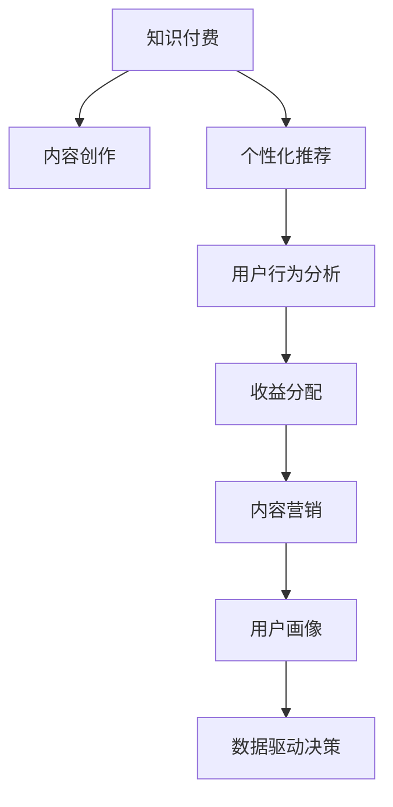

                 

# 知识付费与个人品牌价值提升

> 关键词：知识付费,个人品牌,价值提升,用户分析,推荐算法,内容营销,收益分配,用户行为预测,数据驱动决策

## 1. 背景介绍

### 1.1 问题由来

随着互联网的发展，知识付费逐渐成为一种新兴的消费模式。知识付费不仅满足了用户对高质量、专业化内容的渴求，也极大地促进了个人品牌价值的提升。越来越多的专家学者、行业精英和内容创作者通过知识付费平台，将自己的知识和经验转化为市场价值，实现经济收益和个人品牌的价值提升。

知识付费的兴起，得益于互联网技术的成熟和信息获取方式的变革。大数据、云计算、人工智能等技术的快速发展，为知识付费平台提供了强大的技术支撑，使得个性化推荐、精准营销、用户行为分析等成为可能。与此同时，随着移动互联网设备的普及和在线时间的大幅增加，用户对于高质量、结构化、系统化的知识内容需求不断上升，推动了知识付费市场的持续增长。

### 1.2 问题核心关键点

知识付费与个人品牌价值提升的核心关键点在于：

- **高质量内容生产与传播**：高质量的内容能够吸引用户付费，同时提升内容创作者的知名度和影响力。
- **精准用户画像与匹配**：精准的个性化推荐算法，能够有效提升用户满意度和付费意愿。
- **有效的用户行为分析**：通过数据分析，了解用户需求和偏好，优化内容生产和推荐策略。
- **合理的收益分配机制**：设计公平透明的用户付费收益分配机制，激发内容创作者的生产积极性。
- **数据驱动的决策支持**：利用数据驱动的业务决策，优化平台运营效果和用户体验。

## 2. 核心概念与联系

### 2.1 核心概念概述

为更好地理解知识付费与个人品牌价值提升，本节将介绍几个密切相关的核心概念：

- **知识付费**：用户为获取高质量、专业化的知识内容，支付相应费用的模式。知识付费平台通过向用户提供各类专业课程、在线讲座、阅读文档等，帮助用户解决特定问题或提升个人技能。
- **个人品牌**：个人或组织在网络上的识别度和影响力，通常由其专业知识和技能、成就和声誉、公众互动等多种因素综合构成。在知识付费领域，个人品牌价值可以通过内容的受欢迎程度、粉丝数量、评价反馈等指标来衡量。
- **内容营销**：通过生产、分享、推广有价值的内容，吸引用户关注，提升品牌影响力，并最终实现销售转化的策略。内容营销包括文章、视频、音频、图像等多种形式，涵盖知识付费、社交媒体、广告等多个领域。
- **推荐算法**：通过用户历史行为、兴趣偏好、社交关系等数据，对用户进行精准推荐，提升用户满意度和留存率。推荐算法是知识付费平台的核心技术之一。
- **收益分配**：知识付费平台的商业模式主要基于内容付费，因此，如何公平、透明地分配用户付费收益，激励内容创作者生产优质内容，是平台运营的重要课题。
- **用户行为预测**：利用数据分析技术，预测用户的行为（如支付意愿、内容偏好等），优化内容推荐和营销策略。

这些核心概念之间的逻辑关系可以通过以下Mermaid流程图来展示：



这个流程图展示了几大核心概念之间的联系：

1. 知识付费平台通过内容创作吸引用户。
2. 利用个性化推荐提升用户满意度和付费意愿。
3. 通过用户行为分析优化内容推荐。
4. 设计公平的收益分配机制，激励内容创作者。
5. 利用内容营销推广平台和内容。
6. 借助用户画像丰富用户画像，优化推荐算法。
7. 数据驱动决策优化平台运营。

这些概念共同构成了知识付费平台的核心业务逻辑，使得平台能够高效运营并提升内容创作者的收益和个人品牌价值。

## 3. 核心算法原理 & 具体操作步骤

### 3.1 算法原理概述

知识付费与个人品牌价值提升的算法原理主要涉及以下几个方面：

- **内容创作与推荐**：利用自然语言处理(NLP)、图像识别、语音识别等技术，生成高质量、结构化的内容，并通过推荐算法为用户推荐个性化内容。
- **用户行为分析**：通过用户历史行为数据，包括购买记录、浏览历史、互动反馈等，分析用户偏好和行为模式。
- **收益分配模型**：设计公平透明的收益分配机制，确保内容创作者的收益与其贡献相匹配。

### 3.2 算法步骤详解

知识付费平台的核心算法步骤包括：

1. **内容创作与生成**：
   - 确定内容主题和形式，如视频课程、文字文档、音频讲座等。
   - 制作高质量的内容，包括原创性、专业性、结构化等。
   - 利用NLP技术进行内容清洗和优化，提高内容的可读性和吸引力。

2. **用户画像构建**：
   - 收集用户行为数据，如浏览记录、购买记录、互动反馈等。
   - 利用机器学习算法，构建用户兴趣模型，识别用户偏好和行为模式。
   - 结合社交关系和外显信息（如职业、学历等），丰富用户画像。

3. **个性化推荐**：
   - 利用协同过滤、基于内容的推荐、深度学习等算法，为用户推荐个性化内容。
   - 定期更新推荐模型，考虑用户行为变化和新内容的发布。
   - 通过A/B测试等方法，评估推荐效果并不断优化。

4. **收益分配模型设计**：
   - 分析用户付费行为，建立内容付费收益模型。
   - 设计透明、公平的收益分配规则，确保内容创作者收益与其贡献相匹配。
   - 定期调整收益分配模型，反映用户和市场变化。

5. **数据驱动的决策支持**：
   - 收集和分析平台运营数据，如用户留存率、付费率、内容流量等。
   - 利用数据挖掘和机器学习技术，发现业务瓶颈和改进机会。
   - 制定数据驱动的业务决策，优化平台运营效果和用户体验。

### 3.3 算法优缺点

知识付费与个人品牌价值提升的算法有以下优点：

- **高效性**：利用算法可以快速处理大量数据，为用户提供个性化推荐，提高用户满意度和付费意愿。
- **透明性**：通过算法，可以透明地展示内容推荐和收益分配规则，增加用户信任。
- **可扩展性**：算法可以灵活扩展，适应不同的内容形式和平台规模。
- **可控性**：算法可以控制推荐内容的质量和数量，避免低质量内容影响用户体验。

同时，算法也存在一些局限性：

- **依赖数据质量**：算法的表现高度依赖于数据质量，数据不完整或不准确会导致推荐效果不佳。
- **个性化偏差**：个性化推荐可能导致信息茧房，即用户仅接触到与其偏好相似的内容，无法全面了解多样性信息。
- **复杂度**：算法设计复杂，需要专业知识支持，普通用户难以理解和调整。

### 3.4 算法应用领域

基于知识付费的算法已广泛应用于以下领域：

1. **在线教育**：如Coursera、Udacity等平台，通过推荐算法为用户推荐优质课程，提升学习体验和效果。
2. **职业培训**：如LinkedIn Learning，通过推荐专业课程和资料，帮助用户提升职业竞争力。
3. **知识服务**：如知识星球、得到等，利用推荐算法为用户推荐订阅内容，满足个性化知识需求。
4. **健康管理**：如医馆在线、丁香医生，通过推荐健康知识和医疗服务，提升用户健康管理能力。
5. **财经分析**：如雪球、天天基金，利用推荐算法为用户推荐财经资讯和投资建议，提升投资决策水平。

除了上述领域，知识付费的算法还广泛应用于金融、教育、医疗等多个垂直领域，为各类知识服务的个性化推荐和运营优化提供了重要支撑。

## 4. 数学模型和公式 & 详细讲解 & 举例说明

### 4.1 数学模型构建

本节将使用数学语言对知识付费与个人品牌价值提升的算法进行更加严格的刻画。

假设知识付费平台上有 $N$ 个用户，每个用户对应 $M$ 个内容 $C_i$，其中 $i=1,2,...,M$。用户对内容 $C_i$ 的评分 $r_{uj}$ 和付费概率 $p_{uj}$ 如下：

$$
r_{uj} = \mathbb{E}[r|U=u, C=C_i]
$$

$$
p_{uj} = \mathbb{E}[p|U=u, C=C_i]
$$

其中 $U$ 表示用户，$C$ 表示内容。用户 $u$ 对内容 $C_i$ 的评分和付费概率分别由模型 $R$ 和 $P$ 预测。

知识付费平台的目标是最大化平台总收益，因此目标函数为：

$$
\max_{\theta} \sum_{u=1}^N \sum_{i=1}^M p_{uj} \cdot P(u, C_i, \theta)
$$

其中 $P(u, C_i, \theta)$ 为内容 $C_i$ 对用户 $u$ 的付费概率预测模型，$\theta$ 为模型参数。

### 4.2 公式推导过程

假设模型 $P(u, C_i, \theta)$ 为线性模型，即：

$$
P(u, C_i, \theta) = \alpha_u + \sum_{j=1}^K \beta_{ij} \cdot \phi_j(C_i, \theta)
$$

其中 $\alpha_u$ 为截距，$\beta_{ij}$ 为第 $j$ 个特征对应的权重，$\phi_j(C_i, \theta)$ 为特征提取函数。

利用随机梯度下降(SGD)优化目标函数，可以得到内容推荐模型的更新公式：

$$
\theta \leftarrow \theta - \eta \cdot \frac{1}{N} \sum_{u=1}^N \sum_{i=1}^M \frac{\partial}{\partial \theta} \big[ p_{uj} \cdot P(u, C_i, \theta) \big]
$$

其中 $\eta$ 为学习率。

对于收益分配模型，假设平台有 $K$ 个内容创作者 $A_k$，用户对内容创作者 $A_k$ 的付费金额为 $B_{uk}$，则收益分配模型的目标函数为：

$$
\max_{\theta} \sum_{k=1}^K \sum_{u=1}^N B_{uk} \cdot Q(u, A_k, \theta)
$$

其中 $Q(u, A_k, \theta)$ 为内容创作者 $A_k$ 对用户 $u$ 的付费概率预测模型。

假设收益分配模型 $Q(u, A_k, \theta)$ 为线性模型：

$$
Q(u, A_k, \theta) = \alpha_k + \sum_{j=1}^K \beta_{kj} \cdot \phi_j(A_k, \theta)
$$

利用SGD优化目标函数，可以得到收益分配模型的更新公式：

$$
\theta \leftarrow \theta - \eta \cdot \frac{1}{N} \sum_{u=1}^N \sum_{k=1}^K \frac{\partial}{\partial \theta} \big[ B_{uk} \cdot Q(u, A_k, \theta) \big]
$$

### 4.3 案例分析与讲解

以在线教育平台Coursera为例，其内容推荐和收益分配模型的实现如下：

#### 内容推荐模型

Coursera利用协同过滤算法为用户推荐课程。假设用户 $u$ 对课程 $C_i$ 的评分 $r_{uj}$ 为 $1$（表示满意）和 $0$（表示不满意），则目标函数为：

$$
\max_{\theta} \sum_{u=1}^N \sum_{i=1}^M r_{uj} \cdot P(u, C_i, \theta)
$$

其中 $P(u, C_i, \theta)$ 为内容推荐模型，假设为线性模型：

$$
P(u, C_i, \theta) = \alpha_u + \sum_{j=1}^K \beta_{ij} \cdot \phi_j(C_i, \theta)
$$

在训练过程中，Coursera使用随机梯度下降法优化目标函数，更新模型参数。

#### 收益分配模型

Coursera设计了公平透明的收益分配机制，根据内容创作者 $A_k$ 的课程访问量和订阅量，计算其收益。假设用户 $u$ 对内容创作者 $A_k$ 的付费金额为 $B_{uk}$，则目标函数为：

$$
\max_{\theta} \sum_{k=1}^K \sum_{u=1}^N B_{uk} \cdot Q(u, A_k, \theta)
$$

其中 $Q(u, A_k, \theta)$ 为收益分配模型，假设为线性模型：

$$
Q(u, A_k, \theta) = \alpha_k + \sum_{j=1}^K \beta_{kj} \cdot \phi_j(A_k, \theta)
$$

在训练过程中，Coursera使用随机梯度下降法优化目标函数，更新模型参数。

## 5. 项目实践：代码实例和详细解释说明

### 5.1 开发环境搭建

在进行知识付费与个人品牌价值提升的算法实践前，我们需要准备好开发环境。以下是使用Python进行TensorFlow开发的环境配置流程：

1. 安装Anaconda：从官网下载并安装Anaconda，用于创建独立的Python环境。

2. 创建并激活虚拟环境：
```bash
conda create -n tf-env python=3.8 
conda activate tf-env
```

3. 安装TensorFlow：根据CUDA版本，从官网获取对应的安装命令。例如：
```bash
conda install tensorflow=2.5
```

4. 安装各类工具包：
```bash
pip install numpy pandas scikit-learn matplotlib tqdm jupyter notebook ipython
```

完成上述步骤后，即可在`tf-env`环境中开始算法实践。

### 5.2 源代码详细实现

这里我们以Coursera课程推荐为例，给出使用TensorFlow实现的内容推荐算法代码。

首先，定义内容推荐模型的超参数：

```python
import tensorflow as tf

# 定义超参数
learning_rate = 0.001
num_epochs = 100
batch_size = 128
num_features = 10  # 假设特征数量为10
```

然后，定义特征提取函数：

```python
def get_feature_vector(course):
    # 假设课程特征为vector
    features = tf.keras.layers.Dense(num_features, activation='relu')(course)
    return features
```

接着，定义用户画像向量：

```python
# 定义用户画像向量
user_vector = tf.keras.layers.Dense(num_features, activation='relu')(user)
```

然后，定义内容推荐模型：

```python
# 定义内容推荐模型
def recommendation_model(course):
    features = get_feature_vector(course)
    rating = tf.keras.layers.Dense(1, activation='sigmoid')(features)
    return rating

# 定义损失函数
def binary_crossentropy_loss(y_true, y_pred):
    return tf.keras.losses.BinaryCrossentropy()(y_true, y_pred)
```

最后，训练模型并进行推荐：

```python
# 定义训练数据
train_data = [(course1, user_vector1), (course2, user_vector2), ...]

# 定义优化器
optimizer = tf.keras.optimizers.Adam(learning_rate)

# 定义模型
model = tf.keras.models.Sequential([
    tf.keras.layers.Dense(64, activation='relu'),
    tf.keras.layers.Dense(32, activation='relu'),
    recommendation_model
])

# 定义模型编译
model.compile(optimizer=optimizer, loss=binary_crossentropy_loss)

# 训练模型
model.fit(train_data, epochs=num_epochs, batch_size=batch_size)

# 进行推荐
recommendations = model.predict(course_vector)
```

以上就是使用TensorFlow对Coursera课程推荐算法进行实现的全过程。可以看到，通过TensorFlow的强大封装，我们能够快速构建和训练内容推荐模型，并通过预测输出为用户推荐课程。

### 5.3 代码解读与分析

让我们再详细解读一下关键代码的实现细节：

**超参数定义**：
- 学习率：用于控制每次参数更新的步长大小，太小导致收敛慢，太大可能导致震荡。
- 迭代次数：训练轮数，一般设置较大的值以充分训练模型。
- 批量大小：每次训练的样本数量，设置较小的值可以减小内存占用，设置较大的值可以加快训练速度。
- 特征数量：输入特征的数量，需要根据实际问题进行调整。

**特征提取函数**：
- 利用Dense层进行特征向量的提取，增加模型的非线性能力。

**用户画像向量**：
- 通过Dense层将用户画像转换为固定长度的向量，方便模型进行计算。

**内容推荐模型**：
- 通过Dense层进行特征向量的转换和计算，最终输出课程推荐的概率。
- 使用sigmoid激活函数，将输出转换为0-1之间的概率值。

**损失函数**：
- 使用二元交叉熵损失函数，用于衡量模型预测的准确性。

**训练过程**：
- 利用优化器Adam对模型进行训练，不断调整模型参数，最小化损失函数。
- 使用模型编译方法定义模型的训练过程，设置损失函数和优化器。
- 使用模型fit方法进行模型训练，指定训练数据、迭代次数和批量大小。
- 利用predict方法进行推荐，对输入内容向量进行预测输出。

可以看出，通过TensorFlow的强大封装和高效的计算图机制，我们能够快速构建和训练内容推荐模型，并对输入内容进行预测推荐。

## 6. 实际应用场景

### 6.1 智能教育平台

在智能教育领域，知识付费与个人品牌价值提升的算法被广泛应用于各类在线教育平台。平台通过推荐算法为用户推荐课程和资料，提升用户满意度和学习效果，同时增加内容创作者的曝光率和收益。

例如，Coursera和Udacity等平台通过推荐算法，根据用户历史学习行为、兴趣爱好和学习目标，为用户推荐最合适的课程，提升学习效率和效果。同时，平台还根据课程访问量和订阅量，设计公平透明的收益分配机制，激励内容创作者生产优质课程内容，提升平台的教育质量和服务水平。

### 6.2 职业培训平台

职业培训平台如LinkedIn Learning，利用知识付费与个人品牌价值提升的算法，为用户推荐专业课程和资料，帮助用户提升职业竞争力。平台通过推荐算法，根据用户的工作经历、技能水平和学习目标，为用户推荐最合适的课程，提高职业培训的针对性和有效性。同时，平台还通过收益分配机制，激励内容创作者生产优质课程内容，提升平台的用户满意度和留存率。

### 6.3 知识服务平台

知识服务平台如知识星球、得到等，利用推荐算法为用户推荐订阅内容，满足用户个性化知识需求。平台通过推荐算法，根据用户的历史阅读记录、浏览历史和订阅偏好，为用户推荐最感兴趣的内容，提升用户满意度和留存率。同时，平台还通过收益分配机制，激励内容创作者生产优质内容，提升平台的内容质量和用户互动。

### 6.4 金融知识平台

金融知识平台如雪球、天天基金，利用推荐算法为用户推荐财经资讯和投资建议，提升用户的投资决策水平。平台通过推荐算法，根据用户的投资偏好和行为数据，为用户推荐最合适的财经资讯和投资建议，提高用户的投资收益和满意度。同时，平台还通过收益分配机制，激励内容创作者生产优质财经内容，提升平台的用户互动和知识传播效果。

## 7. 工具和资源推荐

### 7.1 学习资源推荐

为了帮助开发者系统掌握知识付费与个人品牌价值提升的算法，这里推荐一些优质的学习资源：

1. **《机器学习实战》**：李航著，介绍了机器学习的基本概念和算法实现，适合入门学习。
2. **《深度学习》**：Ian Goodfellow著，全面介绍了深度学习的基本原理和实践，适合进阶学习。
3. **Coursera《机器学习》课程**：斯坦福大学开设的著名课程，涵盖机器学习的基本概念和算法实现，有Lecture视频和配套作业，是学习机器学习的极佳选择。
4. **TensorFlow官方文档**：详细介绍了TensorFlow的各项功能和使用方法，是TensorFlow开发的必备资源。
5. **Scikit-learn官方文档**：详细介绍了Scikit-learn的各项功能和使用方法，是Python数据科学开发的必备资源。

通过这些资源的学习实践，相信你一定能够快速掌握知识付费与个人品牌价值提升的算法，并用于解决实际的NLP问题。

### 7.2 开发工具推荐

高效的开发离不开优秀的工具支持。以下是几款用于知识付费与个人品牌价值提升的算法开发的常用工具：

1. TensorFlow：由Google主导开发的开源深度学习框架，生产部署方便，适合大规模工程应用。
2. PyTorch：基于Python的开源深度学习框架，灵活性高，适合研究和原型开发。
3. Scikit-learn：基于Python的数据科学库，包含各类机器学习算法和工具，适合数据处理和模型训练。
4. Jupyter Notebook：交互式笔记本，支持Python代码执行和结果展示，适合快速原型开发和调试。
5. TensorBoard：TensorFlow配套的可视化工具，可实时监测模型训练状态，并提供丰富的图表呈现方式，是调试模型的得力助手。

合理利用这些工具，可以显著提升知识付费与个人品牌价值提升的算法开发效率，加快创新迭代的步伐。

### 7.3 相关论文推荐

知识付费与个人品牌价值提升的算法研究源于学界的持续研究。以下是几篇奠基性的相关论文，推荐阅读：

1. **《深度学习》**：Ian Goodfellow著，全面介绍了深度学习的基本原理和实践。
2. **《大规模分布式深度学习》**：Michael Abadi等著，介绍了大规模分布式深度学习的原理和实践。
3. **《神经网络与深度学习》**：Michael Nielsen著，介绍了神经网络和深度学习的基本概念和算法实现。
4. **《机器学习实战》**：李航著，介绍了机器学习的基本概念和算法实现，适合入门学习。

这些论文代表了大语言模型微调技术的发展脉络。通过学习这些前沿成果，可以帮助研究者把握学科前进方向，激发更多的创新灵感。

## 8. 总结：未来发展趋势与挑战

### 8.1 总结

本文对知识付费与个人品牌价值提升的算法进行了全面系统的介绍。首先阐述了知识付费的兴起背景和核心关键点，明确了算法在内容推荐、收益分配等方面的重要价值。其次，从原理到实践，详细讲解了算法的核心步骤和数学模型，给出了微调任务开发的完整代码实例。同时，本文还广泛探讨了算法在智能教育、职业培训、知识服务等多个领域的应用前景，展示了算法在提升用户满意度和平台运营效果方面的巨大潜力。此外，本文精选了算法学习的各类资源，力求为读者提供全方位的技术指引。

通过本文的系统梳理，可以看到，知识付费与个人品牌价值提升的算法正在成为NLP领域的重要范式，极大地拓展了内容创作者的收益空间，促进了平台运营的良性循环。未来，伴随深度学习技术的不断进步和应用场景的持续拓展，知识付费与个人品牌价值提升的算法必将在更多领域大放异彩，为各类知识服务的个性化推荐和运营优化提供重要支撑。

### 8.2 未来发展趋势

展望未来，知识付费与个人品牌价值提升的算法将呈现以下几个发展趋势：

1. **深度学习技术的进步**：深度学习技术的不断发展，将使得内容推荐和收益分配算法更加精准和高效。深度神经网络、强化学习等技术的应用，将提升算法的泛化能力和鲁棒性。
2. **多模态信息融合**：将文本、图像、语音等多模态信息进行融合，提升内容推荐和收益分配的全面性和准确性。多模态信息融合技术的发展，将为知识付费平台提供更丰富的数据来源和信息渠道。
3. **用户行为预测**：通过深度学习和大数据分析技术，提升用户行为预测的准确性，优化内容推荐和营销策略，提升平台的用户满意度和留存率。
4. **个性化推荐**：利用个性化推荐算法，提升用户的个性化体验，增加用户粘性和平台忠诚度。个性化推荐技术的发展，将使得知识付费平台更加智能化和精准化。
5. **跨平台协同推荐**：通过跨平台协同推荐算法，提升平台的整体推荐效果。跨平台协同推荐技术的应用，将使知识付费平台覆盖更广泛的用户群体，增加平台的影响力和市场份额。
6. **算法优化和自适应**：通过优化算法结构和参数，提升算法的计算效率和模型效果。自适应算法技术的应用，将使知识付费平台更加灵活和高效，适应不同场景和数据规模的需求。

以上趋势凸显了知识付费与个人品牌价值提升算法的广阔前景。这些方向的探索发展，必将进一步提升知识付费平台的用户满意度和运营效果，推动知识付费技术的不断进步。

### 8.3 面临的挑战

尽管知识付费与个人品牌价值提升的算法已经取得了瞩目成就，但在迈向更加智能化、普适化应用的过程中，它仍面临着诸多挑战：

1. **数据质量和隐私保护**：算法的效果高度依赖于数据质量，数据不完整或不准确会导致推荐效果不佳。同时，用户隐私保护也是平台需要关注的重点。
2. **推荐系统的公平性**：推荐系统可能会产生信息茧房，即用户仅接触到与其偏好相似的内容，无法全面了解多样性信息。如何避免推荐偏置，提高推荐系统的公平性，还需更多理论和实践的积累。
3. **算法的复杂度和可解释性**：算法设计复杂，需要专业知识支持，普通用户难以理解和调整。同时，算法的可解释性和透明性也是平台需要关注的重点。
4. **平台的成本和效率**：大规模知识付费平台的运营，需要投入大量的算力、存储和人力成本，如何优化平台运营成本和效率，提升平台的用户体验和运营效果，还需更多实践和创新。
5. **用户行为变化的预测**：用户行为和需求是动态变化的，如何预测用户行为变化，及时调整推荐策略，保持平台的竞争力和用户粘性，还需更多研究和实践。
6. **算法的公平透明**：平台需要对内容创作者和用户进行公平透明的收益分配和推荐，避免利益冲突和平台垄断。如何设计公平透明的算法和机制，还需更多理论和实践的积累。

正视知识付费与个人品牌价值提升算法面临的这些挑战，积极应对并寻求突破，将使其更加健康、可持续地发展。相信随着学界和产业界的共同努力，这些挑战终将一一被克服，知识付费与个人品牌价值提升的算法必将在构建人机协同的智能时代中扮演越来越重要的角色。

### 8.4 研究展望

面对知识付费与个人品牌价值提升算法所面临的挑战，未来的研究需要在以下几个方面寻求新的突破：

1. **深度学习技术的发展**：探索深度学习技术在内容推荐和收益分配中的应用，提升算法的精度和效率。
2. **多模态信息融合**：研究多模态信息融合技术，提升内容推荐和收益分配的全面性和准确性。
3. **用户行为预测**：利用深度学习和大数据分析技术，提升用户行为预测的准确性，优化内容推荐和营销策略。
4. **个性化推荐**：利用个性化推荐算法，提升用户的个性化体验，增加用户粘性和平台忠诚度。
5. **跨平台协同推荐**：研究跨平台协同推荐算法，提升平台的整体推荐效果。
6. **算法优化和自适应**：通过优化算法结构和参数，提升算法的计算效率和模型效果。
7. **数据驱动的决策支持**：利用数据驱动的业务决策，优化平台运营效果和用户体验。

这些研究方向的探索，必将引领知识付费与个人品牌价值提升算法的技术进步，为构建更加智能化、普适化的知识付费平台提供有力支撑。面向未来，知识付费与个人品牌价值提升的算法还需要与其他人工智能技术进行更深入的融合，如知识表示、因果推理、强化学习等，多路径协同发力，共同推动知识付费技术在垂直行业的规模化落地。只有勇于创新、敢于突破，才能不断拓展知识付费与个人品牌价值提升算法的边界，让智能技术更好地造福人类社会。

## 9. 附录：常见问题与解答

**Q1：知识付费的盈利模式有哪些？**

A: 知识付费的盈利模式主要包括以下几种：

1. **订阅制**：用户一次性或定期支付费用，获取平台上的各类课程、资料和文档，享受长期服务。
2. **单次付费**：用户根据需要，单次支付费用，获取特定的课程、资料或咨询服务。
3. **会员制度**：平台设计会员等级，用户根据会员等级享受不同的服务和使用权限。
4. **内容赞助**：企业和机构通过赞助特定课程或活动，获取品牌曝光和用户互动。
5. **广告分成**：平台向用户推荐广告，获取广告收益，与内容创作者分享广告分成。
6. **课程销售**：平台通过课程销售，获取平台收入，与内容创作者分享销售分成。

不同平台可以根据自身业务特点，设计适合的盈利模式。

**Q2：如何评估知识付费平台的推荐算法效果？**

A: 评估知识付费平台的推荐算法效果，可以从以下几个方面进行：

1. **准确率**：评估推荐算法的准确率，即推荐内容与用户实际需求的匹配程度。
2. **召回率**：评估推荐算法的召回率，即推荐内容覆盖用户需求的能力。
3. **用户满意度**：通过用户反馈、评分和互动数据，评估推荐算法的用户满意度。
4. **转化率**：评估推荐内容的用户转化率，即推荐内容对用户行为的直接影响。
5. **个性化度**：评估推荐算法的个性化度，即推荐内容与用户需求的个性化匹配程度。
6. **多样性**：评估推荐内容的多样性，即推荐内容覆盖的用户需求多样性。

通过以上指标的评估，可以全面了解推荐算法的表现，不断优化和改进。

**Q3：知识付费平台如何设计公平透明的收益分配机制？**

A: 设计公平透明的收益分配机制，是知识付费平台的核心问题之一。以下是一些设计思路：

1. **设定合理的付费比例**：平台可以根据内容质量和用户需求，设定合理的付费比例，确保内容创作者能够获得与其贡献相匹配的收益。
2. **公开透明的收益规则**：平台需要公开透明的收益分配规则，让用户了解收益计算方式和分配标准。
3. **激励机制设计**：平台可以通过激励机制，如奖金、推广、认证等，激发内容创作者的积极性。
4. **定期审计和反馈**：平台需要定期审计收益分配机制，确保其公平透明，同时收集用户反馈，及时调整和优化收益分配机制。
5. **数据分析和优化**：平台需要利用数据分析技术，了解内容创作者和用户的收益和满意度，不断优化收益分配机制。

通过以上设计思路，可以确保知识付费平台的收益分配机制公平透明，激励内容创作者生产优质内容，提升平台的用户满意度和留存率。

**Q4：知识付费平台的推荐算法如何应对用户行为变化？**

A: 知识付费平台的推荐算法应对用户行为变化，可以从以下几个方面进行：

1. **持续学习**：推荐算法需要具备持续学习的能力，能够不断适应用户行为的变化。
2. **数据更新**：平台需要定期更新推荐算法的数据集，反映用户行为的变化。
3. **模型迭代**：平台需要不断迭代和优化推荐算法，提升其适应性和准确性。
4. **实时反馈**：平台需要实时反馈用户行为变化，及时调整推荐策略。
5. **个性化推荐**：平台可以通过个性化推荐算法，提升用户的个性化体验，增加用户粘性和平台忠诚度。
6. **多渠道协同**：平台可以通过多渠道协同推荐，提升整体推荐效果。

通过以上策略，可以确保知识付费平台的推荐算法能够不断适应用户行为变化，提升用户满意度和留存率。

**Q5：知识付费平台如何设计公平透明的收益分配机制？**

A: 设计公平透明的收益分配机制，是知识付费平台的核心问题之一。以下是一些设计思路：

1. **设定合理的付费比例**：平台可以根据内容质量和用户需求，设定合理的付费比例，确保内容创作者能够获得与其贡献相匹配的收益。
2. **公开透明的收益规则**：平台需要公开透明的收益分配规则，让用户了解收益计算方式和分配标准。
3. **激励机制设计**：平台可以通过激励机制，如奖金、推广、认证等，激发内容创作者的积极性。
4. **定期审计和反馈**：平台需要定期审计收益分配机制，确保其公平透明，同时收集用户反馈，及时调整和优化收益分配机制。
5. **数据分析和优化**：平台需要利用数据分析技术，了解内容创作者和用户的收益和满意度，不断优化收益分配机制。

通过以上设计思路，可以确保知识付费平台的收益分配机制公平透明，激励内容创作者生产优质内容，提升平台的用户满意度和留存率。

**Q6：知识付费平台的推荐算法如何应对用户行为变化？**

A: 知识付费平台的推荐算法应对用户行为变化，可以从以下几个方面进行：

1. **持续学习**：推荐算法需要具备持续学习的能力，能够不断适应用户行为的变化。
2. **数据更新**：平台需要定期更新推荐算法的数据集，反映用户行为的变化。
3. **模型迭代**：平台需要不断迭代和优化推荐算法，提升其适应性和准确性。
4. **实时反馈**：平台需要实时反馈用户行为变化，及时调整推荐策略。
5. **个性化推荐**：平台可以通过个性化推荐算法，提升用户的个性化体验，增加用户粘性和平台忠诚度。
6. **多渠道协同**：平台可以通过多渠道协同推荐，提升整体推荐效果。

通过以上策略，可以确保知识付费平台的推荐算法能够不断适应用户行为变化，提升用户满意度和留存率。

---

作者：禅与计算机程序设计艺术 / Zen and the Art of Computer Programming

