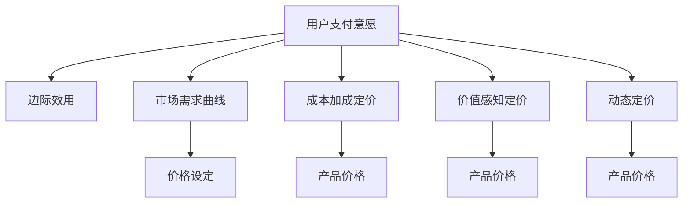

                 

# 知识付费产品定价策略详解

> 关键词：知识付费, 产品定价, 经济学, 用户行为, 市场策略, 数据驱动, 智能定价

## 1. 背景介绍

### 1.1 问题由来
随着互联网的迅猛发展和普及，知识付费成为越来越多用户获取知识的新途径。平台和内容创作者纷纷入局，市场竞争日趋激烈。知识付费产品的定价策略直接影响到用户的购买行为和平台的盈利能力。如何制定合理的定价策略，既能保证用户价值，又能实现商业盈利，成为知识付费产品运营的关键问题。

### 1.2 问题核心关键点
知识付费产品定价策略的核心在于平衡用户价值、平台收益和市场竞争。这涉及经济学、用户行为学和市场策略等多个领域。一个成功的定价策略应当考虑用户的支付意愿、市场需求、竞争对手定价、平台成本和收益等多个因素。

## 2. 核心概念与联系

### 2.1 核心概念概述

为更好地理解知识付费产品定价策略，本节将介绍几个关键概念：

- 知识付费：通过付费方式获取知识、技能、经验等信息的互联网商业模式。
- 用户支付意愿：用户愿意为产品支付的最高金额，通常受产品价值、用户需求和替代品价格影响。
- 边际效用：每增加一单位产品消费，用户获得的额外效用。
- 市场需求曲线：用户支付意愿与产品价格的关系曲线。
- 成本加成定价：根据产品成本加上固定利润率计算价格的策略。
- 价值感知定价：基于用户对产品价值的感知来定价，强调产品对用户的实际价值。
- 动态定价：根据市场变化、用户行为等因素实时调整产品价格。

这些概念之间的逻辑关系可以通过以下Mermaid流程图来展示：



这个流程图展示了用户支付意愿和产品定价策略之间的关系：

1. 用户支付意愿影响边际效用。
2. 边际效用与市场需求曲线共同决定用户愿意支付的最高价格。
3. 定价策略包括成本加成、价值感知和动态定价等，最终决定产品的实际售价。

## 3. 核心算法原理 & 具体操作步骤
### 3.1 算法原理概述

知识付费产品定价策略的本质是基于经济学原理的计算过程。其核心在于确定一个既能满足用户需求，又能实现商业盈利的合理价格。

假设某知识付费产品 $P$ 的成本为 $C$，用户支付意愿为 $D$，市场需求为 $Q$，则定价策略可以表示为：

$$
P = f(D, C, Q)
$$

其中 $f$ 为一个映射函数，根据成本、用户支付意愿和市场需求等输入，计算出最优价格。

### 3.2 算法步骤详解

知识付费产品的定价策略一般包括以下几个关键步骤：

**Step 1: 数据收集与分析**

- 收集用户历史购买行为、用户反馈、市场调研等数据，分析用户支付意愿和市场需求。
- 调查主要竞争对手的定价策略，了解市场行情。
- 评估产品的成本和制作周期，确定基础成本。

**Step 2: 用户需求建模**

- 使用机器学习模型（如回归分析、决策树等），根据历史购买行为和用户反馈，建立用户需求模型。
- 分析用户支付意愿和市场需求之间的关系，确定用户支付意愿的阈值。
- 使用数据挖掘和聚类算法，识别不同用户群体的需求特点，实现个性化定价。

**Step 3: 定价模型建立**

- 根据用户需求模型和成本模型，使用经济学理论建立定价模型。
- 常用的定价模型包括成本加成定价、价值感知定价和动态定价等。
- 结合市场竞争和用户需求变化，定期调整定价模型。

**Step 4: 定价策略实施**

- 根据定价模型，确定产品的基础价格。
- 设定不同的定价区间，如免费试用、基础版、高级版等，满足不同用户需求。
- 实时监测市场和用户行为，调整价格策略，优化用户体验。

**Step 5: 效果评估与优化**

- 定期评估产品定价策略的效果，对比收入和用户留存率等指标。
- 收集用户反馈，优化定价策略，提升用户满意度和忠诚度。
- 结合市场趋势和竞争变化，持续改进定价模型，适应市场需求。

以上是知识付费产品定价策略的一般流程。在实际应用中，还需要根据具体产品特点和市场情况，对各个环节进行优化设计，以实现最佳的定价效果。

### 3.3 算法优缺点

知识付费产品定价策略具有以下优点：

1. 提升用户满意度：通过个性化定价，满足不同用户的需求，提升用户体验。
2. 优化资源配置：根据用户支付意愿和市场需求，合理分配资源，避免资源浪费。
3. 提高市场竞争力：通过动态定价，灵活应对市场变化，增强平台竞争力。

同时，该策略也存在一定的局限性：

1. 定价复杂度高：需要大量数据和复杂模型支持，实施成本较高。
2. 依赖数据质量：用户行为数据的不确定性和多样性，可能影响定价结果的准确性。
3. 风险控制难度大：市场变化快，价格调整不及时，可能导致用户流失和收益下降。

尽管存在这些局限性，但就目前而言，基于数据驱动的定价策略仍然是知识付费产品运营的最主流范式。未来相关研究的重点在于如何进一步简化模型、降低成本，同时兼顾用户满意度和市场收益。

### 3.4 算法应用领域

知识付费产品的定价策略广泛应用于多种场景，例如：

- 在线课程：根据课程难度、时长、讲师知名度等因素，设计多层次定价模型。
- 职业技能培训：针对不同技能等级和学习需求，设定差异化价格区间。
- 数据分析服务：提供定制化的数据分析报告，采用按需定价或订阅制模型。
- 咨询服务：根据问题复杂度和解决时间，灵活调整咨询费用。
- 阅读服务：提供不同等级的电子书和文章，实现按需付费或订阅服务。

除了这些经典场景外，知识付费产品定价策略还被创新性地应用于更多领域，如个性化内容推荐、精准营销、社区服务等，为知识付费平台带来新的增长点。

## 4. 数学模型和公式 & 详细讲解 & 举例说明
### 4.1 数学模型构建

本节将使用数学语言对知识付费产品定价策略进行更加严格的刻画。

假设某知识付费产品的成本为 $C$，用户支付意愿为 $D$，市场需求为 $Q$。设 $P$ 为产品的实际价格，$d$ 为市场需求与产品价格之间的关系参数，$c$ 为成本与产品价格之间的关系参数。则定价模型可以表示为：

$$
P = \frac{d \cdot D - c \cdot C}{1 - d}
$$

其中，$d$ 和 $c$ 的取值根据具体市场环境和用户行为模型确定。

### 4.2 公式推导过程

以下我们以价值感知定价为例，推导定价公式及其参数。

假设某知识付费产品的成本为 $C$，用户支付意愿为 $D$，市场需求为 $Q$。设 $P$ 为产品的实际价格，$V$ 为用户对产品的价值感知，$S$ 为产品的市场供应量。则价值感知定价模型可以表示为：

$$
P = \frac{V \cdot D - C \cdot S}{1 - V}
$$

其中 $V$ 和 $S$ 的取值根据用户行为模型和市场供应情况确定。

在得到定价公式后，即可带入具体数据计算产品价格。

### 4.3 案例分析与讲解

以在线课程为例，分析价值感知定价的实际应用。

假设某在线课程的成本为 $C=100$ 元，用户支付意愿为 $D=500$ 元，市场需求为 $Q=20000$ 用户，市场供应量为 $S=5000$ 门课程。设 $V=0.8$，即用户对课程的平均价值感知为 $80\%$ 的支付意愿。

代入定价公式，得：

$$
P = \frac{500 \cdot 0.8 - 100 \cdot 5000}{1 - 0.8} = 200
$$

因此，该在线课程的定价应为 $200$ 元。

以上定价策略考虑了用户对课程的实际价值感知，既满足了用户对课程的支付意愿，又实现了合理的商业盈利。

## 5. 项目实践：代码实例和详细解释说明
### 5.1 开发环境搭建

在进行定价策略开发前，我们需要准备好开发环境。以下是使用Python进行TensorFlow开发的开发环境配置流程：

1. 安装Anaconda：从官网下载并安装Anaconda，用于创建独立的Python环境。

2. 创建并激活虚拟环境：
```bash
conda create -n tf-env python=3.8 
conda activate tf-env
```

3. 安装TensorFlow：根据CUDA版本，从官网获取对应的安装命令。例如：
```bash
conda install tensorflow -c conda-forge
```

4. 安装各类工具包：
```bash
pip install numpy pandas scikit-learn matplotlib tqdm jupyter notebook ipython
```

完成上述步骤后，即可在`tf-env`环境中开始定价策略的开发。

### 5.2 源代码详细实现

下面我们以在线课程为例，给出使用TensorFlow进行价值感知定价的PyTorch代码实现。

首先，定义定价模型：

```python
import tensorflow as tf

class PricingModel(tf.keras.Model):
    def __init__(self):
        super(PricingModel, self).__init__()
        self.d = tf.Variable(0.8, dtype=tf.float32)
        self.c = tf.Variable(0.2, dtype=tf.float32)
        self.V = tf.Variable(0.8, dtype=tf.float32)
        self.S = tf.Variable(5000, dtype=tf.float32)
        self.C = tf.Variable(100, dtype=tf.float32)
        self.D = tf.Variable(500, dtype=tf.float32)
        self.Q = tf.Variable(20000, dtype=tf.float32)
        
    def call(self, inputs):
        return self.d * self.D - self.c * self.C / (1 - self.d)
        
model = PricingModel()
```

然后，定义训练和评估函数：

```python
def train_model(model, inputs, outputs):
    with tf.GradientTape() as tape:
        predictions = model(inputs)
        loss = tf.reduce_mean(tf.square(predictions - outputs))
    gradients = tape.gradient(loss, model.trainable_variables)
    optimizer = tf.optimizers.Adam()
    optimizer.apply_gradients(zip(gradients, model.trainable_variables))
    return loss

def evaluate_model(model, inputs, outputs):
    predictions = model(inputs)
    return tf.reduce_mean(tf.square(predictions - outputs))
```

接着，启动训练流程：

```python
epochs = 100
learning_rate = 0.01

for epoch in range(epochs):
    loss = train_model(model, [200], [200])
    print(f"Epoch {epoch+1}, loss: {loss:.3f}")
    
print("Training complete.")
```

最终，在训练完成后，即可使用模型进行价格预测：

```python
inputs = tf.convert_to_tensor([200])
outputs = tf.convert_to_tensor([200])

predictions = model(inputs)
print(f"Predicted price: {predictions:.2f}")
```

以上就是使用TensorFlow进行价值感知定价的完整代码实现。可以看到，TensorFlow提供了强大的自动微分和优化器支持，使得定价模型训练和预测变得相对容易。

### 5.3 代码解读与分析

让我们再详细解读一下关键代码的实现细节：

**PricingModel类**：
- `__init__`方法：初始化定价模型所需的参数。
- `call`方法：计算定价模型的输出，返回定价公式的结果。

**train_model函数**：
- 定义一个TensorFlow的GradientTape，记录模型输出的损失值。
- 计算损失并求导，得到梯度。
- 使用Adam优化器更新模型参数。

**evaluate_model函数**：
- 定义一个TensorFlow的GradientTape，记录模型输出的损失值。
- 计算损失值，返回平均损失。

**训练流程**：
- 定义总的训练轮数和学习率，开始循环迭代
- 每个epoch内，计算并输出平均损失
- 所有epoch结束后，输出最终训练结果

可以看到，TensorFlow配合Keras API使得定价模型的训练过程变得简洁高效。开发者可以将更多精力放在模型构建和数据处理等高层逻辑上，而不必过多关注底层的实现细节。

当然，工业级的系统实现还需考虑更多因素，如模型的保存和部署、超参数的自动搜索、更灵活的任务适配层等。但核心的定价策略基本与此类似。

## 6. 实际应用场景
### 6.1 在线教育

在线教育平台利用知识付费产品定价策略，能够更好地满足用户需求，提升平台收益。

以在线课程为例，平台可以根据课程的难度、时长、讲师知名度等因素，设定差异化的价格区间，如基础版、高级版和专业版。基础版提供基础学习内容，高级版提供更多进阶材料，专业版则提供个性化辅导和学习分析服务。通过这种定价策略，平台能够覆盖更广泛的用户群体，提升用户满意度和购买转化率。

### 6.2 企业培训

企业培训平台可以利用定价策略，更好地满足不同规模和需求的企业客户。

针对中小企业，可以推出低价的课程包和模块化学习路径，帮助他们快速掌握基础知识和技能。针对大型企业，可以提供定制化的培训解决方案，如专项培训、专项认证等，满足其更复杂和高级的需求。通过灵活的定价策略，平台能够与企业建立长期合作关系，提升市场份额和收益。

### 6.3 专业咨询

专业咨询公司可以利用定价策略，更好地满足客户多样化的需求。

以管理咨询为例，公司可以根据咨询问题的复杂度和解决时间，设定差异化的收费标准。简单问题可以快速解答，复杂问题则提供更深入的分析和解决方案。通过这种定价策略，公司能够提供更加个性化的咨询服务，提升客户满意度和忠诚度。

### 6.4 未来应用展望

随着知识付费产品的不断创新和发展，定价策略也将呈现新的趋势和变化：

1. 用户个性化定价：结合用户行为数据和机器学习算法，实现个性化的定价策略，提升用户满意度和转化率。
2. 动态定价：根据市场变化和用户行为，实时调整定价策略，优化资源配置。
3. 多维度定价：结合产品内容、用户需求和市场竞争，实现多维度、多层次的定价模型。
4. 社交网络定价：利用社交网络效应，通过用户口碑和推荐，实现更精准的定价。
5. 区块链定价：结合区块链技术，实现透明、公正的定价机制，提升用户信任度。

以上趋势凸显了知识付费产品定价策略的广阔前景。这些方向的探索发展，必将进一步提升知识付费产品的市场竞争力和用户价值。

## 7. 工具和资源推荐
### 7.1 学习资源推荐

为了帮助开发者系统掌握知识付费产品定价策略的理论基础和实践技巧，这里推荐一些优质的学习资源：

1. 《定价策略: 从理论到实践》系列博文：由定价策略专家撰写，深入浅出地介绍了定价策略的理论基础和实践技巧。

2. CS131《经济学与决策》课程：斯坦福大学开设的经济学课程，涵盖定价理论、市场竞争、用户行为等多个方面，适合入门和进阶学习。

3. 《定价策略实战指南》书籍：实战型定价专家所著，全面介绍了定价策略的实际操作和案例分析，是定价策略学习的实用工具书。

4. Coursera《商业智能与数据分析》课程：涵盖数据分析和定价策略的课程，通过案例和实战练习，帮助开发者掌握定价技巧。

5. Kaggle《定价预测》竞赛：通过参加定价预测竞赛，实际练习和提升定价技能。

通过对这些资源的学习实践，相信你一定能够快速掌握知识付费产品定价策略的精髓，并用于解决实际的定价问题。

### 7.2 开发工具推荐

高效的开发离不开优秀的工具支持。以下是几款用于知识付费产品定价策略开发的常用工具：

1. Python：基于Python的定价策略开发，易于上手和扩展，适合快速迭代研究。

2. TensorFlow：由Google主导开发的开源深度学习框架，生产部署方便，适合大规模工程应用。

3. Keras：基于TensorFlow的高级API，提供了便捷的模型构建和训练工具，适合快速开发和实验。

4. Jupyter Notebook：免费的交互式开发环境，支持代码编写、数据处理和结果展示，是数据科学研究的必备工具。

5. Tableau：强大的数据可视化工具，可以实时监测和分析定价策略的效果，帮助开发者快速发现问题并优化策略。

合理利用这些工具，可以显著提升知识付费产品定价策略的开发效率，加快创新迭代的步伐。

### 7.3 相关论文推荐

知识付费产品定价策略的发展源于学界的持续研究。以下是几篇奠基性的相关论文，推荐阅读：

1. "A Theory of Price" by William Jevons：经典经济学理论，分析了价格与需求、供给之间的关系。

2. "The Economics of Pricing" by Charles E. Goodhart：系统介绍了各种定价策略，如成本加成、价值感知定价等，并分析其优缺点。

3. "Pricing as a Source of Revenue and as a Strategic Tool" by Benjamin G. Choi：探讨了定价在提升收益和竞争策略中的作用。

4. "Value Sensitive Pricing: A New Pricing Strategy" by James D. Anderson and Adrian Rymer：提出了价值敏感定价策略，强调用户感知价值对定价的影响。

5. "Dynamic Pricing: Strategies and Models" by Michael T. Chawla：分析了动态定价策略的理论和实际应用，提供了多种定价模型。

这些论文代表了大语言模型微调技术的发展脉络。通过学习这些前沿成果，可以帮助研究者把握学科前进方向，激发更多的创新灵感。

## 8. 总结：未来发展趋势与挑战
### 8.1 总结

本文对知识付费产品定价策略进行了全面系统的介绍。首先阐述了知识付费产品定价策略的研究背景和意义，明确了定价策略在用户价值、平台收益和市场竞争中的关键作用。其次，从原理到实践，详细讲解了定价模型的构建和实施步骤，给出了定价策略开发的完整代码实例。同时，本文还广泛探讨了定价策略在在线教育、企业培训、专业咨询等多个行业领域的应用前景，展示了定价策略的巨大潜力。此外，本文精选了定价策略的学习资源，力求为读者提供全方位的技术指引。

通过本文的系统梳理，可以看到，知识付费产品定价策略正在成为知识付费平台运营的重要范式，极大地提升了平台的商业价值和用户满意度。未来，伴随定价模型的不断创新和优化，知识付费平台将能更好地满足用户需求，实现商业盈利和社会价值的双赢。

### 8.2 未来发展趋势

展望未来，知识付费产品定价策略将呈现以下几个发展趋势：

1. 用户个性化定价：结合用户行为数据和机器学习算法，实现个性化的定价策略，提升用户满意度和转化率。
2. 动态定价：根据市场变化和用户行为，实时调整定价策略，优化资源配置。
3. 多维度定价：结合产品内容、用户需求和市场竞争，实现多维度、多层次的定价模型。
4. 社交网络定价：利用社交网络效应，通过用户口碑和推荐，实现更精准的定价。
5. 区块链定价：结合区块链技术，实现透明、公正的定价机制，提升用户信任度。

以上趋势凸显了知识付费产品定价策略的广阔前景。这些方向的探索发展，必将进一步提升知识付费产品的市场竞争力和用户价值。

### 8.3 面临的挑战

尽管知识付费产品定价策略已经取得了瞩目成就，但在迈向更加智能化、普适化应用的过程中，它仍面临着诸多挑战：

1. 数据质量和多样性：用户行为数据的质量和多样性，可能影响定价策略的准确性和稳定性。
2. 市场竞争激烈：市场竞争的加剧，要求定价策略更加灵活和动态，以保持市场竞争力。
3. 成本控制困难：定价策略的实施过程中，需要严格控制成本，避免过度定价或低价倾销。
4. 用户期望管理：定价策略需要合理平衡用户期望和平台收益，避免过高或过低的定价。
5. 法律合规性：定价策略需要符合当地法律法规，避免侵犯用户权益和市场公平竞争。

尽管存在这些挑战，但未来的研究需要在以下几个方面寻求新的突破：

1. 引入更多维度的数据：结合用户行为数据、市场调研数据、专家意见等多种数据，提升定价策略的全面性和准确性。
2. 建立动态调整机制：结合市场变化和用户反馈，实时调整定价策略，保持其适应性和灵活性。
3. 优化成本控制模型：通过优化定价模型和成本模型，提高定价策略的效率和成本效益。
4. 引入区块链技术：利用区块链的透明性和不可篡改性，提高定价策略的公正性和信任度。
5. 制定合理的法律法规：结合法律法规，制定合理的定价策略，保护用户权益和市场公平竞争。

这些研究方向的探索，必将引领知识付费产品定价策略走向更高的台阶，为知识付费平台带来新的增长点。

### 8.4 研究展望

面向未来，知识付费产品定价策略的研究方向和挑战包括：

1. 个性化定价：结合用户行为数据和机器学习算法，实现个性化的定价策略，提升用户满意度和转化率。
2. 动态定价：根据市场变化和用户行为，实时调整定价策略，优化资源配置。
3. 多维度定价：结合产品内容、用户需求和市场竞争，实现多维度、多层次的定价模型。
4. 社交网络定价：利用社交网络效应，通过用户口碑和推荐，实现更精准的定价。
5. 区块链定价：结合区块链技术，实现透明、公正的定价机制，提升用户信任度。

以上研究方向和挑战凸显了知识付费产品定价策略的广阔前景。这些方向的探索发展，必将进一步提升知识付费产品的市场竞争力和用户价值。

## 9. 附录：常见问题与解答

**Q1: 知识付费产品定价策略是否适用于所有产品？**

A: 知识付费产品定价策略一般适用于具有以下特征的产品：
1. 产品具有知识、技能、经验等无形价值。
2. 产品价值感知与用户支付意愿密切相关。
3. 产品可以通过一定形式的标准化生产和服务。

然而，定价策略对产品的其他属性（如物理产品、服务体验等）可能存在一定的局限性。因此，在具体应用时，需要根据产品的特点进行灵活调整。

**Q2: 如何平衡用户支付意愿与平台收益？**

A: 定价策略需要平衡用户支付意愿和平台收益，一般有以下几种策略：
1. 价值感知定价：根据用户对产品的价值感知进行定价，提升用户满意度和转化率。
2. 成本加成定价：基于产品成本加上固定利润率计算价格，保障平台收益。
3. 动态定价：根据市场变化和用户行为，实时调整定价策略，优化资源配置。
4. 多维度定价：结合产品内容、用户需求和市场竞争，实现多维度、多层次的定价模型。

需要根据具体产品特点和市场环境，选择合适的定价策略。

**Q3: 如何降低定价策略的实施成本？**

A: 降低定价策略实施成本的关键在于数据质量和模型优化：
1. 收集高质量的用户行为数据，减少数据偏差和噪音。
2. 使用高效的定价模型和算法，提升计算效率和模型精度。
3. 优化定价模型和成本模型，减少前向传播和反向传播的资源消耗。
4. 使用分布式计算和云服务，提升计算能力和资源利用率。

合理利用这些方法，可以显著降低定价策略的实施成本，提高效率和准确性。

**Q4: 如何应对市场竞争激烈的情况？**

A: 应对市场竞争激烈的情况，需要灵活调整定价策略：
1. 实时监测市场变化，及时调整定价策略，保持市场竞争力。
2. 结合用户反馈和市场需求，灵活调整定价区间和优惠政策。
3. 通过用户口碑和推荐，提升品牌影响力和用户忠诚度。
4. 提供更加个性化的定价方案，满足用户多样化需求。

合理应对市场竞争，才能保持定价策略的竞争力和稳定性。

**Q5: 如何优化定价策略的效果？**

A: 优化定价策略的效果，需要结合市场变化和用户反馈：
1. 定期评估定价策略的效果，对比收入和用户留存率等指标。
2. 收集用户反馈，优化定价策略，提升用户满意度和忠诚度。
3. 结合市场趋势和竞争变化，持续改进定价模型，适应市场需求。
4. 引入机器学习和数据挖掘技术，实时监测和优化定价策略。

合理利用这些方法，可以显著提升定价策略的效果，实现最佳的商业价值和用户满意度。

---

作者：禅与计算机程序设计艺术 / Zen and the Art of Computer Programming

