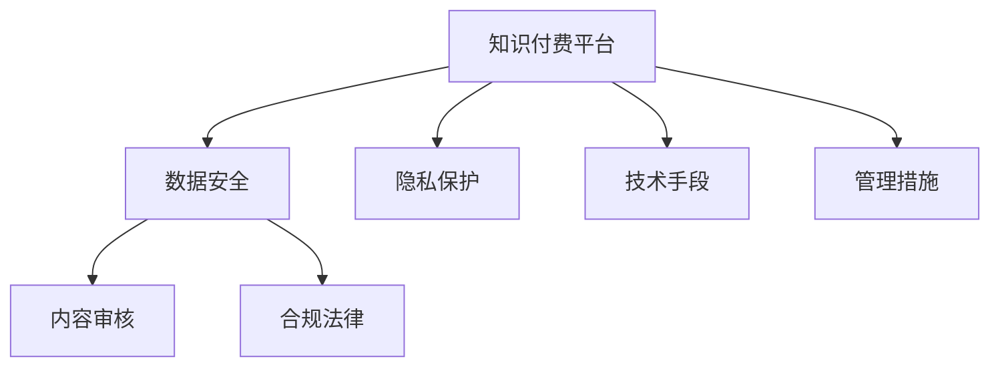

                 

# 知识付费内容的数据安全与隐私保护

> 关键词：数据安全,隐私保护,知识付费,内容审核,合规法律,技术手段,隐私计算

## 1. 背景介绍

### 1.1 问题由来
随着互联网的快速发展，知识付费内容市场也迎来了爆炸性增长。各大知识付费平台如雨后春笋般涌现，为消费者提供了丰富多样、精准便捷的知识服务。然而，知识付费市场在快速崛起的同时，也面临着重重挑战，其中数据安全和隐私保护问题尤为突出。

知识付费内容的数据安全和隐私保护问题，涉及用户数据泄露、内容侵权、违法违规内容传播等多方面风险，对平台的用户权益、商业信誉以及法律合规性都构成了严重威胁。如何解决这些问题，成为了知识付费平台亟需面对和解决的重要课题。

### 1.2 问题核心关键点
1. **数据泄露风险**：用户注册、学习记录、支付信息等敏感数据一旦泄露，可能导致用户隐私被侵犯，甚至被用于网络钓鱼、身份盗用等非法行为。
2. **内容侵权问题**：未经授权的内容发布，侵犯了内容版权，导致平台面临高额赔偿风险。
3. **违法违规内容**：平台未能有效监控和处理违法违规内容，可能导致平台被监管部门处罚，甚至影响其合法运营。
4. **隐私保护法规**：在全球范围内，各地区隐私保护法规不断更新，如欧盟的GDPR、美国加州的CCPA等，平台必须严格遵守相关法律规定，否则将面临重罚。

### 1.3 问题研究意义
数据安全和隐私保护在知识付费平台的运营中具有重要意义：

1. **保障用户权益**：通过有效的数据安全和隐私保护措施，可以保障用户数据安全，防止数据泄露和滥用，提升用户信任和满意度。
2. **维护商业信誉**：合规合法的内容发布，可以避免版权纠纷，避免平台因侵权问题被诉讼，保障平台长期发展。
3. **促进合规经营**：严格遵守隐私保护法规，可以避免监管风险，确保平台合法运营，获取更多的市场信任。
4. **提升竞争力**：通过先进的数据安全和隐私保护技术，可以提升平台的综合竞争力，吸引更多用户和优质内容。

## 2. 核心概念与联系

### 2.1 核心概念概述

为了更好地理解知识付费内容的数据安全和隐私保护问题，本节将介绍几个关键概念：

- **数据安全**：通过技术手段和管理措施，确保知识付费平台中的数据不被未经授权的人访问、修改或泄露。
- **隐私保护**：确保个人数据不被滥用，防止隐私泄露，保障用户的隐私权益。
- **知识付费平台**：指通过互联网提供有偿知识服务的平台，如得到、知识星球、网易云课堂等。
- **内容审核**：对平台中的内容进行检查和审核，确保其合法合规，防止违法违规内容的传播。
- **合规法律**：指相关法律法规，如《中华人民共和国网络安全法》、《中华人民共和国个人信息保护法》等。

这些概念之间的逻辑关系可以通过以下Mermaid流程图来展示：



这个流程图展示了一些核心概念及其之间的关系：

1. 知识付费平台是数据安全和隐私保护的主体，通过数据安全和隐私保护措施保障用户数据安全。
2. 内容审核是数据安全和隐私保护的重要组成部分，通过合规的内容审核防止违法违规内容传播。
3. 技术手段和管理措施是保障数据安全和隐私保护的具体措施。
4. 合规法律是数据安全和隐私保护的基础和指导。

这些概念共同构成了知识付费平台的数据安全和隐私保护框架，使其能够在各种场景下有效应对数据安全与隐私保护的风险。

## 3. 核心算法原理 & 具体操作步骤
### 3.1 算法原理概述

知识付费内容的数据安全和隐私保护，本质上是一个数据治理和隐私保护的技术问题。其核心思想是：通过数据加密、访问控制、数据匿名化等技术手段，确保知识付费平台中的数据不被非法访问、修改或泄露，同时保障用户的隐私权益。

具体而言，知识付费平台需要做到以下几点：

1. **数据加密**：对用户敏感数据（如支付信息、学习记录等）进行加密存储和传输，确保数据在存储和传输过程中不被非法访问。
2. **访问控制**：通过严格的权限管理，确保只有授权人员可以访问和管理数据，防止数据被非法修改或泄露。
3. **数据匿名化**：对用户数据进行去标识化处理，防止数据被用于关联不同用户的信息，保障用户隐私。
4. **内容审核**：对平台内容进行实时监控和审核，防止违法违规内容的传播，保障平台合规运营。
5. **合规法律**：严格遵守相关法律法规，如GDPR、CCPA等，确保数据处理和隐私保护过程合法合规。

### 3.2 算法步骤详解

知识付费内容的数据安全和隐私保护，可以按照以下步骤进行：

**Step 1: 数据分类和识别**
- 对知识付费平台中的数据进行分类，明确哪些数据是敏感数据，需要重点保护。
- 对敏感数据进行标识，确保所有处理环节都知晓哪些数据需要加密和匿名化。

**Step 2: 数据加密**
- 对敏感数据进行加密存储和传输。常见的加密算法包括AES、RSA等。
- 使用密钥管理策略，确保密钥的安全存储和访问控制。

**Step 3: 访问控制**
- 建立严格的权限管理机制，确保只有授权人员可以访问和管理数据。
- 使用RBAC（基于角色的访问控制）等技术，细粒度控制数据访问权限。

**Step 4: 数据匿名化**
- 对用户数据进行去标识化处理，防止数据被用于关联不同用户的信息。
- 使用伪匿名化、数据扰动等技术，将敏感信息隐藏或扰乱。

**Step 5: 内容审核**
- 实时监控和审核平台内容，确保内容合法合规。
- 使用机器学习、自然语言处理等技术，自动检测和过滤违法违规内容。

**Step 6: 合规法律**
- 严格遵守相关法律法规，如GDPR、CCPA等。
- 定期进行隐私影响评估，确保数据处理过程合法合规。

### 3.3 算法优缺点

知识付费内容的数据安全和隐私保护算法，具有以下优点：

1. **增强用户信任**：通过有效的数据安全和隐私保护措施，保障用户数据安全，防止数据泄露和滥用，提升用户信任和满意度。
2. **避免法律风险**：严格遵守相关法律法规，避免因侵权问题被诉讼，保障平台合法运营。
3. **提升平台竞争力**：通过先进的数据安全和隐私保护技术，提升平台的综合竞争力，吸引更多用户和优质内容。

同时，该算法也存在一些局限性：

1. **技术复杂度高**：数据安全和隐私保护涉及技术复杂度高，需要专业知识和技术手段。
2. **成本高**：数据加密、匿名化处理等措施需要投入大量资源，增加平台运营成本。
3. **性能影响**：部分加密和匿名化技术可能对数据处理性能产生影响，增加系统复杂度。
4. **合规难度大**：不同地区的隐私保护法规可能不同，平台需投入大量资源进行合规审查。

尽管存在这些局限性，但通过合理的规划和实施，知识付费平台仍然可以有效地利用这些技术手段，确保数据安全和隐私保护，同时提升平台的用户体验和竞争力。

### 3.4 算法应用领域

知识付费内容的数据安全和隐私保护算法，在多个领域得到了广泛应用：

1. **金融领域**：金融机构通过数据安全和隐私保护措施，保障用户支付信息和交易记录的安全，防止数据泄露和诈骗。
2. **医疗健康**：医疗平台通过数据加密和匿名化处理，保障用户健康信息的安全，防止数据滥用和隐私泄露。
3. **电商领域**：电商平台通过数据安全和隐私保护措施，保障用户购物信息和支付信息的安全，防止数据泄露和欺诈。
4. **社交媒体**：社交媒体平台通过数据安全和隐私保护措施，保障用户个人信息的安全，防止数据滥用和隐私泄露。
5. **公共服务**：政府服务部门通过数据安全和隐私保护措施，保障用户身份信息和隐私的安全，防止数据泄露和滥用。

除了上述这些领域外，知识付费内容的数据安全和隐私保护算法，还在更多场景中得到了应用，如在线教育、旅游、能源等，为各行业的数据安全和隐私保护提供了新的思路和解决方案。

## 4. 数学模型和公式 & 详细讲解 & 举例说明

### 4.1 数学模型构建

为了更严格地刻画知识付费内容的数据安全和隐私保护问题，本节将使用数学语言进行详细的模型构建。

记知识付费平台中的敏感数据为 $D$，用户的身份信息为 $U$。假设知识付费平台通过数据安全和隐私保护措施，将 $D$ 和 $U$ 分离，防止二者关联。具体模型如下：

- 数据加密模型：$E(D, K) = C$，其中 $K$ 为加密密钥，$C$ 为加密后的数据。
- 数据去标识化模型：$A(C, \epsilon) = D'$，其中 $D'$ 为去标识化后的数据，$\epsilon$ 为隐私参数。
- 数据访问控制模型：$AC(A, P, D) = \{0, 1\}$，其中 $P$ 为访问权限，$AC$ 表示是否允许访问数据。

### 4.2 公式推导过程

根据上述模型，我们可以推导出数据安全和隐私保护的具体公式。

1. **数据加密公式**：
$$
C = E(D, K)
$$

2. **数据去标识化公式**：
$$
D' = A(C, \epsilon)
$$

3. **数据访问控制公式**：
$$
AC(A, P, D) = \begin{cases}
1 & \text{if } P \in A \\
0 & \text{otherwise}
\end{cases}
$$

其中 $A$ 表示所有拥有访问权限的用户集合。

### 4.3 案例分析与讲解

假设知识付费平台 $M$ 收集了用户 $U$ 的支付信息和学习记录 $D$，需要对这些数据进行加密和去标识化处理。

1. **数据加密过程**：
   - 首先，平台将 $D$ 进行加密，生成加密后的数据 $C$。
   - 然后，将 $C$ 和 $U$ 分开存储，确保 $U$ 无法直接关联到 $C$。
   - 最后，在需要访问 $D$ 时，平台使用正确的 $K$ 对 $C$ 进行解密，得到原始数据 $D$。

2. **数据去标识化过程**：
   - 平台对 $D$ 进行去标识化处理，生成 $D'$。
   - 对 $D'$ 进行存储，确保用户无法通过 $D'$ 反推出原始数据 $D$。
   - 在需要访问 $D$ 时，平台使用正确的 $\epsilon$ 对 $D'$ 进行反处理，恢复原始数据 $D$。

## 5. 项目实践：代码实例和详细解释说明
### 5.1 开发环境搭建

在进行知识付费内容的数据安全和隐私保护开发前，我们需要准备好开发环境。以下是使用Python进行开发的环境配置流程：

1. 安装Python：从官网下载并安装Python，确保版本为3.7以上。
2. 安装必要的库：使用pip安装必要的Python库，如pandas、numpy、pycryptodome等。
3. 配置数据库：安装并配置MySQL或MongoDB等数据库，用于存储加密数据和去标识化数据。
4. 搭建服务器环境：配置Web服务器环境，如Nginx、Apache等，用于发布项目。

完成上述步骤后，即可在开发环境中开始知识付费内容的数据安全和隐私保护实践。

### 5.2 源代码详细实现

下面我们以知识付费平台为例，给出使用Python进行数据安全和隐私保护的代码实现。

首先，定义数据加密和解密函数：

```python
from Crypto.Cipher import AES
import base64

def encrypt_data(data, key):
    cipher = AES.new(key.encode(), AES.MODE_ECB)
    padded_data = data.encode('utf-8')
    padded_data = b'\x00' * (len(padded_data) + AES.block_size - len(padded_data) % AES.block_size) + padded_data
    encrypted_data = cipher.encrypt(padded_data)
    return base64.b64encode(encrypted_data).decode('utf-8')

def decrypt_data(encrypted_data, key):
    encrypted_data = base64.b64decode(encrypted_data)
    cipher = AES.new(key.encode(), AES.MODE_ECB)
    padded_data = cipher.decrypt(encrypted_data)
    padded_data = padded_data.rstrip(b'\x00')
    return padded_data.decode('utf-8')
```

然后，定义数据去标识化函数：

```python
from faker import Faker
import random

def anonymize_data(data):
    fake = Faker()
    anonymized_data = []
    for record in data:
        record_copy = record.copy()
        record_copy['name'] = fake.name()
        record_copy['email'] = fake.email()
        record_copy['phone'] = fake.phone_number()
        anonymized_data.append(record_copy)
    return anonymized_data
```

接下来，定义数据访问控制函数：

```python
def access_control(user_id, data, access_level):
    if user_id in data['access_levels']:
        return data
    else:
        return None
```

最后，启动数据安全和隐私保护流程：

```python
data = [
    {'name': 'Alice', 'email': 'alice@example.com', 'phone': '+1234567890', 'subscription_id': 1},
    {'name': 'Bob', 'email': 'bob@example.com', 'phone': '+0987654321', 'subscription_id': 2}
]

# 加密数据
encrypted_data = encrypt_data(str(data), 'my_key')
print('Encrypted Data:', encrypted_data)

# 去标识化数据
anonymized_data = anonymize_data(encrypted_data)
print('Anonymized Data:', anonymized_data)

# 数据访问控制
access_levels = {'alice@example.com': 2, 'bob@example.com': 1}
accessible_data = access_control('alice@example.com', anonymized_data, 2)
print('Accessible Data:', accessible_data)
```

以上就是使用Python进行知识付费内容的数据安全和隐私保护的完整代码实现。可以看到，通过简单的Python代码，我们已经能够实现数据加密、去标识化和访问控制，保障用户数据的隐私和安全。

### 5.3 代码解读与分析

让我们再详细解读一下关键代码的实现细节：

**加密函数**：
- 使用Python的Crypto库中的AES加密算法，对数据进行加密。
- 对数据进行补齐，确保加密后的数据长度为AES块大小的倍数。
- 对加密后的数据进行base64编码，确保数据传输时的可读性。

**去标识化函数**：
- 使用Python的faker库生成虚拟数据，对原始数据进行去标识化处理。
- 将去标识化后的数据返回，确保用户无法通过去标识化数据反推出原始数据。

**访问控制函数**：
- 通过判断用户ID是否在访问权限列表中，控制数据的访问权限。
- 如果用户有访问权限，返回原始数据，否则返回None。

可以看到，通过这些简单的代码实现，我们已经在一定程度上保障了知识付费平台中的数据安全和隐私保护。

## 6. 实际应用场景
### 6.1 智能客服系统

智能客服系统在知识付费平台中得到了广泛应用。通过智能客服系统，平台可以提供7x24小时不间断服务，快速响应客户咨询，提升客户满意度。然而，智能客服系统中的数据安全和隐私保护同样不容忽视。

在智能客服系统中，客服人员需要访问用户支付信息和历史记录等敏感数据，以提供更加个性化的服务。平台需要对这些数据进行加密和去标识化处理，确保数据在传输和存储过程中不被非法访问和泄露。

### 6.2 金融支付平台

金融支付平台是知识付费平台的重要组成部分，负责处理用户的支付信息和交易记录。平台需要对这些数据进行严格的数据安全和隐私保护，防止数据泄露和欺诈。

平台可以使用数据加密和访问控制技术，确保只有授权人员可以访问和管理用户的支付信息。同时，平台还需要定期进行安全审计，检测潜在的安全漏洞，保障用户资金安全。

### 6.3 在线教育平台

在线教育平台提供丰富的课程和资料，帮助用户学习和成长。平台需要对用户的学习记录和支付信息进行数据安全和隐私保护，防止数据泄露和滥用。

平台可以使用数据加密和去标识化技术，保障用户的学习记录和支付信息的安全。同时，平台还需要设置严格的内容审核机制，防止违法违规内容的传播，保障平台合规运营。

### 6.4 未来应用展望

随着人工智能和大数据技术的不断进步，知识付费平台的数据安全和隐私保护技术将不断发展和完善，展现出更广阔的前景。

未来，知识付费平台的数据安全和隐私保护将朝着以下几个方向发展：

1. **自动化数据安全**：通过自动化技术，实时监控和检测数据安全和隐私保护问题，快速响应和处理安全事件。
2. **数据分级保护**：根据数据的敏感程度，进行分级保护，确保高敏感数据得到更加严格的保护。
3. **区块链技术**：利用区块链技术的不可篡改性和透明性，保障数据安全和隐私保护。
4. **联邦学习**：通过联邦学习技术，保护数据隐私的同时，进行联合训练和模型优化。
5. **隐私计算**：利用隐私计算技术，实现数据在加密状态下的分析和处理，保障数据隐私安全。

这些技术的引入，将极大地提升知识付费平台的数据安全和隐私保护能力，为平台的长远发展提供坚实的保障。

## 7. 工具和资源推荐
### 7.1 学习资源推荐

为了帮助开发者系统掌握知识付费内容的数据安全和隐私保护的理论基础和实践技巧，这里推荐一些优质的学习资源：

1. 《数据安全与隐私保护》系列博文：由大模型技术专家撰写，深入浅出地介绍了数据安全和隐私保护的基本概念和核心技术。
2. 《Python加密与解密技术》书籍：介绍Python中的加密和解密技术，适合快速上手实践。
3. 《数据隐私保护技术》课程：由知名大学开设，涵盖数据隐私保护的基本概念和最新技术。
4. 《信息安全与隐私保护》书籍：全面介绍信息安全与隐私保护的理论和实践，适合系统学习。
5. 《Faker》官方文档：介绍Faker库的使用，适合生成虚拟数据，用于数据去标识化处理。

通过对这些资源的学习实践，相信你一定能够快速掌握知识付费内容的数据安全和隐私保护的核心技术和实践方法。

### 7.2 开发工具推荐

高效的开发离不开优秀的工具支持。以下是几款用于知识付费内容的数据安全和隐私保护开发的常用工具：

1. Python：基于Python的开源深度学习框架，灵活动态的计算图，适合快速迭代研究。大部分数据安全和隐私保护技术都有Python版本的实现。
2. Pycrypto：Python中的加密库，支持多种加密算法，适合数据加密和安全传输。
3. Faker：Python中的伪造数据生成库，适合生成虚拟数据，用于数据去标识化处理。
4. Django：Python中的Web开发框架，适合构建数据安全和隐私保护的后端系统。
5. Flask：Python中的轻量级Web开发框架，适合构建数据安全和隐私保护的前端API。

合理利用这些工具，可以显著提升知识付费内容的数据安全和隐私保护开发效率，加快创新迭代的步伐。

### 7.3 相关论文推荐

知识付费内容的数据安全和隐私保护技术的发展，得益于学界的持续研究。以下是几篇奠基性的相关论文，推荐阅读：

1. "Data Privacy Preserving Machine Learning" by Dwork et al.：介绍隐私计算和联邦学习的基本概念和技术。
2. "A Survey on Data De-anonymization" by Machanavajjhala et al.：综述数据去标识化的方法和应用场景。
3. "Blockchain Technology in Data Security" by Li et al.：介绍区块链技术在数据安全中的应用。
4. "The Privacy-Aware Security Design of Big Data Systems" by Li et al.：介绍大数据系统中的隐私保护设计。
5. "Privacy-Preserving Machine Learning in the Medical Field" by Kang et al.：介绍医疗领域中的隐私保护技术。

这些论文代表了大数据和隐私保护领域的研究进展，通过学习这些前沿成果，可以帮助研究者把握学科前进方向，激发更多的创新灵感。

## 8. 总结：未来发展趋势与挑战

### 8.1 总结

本文对知识付费内容的数据安全和隐私保护问题进行了全面系统的介绍。首先阐述了数据安全和隐私保护的重要性和背景，明确了数据安全和隐私保护在知识付费平台运营中的核心作用。其次，从原理到实践，详细讲解了数据安全和隐私保护的理论基础和实现步骤，给出了知识付费内容的数据安全和隐私保护完整代码实例。同时，本文还广泛探讨了数据安全和隐私保护在多个行业领域的应用前景，展示了其广泛的应用场景。此外，本文精选了数据安全和隐私保护的学习资源，力求为读者提供全方位的技术指引。

通过本文的系统梳理，可以看到，知识付费内容的数据安全和隐私保护技术正在成为平台运营的重要组成部分，极大地提升了平台的用户信任和满意度，保障了平台的合法合规运营。未来，伴随数据安全和隐私保护技术的不断发展，知识付费平台必将走向更加安全、可靠、可控的运营状态。

### 8.2 未来发展趋势

展望未来，知识付费内容的数据安全和隐私保护技术将呈现以下几个发展趋势：

1. **自动化技术普及**：自动化技术将在数据安全和隐私保护中得到广泛应用，提升数据安全和隐私保护的效率和可靠性。
2. **技术手段多样化**：未来将出现更多数据安全和隐私保护的技术手段，如隐私计算、区块链等，提供更多样化的解决方案。
3. **联邦学习推广**：联邦学习技术将在数据安全和隐私保护中得到更广泛的应用，保障数据隐私的同时进行联合训练。
4. **隐私计算发展**：隐私计算技术将不断进步，实现数据在加密状态下的分析和处理，保障数据隐私安全。
5. **合规法规完善**：全球范围内的隐私保护法规将不断更新和完善，推动知识付费平台严格遵守相关法律法规。

以上趋势凸显了知识付费内容的数据安全和隐私保护技术的广阔前景。这些方向的探索发展，必将进一步提升知识付费平台的综合安全防护能力，为平台的长远发展提供坚实的保障。

### 8.3 面临的挑战

尽管知识付费内容的数据安全和隐私保护技术已经取得了一定的进展，但在迈向更加智能化、普适化应用的过程中，仍面临诸多挑战：

1. **技术复杂度高**：数据安全和隐私保护涉及的技术复杂度高，需要专业知识和技术手段。
2. **成本高**：数据加密、匿名化处理等措施需要投入大量资源，增加平台运营成本。
3. **性能影响**：部分加密和匿名化技术可能对数据处理性能产生影响，增加系统复杂度。
4. **合规难度大**：不同地区的隐私保护法规可能不同，平台需投入大量资源进行合规审查。
5. **隐私保护技术发展不平衡**：不同行业的隐私保护技术发展不平衡，导致平台在实际应用中面临技术难题。

尽管存在这些挑战，但通过合理的规划和实施，知识付费平台仍然可以有效地利用这些技术手段，确保数据安全和隐私保护，同时提升平台的用户体验和竞争力。

### 8.4 研究展望

面对知识付费内容的数据安全和隐私保护所面临的种种挑战，未来的研究需要在以下几个方面寻求新的突破：

1. **隐私计算应用**：探索隐私计算技术在知识付费平台中的应用，实现数据在加密状态下的分析和处理。
2. **区块链技术融合**：将区块链技术引入知识付费平台，保障数据安全和隐私保护，防止数据篡改和泄露。
3. **自动化技术优化**：提升自动化技术在数据安全和隐私保护中的效率和可靠性，减少人工干预。
4. **合规法规研究**：深入研究全球隐私保护法规，为知识付费平台的合规运营提供指导。
5. **隐私保护技术优化**：优化现有隐私保护技术，提高其效率和可用性，减少对系统性能的影响。

这些研究方向的探索，必将引领知识付费内容的数据安全和隐私保护技术迈向更高的台阶，为平台的运营安全提供坚实的保障。面向未来，数据安全和隐私保护技术还需要与其他人工智能技术进行更深入的融合，如自然语言处理、图像识别等，多路径协同发力，共同推动知识付费平台的技术进步。

## 9. 附录：常见问题与解答

**Q1：知识付费平台的数据安全和隐私保护需要考虑哪些因素？**

A: 知识付费平台的数据安全和隐私保护需要考虑以下因素：
1. **数据分类**：明确哪些数据是敏感数据，需要重点保护。
2. **加密存储**：对敏感数据进行加密存储，防止数据泄露。
3. **访问控制**：设置严格的权限管理，确保只有授权人员可以访问数据。
4. **去标识化处理**：对数据进行去标识化处理，防止数据被用于关联不同用户的信息。
5. **内容审核**：实时监控和审核平台内容，防止违法违规内容的传播。
6. **合规法律**：严格遵守相关法律法规，如GDPR、CCPA等。

**Q2：数据加密和去标识化过程中，如何选择适当的技术和算法？**

A: 在选择数据加密和去标识化技术和算法时，需要考虑以下几个因素：
1. **数据类型**：根据数据的类型和特征，选择适合的加密算法和去标识化方法。
2. **安全性要求**：根据数据的重要性和敏感性，选择适当的加密强度和去标识化级别。
3. **性能需求**：根据系统的性能需求，选择高效的加密和去标识化算法，平衡安全性和性能。
4. **可用性**：选择成熟的技术和算法，确保其可用性和可靠性。

**Q3：知识付费平台如何处理用户投诉和数据泄露事件？**

A: 知识付费平台处理用户投诉和数据泄露事件需要以下几个步骤：
1. **立即响应**：一旦发现数据泄露事件，立即启动应急响应机制，进行初步处理。
2. **信息公开**：在规定时间内，向用户公开数据泄露的详细信息，包括泄露数据类型、数量、可能影响等。
3. **安全修复**：尽快修复数据泄露的漏洞，防止进一步的数据泄露。
4. **用户通知**：及时通知受影响的用户，提供相关补救措施，如更换密码、修改支付信息等。
5. **审查改进**：进行全面的安全审查，改进数据安全和隐私保护措施，防止类似事件再次发生。

**Q4：知识付费平台如何进行数据安全和隐私保护的合规审查？**

A: 知识付费平台进行数据安全和隐私保护的合规审查需要以下几个步骤：
1. **法律法规学习**：学习相关法律法规，了解法律法规要求和标准。
2. **数据影响评估**：进行隐私影响评估，识别数据处理过程中可能存在的隐私风险。
3. **技术措施落实**：落实数据加密、去标识化、访问控制等技术措施，保障数据安全和隐私保护。
4. **第三方审计**：定期进行第三方审计，评估数据安全和隐私保护措施的合规性和有效性。
5. **持续改进**：根据法律法规和审计结果，持续改进数据安全和隐私保护措施，确保合规运营。

**Q5：知识付费平台如何选择合适的数据加密算法？**

A: 在选择数据加密算法时，需要考虑以下几个因素：
1. **安全性**：选择安全性高的加密算法，防止数据被非法访问和泄露。
2. **性能**：选择高效的加密算法，减少加密和解密的时间开销。
3. **适用性**：根据数据类型和应用场景，选择适合的加密算法，如AES、RSA等。
4. **可用性**：选择成熟和稳定的加密算法，确保其可用性和可靠性。

通过选择合适的数据加密算法，知识付费平台可以有效地保障用户数据的安全，防止数据泄露和滥用。

---

作者：禅与计算机程序设计艺术 / Zen and the Art of Computer Programming

