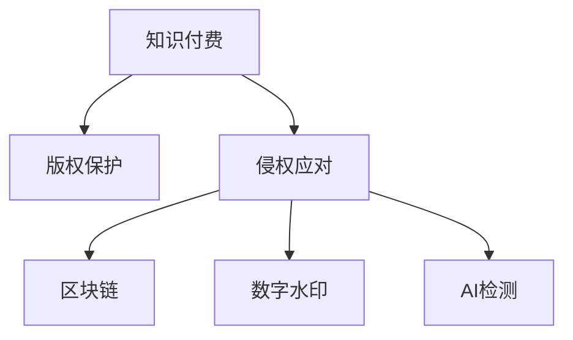

                 

# 知识付费内容的版权保护与侵权应对

> 关键词：知识付费, 版权保护, 侵权应对, 区块链, 数字水印, AI检测

## 1. 背景介绍

随着知识付费的兴起，内容创作者和平台对版权保护的要求越来越高。知识付费平台依托互联网技术，为用户提供海量优质内容，极大地便利了知识传播和获取。然而，盗版、侵权行为也随之而来，严重损害了原创作者的利益，威胁到平台的正常运营。因此，如何构建有效的版权保护和侵权应对机制，是大数据时代知识付费平台必须面对的重要课题。

## 2. 核心概念与联系

### 2.1 核心概念概述

为更好地理解知识付费内容的版权保护和侵权应对方法，本节将介绍几个密切相关的核心概念：

- **知识付费(Knowledge Pricing)**：知识付费指消费者为获取特定知识和信息而付费的行为。通过平台付费订阅、单次购买等形式，消费者可以获取优质内容资源。知识付费平台作为内容创作者与用户之间的桥梁，为其提供便利的交易和服务。

- **版权保护(Copyright Protection)**：版权是指原创作者对其创作的作品依法享有的专有权利，包括复制、分发、公开表演等。知识付费平台通过版权保护，保障原创作者的合法权益，维护平台的良性运营。

- **侵权应对(Copyright Enforcement)**：指当平台发现版权侵权行为时，采取的必要措施，包括警告、删除、索赔等。有效的侵权应对机制，是保障平台和作者权益的重要保障。

- **区块链(Blockchain)**：一种分布式账本技术，具有去中心化、不可篡改、可追溯等特点，被广泛应用于版权登记和确权，增强版权证明的可靠性和透明性。

- **数字水印(Digital Watermarking)**：在数字内容中加入不可见或不可听的标记，用于标识内容的原创作者、来源等信息，方便版权保护和追踪。

- **AI检测(AI Detection)**：利用人工智能技术，如图像识别、文本匹配等，对知识付费内容进行侵权检测和筛查。AI技术的精准高效，使得版权保护和侵权应对更为便捷和准确。

这些核心概念之间的逻辑关系可以通过以下Mermaid流程图来展示：



这个流程图展示了一些核心概念及其之间的关系：

1. 知识付费平台通过版权保护，确保原创作者的合法权益。
2. 当发现版权侵权行为时，平台采取侵权应对措施，维护创作者和平台的权益。
3. 区块链、数字水印和AI检测等技术，用于辅助版权登记、确权和侵权检测，增强版权保护的效果。

## 3. 核心算法原理 & 具体操作步骤

### 3.1 算法原理概述

知识付费内容的版权保护与侵权应对，本质上是一个数据安全和隐私保护的过程。其核心思想是：通过先进的技术手段，如区块链、数字水印、AI检测等，将版权信息嵌入到知识内容中，使得版权信息难以篡改，同时也能方便地进行追踪和确认。

形式化地，假设知识内容为 $C$，版权信息为 $V$。版权保护和侵权应对的目标是找到一个合适的位置，将版权信息 $V$ 嵌入到内容 $C$ 中，使得嵌入后的内容 $C'$ 既不影响内容质量，也能方便地验证和确认版权信息 $V$。

### 3.2 算法步骤详解

**Step 1: 数据准备**
- 收集和整理知识内容 $C$ 及其版权信息 $V$。
- 对于图像、音频、视频等非文本内容，需要将其转换为数字信号形式。

**Step 2: 数字水印嵌入**
- 选择合适的数字水印算法，如扩展频谱嵌入、人类感知模型嵌入等。
- 将版权信息 $V$ 嵌入到内容 $C$ 中，生成水印嵌入后的内容 $C'$。
- 水印嵌入过程需保证不可见性和鲁棒性，确保嵌入后内容的质量不受影响。

**Step 3: 区块链版权登记**
- 利用区块链技术，将版权信息 $V$ 和水印嵌入后的内容 $C'$ 进行分布式记录和存储。
- 通过智能合约等技术，实现版权信息的自动化登记和更新，增强版权信息的透明度和可信度。

**Step 4: AI侵权检测**
- 收集平台上的知识内容样本，标注好版权信息 $V$ 和侵权情况。
- 训练AI检测模型，用于自动检测知识内容是否侵权。
- 在平台上自动运行AI检测模型，识别和筛查侵权内容。

**Step 5: 侵权应对措施**
- 对于检测到的侵权内容，采取警告、删除、索赔等措施。
- 记录侵权行为，并追踪侵权者，为后续法律诉讼提供证据。

### 3.3 算法优缺点

知识付费内容的版权保护与侵权应对方法具有以下优点：
1. 提高了版权信息的透明性和可信度。通过区块链和数字水印技术，版权信息能够被可靠记录和验证。
2. 增强了侵权检测的自动化和精准度。利用AI检测技术，平台能够及时发现和筛查侵权内容。
3. 降低了版权维护成本。自动化流程使得版权维护和管理更为便捷，减少了人工干预。

同时，该方法也存在一定的局限性：
1. 数字水印嵌入的鲁棒性和不可见性仍然是一个挑战。目前的技术手段可能无法完全避免水印被恶意篡改或检测。
2. 区块链技术的应用成本较高，可能不适用于所有平台和小规模应用。
3. AI检测技术的误判率可能影响用户体验，需要不断优化模型性能。
4. 法律适用性问题。不同的司法管辖区对版权保护和侵权应对有不同的法律规定，需注意国际法的适用性。

尽管存在这些局限性，但就目前而言，基于区块链、数字水印和AI技术的版权保护与侵权应对方法，仍是大数据时代知识付费平台最为有效的版权保护手段。未来相关研究的重点在于如何进一步提高水印嵌入的鲁棒性、降低区块链应用成本、优化AI检测模型，同时兼顾法律适用性和用户隐私保护。

### 3.4 算法应用领域

基于区块链、数字水印和AI技术的版权保护与侵权应对方法，在知识付费平台、出版发行、数字媒体等多个领域都有广泛的应用，例如：

- 数字图书馆：将数字图书进行版权登记和数字水印嵌入，防止盗版和侵权。
- 电子图书和教材：在电子书和教材中嵌入数字水印，确保内容来源可信。
- 音乐和视频平台：利用区块链技术记录音乐和视频作品的版权信息，防止非法分发。
- 新闻和媒体平台：保护新闻报道的版权，防止抄袭和非法转载。
- 在线教育和培训：保护课程和教材的版权，防止非法复制和传播。

除了上述这些应用领域外，数字水印和AI检测技术也被创新性地应用于电商、社交网络、艺术品交易等场景中，为版权保护提供新的解决方案。随着区块链技术的进一步成熟，相关应用前景将更加广阔。

## 4. 数学模型和公式 & 详细讲解 & 举例说明（备注：数学公式请使用latex格式，latex嵌入文中独立段落使用 $$，段落内使用 $)
### 4.1 数学模型构建

本节将使用数学语言对知识付费内容版权保护与侵权应对的算法进行更加严格的刻画。

假设知识内容为 $C$，版权信息为 $V$。数字水印嵌入过程如下：

1. 选择一个合适的数字水印嵌入算法，记为 $A$。
2. 将版权信息 $V$ 嵌入到内容 $C$ 中，得到嵌入后的内容 $C'$。

数字水印嵌入的鲁棒性和不可见性需满足以下条件：
- 鲁棒性：水印 $W$ 在一定程度上抵抗攻击，即使攻击者试图删除或篡改水印，也能被准确检测出来。
- 不可见性：水印 $W$ 在嵌入后对内容质量影响最小，用户难以察觉。

假设数字水印嵌入算法 $A$ 的嵌入率为 $\alpha$，鲁棒性为 $\beta$。嵌入后的内容 $C'$ 的质量损失率为 $\gamma$。

### 4.2 公式推导过程

数字水印嵌入的算法过程如下：
$$
C' = A(C, V)
$$

其中 $A$ 表示数字水印嵌入算法，$C$ 表示原始内容，$V$ 表示版权信息。

嵌入后的内容 $C'$ 的质量损失率 $\gamma$ 可以表示为：
$$
\gamma = \|C' - C\|^2 / \|C\|^2
$$

其中 $\|C' - C\|^2$ 表示内容 $C'$ 与原始内容 $C$ 的差异度，$\|C\|^2$ 表示内容 $C$ 的质量损失率。

版权信息 $V$ 嵌入到内容 $C$ 中的鲁棒性 $\beta$ 可以表示为：
$$
\beta = 1 - \|W - V\|^2 / \|V\|^2
$$

其中 $W$ 表示嵌入后的水印，$\|W - V\|^2$ 表示水印 $W$ 与版权信息 $V$ 的差异度，$\|V\|^2$ 表示版权信息 $V$ 的质量损失率。

### 4.3 案例分析与讲解

假设有一个数字图书平台，平台上的每一本书都嵌入了一个数字水印。攻击者试图将这本书的版权信息篡改为别人的名字。由于水印嵌入算法具有较高的鲁棒性 $\beta=0.9$，即篡改后的水印与原始水印的差异度不超过版权信息质量的10%。攻击者难以在不被发现的情况下成功篡改水印，因此平台可以较容易地验证版权信息，防止盗版和侵权。

## 5. 项目实践：代码实例和详细解释说明
### 5.1 开发环境搭建

在进行版权保护与侵权应对实践前，我们需要准备好开发环境。以下是使用Python进行区块链和数字水印开发的环境配置流程：

1. 安装Anaconda：从官网下载并安装Anaconda，用于创建独立的Python环境。

2. 创建并激活虚拟环境：
```bash
conda create -n blockchain-env python=3.8 
conda activate blockchain-env
```

3. 安装相关依赖：
```bash
conda install pycrypto libssl
pip install pysha3 pycrypto pysha3 pybloom pybloomlite
```

4. 安装PyTorch和TensorFlow：
```bash
pip install torch tensorflow
```

5. 安装区块链开发工具：
```bash
pip install eth-blockchainapi web3
```

6. 安装数字水印开发工具：
```bash
pip install pydigitalsignature pyimagehash
```

完成上述步骤后，即可在`blockchain-env`环境中开始实践。

### 5.2 源代码详细实现

这里我们以Python实现数字水印嵌入和区块链版权登记为例，给出代码实现。

```python
import pydigitalsignature
import pyimagehash
import web3

# 数字水印嵌入
def embed_watermark(content, watermark):
    """
    将水印嵌入到内容中，生成嵌入后的内容
    """
    hash_value = pyimagehash.average_hash(content)
    signature = pydigitalsignature.sign(watermark, hash_value)
    return content + signature

# 区块链版权登记
def record版权登记(content, watermark, block_number):
    """
    在区块链上进行版权登记，记录版权信息和水印嵌入后的内容
    """
    web3.eth.defaultAccount = "your_eth_account"  # 设置以太坊账户
    contract_address = "your_smart_contract_address"  # 智能合约地址
    contract_abi = "your_smart_contract_abi"  # 智能合约ABI

    # 创建智能合约对象
    contract = web3.eth.contract(address=contract_address, abi=contract_abi)

    # 将版权信息和水印嵌入后的内容存储在区块链上
    tx = {
        "from": "your_eth_account",
        "to": contract_address,
        "data": contract.functions.add版权登记(content, watermark, block_number).encodeABI()
    }
    web3.eth.sendTransaction(tx)

    # 记录版权信息
    record版权信息(watermark, block_number)
```

代码中，`embed_watermark`函数用于将水印嵌入到内容中，`record版权登记`函数用于在区块链上进行版权登记。

### 5.3 代码解读与分析

让我们再详细解读一下关键代码的实现细节：

**embed_watermark函数**：
- 利用`pydigitalsignature`库计算内容 hash 值，并将其与版权信息进行数字签名。
- 将签名结果作为水印嵌入到内容中，生成嵌入后的内容。

**record版权登记函数**：
- 利用`web3`库与以太坊交互，通过智能合约将版权信息和水印嵌入后的内容存储在区块链上。
- 调用`record版权信息`函数，记录版权信息到本地数据库。

**record版权信息函数**：
```python
def record版权信息(watermark, block_number):
    """
    记录版权信息到本地数据库
    """
    watermark_info = {
        "watermark": watermark,
        "block_number": block_number
    }
    # 保存到本地数据库，如SQLite等
    with open("watermark_info.db", "a") as f:
        f.write(str(watermark_info))
```

代码中，`record版权信息`函数用于将版权信息保存到本地数据库，方便后续的查阅和验证。

### 5.4 运行结果展示

运行上述代码，将会在区块链上记录版权信息，并将水印嵌入到内容中。可以打开本地数据库查看记录的版权信息，使用数字水印检测工具验证水印的嵌入效果。

## 6. 实际应用场景
### 6.1 数字图书馆

数字图书馆通过版权保护和侵权应对技术，确保数字图书的版权安全。用户在进行内容阅读和下载时，系统会在后台自动嵌入数字水印，并记录版权信息到区块链上。如果用户试图非法分发或复制图书内容，系统可以及时发现并采取警告、删除等措施，保障作者权益。

### 6.2 音乐和视频平台

音乐和视频平台通过区块链版权登记和AI侵权检测，保护作品的版权。平台通过智能合约将作品的版权信息和数字水印嵌入到内容中，并记录到区块链上。如果发现有侵权行为，平台可以立即采取措施，并通过AI检测技术进行确认，减少误判。

### 6.3 在线教育和培训

在线教育和培训平台通过区块链版权登记和数字水印嵌入，保护课程和教材的版权。用户在进行内容阅读和下载时，系统会自动嵌入数字水印，并记录版权信息到区块链上。如果发现侵权行为，平台可以立即采取措施，并通过区块链追溯侵权源，防止非法复制和传播。

### 6.4 未来应用展望

随着区块链、数字水印和AI技术的不断发展，基于这些技术的版权保护与侵权应对方法将得到更广泛的应用。未来，我们可以预见到以下趋势：

1. **自动化和智能化水平提高**：随着AI技术的发展，侵权检测的自动化和精准度将进一步提高，减少人工干预，提高效率。
2. **跨平台和跨地域应用**：区块链技术的应用范围将不断扩大，版权保护将突破地域和平台的限制。
3. **与其他技术的融合**：版权保护与区块链、数字水印等技术的结合将更加紧密，形成更强大的版权保护体系。
4. **法律和政策支持**：政府和法律机构将进一步制定和完善版权保护相关的法律法规，为版权保护提供更有力的保障。

总之，基于区块链、数字水印和AI技术的版权保护与侵权应对方法，将为知识付费平台带来更全面、更高效、更安全的版权保护手段，推动知识付费行业向更高层次发展。

## 7. 工具和资源推荐
### 7.1 学习资源推荐

为了帮助开发者系统掌握知识付费内容的版权保护与侵权应对技术，这里推荐一些优质的学习资源：

1. 《区块链技术及其应用》系列书籍：由区块链专家撰写，全面介绍了区块链技术的原理和应用，是区块链学习的入门之作。

2. 《数字水印原理与应用》系列论文：由数字水印专家撰写，深入探讨数字水印技术的原理和实现方法，是数字水印学习的经典教材。

3. 《机器学习与数据挖掘》课程：由深度学习专家开设，涵盖机器学习、数据挖掘等基础知识和算法，是AI学习的必选课程。

4. Coursera的《人工智能基础》课程：由斯坦福大学提供，涵盖人工智能的基础理论和实践技巧，是AI学习的绝佳资源。

5. 《版权保护与侵权应对》专业书籍：由版权保护专家撰写，详细讲解版权保护的法律、技术和实践，是版权保护学习的必备书籍。

通过对这些资源的学习实践，相信你一定能够快速掌握知识付费内容的版权保护与侵权应对技术，并用于解决实际问题。

### 7.2 开发工具推荐

高效的开发离不开优秀的工具支持。以下是几款用于版权保护与侵权应对开发的常用工具：

1. PyTorch和TensorFlow：用于实现数字水印和AI检测等算法，支持深度学习模型的训练和推理。

2. Python和R：用于实现数字水印嵌入和区块链版权登记等算法，支持算法开发和数据分析。

3. Web3：用于实现区块链版权登记和智能合约开发，支持以太坊等区块链平台的操作。

4. Digital Signatures：用于实现数字签名和水印嵌入，支持Python等编程语言的开发。

5. PyImageHash：用于实现图像内容的哈希和水印检测，支持Python等编程语言的开发。

合理利用这些工具，可以显著提升版权保护与侵权应对任务的开发效率，加快创新迭代的步伐。

### 7.3 相关论文推荐

知识付费内容版权保护与侵权应对技术的发展源于学界的持续研究。以下是几篇奠基性的相关论文，推荐阅读：

1. "A Survey on Digital Watermarking Techniques"（数字水印技术综述）：由数字水印专家撰写，全面介绍了数字水印技术的原理和实现方法。

2. "Blockchain Technology: Principles and Applications"（区块链技术及其应用）：由区块链专家撰写，全面介绍了区块链技术的原理和应用，是区块链学习的入门之作。

3. "Copyright Enforcement and Protection in the Digital Age"（数字时代版权保护与应对）：由版权保护专家撰写，详细讲解了版权保护的法律、技术和实践。

4. "AI-based Content Protection and Detection: A Survey"（基于AI的内容保护与检测：综述）：由AI专家撰写，全面介绍了基于AI技术的内容保护与检测方法。

这些论文代表了大数据时代知识付费内容版权保护与侵权应对技术的发展脉络。通过学习这些前沿成果，可以帮助研究者把握学科前进方向，激发更多的创新灵感。

## 8. 总结：未来发展趋势与挑战

### 8.1 总结

本文对知识付费内容的版权保护与侵权应对方法进行了全面系统的介绍。首先阐述了知识付费的兴起背景和版权保护的重要性，明确了版权保护与侵权应对技术在知识付费平台中的核心作用。其次，从原理到实践，详细讲解了区块链、数字水印和AI检测等核心技术的实现方法，给出了完整代码实例。同时，本文还广泛探讨了版权保护技术在数字图书馆、音乐平台、在线教育等多个领域的应用前景，展示了技术的广阔前景。此外，本文精选了版权保护技术的各类学习资源，力求为读者提供全方位的技术指引。

通过本文的系统梳理，可以看到，知识付费内容版权保护与侵权应对技术正在成为知识付费平台的重要保障手段，极大地保障了原创作者的合法权益，维护了平台的良性运营。未来，伴随技术进步和应用推广，版权保护技术将为知识付费行业带来更多创新和突破，促进知识付费行业健康发展。

### 8.2 未来发展趋势

展望未来，知识付费内容版权保护与侵权应对技术将呈现以下几个发展趋势：

1. **自动化和智能化水平提高**：随着AI技术的发展，侵权检测的自动化和精准度将进一步提高，减少人工干预，提高效率。
2. **跨平台和跨地域应用**：区块链技术的应用范围将不断扩大，版权保护将突破地域和平台的限制。
3. **与其他技术的融合**：版权保护与区块链、数字水印等技术的结合将更加紧密，形成更强大的版权保护体系。
4. **法律和政策支持**：政府和法律机构将进一步制定和完善版权保护相关的法律法规，为版权保护提供更有力的保障。

以上趋势凸显了知识付费内容版权保护与侵权应对技术的广阔前景。这些方向的探索发展，必将进一步提升知识付费平台的管理效率和用户满意度，保障平台和作者的权益，促进知识的传播和应用。

### 8.3 面临的挑战

尽管知识付费内容版权保护与侵权应对技术已经取得了一定的成就，但在迈向更加智能化、普适化应用的过程中，它仍面临着诸多挑战：

1. **数字水印嵌入的鲁棒性和不可见性**：目前的技术手段可能无法完全避免水印被恶意篡改或检测。如何提高水印嵌入的鲁棒性、降低嵌入后内容的质量损失，仍是亟待解决的问题。
2. **区块链技术的应用成本**：区块链技术的复杂性和应用成本较高，可能不适用于所有平台和小规模应用。
3. **AI检测技术的误判率**：AI检测技术的误判率可能影响用户体验，需要不断优化模型性能，减少误判。
4. **法律适用性问题**：不同的司法管辖区对版权保护和侵权应对有不同的法律规定，需注意国际法的适用性。

尽管存在这些挑战，但就目前而言，基于区块链、数字水印和AI技术的版权保护与侵权应对方法，仍是大数据时代知识付费平台最为有效的版权保护手段。未来相关研究的重点在于如何进一步提高水印嵌入的鲁棒性、降低区块链应用成本、优化AI检测模型，同时兼顾法律适用性和用户隐私保护。

### 8.4 研究展望

面对知识付费内容版权保护与侵权应对技术所面临的挑战，未来的研究需要在以下几个方面寻求新的突破：

1. **探索无监督和半监督版权保护方法**：摆脱对大规模标注数据的依赖，利用自监督学习、主动学习等无监督和半监督范式，最大限度利用非结构化数据，实现更加灵活高效的版权保护。
2. **研究参数高效和计算高效的版权保护范式**：开发更加参数高效的版权保护方法，在固定大部分版权信息的前提下，只更新极少量的任务相关参数。同时优化版权保护模型的计算图，减少前向传播和反向传播的资源消耗，实现更加轻量级、实时性的部署。
3. **融合因果和对比学习范式**：通过引入因果推断和对比学习思想，增强版权保护模型建立稳定因果关系的能力，学习更加普适、鲁棒的语言表征，从而提升版权保护模型的泛化性和抗干扰能力。
4. **引入更多先验知识**：将符号化的先验知识，如知识图谱、逻辑规则等，与神经网络模型进行巧妙融合，引导版权保护过程学习更准确、合理的语言模型。同时加强不同模态数据的整合，实现视觉、语音等多模态信息与文本信息的协同建模。
5. **结合因果分析和博弈论工具**：将因果分析方法引入版权保护模型，识别出模型决策的关键特征，增强输出解释的因果性和逻辑性。借助博弈论工具刻画人机交互过程，主动探索并规避模型的脆弱点，提高系统稳定性。
6. **纳入伦理道德约束**：在版权保护模型的训练目标中引入伦理导向的评估指标，过滤和惩罚有偏见、有害的输出倾向。同时加强人工干预和审核，建立版权保护模型的监管机制，确保输出的安全性，符合人类价值观和伦理道德。

这些研究方向的探索，必将引领知识付费内容版权保护与侵权应对技术迈向更高的台阶，为知识付费平台带来更全面、更高效、更安全的版权保护手段，推动知识付费行业健康发展。面向未来，知识付费内容版权保护与侵权应对技术还需要与其他人工智能技术进行更深入的融合，如知识表示、因果推理、强化学习等，多路径协同发力，共同推动知识付费平台的进步。只有勇于创新、敢于突破，才能不断拓展版权保护技术的边界，让知识付费平台更好地服务社会。

## 9. 附录：常见问题与解答

**Q1：知识付费内容为什么需要版权保护？**

A: 知识付费内容是创作者智慧和劳动的结晶，通过版权保护可以确保创作者的合法权益得到保障，防止盗版和侵权行为。同时，版权保护也有助于平台维护良好的运营环境，提升用户体验和平台信誉。

**Q2：数字水印嵌入的鲁棒性和不可见性如何实现？**

A: 数字水印嵌入的鲁棒性和不可见性需要兼顾。目前，常用的数字水印嵌入算法如扩展频谱嵌入、人类感知模型嵌入等，可以在保证水印嵌入效果的同时，尽可能降低嵌入后内容的质量损失。同时，水印嵌入算法的设计需考虑到攻击者可能的篡改方式，提高水印的鲁棒性。

**Q3：如何利用区块链技术进行版权登记？**

A: 利用区块链技术进行版权登记，首先需要创建一个智能合约，将版权信息和数字水印嵌入到内容中，然后记录到区块链上。智能合约可以通过以太坊等区块链平台进行操作，确保版权信息的透明性和可信度。

**Q4：AI检测技术如何应用于知识付费平台的侵权检测？**

A: 在知识付费平台上，AI检测技术可以通过训练深度学习模型，自动检测内容是否侵权。模型训练时需要标注好样本数据，模型输出结果可以帮助平台及时发现和筛查侵权内容。AI检测技术可以有效降低人工干预，提高侵权检测的自动化和精准度。

**Q5：知识付费内容版权保护与侵权应对技术的未来发展方向是什么？**

A: 知识付费内容版权保护与侵权应对技术的发展方向主要包括以下几个方面：
1. 自动化和智能化水平提高：随着AI技术的发展，侵权检测的自动化和精准度将进一步提高，减少人工干预，提高效率。
2. 跨平台和跨地域应用：区块链技术的应用范围将不断扩大，版权保护将突破地域和平台的限制。
3. 与其他技术的融合：版权保护与区块链、数字水印等技术的结合将更加紧密，形成更强大的版权保护体系。
4. 法律和政策支持：政府和法律机构将进一步制定和完善版权保护相关的法律法规，为版权保护提供更有力的保障。

这些方向展示了知识付费内容版权保护与侵权应对技术的广阔前景，未来还有更多创新和突破值得期待。

