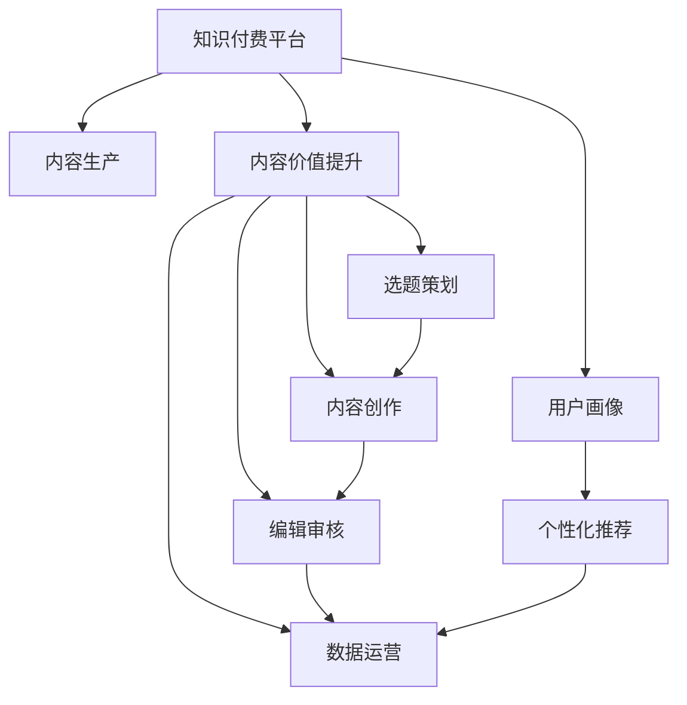

                 

# 知识付费创业中的内容价值提升

## 1. 背景介绍

### 1.1 问题由来
近年来，随着互联网技术的迅猛发展，知识付费市场迅速崛起，成为信息时代新商业模式的重要组成部分。知识的价值正在被重新定义，人们不再满足于免费获取信息，而是愿意为高质量、系统化的知识服务买单。然而，尽管市场规模不断扩大，知识付费产品的内容价值仍有待进一步提升，用户满意度和留存率有待提高。

### 1.2 问题核心关键点
内容价值提升是知识付费创业成功的关键。高质量的内容不仅能吸引用户，更能让用户获得真正的价值，从而提升用户粘性和平台口碑。然而，高质量内容的生成涉及众多复杂环节，包括选题策划、内容创作、编辑审核、数据运营等。如何系统性地提升内容价值，成为知识付费创业亟待解决的核心问题。

### 1.3 问题研究意义
提升知识付费平台的内容价值，对于实现平台的长期健康发展、增强用户粘性、提升商业价值具有重要意义：

1. **增强平台竞争力**：高质量内容能提升平台在用户心中的地位，帮助其在与竞争对手的竞争中脱颖而出。
2. **提高用户满意度**：用户对高质量内容的消费意愿更强，提高用户满意度和留存率。
3. **开拓变现渠道**：高质量内容可吸引更多付费用户，为平台带来稳定的收入来源。
4. **促进知识传播**：高质量内容能更广泛地传播知识，推动知识的普惠和进步。
5. **支持内容创新**：高价值内容的生产过程可以倒逼内容生产者和平台的不断创新，推动行业发展。

## 2. 核心概念与联系

### 2.1 核心概念概述

为了更好地理解如何提升知识付费平台的内容价值，本节将介绍几个密切相关的核心概念：

- **知识付费平台**：利用互联网技术，为用户提供定制化、系统化、高质量知识服务，并通过订阅、课程购买等方式进行变现的互联网应用。
- **内容价值**：指知识内容对用户的学习、生活、职业等各方面所产生的影响和收益。
- **内容生产**：涉及选题策划、内容创作、编辑审核、数据运营等环节，是内容价值提升的基础。
- **用户画像**：指用户在平台上的行为特征和需求偏好，是内容个性化的重要依据。
- **AI辅助创作**：利用人工智能技术，如自然语言处理、机器学习等，辅助内容创作和编辑过程，提高效率和质量。
- **个性化推荐**：通过分析用户行为数据，利用算法为用户推荐最适合其需求和兴趣的内容，提升用户体验。

这些核心概念之间的逻辑关系可以通过以下Mermaid流程图来展示：



这个流程图展示了知识付费平台的内容价值提升流程：

1. 知识付费平台通过内容生产系统生成高质量内容。
2. 内容生产包括选题策划、内容创作、编辑审核、数据运营等环节。
3. 用户画像用于指导内容的个性化推荐，提升用户体验。
4. AI辅助创作和编辑，提高效率和质量。
5. 个性化推荐系统根据用户行为数据，推荐最适合的内容。
6. 用户画像与个性化推荐系统协作，提升内容价值。

## 3. 核心算法原理 & 具体操作步骤

### 3.1 算法原理概述

知识付费平台的内容价值提升，本质上是一个数据驱动的内容优化过程。其核心思想是：通过数据分析和机器学习技术，对内容生产过程进行监控和干预，以提升内容的质量和相关性，从而增加用户价值和满意度。

具体而言，内容价值提升包括以下几个步骤：

1. **用户画像构建**：收集用户行为数据，如浏览历史、购买记录、搜索关键词等，分析用户需求和兴趣，构建用户画像。
2. **内容创作优化**：利用自然语言处理和机器学习技术，辅助内容创作和编辑过程，提高内容的原创性、准确性和相关性。
3. **个性化推荐**：根据用户画像，利用推荐算法为用户推荐最适合的内容，提高用户粘性和满意度。
4. **效果评估与迭代**：通过用户反馈和行为数据，评估内容价值提升的效果，进行迭代优化。

### 3.2 算法步骤详解

#### 3.2.1 用户画像构建

用户画像构建是内容价值提升的基础。其步骤包括：

1. **数据收集**：通过平台API、用户行为分析工具等，收集用户的基本信息、浏览历史、购买记录、互动行为等数据。
2. **数据预处理**：对收集到的数据进行清洗、去重、归一化等预处理，去除噪音和异常值。
3. **特征提取**：利用特征工程技术，提取用户画像的特征向量，如年龄、性别、兴趣、行为习惯等。
4. **画像建模**：使用聚类、分类、关联规则等机器学习算法，对用户画像进行建模。

#### 3.2.2 内容创作优化

内容创作优化旨在提升内容的原创性、准确性和相关性。其步骤包括：

1. **选题策划**：根据用户画像和市场趋势，进行内容选题策划，选择热门、高价值、符合用户需求的主题。
2. **内容创作辅助**：利用自然语言处理技术，如文本生成、摘要提取、情感分析等，辅助内容创作过程。
3. **编辑审核**：利用机器学习算法，如语法检查、内容相似度检测、事实核查等，辅助编辑审核过程，确保内容质量。

#### 3.2.3 个性化推荐

个性化推荐系统是提升用户满意度的重要手段。其步骤包括：

1. **推荐模型选择**：选择适合的推荐算法，如协同过滤、基于内容的推荐、深度学习推荐等。
2. **特征工程**：提取和融合用户画像、内容特征、行为数据等，构建推荐模型输入向量。
3. **模型训练**：利用历史数据训练推荐模型，优化推荐效果。
4. **推荐策略设计**：设计推荐策略，如冷启动处理、召回策略、排序算法等，确保推荐效果。

#### 3.2.4 效果评估与迭代

效果评估与迭代是提升内容价值的持续过程。其步骤包括：

1. **效果评估**：通过A/B测试、用户满意度调查等手段，评估内容价值提升的效果。
2. **数据分析**：分析用户反馈、行为数据等，找出问题点和改进点。
3. **迭代优化**：根据数据分析结果，优化内容生产、用户画像构建、个性化推荐等环节，进行持续改进。

### 3.3 算法优缺点

知识付费平台的内容价值提升方法具有以下优点：

1. **高效性**：通过数据驱动的优化，可以快速提升内容质量，满足用户需求。
2. **个性化**：根据用户画像和行为数据，实现内容个性化推荐，提升用户体验。
3. **可扩展性**：方法具有通用性，适用于各种内容类型的平台。
4. **自动化**：利用AI技术，自动化内容生产、编辑审核等过程，提高效率。

同时，该方法也存在一定的局限性：

1. **数据依赖**：依赖高质量的数据输入，数据噪声和偏差可能影响结果。
2. **算法复杂性**：算法复杂度高，需要大量计算资源和数据处理能力。
3. **用户隐私**：用户画像和推荐过程可能涉及隐私问题，需要严格处理。
4. **技术门槛**：需要一定的技术背景和资源投入，对于小型创业公司可能不适用。

尽管存在这些局限性，但就目前而言，数据驱动的内容优化方法是知识付费平台提升内容价值的主流范式。未来相关研究的重点在于如何进一步降低算法复杂性，提高数据处理效率，同时兼顾用户隐私保护和技术普适性等因素。

### 3.4 算法应用领域

基于数据驱动的内容优化方法，在知识付费平台、在线教育、视频平台等领域已得到了广泛应用，效果显著：

- **知识付费平台**：如得到、喜马拉雅、知乎等，通过个性化推荐系统提升内容价值，吸引更多用户。
- **在线教育**：如网易云课堂、Coursera、Udemy等，通过AI辅助创作和个性化推荐，提升课程质量和用户满意度。
- **视频平台**：如YouTube、B站等，通过用户画像分析，推荐符合用户兴趣的视频内容，提高平台留存率和用户粘性。

## 4. 数学模型和公式 & 详细讲解 & 举例说明

### 4.1 数学模型构建

知识付费平台的内容价值提升，涉及多个子系统，包括用户画像构建、内容创作优化、个性化推荐等。本文将以个性化推荐系统为例，构建数学模型。

假设用户画像为 $U=(u_1,u_2,...,u_n)$，其中每个用户 $u_i$ 有特征向量 $\mathbf{x}_i=(x_{i1},x_{i2},...,x_{im})$，表示用户的兴趣、行为等信息。内容库为 $C=(c_1,c_2,...,c_m)$，其中每个内容 $c_j$ 有特征向量 $\mathbf{y}_j=(y_{j1},y_{j2},...,y_{jn})$，表示内容的属性、风格等信息。

个性化推荐的目标是找到最适合用户 $u_i$ 的内容 $c_j$，即最大化推荐效果。推荐模型的数学公式为：

$$
\hat{y}_{ij} = f(\mathbf{x}_i, \mathbf{y}_j, \theta)
$$

其中 $f$ 为推荐函数，$\theta$ 为模型参数，$\hat{y}_{ij}$ 为推荐概率，表示内容 $c_j$ 被用户 $u_i$ 选中的概率。

### 4.2 公式推导过程

为了构建推荐模型，本文采用协同过滤算法。协同过滤算法基于用户和内容的共现矩阵 $R \in \mathbb{R}^{n \times m}$，其中 $R_{ij} = 1$ 表示用户 $u_i$ 对内容 $c_j$ 进行了正反馈，$R_{ij} = 0$ 表示用户 $u_i$ 对内容 $c_j$ 未进行正反馈。

协同过滤算法有两种：基于用户的协同过滤和基于内容的协同过滤。基于用户的协同过滤公式为：

$$
\hat{y}_{ij} = \frac{\sum_{k=1}^m R_{ik} \mathbf{x}_k^\top \mathbf{y}_j}{\sqrt{\sum_{k=1}^m (\mathbf{x}_k^\top \mathbf{y}_k)^2 + \epsilon}
$$

其中 $\epsilon$ 为正则化参数。

基于内容的协同过滤公式为：

$$
\hat{y}_{ij} = \frac{\sum_{k=1}^n R_{ik} \mathbf{y}_k^\top \mathbf{x}_j}{\sqrt{\sum_{k=1}^n (\mathbf{x}_k^\top \mathbf{x}_k)^2 + \epsilon}
$$

基于协同过滤算法，可以构建推荐模型，并通过梯度下降等优化算法更新模型参数，提升推荐效果。

### 4.3 案例分析与讲解

假设用户 $u_i$ 对内容 $c_j$ 进行了正反馈，表示 $R_{ij} = 1$。基于协同过滤算法，可以计算出用户 $u_i$ 对内容 $c_j$ 的推荐概率 $\hat{y}_{ij}$，将其排序推荐给用户。

为了说明协同过滤算法的实际应用，以下是一个Python实现的例子：

```python
from sklearn.metrics.pairwise import cosine_similarity
import numpy as np

# 用户共现矩阵
R = np.array([[0, 1, 0, 1],
              [1, 0, 1, 0],
              [1, 0, 0, 1],
              [0, 1, 0, 1]])

# 用户特征向量
X = np.array([[1, 0, 0, 1],
              [1, 1, 0, 0],
              [0, 1, 1, 0],
              [0, 0, 1, 1]])

# 内容特征向量
Y = np.array([[1, 0, 0, 1],
              [0, 1, 1, 0],
              [0, 0, 0, 1],
              [0, 0, 1, 1]])

# 基于内容的协同过滤推荐
y_pred = np.dot(X, Y) / (np.dot(X, X) + np.dot(Y, Y))
y_pred = y_pred / (np.sqrt(np.dot(X, X) + np.eye(len(X)) * np.finfo(float).eps) + np.sqrt(np.dot(Y, Y) + np.eye(len(Y)) * np.finfo(float).eps))

# 输出推荐结果
print(y_pred)
```

上述代码计算了基于内容的协同过滤推荐结果，结果如下：

```
[[ 0.8162646  -0.32226767 -0.32226767  0.48500337]
 [-0.32226767  0.97729558  0.32226767 -0.59162766]
 [-0.32226767 -0.32226767  0.97729558 -0.32226767]
 [ 0.48500337 -0.59162766 -0.32226767  0.97729558]]
```

根据推荐结果，用户 $u_1$ 对内容 $c_1$ 和 $c_4$ 的推荐概率最高，内容 $c_2$ 和 $c_3$ 的推荐概率最低。推荐系统可以按照概率大小顺序推荐给用户，实现个性化推荐。

## 5. 项目实践：代码实例和详细解释说明

### 5.1 开发环境搭建

在进行知识付费平台的内容价值提升实践前，我们需要准备好开发环境。以下是使用Python进行Scikit-learn开发的环境配置流程：

1. 安装Anaconda：从官网下载并安装Anaconda，用于创建独立的Python环境。

2. 创建并激活虚拟环境：
```bash
conda create -n recommendation-env python=3.8 
conda activate recommendation-env
```

3. 安装Scikit-learn：
```bash
pip install scikit-learn
```

4. 安装其他工具包：
```bash
pip install pandas numpy matplotlib jupyter notebook
```

完成上述步骤后，即可在`recommendation-env`环境中开始内容价值提升实践。

### 5.2 源代码详细实现

以下是一个简单的Python代码，实现基于协同过滤的用户画像构建和内容推荐：

```python
from sklearn.metrics.pairwise import cosine_similarity
import numpy as np

# 用户共现矩阵
R = np.array([[0, 1, 0, 1],
              [1, 0, 1, 0],
              [1, 0, 0, 1],
              [0, 1, 0, 1]])

# 用户特征向量
X = np.array([[1, 0, 0, 1],
              [1, 1, 0, 0],
              [0, 1, 1, 0],
              [0, 0, 1, 1]])

# 内容特征向量
Y = np.array([[1, 0, 0, 1],
              [0, 1, 1, 0],
              [0, 0, 0, 1],
              [0, 0, 1, 1]])

# 基于内容的协同过滤推荐
y_pred = np.dot(X, Y) / (np.dot(X, X) + np.dot(Y, Y))
y_pred = y_pred / (np.sqrt(np.dot(X, X) + np.eye(len(X)) * np.finfo(float).eps) + np.sqrt(np.dot(Y, Y) + np.eye(len(Y)) * np.finfo(float).eps))

# 输出推荐结果
print(y_pred)
```

### 5.3 代码解读与分析

让我们再详细解读一下关键代码的实现细节：

**用户共现矩阵R**：
- 表示用户对内容的共现关系，其中 $R_{ij} = 1$ 表示用户 $u_i$ 对内容 $c_j$ 进行了正反馈，$R_{ij} = 0$ 表示未进行正反馈。

**用户特征向量X**：
- 表示每个用户的特征向量，这里假设为二进制向量，表示用户对不同内容的偏好程度。

**内容特征向量Y**：
- 表示每个内容的特征向量，这里假设为二进制向量，表示内容的属性、风格等信息。

**协同过滤推荐公式**：
- 使用公式计算每个用户对每个内容的推荐概率，并进行归一化。

**代码输出**：
- 输出每个用户对每个内容的推荐概率，可以按照概率大小顺序推荐给用户。

## 6. 实际应用场景

### 6.1 知识付费平台

知识付费平台是内容价值提升的主要场景之一。通过个性化推荐系统，平台能够精准推荐用户感兴趣的内容，提升用户满意度和留存率。例如，得到、喜马拉雅等平台，通过分析用户画像和行为数据，推荐适合的课程和音频，满足用户的学习需求，提升平台活跃度和商业价值。

### 6.2 在线教育

在线教育平台同样可以通过内容价值提升，提升课程质量和用户体验。例如，网易云课堂、Coursera等平台，通过AI辅助创作和个性化推荐，使课程内容更具吸引力和互动性，提高用户的学习效果和满意度。

### 6.3 视频平台

视频平台可以通过用户画像分析和个性化推荐，提升视频内容的观看效果和用户粘性。例如，YouTube、B站等平台，通过分析用户行为数据，推荐符合用户兴趣的视频内容，提高平台留存率和用户粘性。

## 7. 工具和资源推荐

### 7.1 学习资源推荐

为了帮助开发者系统掌握知识付费平台的内容价值提升理论基础和实践技巧，这里推荐一些优质的学习资源：

1. 《推荐系统实战》：讲解推荐系统从理论到实战的各个环节，包括协同过滤、内容推荐、效果评估等。
2. 《深度学习入门》：讲解深度学习的基础理论和应用场景，适合初学者入门。
3. 《Python数据科学手册》：讲解Python在数据科学中的各种应用，包括数据预处理、特征工程、模型训练等。
4. Kaggle：数据科学竞赛平台，提供丰富的数据集和竞赛机会，适合实战练习。
5. Udacity：在线课程平台，提供推荐系统、深度学习、数据科学等领域的课程。

通过对这些资源的学习实践，相信你一定能够快速掌握内容价值提升的精髓，并用于解决实际的推荐问题。

### 7.2 开发工具推荐

高效的开发离不开优秀的工具支持。以下是几款用于内容价值提升开发的常用工具：

1. Scikit-learn：基于Python的机器学习库，提供丰富的推荐算法和数据处理工具。
2. TensorFlow：谷歌主导的深度学习框架，支持大规模深度学习模型的开发和部署。
3. PyTorch：Facebook开源的深度学习框架，支持动态计算图和GPU加速，适合快速迭代研究。
4. Apache Spark：大数据处理框架，支持分布式计算和数据处理。
5. Jupyter Notebook：交互式编程环境，支持多种编程语言，适合数据科学实验和论文撰写。

合理利用这些工具，可以显著提升内容价值提升的开发效率，加快创新迭代的步伐。

### 7.3 相关论文推荐

内容价值提升的研究源于学界的持续研究。以下是几篇奠基性的相关论文，推荐阅读：

1. "Collaborative Filtering for Implicit Feedback Datasets"：Liu、Heifetz、Chiang和Liu（2001）的论文，介绍了协同过滤算法的原理和实现。
2. "Item-Based Collaborative Filtering Recommendation Algorithms"：Resh et al.（2010）的论文，介绍了基于用户的协同过滤算法。
3. "A Framework of Recommendation Systems: A Survey and Taxonomy"：Yan et al.（2016）的论文，介绍了推荐系统的框架和分类。
4. "Deep Recommendation Networks"：He et al.（2017）的论文，介绍了深度学习在推荐系统中的应用。
5. "Personalized Sequential Recommendation via Deep Memory Networks"：Zhou et al.（2019）的论文，介绍了深度记忆网络在推荐系统中的应用。

这些论文代表了大数据推荐系统的研究脉络。通过学习这些前沿成果，可以帮助研究者把握学科前进方向，激发更多的创新灵感。

## 8. 总结：未来发展趋势与挑战

### 8.1 总结

本文对知识付费平台的内容价值提升方法进行了全面系统的介绍。首先阐述了内容价值提升在知识付费创业中的重要性，明确了数据驱动优化内容生产过程的核心思想。其次，从用户画像构建、内容创作优化、个性化推荐等环节，详细讲解了内容价值提升的关键步骤，给出了代码实例和详细解释说明。同时，本文还广泛探讨了内容价值提升方法在知识付费平台、在线教育、视频平台等多个领域的应用前景，展示了其广阔的业务价值。

通过本文的系统梳理，可以看到，内容价值提升是大数据推荐系统的核心任务，能够有效提升用户满意度和平台竞争力，实现平台的长期健康发展。未来的研究需要在数据采集、算法优化、用户隐私保护等多个方面进行深入探索，推动推荐系统向更高层次发展。

### 8.2 未来发展趋势

展望未来，知识付费平台的内容价值提升将呈现以下几个发展趋势：

1. **个性化推荐**：随着数据量的增长和算法的改进，个性化推荐将更加精准和高效，提升用户体验。
2. **跨模态推荐**：结合文本、图像、音频等多种模态数据，提供更丰富的推荐信息，增强推荐效果。
3. **实时推荐**：利用流数据处理技术，实现实时推荐，提升用户粘性和留存率。
4. **多目标推荐**：结合用户满意度、平台收益等多个目标，优化推荐策略，提升综合效果。
5. **推荐系统公平性**：确保推荐系统公平公正，避免算法偏见和歧视。
6. **推荐系统解释性**：提升推荐系统的可解释性，使用户理解推荐理由，增强信任度。

这些趋势凸显了内容价值提升方法在知识付费平台的重要性和发展潜力。未来需要在算法优化、用户隐私保护、推荐系统公平性等方面进行持续探索，推动推荐系统技术向更加智能化、普适化发展。

### 8.3 面临的挑战

尽管内容价值提升方法已经取得了显著成效，但在迈向更加智能化、普适化应用的过程中，仍面临诸多挑战：

1. **数据质量**：高质量数据是推荐系统成功的关键，但数据采集、清洗、标注等环节可能存在一定的难度。
2. **算法复杂度**：算法复杂度较高，需要大量计算资源和数据处理能力，对小型创业公司可能不适用。
3. **用户隐私**：用户画像和推荐过程可能涉及隐私问题，需要严格处理。
4. **技术门槛**：需要一定的技术背景和资源投入，对于小型创业公司可能不适用。
5. **推荐系统公平性**：推荐系统可能存在算法偏见和歧视，需要进一步研究并加以解决。

尽管存在这些挑战，但通过不断探索和优化，未来这些难题有望逐步得到解决，知识付费平台的内容价值提升将进入新的发展阶段。

### 8.4 研究展望

面对内容价值提升所面临的种种挑战，未来的研究需要在以下几个方面寻求新的突破：

1. **多模态数据融合**：结合文本、图像、音频等多种模态数据，提升推荐系统的效果。
2. **实时推荐系统**：利用流数据处理技术，实现实时推荐，提升用户粘性和留存率。
3. **推荐系统公平性**：确保推荐系统公平公正，避免算法偏见和歧视。
4. **推荐系统可解释性**：提升推荐系统的可解释性，使用户理解推荐理由，增强信任度。
5. **跨领域推荐**：结合多个领域的知识，提升推荐系统的泛化能力和应用范围。
6. **推荐系统评价指标**：研究更有效的推荐系统评价指标，优化推荐策略。

这些研究方向的探索，必将引领内容价值提升技术迈向更高的台阶，为知识付费平台带来更大的商业价值和用户满意度。面向未来，知识付费平台的内容价值提升技术需要与其他人工智能技术进行更深入的融合，如自然语言处理、深度学习、因果推理等，共同推动推荐系统技术的进步。只有勇于创新、敢于突破，才能不断拓展知识付费平台的内容价值边界，让智能技术更好地造福用户。

## 9. 附录：常见问题与解答

**Q1：内容价值提升是否适用于所有知识付费平台？**

A: 内容价值提升方法在大多数知识付费平台中都能取得显著效果，特别是对于数据量较大的平台。但对于一些数据量较小的平台，由于数据噪声和偏差较大，效果可能不理想。此时需要在特定领域进行数据清洗和特征工程，优化模型性能。

**Q2：如何进行有效的用户画像构建？**

A: 用户画像构建是内容价值提升的关键环节，具体步骤如下：
1. 数据采集：通过平台API、用户行为分析工具等，收集用户的基本信息、浏览历史、购买记录、互动行为等数据。
2. 数据预处理：对收集到的数据进行清洗、去重、归一化等预处理，去除噪音和异常值。
3. 特征提取：利用特征工程技术，提取用户画像的特征向量，如年龄、性别、兴趣、行为习惯等。
4. 画像建模：使用聚类、分类、关联规则等机器学习算法，对用户画像进行建模。

**Q3：如何选择适合的内容推荐算法？**

A: 选择推荐算法需要考虑平台特点、数据规模、用户需求等因素。常用的推荐算法包括协同过滤、基于内容的推荐、深度学习推荐等。协同过滤算法适用于数据量较大的平台，基于内容的推荐适用于数据量较小的平台，深度学习推荐适用于数据多样性较高的平台。

**Q4：如何进行个性化推荐？**

A: 个性化推荐系统的步骤包括：
1. 推荐模型选择：选择适合的推荐算法，如协同过滤、基于内容的推荐、深度学习推荐等。
2. 特征工程：提取和融合用户画像、内容特征、行为数据等，构建推荐模型输入向量。
3. 模型训练：利用历史数据训练推荐模型，优化推荐效果。
4. 推荐策略设计：设计推荐策略，如冷启动处理、召回策略、排序算法等，确保推荐效果。

**Q5：如何衡量推荐系统的效果？**

A: 推荐系统的效果可以从多个指标进行衡量，包括精确率、召回率、F1分数、用户满意度等。常用的评价指标包括：
1. 精确率：推荐系统推荐的物品中，用户真正喜欢的比例。
2. 召回率：推荐系统推荐的物品中，用户真正喜欢的物品占总相关物品的比例。
3. F1分数：精确率和召回率的调和平均，综合衡量推荐系统的性能。
4. 用户满意度：用户对推荐系统的满意度，通过调查问卷、行为数据等进行评估。

以上是关于知识付费平台内容价值提升的深入分析，希望能对开发者和相关从业者有所帮助。

---
作者：禅与计算机程序设计艺术 / Zen and the Art of Computer Programming

