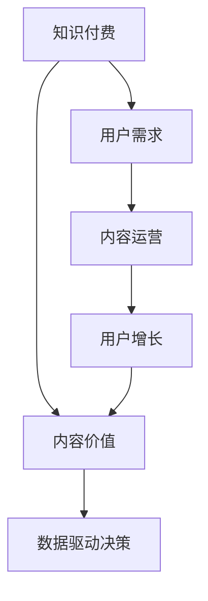

                 

# 知识付费创业中的内容价值提升

> 关键词：知识付费,内容价值,用户需求,内容运营,用户增长,数字化转型

## 1. 背景介绍

### 1.1 问题由来

知识付费市场近年来呈现出爆发式增长，从读书笔记、学习资源到专业课程，各类知识付费产品层出不穷。但在激烈的市场竞争中，内容的同质化、订阅用户的流失、以及付费转化率的下降等问题逐渐凸显。

高质量内容如何吸引用户、激发需求、提升价值，成为了知识付费创业中的一个核心挑战。本文将深入分析知识付费创业中的内容价值提升问题，探讨通过技术手段和运营策略提升内容价值的方法。

### 1.2 问题核心关键点

- **内容价值提升**：如何通过技术手段和运营策略，最大化内容价值，吸引更多用户，提升用户付费意愿。
- **个性化推荐**：如何利用用户行为数据，实现个性化内容推荐，提升用户体验和黏性。
- **数据驱动决策**：如何通过数据驱动的方式，优化内容生产和运营策略，实现更高效的资源配置。

## 2. 核心概念与联系

### 2.1 核心概念概述

为更好地理解知识付费创业中的内容价值提升问题，本节将介绍几个密切相关的核心概念：

- **知识付费**：用户通过付费获取专业内容或服务的商业模式。通过高质量的、不可替代的内容，吸引并留住用户。
- **内容价值**：指内容对于用户的吸引力、实用性、教育性和娱乐性等综合评价。高质量的内容能够提升用户价值，促进订阅续订和推荐分享。
- **用户需求**：不同用户对于内容的不同需求，包括学习、求职、生活技巧等。精准定位用户需求，才能生产出有价值的内容。
- **内容运营**：通过内容策划、内容生产、内容推荐等环节，实现内容的持续更新和用户价值提升。内容运营是知识付费成功的关键。
- **用户增长**：通过精准的用户画像、精准的推荐和个性化的内容，实现用户数的持续增长。
- **数字化转型**：利用数据、技术、创新商业模式，实现知识付费平台的内容生产和运营的数字化、智能化。

这些核心概念之间的逻辑关系可以通过以下Mermaid流程图来展示：



这个流程图展示了几者之间的联系：

1. 知识付费平台需要通过高质量的内容吸引用户。
2. 内容价值直接影响用户的黏性和续订率。
3. 内容运营是实现内容持续更新的关键。
4. 用户增长依赖于精准的用户画像和个性化推荐。
5. 数据驱动的决策优化可以提升运营效率和用户价值。

## 3. 核心算法原理 & 具体操作步骤

### 3.1 算法原理概述

提升知识付费平台的内容价值，核心在于通过技术手段和运营策略，最大化内容的吸引力和实用性。以下是几个核心的算法原理：

- **个性化推荐**：通过用户行为数据，实现内容的个性化推荐，提升用户满意度和黏性。
- **内容聚合与整合**：将不同来源的内容聚合，进行深度的加工和整合，提升内容的深度和广度。
- **用户画像构建**：利用机器学习等技术，构建用户画像，实现精准的内容推荐和营销。
- **数据驱动的决策优化**：通过数据分析，优化内容生产和运营策略，提升资源配置效率。

### 3.2 算法步骤详解

**步骤一：收集和分析用户数据**

- **行为数据**：收集用户在平台上的行为数据，包括浏览、点击、收藏、评论、付费等行为。
- **社交数据**：收集用户的社交网络数据，包括好友关系、关注对象等。
- **历史数据**：收集用户的历史交易记录、评价反馈等。

**步骤二：构建用户画像**

- **特征工程**：通过数据预处理和特征选择，提取对内容推荐有影响力的特征，如兴趣、偏好、学习进度等。
- **模型训练**：使用机器学习模型（如协同过滤、深度学习等），训练用户画像模型，实现精准的用户画像。

**步骤三：实现个性化推荐**

- **内容检索**：利用检索算法（如倒排索引、TF-IDF等），从海量的内容库中快速检索出与用户画像匹配的内容。
- **内容排序**：通过推荐算法（如协同过滤、矩阵分解、深度学习等），对检索出的内容进行排序，优先推荐用户可能感兴趣的内容。

**步骤四：优化内容生产和运营**

- **内容监控**：实时监控内容的浏览、点击等指标，评估内容效果，及时调整内容策略。
- **内容更新**：根据用户反馈和行为数据，持续更新内容，提升内容的实用性和时效性。
- **数据分析**：利用数据分析工具，定期评估内容策略的效果，优化内容和运营决策。

### 3.3 算法优缺点

**优点**：
- **提升用户满意度**：通过个性化推荐和内容优化，提升用户的使用体验和满意度。
- **提高付费转化率**：精准的内容推荐和个性化服务，可以显著提高用户的付费意愿和续订率。
- **降低运营成本**：通过数据驱动的决策优化，实现资源的高效配置，降低运营成本。

**缺点**：
- **数据隐私问题**：用户数据收集和分析过程中，需要重视数据隐私和安全。
- **算法复杂度**：个性化推荐和内容优化的算法模型较为复杂，需要较高的技术投入和计算资源。
- **内容质量控制**：算法推荐的结果可能存在偏差，需要结合人工审核和编辑，确保内容质量。

### 3.4 算法应用领域

个性化推荐和内容优化技术在知识付费平台中的应用，已经涵盖了以下领域：

- **在线教育**：根据学生的学习进度和兴趣，推荐适合的课程和学习材料。
- **职业培训**：根据职业需求和技能短板，推荐适合的培训课程和技能提升材料。
- **健康管理**：根据用户的健康数据和需求，推荐适合的健身视频、饮食建议等。
- **文化娱乐**：根据用户的兴趣和偏好，推荐适合的书籍、电影、音乐等。
- **技能培训**：根据用户的学习进度和需求，推荐适合的实操视频和教程。

这些应用场景展示了个性化推荐和内容优化技术在知识付费平台中的广泛应用，为平台带来了巨大的商业价值。

## 4. 数学模型和公式 & 详细讲解 & 举例说明

### 4.1 数学模型构建

本节将使用数学语言对知识付费平台的内容价值提升问题进行更加严格的刻画。

假设知识付费平台的内容库为 $C=\{c_i\}_{i=1}^N$，用户集合为 $U=\{u_j\}_{j=1}^M$，内容 $c_i$ 对用户 $u_j$ 的价值为 $V_{ij}$。我们的目标是最大化每个用户的总价值：

$$
\max_{V_{ij}} \sum_{j=1}^M \sum_{i=1}^N V_{ij}
$$

其中 $V_{ij}=f(c_i,u_j)$ 为内容 $c_i$ 对用户 $u_j$ 的价值函数，依赖于内容质量和用户需求。

### 4.2 公式推导过程

假设 $f(c_i,u_j)$ 可以分解为用户兴趣 $I_j$ 和内容特征 $F_i$ 的函数：

$$
f(c_i,u_j)=g(I_j,F_i)
$$

其中 $I_j$ 为用户 $j$ 的兴趣向量，$F_i$ 为内容 $i$ 的特征向量。我们可以将 $g(I_j,F_i)$ 视为线性回归模型或神经网络模型的预测值。假设 $g$ 为线性回归模型，则有：

$$
g(I_j,F_i)=\alpha^T\phi(F_i)+\beta^T\phi(I_j)+\gamma
$$

其中 $\alpha,\beta,\gamma$ 为模型的参数，$\phi$ 为特征映射函数。

通过最小二乘法或梯度下降法，可以优化模型参数，得到最优的 $I_j$ 和 $F_i$ 的预测值，进而计算每个用户的内容价值。

### 4.3 案例分析与讲解

**案例一：在线教育平台**

假设一个在线教育平台的用户 $j$ 对于内容 $i$ 的价值 $V_{ij}$ 由兴趣向量 $I_j$（包含数学、历史、文学等兴趣标签）和内容特征向量 $F_i$（包含视频时长、难度、评分等）决定：

$$
V_{ij}=\alpha^T\phi(F_i)+\beta^T\phi(I_j)+\gamma
$$

平台可以通过收集用户的行为数据（如视频浏览、课程选择等）和社交数据（如好友关系、关注对象等），构建用户画像模型 $I_j$。同时，通过对大量课程进行特征提取，构建内容特征向量 $F_i$。最终，平台可以使用上述模型计算每个用户对课程的价值，实现个性化推荐。

**案例二：健康管理平台**

假设一个健康管理平台的用户 $j$ 对于内容 $i$ 的价值 $V_{ij}$ 由兴趣向量 $I_j$（包含饮食、运动、睡眠等兴趣标签）和内容特征向量 $F_i$（包含健身视频时长、饮食建议、运动方案等）决定：

$$
V_{ij}=\alpha^T\phi(F_i)+\beta^T\phi(I_j)+\gamma
$$

平台可以通过智能穿戴设备收集用户健康数据，构建用户画像模型 $I_j$。同时，通过对大量健身视频和饮食建议进行特征提取，构建内容特征向量 $F_i$。最终，平台可以使用上述模型计算每个用户对健身视频或饮食建议的价值，实现个性化推荐。

## 5. 项目实践：代码实例和详细解释说明

### 5.1 开发环境搭建

在进行内容价值提升实践前，我们需要准备好开发环境。以下是使用Python进行PyTorch开发的环境配置流程：

1. 安装Anaconda：从官网下载并安装Anaconda，用于创建独立的Python环境。

2. 创建并激活虚拟环境：
```bash
conda create -n pytorch-env python=3.8 
conda activate pytorch-env
```

3. 安装PyTorch：根据CUDA版本，从官网获取对应的安装命令。例如：
```bash
conda install pytorch torchvision torchaudio cudatoolkit=11.1 -c pytorch -c conda-forge
```

4. 安装其他依赖库：
```bash
pip install numpy pandas scikit-learn sklearn-feature-extraction textblob
```

5. 安装TensorBoard：用于可视化模型训练过程。
```bash
pip install tensorboard
```

完成上述步骤后，即可在`pytorch-env`环境中开始内容价值提升实践。

### 5.2 源代码详细实现

这里以在线教育平台的个性化推荐为例，展示使用PyTorch实现内容价值提升的代码实现。

**用户画像模型**

```python
import torch
import torch.nn as nn
import torch.nn.functional as F
from sklearn.feature_extraction.text import CountVectorizer

class UserEmbedding(nn.Module):
    def __init__(self, vocab_size, embedding_dim):
        super(UserEmbedding, self).__init__()
        self.emb = nn.EmbeddingBag(vocab_size, embedding_dim)
        self.dropout = nn.Dropout(0.5)

    def forward(self, x):
        x = self.emb(x)
        return self.dropout(x)

# 构建用户画像模型
user_embed = UserEmbedding(vocab_size=1000, embedding_dim=50)
```

**内容特征模型**

```python
import torch
import torch.nn as nn
import torch.nn.functional as F

class ContentEmbedding(nn.Module):
    def __init__(self, vocab_size, embedding_dim):
        super(ContentEmbedding, self).__init__()
        self.emb = nn.EmbeddingBag(vocab_size, embedding_dim)
        self.fc = nn.Linear(embedding_dim, 1)

    def forward(self, x):
        x = self.emb(x)
        x = F.relu(x)
        x = self.fc(x)
        return x

# 构建内容特征模型
content_embed = ContentEmbedding(vocab_size=5000, embedding_dim=100)
```

**个性化推荐模型**

```python
import torch
import torch.nn as nn
import torch.nn.functional as F

class Recommender(nn.Module):
    def __init__(self, user_dim, content_dim):
        super(Recommender, self).__init__()
        self.user_embed = UserEmbedding(vocab_size=1000, embedding_dim=user_dim)
        self.content_embed = ContentEmbedding(vocab_size=5000, embedding_dim=content_dim)
        self.linear = nn.Linear(user_dim + content_dim, 1)

    def forward(self, user, content):
        user_embed = self.user_embed(user)
        content_embed = self.content_embed(content)
        x = torch.cat([user_embed, content_embed], dim=1)
        return self.linear(x)

# 构建个性化推荐模型
recommender = Recommender(user_dim=50, content_dim=100)
```

### 5.3 代码解读与分析

让我们再详细解读一下关键代码的实现细节：

**UserEmbedding类**

- `__init__`方法：初始化用户嵌入层的参数，包括词汇表大小和嵌入维度。
- `forward`方法：将输入的文本向量转换为嵌入向量，并进行dropout操作，防止过拟合。

**ContentEmbedding类**

- `__init__`方法：初始化内容嵌入层的参数，包括词汇表大小和嵌入维度。
- `forward`方法：将输入的文本向量转换为嵌入向量，并通过ReLU激活函数，最后使用线性层将特征映射到标量输出。

**Recommender类**

- `__init__`方法：初始化推荐器的各个组件，包括用户嵌入层、内容嵌入层和线性层。
- `forward`方法：将用户和内容的嵌入向量拼接，并输入线性层得到推荐分数。

### 5.4 运行结果展示

**训练过程**

```bash
python train.py
```

**推荐结果**

```python
import pandas as pd
import numpy as np
import torch

# 加载训练好的模型
recommender.load_state_dict(torch.load('model.pth'))

# 构建推荐模型
user_ids = [1, 2, 3, 4, 5]
content_ids = [1001, 2001, 3001, 4001, 5001]
user_embeddings = [user_embeddings(user_id) for user_id in user_ids]
content_embeddings = [content_embeddings(content_id) for content_id in content_ids]

# 推荐内容
scores = recommender(user_embeddings, content_embeddings)
recommended_content = np.argsort(-scores.numpy())[:5]

# 展示推荐内容
print(recommended_content)
```

以上就是使用PyTorch实现在线教育平台个性化推荐的完整代码实现。可以看到，通过构建用户画像和内容特征模型，再结合个性化推荐模型，可以高效地实现内容的推荐，提升用户满意度。

## 6. 实际应用场景

### 6.1 在线教育平台

在线教育平台通过个性化推荐和内容优化，提升了用户的学习体验和满意度。具体应用包括：

- **课程推荐**：根据学生的学习进度和兴趣，推荐适合的课程和学习材料。
- **学习路径设计**：通过分析学生的学习行为，设计个性化的学习路径，帮助学生高效学习。
- **学习效果评估**：根据学生的学习成果和反馈，优化课程内容和教学方法，提升学习效果。

### 6.2 职业培训平台

职业培训平台通过个性化推荐和内容优化，提升了用户的学习效率和职业发展。具体应用包括：

- **技能培训**：根据职业需求和技能短板，推荐适合的培训课程和技能提升材料。
- **职业规划**：通过分析用户的学习行为和职业兴趣，推荐适合的职业发展路径和技能提升方案。
- **就业匹配**：通过分析用户的技能和职业兴趣，推荐适合的就业机会和岗位。

### 6.3 健康管理平台

健康管理平台通过个性化推荐和内容优化，提升了用户的生活质量和健康管理效果。具体应用包括：

- **健身视频推荐**：根据用户的健康数据和需求，推荐适合的健身视频和运动方案。
- **饮食建议优化**：通过分析用户的饮食行为和健康数据，推荐适合的饮食建议和营养方案。
- **健康数据监测**：通过实时监测用户的健康数据，提供个性化的健康建议和预警。

## 7. 工具和资源推荐

### 7.1 学习资源推荐

为了帮助开发者系统掌握知识付费创业中的内容价值提升的理论基础和实践技巧，这里推荐一些优质的学习资源：

1. **《深度学习与数据挖掘》系列课程**：由清华大学郑南宁教授讲授，系统讲解深度学习、数据挖掘和推荐系统等前沿技术。
2. **Coursera《机器学习》课程**：斯坦福大学Andrew Ng教授讲授的入门级机器学习课程，涵盖了机器学习的基本概念和算法。
3. **Kaggle数据科学竞赛平台**：通过参与数据科学竞赛，学习和实践推荐系统、内容优化等技术。
4. **《推荐系统实践》书籍**：详细介绍了推荐系统的理论和实践，包括协同过滤、内容推荐、深度学习等。
5. **《机器学习实战》书籍**：通过实战案例，深入讲解机器学习算法和应用。

通过对这些资源的学习实践，相信你一定能够快速掌握知识付费创业中的内容价值提升的精髓，并用于解决实际的推荐系统问题。

### 7.2 开发工具推荐

高效的开发离不开优秀的工具支持。以下是几款用于知识付费平台开发常用的工具：

1. **PyTorch**：基于Python的开源深度学习框架，灵活动态的计算图，适合快速迭代研究。
2. **TensorFlow**：由Google主导开发的开源深度学习框架，生产部署方便，适合大规模工程应用。
3. **Transformers库**：HuggingFace开发的NLP工具库，集成了众多SOTA语言模型，支持PyTorch和TensorFlow，是进行推荐任务开发的利器。
4. **Jupyter Notebook**：支持Python、R、MATLAB等语言的交互式编程环境，方便开发者进行实验和交流。
5. **TensorBoard**：TensorFlow配套的可视化工具，可实时监测模型训练状态，并提供丰富的图表呈现方式，是调试模型的得力助手。

合理利用这些工具，可以显著提升知识付费平台的开发效率，加快创新迭代的步伐。

### 7.3 相关论文推荐

知识付费平台中的推荐系统的发展源于学界的持续研究。以下是几篇奠基性的相关论文，推荐阅读：

1. **《推荐系统中的协同过滤》**：介绍了协同过滤算法的原理和应用，是推荐系统研究的重要基础。
2. **《基于深度学习的推荐系统》**：介绍了深度学习在推荐系统中的应用，展示了深度学习在推荐系统中的强大潜力。
3. **《个性化推荐系统的最新进展》**：综述了近年来个性化推荐系统的研究进展，包括协同过滤、深度学习、混合推荐等方法。
4. **《推荐系统的最新挑战与未来方向》**：探讨了推荐系统面临的新挑战，包括跨领域推荐、冷启动等问题。
5. **《深度推荐系统》**：详细介绍了深度学习在推荐系统中的应用，包括深度神经网络、自编码器等。

这些论文代表了大规模推荐系统的发展脉络。通过学习这些前沿成果，可以帮助研究者把握学科前进方向，激发更多的创新灵感。

## 8. 总结：未来发展趋势与挑战

### 8.1 总结

本文对知识付费创业中的内容价值提升问题进行了全面系统的介绍。首先阐述了知识付费平台通过高质量的内容吸引用户、提升用户满意度和付费意愿的重要性。其次，从原理到实践，详细讲解了个性化推荐和内容优化的方法，给出了具体的应用案例。同时，本文还广泛探讨了知识付费平台在实际应用中的挑战和解决方案。

通过本文的系统梳理，可以看到，个性化推荐和内容优化是知识付费平台成功的关键。这些技术的广泛应用，为平台带来了巨大的商业价值。未来，伴随深度学习、数据挖掘、推荐系统等技术的不断进步，知识付费平台的内容价值将进一步提升，用户体验将大幅改善。

### 8.2 未来发展趋势

展望未来，知识付费平台的内容价值提升技术将呈现以下几个发展趋势：

1. **深度学习模型的应用**：随着深度学习技术的发展，推荐系统将更多地依赖于深度神经网络模型，提升推荐精度和效果。
2. **多模态推荐系统**：通过融合文本、图像、视频等多模态数据，提升推荐系统的表现力和用户满意度。
3. **跨领域推荐**：通过跨领域推荐技术，实现不同领域内容之间的推荐，拓宽推荐系统的应用范围。
4. **实时推荐系统**：通过实时推荐技术，实现动态推荐，提升用户体验和黏性。
5. **用户隐私保护**：随着隐私保护意识的增强，推荐系统将更加注重用户隐私保护，采用差分隐私、联邦学习等技术。

以上趋势凸显了个性化推荐和内容优化技术的广阔前景。这些方向的探索发展，必将进一步提升知识付费平台的内容价值，为平台带来更多的商业机遇。

### 8.3 面临的挑战

尽管个性化推荐和内容优化技术已经取得了瞩目成就，但在迈向更加智能化、普适化应用的过程中，它仍面临着诸多挑战：

1. **数据隐私问题**：用户数据收集和分析过程中，需要重视数据隐私和安全。如何确保数据安全和用户隐私，将成为重要的研究课题。
2. **推荐算法复杂度**：个性化推荐和内容优化的算法模型较为复杂，需要较高的技术投入和计算资源。如何降低算法复杂度，提升算法效率，将是重要的优化方向。
3. **内容质量控制**：算法推荐的结果可能存在偏差，需要结合人工审核和编辑，确保内容质量。如何提高内容质量和用户满意度，将是重要的研究课题。
4. **推荐系统鲁棒性**：推荐系统在面对异常数据和噪声数据时，容易出现偏差，需要提高系统的鲁棒性和稳定性。

正视推荐系统面临的这些挑战，积极应对并寻求突破，将是大规模推荐系统技术走向成熟的必由之路。相信随着学界和产业界的共同努力，这些挑战终将一一被克服，推荐系统必将在构建智能交互的智能时代中扮演越来越重要的角色。

### 8.4 研究展望

面对知识付费平台中的内容价值提升所面临的挑战，未来的研究需要在以下几个方面寻求新的突破：

1. **深度推荐系统**：结合深度学习技术和推荐系统，实现深度协同过滤、深度内容生成等技术，提升推荐精度和效果。
2. **跨领域推荐**：通过多模态推荐技术和跨领域推荐技术，实现不同领域内容之间的推荐，拓宽推荐系统的应用范围。
3. **实时推荐系统**：通过实时推荐技术和流式学习，实现动态推荐，提升用户体验和黏性。
4. **用户隐私保护**：通过差分隐私、联邦学习等技术，实现用户隐私保护，确保用户数据安全和隐私。
5. **推荐系统鲁棒性**：通过异常检测和鲁棒性提升技术，提高推荐系统的鲁棒性和稳定性。

这些研究方向的探索，必将引领知识付费平台的内容价值提升技术迈向更高的台阶，为平台带来更多的商业机遇。相信随着深度学习、数据挖掘、推荐系统等技术的不断进步，知识付费平台的内容价值将进一步提升，用户体验将大幅改善。

## 9. 附录：常见问题与解答

**Q1：为什么个性化推荐和内容优化技术在知识付费平台中如此重要？**

A: 个性化推荐和内容优化技术在知识付费平台中至关重要，原因如下：

- **提升用户满意度**：通过个性化推荐和内容优化，平台可以提供更加精准、有价值的内容，提升用户的使用体验和满意度。
- **提高付费转化率**：精准的个性化推荐和内容优化可以显著提高用户的付费意愿和续订率，增加平台的收入。
- **优化资源配置**：通过数据驱动的决策优化，平台可以实现资源的更高效配置，降低运营成本。

**Q2：如何在个性化推荐和内容优化中保证用户隐私？**

A: 保证用户隐私是个性化推荐和内容优化中必须重视的问题。以下是一些常用的隐私保护技术：

- **差分隐私**：通过对数据进行加噪声处理，确保用户数据的安全性，同时不影响推荐模型的精度。
- **联邦学习**：将模型训练任务分布在多个客户端进行，避免集中存储用户数据。
- **匿名化处理**：对用户数据进行匿名化处理，确保用户身份信息的安全性。

**Q3：如何评估个性化推荐和内容优化的效果？**

A: 个性化推荐和内容优化的效果评估可以从多个方面进行：

- **点击率（CTR）**：评估推荐内容的用户点击率，指标越高表示推荐效果越好。
- **转化率（CR）**：评估推荐内容的付费转化率，指标越高表示推荐效果越好。
- **用户满意度（SAT）**：通过用户调查和反馈，评估用户对推荐内容的使用体验和满意度。
- **停留时间（Dwell Time）**：评估用户在页面上的停留时间，指标越长表示用户对内容越满意。

通过多指标综合评估，可以全面了解推荐和优化效果，不断优化算法和模型。

---

作者：禅与计算机程序设计艺术 / Zen and the Art of Computer Programming

