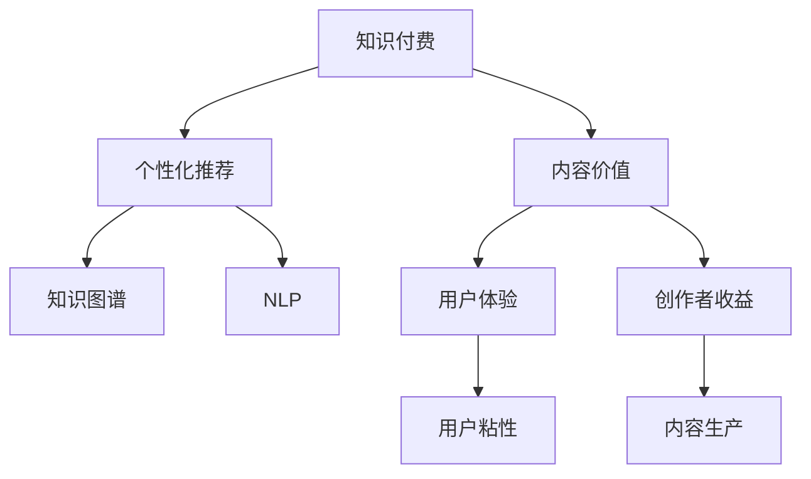

                 

# 知识付费创业中的内容价值最大化

> 关键词：知识付费,内容价值,价值最大化,人工智能,机器学习

## 1. 背景介绍

### 1.1 问题由来
随着信息技术的飞速发展，互联网成为知识传播和分享的重要平台。与此同时，知识付费作为一种新的内容消费形式，正在逐步成为人们获取深度学习资源的有效途径。知识付费平台通过提供高质量、有价值的知识内容，满足了用户不断增长的学习需求，也促使知识创作者能够获得更多收益，实现了双赢。

然而，随着知识付费市场竞争加剧，用户订阅疲劳等问题逐渐凸显。如何在内容高度饱和的市场环境中，实现内容价值的最大化，成为知识付费创业的一项重要挑战。本文将探讨如何在知识付费创业中，利用人工智能(AI)和机器学习(ML)技术，最大化内容价值，提升用户体验和创作者的收益。

### 1.2 问题核心关键点
核心问题在于如何通过智能化推荐系统、内容制作优化、用户行为分析等手段，提高内容精准度和用户粘性，实现内容价值的最大化。这需要从内容采集、知识图谱构建、推荐算法设计、用户行为建模等多个环节，进行全面优化。

### 1.3 问题研究意义
提升知识付费平台的内容价值，不仅有助于平台吸引和保留更多用户，还能有效提升知识创作者的收益，促进优质内容的生产。此外，通过智能推荐，用户能够更快地找到自己需要的知识，节约了搜索时间，提高了学习效率。总之，知识付费创业中内容价值最大化，是提升用户满意度和平台竞争力的重要路径。

## 2. 核心概念与联系

### 2.1 核心概念概述

为了更好地理解知识付费创业中内容价值最大化的实现机制，本节将介绍几个关键概念：

- 知识付费(Knowledge Paywall)：指用户为获取特定知识或信息而付费的商业模式。知识付费平台通过提供高质量的课程、文章、讲座等，吸引用户进行付费订阅或单次购买。
- 内容价值(Content Value)：指知识付费平台提供的内容对用户知识增长的贡献度。好的内容价值体现在用户能够获得深刻的洞察、实用的技巧和长远的知识积累。
- 个性化推荐(Personalized Recommendation)：通过分析用户行为、偏好和兴趣，提供个性化的知识推荐，提升用户满意度和粘性。
- 知识图谱(Knowledge Graph)：以图形化方式表示知识关系的框架，用于构建知识领域的结构化信息，支持复杂的知识推理和智能推荐。
- 自然语言处理(Natural Language Processing, NLP)：利用机器学习技术，处理和分析人类语言数据的学科，是智能推荐系统的重要组成部分。

这些概念之间的逻辑关系可以通过以下Mermaid流程图来展示：



这个流程图展示的知识付费平台的核心概念及其之间的关系：

1. 知识付费平台通过内容价值吸引用户订阅。
2. 个性化推荐系统提升用户体验，增强用户粘性。
3. 知识图谱和NLP技术支持内容价值构建，提高推荐效果。
4. 高质量的内容价值最终实现用户满意和创作者收益。

这些核心概念共同构成了知识付费平台的内容价值实现框架，使得平台能够通过智能化手段，最大化内容价值，提升用户和创作者的满意度。

## 3. 核心算法原理 & 具体操作步骤
### 3.1 算法原理概述

知识付费平台的内容价值最大化，主要通过以下几个关键步骤实现：

1. **内容采集与预处理**：从各类知识源（书籍、网络文章、学术论文、视频课程等）中采集内容，并进行预处理，清洗噪声和无用信息。

2. **知识图谱构建**：使用知识抽取和融合技术，构建以实体和关系为基础的知识图谱，用于知识推理和推荐。

3. **推荐算法设计**：设计合适的推荐算法，对用户进行行为分析和兴趣建模，基于用户画像和内容画像，实现个性化推荐。

4. **智能内容制作**：利用NLP技术，优化内容生成流程，提高内容质量，满足用户的多样化需求。

5. **用户行为分析**：分析用户的学习路径、浏览行为、评价反馈等，不断优化推荐策略，提升用户满意度。

### 3.2 算法步骤详解

以下是知识付费平台内容价值最大化实现的具体算法步骤：

**Step 1: 内容采集与预处理**
- 设计自动化的内容采集程序，从各类知识源（如电子书、学术论文、学术数据库、视频平台等）中爬取相关内容。
- 使用自然语言处理技术对采集到的内容进行清洗、去噪，去除无用的格式化信息，提取关键文本内容。

**Step 2: 知识图谱构建**
- 利用知识抽取技术，从结构化数据和非结构化数据中提取实体和关系。
- 使用知识融合技术，将多源异构数据进行整合，构建统一的知识图谱。
- 定期更新知识图谱，引入新实体和关系，保证其时效性。

**Step 3: 推荐算法设计**
- 使用协同过滤、基于内容的推荐、矩阵分解等经典推荐算法，对用户进行兴趣建模。
- 利用深度学习技术，如神经协同过滤、序列推荐模型等，提升推荐准确率和效果。
- 引入个性化推荐算法，如带兴趣衰减的双层神经网络、基于注意力机制的推荐等，优化推荐策略。

**Step 4: 智能内容制作**
- 设计内容生成模型，如Seq2Seq模型、Transformer模型等，生成高质量内容。
- 利用NLP技术，优化内容生成流程，提高内容质量和可读性。
- 设计内容推荐策略，根据用户画像和内容画像，推荐最合适的内容。

**Step 5: 用户行为分析**
- 分析用户的学习路径、浏览行为、评价反馈等数据，提取用户兴趣和偏好。
- 使用用户行为分析模型，如序列预测模型、时序特征工程等，预测用户行为。
- 根据用户行为分析结果，不断优化推荐算法，提升用户满意度。

### 3.3 算法优缺点

知识付费平台内容价值最大化的算法有以下优点：
1. 提升用户满意度：通过个性化推荐，提升用户体验，增强用户粘性。
2. 提高创作者收益：优化内容制作流程，提升内容质量和市场价值。
3. 增加平台竞争力：通过内容推荐，吸引更多用户订阅，提升平台流量和影响力。
4. 促进知识传播：优化内容推荐策略，将优质内容推荐给更多用户，加速知识传播。

同时，该算法也存在一定的局限性：
1. 数据质量要求高：推荐算法依赖高质量的用户行为数据，如果数据量不足或质量不高，将影响推荐效果。
2. 模型复杂度高：深度学习推荐算法需要大量的训练数据和计算资源，训练和部署成本较高。
3. 算法透明度低：黑盒模型难以解释其决策过程，用户和创作者可能对推荐结果缺乏信任。
4. 推荐冷启动问题：新用户或新内容进入平台时，推荐系统需要一定时间进行冷启动，才能提供准确的推荐。

尽管存在这些局限性，但就目前而言，基于推荐系统的知识付费平台内容价值最大化，仍是一种有效的实现方式。未来相关研究的重点在于如何进一步降低推荐对数据质量的要求，提高算法的透明度，优化推荐效果，同时兼顾创作者和用户的利益。

### 3.4 算法应用领域

知识付费平台的内容价值最大化算法，在多个领域得到了广泛应用，例如：

- 在线教育：通过个性化推荐，提高在线课程的订阅量和完成率。
- 科技资讯：推荐科技领域的最新论文、专利和技术趋势，帮助用户跟踪前沿进展。
- 职场培训：推荐与职业发展相关的课程、书籍和技能训练，提升职业竞争力。
- 生活技能：推荐实用生活技能和健康知识，提升用户的生活质量。
- 心理健康：推荐心理健康相关的资源和内容，帮助用户缓解心理压力。

除了上述这些典型应用外，知识付费平台的内容价值最大化算法，还被创新性地应用到更多场景中，如学习路径优化、内容制作流程改进、知识图谱扩展等，为知识付费平台的可持续发展提供新的动力。

## 4. 数学模型和公式 & 详细讲解  
### 4.1 数学模型构建

本节将使用数学语言对知识付费平台内容价值最大化的算法进行更加严格的刻画。

记知识付费平台的内容集为 $\mathcal{C}$，用户集为 $\mathcal{U}$，推荐算法为 $A$。假设用户 $u$ 对内容 $c$ 的评分向量为 $v_u \in \mathbb{R}^n$，内容 $c$ 的特征向量为 $f_c \in \mathbb{R}^m$。

定义平台的目标是最大化用户对内容的满意度，即：

$$
\mathcal{L}(A) = \max_{u \in \mathcal{U}} \sum_{c \in \mathcal{C}} v_u \cdot f_c
$$

其中 $v_u \cdot f_c$ 表示用户对内容的评分。在实际应用中，通常将评分向量 $v_u$ 视为用户兴趣模型的一部分，$f_c$ 视为内容特征模型的一部分。

### 4.2 公式推导过程

以下我们以协同过滤算法为例，推导推荐模型的评分预测公式及其梯度计算。

协同过滤算法假设用户 $u$ 对内容 $c$ 的评分 $v_u \cdot f_c$ 与用户 $u'$ 对内容 $c$ 的评分 $v_{u'} \cdot f_c$ 相关联。基于这一假设，我们可以构建如下的评分预测模型：

$$
\hat{v}_u = \alpha v_{u'} + (1-\alpha) \bar{v}_{u'}
$$

其中 $\alpha$ 为用户间相似度权重，$\bar{v}_{u'}$ 为用户 $u'$ 的平均评分向量。

设用户 $u$ 对内容 $c$ 的预测评分为 $\hat{r}_{uc}$，则有：

$$
\hat{r}_{uc} = \hat{v}_u \cdot f_c
$$

将 $\hat{v}_u$ 的公式带入，得：

$$
\hat{r}_{uc} = (\alpha v_{u'} + (1-\alpha) \bar{v}_{u'}) \cdot f_c = \alpha v_{u'} \cdot f_c + (1-\alpha) \bar{v}_{u'} \cdot f_c
$$

对于用户 $u$ 的每个内容 $c$，我们可以通过以下公式计算其预测评分：

$$
\hat{r}_{uc} = \sum_{u' \in \mathcal{U}} \alpha \frac{r_{uc'}}{N_{u'}} \cdot f_c + (1-\alpha) \frac{\sum_{u'} r_{uc'}}{N} \cdot f_c
$$

其中 $N_{u'}$ 和 $N$ 分别表示用户 $u'$ 的评分总数和所有用户的评分总数。

在得到预测评分后，我们可以通过最小化预测评分与实际评分之间的平方误差，进行参数更新：

$$
\min_{\alpha} \sum_{u \in \mathcal{U}} \sum_{c \in \mathcal{C}} (\hat{r}_{uc} - r_{uc})^2
$$

对于每个参数 $\alpha_{u'}$，其梯度为：

$$
\nabla_{\alpha_{u'}} \mathcal{L}(A) = \sum_{u \in \mathcal{U}} \sum_{c \in \mathcal{C}} 2(\hat{r}_{uc} - r_{uc}) f_c \cdot v_{u'}
$$

在得到损失函数对参数 $\alpha_{u'}$ 的梯度后，即可带入优化算法进行参数更新。重复上述过程直至收敛，最终得到优化后的协同过滤模型。

## 5. 项目实践：代码实例和详细解释说明
### 5.1 开发环境搭建

在进行内容价值最大化算法实践前，我们需要准备好开发环境。以下是使用Python进行推荐系统开发的常见环境配置流程：

1. 安装Python：从官网下载并安装Python，推荐使用最新版本。
2. 安装必要的包：如NumPy、Pandas、Scikit-Learn、Matplotlib、SciPy、PyTorch、TensorFlow等。
3. 安装Spark：如果需要进行分布式计算，可以安装Apache Spark等分布式计算框架。
4. 安装Pyspark：使用Python进行Spark编程。
5. 安装Jupyter Notebook：用于编写和运行推荐系统算法代码。

完成上述步骤后，即可在Python环境下开始内容价值最大化算法的实践。

### 5.2 源代码详细实现

这里以基于协同过滤的推荐系统为例，展示内容价值最大化算法的代码实现。

首先，定义协同过滤推荐算法的用户评分矩阵和内容特征矩阵：

```python
import numpy as np

# 用户评分矩阵
user_ratings = np.array([[5, 3, 0, 4],
                        [4, 5, 0, 0],
                        [0, 0, 3, 4],
                        [0, 4, 5, 3]])

# 内容特征矩阵
item_features = np.array([[0.5, 0.3, 0.1, 0.2],
                         [0.4, 0.5, 0.1, 0.0],
                         [0.1, 0.2, 0.5, 0.2],
                         [0.3, 0.4, 0.2, 0.1]])
```

然后，定义协同过滤推荐算法的预测评分函数：

```python
def collaborative_filtering(user_ratings, item_features, alpha=0.5):
    num_users = user_ratings.shape[0]
    num_items = user_ratings.shape[1]
    num_features = item_features.shape[1]
    
    # 计算用户-内容评分矩阵
    user_content_matrix = user_ratings.dot(item_features)
    
    # 计算内容-内容评分矩阵
    content_content_matrix = (user_content_matrix @ user_content_matrix.T) / (user_content_matrix @ user_content_matrix.diagonal().reshape(-1, 1))
    
    # 计算用户评分向量
    user_ratings_vector = (alpha * user_content_matrix @ content_content_matrix) / (alpha * np.diag(content_content_matrix) + (1 - alpha))
    
    return user_ratings_vector
```

接着，定义协同过滤推荐算法的评分预测函数：

```python
def predict_ratings(user_ratings, user_ratings_vector, item_features):
    num_users = user_ratings.shape[0]
    num_items = user_ratings.shape[1]
    num_features = item_features.shape[1]
    
    # 计算预测评分
    predicted_ratings = user_ratings_vector @ item_features
    
    return predicted_ratings
```

最后，启动协同过滤推荐算法并计算预测评分：

```python
# 加载评分矩阵和内容特征矩阵
user_ratings = np.array([[5, 3, 0, 4],
                        [4, 5, 0, 0],
                        [0, 0, 3, 4],
                        [0, 4, 5, 3]])
item_features = np.array([[0.5, 0.3, 0.1, 0.2],
                         [0.4, 0.5, 0.1, 0.0],
                         [0.1, 0.2, 0.5, 0.2],
                         [0.3, 0.4, 0.2, 0.1]])

# 训练协同过滤算法
alpha = 0.5
user_ratings_vector = collaborative_filtering(user_ratings, item_features, alpha)

# 计算预测评分
predicted_ratings = predict_ratings(user_ratings, user_ratings_vector, item_features)
```

以上就是基于协同过滤算法的内容价值最大化算法的代码实现。可以看到，Python代码实现相对简洁，易于理解。

### 5.3 代码解读与分析

让我们再详细解读一下关键代码的实现细节：

**协同过滤算法代码实现**：
- 定义用户评分矩阵和内容特征矩阵，用于计算协同过滤推荐算法所需的相关矩阵。
- 计算用户评分向量，即用户对每个内容的预测评分。
- 计算预测评分，即用户对内容的实际评分预测。

**评分预测函数代码实现**：
- 计算用户评分向量。
- 计算预测评分。

这些代码实现了协同过滤推荐算法的核心逻辑，计算了用户对每个内容的预测评分，从而能够实现个性化推荐。

**协同过滤算法的参数alpha**：
- 参数alpha表示用户间相似度权重，其值在0和1之间。alpha越大，表示用户间的相似度越高，协同过滤的效果越好。但alpha值过大，可能导致过度拟合问题。

协同过滤算法作为推荐系统中的经典算法，虽然简单高效，但其推荐效果往往依赖于数据的质量和特征的维度，需要不断优化参数和特征工程，才能获得更好的推荐效果。

## 6. 实际应用场景
### 6.1 在线教育平台

在线教育平台通过内容价值最大化算法，能够实现对课程的个性化推荐，提高用户的学习效率和满意度。例如，Coursera、Udacity等平台利用推荐系统，根据用户的历史浏览和评分数据，推荐最匹配的课程和讲师。

具体而言，在线教育平台可以收集用户在学习过程中对课程、讲座、习题等的评分和反馈，结合协同过滤算法，预测用户对未学习课程的评分，推荐最合适的课程。通过个性化的课程推荐，用户能够更快地找到自己感兴趣的课程，提高学习效率和效果。

### 6.2 科技资讯平台

科技资讯平台利用内容价值最大化算法，对各类科技新闻、技术论文、专利等进行推荐，帮助用户快速获取前沿信息，跟踪行业趋势。例如，Knewton、Splunk等平台利用推荐系统，推荐最新的科技动态和热门文章。

具体而言，科技资讯平台可以收集用户对各类科技内容的阅读和反馈，结合协同过滤算法，预测用户对未阅读内容的兴趣，推荐最热门的科技文章和技术报告。通过个性化的内容推荐，用户能够及时获取最新的科技信息，保持对科技行业的关注和了解。

### 6.3 职场培训平台

职场培训平台利用内容价值最大化算法，推荐与职业发展相关的课程、书籍、技能训练等，提升用户的专业技能和职业竞争力。例如，LinkedIn Learning、Coursera等平台利用推荐系统，推荐最符合用户职业背景和兴趣的培训课程。

具体而言，职场培训平台可以收集用户职业背景、培训历史、技能水平等数据，结合协同过滤算法，预测用户对未学习课程的兴趣，推荐最匹配的职业发展课程。通过个性化的课程推荐，用户能够更好地提升专业技能，增强职业竞争力。

### 6.4 生活技能平台

生活技能平台利用内容价值最大化算法，推荐实用的生活技能和健康知识，提升用户的生活质量和幸福感。例如，Skillshare、Coursera等平台利用推荐系统，推荐最实用的生活技能课程和健康知识。

具体而言，生活技能平台可以收集用户对各类生活技能和健康内容的评价和反馈，结合协同过滤算法，预测用户对未学习内容的兴趣，推荐最实用的生活技能课程和健康知识。通过个性化的内容推荐，用户能够更好地掌握生活技能，提升生活质量。

### 6.5 心理健康平台

心理健康平台利用内容价值最大化算法，推荐心理健康相关的资源和内容，帮助用户缓解心理压力，提升心理健康水平。例如，Mindfulness、BetterHelp等平台利用推荐系统，推荐最符合用户心理状况的心理咨询课程和心理测试。

具体而言，心理健康平台可以收集用户心理状况、心理健康历史、情绪变化等数据，结合协同过滤算法，预测用户对未咨询课程的兴趣，推荐最匹配的心理咨询课程和心理测试。通过个性化的内容推荐，用户能够更好地缓解心理压力，提升心理健康水平。

## 7. 工具和资源推荐
### 7.1 学习资源推荐

为了帮助开发者系统掌握知识付费平台内容价值最大化的实现机制，这里推荐一些优质的学习资源：

1. 《深度学习》（Ian Goodfellow等著）：全面介绍深度学习的基本概念、算法和应用，是深度学习领域的经典教材。
2. 《推荐系统实践》（Bengio等著）：详细介绍推荐系统的算法和实践经验，是推荐系统领域的权威书籍。
3. 《Python机器学习》（Geron著）：详细讲解Python在机器学习中的应用，包括推荐系统、自然语言处理等前沿话题。
4. 《推荐系统设计与实现》（Zhao等著）：介绍推荐系统的设计原理、实现技术和评估方法，是推荐系统领域的最新著作。
5. Coursera上的《推荐系统》课程：斯坦福大学开设的推荐系统课程，有Lecture视频和配套作业，带你入门推荐系统领域的基本概念和经典模型。

通过对这些资源的学习实践，相信你一定能够快速掌握知识付费平台内容价值最大化的实现机制，并用于解决实际的推荐系统问题。

### 7.2 开发工具推荐

高效的开发离不开优秀的工具支持。以下是几款用于知识付费平台推荐系统开发的常用工具：

1. Python：Python作为通用的编程语言，支持跨平台开发，拥有丰富的机器学习和推荐系统库。
2. NumPy、Pandas：Python的数据处理库，方便进行数据预处理和特征工程。
3. Scikit-Learn、TensorFlow：Python的机器学习库，支持多种推荐算法和模型。
4. PyTorch、MXNet：深度学习框架，支持分布式计算和GPU加速，适合大规模推荐系统开发。
5. Jupyter Notebook：交互式编程环境，方便进行代码调试和数据分析。
6. TensorBoard：可视化工具，用于监控模型训练过程和评估指标。

合理利用这些工具，可以显著提升推荐系统开发效率，加快创新迭代的步伐。

### 7.3 相关论文推荐

知识付费平台内容价值最大化的实现得益于相关领域的持续研究。以下是几篇奠基性的相关论文，推荐阅读：

1. "A Collaborative Filtering Approach"（Csurka等，2004年）：提出协同过滤算法，奠定了推荐系统的基础。
2. "Cascading Recommendation Algorithms"（Chen等，2009年）：提出级联推荐算法，提高了推荐系统的精准度。
3. "Grouplens: An Analysis of Recommendation Algorithms for Consumer-Granularity Data"（Loshchilov等，2008年）：使用大规模推荐数据集，评估了多种推荐算法的表现。
4. "Hierarchical softmax: A faster way to train neural network logistic regression models"（Morin等，2005年）：提出了层次softmax算法，提升了推荐系统的效率和效果。
5. "Fast Matrix Factorization Techniques for Recommender Systems"（Sarwar等，2002年）：提出矩阵分解技术，解决了推荐系统中的稀疏性问题。

这些论文代表了大规模推荐系统的研究进展，通过学习这些前沿成果，可以帮助研究者把握推荐系统的发展脉络，激发更多的创新灵感。

## 8. 总结：未来发展趋势与挑战

### 8.1 总结

本文对知识付费平台内容价值最大化的实现机制进行了全面系统的介绍。首先阐述了知识付费创业中内容价值最大化的重要性，明确了协同过滤算法在内容推荐中的核心地位。其次，从原理到实践，详细讲解了协同过滤算法的数学模型和代码实现，给出了微调推荐系统性能的方法。最后，介绍了协同过滤算法在多个实际场景中的应用，展示了其广阔的适用性和影响力。

通过本文的系统梳理，可以看到，基于协同过滤算法的内容价值最大化，是知识付费创业中的重要手段，通过算法优化、数据预处理、特征工程等手段，能够显著提升推荐系统的精准度和用户满意度。未来，随着推荐系统技术的不断演进，知识付费平台的内容价值最大化将得到更广泛的应用，成为提升用户体验和创作者收益的重要手段。

### 8.2 未来发展趋势

展望未来，知识付费平台的内容价值最大化将继续呈现以下几个发展趋势：

1. 协同过滤算法的改进。协同过滤算法作为推荐系统的经典算法，未来仍将继续优化。基于深度学习的推荐算法，如神经协同过滤、矩阵分解等，将不断提升推荐系统的精准度和效果。
2. 个性化推荐的扩展。除了协同过滤算法，未来的推荐系统将引入更多的个性化推荐算法，如基于内容的推荐、序列推荐、交叉推荐等，提升推荐系统的多样性和灵活性。
3. 多模态推荐系统的发展。未来的推荐系统将不仅限于文本数据，还会引入图像、音频等多模态数据，实现多模态推荐，提升推荐系统的全面性和准确性。
4. 实时推荐系统的应用。未来的推荐系统将更加注重实时性，通过流式数据处理和实时推荐算法，实现对用户行为和市场变化的快速响应。
5. 用户行为分析的深化。未来的推荐系统将更注重对用户行为的理解和分析，通过时序特征工程、用户画像建模等手段，提升推荐系统的精准度和稳定性。

这些趋势表明，未来的知识付费平台推荐系统将更加智能、高效、个性化，能够更好地满足用户需求，提升平台竞争力和用户体验。

### 8.3 面临的挑战

尽管推荐系统在知识付费平台中的应用已经取得了一定的成功，但在实际应用中仍面临诸多挑战：

1. 数据质量问题。推荐系统依赖于高质量的用户行为数据，数据质量问题将直接影响推荐效果。如何获取和处理高质量的数据，是推荐系统需要解决的首要问题。
2. 算法复杂度问题。深度学习推荐算法需要大量的计算资源和训练时间，如何在保证推荐效果的前提下，降低算法复杂度和计算成本，是一个亟待解决的问题。
3. 用户隐私保护。推荐系统需要收集用户行为数据，如何保护用户隐私，防止数据滥用，是一个重要问题。
4. 推荐公平性问题。推荐系统可能存在数据偏见和算法偏见，如何保证推荐公平性，避免对某些群体的不公平对待，是一个重要问题。
5. 推荐稳定性问题。推荐系统可能受到用户行为变化和市场变化的影响，如何保证推荐系统的稳定性和鲁棒性，是一个重要问题。

尽管存在这些挑战，但通过持续的技术创新和算法改进，推荐系统在知识付费平台中的应用将会更加成熟和稳定，成为用户获取知识的重要手段。

### 8.4 研究展望

面对推荐系统面临的诸多挑战，未来的研究需要在以下几个方面寻求新的突破：

1. 数据采集与处理技术。探索更高效的数据采集和处理技术，降低数据获取成本，提升数据质量。
2. 推荐算法设计。设计更加高效、公平、稳定的推荐算法，提升推荐系统的精准度和用户满意度。
3. 多模态推荐系统。探索多模态数据融合技术，实现更加全面、准确的推荐系统。
4. 实时推荐系统。设计实时推荐算法和系统，实现对用户行为和市场变化的快速响应。
5. 用户隐私保护。研究用户隐私保护技术，确保用户行为数据的合法使用和安全保护。

这些研究方向将推动知识付费平台推荐系统的不断进步，提升平台的用户体验和创作者收益，促进知识付费行业的健康发展。

## 9. 附录：常见问题与解答

**Q1：协同过滤算法在推荐系统中有哪些优缺点？**

A: 协同过滤算法作为推荐系统的经典算法，有以下优缺点：
1. 优点：
   - 简单易实现，计算速度快。
   - 不需要内容的显式特征，直接基于用户行为数据推荐。
   - 能够处理大规模数据集。
2. 缺点：
   - 冷启动问题，新用户或新内容进入平台时，需要一定时间进行冷启动，才能提供准确的推荐。
   - 数据稀疏性问题，协同过滤算法在处理稀疏数据时，效果较差。
   - 不考虑内容本身的特征，只基于用户行为推荐，可能产生偏差。

**Q2：如何优化推荐系统的性能？**

A: 优化推荐系统的性能可以从多个方面入手：
1. 数据质量提升：获取和处理高质量的用户行为数据，减少数据噪声和偏差。
2. 特征工程改进：优化特征选择和提取，提高推荐系统的准确性。
3. 算法模型改进：使用深度学习算法，如神经协同过滤、矩阵分解等，提升推荐系统的精准度。
4. 用户画像建模：使用用户画像技术，准确预测用户行为和兴趣，提升推荐效果。
5. 多模态融合：引入多模态数据，实现更全面的推荐，提升推荐系统的多样性和准确性。

**Q3：推荐系统如何避免冷启动问题？**

A: 推荐系统可以通过以下方法避免冷启动问题：
1. 引入用户画像：利用用户画像技术，通过历史行为数据预测新用户的兴趣。
2. 使用混合推荐算法：结合协同过滤和基于内容的推荐算法，提升新用户的推荐效果。
3. 数据驱动：利用用户反馈数据，不断更新推荐算法和模型，提高推荐效果。
4. 人工干预：在推荐算法中引入人工干预机制，优化推荐策略。

**Q4：推荐系统如何提升用户满意度？**

A: 推荐系统可以通过以下方法提升用户满意度：
1. 个性化推荐：根据用户行为数据和兴趣模型，实现个性化推荐，提升用户体验。
2. 多模态推荐：结合用户的多模态数据，实现更全面的推荐，满足用户的多样化需求。
3. 实时推荐：通过流式数据处理和实时推荐算法，实现对用户行为和市场变化的快速响应。
4. 用户反馈机制：引入用户反馈机制，根据用户反馈不断优化推荐算法和模型。

**Q5：推荐系统如何保护用户隐私？**

A: 推荐系统可以通过以下方法保护用户隐私：
1. 数据匿名化：对用户行为数据进行匿名化处理，保护用户隐私。
2. 数据加密：对用户行为数据进行加密处理，防止数据泄露。
3. 隐私保护算法：引入隐私保护算法，如差分隐私、联邦学习等，保护用户隐私。
4. 用户控制：让用户能够控制自己的数据使用权限，保护用户隐私。

这些方法可以帮助推荐系统在保护用户隐私的前提下，实现更精准、个性化的推荐，提升用户满意度。

---

作者：禅与计算机程序设计艺术 / Zen and the Art of Computer Programming

