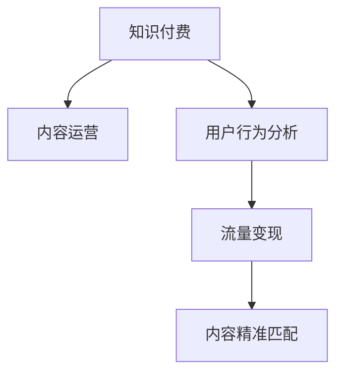

                 

# 知识付费创业中的内容价值最大化

> 关键词：知识付费,内容运营,用户行为,流量变现,内容精准匹配

## 1. 背景介绍

### 1.1 问题由来

随着知识付费的兴起，内容创业成为近年来互联网产业的热点。不同于传统在线教育平台，知识付费强调高质量内容的生产与运营，提供更加细分、垂直的知识产品。然而，随着市场竞争的加剧，内容同质化现象严重，用户如何精准匹配到适合自己的内容，成为制约知识付费平台增长的瓶颈问题。

### 1.2 问题核心关键点

实现内容与用户的精准匹配，是知识付费创业的关键。这一问题的本质在于如何高效获取用户需求，同时将内容推送给最合适的用户，从而提升用户粘性和留存率，实现流量变现。其核心关键点包括：

1. **用户需求获取**：通过有效的数据收集和分析，获取用户对不同知识类别的偏好和需求。
2. **内容推荐算法**：设计精准的内容推荐算法，根据用户的历史行为和兴趣标签，推荐合适的课程和内容。
3. **流量变现策略**：探索多样的流量变现模式，如课程销售、付费专栏、会员服务等，最大化内容商业价值。

## 2. 核心概念与联系

### 2.1 核心概念概述

为更好地理解如何在知识付费创业中最大化内容价值，本节将介绍几个密切相关的核心概念：

- **知识付费**：基于知识内容提供者与消费者之间建立的服务关系，用户支付一定的费用来获取特定内容或服务。
- **内容运营**：通过精心设计内容的选题、制作和传播，实现用户需求与内容的精准匹配，提升用户粘性和留存率。
- **用户行为分析**：通过对用户行为的追踪和分析，了解用户需求和兴趣，指导内容策略和运营决策。
- **流量变现**：将平台积累的用户流量通过广告、课程销售、会员服务等方式进行商业化，实现业务的盈利目标。
- **内容精准匹配**：通过算法和模型，将内容推送给最合适的用户，提升用户体验和平台价值。

这些核心概念之间的逻辑关系可以通过以下Mermaid流程图来展示：



这个流程图展示的知识付费创业的核心概念及其之间的关系：

1. 知识付费基于高质量内容的生产与运营，通过内容匹配满足用户需求。
2. 内容运营通过设计多样化的内容形式和传播渠道，吸引并留住用户。
3. 用户行为分析帮助理解用户需求和兴趣，优化内容匹配策略。
4. 流量变现通过多样化的商业化手段，实现平台的盈利目标。
5. 内容精准匹配是知识付费平台的核心竞争力，通过算法和模型将内容推送给最合适的用户。

这些概念共同构成了知识付费创业的完整框架，使得平台能够在激烈的市场竞争中脱颖而出，实现业务的长期稳定发展。

## 3. 核心算法原理 & 具体操作步骤

### 3.1 算法原理概述

知识付费创业中的内容价值最大化，依赖于精准的用户需求获取和内容推荐。这一过程通过算法和模型实现，其核心在于以下几个步骤：

1. **用户需求收集**：通过问卷调查、用户行为追踪等方式，收集用户对不同知识类别的兴趣和需求。
2. **内容特征提取**：利用自然语言处理等技术，对课程和文章等内容的文本特征进行提取，构建内容的表示向量。
3. **用户兴趣建模**：通过机器学习算法，将用户的历史行为和兴趣标签映射为向量表示，用于后续匹配。
4. **相似度计算**：计算内容向量与用户向量之间的相似度，推荐最相关的课程和文章。
5. **流量变现优化**：设计多样化的变现策略，提升平台流量变现效率和用户满意度。

### 3.2 算法步骤详解

知识付费平台的内容价值最大化，主要通过以下几个算法步骤实现：

**Step 1: 用户需求收集与建模**

用户需求收集和建模是内容推荐的第一步，主要步骤如下：

1. **问卷调查**：通过在线问卷收集用户对不同知识领域的兴趣和需求，如编程、心理学、营销等。
2. **行为追踪**：通过用户在页面的浏览、收藏、点击等行为，追踪用户的兴趣变化。
3. **兴趣标签提取**：通过文本挖掘技术，从用户的浏览历史中提取关键词和标签，如"数据分析"、"Python编程"等。
4. **向量表示**：利用TF-IDF、Word2Vec等技术，将用户兴趣标签转换为向量表示。

**Step 2: 内容特征提取**

内容特征提取是构建内容表示向量的关键步骤，主要步骤如下：

1. **文本分词**：将课程和文章等内容的文本进行分词处理，提取关键词和短语。
2. **向量化**：利用词袋模型或Word2Vec等技术，将分词结果转换为向量表示，用于后续计算。
3. **特征工程**：通过特征选择和组合，构建更加紧凑和有效的向量表示。

**Step 3: 用户兴趣建模与相似度计算**

用户兴趣建模与相似度计算是内容推荐的核心算法，主要步骤如下：

1. **用户兴趣表示**：将用户兴趣标签转换为向量表示，通常使用余弦相似度计算。
2. **内容特征向量**：对课程和文章进行向量化处理，得到内容的特征向量。
3. **相似度计算**：利用余弦相似度、欧式距离等方法，计算用户向量与内容向量的相似度。
4. **推荐排序**：根据相似度排序，推荐最相关的课程和文章。

**Step 4: 流量变现优化**

流量变现优化是知识付费平台的重要环节，主要步骤如下：

1. **定价策略**：根据课程难度和用户兴趣，设计灵活的课程定价策略，如基础课免费、进阶课收费。
2. **促销活动**：通过限时折扣、团购等促销活动，提升课程销售效率。
3. **会员服务**：设计高价值会员服务，如专享课程、VIP群交流等，提升用户粘性和付费意愿。
4. **广告变现**：将平台流量通过广告变现，如展示广告、搜索广告等，实现平台盈利。

### 3.3 算法优缺点

知识付费平台的内容价值最大化算法，具有以下优点：

1. **高效精准匹配**：通过用户行为分析和相似度计算，实现内容的精准匹配，提升用户满意度。
2. **多样化变现**：设计多种变现策略，提升平台的流量变现效率和盈利能力。
3. **用户粘性提升**：通过高质量的内容推荐和会员服务，提升用户粘性和留存率。

同时，该算法也存在一定的局限性：

1. **用户隐私保护**：用户行为数据的收集和使用涉及隐私保护问题，需要严格遵守相关法律法规。
2. **数据质量要求高**：用户行为数据的质量和完整性直接影响推荐的准确性，数据清洗和处理成本较高。
3. **模型复杂度高**：内容推荐算法涉及复杂的数学模型和算法实现，开发和维护成本较高。
4. **动态变化挑战**：用户兴趣和行为会随时间变化，算法需要不断调整优化，以保持推荐效果。

尽管存在这些局限性，但就目前而言，通过内容推荐实现用户与内容的精准匹配，仍然是大规模知识付费平台的主要手段。未来相关研究的重点在于如何进一步优化推荐算法，降低推荐成本，提升推荐效率和效果。

### 3.4 算法应用领域

知识付费平台的内容价值最大化算法，已经在多个领域得到了广泛的应用，例如：

- **在线教育**：通过内容推荐算法，将课程推送给最合适的用户，提升学习效果和满意度。
- **专业培训**：为专业人士提供定制化课程推荐，提升培训效果和职业发展。
- **心理咨询**：根据用户心理需求，推荐合适的心理咨询课程和文章，提供心理支持。
- **财务管理**：为财务管理爱好者提供理财课程推荐，提升财务管理技能。
- **职场发展**：提供职业规划和发展课程推荐，帮助用户提升职场竞争力。

除了上述这些经典应用外，知识付费平台的内容价值最大化算法，还广泛用于各类垂直领域的知识服务，为各行各业的专业人士提供精准的内容推荐服务。

## 4. 数学模型和公式 & 详细讲解 & 举例说明

### 4.1 数学模型构建

知识付费平台的内容推荐算法，通常基于协同过滤和深度学习等技术，其数学模型可以抽象为如下形式：

设用户集合为 $U=\{u_1,u_2,\dots,u_M\}$，内容集合为 $I=\{i_1,i_2,\dots,i_N\}$。用户对内容的评分矩阵为 $R \in \mathbb{R}^{M\times N}$，其中 $R_{u,i}$ 表示用户 $u$ 对内容 $i$ 的评分。

设用户兴趣向量为 $\mathbf{u} \in \mathbb{R}^D$，内容特征向量为 $\mathbf{v} \in \mathbb{R}^D$。其中 $D$ 为向量的维度。用户与内容的相似度为 $\mathbf{u}^T\mathbf{v}$。

用户对内容的评分可以表示为：

$$
R_{u,i} = f(\mathbf{u}^T\mathbf{v},R_{u,i})
$$

其中 $f$ 为评分函数，通常使用线性模型或深度学习模型。

### 4.2 公式推导过程

以线性模型为例，用户对内容的评分的公式可以表示为：

$$
R_{u,i} = \mathbf{u}^T\mathbf{v} + b
$$

其中 $b$ 为评分偏差，用于补偿用户和内容的固定效应。

用户与内容的相似度可以表示为：

$$
\text{similarity}_{u,i} = \mathbf{u}^T\mathbf{v}
$$

根据评分矩阵 $R$ 和相似度 $\text{similarity}_{u,i}$，可以计算用户对内容的预测评分：

$$
\hat{R}_{u,i} = \sum_{i'\in I} R_{u,i'}\text{similarity}_{u,i'}
$$

其中 $\hat{R}_{u,i}$ 为用户 $u$ 对内容 $i$ 的预测评分。

通过排序用户对内容的预测评分，可以推荐最相关的课程和文章。

### 4.3 案例分析与讲解

假设我们有一个知识付费平台，收集了用户对编程、心理学、营销等课程的评分数据。设 $U=\{1,2,3\}$ 为三个用户，$I=\{1,2,3,4,5\}$ 为五个课程。用户对内容的评分矩阵为：

$$
R = \begin{bmatrix}
5 & 3 & 0 & 4 & 0\\
0 & 2 & 5 & 0 & 3\\
3 & 0 & 4 & 0 & 2
\end{bmatrix}
$$

设用户 $u=1$ 的兴趣向量为 $\mathbf{u}=(0.1,0.3,0.5)$，内容 $i=4$ 的特征向量为 $\mathbf{v}=(0.2,0.4,0.1,0.1,0.2)$。

根据上述公式，可以计算用户 $u=1$ 对内容 $i=4$ 的预测评分：

$$
\hat{R}_{1,4} = (0.1+0.3+0.5)(0.2+0.4+0.1+0.1+0.2) + b = 1.9 \times 1 + b
$$

假设 $b=0$，则用户 $u=1$ 对内容 $i=4$ 的预测评分为 $1.9$。

根据预测评分排序，推荐最相关的课程和文章。

## 5. 项目实践：代码实例和详细解释说明

### 5.1 开发环境搭建

在进行内容推荐项目开发前，我们需要准备好开发环境。以下是使用Python进行TensorFlow开发的Python环境配置流程：

1. 安装Anaconda：从官网下载并安装Anaconda，用于创建独立的Python环境。

2. 创建并激活虚拟环境：
```bash
conda create -n tf-env python=3.8 
conda activate tf-env
```

3. 安装TensorFlow：根据CUDA版本，从官网获取对应的安装命令。例如：
```bash
conda install tensorflow -c tensorflow
```

4. 安装必要的工具包：
```bash
pip install pandas numpy scikit-learn tensorflow-hub
```

完成上述步骤后，即可在`tf-env`环境中开始项目实践。

### 5.2 源代码详细实现

下面以知识付费平台的内容推荐系统为例，给出使用TensorFlow进行内容推荐的项目代码实现。

首先，定义数据处理函数：

```python
import tensorflow as tf
import pandas as pd

def read_data(path):
    df = pd.read_csv(path)
    return df

def preprocess_data(df):
    # 数据清洗和预处理
    # 返回处理后的DataFrame
    pass

def build_dataset(data, batch_size):
    # 构建训练集和验证集
    # 返回DataLoader
    pass

# 加载数据和预处理
data = read_data('data.csv')
data = preprocess_data(data)

# 构建数据集
train_data, val_data = build_dataset(data, batch_size=32)
```

然后，定义模型和优化器：

```python
from tensorflow.keras import layers, models

# 定义模型结构
model = models.Sequential([
    layers.Dense(64, activation='relu', input_shape=(D,)),
    layers.Dense(64, activation='relu'),
    layers.Dense(N, activation='sigmoid')
])

# 定义损失函数和优化器
loss_fn = tf.keras.losses.BinaryCrossentropy()
optimizer = tf.keras.optimizers.Adam()

# 编译模型
model.compile(optimizer=optimizer, loss=loss_fn, metrics=['accuracy'])
```

接着，定义训练和评估函数：

```python
def train_epoch(model, dataset, batch_size, optimizer):
    for batch in dataset:
        X, y = batch
        with tf.GradientTape() as tape:
            loss = model.loss(y_true=y, y_pred=tf.squeeze(y_pred=model(X)))
        gradients = tape.gradient(loss, model.trainable_variables)
        optimizer.apply_gradients(zip(gradients, model.trainable_variables))

def evaluate(model, dataset, batch_size):
    loss, accuracy = model.evaluate(dataset)
    print(f'Loss: {loss}, Accuracy: {accuracy}')
```

最后，启动训练流程并在验证集上评估：

```python
epochs = 10
batch_size = 32

for epoch in range(epochs):
    train_epoch(model, train_data, batch_size, optimizer)
    evaluate(model, val_data, batch_size)
```

以上就是使用TensorFlow进行内容推荐的项目代码实现。可以看到，借助TensorFlow的高效计算图和丰富的模型库，内容推荐系统的开发变得简洁高效。

### 5.3 代码解读与分析

让我们再详细解读一下关键代码的实现细节：

**read_data函数**：
- 从指定路径加载CSV格式的数据集。
- 返回处理后的DataFrame对象。

**preprocess_data函数**：
- 对数据集进行清洗和预处理，如处理缺失值、归一化等。
- 返回处理后的DataFrame对象。

**build_dataset函数**：
- 将数据集划分为训练集和验证集，进行分批次加载。
- 返回PyTorch的DataLoader对象。

**模型定义**：
- 使用Sequential模型构建三层神经网络结构。
- 最后一层为输出层，使用sigmoid激活函数，用于二分类问题。

**优化器和损失函数**：
- 使用Adam优化器，学习率为0.001。
- 使用二分类交叉熵损失函数。

**训练和评估函数**：
- 使用梯度下降优化器，更新模型参数。
- 在每个epoch结束后，在验证集上评估模型性能。

**训练流程**：
- 定义总的epoch数和batch size，开始循环迭代
- 每个epoch内，在训练集上训练模型，并在验证集上评估
- 重复上述过程直至满足预设的迭代轮数

可以看到，TensorFlow提供的高级API和模型库，使得内容推荐系统的开发变得非常直观和易于上手。通过合理的模型设计和参数调优，可以进一步提升推荐的准确性和效率。

## 6. 实际应用场景

### 6.1 智能推荐系统

智能推荐系统是知识付费平台的核心应用场景。通过内容推荐算法，平台能够根据用户的历史行为和兴趣，推荐最相关的课程和文章，提升用户粘性和留存率，实现流量变现。

在技术实现上，可以收集用户浏览、收藏、点击等行为数据，提取用户兴趣标签和行为特征，构建用户和内容的向量表示。使用协同过滤和深度学习等方法，计算用户与内容的相似度，推荐最相关的课程和文章。

### 6.2 个性化服务

知识付费平台可以提供个性化的课程推荐服务，根据用户的学习进度和反馈，动态调整推荐策略。通过用户行为分析，理解用户的学习需求和偏好，提供定制化的学习路径和课程推荐，提升用户的学习效果和满意度。

例如，可以收集用户在课程上的学习时间、测试成绩和反馈评价，计算用户对不同课程的兴趣强度。根据兴趣强度和课程质量，动态调整推荐列表，优化用户体验。

### 6.3 内容营销

知识付费平台可以借助内容推荐算法进行内容营销，通过精准的课程推荐，提升课程曝光率和点击率。通过分析用户行为和兴趣标签，确定热门课程和话题，设计相关的营销活动和广告投放，吸引更多的潜在用户。

例如，可以根据用户对编程、心理学等领域的兴趣，推荐相关领域的热门课程和文章。通过内容推荐算法，将用户引导到平台的高价值课程和内容，提升平台的用户量和商业价值。

## 7. 工具和资源推荐

### 7.1 学习资源推荐

为了帮助开发者系统掌握知识付费平台的内容推荐技术，这里推荐一些优质的学习资源：

1. **《推荐系统》书籍**：陈俊林著，系统讲解了推荐系统的基本原理、算法和应用。
2. **《深度学习》书籍**：Ian Goodfellow著，深入浅出地介绍了深度学习的核心思想和经典模型。
3. **Coursera推荐系统课程**：由斯坦福大学开设的推荐系统课程，涵盖推荐系统原理、算法和实战。
4. **Google TensorFlow官网**：提供丰富的TensorFlow文档和样例代码，是学习TensorFlow的重要资源。
5. **Kaggle竞赛**：通过参与推荐系统相关的Kaggle竞赛，可以学习业界推荐算法和技术。

通过对这些资源的学习实践，相信你一定能够快速掌握知识付费平台的内容推荐技术，并用于解决实际的推荐问题。

### 7.2 开发工具推荐

高效的开发离不开优秀的工具支持。以下是几款用于知识付费平台推荐系统开发的常用工具：

1. **TensorFlow**：由Google主导开发的开源深度学习框架，生产部署方便，适合大规模工程应用。
2. **PyTorch**：由Facebook主导开发的深度学习框架，灵活的计算图设计，适合快速迭代研究。
3. **TensorFlow Hub**：提供预训练模型和模型库，方便快速部署和微调推荐模型。
4. **FastAPI**：基于PyTorch和FastAPI构建的推荐系统后端服务，适合API接口开发和部署。
5. **Flask**：轻量级的Web框架，适合构建推荐系统的Web应用。
6. **Jupyter Notebook**：在线的Jupyter Notebook环境，方便进行数据处理和模型实验。

合理利用这些工具，可以显著提升知识付费平台推荐系统的开发效率，加快创新迭代的步伐。

### 7.3 相关论文推荐

知识付费平台的内容推荐技术，源于学界的持续研究。以下是几篇奠基性的相关论文，推荐阅读：

1. **“The Bellman-Ford Algorithm for Recommender Systems”**：提出了基于协同过滤的推荐算法，经典之作。
2. **“Factorization Machines for Ad Click Prediction”**：提出了因子分解机的推荐算法，用于广告点击预测。
3. **“Deep Personalized Playlists via Matrix Factorization”**：使用深度学习模型进行音乐推荐，取得了SOTA效果。
4. **“Neural Collaborative Filtering”**：使用神经网络进行推荐，提升了推荐精度。
5. **“Knowledge-Graph-Based Recommender Systems”**：利用知识图谱进行推荐，提升了推荐效果和用户满意度。

这些论文代表了大规模知识付费平台推荐技术的发展脉络。通过学习这些前沿成果，可以帮助研究者把握学科前进方向，激发更多的创新灵感。

## 8. 总结：未来发展趋势与挑战

### 8.1 总结

本文对知识付费创业中的内容价值最大化进行了全面系统的介绍。首先阐述了知识付费平台的核心需求和内容推荐的重要性，明确了内容推荐在用户需求获取和流量变现中的关键作用。其次，从原理到实践，详细讲解了内容推荐算法的数学模型和关键步骤，给出了推荐系统的完整代码实现。同时，本文还广泛探讨了内容推荐在推荐系统、个性化服务、内容营销等多个领域的应用前景，展示了推荐范式的广泛应用。

通过本文的系统梳理，可以看到，通过内容推荐实现用户与内容的精准匹配，是知识付费创业的核心手段。基于协同过滤和深度学习的推荐算法，已经在多个场景中得到了成功应用，为知识付费平台带来了显著的业务价值。未来，伴随算法的不断优化和技术的持续演进，推荐系统将在知识付费领域发挥更大的作用，驱动行业向更高的高度迈进。

### 8.2 未来发展趋势

展望未来，知识付费平台的内容推荐技术将呈现以下几个发展趋势：

1. **个性化程度提升**：随着用户行为数据的积累，推荐算法将进一步提升个性化程度，提供更加精准的推荐结果。
2. **跨模态推荐**：结合文本、图像、音频等多模态数据，实现更加全面和多样化的推荐。
3. **实时推荐**：通过流式计算和实时数据处理，实现实时推荐，提升用户满意度和留存率。
4. **多场景融合**：将推荐算法与搜索引擎、个性化服务等多个场景进行深度融合，构建完整的推荐生态。
5. **商业化变现**：设计多样化的商业化变现模式，实现推荐系统的盈利目标。

以上趋势凸显了知识付费平台推荐技术的广阔前景。这些方向的探索发展，必将进一步提升推荐系统的性能和应用范围，为知识付费平台带来更大的商业价值。

### 8.3 面临的挑战

尽管知识付费平台的内容推荐技术已经取得了显著成就，但在迈向更加智能化、普适化应用的过程中，仍面临诸多挑战：

1. **数据隐私问题**：用户行为数据的收集和使用涉及隐私保护，需要严格遵守相关法律法规。
2. **数据质量和多样性**：推荐算法的性能依赖于数据的质量和多样性，数据收集和处理成本较高。
3. **模型复杂度和计算成本**：深度学习推荐模型涉及复杂的计算，需要高算力和高存储资源支持。
4. **冷启动问题**：新用户的推荐策略需要设计更加灵活，以尽快为用户提供满意的推荐。
5. **动态变化挑战**：用户兴趣和行为会随时间变化，算法需要不断调整优化，以保持推荐效果。

尽管存在这些挑战，但通过技术创新和数据驱动的持续优化，推荐系统将在知识付费领域发挥更大的作用，驱动行业向更高的高度迈进。相信随着学界和产业界的共同努力，这些挑战终将一一被克服，推荐系统必将在知识付费平台中发挥更大的作用，为知识付费平台带来更大的商业价值。

### 8.4 研究展望

面向未来，知识付费平台的内容推荐技术需要在以下几个方面寻求新的突破：

1. **无监督推荐算法**：探索无监督推荐算法，摆脱对大量标注数据的依赖，提升推荐系统的灵活性和可扩展性。
2. **跨领域推荐**：将推荐算法与多领域数据进行融合，提升推荐系统的普适性和跨领域迁移能力。
3. **强化学习推荐**：引入强化学习算法，提升推荐系统的动态调整能力，实现更加个性化的推荐。
4. **多目标优化**：结合用户满意度、平台收益等多个目标，设计多目标优化推荐算法，实现业务目标的平衡。
5. **实时流式推荐**：利用流式计算技术，实现实时推荐，提升用户满意度和留存率。
6. **跨模态推荐**：结合文本、图像、音频等多模态数据，实现更加全面和多样化的推荐。

这些研究方向的探索，必将引领知识付费平台推荐技术的不断进步，为知识付费平台带来更大的商业价值和社会效益。面向未来，知识付费平台需要不断创新和优化，实现技术与业务的双重提升，共同推动知识付费领域的健康发展。

## 9. 附录：常见问题与解答

**Q1：知识付费平台的内容推荐算法是否适用于其他领域？**

A: 知识付费平台的内容推荐算法具有广泛适用性，可以在其他领域进行应用和优化。例如，电商平台可以推荐用户感兴趣的商品，社交平台可以推荐用户感兴趣的朋友和内容，新闻平台可以推荐用户感兴趣的新闻等。

**Q2：如何设计推荐系统的商业化策略？**

A: 推荐系统的商业化策略需要结合平台的特点和用户需求，设计多样化的变现模式。例如，可以设计付费订阅模式、广告变现模式、电商变现模式等多种方式，实现推荐系统的盈利目标。

**Q3：推荐算法在推荐过程中如何处理冷启动问题？**

A: 冷启动问题可以通过多策略结合的方式进行解决，例如：
1. 使用协同过滤算法，根据用户历史行为进行推荐。
2. 使用内容推荐算法，根据内容的热度和质量进行推荐。
3. 引入专家推荐系统，通过人工干预进行推荐。

通过这些策略的结合，可以解决新用户的推荐问题，提升推荐系统的效果和用户体验。

**Q4：推荐系统如何处理数据隐私问题？**

A: 数据隐私问题是推荐系统的重要挑战。解决这一问题的方法包括：
1. 匿名化处理：对用户行为数据进行匿名化处理，保护用户隐私。
2. 数据加密：使用数据加密技术，保护数据传输和存储的安全。
3. 法律法规遵循：严格遵守相关法律法规，保护用户数据隐私。

这些措施可以有效保护用户数据隐私，同时提升推荐系统的可信度和用户满意度。

通过本文的系统梳理，可以看到，通过内容推荐实现用户与内容的精准匹配，是知识付费创业的核心手段。基于协同过滤和深度学习的推荐算法，已经在多个场景中得到了成功应用，为知识付费平台带来了显著的业务价值。未来，伴随算法的不断优化和技术的持续演进，推荐系统将在知识付费领域发挥更大的作用，驱动行业向更高的高度迈进。相信随着学界和产业界的共同努力，这些挑战终将一一被克服，推荐系统必将在知识付费平台中发挥更大的作用，为知识付费平台带来更大的商业价值。

