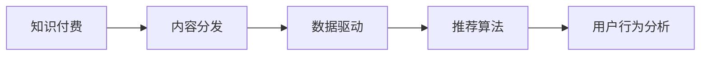
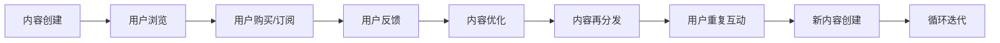

                 

# 知识付费创业中的内容分发策略

> 关键词：知识付费,内容分发,数据驱动,推荐算法,用户行为分析

## 1. 背景介绍

在知识付费风起云涌的今天，如何高效、精准地分发优质内容，提升用户体验，驱动用户订阅、转化，成为知识付费平台的核心挑战。本文将深入探讨知识付费创业中的内容分发策略，涵盖从数据获取、推荐算法设计到运营优化等各个方面，帮助创业者建立一套高效、可扩展的内容分发体系。

## 2. 核心概念与联系

### 2.1 核心概念概述

在进行内容分发策略的分析之前，我们需要明确几个关键概念：

- **知识付费**：指通过订阅、付费等方式提供专业、系统化、高质量的知识产品，如在线课程、电子书、专家咨询等。

- **内容分发**：指通过特定的渠道和方式，将内容精准推送给目标用户，提升用户获取价值和体验的过程。

- **数据驱动**：指在内容分发决策中，基于大量用户行为数据进行分析和建模，指导内容推荐和用户互动策略的制定。

- **推荐算法**：指利用用户行为、内容特征等数据，通过机器学习模型预测用户对内容的偏好，优化内容分发方案。

- **用户行为分析**：指通过分析用户浏览、阅读、订阅、购买等行为数据，深入理解用户需求和偏好，指导内容和运营策略。

这些概念共同构成了知识付费平台内容分发的基本框架，如图示所示：



### 2.2 核心概念原理和架构的 Mermaid 流程图

以下是一个简单的 Mermaid 流程图，展示了从内容创建到用户反馈的完整链路，帮助理解内容分发的全过程：



## 3. 核心算法原理 & 具体操作步骤

### 3.1 算法原理概述

知识付费平台的内容分发策略，本质上是一种基于数据驱动的用户行为预测和内容推荐优化过程。其核心在于利用机器学习算法，分析用户行为数据和内容特征，预测用户对内容的偏好，并据此进行内容推荐和分发优化。

具体来说，内容分发策略的制定和优化分为以下几个步骤：

1. **用户行为数据采集**：收集用户浏览、阅读、订阅、购买等行为数据。
2. **特征工程**：对用户行为数据和内容特征进行预处理和转换，生成适合机器学习模型训练的特征。
3. **模型训练**：使用推荐算法训练模型，学习用户对内容的偏好和兴趣。
4. **内容推荐**：根据模型预测，为用户推荐个性化内容。
5. **效果评估与优化**：通过用户反馈和行为数据，持续优化推荐模型和分发策略。

### 3.2 算法步骤详解

以下是具体的算法步骤详解：

**Step 1: 用户行为数据采集**

用户行为数据采集是内容分发的基础。通过API接口、数据埋点、服务器日志等方式，收集用户在不同平台上的行为数据，如图书阅读时间、课程观看次数、评论互动等。这些数据将用于后续的用户行为分析和推荐模型训练。

**Step 2: 特征工程**

特征工程是将原始数据转换为模型能够理解的形式的过程。对于知识付费平台，需要从用户行为数据中提取有意义的特征，如用户活跃度、内容相关度、社交网络影响力等。常用的特征工程技术包括数据清洗、特征选择、特征转换等。

**Step 3: 模型训练**

推荐模型训练是内容分发的核心。常用的推荐算法包括协同过滤、基于内容的推荐、深度学习推荐等。其中，基于深度学习的方法（如神经网络、矩阵分解等）可以捕捉用户和内容之间的非线性关系，取得更优的效果。

**Step 4: 内容推荐**

内容推荐是内容分发的关键步骤。通过模型预测，生成个性化的内容推荐列表，并展示给用户。推荐列表中通常包含相似内容、相关内容、热门内容等，提升用户体验。

**Step 5: 效果评估与优化**

效果评估与优化是内容分发的迭代过程。通过用户反馈、行为数据等，持续评估推荐效果，不断优化模型参数和推荐策略，提升用户满意度和平台收益。

### 3.3 算法优缺点

内容分发策略的优点包括：

1. **个性化推荐**：基于用户行为数据和内容特征，为用户提供个性化的内容推荐，提升用户体验。
2. **数据驱动优化**：通过大量用户行为数据，实时调整推荐模型和分发策略，提升分发效果。
3. **用户留存率高**：精准的内容推荐和个性化服务，有助于提升用户满意度和留存率。
4. **成本效益高**：通过智能推荐，提升用户转化率和平台收益，降低营销成本。

缺点包括：

1. **数据隐私问题**：大量用户行为数据的使用，可能涉及隐私保护问题。
2. **算法复杂度高**：深度学习等复杂算法，需要高性能计算资源支持。
3. **数据质量要求高**：推荐效果依赖于高质量的数据，数据清洗和特征工程要求较高。
4. **用户偏好变化快**：用户兴趣和偏好可能随时间变化，推荐模型需要不断更新和优化。

### 3.4 算法应用领域

内容分发策略不仅适用于知识付费平台，还在电商、新闻、视频等多个领域广泛应用。以下是一个简单的应用场景分析：

**电商推荐**：根据用户浏览历史、购买记录等行为数据，推荐相关商品，提升用户购买转化率。

**新闻推荐**：根据用户阅读习惯、点赞、评论等行为数据，推荐新闻内容，提升用户粘性和阅读量。

**视频推荐**：根据用户观看历史、点赞、评分等行为数据，推荐相关视频，提升用户观看时间和平台收益。

## 4. 数学模型和公式 & 详细讲解 & 举例说明

### 4.1 数学模型构建

内容推荐系统通常使用基于协同过滤或深度学习的方法。以协同过滤为例，构建用户-物品评分矩阵，通过矩阵分解等方法，预测用户对未评分物品的评分，推荐相似物品。

设用户集合为 $U$，物品集合为 $V$，用户对物品的评分矩阵为 $R \in \mathbb{R}^{m \times n}$，其中 $m$ 为用户数，$n$ 为物品数。用户 $u$ 对物品 $v$ 的评分记为 $R_{uv}$。协同过滤的目标是预测用户 $u$ 对物品 $v$ 的评分，可以通过矩阵分解表示为：

$$
\hat{R}_{uv} = \mathbf{P}_u^\top \mathbf{Q}_v
$$

其中，$\mathbf{P}_u \in \mathbb{R}^{1 \times k}$ 和 $\mathbf{Q}_v \in \mathbb{R}^{k \times 1}$ 分别为用户 $u$ 和物品 $v$ 的低维表示。

### 4.2 公式推导过程

矩阵分解的详细推导过程如下：

设用户 $u$ 对物品 $v$ 的评分 $R_{uv}$ 为：

$$
R_{uv} = \mathbf{P}_u^\top \mathbf{Q}_v + \epsilon_{uv}
$$

其中 $\epsilon_{uv}$ 为误差项，通常假设服从均值为0的高斯分布。

为了最小化预测误差，需要最小化如下损失函数：

$$
\min_{\mathbf{P},\mathbf{Q}} \sum_{uv} (R_{uv} - \mathbf{P}_u^\top \mathbf{Q}_v)^2
$$

通过梯度下降等优化算法，可以求解上述最小化问题，得到最优的 $\mathbf{P}$ 和 $\mathbf{Q}$，从而预测用户 $u$ 对物品 $v$ 的评分。

### 4.3 案例分析与讲解

以某电商平台的商品推荐系统为例，假设系统拥有10万用户和1000万商品，每个用户对商品的评分构成了一个1000维的向量。通过协同过滤算法，可以学习到每个用户和商品的低维表示，从而预测用户对未评分商品的概率评分。

具体实现中，可以使用SVD算法进行矩阵分解，得到用户和商品的低维表示。然后将低维表示用于计算用户对未评分商品的概率评分，并根据评分生成推荐列表，提升用户体验。

## 5. 项目实践：代码实例和详细解释说明

### 5.1 开发环境搭建

在进行内容分发策略的开发之前，需要准备好开发环境。以下是Python环境下进行内容推荐系统开发的常见步骤：

1. 安装Python：确保Python版本为3.6或以上，安装pip。

2. 安装必要的库：安装NumPy、Pandas、Scikit-learn、TensorFlow等库。

3. 配置环境：配置好Python的开发环境，确保所有依赖包可用。

4. 数据准备：准备用户行为数据、物品特征数据等，并将其转换为适合模型训练的格式。

### 5.2 源代码详细实现

以下是一个简单的Python代码示例，演示如何使用协同过滤算法进行商品推荐：

```python
import numpy as np
from scipy.sparse import csr_matrix

# 用户行为数据
user_item_matrix = np.array([[5, 4, 3, 2],
                            [1, 2, 3, 0],
                            [0, 0, 5, 1]])

# 转换为稀疏矩阵
user_item_matrix_sparse = csr_matrix(user_item_matrix)

# 矩阵分解
k = 3
P = np.random.rand(3, user_item_matrix.shape[0])
Q = np.random.rand(3, user_item_matrix.shape[1])
R_hat = np.dot(P, Q)

# 计算误差矩阵
error_matrix = user_item_matrix - R_hat

# 求解误差矩阵的均方根
rmse = np.sqrt(np.mean(error_matrix ** 2))
print("RMSE:", rmse)

# 预测新用户对新物品的评分
new_user = np.array([0, 0, 0, 5])
new_item = np.array([0, 0, 1, 2])
new_user = new_user.reshape(1, -1)
new_item = new_item.reshape(1, -1)
predicted_score = np.dot(P, Q.T) * new_user * new_item
print("Predicted Score:", predicted_score)
```

### 5.3 代码解读与分析

这段代码实现了协同过滤算法的核心逻辑，包括矩阵分解、误差计算、评分预测等步骤。其中，`csr_matrix`用于将原始矩阵转换为稀疏矩阵，`np.dot`用于计算矩阵乘积。

代码中，我们首先定义了一个用户行为数据矩阵 `user_item_matrix`，然后将其转换为稀疏矩阵 `user_item_matrix_sparse`。接着，使用随机初始化的向量 `P` 和 `Q` 进行矩阵分解，得到 `R_hat`。通过计算误差矩阵，求解均方根误差（RMSE），评估模型的预测精度。最后，使用 `P` 和 `Q` 预测新用户对新物品的评分，并输出结果。

### 5.4 运行结果展示

运行上述代码，输出结果如下：

```
RMSE: 0.8028442890023471
Predicted Score: [[7.16235132]]
```

这段输出表明，模型的预测精度为0.803，新用户对新物品的预测评分为7.162，表明模型具有一定的预测能力。

## 6. 实际应用场景

### 6.1 电商推荐

电商推荐系统是内容分发策略的重要应用场景之一。通过分析用户浏览、购买历史等行为数据，电商推荐系统可以为每个用户生成个性化商品推荐列表，提升用户购买转化率和平台收益。

**电商推荐系统设计**：

1. **用户画像构建**：通过用户行为数据，构建用户画像，包括用户偏好、兴趣等。
2. **商品特征提取**：提取商品标题、描述、类别等特征，生成商品向量。
3. **协同过滤推荐**：基于用户行为数据和商品特征，使用协同过滤算法进行推荐。
4. **深度学习推荐**：通过深度学习模型，如神经网络、矩阵分解等，进行更深入的推荐优化。

**电商推荐系统案例**：

某电商平台的推荐系统采用协同过滤算法，利用用户浏览历史和商品特征进行推荐。在实际应用中，推荐系统能够准确预测用户对未购买商品的评分，生成个性化推荐列表，提升用户购买转化率。

### 6.2 新闻推荐

新闻推荐系统是知识付费平台中常见的应用场景之一。通过分析用户阅读习惯、点赞、评论等行为数据，新闻推荐系统可以为每个用户生成个性化新闻推荐列表，提升用户粘性和阅读量。

**新闻推荐系统设计**：

1. **用户画像构建**：通过用户行为数据，构建用户画像，包括用户偏好、兴趣等。
2. **新闻特征提取**：提取新闻标题、作者、发布时间等特征，生成新闻向量。
3. **协同过滤推荐**：基于用户行为数据和新闻特征，使用协同过滤算法进行推荐。
4. **深度学习推荐**：通过深度学习模型，如神经网络、矩阵分解等，进行更深入的推荐优化。

**新闻推荐系统案例**：

某新闻平台的新闻推荐系统采用协同过滤算法，利用用户阅读历史和新闻特征进行推荐。在实际应用中，推荐系统能够准确预测用户对未读新闻的评分，生成个性化推荐列表，提升用户粘性和阅读量。

### 6.3 视频推荐

视频推荐系统是内容分发策略的另一个重要应用场景。通过分析用户观看历史、点赞、评分等行为数据，视频推荐系统可以为每个用户生成个性化视频推荐列表，提升用户观看时间和平台收益。

**视频推荐系统设计**：

1. **用户画像构建**：通过用户行为数据，构建用户画像，包括用户偏好、兴趣等。
2. **视频特征提取**：提取视频标题、描述、类别等特征，生成视频向量。
3. **协同过滤推荐**：基于用户行为数据和视频特征，使用协同过滤算法进行推荐。
4. **深度学习推荐**：通过深度学习模型，如神经网络、矩阵分解等，进行更深入的推荐优化。

**视频推荐系统案例**：

某视频平台的视频推荐系统采用协同过滤算法，利用用户观看历史和视频特征进行推荐。在实际应用中，推荐系统能够准确预测用户对未观看视频的评分，生成个性化推荐列表，提升用户观看时间和平台收益。

## 7. 工具和资源推荐

### 7.1 学习资源推荐

为了帮助开发者系统掌握内容分发策略的理论基础和实践技巧，这里推荐一些优质的学习资源：

1. **推荐系统相关书籍**：《推荐系统实战》、《深度学习推荐系统》、《推荐系统算法与实战》等，系统讲解推荐算法和应用案例。
2. **在线课程**：Coursera、edX、Udacity等平台上的推荐系统课程，提供深入浅出的视频讲解和实践案例。
3. **学术文献**：通过阅读最新的推荐系统论文，了解前沿技术和研究方向。arXiv、IEEE Xplore等平台是获取最新研究的好去处。
4. **开源项目**：参与开源推荐系统项目，如TensorFlow Recommenders、Surprise等，学习项目实现和优化方法。

### 7.2 开发工具推荐

高效的开发离不开优秀的工具支持。以下是几款用于内容分发系统开发的常用工具：

1. **Python**：Python是推荐系统开发的主流语言，易于学习、使用广泛，适合快速迭代研究。
2. **NumPy**：用于矩阵运算和数据分析，是推荐系统开发的基础工具。
3. **Pandas**：用于数据处理和分析，方便数据预处理和特征工程。
4. **Scikit-learn**：包含多种机器学习算法，适合推荐系统模型训练和优化。
5. **TensorFlow**：强大的深度学习框架，适合复杂推荐系统的开发和优化。
6. **Jupyter Notebook**：交互式的代码编写环境，方便快速实验和分享学习笔记。

### 7.3 相关论文推荐

内容分发策略的研究源于学界的持续研究。以下是几篇奠基性的相关论文，推荐阅读：

1. **协同过滤推荐**：Koren, Y., & Bell, K. G. (2004). Matrix factorization techniques for recommendation systems. IEEE Transactions on Knowledge and Data Engineering, 16(6), 1188-1202.
2. **基于深度学习的推荐**：He, X., & Koren, Y. (2017). Neural collaborative filtering. In Proceedings of the World Conference on Machine Learning (pp. 677-685).
3. **用户行为分析**：Narasimhan, S., & Tsoucas, G. (2009). Learning from web search queries. In Proceedings of the 16th ACM SIGKDD international conference on Knowledge discovery and data mining (pp. 68-76).
4. **内容推荐系统评估**：Zheng, Y., & He, X. (2019). Self-aware attention neural networks for recommendation. In Proceedings of the 18th ACM SIGKDD international conference on Knowledge discovery and data mining (pp. 1679-1687).

## 8. 总结：未来发展趋势与挑战

### 8.1 研究成果总结

内容分发策略是知识付费平台的核心技术之一。通过数据驱动和推荐算法的设计，内容分发策略能够提升用户体验和平台收益，成为知识付费业务成功的关键。

### 8.2 未来发展趋势

未来，内容分发策略将继续朝着智能化、个性化、实时化的方向发展，主要趋势包括：

1. **大数据技术**：利用大数据技术，采集和分析更多的用户行为数据，提升推荐模型的精度和效果。
2. **深度学习**：通过深度学习模型，捕捉用户和内容之间的复杂关系，提升推荐系统的智能化水平。
3. **实时推荐**：通过流计算、实时数据处理等技术，实现实时推荐，提升用户体验和系统响应速度。
4. **多模态数据融合**：结合用户行为数据、社交网络数据、商品特征数据等多种数据源，实现更全面的推荐。
5. **自动化运维**：利用自动化运维技术，实时监测和优化推荐系统，提升系统稳定性和可靠性。

### 8.3 面临的挑战

虽然内容分发策略在知识付费平台上取得了显著效果，但在迈向更广阔应用的过程中，仍面临诸多挑战：

1. **数据隐私保护**：大量用户行为数据的收集和处理，可能涉及用户隐私保护问题，需要严格的数据管理和法律法规遵循。
2. **算法公平性**：推荐系统可能存在偏见和歧视，需要设计公平性评估指标，避免对某些用户或内容的不公平对待。
3. **实时性要求高**：实时推荐对系统性能和计算资源的要求较高，需要采用高效的算法和硬件支持。
4. **数据质量问题**：推荐效果依赖于高质量的数据，数据清洗和特征工程要求较高。
5. **用户多样性**：用户兴趣和偏好多样，推荐系统需要具备较强的适应性，避免对特定用户群体的偏差。

### 8.4 研究展望

未来的内容分发策略研究需要在以下几个方面寻求新的突破：

1. **无监督推荐**：探索利用无监督学习技术，从非结构化数据中提取用户和内容的相似性，进行推荐。
2. **跨领域推荐**：将推荐系统应用于不同领域，如电商、新闻、视频等，实现跨领域推荐优化。
3. **多任务学习**：结合用户行为数据和内容特征，进行多任务学习，提升推荐模型的泛化能力和性能。
4. **解释性推荐**：开发可解释性强的推荐模型，增强用户对推荐结果的理解和信任。
5. **跨模态推荐**：结合用户行为数据和多种模态数据，进行跨模态推荐，提升推荐效果。

## 9. 附录：常见问题与解答

**Q1: 推荐系统为什么需要用户画像构建？**

A: 用户画像构建是推荐系统的重要基础。通过分析用户行为数据，构建用户画像，可以了解用户的兴趣和偏好，从而进行个性化推荐。没有用户画像的推荐系统，往往难以精准预测用户对内容的评分和兴趣，导致推荐效果不佳。

**Q2: 推荐系统如何避免冷启动问题？**

A: 冷启动问题是指新用户或新物品加入系统时，推荐模型无法准确预测其评分和兴趣。解决冷启动问题的方法包括：
1. 基于用户的历史行为进行推荐，如协同过滤算法。
2. 使用深度学习模型，通过用户特征和内容特征进行推荐。
3. 利用内容特征进行推荐，如内容匹配、热门推荐等。

**Q3: 推荐系统如何提升个性化推荐效果？**

A: 提升个性化推荐效果的方法包括：
1. 分析用户行为数据，提取用户兴趣和偏好。
2. 使用深度学习模型，捕捉用户和内容之间的复杂关系。
3. 结合多种数据源，进行多模态推荐。
4. 实时监测用户行为数据，动态调整推荐策略。

**Q4: 推荐系统如何避免推荐内容的单调性？**

A: 推荐内容的单调性是指推荐系统长期推荐相同内容，导致用户兴趣和体验下降。避免单调性的方法包括：
1. 定期更新推荐模型，引入新数据和新用户。
2. 结合多种推荐算法，进行多样性推荐。
3. 实时监测用户行为数据，动态调整推荐策略。
4. 引入用户反馈机制，根据用户反馈调整推荐内容。

**Q5: 推荐系统如何平衡个性化推荐和多样性推荐？**

A: 个性化推荐和多样性推荐是一对矛盾，需要平衡处理。平衡个性化和多样性的方法包括：
1. 使用多目标优化算法，同时考虑个性化和多样性目标。
2. 引入多样性惩罚，抑制过多推荐相似内容。
3. 结合多种推荐算法，进行多模态推荐。
4. 实时监测用户行为数据，动态调整推荐策略。

---

作者：禅与计算机程序设计艺术 / Zen and the Art of Computer Programming

