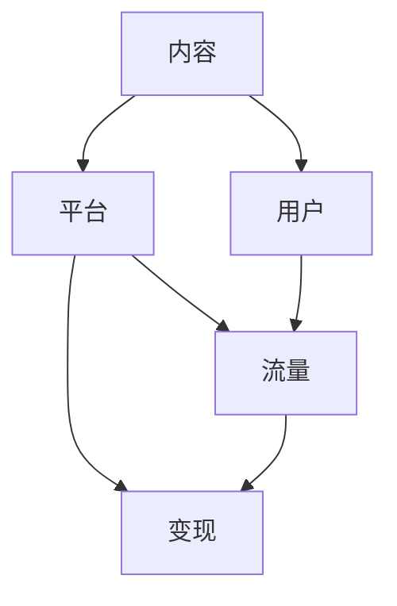

                 

# 知识付费创业中的内容复用策略

## 1. 背景介绍

在知识付费领域，内容复用是提高生产效率、降低成本、提升用户体验的关键策略。优秀的知识付费内容具有极高的价值，但在不同的场景下，内容的呈现形式、受众群体、平台渠道等差异巨大。如何高效地将优质内容复用到多个场景，最大化其商业价值，是每一个知识付费创业者必须面对的重要课题。

本文将围绕内容复用策略的核心概念和实现方法进行深入探讨，帮助创业者找到有效的内容复用路径，减少重复劳动，实现商业价值的最大化。

## 2. 核心概念与联系

### 2.1 核心概念概述

在知识付费创业中，涉及的核心概念主要包括内容、平台、用户、流量、变现等。这些概念通过内容复用策略相互连接，形成一个闭环。

- **内容**：指知识付费平台提供的所有付费知识产品，包括文章、音频、视频、课程等。
- **平台**：指提供内容展示和交互的互联网平台，如在线教育平台、订阅服务、知识付费APP等。
- **用户**：指通过付费方式获取知识内容的用户群体，具有不同的年龄、职业、兴趣、学习习惯等特点。
- **流量**：指平台获取的用户访问量，是平台变现的基础。
- **变现**：指平台通过各种方式实现商业变现，如广告、订阅、销售课程等。

这些概念之间的逻辑关系可以通过以下Mermaid流程图来展示：



### 2.2 核心概念原理和架构

在知识付费平台上，内容的呈现和分发是一个动态的过程。用户通过不同渠道访问内容，平台根据用户行为数据和个性化推荐算法，优化内容展示效果，增加用户粘性。最终，平台通过流量变现获得收益。

核心架构包括：
- **内容管理系统**：负责内容的生成、编辑、发布、管理等功能。
- **推荐算法系统**：根据用户行为数据，推荐最适合的内容，提升用户体验和平台流量。
- **流量变现系统**：通过广告、订阅、销售等手段，将流量转化为商业价值。

这些系统通过API接口和数据共享，相互协作，共同支撑平台的内容复用和变现。

## 3. 核心算法原理 & 具体操作步骤

### 3.1 算法原理概述

内容复用策略的核心在于利用知识付费平台已有的数据和资源，最大化内容的商业价值。其算法原理主要包括以下几个方面：

1. **内容标签化**：对内容进行标签分类，以便于不同的场景复用。
2. **推荐算法优化**：优化推荐算法，精准匹配用户需求，提升复用率。
3. **流量数据驱动**：利用用户行为数据，指导内容更新和调整，提升流量转化率。
4. **个性化推荐**：根据用户兴趣和行为数据，实现个性化推荐，增加用户粘性。

### 3.2 算法步骤详解

内容复用策略的实现步骤如下：

**Step 1: 内容标签化**

对所有内容进行标签分类，如教育、科技、职场、健康等。标签化的目的是为了将相似内容归为一类，方便在不同场景下进行复用。

**Step 2: 推荐算法优化**

根据用户行为数据，优化推荐算法，确保内容能够精准匹配用户需求。常见的优化方法包括：
- 增加用户画像特征，如年龄、职业、兴趣等。
- 引入协同过滤算法，通过相似用户的行为数据，推荐类似内容。
- 动态调整推荐策略，如根据用户浏览历史和点击率，调整内容排序。

**Step 3: 流量数据驱动**

利用用户行为数据，指导内容的更新和调整。常见的流量驱动策略包括：
- 分析用户访问数据，发现热点内容，进行专题策划。
- 根据流量数据，调整内容发布节奏，确保流量峰值期有足够内容供给。
- 利用流量数据，调整广告投放策略，增加流量和收入。

**Step 4: 个性化推荐**

根据用户兴趣和行为数据，实现个性化推荐。常见的个性化推荐策略包括：
- 引入深度学习算法，如TensorFlow、PyTorch等，实现精准推荐。
- 利用用户历史数据，生成推荐模型，预测用户可能感兴趣的内容。
- 动态调整推荐参数，优化推荐效果。

### 3.3 算法优缺点

内容复用策略的优点在于：
1. 提高生产效率：通过标签化和个性化推荐，减少了内容生产和推荐的手动操作，提高了效率。
2. 降低成本：减少了内容生产和运营的投入，降低了总体成本。
3. 提升用户体验：通过精准推荐，提高了用户粘性和满意度。

但该策略也存在一些缺点：
1. 数据隐私问题：用户行为数据的使用可能涉及隐私问题，需要谨慎处理。
2. 过度个性化可能导致信息茧房：过度个性化推荐可能导致用户陷入信息茧房，难以获取多样化的信息。
3. 算法偏见：推荐算法可能存在偏见，导致推荐结果不公平。

### 3.4 算法应用领域

内容复用策略不仅适用于知识付费平台，还广泛应用于电商、社交、新闻等互联网领域。例如：

- **电商领域**：通过个性化推荐，提高商品销量和用户满意度。
- **社交领域**：通过标签分类和协同过滤，推荐相似用户和内容，增加互动。
- **新闻领域**：通过热点分析和流量数据驱动，精准推荐新闻，提升阅读量。

这些领域中的内容复用策略，均基于用户行为数据的分析和优化，实现了高效的资源利用和商业变现。

## 4. 数学模型和公式 & 详细讲解 & 举例说明

### 4.1 数学模型构建

在知识付费平台上，内容复用的数学模型可以表示为：

$$ C_{\text{recommended}} = f(D, U, P) $$

其中，$C_{\text{recommended}}$ 表示推荐给用户的内容集合，$D$ 表示用户行为数据，$U$ 表示用户画像数据，$P$ 表示内容特征数据。

### 4.2 公式推导过程

推荐模型的推导过程可以表示为：

$$ \hat{y}_{ij} = \theta_j^T \varphi_i + \beta $$

其中，$y_{ij}$ 表示用户 $i$ 对内容 $j$ 的评分，$\theta_j$ 表示内容 $j$ 的特征向量，$\varphi_i$ 表示用户 $i$ 的特征向量，$\beta$ 为截距项。

通过对大量用户行为数据的训练，可以优化模型参数 $\theta$ 和 $\beta$，实现对用户行为和内容的精准预测和推荐。

### 4.3 案例分析与讲解

以某知识付费平台的内容推荐为例：

假设某用户浏览了多篇关于“编程语言”的文章，根据其浏览历史，模型预测其对其他编程相关内容感兴趣。因此，推荐系统将该用户推荐了多篇文章，如“Python进阶”、“Java基础”等。

推荐模型通过用户历史行为数据、用户画像数据和内容特征数据，实现了精准推荐，提升了用户粘性和满意度。

## 5. 项目实践：代码实例和详细解释说明

### 5.1 开发环境搭建

项目实践需要一定的技术栈支持，以下是一个典型的知识付费平台开发环境配置：

1. **编程语言**：Python，使用TensorFlow或PyTorch进行深度学习模型开发。
2. **数据库**：MySQL或MongoDB，存储用户行为数据、内容数据等。
3. **推荐引擎**：Elasticsearch或Apache Kafka，用于实时数据处理和推荐。
4. **Web框架**：Django或Flask，用于前后端交互。
5. **数据可视化**：Tableau或Power BI，用于数据分析和展示。

### 5.2 源代码详细实现

以下是一个使用TensorFlow进行内容推荐系统开发的示例代码：

```python
import tensorflow as tf
from tensorflow.keras import layers
import numpy as np

# 定义用户行为数据和内容特征数据
user_data = np.array([[0, 1, 1], [1, 0, 0], [1, 1, 0]])
content_data = np.array([[1, 0, 0], [0, 1, 0], [1, 1, 1]])

# 定义用户画像数据
user_profile = np.array([[0.8, 0.2], [0.3, 0.7], [0.5, 0.5]])

# 定义推荐模型
model = tf.keras.Sequential([
    layers.Dense(32, activation='relu', input_shape=(user_data.shape[1],)),
    layers.Dense(64, activation='relu'),
    layers.Dense(3, activation='softmax')
])

# 编译模型
model.compile(optimizer='adam', loss='categorical_crossentropy', metrics=['accuracy'])

# 训练模型
model.fit(user_data, content_data, epochs=100)

# 预测推荐内容
new_user_data = np.array([[0.5, 0.5, 0.5]])
predicted_content = model.predict(new_user_data)
print(predicted_content)
```

### 5.3 代码解读与分析

在上述代码中，我们使用TensorFlow搭建了一个简单的推荐模型。该模型通过用户行为数据、用户画像数据和内容特征数据，预测用户可能感兴趣的内容。

- `user_data` 表示用户行为数据，每个元素表示用户对某个内容的评分。
- `content_data` 表示内容特征数据，每个元素表示内容的不同特征值。
- `user_profile` 表示用户画像数据，每个元素表示用户画像的不同特征值。
- `model` 表示推荐模型，由三个全连接层组成。
- `compile` 方法用于编译模型，设置优化器和损失函数。
- `fit` 方法用于训练模型，输入为训练数据。
- `predict` 方法用于预测推荐内容，输入为新用户数据。

## 6. 实际应用场景

### 6.1 电商领域的复用策略

电商领域的内容复用策略主要集中在商品推荐和个性化广告上。通过分析用户浏览历史、购买记录和评价数据，电商平台可以推荐相似商品和个性化广告，提升销售转化率。

**案例分析**：
- **商品推荐**：某用户在电商平台上浏览了一款手机，系统会推荐其他品牌和型号的手机，以及相关配件和配件。
- **个性化广告**：根据用户的浏览历史，系统会推送相关品牌的广告，提升用户对品牌的认知和购买意愿。

### 6.2 社交领域的复用策略

社交平台的内容复用策略主要集中在用户推荐和内容推荐上。通过分析用户行为数据和社交关系，社交平台可以推荐相似用户和内容，增加互动和粘性。

**案例分析**：
- **用户推荐**：某用户在平台上关注了某位博主，系统会推荐该博主的其他内容，以及相似博主的推荐。
- **内容推荐**：根据用户浏览历史和互动数据，系统会推荐相似内容，增加用户粘性。

### 6.3 新闻领域的复用策略

新闻平台的内容复用策略主要集中在热点分析和流量驱动上。通过分析用户访问数据和点击率，新闻平台可以调整内容发布节奏和热点专题，提升阅读量和用户满意度。

**案例分析**：
- **热点分析**：某平台发现某一主题内容阅读量激增，系统会策划相关专题，增加内容供给。
- **流量驱动**：根据流量数据，系统会调整广告投放策略，增加流量和收入。

## 7. 工具和资源推荐

### 7.1 学习资源推荐

- **在线课程**：Coursera和Udacity等在线学习平台提供深度学习、推荐系统等相关课程。
- **技术博客**：Medium和Towards Data Science等平台上有大量深度学习和推荐系统的实战文章。
- **书籍推荐**：《深度学习》（Ian Goodfellow）和《推荐系统实战》（Holger Hofer）等书籍，系统介绍了深度学习与推荐系统的基础和实践。

### 7.2 开发工具推荐

- **编程语言**：Python，TensorFlow和PyTorch是常用的深度学习框架。
- **数据库**：MySQL和MongoDB支持数据存储和查询。
- **推荐引擎**：Elasticsearch和Apache Kafka用于实时数据处理和推荐。
- **Web框架**：Django和Flask用于前后端交互。

### 7.3 相关论文推荐

- **《深度学习与推荐系统》**：王晋东，清华大学出版社，2020年。
- **《推荐系统》**：Wang Xin, Yao Yong，上海交通大学出版社，2021年。
- **《内容推荐系统：研究现状与未来》**：Holger Hofer，IEEE互联网计算，2021年。

## 8. 总结：未来发展趋势与挑战

### 8.1 总结

本文详细探讨了知识付费创业中的内容复用策略，涵盖内容标签化、推荐算法优化、流量数据驱动、个性化推荐等多个方面。通过系统介绍内容复用的核心概念和实现方法，帮助创业者高效利用现有资源，提升生产效率和商业价值。

未来，随着技术的不断进步和数据的积累，内容复用策略将更加智能化和个性化，为知识付费平台带来更大的商业机会。

### 8.2 未来发展趋势

内容复用策略的未来发展趋势包括：
- **智能化推荐**：引入更多深度学习算法，提升推荐精度和用户满意度。
- **实时化推荐**：通过实时数据处理，动态调整推荐策略，实现更精准的推荐。
- **跨平台复用**：实现跨电商、社交、新闻等平台的内容复用，提升资源利用率。

### 8.3 面临的挑战

尽管内容复用策略具有诸多优势，但也面临以下挑战：
- **数据隐私问题**：用户行为数据的使用可能涉及隐私问题，需要谨慎处理。
- **算法偏见**：推荐算法可能存在偏见，导致推荐结果不公平。
- **资源投入**：开发和维护推荐系统需要大量资源投入，可能影响平台盈利。

### 8.4 研究展望

未来，内容复用策略的研究方向包括：
- **多模态复用**：结合文本、图片、视频等多模态数据，提升内容复用的多样性。
- **跨领域复用**：实现跨领域内容的智能推荐，提高资源利用率。
- **伦理道德**：确保推荐系统的公平性和透明度，建立用户信任。

通过不断优化和创新，内容复用策略必将在知识付费领域发挥更大的作用，推动平台向更加智能化、个性化、高效化的方向发展。

## 9. 附录：常见问题与解答

**Q1：什么是内容复用策略？**

A: 内容复用策略是指通过标签分类和推荐算法，将优质内容复用到不同的场景，最大化其商业价值。

**Q2：内容复用策略有哪些优点？**

A: 内容复用策略的主要优点包括：
- 提高生产效率：减少了内容生产和推荐的手动操作，提高了效率。
- 降低成本：减少了内容生产和运营的投入，降低了总体成本。
- 提升用户体验：通过精准推荐，提高了用户粘性和满意度。

**Q3：内容复用策略有哪些缺点？**

A: 内容复用策略的主要缺点包括：
- 数据隐私问题：用户行为数据的使用可能涉及隐私问题，需要谨慎处理。
- 过度个性化可能导致信息茧房：过度个性化推荐可能导致用户陷入信息茧房，难以获取多样化的信息。
- 算法偏见：推荐算法可能存在偏见，导致推荐结果不公平。

**Q4：如何进行内容标签化？**

A: 内容标签化通常包括两步：
1. 对内容进行手工标签分类，如教育、科技、职场、健康等。
2. 利用自然语言处理技术，自动提取内容的关键词和主题，进行更细粒度的标签分类。

**Q5：推荐算法如何优化？**

A: 推荐算法的优化方法包括：
- 增加用户画像特征，如年龄、职业、兴趣等。
- 引入协同过滤算法，通过相似用户的行为数据，推荐类似内容。
- 动态调整推荐策略，如根据用户浏览历史和点击率，调整内容排序。

---

作者：禅与计算机程序设计艺术 / Zen and the Art of Computer Programming

