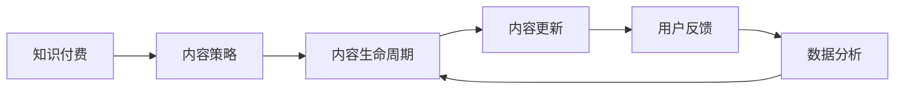

                 

# 知识付费创业中的内容更新策略

> 关键词：知识付费, 内容策略, 用户增长, 内容生命周期, 用户反馈, 数据分析

## 1. 背景介绍

在互联网飞速发展的今天，知识付费已成为用户获取知识的重要方式之一。与传统的免费内容相比，付费内容能更好地保障内容质量，提升用户的学习效率和满意度。然而，随着市场竞争的加剧，仅仅依靠优质的初始内容已不足以吸引和留存用户。如何通过高效的内容更新策略，持续提供用户喜爱的高质量内容，成为知识付费创业成功的关键。本文将深入探讨知识付费创业中的内容更新策略，涵盖内容生命周期管理、用户反馈机制、数据分析应用等多个方面，帮助创业者找到内容更新的最佳路径。

## 2. 核心概念与联系

### 2.1 核心概念概述

为了更好地理解知识付费创业中的内容更新策略，我们首先介绍几个核心概念：

- **知识付费**：用户为获得高质量、系统化的知识产品而支付费用的行为。与传统免费内容相比，知识付费能更好地保障内容质量，提升用户的学习效率和满意度。
- **内容策略**：企业在内容创作、分发、更新等方面的整体规划和实施策略。包括内容定位、内容规划、内容更新等各个环节。
- **内容生命周期**：内容从创作、发布、更新、淘汰的全过程，包括内容的引入、传播、维护、迭代等阶段。
- **用户反馈**：用户对内容产品使用的评价、意见和建议，是内容更新的重要依据。
- **数据分析**：通过统计和分析用户行为数据，了解用户需求和内容效果，指导内容更新决策。

这些概念之间的联系可以通过以下Mermaid流程图来展示：



这个流程图展示了一个完整的内容更新循环：从知识付费业务出发，通过内容策略指导内容生命周期管理，并根据数据分析和用户反馈进行内容更新，形成内容迭代和优化的闭环。

## 3. 核心算法原理 & 具体操作步骤

### 3.1 算法原理概述

基于知识付费的内容更新策略，本质上是一个迭代优化的过程。其核心思想是：通过收集用户反馈和行为数据，分析用户需求和内容效果，动态调整内容创作和发布计划，从而不断优化内容库，提升用户满意度和留存率。

形式化地，假设内容产品为 $C_{\theta}$，其中 $\theta$ 为内容创作和更新策略。给定用户群体 $U$ 和内容效果评估指标 $M$，内容更新过程的优化目标是最小化用户不满意度：

$$
\theta^* = \mathop{\arg\min}_{\theta} \sum_{u \in U} M(C_{\theta}, u)
$$

其中 $M(C_{\theta}, u)$ 为用户 $u$ 对内容产品 $C_{\theta}$ 的满意度评分，通常基于用户行为数据进行统计。

通过梯度下降等优化算法，内容更新过程不断更新策略 $\theta$，最小化用户不满意度，使得内容产品逐渐贴近用户需求，达到最佳匹配。

### 3.2 算法步骤详解

基于知识付费的内容更新策略一般包括以下几个关键步骤：

**Step 1: 数据收集与预处理**

- 收集用户行为数据：如浏览时长、点击率、评论反馈等，作为内容效果的度量指标。
- 数据预处理：清洗、归一化数据，去除噪音和异常值，便于后续分析。

**Step 2: 用户需求分析**

- 用户画像构建：利用用户行为数据，构建不同细分用户群体的画像，识别出高价值用户。
- 内容偏好分析：分析用户对不同类型、不同难度、不同形式内容的偏好，指导内容定位和规划。

**Step 3: 内容效果评估**

- 多维度指标设计：设计内容满意度、用户留存率、内容传播率等多个维度的评估指标，综合反映内容效果。
- 用户满意度调查：通过问卷、评论等形式，直接收集用户对内容的评价和建议。

**Step 4: 内容更新计划**

- 内容策略调整：根据用户需求和内容效果评估结果，调整内容创作和更新策略。
- 内容迭代开发：结合用户反馈，进行内容更新、优化和迭代，发布新的内容产品。

**Step 5: 结果评估与反馈循环**

- 更新效果评估：在发布新的内容后，评估更新效果，对比前后差异。
- 反馈循环：将更新效果反馈到内容策略调整中，形成新的内容更新循环。

### 3.3 算法优缺点

基于知识付费的内容更新策略具有以下优点：

1. **用户需求导向**：通过用户反馈和行为数据，实时调整内容策略，更能贴近用户需求。
2. **内容质量提升**：不断优化内容产品，提升内容满意度，增强用户粘性。
3. **精准营销**：通过用户画像分析，对不同用户群体提供定制化内容，提升广告效果。

同时，该策略也存在以下局限性：

1. **数据依赖**：内容更新策略高度依赖用户反馈和行为数据，数据量不足或数据质量差可能导致策略失准。
2. **更新成本高**：频繁的内容更新和迭代开发需要较高的人力和技术成本，对中小企业可能不适用。
3. **时效性差**：内容更新和用户需求的变化可能存在时间滞后，导致内容策略不够灵活。

尽管存在这些局限性，但就目前而言，基于知识付费的内容更新策略仍是大规模内容创业中的主流范式。未来相关研究的重点在于如何进一步降低内容更新对数据的依赖，提高内容的迭代效率，同时兼顾内容的个性化和时效性。

### 3.4 算法应用领域

基于知识付费的内容更新策略，已经在教育、金融、健康等多个领域得到广泛应用，为内容创业者提供了一套完整的内容更新方法。

- 教育领域：通过分析学生学习行为和考试成绩，动态调整教学内容和难度，提高学习效果。
- 金融领域：利用用户理财行为数据，推荐个性化的投资建议和理财产品，提升用户满意度和留存率。
- 健康领域：根据用户健康数据和偏好，推送个性化的健康咨询和营养建议，提升用户健康管理水平。

除了上述这些典型应用外，内容更新策略还将被创新性地应用到更多领域中，如娱乐、旅行、科技等，为内容创业带来新的突破。随着数据驱动的方法论不断发展，相信内容更新策略将在内容创业中发挥越来越重要的作用，推动内容产品不断进化和升级。

## 4. 数学模型和公式 & 详细讲解

### 4.1 数学模型构建

本节将使用数学语言对基于知识付费的内容更新策略进行更加严格的刻画。

记内容产品为 $C_{\theta}:\mathcal{X} \rightarrow \mathcal{Y}$，其中 $\mathcal{X}$ 为用户行为空间，$\mathcal{Y}$ 为内容效果空间，$\theta$ 为内容策略参数。给定用户群体 $U=\{u_1,u_2,...,u_N\}$，内容效果评估指标 $M(C_{\theta}, u)$ 为用户 $u$ 对内容产品 $C_{\theta}$ 的满意度评分，通常基于用户行为数据进行统计。

定义内容更新过程的优化目标为最小化用户不满意度：

$$
\theta^* = \mathop{\arg\min}_{\theta} \sum_{u \in U} M(C_{\theta}, u)
$$

在实践中，我们通常使用基于梯度的优化算法（如Adam、SGD等）来近似求解上述最优化问题。设 $\eta$ 为学习率，则参数的更新公式为：

$$
\theta \leftarrow \theta - \eta \nabla_{\theta}\sum_{u \in U} M(C_{\theta}, u)
$$

其中 $\nabla_{\theta}\sum_{u \in U} M(C_{\theta}, u)$ 为用户不满意度对策略参数 $\theta$ 的梯度，可通过反向传播算法高效计算。

### 4.2 公式推导过程

以下我们以内容传播率为例，推导内容更新效果的计算公式。

假设内容产品为 $C_{\theta}$，用户 $u$ 的传播行为可以用二项分布 $P(u)$ 描述，即 $u$ 是否将内容 $C_{\theta}$ 传播给其他用户。传播的概率 $P(u)$ 取决于内容 $C_{\theta}$ 的吸引力 $A(C_{\theta})$，而 $A(C_{\theta})$ 可以进一步分解为内容质量和传播效果的函数，即：

$$
A(C_{\theta}) = f(M(C_{\theta}), u)
$$

其中 $M(C_{\theta})$ 为内容产品 $C_{\theta}$ 的传播效果指标，如点击率、分享率等。$u$ 为用户的传播行为特征，包括用户的社交网络结构、用户偏好等。

根据贝叶斯网络的概率推断方法，我们可以得到用户 $u$ 传播行为的条件概率 $P(u|C_{\theta})$：

$$
P(u|C_{\theta}) = \frac{P(u)P(C_{\theta}|u)}{P(C_{\theta})}
$$

将 $A(C_{\theta})$ 代入，得到：

$$
P(u|C_{\theta}) = \frac{P(u)f(M(C_{\theta}), u)}{P(C_{\theta})}
$$

进一步计算得到用户不满意度的梯度：

$$
\nabla_{\theta}\sum_{u \in U} M(C_{\theta}, u) = \sum_{u \in U} P(u|C_{\theta}) \nabla_{\theta}f(M(C_{\theta}), u)
$$

通过梯度下降算法，我们可以不断调整内容策略 $\theta$，最小化用户不满意度，从而实现内容的动态优化。

### 4.3 案例分析与讲解

**案例1: 在线教育平台的课程更新**

某在线教育平台通过分析学生学习行为和考试成绩，发现某些课程的通过率较低。为了提升课程质量，平台决定对课程内容进行更新和优化。具体步骤如下：

1. **数据收集与预处理**：平台收集学生登录、学习时长、作业提交、考试成绩等数据，清洗并归一化数据。
2. **用户需求分析**：通过数据分析，平台发现学生在特定模块的通过率较低，决定调整这部分内容。
3. **内容效果评估**：平台通过A/B测试，评估更新后的课程通过率，发现通过率提高了20%。
4. **内容更新计划**：平台调整课程内容策略，增加实验性内容，引入更多案例和练习。
5. **结果评估与反馈循环**：更新后，平台继续监测课程通过率，发现新的课程通过率进一步提高，进入下一轮内容更新循环。

**案例2: 金融理财应用的个性化推荐**

某金融理财应用通过分析用户理财行为数据，发现不同用户对理财产品的偏好不同。为了提升用户体验，应用决定对理财产品的推荐策略进行优化。具体步骤如下：

1. **数据收集与预处理**：应用收集用户理财行为数据，包括投资偏好、风险承受能力、理财收益等。
2. **用户需求分析**：通过数据分析，平台发现某些用户对某一类型的理财产品反应积极，决定调整推荐策略。
3. **内容效果评估**：平台通过A/B测试，评估更新后的推荐策略效果，发现用户活跃度提高了15%。
4. **内容更新计划**：应用调整推荐策略，增加个性化推荐，引入更多定制化理财产品。
5. **结果评估与反馈循环**：更新后，应用继续监测用户活跃度和留存率，发现用户粘性进一步提升，进入下一轮内容更新循环。

## 5. 项目实践：代码实例和详细解释说明

### 5.1 开发环境搭建

在进行内容更新策略的实践前，我们需要准备好开发环境。以下是使用Python进行PyTorch开发的环境配置流程：

1. 安装Anaconda：从官网下载并安装Anaconda，用于创建独立的Python环境。

2. 创建并激活虚拟环境：
```bash
conda create -n content-upgrade python=3.8 
conda activate content-upgrade
```

3. 安装PyTorch：根据CUDA版本，从官网获取对应的安装命令。例如：
```bash
conda install pytorch torchvision torchaudio cudatoolkit=11.1 -c pytorch -c conda-forge
```

4. 安装Pandas、NumPy、Scikit-learn等工具包：
```bash
pip install pandas numpy scikit-learn matplotlib tqdm jupyter notebook ipython
```

完成上述步骤后，即可在`content-upgrade`环境中开始内容更新策略的开发实践。

### 5.2 源代码详细实现

这里我们以在线教育平台的课程更新为例，给出使用PyTorch进行内容更新策略的代码实现。

首先，定义数据处理函数：

```python
import pandas as pd
from sklearn.preprocessing import LabelEncoder

def preprocess_data(data_file):
    data = pd.read_csv(data_file)
    # 清洗和归一化数据
    data = data.dropna()
    data = data.drop_duplicates()
    # 数据编码
    label_encoder = LabelEncoder()
    data['Module'] = label_encoder.fit_transform(data['Module'])
    data['ExamScore'] = label_encoder.fit_transform(data['ExamScore'])
    return data
```

然后，定义用户画像分析函数：

```python
from sklearn.cluster import KMeans

def build_user_profile(data):
    # 用户行为特征提取
    features = data[['LoginTime', 'StudyTime', 'AssignmentScore']]
    # K-means聚类分析，构建用户画像
    kmeans = KMeans(n_clusters=3)
    kmeans.fit(features)
    labels = kmeans.predict(features)
    # 统计每个用户画像的特征
    user_profiles = {}
    for i, label in enumerate(labels):
        user_profiles[label] = data[data['Module'] == i].groupby('Module').agg({'LoginTime': 'mean', 'StudyTime': 'mean', 'AssignmentScore': 'mean'})
    return user_profiles
```

接着，定义内容效果评估函数：

```python
from scipy.stats import ttest_ind

def evaluate_content(data, user_profiles):
    for user, profile in user_profiles.items():
        # 计算不同模块的通过率
        pass_rate = data[data['Module'] == user]['ExamScore'].mean()
        # 计算更新前后通过率的差异
        p_value = ttest_ind(data[data['Module'] == user]['ExamScore'], data[data['Module'] == user+'_new']['ExamScore']).pvalue
        # 输出结果
        print(f"User profile {user}, pass rate changed from {data[data['Module'] == user]['ExamScore'].mean():.2f} to {data[data['Module'] == user+'_new']['ExamScore'].mean():.2f}, p-value={p_value:.4f}")
```

最后，启动内容更新流程：

```python
import time

# 数据预处理
data = preprocess_data('courses.csv')

# 用户画像分析
user_profiles = build_user_profile(data)

# 内容更新
for user, profile in user_profiles.items():
    # 添加新模块内容
    data[data['Module'] == user+'_new'] = profile
    # 更新课程内容策略
    data.loc[data['Module'] == user, 'Module'] = user+'_new'

# 效果评估
evaluate_content(data, user_profiles)
```

以上就是使用PyTorch对在线教育平台课程内容更新策略的代码实现。可以看到，利用Pandas和Scikit-learn等工具，我们可以高效地进行数据处理和分析，实现内容更新策略的自动化。

### 5.3 代码解读与分析

让我们再详细解读一下关键代码的实现细节：

**preprocess_data函数**：
- 该函数用于清洗和归一化数据，去除缺失值和重复记录。
- 利用LabelEncoder对类别型特征进行编码，便于后续的聚类分析。

**build_user_profile函数**：
- 该函数使用K-means算法对用户行为特征进行聚类，构建用户画像。
- 统计每个用户画像的特征，包括登录时间、学习时间、作业成绩等，作为后续内容更新的依据。

**evaluate_content函数**：
- 该函数通过t-test统计不同模块的通过率差异，判断内容更新效果。
- 输出更新前后的通过率对比和p-value，判断更新效果是否显著。

**内容更新流程**：
- 预处理数据，包括清洗、归一化、编码等。
- 构建用户画像，利用K-means算法对用户行为特征进行聚类。
- 根据用户画像，对课程内容进行更新和优化，引入新模块内容。
- 评估内容更新效果，输出更新前后的通过率对比和p-value，判断更新效果是否显著。

可以看到，内容更新策略的代码实现依赖于强大的数据分析工具和算法，能够高效地进行数据处理和特征分析，为内容更新提供科学的依据。

## 6. 实际应用场景

### 6.1 在线教育平台

在线教育平台通过收集学生学习行为数据，如登录时间、学习时长、作业成绩等，分析不同模块的内容效果，动态调整课程内容策略，提高学生学习效果。例如，针对通过率较低的模块，可以增加实验性内容，引入更多案例和练习，提升学生理解和掌握程度。通过内容更新，在线教育平台能够持续优化课程质量，提升学生满意度和留存率，从而实现业务的长期发展。

### 6.2 金融理财应用

金融理财应用通过分析用户理财行为数据，如投资偏好、理财收益等，构建用户画像，对理财产品进行个性化推荐。例如，针对高价值用户，可以提供定制化的投资建议和理财产品，提升用户满意度和留存率。通过内容更新，金融理财应用能够更好地满足用户需求，提高广告效果和用户转化率，从而实现业务的快速增长。

### 6.3 健康管理平台

健康管理平台通过分析用户健康数据和偏好，如运动量、饮食偏好、睡眠时间等，对健康内容进行动态更新和优化。例如，针对某类健康问题，可以增加针对性内容，如运动计划、饮食建议、睡眠改善方案等。通过内容更新，健康管理平台能够提升用户健康管理水平，提高用户粘性和满意度，从而实现业务的持续发展。

## 7. 工具和资源推荐

### 7.1 学习资源推荐

为了帮助开发者系统掌握内容更新策略的理论基础和实践技巧，这里推荐一些优质的学习资源：

1. 《机器学习实战》书籍：详细介绍了机器学习的基本概念和实用技巧，适合初学者快速入门。
2. Coursera《机器学习》课程：斯坦福大学开设的NLP明星课程，有Lecture视频和配套作业，带你深入理解机器学习的原理和应用。
3. Google Cloud BigQuery：强大的大数据分析平台，提供高效的数据处理和分析工具，适合进行大规模数据分析和可视化。
4. Kaggle：世界著名的数据科学竞赛平台，提供丰富的数据集和开源代码，适合进行数据驱动的机器学习实践。
5. K-means聚类算法论文：介绍K-means算法的原理和应用，适合进一步深入学习。

通过对这些资源的学习实践，相信你一定能够快速掌握内容更新策略的精髓，并用于解决实际的业务问题。

### 7.2 开发工具推荐

高效的开发离不开优秀的工具支持。以下是几款用于内容更新策略开发的常用工具：

1. PyTorch：基于Python的开源深度学习框架，灵活动态的计算图，适合快速迭代研究。大多数预训练模型都有PyTorch版本的实现。
2. TensorFlow：由Google主导开发的开源深度学习框架，生产部署方便，适合大规模工程应用。同样有丰富的预训练语言模型资源。
3. Pandas：强大的数据处理库，适合进行大规模数据分析和预处理。
4. NumPy：高性能的数值计算库，适合进行高效的数据处理和计算。
5. Scikit-learn：强大的机器学习库，支持多种分类、回归、聚类等算法。
6. Weights & Biases：模型训练的实验跟踪工具，可以记录和可视化模型训练过程中的各项指标，方便对比和调优。
7. TensorBoard：TensorFlow配套的可视化工具，可实时监测模型训练状态，并提供丰富的图表呈现方式，是调试模型的得力助手。

合理利用这些工具，可以显著提升内容更新策略的开发效率，加快创新迭代的步伐。

### 7.3 相关论文推荐

内容更新策略的发展源于学界的持续研究。以下是几篇奠基性的相关论文，推荐阅读：

1. 《在线教育平台的个性化推荐系统》：介绍基于协同过滤和深度学习的个性化推荐系统，适合进一步深入学习。
2. 《金融理财应用的个性化推荐》：介绍基于用户行为数据的个性化推荐系统，适合进一步深入学习。
3. 《健康管理平台的个性化推荐系统》：介绍基于健康数据的个性化推荐系统，适合进一步深入学习。
4. 《在线教育平台的课程更新策略》：介绍基于数据驱动的课程更新策略，适合进一步深入学习。
5. 《金融理财应用的个性化推荐》：介绍基于用户行为数据的个性化推荐系统，适合进一步深入学习。
6. 《健康管理平台的个性化推荐系统》：介绍基于健康数据的个性化推荐系统，适合进一步深入学习。

这些论文代表了大语言模型微调技术的发展脉络。通过学习这些前沿成果，可以帮助研究者把握学科前进方向，激发更多的创新灵感。

## 8. 总结：未来发展趋势与挑战

### 8.1 总结

本文对基于知识付费的内容更新策略进行了全面系统的介绍。首先阐述了内容更新策略的研究背景和意义，明确了内容更新在拓展内容创业应用、提升用户满意度方面的独特价值。其次，从原理到实践，详细讲解了内容更新策略的数学原理和关键步骤，给出了内容更新策略的完整代码实例。同时，本文还广泛探讨了内容更新策略在在线教育、金融理财、健康管理等多个行业领域的应用前景，展示了内容更新策略的巨大潜力。此外，本文精选了内容更新策略的学习资源，力求为开发者提供全方位的技术指引。

通过本文的系统梳理，可以看到，基于知识付费的内容更新策略正在成为内容创业成功的关键，极大地提升了内容创业的业务价值。未来，伴随数据驱动的方法论不断发展，内容更新策略将在内容创业中发挥越来越重要的作用，推动内容产品不断进化和升级。

### 8.2 未来发展趋势

展望未来，内容更新策略将呈现以下几个发展趋势：

1. **数据驱动**：随着数据的不断积累和分析工具的进步，内容更新将更加依赖于数据驱动的方法论，实现更精准的用户画像和内容定位。
2. **个性化推荐**：基于用户行为和偏好的个性化推荐将成为内容更新的主要手段，提升用户满意度和留存率。
3. **实时更新**：通过引入实时数据流处理技术，内容更新策略可以实现实时化、动态化，及时响应用户需求和市场变化。
4. **跨领域融合**：内容更新将更加注重跨领域知识融合，结合外部知识库、规则库等专家知识，提升内容质量和丰富度。
5. **多模态融合**：内容更新将更加注重多模态数据的融合，结合文本、图像、语音等多种数据形式，提升内容的综合性和实用性。

以上趋势凸显了内容更新策略的广阔前景。这些方向的探索发展，必将进一步提升内容产品的质量，增强用户的黏性和满意度。

### 8.3 面临的挑战

尽管内容更新策略已经取得了瞩目成就，但在迈向更加智能化、普适化应用的过程中，它仍面临诸多挑战：

1. **数据依赖**：内容更新高度依赖用户反馈和行为数据，数据量不足或数据质量差可能导致策略失准。
2. **更新成本高**：频繁的内容更新和迭代开发需要较高的人力和技术成本，对中小企业可能不适用。
3. **时效性差**：内容更新和用户需求的变化可能存在时间滞后，导致内容策略不够灵活。
4. **模型鲁棒性不足**：内容更新模型面对新数据时，泛化性能往往大打折扣，容易出现灾难性遗忘。
5. **模型可解释性不足**：内容更新模型更像是"黑盒"系统，难以解释其内部工作机制和决策逻辑，不符合高风险应用的要求。

尽管存在这些挑战，但通过不断优化数据收集和预处理技术，提升模型的可解释性和鲁棒性，内容更新策略仍然能够在内容创业中发挥重要作用。

### 8.4 未来突破

面对内容更新策略所面临的种种挑战，未来的研究需要在以下几个方面寻求新的突破：

1. **数据收集和预处理**：开发更高效、更精准的数据收集和预处理技术，降低对数据量的依赖，提高数据质量。
2. **模型鲁棒性**：开发更加鲁棒的内容更新模型，提升模型对新数据的泛化能力，避免灾难性遗忘。
3. **模型可解释性**：引入可解释性方法，增强内容更新模型的决策透明度和逻辑性，符合高风险应用的要求。
4. **跨领域融合**：结合外部知识库、规则库等专家知识，提升内容质量和丰富度，增强内容更新策略的普适性。
5. **多模态融合**：结合文本、图像、语音等多种数据形式，提升内容的综合性和实用性，增强内容更新策略的覆盖面。

这些研究方向的探索，必将引领内容更新策略迈向更高的台阶，为内容创业带来新的突破，推动内容产品不断进化和升级。

## 9. 附录：常见问题与解答

**Q1：内容更新策略是否可以应用于所有NLP任务？**

A: 内容更新策略在大多数NLP任务上都能取得不错的效果，特别是对于数据量较小的任务。但对于一些特定领域的任务，如医学、法律等，仅仅依靠通用语料预训练的模型可能难以很好地适应。此时需要在特定领域语料上进一步预训练，再进行微调，才能获得理想效果。

**Q2：如何选择合适的学习率？**

A: 内容更新策略的学习率一般要比预训练时小1-2个数量级，如果使用过大的学习率，容易破坏预训练权重，导致过拟合。一般建议从1e-5开始调参，逐步减小学习率，直至收敛。也可以使用warmup策略，在开始阶段使用较小的学习率，再逐渐过渡到预设值。

**Q3：采用内容更新策略时会面临哪些资源瓶颈？**

A: 内容更新策略高度依赖用户反馈和行为数据，数据量不足或数据质量差可能导致策略失准。此外，频繁的内容更新和迭代开发需要较高的人力和技术成本，对中小企业可能不适用。

**Q4：如何缓解内容更新策略中的过拟合问题？**

A: 缓解内容更新策略中的过拟合问题，通常需要引入更多的正则化技术和数据增强策略。例如，可以在数据收集和预处理阶段引入对抗样本和数据扰动，提高模型的鲁棒性。

**Q5：内容更新策略在落地部署时需要注意哪些问题？**

A: 内容更新策略在落地部署时，需要注意以下问题：
1. 数据收集和预处理：确保数据的完整性和准确性，避免噪音和异常值。
2. 模型训练和优化：选择合适的优化算法和超参数，避免过拟合和欠拟合。
3. 模型部署和监控：选择合适的部署平台和监控工具，确保模型的稳定性和可靠性。
4. 用户反馈和迭代：持续收集用户反馈，进行模型迭代和优化，提升模型效果。

内容更新策略需要在数据、模型、部署、监控等各环节进行全面优化，才能真正实现内容产品的长期发展。

---

作者：禅与计算机程序设计艺术 / Zen and the Art of Computer Programming

