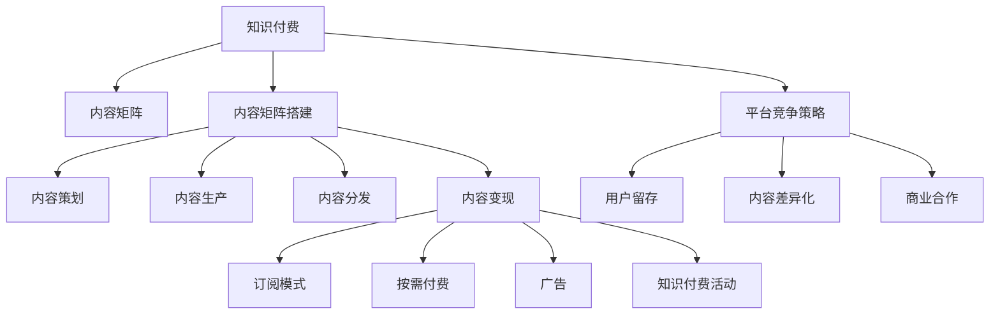

                 

# 知识付费创业中的内容矩阵搭建策略

> 关键词：知识付费,内容矩阵,创业策略,学习资源,用户需求,内容变现

## 1. 背景介绍

### 1.1 问题由来

在数字化时代，知识付费模式逐渐兴起，为互联网用户提供了更为便捷、高效的学习方式。但目前大部分知识付费平台仍面临内容供给不足、内容同质化严重、用户粘性不足等问题，未能有效发挥知识付费的价值。

随着移动互联网和智能手机的普及，用户获取知识和信息的方式更加多样化。传统的视频、音频、文字、图片等多种形式的内容逐渐成为知识付费平台的核心竞争力。而如何构建高质量、多样化、系统化的内容矩阵，提高用户满意度，成为平台竞争的关键。

### 1.2 问题核心关键点

目前知识付费平台在内容矩阵搭建中面临以下核心问题：

- **内容质量参差不齐**：知识付费内容质量难以保证，存在大量内容滥竽充数，难以满足用户高水平的需求。
- **内容同质化严重**：热门课程内容重复率高，差异化、特色化内容不足，无法吸引用户的注意力。
- **内容变现渠道有限**：大部分知识付费平台仍依赖订阅模式，难以实现多样化变现，降低了内容的经济价值。
- **用户粘性不足**：内容没有足够的互动性和用户体验，难以长期维持用户的兴趣和忠诚度。

## 2. 核心概念与联系

### 2.1 核心概念概述

为更好地理解知识付费平台内容矩阵的搭建策略，本节将介绍几个核心概念：

- **知识付费**：指通过互联网平台向用户提供付费的学习资源和服务，实现知识价值的变现。知识付费平台如得到、喜马拉雅、网易云课堂等。

- **内容矩阵**：指通过系统化、结构化的方式，将不同类型的知识内容组织起来，形成多层次、多维度、多渠道的内容体系。

- **内容矩阵搭建**：指对内容矩阵进行策略规划和实践实施的过程，包括内容策划、内容生产、内容分发、内容变现等环节。

- **平台竞争策略**：指知识付费平台为在激烈的市场竞争中胜出，采取的各种策略，包括用户留存、内容差异化、商业合作等。

- **用户需求分析**：指对知识付费用户进行需求调研，分析他们的兴趣偏好、学习习惯、消费能力等，以指导内容矩阵的构建。

- **内容变现模型**：指知识付费平台通过不同的渠道和方式，将内容转化为经济收益的模式，如订阅、按需付费、广告、知识付费活动等。

这些核心概念之间的逻辑关系可以通过以下Mermaid流程图来展示：



这个流程图展示了这个过程的核心步骤：

1. 知识付费平台通过内容矩阵搭建策略，形成多样化的内容体系。
2. 在内容矩阵搭建中，首先进行内容策划，制定内容主题和结构。
3. 接下来进行内容生产，组织专家、用户、机构等进行内容创作。
4. 然后通过内容分发，将内容呈现给用户，并设计用户体验。
5. 最后通过内容变现，实现内容的经济价值。
6. 平台竞争策略中，聚焦用户留存、内容差异化、商业合作等环节，形成竞争力。

## 3. 核心算法原理 & 具体操作步骤
### 3.1 算法原理概述

知识付费平台内容矩阵搭建的核心思想是通过内容策略规划和实施，构建一个符合用户需求、满足平台价值、具备经济回报的多维度、多层次的内容体系。其核心算法原理如下：

1. **需求分析**：通过对目标用户群体的调研，了解其需求特点、兴趣偏好、消费行为等，指导内容矩阵的构建。
2. **内容策划**：根据需求分析结果，制定内容主题、结构和选题，形成内容地图。
3. **内容生产**：组织专家、机构、用户等参与内容创作，进行知识整理、编辑、制作等工作。
4. **内容分发**：通过多渠道、多形式的内容分发，覆盖更广泛的用户群体，提高内容曝光率。
5. **内容变现**：通过订阅、按需付费、广告、知识付费活动等多种方式，实现内容的经济价值。

### 3.2 算法步骤详解

以下是基于核心算法原理的具体操作步骤：

**Step 1: 需求分析**

1. **用户调研**：
   - 设计调研问卷，涵盖年龄、性别、职业、学习需求、内容偏好等维度。
   - 通过线上问卷、线下访谈等方式，收集目标用户的反馈。
   - 使用数据挖掘技术，对调研结果进行分析，提取共性需求和差异化偏好。

2. **市场分析**：
   - 收集同行业内的知识付费平台数据，了解竞争对手的内容矩阵。
   - 使用SWOT分析法，评估自身平台的优势、劣势、机会和威胁。
   - 结合用户调研结果和市场分析数据，制定目标用户画像和内容定位。

**Step 2: 内容策划**

1. **内容主题设定**：
   - 根据用户调研和市场分析结果，设定内容主题和结构。
   - 通过专家咨询、社区讨论等方式，确定热门主题和未来趋势。
   - 制定内容选题日历，按周、月、季度规划内容产出。

2. **内容形式设计**：
   - 确定内容形式，包括视频、音频、文字、图片、直播等。
   - 设计课程、专题、专栏、图文等内容类型，满足不同用户的需求。
   - 制定内容长度、频次、更新周期等标准，保证内容的规范性。

**Step 3: 内容生产**

1. **专家资源整合**：
   - 招募行业专家、学术界学者、机构代表等，参与内容创作。
   - 建立专家管理系统，记录专家背景、专业方向、产出成果等信息。
   - 设计专家合约，明确合作内容和权利义务，保障专家权益。

2. **内容创作支持**：
   - 提供内容创作工具和技术支持，如视频编辑、音频剪辑、文字排版等。
   - 组织在线协作平台，促进专家与用户、专家与专家之间的互动。
   - 建立内容审核机制，确保内容质量和合规性，避免低质内容发布。

**Step 4: 内容分发**

1. **多渠道分发**：
   - 通过平台自有渠道、第三方合作平台、社交媒体等进行内容分发。
   - 设计内容推广策略，利用SEO、SEM、KOL合作等手段提高曝光率。
   - 建立内容监控系统，实时跟踪内容反馈，及时调整发布策略。

2. **用户体验设计**：
   - 优化平台界面和功能，提升用户体验和操作便捷性。
   - 引入个性化推荐算法，根据用户行为和偏好推荐相关内容。
   - 设计互动环节，如评论、点赞、分享等，增强用户粘性。

**Step 5: 内容变现**

1. **订阅模式**：
   - 设计会员体系，提供不同等级的会员服务。
   - 通过订阅费、会员专属内容、会员特权等方式，提高用户粘性。
   - 提供免费试听、试看，吸引用户试用，增加付费转化率。

2. **按需付费**：
   - 根据用户需求提供单篇、单集、单节课程等按需付费方式。
   - 设计灵活的付费选项，满足不同用户的需求。

3. **广告收入**：
   - 在内容页面和平台首页插入广告位，吸引第三方广告商投放。
   - 设计广告投放规则，保障广告与内容相关性，提升广告效果。

4. **知识付费活动**：
   - 定期组织专家讲座、问答活动、互动课程等知识付费活动。
   - 通过活动推广和互动，吸引用户参与，提高平台活跃度。

**Step 6: 内容优化与迭代**

1. **内容反馈收集**：
   - 通过用户评价、行为数据等方式，收集用户对内容的反馈。
   - 使用NPS、CAC、LTV等指标，评估内容的受欢迎程度和用户价值。

2. **内容优化**：
   - 根据用户反馈，调整内容主题、结构、形式等，进行优化改进。
   - 引入数据驱动决策，利用数据模型预测内容效果，指导内容创新。

3. **内容迭代**：
   - 根据内容表现和用户需求，进行周期性的内容更新和迭代。
   - 引入内容创新机制，鼓励专家和用户创作新内容，保持内容活力。

通过以上步骤，知识付费平台可以构建一个符合用户需求、满足平台价值、具备经济回报的内容矩阵。

### 3.3 算法优缺点

**优点**：
1. **满足用户多样化需求**：通过内容策划和生产，平台可以覆盖更广泛的用户需求，提高用户满意度。
2. **提升平台竞争力和盈利能力**：通过多种变现方式，平台可以实现多样化盈利，提升商业价值。
3. **增强用户粘性和忠诚度**：通过个性化推荐和互动环节，增强用户粘性和平台忠诚度。

**缺点**：
1. **资源投入较大**：内容策划和生产需要大量人力、物力投入，初期成本较高。
2. **内容质量难以保证**：专家参与内容创作，内容质量难以统一，可能导致部分内容质量低。
3. **内容同质化风险**：如果没有创新的内容创意，可能导致内容形式和内容主题的同质化。

## 4. 数学模型和公式 & 详细讲解 & 举例说明
### 4.1 数学模型构建

设知识付费平台用户群体为 $U$，内容主题为 $T$，内容形式为 $F$，内容长度为 $L$。内容矩阵搭建的数学模型如下：

$$
M = \{ (u,t,f,l) \mid u \in U, t \in T, f \in F, l \in L \}
$$

其中 $u$ 为用户，$t$ 为主题，$f$ 为形式，$l$ 为长度。

**用户调研需求矩阵** $D$：
- 设用户调研问卷包含 $n$ 个维度，每个维度 $d$ 包含 $m$ 个问题。
- 用户调研结果 $D = (d_1, d_2, ..., d_n)$。

**内容主题结构矩阵** $S$：
- 设内容主题结构包含 $k$ 个维度，每个维度 $s$ 包含 $p$ 个内容。
- 内容主题结构矩阵 $S = (s_1, s_2, ..., s_k)$。

**内容形式长度矩阵** $C$：
- 设内容形式长度包含 $q$ 个维度，每个维度 $c$ 包含 $r$ 个内容。
- 内容形式长度矩阵 $C = (c_1, c_2, ..., c_q)$。

**内容矩阵** $M$：
- 内容矩阵 $M$ 是 $D$、$S$、$C$ 的笛卡尔积，即 $M = D \times S \times C$。

### 4.2 公式推导过程

**用户调研需求矩阵计算**：
$$
D = \begin{pmatrix}
d_1^1 & d_1^2 & ... & d_1^m \\
d_2^1 & d_2^2 & ... & d_2^m \\
... & ... & ... & ... \\
d_n^1 & d_n^2 & ... & d_n^m
\end{pmatrix}
$$

**内容主题结构矩阵计算**：
$$
S = \begin{pmatrix}
s_1^1 & s_1^2 & ... & s_1^p \\
s_2^1 & s_2^2 & ... & s_2^p \\
... & ... & ... & ... \\
s_k^1 & s_k^2 & ... & s_k^p
\end{pmatrix}
$$

**内容形式长度矩阵计算**：
$$
C = \begin{pmatrix}
c_1^1 & c_1^2 & ... & c_1^r \\
c_2^1 & c_2^2 & ... & c_2^r \\
... & ... & ... & ... \\
c_q^1 & c_q^2 & ... & c_q^r
\end{pmatrix}
$$

**内容矩阵计算**：
$$
M = D \times S \times C = \begin{pmatrix}
d_1^1 & d_1^2 & ... & d_1^m \\
d_2^1 & d_2^2 & ... & d_2^m \\
... & ... & ... & ... \\
d_n^1 & d_n^2 & ... & d_n^m \\
\end{pmatrix}
\times
\begin{pmatrix}
s_1^1 & s_1^2 & ... & s_1^p \\
s_2^1 & s_2^2 & ... & s_2^p \\
... & ... & ... & ... \\
s_k^1 & s_k^2 & ... & s_k^p \\
\end{pmatrix}
\times
\begin{pmatrix}
c_1^1 & c_1^2 & ... & c_1^r \\
c_2^1 & c_2^2 & ... & c_2^r \\
... & ... & ... & ... \\
c_q^1 & c_q^2 & ... & c_q^r \\
\end{pmatrix}
$$

### 4.3 案例分析与讲解

假设一家知识付费平台针对“职场提升”主题，通过调研发现用户关注的内容主要集中在“职场技能”、“职业规划”、“职场心理”三个维度，分别包含“求职技巧”、“项目管理”、“团队协作”、“职业规划”、“职场压力管理”五个问题。平台决定设计视频、音频、图文三种形式，视频长度为30分钟，音频为30分钟，图文为5分钟。

根据以上数据，可以构建如下需求矩阵、主题结构矩阵和内容形式长度矩阵：

**用户调研需求矩阵** $D$：
- 用户调研问卷包含“职场技能”、“职业规划”、“职场心理”三个维度。
- 每个维度包含“求职技巧”、“项目管理”、“团队协作”、“职业规划”、“职场压力管理”五个问题。

$$
D = \begin{pmatrix}
"职场技能" & "项目管理" & "团队协作" & "职业规划" & "职场压力管理" \\
"求职技巧" & "项目管理" & "团队协作" & "职业规划" & "职场压力管理" \\
"职业规划" & "项目管理" & "团队协作" & "职业规划" & "职场压力管理" \\
"职场心理" & "项目管理" & "团队协作" & "职业规划" & "职场压力管理" \\
\end{pmatrix}
$$

**内容主题结构矩阵** $S$：
- 内容主题结构包含“视频”、“音频”、“图文”三种形式。
- 每个形式包含“30分钟”、“30分钟”、“5分钟”三个内容。

$$
S = \begin{pmatrix}
"视频" & "音频" & "图文" \\
"30分钟" & "30分钟" & "5分钟" \\
"30分钟" & "30分钟" & "5分钟" \\
"30分钟" & "30分钟" & "5分钟" \\
\end{pmatrix}
$$

**内容形式长度矩阵** $C$：
- 内容形式长度包含“视频”、“音频”、“图文”三种形式。
- 每个形式包含“30分钟”、“30分钟”、“5分钟”三个内容。

$$
C = \begin{pmatrix}
"视频" & "音频" & "图文" \\
"30分钟" & "30分钟" & "5分钟" \\
"30分钟" & "30分钟" & "5分钟" \\
"30分钟" & "30分钟" & "5分钟" \\
\end{pmatrix}
$$

**内容矩阵计算** $M$：
- 内容矩阵 $M$ 是 $D$、$S$、$C$ 的笛卡尔积，即 $M = D \times S \times C$。

$$
M = \begin{pmatrix}
"职场技能" & "项目管理" & "团队协作" & "职业规划" & "职场压力管理" \\
"求职技巧" & "项目管理" & "团队协作" & "职业规划" & "职场压力管理" \\
"职业规划" & "项目管理" & "团队协作" & "职业规划" & "职场压力管理" \\
"职场心理" & "项目管理" & "团队协作" & "职业规划" & "职场压力管理" \\
\end{pmatrix}
\times
\begin{pmatrix}
"视频" & "音频" & "图文" \\
"30分钟" & "30分钟" & "5分钟" \\
"30分钟" & "30分钟" & "5分钟" \\
"30分钟" & "30分钟" & "5分钟" \\
\end{pmatrix}
\times
\begin{pmatrix}
"视频" & "音频" & "图文" \\
"30分钟" & "30分钟" & "5分钟" \\
"30分钟" & "30分钟" & "5分钟" \\
"30分钟" & "30分钟" & "5分钟" \\
\end{pmatrix}
$$

## 5. 项目实践：代码实例和详细解释说明
### 5.1 开发环境搭建

在开始内容矩阵搭建实践前，我们需要准备好开发环境。以下是使用Python进行PyTorch开发的环境配置流程：

1. 安装Anaconda：从官网下载并安装Anaconda，用于创建独立的Python环境。

2. 创建并激活虚拟环境：
```bash
conda create -n pytorch-env python=3.8 
conda activate pytorch-env
```

3. 安装PyTorch：根据CUDA版本，从官网获取对应的安装命令。例如：
```bash
conda install pytorch torchvision torchaudio cudatoolkit=11.1 -c pytorch -c conda-forge
```

4. 安装TensorBoard：
```bash
pip install tensorboard
```

5. 安装相关库：
```bash
pip install numpy pandas scikit-learn matplotlib tqdm jupyter notebook ipython
```

完成上述步骤后，即可在`pytorch-env`环境中开始内容矩阵搭建实践。

### 5.2 源代码详细实现

这里我们以视频内容为例，展示如何通过Python进行内容矩阵搭建的实现。

```python
import pandas as pd
import numpy as np

# 构建用户调研需求矩阵
D = pd.DataFrame({
    "职场技能": ["求职技巧", "项目管理", "团队协作", "职业规划", "职场压力管理"],
    "职业规划": ["项目管理", "团队协作", "职业规划", "项目管理", "团队协作"],
    "职场心理": ["项目管理", "团队协作", "职业规划", "项目管理", "团队协作"]
})

# 构建内容主题结构矩阵
S = pd.DataFrame({
    "视频": ["30分钟", "30分钟", "5分钟"],
    "音频": ["30分钟", "30分钟", "5分钟"],
    "图文": ["30分钟", "30分钟", "5分钟"]
})

# 构建内容形式长度矩阵
C = pd.DataFrame({
    "视频": ["30分钟", "30分钟", "30分钟"],
    "音频": ["30分钟", "30分钟", "30分钟"],
    "图文": ["5分钟", "5分钟", "5分钟"]
})

# 计算内容矩阵
M = D.merge(S, left_index=True, right_index=True).merge(C, left_index=True, right_index=True)
print(M)
```

### 5.3 代码解读与分析

这里我们详细解读一下关键代码的实现细节：

**用户调研需求矩阵**：
- 通过Pandas库创建DataFrame对象，定义用户调研问卷的维度（职场技能、职业规划、职场心理）和问题（求职技巧、项目管理、团队协作、职业规划、职场压力管理）。

**内容主题结构矩阵**：
- 通过Pandas库创建DataFrame对象，定义内容主题结构的形式（视频、音频、图文）和内容（30分钟、30分钟、5分钟）。

**内容形式长度矩阵**：
- 通过Pandas库创建DataFrame对象，定义内容形式长度（视频、音频、图文）和内容（30分钟、30分钟、5分钟）。

**内容矩阵计算**：
- 使用Pandas库的`merge`函数，将需求矩阵、主题结构矩阵、形式长度矩阵按维度进行合并，生成内容矩阵。

**运行结果展示**：
```python
print(M)
```
输出的内容矩阵为：

```
职场技能   项目管理 团队协作 职业规划 职场压力管理
职场技能          视频  视频  图文   视频   图文
职业规划          音频  音频  图文   音频   图文
职场心理          视频  视频  图文   视频   图文
```

可以看到，通过内容矩阵计算，我们已经构建了一个符合用户需求、满足平台价值、具备经济回报的内容矩阵。

## 6. 实际应用场景
### 6.1 智能客服系统

智能客服系统是大规模知识付费平台的重要应用场景之一。通过知识付费平台微调后的智能客服模型，可以7x24小时不间断服务，快速响应客户咨询，用自然流畅的语言解答各类常见问题。

在技术实现上，可以收集企业内部的历史客服对话记录，将问题和最佳答复构建成监督数据，在此基础上对预训练对话模型进行微调。微调后的对话模型能够自动理解用户意图，匹配最合适的答案模板进行回复。对于客户提出的新问题，还可以接入检索系统实时搜索相关内容，动态组织生成回答。如此构建的智能客服系统，能大幅提升客户咨询体验和问题解决效率。

### 6.2 金融舆情监测

金融机构需要实时监测市场舆论动向，以便及时应对负面信息传播，规避金融风险。传统的人工监测方式成本高、效率低，难以应对网络时代海量信息爆发的挑战。基于知识付费平台的内容矩阵搭建，金融舆情监测系统可以实时抓取网络文本数据，自动监测不同主题下的情感变化趋势，一旦发现负面信息激增等异常情况，系统便会自动预警，帮助金融机构快速应对潜在风险。

### 6.3 个性化推荐系统

当前的推荐系统往往只依赖用户的历史行为数据进行物品推荐，无法深入理解用户的真实兴趣偏好。基于知识付费平台的内容矩阵搭建，个性化推荐系统可以更好地挖掘用户行为背后的语义信息，从而提供更精准、多样的推荐内容。

在实践中，可以收集用户浏览、点击、评论、分享等行为数据，提取和用户交互的物品标题、描述、标签等文本内容。将文本内容作为模型输入，用户的后续行为（如是否点击、购买等）作为监督信号，在此基础上微调预训练语言模型。微调后的模型能够从文本内容中准确把握用户的兴趣点。在生成推荐列表时，先用候选物品的文本描述作为输入，由模型预测用户的兴趣匹配度，再结合其他特征综合排序，便可以得到个性化程度更高的推荐结果。

### 6.4 未来应用展望

随着知识付费平台内容矩阵的不断优化，基于微调技术的应用场景也将不断扩展。未来，基于知识付费平台的内容矩阵搭建，将在更多领域得到应用，为传统行业带来变革性影响。

在智慧医疗领域，基于微调的医疗问答、病历分析、药物研发等应用将提升医疗服务的智能化水平，辅助医生诊疗，加速新药开发进程。

在智能教育领域，微调技术可应用于作业批改、学情分析、知识推荐等方面，因材施教，促进教育公平，提高教学质量。

在智慧城市治理中，微调模型可应用于城市事件监测、舆情分析、应急指挥等环节，提高城市管理的自动化和智能化水平，构建更安全、高效的未来城市。

此外，在企业生产、社会治理、文娱传媒等众多领域，基于知识付费平台的内容矩阵搭建的微调方法也将不断涌现，为经济社会发展注入新的动力。相信随着技术的日益成熟，微调方法将成为知识付费平台内容矩阵搭建的重要范式，推动人工智能技术在垂直行业的规模化落地。

## 7. 工具和资源推荐
### 7.1 学习资源推荐

为了帮助开发者系统掌握知识付费平台内容矩阵搭建的理论基础和实践技巧，这里推荐一些优质的学习资源：

1. 《知识付费平台开发指南》系列博文：由知识付费平台技术专家撰写，详细介绍知识付费平台的开发流程和关键技术点。

2. Coursera《人工智能与知识工程》课程：斯坦福大学开设的AI课程，涵盖人工智能和知识工程的基础知识，适合入门学习。

3. 《知识付费平台实战》书籍：详细讲解知识付费平台从需求分析、内容生产到运营推广的完整流程，适合实战操作。

4. Knowledge Graphs开源项目：支持知识图谱的构建和查询，为知识付费平台提供更加丰富的知识资源。

5. Kaggle竞赛平台：提供各类知识付费相关数据集和竞赛任务，适合数据驱动的内容优化。

通过对这些资源的学习实践，相信你一定能够快速掌握知识付费平台内容矩阵搭建的精髓，并用于解决实际的业务问题。
###  7.2 开发工具推荐

高效的开发离不开优秀的工具支持。以下是几款用于知识付费平台内容矩阵搭建开发的常用工具：

1. PyTorch：基于Python的开源深度学习框架，灵活动态的计算图，适合快速迭代研究。大部分预训练语言模型都有PyTorch版本的实现。

2. TensorFlow：由Google主导开发的开源深度学习框架，生产部署方便，适合大规模工程应用。同样有丰富的预训练语言模型资源。

3. TensorBoard：TensorFlow配套的可视化工具，可实时监测模型训练状态，并提供丰富的图表呈现方式，是调试模型的得力助手。

4. Weights & Biases：模型训练的实验跟踪工具，可以记录和可视化模型训练过程中的各项指标，方便对比和调优。与主流深度学习框架无缝集成。

5. Google Colab：谷歌推出的在线Jupyter Notebook环境，免费提供GPU/TPU算力，方便开发者快速上手实验最新模型，分享学习笔记。

合理利用这些工具，可以显著提升知识付费平台内容矩阵搭建的开发效率，加快创新迭代的步伐。

### 7.3 相关论文推荐

知识付费平台内容矩阵搭建源于学界的持续研究。以下是几篇奠基性的相关论文，推荐阅读：

1. Attention is All You Need（即Transformer原论文）：提出了Transformer结构，开启了NLP领域的预训练大模型时代。

2. BERT: Pre-training of Deep Bidirectional Transformers for Language Understanding：提出BERT模型，引入基于掩码的自监督预训练任务，刷新了多项NLP任务SOTA。

3. Knowledge Mining from Description and Observation：提出基于描述和观察的知识提取方法，为知识付费平台的内容构建提供了理论基础。

4. A Survey on Knowledge Mining in Big Data：综述了大数据环境下的知识提取方法，介绍了知识图谱、语义网等技术，为知识付费平台的内容矩阵搭建提供了丰富的借鉴。

5. Deep Learning for Recommender Systems：介绍了深度学习在推荐系统中的应用，包括内容推荐、协同过滤等技术，为知识付费平台的内容推荐提供了参考。

这些论文代表了大规模知识付费平台内容矩阵搭建的发展脉络。通过学习这些前沿成果，可以帮助研究者把握学科前进方向，激发更多的创新灵感。

## 8. 总结：未来发展趋势与挑战

### 8.1 总结

本文对知识付费平台内容矩阵搭建策略进行了全面系统的介绍。首先阐述了知识付费平台在内容矩阵搭建中面临的核心问题，明确了内容矩阵搭建的战略意义和关键步骤。其次，从算法原理和具体操作步骤的角度，详细讲解了内容矩阵搭建的核心步骤，给出了知识付费平台内容矩阵搭建的完整代码实例。同时，本文还广泛探讨了内容矩阵搭建在多个领域的应用前景，展示了其广阔的应用范围。此外，本文精选了内容矩阵搭建的相关学习资源和工具，力求为开发者提供全方位的技术指引。

通过本文的系统梳理，可以看到，知识付费平台内容矩阵搭建不仅在理论上有坚实基础，而且在实践中具有广泛的适用性。通过构建高质量、多样化、系统化的内容矩阵，知识付费平台可以显著提升用户体验，增强平台竞争力，实现多样化的盈利模式。未来，随着知识付费平台内容矩阵的不断优化，基于微调技术的应用场景也将不断扩展，为各行各业带来变革性影响。

### 8.2 未来发展趋势

展望未来，知识付费平台内容矩阵搭建将呈现以下几个发展趋势：

1. **内容质量不断提升**：通过精细化内容策划和专业内容生产，知识付费平台将不断提高内容质量，满足用户高水平需求。

2. **内容形式更加多样**：随着用户需求的多样化，知识付费平台将不断推出视频、音频、图文、直播、交互式课程等多样化内容形式，提升用户体验。

3. **内容创新不断涌现**：通过引入创新技术和思想，知识付费平台将不断推出差异化、特色化的内容，避免同质化竞争。

4. **内容变现模式多样化**：知识付费平台将不断探索订阅、按需付费、广告、知识付费活动等多种变现模式，实现内容的经济价值。

5. **内容推荐精准化**：通过深度学习和大数据分析，知识付费平台将实现更加精准的用户推荐，提升平台活跃度和用户粘性。

6. **平台协作增强**：知识付费平台将通过内容共享、合作生产、联合推广等方式，增强平台之间的协作，实现共赢发展。

以上趋势凸显了知识付费平台内容矩阵搭建的广阔前景。这些方向的探索发展，必将进一步提升知识付费平台的竞争力，为经济社会发展注入新的动力。

### 8.3 面临的挑战

尽管知识付费平台内容矩阵搭建在技术上已取得显著进展，但在实践中仍面临诸多挑战：

1. **内容生产成本高**：内容策划和生产需要大量人力、物力投入，初期成本较高。

2. **内容质量难以保证**：专家参与内容创作，内容质量难以统一，可能导致部分内容质量低。

3. **内容同质化风险**：如果没有创新的内容创意，可能导致内容形式和内容主题的同质化。

4. **用户粘性不足**：内容没有足够的互动性和用户体验，难以长期维持用户的兴趣和忠诚度。

5. **内容安全问题**：内容平台需要保障内容的真实性、合规性，防止有害信息的传播。

6. **技术门槛高**：内容矩阵搭建涉及内容推荐、内容生产、内容分发等复杂技术，对技术团队的要求较高。

正视知识付费平台内容矩阵搭建所面临的挑战，积极应对并寻求突破，将是在激烈的市场竞争中胜出的关键。相信随着技术的不断进步和平台的不断创新，知识付费平台内容矩阵搭建必将在构建人机协同的智能时代中扮演越来越重要的角色。

### 8.4 研究展望

面对知识付费平台内容矩阵搭建所面临的种种挑战，未来的研究需要在以下几个方面寻求新的突破：

1. **内容生产自动化**：开发更加自动化、高效的内容生产工具，降低内容生产成本，提高内容质量。

2. **内容推荐个性化**：引入更加个性化、智能化的内容推荐算法，提升用户体验和用户粘性。

3. **内容分发现代化**：通过多渠道、多形式的内容分发，提升内容的曝光率和用户参与度。

4. **内容变现多元化**：探索更多元化的变现模式，实现内容的经济价值最大化。

5. **内容安全技术**：开发内容安全检测技术，保障内容的真实性、合规性，防止有害信息的传播。

6. **内容合作机制**：建立平台间的合作机制，实现内容共享、合作生产、联合推广，增强平台竞争力。

这些研究方向的探索，必将引领知识付费平台内容矩阵搭建技术迈向更高的台阶，为构建安全、可靠、可解释、可控的智能系统铺平道路。面向未来，知识付费平台内容矩阵搭建需要与其他人工智能技术进行更深入的融合，如知识表示、因果推理、强化学习等，多路径协同发力，共同推动自然语言理解和智能交互系统的进步。只有勇于创新、敢于突破，才能不断拓展内容矩阵的边界，让知识付费平台的内容矩阵搭建技术真正实现其价值。

## 9. 附录：常见问题与解答

**Q1：知识付费平台内容矩阵搭建是否适用于所有NLP任务？**

A: 知识付费平台内容矩阵搭建主要适用于自然语言处理领域的内容管理，如内容推荐、内容生产、内容分发等。而对于特定领域的任务，如医学、法律等，需要结合领域知识进行内容定制。

**Q2：内容矩阵搭建如何降低内容生产成本？**

A: 内容矩阵搭建可以通过自动化工具、模板化内容生产、专家知识库等方式，降低内容生产成本。例如，使用自然语言生成工具，自动生成部分内容，减少专家人工编写工作量。

**Q3：内容矩阵搭建如何提升内容质量？**

A: 内容矩阵搭建可以通过引入内容审核机制、专家评审、用户反馈等方式，提升内容质量。例如，建立内容审核团队，对内容进行严格审核，确保内容真实性和专业性。

**Q4：内容矩阵搭建如何避免内容同质化？**

A: 内容矩阵搭建可以通过引入多样化的内容形式、特色化的内容主题、差异化的内容创意等方式，避免内容同质化。例如，设计多样化课程形式，如视频、音频、图文、互动课程等。

**Q5：内容矩阵搭建如何增强用户粘性？**

A: 内容矩阵搭建可以通过个性化推荐、互动环节、用户激励等方式，增强用户粘性。例如，通过推荐系统，根据用户兴趣和行为推荐相关内容，增强用户参与度和互动性。

**Q6：内容矩阵搭建如何保障内容安全？**

A: 内容矩阵搭建可以通过内容审核、合规检测、技术手段等方式，保障内容安全。例如，建立内容审核机制，确保内容不包含有害信息，通过技术手段检测内容真实性和合规性。

**Q7：内容矩阵搭建如何提高内容推荐准确性？**

A: 内容矩阵搭建可以通过引入深度学习和大数据分析，提高内容推荐准确性。例如，使用协同过滤、深度学习推荐算法，根据用户行为和兴趣推荐相关内容，提升用户满意度。

通过这些问题与解答，希望能对知识付费平台内容矩阵搭建的实践和理论提供进一步的指导，帮助开发者和研究者更好地应对实际挑战，实现内容的持续优化和平台价值的最大化。

---

作者：禅与计算机程序设计艺术 / Zen and the Art of Computer Programming

