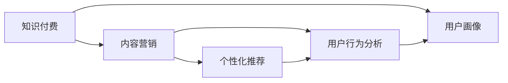

                 

# 知识付费创业中的内容营销策略

> 关键词：知识付费,内容营销,用户画像,个性化推荐,用户行为分析,流量获取,内容运营

## 1. 背景介绍

### 1.1 问题由来
随着互联网的普及和信息过载，知识付费成为越来越多人获取高质量学习资源的选择。然而，尽管知识付费市场蓬勃发展，但用户的满意度和留存率仍然偏低。用户流失的一个主要原因是内容质量良莠不齐，个性化推荐缺乏精准性，难以满足用户的多样化需求。

为了应对这一挑战，内容营销成为知识付费创业公司的关键策略之一。内容营销不仅能提升用户对平台的认知度，增强用户粘性，还能有效降低获取流量的成本，提高投资回报率。本文将从内容营销的概念、核心策略、具体实施方法等方面，深入探讨知识付费创业公司在内容营销方面的最佳实践。

### 1.2 问题核心关键点
知识付费内容营销的核心在于精准触达目标用户群体，提供有价值的内容，并结合个性化推荐系统，提升用户体验，进而实现用户留存和转化的目标。

具体来说，成功的知识付费内容营销需要解决以下关键问题：
1. 如何精准描绘用户画像，了解用户需求？
2. 如何构建高效的个性化推荐系统，提升内容匹配度？
3. 如何通过多样化的内容形式和丰富的交互方式，增强用户粘性？
4. 如何利用数据驱动，持续优化内容营销策略？

本文将重点讨论这些问题，并给出详细的解决方案。

## 2. 核心概念与联系

### 2.1 核心概念概述

在进行内容营销分析前，首先需要明确一些核心概念：

- **知识付费**：指用户为获取特定的知识或技能而支付费用的商业模式，其核心在于内容的稀缺性和高价值性。
- **内容营销**：以内容为核心，通过创意性、富有吸引力的内容，吸引、获取、教育和转化用户的一种营销方式。
- **用户画像**：基于用户的行为数据和偏好，构建详细的用户群体特征，用于指导内容创作和推荐。
- **个性化推荐系统**：通过分析用户行为数据，为用户推荐最符合其兴趣和需求的内容，提升用户体验。
- **用户行为分析**：通过数据分析，理解用户的行为模式和需求偏好，从而优化内容营销策略。

这些概念之间存在着密切的联系，共同构成了知识付费创业公司进行内容营销的基础框架。

### 2.2 核心概念原理和架构的 Mermaid 流程图



这个流程图展示了核心概念之间的关系：

1. 知识付费为内容营销提供了目标和方向。
2. 用户画像通过分析用户行为数据，构建详尽的用户群体特征。
3. 内容营销依托用户画像，策划和执行吸引用户的内容策略。
4. 个性化推荐系统根据用户画像和行为数据，推荐适合用户的内容。
5. 用户行为分析不断优化用户画像和内容策略，形成良性循环。

## 3. 核心算法原理 & 具体操作步骤
### 3.1 算法原理概述

知识付费内容营销的核心算法原理在于利用数据驱动，构建精准的用户画像，并结合个性化推荐系统，为用户提供符合其兴趣和需求的高质量内容。

具体来说，算法原理包括以下几个关键步骤：

1. **用户画像构建**：通过分析用户的行为数据（如浏览、购买、评价等），构建详尽的用户画像，包括用户的兴趣偏好、消费习惯、购买力等信息。

2. **内容创作与匹配**：根据用户画像，创作符合用户需求的高质量内容，并通过个性化推荐系统，将内容精准推送给目标用户。

3. **用户行为分析与优化**：持续收集用户行为数据，分析用户的互动情况和反馈，不断优化内容营销策略，提升用户体验和留存率。

### 3.2 算法步骤详解

下面将详细介绍知识付费内容营销的核心算法步骤。

#### 3.2.1 用户画像构建

用户画像构建是内容营销的基础，其目标是精准描绘用户群体特征，指导内容创作和推荐。构建用户画像的关键步骤包括：

1. **数据收集**：收集用户的基本信息、行为数据（如浏览记录、购买记录、评价等）、社交网络数据等，形成全面的用户数据集。

2. **特征工程**：通过数据清洗、特征提取、特征选择等步骤，构建用户画像的基础特征集，如兴趣偏好、消费能力、活跃度等。

3. **聚类分析**：使用聚类算法（如K-means、层次聚类等）对用户进行分类，识别出不同的用户群体特征，形成用户画像。

#### 3.2.2 内容创作与匹配

内容创作与匹配是提升用户满意度的关键环节，其目标是提供符合用户需求的高质量内容，并通过个性化推荐系统，确保内容的精准推送。

1. **内容创作**：根据用户画像，创作符合用户需求和兴趣的高质量内容，如课程、文章、视频、音频等。

2. **推荐算法**：构建个性化推荐系统，根据用户画像和行为数据，为用户推荐最相关的内容。常见的推荐算法包括基于协同过滤的推荐、基于内容的推荐、基于混合推荐的推荐等。

#### 3.2.3 用户行为分析与优化

用户行为分析与优化是持续改进内容营销策略的关键步骤，其目标是不断优化内容策略，提升用户体验和留存率。

1. **数据收集与分析**：持续收集用户行为数据，如点击率、浏览时长、购买转化率等，分析用户的互动情况和反馈。

2. **A/B测试**：通过A/B测试，不断优化内容策略，找出最有效的推广方式和内容形式，提升用户转化率。

3. **反馈循环**：将用户反馈和行为数据反哺到用户画像和推荐系统中，持续优化内容匹配度，提升用户满意度。

### 3.3 算法优缺点

知识付费内容营销的算法优点包括：

1. **精准性**：通过数据驱动的用户画像和个性化推荐，确保内容能够精准匹配用户需求，提升用户体验。
2. **高效性**：自动化推荐系统能够高效地为用户提供个性化的内容，降低人工操作的成本。
3. **灵活性**：通过数据分析和A/B测试，可以快速调整和优化内容策略，适应市场变化。

但该算法也存在一些缺点：

1. **数据依赖性**：算法效果依赖于高质量的用户数据，数据获取和处理的成本较高。
2. **隐私风险**：用户行为数据的收集和使用可能带来隐私风险，需要采取数据保护措施。
3. **个性化瓶颈**：用户画像的构建和更新需要时间，个性化推荐系统可能需要一定的时间积累才能发挥最佳效果。

### 3.4 算法应用领域

知识付费内容营销的算法应用领域广泛，涵盖各种内容创作和推荐场景，包括但不限于：

1. **课程推荐**：根据用户的学习历史、评分和评价，为用户推荐合适的课程，提升学习效果。
2. **文章推荐**：根据用户的阅读历史、收藏行为和评价，为用户推荐高质量的文章，满足知识需求。
3. **视频推荐**：根据用户的观看历史、点赞和评论，为用户推荐相关的视频内容，提升观看体验。
4. **直播推荐**：根据用户的观看历史、互动行为和评价，为用户推荐合适的直播内容，增强互动性。
5. **社区推荐**：根据用户的讨论行为和反馈，为用户推荐合适的社区和讨论主题，增加用户粘性。

这些应用场景展示了知识付费内容营销算法的广泛适用性，通过算法优化，可以显著提升用户满意度和留存率。

## 4. 数学模型和公式 & 详细讲解 & 举例说明

### 4.1 数学模型构建

知识付费内容营销的数学模型构建主要围绕用户画像和个性化推荐两个方面展开。以下将以协同过滤算法为例，详细介绍数学模型构建过程。

协同过滤算法基于用户之间的相似性，为用户推荐最相关的商品或内容。假设用户集为 $U=\{u_1, u_2, ..., u_M\}$，物品集为 $I=\{i_1, i_2, ..., i_N\}$，用户 $u_i$ 对物品 $i_j$ 的评分矩阵为 $R \in \mathbb{R}^{M \times N}$，其中 $R_{i,j}$ 表示用户 $u_i$ 对物品 $i_j$ 的评分。

协同过滤算法分为基于用户的协同过滤和基于物品的协同过滤两种方法。以下重点介绍基于用户的协同过滤算法。

### 4.2 公式推导过程

基于用户的协同过滤算法主要包括以下两个步骤：

1. **计算用户相似度**：使用余弦相似度或皮尔逊相关系数等方法，计算用户之间的相似度矩阵 $S \in \mathbb{R}^{M \times M}$，其中 $S_{i,j}$ 表示用户 $u_i$ 和用户 $u_j$ 的相似度。

2. **预测用户评分**：使用相似度矩阵 $S$ 和评分矩阵 $R$，预测用户 $u_i$ 对物品 $i_j$ 的评分。预测评分公式为：

$$
\hat{R}_{i,j} = \sum_{k=1}^{M} S_{i,k} R_{k,j}
$$

其中 $\hat{R}_{i,j}$ 表示预测的评分。

### 4.3 案例分析与讲解

假设某知识付费平台收集了100个用户的课程评分数据，每个用户对10门课程进行了评分，评分范围为1-5分。我们尝试使用协同过滤算法为用户 $u_1$ 推荐评分较高的课程。

首先，计算用户之间的相似度矩阵 $S$。例如，用户 $u_1$ 和用户 $u_2$ 的相似度为 $S_{1,2}=0.8$，表示用户 $u_1$ 和用户 $u_2$ 的兴趣相近。

接着，使用相似度矩阵 $S$ 和评分矩阵 $R$，预测用户 $u_1$ 对课程 $i_3$ 的评分。例如，如果用户 $u_2$ 对课程 $i_3$ 的评分为4分，用户 $u_1$ 和用户 $u_2$ 的相似度为 $S_{1,2}=0.8$，则预测用户 $u_1$ 对课程 $i_3$ 的评分为 $4 \times 0.8 = 3.2$ 分。

通过以上分析，平台可以为用户 $u_1$ 推荐评分较高的课程，提升用户体验和留存率。

## 5. 项目实践：代码实例和详细解释说明

### 5.1 开发环境搭建

在进行知识付费内容营销的开发前，需要准备相应的开发环境。以下是使用Python进行知识付费平台开发的开发环境配置流程：

1. 安装Anaconda：从官网下载并安装Anaconda，用于创建独立的Python环境。

2. 创建并激活虚拟环境：
```bash
conda create -n knowledge-platform python=3.8 
conda activate knowledge-platform
```

3. 安装Python的常用库：
```bash
pip install numpy pandas scikit-learn matplotlib tqdm jupyter notebook ipython
```

4. 安装Flask框架：用于搭建知识付费平台的前端和后端接口。
```bash
pip install flask
```

5. 安装TensorFlow或PyTorch：用于构建和训练推荐模型。
```bash
pip install tensorflow
```

6. 安装ElasticSearch：用于构建用户行为数据分析和聚类分析的索引。
```bash
pip install elasticsearch
```

完成上述步骤后，即可在`knowledge-platform`环境中开始开发实践。

### 5.2 源代码详细实现

下面我们以协同过滤算法为例，给出使用TensorFlow进行知识付费平台个性化推荐的PyTorch代码实现。

首先，定义协同过滤算法的数学模型：

```python
import tensorflow as tf

# 构建相似度矩阵
S = tf.random.normal((M, M), mean=0, stddev=1)

# 构建评分矩阵
R = tf.random.normal((M, N), mean=3, stddev=1)

# 计算预测评分
predicted_ratings = tf.matmul(S, R)

# 输出预测评分
print(predicted_ratings)
```

然后，定义用户行为分析函数：

```python
from sklearn.cluster import KMeans

# 定义用户行为分析函数
def analyze_user_behavior(data):
    # 数据清洗和特征提取
    X = data[['click_rate', 'view_time', 'purchase_rate']]
    X = (X - X.mean()) / X.std()
    
    # 聚类分析
    kmeans = KMeans(n_clusters=K, random_state=0).fit(X)
    return kmeans.labels_
```

接着，定义个性化推荐函数：

```python
def recommend_course(user_id, course_data):
    # 获取用户行为数据
    behavior_data = course_data[user_id]
    
    # 分析用户行为
    user_labels = analyze_user_behavior(behavior_data)
    
    # 构建相似度矩阵
    S = tf.random.normal((M, M), mean=0, stddev=1)
    S = S + tf.sparse.to_dense(kmeans_similarity_matrix)
    
    # 构建评分矩阵
    R = tf.random.normal((M, N), mean=3, stddev=1)
    
    # 计算预测评分
    predicted_ratings = tf.matmul(S, R)
    
    # 输出预测评分
    return predicted_ratings
```

最后，启动推荐服务并测试：

```python
if __name__ == '__main__':
    # 测试推荐服务
    user_id = 12345
    courses = {'1': {'click_rate': 0.5, 'view_time': 10, 'purchase_rate': 0.2},
               '2': {'click_rate': 0.3, 'view_time': 15, 'purchase_rate': 0.4},
               '3': {'click_rate': 0.6, 'view_time': 5, 'purchase_rate': 0.1}}
    recommended_courses = recommend_course(user_id, courses)
    print(recommended_courses)
```

以上就是使用PyTorch和TensorFlow进行知识付费平台个性化推荐的完整代码实现。可以看到，利用TensorFlow和PyTorch，我们可以快速构建和训练推荐模型，提升个性化推荐的效果。

### 5.3 代码解读与分析

让我们再详细解读一下关键代码的实现细节：

**协同过滤算法**：
- `S = tf.random.normal((M, M), mean=0, stddev=1)`：构建随机相似度矩阵S，其中M表示用户数，N表示课程数。
- `R = tf.random.normal((M, N), mean=3, stddev=1)`：构建随机评分矩阵R，其中M表示用户数，N表示课程数。
- `predicted_ratings = tf.matmul(S, R)`：计算预测评分。

**用户行为分析**：
- `analyze_user_behavior(data)`：首先对用户行为数据进行清洗和特征提取，然后应用KMeans聚类算法，对用户进行分类，返回用户标签。

**个性化推荐**：
- `recommend_course(user_id, course_data)`：获取用户行为数据，分析用户行为标签，构建相似度矩阵，计算预测评分，返回推荐结果。

通过以上代码实现，我们展示了如何构建和训练协同过滤推荐模型，并利用其进行个性化推荐。在实际应用中，可以进一步优化模型参数，提升推荐精度和效果。

## 6. 实际应用场景

### 6.1 智能课程推荐

知识付费平台可以结合个性化推荐系统，为用户推荐最符合其兴趣和需求的高质量课程。通过协同过滤算法，平台可以高效地为用户推荐评分较高的课程，提升学习效果和用户满意度。

例如，平台可以定期收集用户的学习数据，分析用户的兴趣偏好，为用户推荐新课程。此外，平台还可以根据用户的反馈和行为数据，不断优化推荐算法，提升推荐精度。

### 6.2 个性化文章推荐

知识付费平台还可以结合个性化推荐系统，为用户推荐高质量的文章。通过分析用户的历史阅读记录、收藏行为和评价，平台可以为用户推荐与其兴趣相关的文章，满足用户知识需求。

例如，平台可以为用户推荐与其关注领域相关的高质量文章，提升阅读体验和粘性。此外，平台还可以根据用户的反馈和行为数据，不断优化推荐算法，提升推荐精度。

### 6.3 直播互动推荐

知识付费平台可以结合个性化推荐系统，为用户推荐合适的直播互动内容。通过分析用户的观看历史、互动行为和评价，平台可以为用户推荐与其兴趣相关的直播内容，增强互动性。

例如，平台可以为用户推荐与其关注领域相关的直播内容，提升观看体验和互动性。此外，平台还可以根据用户的反馈和行为数据，不断优化推荐算法，提升推荐精度。

### 6.4 未来应用展望

随着知识付费内容营销的不断发展和创新，未来在以下方面会有更多突破：

1. **跨平台推荐**：平台可以整合不同平台的知识内容，为用户推荐跨平台的优质资源，提升用户体验。
2. **个性化视频推荐**：结合个性化推荐系统，平台可以为用户推荐高质量的视频内容，提升观看体验和粘性。
3. **情感分析与内容匹配**：通过情感分析技术，平台可以理解用户的情绪和需求，为用户推荐更符合其情感状态的内容，提升用户满意度。
4. **增强现实技术**：结合增强现实技术，平台可以为用户提供更丰富的互动体验，增强学习效果和粘性。
5. **大数据分析**：利用大数据分析技术，平台可以深入挖掘用户行为数据，优化推荐算法，提升推荐精度。

## 7. 工具和资源推荐

### 7.1 学习资源推荐

为了帮助开发者系统掌握知识付费内容营销的理论基础和实践技巧，这里推荐一些优质的学习资源：

1. **《知识付费》系列书籍**：介绍知识付费市场现状和趋势，以及内容营销的最佳实践。
2. **《数据驱动的内容营销》课程**：介绍数据驱动的内容营销策略和工具，涵盖用户画像、个性化推荐、用户行为分析等多个方面。
3. **《数据科学导论》课程**：涵盖数据科学基础、机器学习、推荐系统等多个主题，为知识付费平台提供全面的技术支持。
4. **《TensorFlow》官方文档**：提供TensorFlow的使用指南和示例代码，帮助开发者快速上手构建推荐模型。
5. **《Flask》官方文档**：提供Flask的使用指南和示例代码，帮助开发者构建知识付费平台的前端和后端接口。

通过对这些资源的学习实践，相信你一定能够快速掌握知识付费内容营销的精髓，并用于解决实际的业务问题。

### 7.2 开发工具推荐

高效的开发离不开优秀的工具支持。以下是几款用于知识付费内容营销开发的常用工具：

1. **Jupyter Notebook**：交互式编程环境，支持Python代码的快速迭代和调试。
2. **TensorFlow**：高效的深度学习框架，支持大规模推荐模型的构建和训练。
3. **ElasticSearch**：分布式搜索引擎，用于构建用户行为数据分析和聚类分析的索引。
4. **Flask**：轻量级Web框架，用于搭建知识付费平台的前端和后端接口。
5. **Python**：广泛使用的编程语言，支持数据科学、机器学习、Web开发等多个领域的应用。

合理利用这些工具，可以显著提升知识付费内容营销的开发效率，加快创新迭代的步伐。

### 7.3 相关论文推荐

知识付费内容营销的研究源于学界的持续研究。以下是几篇奠基性的相关论文，推荐阅读：

1. **《基于协同过滤的个性化推荐系统》**：介绍协同过滤算法的基本原理和实现方法，探讨其在知识付费平台的应用。
2. **《用户画像与个性化推荐》**：探讨用户画像构建和个性化推荐系统的关键技术，提出多种优化方法。
3. **《知识付费内容营销的A/B测试》**：介绍A/B测试的基本原理和应用场景，提出多种内容策略的优化方法。
4. **《数据驱动的内容营销》**：探讨数据驱动的内容营销策略和工具，涵盖用户画像、个性化推荐、用户行为分析等多个方面。
5. **《大数据分析与个性化推荐》**：介绍大数据分析技术在个性化推荐中的应用，提出多种优化方法。

这些论文代表了大数据和个性化推荐技术的发展脉络。通过学习这些前沿成果，可以帮助研究者把握学科前进方向，激发更多的创新灵感。

## 8. 总结：未来发展趋势与挑战

### 8.1 总结

本文对知识付费创业中的内容营销策略进行了全面系统的介绍。首先阐述了知识付费内容营销的背景和重要性，明确了其核心在于精准触达目标用户群体，提供高质量内容，并通过个性化推荐系统，提升用户体验。其次，从用户画像构建、内容创作与匹配、用户行为分析与优化等几个关键环节，详细讲解了内容营销的具体操作步骤。同时，本文还广泛探讨了内容营销在智能课程推荐、个性化文章推荐、直播互动推荐等各个领域的应用前景，展示了内容营销的巨大潜力。

通过本文的系统梳理，可以看到，知识付费内容营销在大数据和个性化推荐技术的推动下，正在成为知识付费创业公司提升用户留存和转化的重要手段。在未来，随着技术的不断进步和创新，知识付费内容营销必将在更多领域得到应用，为知识付费行业带来新的机遇和挑战。

### 8.2 未来发展趋势

展望未来，知识付费内容营销将呈现以下几个发展趋势：

1. **数据驱动**：随着数据采集和处理技术的不断进步，数据驱动的内容营销将更加精准和高效。大数据分析、用户行为分析等技术将为内容推荐提供更全面的支持。
2. **个性化推荐**：个性化推荐系统将继续优化，能够根据用户的多样化需求，提供更精准、更个性化的内容推荐。
3. **多模态数据融合**：结合多模态数据（如视频、音频、图片等），为用户提供更丰富、更全面的内容体验。
4. **用户参与**：通过用户反馈和行为数据，不断优化内容推荐策略，提升用户满意度和粘性。
5. **跨领域应用**：知识付费内容营销将在更多领域得到应用，如教育、医疗、金融等，带来新的业务机会和发展空间。

以上趋势凸显了知识付费内容营销的广阔前景。这些方向的探索发展，必将进一步提升知识付费平台的竞争力和用户体验。

### 8.3 面临的挑战

尽管知识付费内容营销技术已经取得了一定的成就，但在迈向更加智能化、普适化应用的过程中，仍面临以下挑战：

1. **数据隐私保护**：用户行为数据的收集和处理可能带来隐私风险，需要采取数据保护措施。
2. **模型复杂性**：个性化推荐模型的构建和优化需要高性能计算资源，复杂度较高。
3. **算法鲁棒性**：推荐系统面对用户的多样化需求，仍需要不断优化，以提高推荐精度和鲁棒性。
4. **用户体验优化**：如何通过内容推荐提升用户体验，增强用户粘性，仍然是一个重要的研究课题。

### 8.4 研究展望

面对知识付费内容营销所面临的挑战，未来的研究需要在以下几个方面寻求新的突破：

1. **跨领域推荐**：结合不同领域的知识内容，为用户提供跨领域的优质资源，提升用户体验。
2. **内容多样性**：通过内容创作和推荐，实现内容的多样化，满足用户的多样化需求。
3. **用户反馈机制**：建立用户反馈机制，收集用户意见和建议，优化内容推荐策略，提升用户满意度。
4. **跨平台协作**：结合多个平台的内容资源，为用户推荐高质量的跨平台内容，提升平台价值。
5. **情感分析技术**：通过情感分析技术，理解用户的情绪和需求，提升内容推荐的精准性。

这些研究方向的探索，必将引领知识付费内容营销技术迈向更高的台阶，为知识付费行业带来新的突破和发展机遇。

## 9. 附录：常见问题与解答

**Q1：知识付费内容营销的关键是什么？**

A: 知识付费内容营销的关键在于精准触达目标用户群体，提供高质量的内容，并通过个性化推荐系统，提升用户体验。具体来说，以下步骤是关键：

1. **用户画像构建**：通过分析用户的行为数据，构建详尽的用户画像，了解用户的兴趣偏好、消费习惯等信息。
2. **内容创作与匹配**：根据用户画像，创作符合用户需求的高质量内容，并通过个性化推荐系统，将内容精准推送给目标用户。
3. **用户行为分析与优化**：持续收集用户行为数据，分析用户的互动情况和反馈，不断优化内容营销策略，提升用户体验和留存率。

通过这些步骤，平台可以为用户提供符合其兴趣和需求的内容，提升用户体验和留存率。

**Q2：如何构建用户画像？**

A: 构建用户画像的关键在于数据收集和特征工程。具体步骤如下：

1. **数据收集**：收集用户的基本信息、行为数据（如浏览、购买、评价等），形成全面的用户数据集。
2. **特征工程**：通过数据清洗、特征提取、特征选择等步骤，构建用户画像的基础特征集，如兴趣偏好、消费能力、活跃度等。
3. **聚类分析**：使用聚类算法（如K-means、层次聚类等）对用户进行分类，识别出不同的用户群体特征，形成用户画像。

通过以上步骤，可以构建详尽的用户画像，为内容创作和推荐提供支持。

**Q3：个性化推荐系统的核心算法是什么？**

A: 个性化推荐系统的核心算法主要包括协同过滤算法、基于内容的推荐算法、基于混合推荐的推荐算法等。以下以协同过滤算法为例，介绍其基本原理：

1. **相似度计算**：使用余弦相似度或皮尔逊相关系数等方法，计算用户之间的相似度矩阵。
2. **评分预测**：使用相似度矩阵和评分矩阵，预测用户对物品的评分。

通过以上算法，可以为用户推荐最相关的商品或内容，提升用户体验和留存率。

**Q4：如何优化个性化推荐算法？**

A: 个性化推荐算法的优化可以从以下几个方面入手：

1. **数据质量提升**：收集和处理高质量的数据，提升算法的准确性。
2. **特征工程优化**：通过特征选择和特征提取，提升算法的泛化能力。
3. **算法模型优化**：优化算法的模型结构和参数，提高推荐精度和效率。
4. **实时更新**：结合实时数据，动态调整推荐策略，提升推荐效果。

通过以上优化措施，可以不断提升个性化推荐算法的精度和效果，满足用户的多样化需求。

**Q5：知识付费平台应该如何提升用户粘性？**

A: 提升用户粘性的关键在于提供优质的内容和服务。以下是一些具体措施：

1. **内容多样化**：通过内容创作和推荐，实现内容的多样化，满足用户的多样化需求。
2. **互动性增强**：通过直播、讨论、问答等互动形式，增强用户的参与感和互动性。
3. **个性化推荐**：通过个性化推荐系统，精准推送高质量内容，提升用户满意度和留存率。
4. **用户体验优化**：优化平台的用户界面和功能，提升用户的浏览和使用体验。

通过以上措施，平台可以提升用户的粘性，增强用户对平台的依赖和信任。

---

作者：禅与计算机程序设计艺术 / Zen and the Art of Computer Programming

