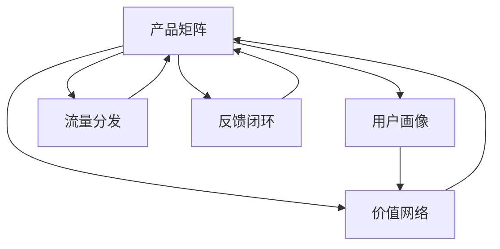

                 

# 知识付费创业的产品矩阵构建

## 1. 背景介绍

### 1.1 问题由来
随着移动互联网的普及和信息爆炸，知识付费逐渐成为用户获取高质量内容的新途径。国内知识付费市场从2016年兴起，随着各大知识付费平台的布局和用户习惯的养成，市场规模持续扩大，用户需求日益丰富。面对不断变化的市场环境，知识付费创业者需要在产品策略和商业模式上持续创新，以保持竞争优势。

### 1.2 问题核心关键点
知识付费创业的关键在于如何构建一个完善的产品矩阵，覆盖用户不同层次的需求，同时保持各个产品之间的协同效应。产品矩阵不仅包括内容生产、用户互动等基本环节，还应涵盖数据挖掘、平台生态等高级功能，以实现全面用户覆盖和高效运营。

### 1.3 问题研究意义
构建有效的产品矩阵，对于知识付费平台的长期发展至关重要。它不仅能够提高用户粘性，增加用户付费意愿，还能促进内容价值的最大化挖掘，推动平台生态的良性循环。研究如何构建合理的知识付费产品矩阵，对于创业者寻找新的增长点和创新路径具有重要意义。

## 2. 核心概念与联系

### 2.1 核心概念概述

在知识付费创业中，构建产品矩阵需要明确几个关键概念：

- **产品矩阵**：指一个平台的全部产品，包括但不限于内容付费、社群互动、会员订阅、推荐系统、数据分析等，以覆盖用户不同的需求层次和行为模式。
- **用户画像**：指对目标用户群体的特征、需求、行为模式等的全面描述，用于指导产品的设计和运营。
- **价值网络**：指平台及其用户、内容创作者等各方之间的关系网络，通过构建良好的价值网络，可以实现内容创作与用户需求的精准对接。
- **流量分发**：指平台如何将用户流量有效分配给不同产品或服务，提高用户转化率和平台收益。
- **反馈闭环**：指平台通过用户反馈、行为数据等不断调整产品策略，形成持续优化的运营机制。

这些概念之间相互联系，共同构成了知识付费平台的产品矩阵。通过理解这些核心概念，我们可以更好地把握产品矩阵的设计原则和实现方法。

### 2.2 核心概念原理和架构的 Mermaid 流程图



这个Mermaid流程图展示了产品矩阵与其他核心概念之间的关系：

1. 用户画像(B)和价值网络(C)是构建产品矩阵的基础，用以明确目标用户和内容创作的价值导向。
2. 流量分发(D)和反馈闭环(E)是产品矩阵运行的保障，通过合理分配流量和持续优化，提升平台整体效率。
3. 产品矩阵(A)通过用户画像(B)、价值网络(C)、流量分发(D)、反馈闭环(E)的相互配合，形成了一个高效、持续优化的运营体系。

## 3. 核心算法原理 & 具体操作步骤
### 3.1 算法原理概述

知识付费产品矩阵的构建，本质上是一个基于用户需求和内容价值的系统设计过程。其核心在于如何通过产品策略和用户行为数据的分析，合理分配资源，提升平台整体的盈利能力和用户体验。

1. **用户画像构建**：通过数据分析和用户调研，构建全面的用户画像，包括用户基本信息、兴趣爱好、付费意愿等。
2. **价值网络搭建**：分析用户画像和内容创作情况，确定平台中各个节点的价值导向，如内容创作者、平台运营者、用户等。
3. **流量分配模型**：构建流量分配模型，基于用户画像和价值网络，合理分配流量至不同产品，如内容付费、社群互动等。
4. **反馈优化机制**：建立反馈优化机制，通过用户行为数据和反馈，持续调整产品策略，优化平台运营。

### 3.2 算法步骤详解

构建知识付费产品矩阵的具体步骤包括：

**Step 1: 数据收集与用户画像构建**
- 收集用户的基本信息、行为数据、消费数据等。
- 利用机器学习算法，如K-means聚类、Logistic回归等，构建用户画像，明确用户的基本特征和行为模式。

**Step 2: 价值网络分析**
- 分析用户画像和内容创作数据，确定平台中各节点的价值导向。
- 使用图模型，如网络图、邻接矩阵等，表示平台中各节点之间的关系，建立价值网络。

**Step 3: 流量分配策略设计**
- 根据价值网络，设计流量分配策略，如通过内容推荐、活动引导等方式，将流量分配至不同的产品。
- 利用推荐系统算法，如协同过滤、内容过滤等，优化流量分配效果。

**Step 4: 反馈闭环构建**
- 建立用户反馈收集机制，包括评分、评论、私信等。
- 利用数据分析和机器学习算法，持续优化产品策略和运营机制。

### 3.3 算法优缺点

构建知识付费产品矩阵的算法具有以下优点：
1. 覆盖全面：通过产品矩阵，平台能够覆盖用户不同层次的需求，提升用户体验和粘性。
2. 提升收益：通过合理的流量分配和内容价值最大化，平台能够提高整体收益和用户付费意愿。
3. 持续优化：通过反馈闭环机制，平台能够持续优化产品策略，保持竞争优势。

同时，该方法也存在以下局限性：
1. 数据依赖性高：构建产品矩阵需要大量用户数据和行为数据，数据不足可能导致策略失准。
2. 复杂度高：产品矩阵构建涉及多个维度的数据和算法，系统设计复杂度较高。
3. 效果评估困难：产品矩阵的优化效果评估困难，需要较长时间验证。

### 3.4 算法应用领域

知识付费产品矩阵的应用领域非常广泛，包括但不限于：

- 内容付费平台：如得到、喜马拉雅等，通过产品矩阵覆盖用户不同的内容需求，提升用户粘性和付费意愿。
- 在线教育平台：如Coursera、Udemy等，通过产品矩阵提供全面的课程内容和服务，满足用户多层次的学习需求。
- 知识分享社区：如知乎、Medium等，通过产品矩阵提升社区互动和知识分享效率，促进内容创作和用户参与。
- 企业培训平台：如网易云课堂、腾讯课堂等，通过产品矩阵提供企业培训服务，助力企业人才培养和人才增值。
- 个人知识管理工具：如Notion、Evernote等，通过产品矩阵提供知识管理、学习计划等功能，帮助用户高效管理个人知识。

## 4. 数学模型和公式 & 详细讲解 & 举例说明

### 4.1 数学模型构建

知识付费产品矩阵的构建，可以通过构建用户画像、价值网络、流量分配模型和反馈闭环等多个数学模型来实现。

- **用户画像构建**：利用用户行为数据，构建用户画像。
- **价值网络分析**：通过用户画像和内容创作数据，建立价值网络。
- **流量分配模型**：设计流量分配算法，优化流量分配效果。
- **反馈优化机制**：利用用户反馈和行为数据，持续优化产品策略。

### 4.2 公式推导过程

以用户画像构建为例，假设用户画像的特征向量为 $\mathbf{u}$，特征维度为 $d$。使用K-means算法，对用户特征向量进行聚类，得到用户画像 $\mathbf{u}$ 和对应的类别 $\mathbf{c}$。设每个用户特征向量 $\mathbf{u}_i$ 对应的权重为 $w_i$，则用户画像可以表示为：

$$
\mathbf{u} = \sum_{i=1}^{N} w_i \mathbf{u}_i
$$

其中 $N$ 为所有用户数量。

### 4.3 案例分析与讲解

以喜马拉雅为例，分析其知识付费产品矩阵构建的具体步骤和策略：

**Step 1: 数据收集与用户画像构建**
- 收集喜马拉雅用户的基本信息、行为数据、消费数据等。
- 利用K-means算法，将用户分为高价值用户、中价值用户和低价值用户三类。

**Step 2: 价值网络分析**
- 分析用户画像和内容创作数据，确定喜马拉雅平台中各个节点的价值导向，如内容创作者、平台运营者、用户等。
- 使用图模型，如网络图、邻接矩阵等，表示喜马拉雅平台中各节点之间的关系，建立价值网络。

**Step 3: 流量分配策略设计**
- 根据价值网络，设计流量分配策略，如通过内容推荐、活动引导等方式，将流量分配至不同的产品。
- 利用协同过滤算法，优化流量分配效果。

**Step 4: 反馈闭环构建**
- 建立用户反馈收集机制，包括评分、评论、私信等。
- 利用数据分析和机器学习算法，持续优化产品策略和运营机制。

## 5. 项目实践：代码实例和详细解释说明
### 5.1 开发环境搭建

在进行知识付费产品矩阵构建的实践前，我们需要准备好开发环境。以下是使用Python进行代码实现的环境配置流程：

1. 安装Anaconda：从官网下载并安装Anaconda，用于创建独立的Python环境。

2. 创建并激活虚拟环境：
```bash
conda create -n pyenv python=3.8 
conda activate pyenv
```

3. 安装PyTorch、Pandas、Numpy、Scikit-learn等常用工具包：
```bash
pip install pytorch pandas numpy scikit-learn
```

4. 安装Jupyter Notebook：
```bash
pip install jupyter notebook
```

完成上述步骤后，即可在`pyenv`环境中开始代码实现。

### 5.2 源代码详细实现

以下是一个简单的知识付费平台用户画像构建的代码实现示例：

```python
import pandas as pd
from sklearn.cluster import KMeans

# 加载用户数据
df = pd.read_csv('user_data.csv')

# 提取用户特征
features = df[['age', 'gender', 'education', 'income']]

# 构建K-means模型，将用户分为三类
kmeans = KMeans(n_clusters=3)
kmeans.fit(features)

# 获取用户类别
user_labels = kmeans.labels_

# 输出用户画像
for i, label in enumerate(user_labels):
    print(f'User {i+1} belongs to cluster {label+1}')
```

### 5.3 代码解读与分析

**代码解释**：
1. 首先，从用户数据CSV文件中加载数据，并提取需要分析的用户特征。
2. 使用K-means算法对用户特征进行聚类，将用户分为高价值用户、中价值用户和低价值用户三类。
3. 遍历用户标签，输出每个用户所属的簇号。

**分析**：
1. 用户画像构建是知识付费产品矩阵构建的基础，通过聚类算法，可以初步划分用户的价值等级。
2. 用户画像的多维度特征提取，可以更全面地描述用户特征，提高聚类效果。
3. 聚类算法的选择和参数设置，需要根据具体数据集进行调整，以达到最佳效果。

## 6. 实际应用场景
### 6.1 智能推荐系统

知识付费平台可以利用产品矩阵中的推荐系统，提升内容推荐的精准度，增加用户粘性。通过用户画像和价值网络分析，平台可以构建推荐算法模型，将用户与内容进行匹配，从而提高推荐效果。

以得到平台为例，其智能推荐系统通过分析用户行为数据和内容创作数据，为用户推荐最感兴趣的内容，增加用户停留时间和付费意愿。

### 6.2 社群互动系统

社群互动是知识付费平台的重要组成部分，可以通过产品矩阵中的社群模块，提升用户参与度和互动效果。通过构建价值网络，平台可以精准推送社群活动和讨论话题，吸引用户参与。

以知乎平台为例，其知识分享社区通过构建知识图谱和价值网络，推荐用户参与相关话题讨论，提升用户活跃度和知识分享效果。

### 6.3 会员订阅系统

会员订阅系统是知识付费平台的主要收入来源，可以通过产品矩阵中的会员订阅模块，提升用户付费意愿和平台收益。通过用户画像和价值网络分析，平台可以设计个性化订阅计划，满足用户多层次的需求。

以喜马拉雅平台为例，其会员订阅系统通过用户画像分析，推出会员专享课程和内容，提升会员价值感和平台收益。

### 6.4 未来应用展望

未来，知识付费产品矩阵将在更多领域得到应用，为知识传播和内容消费带来新的变革：

1. 智能教育平台：通过知识图谱和价值网络分析，提供个性化学习推荐，提升教育效果。
2. 企业培训系统：通过用户画像和价值网络分析，提供企业培训课程，助力企业人才培养和人才增值。
3. 个人知识管理工具：通过用户画像和推荐系统，提供个性化知识管理服务，帮助用户高效管理个人知识。
4. 内容付费平台：通过用户画像和推荐系统，提供个性化内容推荐，增加用户粘性和付费意愿。
5. 智能客服系统：通过知识图谱和推荐系统，提供智能客服解决方案，提升客服效率和用户体验。

## 7. 工具和资源推荐
### 7.1 学习资源推荐

为了帮助开发者系统掌握知识付费产品矩阵构建的理论基础和实践技巧，这里推荐一些优质的学习资源：

1. 《知识付费产品矩阵构建指南》系列博文：由知识付费平台技术专家撰写，深入浅出地介绍了知识付费产品矩阵的构建方法、实施策略和成功案例。
2. Coursera《知识付费平台运营》课程：斯坦福大学开设的课程，涵盖知识付费平台的用户管理、内容创作、流量运营等核心模块。
3. 《知识付费产品矩阵构建实战》书籍：介绍知识付费平台从用户画像构建到流量分配的全面方法论，提供了丰富的实战案例和代码示例。
4. Udemy《知识付费平台开发》课程：涵盖知识付费平台的开发技术栈、产品设计和运营策略，适合新手入门。
5. 知乎开源项目：知识分享社区开源项目，涵盖知识图谱构建、推荐系统优化等核心技术，提供了详细的代码实现和实验教程。

通过对这些资源的学习实践，相信你一定能够快速掌握知识付费产品矩阵构建的精髓，并用于解决实际的业务问题。

### 7.2 开发工具推荐

高效的开发离不开优秀的工具支持。以下是几款用于知识付费产品矩阵构建开发的常用工具：

1. Python：作为数据科学和机器学习的主流语言，Python以其简洁易读、库丰富著称，适合用于数据处理和模型构建。
2. Pandas：数据处理和分析工具，适合对大规模数据集进行快速处理和分析。
3. Scikit-learn：机器学习库，提供了丰富的算法实现和评估工具，适合用于用户画像构建和价值网络分析。
4. TensorFlow：开源机器学习库，支持分布式训练和模型优化，适合用于推荐系统和大规模数据分析。
5. Jupyter Notebook：交互式编程环境，适合用于数据探索、模型实验和代码分享。
6. Visual Studio Code：轻量级开发工具，支持Python、R、Java等多种语言，适合用于代码编写和项目管理。

合理利用这些工具，可以显著提升知识付费产品矩阵构建的开发效率，加快创新迭代的步伐。

### 7.3 相关论文推荐

知识付费产品矩阵构建涉及多个学科领域，以下是几篇相关领域的经典论文，推荐阅读：

1. Knowledge-Graph-Based Recommendation System：构建知识图谱推荐系统，提升知识付费平台的推荐效果。
2. User Behavior Analysis in Knowledge Paying Platforms：分析知识付费平台用户行为，构建个性化推荐系统。
3. Multi-Aspect Sentiment Analysis for User Feedback：基于多方面情感分析的用户反馈系统，用于评估和优化知识付费平台。
4. A Survey on Knowledge Sharing Platforms：综述知识分享平台的构建和运营策略，提供全面的理论基础。
5. Social Network Analysis in Knowledge Paying Platforms：分析知识付费平台中的社交网络结构，提升用户互动效果。

这些论文代表了大规模知识付费产品矩阵构建的理论基础，通过学习这些前沿成果，可以帮助研究者把握学科进展，激发更多的创新灵感。

## 8. 总结：未来发展趋势与挑战

### 8.1 总结

本文对知识付费产品矩阵的构建方法进行了全面系统的介绍。首先阐述了知识付费平台的用户画像、价值网络、流量分发和反馈闭环等核心概念，明确了构建产品矩阵的基础和原则。其次，从原理到实践，详细讲解了产品矩阵构建的具体步骤和关键算法，提供了完整的代码实现示例。最后，本文还探讨了知识付费产品矩阵在实际应用中的典型场景和未来趋势，展望了其潜在的创新路径和发展前景。

通过本文的系统梳理，可以看到，构建知识付费产品矩阵是一个复杂但高效的系统工程。通过科学的数据分析和算法设计，知识付费平台可以实现全面用户覆盖和高效运营，提升用户粘性和平台收益。未来，知识付费产品矩阵将在更多的领域得到应用，为知识传播和内容消费带来新的变革。

### 8.2 未来发展趋势

知识付费产品矩阵的未来发展趋势包括以下几个方面：

1. **AI技术的应用**：通过引入AI技术，如自然语言处理、图像识别等，提升内容推荐和用户互动的效果。
2. **区块链技术的应用**：利用区块链技术，保障知识付费平台的内容版权和用户隐私，提升平台的可信度和安全性。
3. **大数据分析的应用**：通过大数据分析，深入挖掘用户行为和内容创作规律，优化推荐算法和运营策略。
4. **智能客服的应用**：通过智能客服系统，提升用户互动效果，降低运营成本。
5. **个性化订阅的应用**：通过用户画像和推荐系统，提供个性化订阅计划，提升用户付费意愿和平台收益。

这些趋势将进一步推动知识付费平台的创新和发展，提升用户的知识获取体验和平台收益。

### 8.3 面临的挑战

尽管知识付费产品矩阵的构建已经取得了一定进展，但在迈向更加智能化、普适化应用的过程中，仍然面临诸多挑战：

1. **数据隐私和安全问题**：知识付费平台需要收集大量用户数据，如何在保障数据隐私和安全的前提下，进行数据分析和用户画像构建，是一个重要难题。
2. **算法模型的公平性问题**：推荐算法和个性化订阅模型可能会加剧用户群体之间的数字鸿沟，如何在算法设计中避免这一问题，是一个亟待解决的问题。
3. **用户行为预测的准确性问题**：用户行为预测是知识付费产品矩阵构建的核心，如何提高预测准确性，是一个技术难题。
4. **运营成本问题**：知识付费平台的运营成本较高，如何在保证用户体验的同时，控制成本，是一个重要的运营挑战。
5. **用户留存问题**：用户留存率是知识付费平台的核心指标，如何提升用户粘性，是一个长期的运营挑战。

解决这些挑战，需要知识付费平台在数据隐私、算法公平、模型优化、成本控制、用户留存等多个方面进行全面优化。

### 8.4 研究展望

面对知识付费产品矩阵构建面临的挑战，未来的研究需要在以下几个方面寻求新的突破：

1. **隐私保护技术**：开发基于差分隐私、联邦学习等技术的隐私保护算法，保障用户数据隐私。
2. **公平性算法**：研究公平性算法，确保推荐算法和个性化订阅模型不会加剧用户群体之间的数字鸿沟。
3. **增强学习**：利用增强学习技术，提升用户行为预测的准确性。
4. **成本控制算法**：研究成本控制算法，优化知识付费平台的运营效率和成本控制。
5. **用户留存模型**：开发用户留存模型，提升用户粘性和平台留存率。

这些研究方向将为知识付费平台的产品矩阵构建提供新的解决方案，推动平台向更加智能化、普适化的方向发展。

## 9. 附录：常见问题与解答

**Q1: 知识付费产品矩阵如何覆盖用户不同层次的需求？**

A: 知识付费产品矩阵通过构建用户画像和价值网络，可以全面了解用户的基本特征和行为模式。通过分析不同用户的特征，设计多层次的产品和服务，满足用户不同的需求层次。例如，对于高价值用户，可以提供深度课程和专属服务；对于中价值用户，可以提供免费试用和基础课程；对于低价值用户，可以提供免费体验和基本服务。

**Q2: 知识付费产品矩阵在运营中如何防止过拟合？**

A: 过拟合是知识付费产品矩阵构建中常见的风险。防止过拟合的方法包括：
1. 数据多样性：确保数据集的多样性，避免模型对特定数据集的过度拟合。
2. 正则化技术：使用L1/L2正则化、Dropout等技术，防止模型过拟合。
3. 模型验证：通过交叉验证等技术，评估模型的泛化能力，避免模型过拟合。
4. 用户反馈：通过用户反馈机制，及时调整产品策略，避免模型过拟合。

**Q3: 知识付费平台如何利用大数据分析提升运营效果？**

A: 大数据分析在知识付费平台运营中具有重要意义，可以通过以下方式提升运营效果：
1. 用户行为分析：通过分析用户行为数据，了解用户需求和行为模式，优化推荐算法和个性化订阅模型。
2. 内容创作分析：通过分析内容创作数据，了解内容创作规律，提升内容创作质量和平台内容供给。
3. 用户画像分析：通过分析用户画像数据，设计多层次的产品和服务，满足用户不同层次的需求。
4. 流量分配分析：通过分析流量数据，优化流量分配策略，提高用户转化率和平台收益。
5. 反馈闭环分析：通过分析用户反馈数据，持续优化产品策略，提升用户体验和平台粘性。

**Q4: 知识付费平台如何通过AI技术提升内容推荐效果？**

A: 通过引入AI技术，知识付费平台可以提升内容推荐的精准度。具体方法包括：
1. 自然语言处理：利用自然语言处理技术，分析用户评论和反馈，了解用户对内容的兴趣和评价。
2. 图像识别：利用图像识别技术，分析内容中的图片和视频，提升内容推荐的多样性。
3. 语音识别：利用语音识别技术，分析用户听书行为，提升听书内容的推荐效果。
4. 推荐系统算法：引入协同过滤、内容过滤等推荐算法，优化内容推荐效果。
5. 增强学习：利用增强学习技术，不断优化推荐算法，提升内容推荐的个性化和精准度。

**Q5: 知识付费平台如何通过区块链技术保障内容版权和用户隐私？**

A: 区块链技术在知识付费平台中的应用，可以有效保障内容版权和用户隐私。具体方法包括：
1. 内容版权登记：利用区块链技术，对内容进行版权登记，确保内容的版权保护。
2. 用户隐私保护：利用区块链技术，保障用户隐私数据的安全存储和传输。
3. 智能合约：利用智能合约技术，自动化管理版权和使用许可，提升版权保护的效率和安全性。
4. 去中心化存储：利用去中心化存储技术，分散存储用户数据，提升数据的安全性和隐私保护水平。
5. 用户认证：利用区块链技术，进行用户身份认证，确保用户身份的真实性和安全性。

以上是关于知识付费创业中产品矩阵构建的全面介绍，通过理解和应用这些方法和工具，相信知识付费创业者可以在激烈的市场竞争中保持领先优势，构建更加智能化、普适化的知识付费平台。

