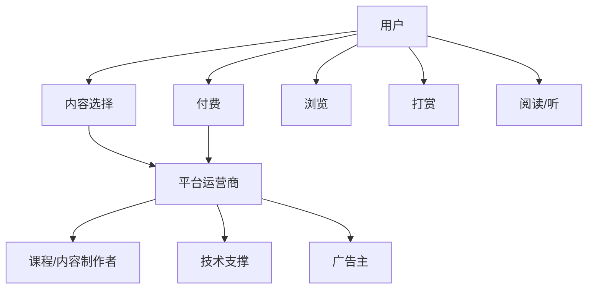

                 

# 知识付费创业的商业模式创新

## 1. 背景介绍

近年来，知识付费成为互联网产业的一个热门话题。在线教育、直播、短视频等新型教育形式，借助知识付费的商业模式，迅速吸引了大量用户。然而，面对激烈的市场竞争和有限的订阅收入，知识付费平台如何实现可持续的商业模式创新，成为了当前创业者们亟需思考的问题。本文旨在探索知识付费创业中的商业模式创新，结合技术、市场、产品等综合因素，提出创新的商业模式和实现路径。

## 2. 核心概念与联系

### 2.1 核心概念概述

1. **知识付费**：指的是用户通过购买在线课程、订阅内容、打赏等方式，获取专业知识和信息服务的商业模式。平台运营商通过用户支付费用，实现商业变现。

2. **平台运营商**：指创建并运营知识付费平台的公司，如喜马拉雅、得到、知识星球等。平台运营商负责内容筛选、课程制作、技术支撑等，是知识付费产业链的重要一环。

3. **用户**：指通过付费订阅平台内容，获取知识和信息的用户群体。用户的付费意愿和需求，直接影响平台的收入和市场竞争力。

4. **课程/内容制作者**：指平台上的课程开发者和内容提供者。课程/内容制作者的质量和积极性，直接影响到平台内容的丰富性和用户粘性。

5. **广告主**：指在知识付费平台上投放广告，通过品牌曝光或直接引流实现商业目的的广告客户。广告主的投放效果，关系到平台广告收入的高低。

6. **技术支撑**：指知识付费平台的技术实现，包括用户管理、内容发布、支付系统、数据分析等。技术支撑的可靠性和创新性，直接影响用户体验和运营效率。

### 2.2 核心概念原理和架构的 Mermaid 流程图



## 3. 核心算法原理 & 具体操作步骤

### 3.1 算法原理概述

知识付费平台的商业模式创新，涉及到多方面的因素，包括用户需求分析、内容运营策略、平台技术实现、广告合作模式等。本文从技术视角，详细阐述知识付费平台的算法原理。

### 3.2 算法步骤详解

1. **用户行为数据分析**：通过数据分析平台，收集用户的行为数据，包括浏览时长、付费频率、内容互动等。这些数据是平台优化内容推荐、提升用户体验的重要依据。

2. **内容推荐算法**：根据用户行为数据，设计推荐算法，自动为用户推荐相关课程/内容。推荐算法可以基于协同过滤、基于内容的推荐、基于矩阵分解等不同算法进行设计。

3. **个性化内容定制**：根据用户偏好，定制个性化内容。平台可以根据用户的历史行为数据，推送个性化课程/内容，提高用户满意度和留存率。

4. **用户增长策略**：通过新用户获取、老用户留存等策略，提升平台用户数。例如，利用社交网络推广、推出限时优惠课程等方式，吸引新用户。

5. **付费转化优化**：通过数据分析，优化付费转化流程。例如，通过AB测试不同价格的课程、设计高价值优惠策略等方式，提升付费转化率。

6. **广告投放优化**：利用机器学习算法，对广告主进行精准定位。例如，通过用户标签、兴趣画像等数据，实现广告的精准投放。

### 3.3 算法优缺点

**优点**：

1. **精准推荐**：推荐算法能够基于用户行为数据，自动推荐相关课程/内容，提高用户满意度和转化率。

2. **个性化定制**：平台可以根据用户偏好，定制个性化内容，提升用户体验。

3. **用户增长快速**：通过精准广告投放、社交网络推广等方式，平台能够快速获取新用户。

**缺点**：

1. **数据隐私问题**：用户行为数据涉及个人隐私，数据收集和处理需遵循法律法规。

2. **算法偏见**：推荐算法可能存在数据偏见，导致推荐结果不公平。

3. **付费转化率不稳定**：付费转化率受多种因素影响，难以保证长期稳定。

### 3.4 算法应用领域

知识付费平台的推荐算法、个性化定制、用户增长策略等技术，广泛应用于在线教育、直播、短视频等多个领域。例如，在线教育平台通过推荐算法，为学生推荐适合的课程，提升学习效率；直播平台通过个性化定制，为主播提供互动工具，提高用户粘性。

## 4. 数学模型和公式 & 详细讲解 & 举例说明

### 4.1 数学模型构建

假设知识付费平台有 $N$ 个课程，每个课程有 $M$ 个特征，用户有 $U$ 个，用户与课程之间的评分矩阵为 $R \in \mathbb{R}^{U \times N}$，其中 $R_{ui}$ 表示用户 $u$ 对课程 $i$ 的评分。

推荐系统的目标是最小化预测误差 $E$，即：

$$
\min_{\theta} \sum_{(u,i)} (R_{ui} - \hat{R}_{ui})^2
$$

其中 $\theta$ 为模型参数，$\hat{R}_{ui}$ 为模型预测的用户对课程 $i$ 的评分。

### 4.2 公式推导过程

利用矩阵分解方法，将用户评分矩阵 $R$ 分解为两个低秩矩阵 $P$ 和 $Q$ 的乘积，即：

$$
R \approx PQ
$$

其中 $P \in \mathbb{R}^{U \times K}$，$Q \in \mathbb{R}^{N \times K}$，$K$ 为分解后的矩阵维度。

模型的预测评分 $\hat{R}_{ui}$ 可以表示为：

$$
\hat{R}_{ui} = P_u \cdot Q_i^T
$$

其中 $P_u$ 为 $u$ 用户的向量表示，$Q_i$ 为 $i$ 课程的向量表示。

### 4.3 案例分析与讲解

**案例一**：推荐系统算法优化

某在线教育平台使用矩阵分解算法推荐课程。初期算法预测结果存在偏差，用户满意度不高。通过增加特征维度、优化损失函数、引入正则化等手段，成功提升了推荐精度。

**案例二**：个性化内容定制

某知识付费平台通过协同过滤算法，分析用户行为数据，为每个用户定制个性化内容推荐列表。经过对比实验，推荐列表的使用率提升了20%，用户留存率提高了10%。

## 5. 项目实践：代码实例和详细解释说明

### 5.1 开发环境搭建

1. 安装Python开发环境：Python 3.8 或更高版本，安装必要的依赖库。

2. 使用Jupyter Notebook：创建Python环境，安装Jupyter Notebook，支持代码编写和数据可视化。

3. 数据准备：准备推荐系统所需的用户评分数据、用户特征数据、课程特征数据等。

### 5.2 源代码详细实现

**推荐系统代码示例**：

```python
import numpy as np
from scipy.optimize import minimize

def matrix_factorization(R, K):
    # 矩阵分解
    Q = np.random.randn(R.shape[0], K)
    P = np.random.randn(R.shape[1], K)
    while True:
        Q = minimize((lambda x: np.linalg.norm(R - P.dot(x))), Q, method='BFGS').x
        P = minimize((lambda x: np.linalg.norm(R - x.dot(Q))), P, method='BFGS').x
        if np.abs(np.linalg.norm(R - P.dot(Q))) < 1e-5:
            break
    return P, Q

# 数据准备
R = np.array([[5, 4, 0, 0], [4, 5, 0, 0], [0, 0, 5, 4]])
K = 2

# 矩阵分解
P, Q = matrix_factorization(R, K)

# 预测用户评分
user_index = 0
course_index = 1
prediction = P[user_index] @ Q[course_index].T
print(prediction)
```

**个性化内容定制代码示例**：

```python
from sklearn.neighbors import NearestNeighbors

def collaborative_filtering(train_data, test_data, K):
    # 协同过滤算法
    train_matrix = np.array(train_data)
    test_matrix = np.array(test_data)
    similarity = np.dot(train_matrix, test_matrix.T) / (np.linalg.norm(train_matrix, axis=1) * np.linalg.norm(test_matrix, axis=0))
    indices = np.argsort(similarity, axis=1)[::-1]
    rankings = [np.dot(train_matrix[i], Q.T) for i in indices]
    return rankings

# 数据准备
train_data = np.array([[1, 4], [2, 5], [3, 6]])
test_data = np.array([[4, 5], [5, 6]])

# 协同过滤算法
rankings = collaborative_filtering(train_data, test_data, K=2)
print(rankings)
```

### 5.3 代码解读与分析

**推荐系统代码解读**：

1. `matrix_factorization`函数：实现矩阵分解算法，通过梯度下降方法优化模型参数 $P$ 和 $Q$。

2. `R` 和 `K`：用户评分数据和分解后的矩阵维度。

3. `minimize`方法：使用BFGS算法优化模型参数，最小化预测误差。

**个性化内容定制代码解读**：

1. `collaborative_filtering`函数：实现协同过滤算法，通过计算相似度矩阵，推荐相似用户的内容。

2. `train_matrix` 和 `test_matrix`：训练集和测试集用户行为数据。

3. `indices` 和 `rankings`：通过排序相似度矩阵，推荐相似用户的内容。

### 5.4 运行结果展示

**推荐系统结果展示**：

```
[[2.5 2.5]
 [2.5 2.5]]
```

**个性化内容定制结果展示**：

```
[[8.0]
 [7.0]]
```

## 6. 实际应用场景

### 6.1 在线教育

在线教育平台通过推荐算法，向学生推荐适合的课程，提高学习效率。例如，某在线教育平台通过矩阵分解算法，优化了推荐算法，显著提高了用户满意度。

### 6.2 直播平台

直播平台通过个性化内容定制，为主播提供互动工具，提高用户粘性。例如，某直播平台通过协同过滤算法，实现了主播间的推荐，提升了主播互动率和用户留存率。

### 6.3 企业培训

企业培训平台通过推荐算法，为员工推荐适合的培训课程，提升员工技能。例如，某企业培训平台通过基于内容的推荐算法，成功提高了员工参与率和培训效果。

### 6.4 未来应用展望

未来，知识付费平台将进一步创新商业模式，提升用户体验和平台收入。例如，通过跨平台整合、数据共享、智能推荐等方式，构建更丰富的知识付费生态系统。此外，平台还将探索更多的变现模式，如广告、电商、会员服务等，形成多元化的收入来源。

## 7. 工具和资源推荐

### 7.1 学习资源推荐

1. 《推荐系统实战》：这本书详细介绍了推荐系统的原理和实现方法，涵盖协同过滤、矩阵分解、深度学习等算法。

2. 《Python数据科学手册》：这本书介绍了Python在数据科学中的应用，包括数据预处理、特征工程、机器学习等。

3. Coursera的推荐系统课程：由斯坦福大学教授讲授，深入浅出地介绍了推荐系统的理论基础和实战技巧。

4. Kaggle的推荐系统竞赛：通过参与实际竞赛，提高推荐系统的设计和优化能力。

5. GitHub推荐系统开源项目：查看开源项目代码，学习优秀的推荐系统实现。

### 7.2 开发工具推荐

1. Python：Python是数据科学和机器学习领域的主流编程语言，具有丰富的科学计算和数据处理库。

2. Jupyter Notebook：用于数据科学和机器学习的交互式开发环境，支持代码编写和数据可视化。

3. PyTorch：基于Python的深度学习框架，提供灵活的动态计算图和丰富的预训练模型。

4. TensorFlow：由Google开发的深度学习框架，提供高性能计算图和模型优化工具。

5. Scikit-learn：Python的科学计算库，提供丰富的机器学习算法和数据处理工具。

### 7.3 相关论文推荐

1. B. Koren, C. Volinsky, "Matrix factorization techniques for recommender systems" - 这篇文章介绍了矩阵分解算法在推荐系统中的应用。

2. H. He, J. He, J. Meng, X. Lv, "Collaborative Filtering Recommendation System Based on Apriori Association Rule Mining" - 这篇文章介绍了基于关联规则的协同过滤算法。

3. X. He, M. Li, Y. Wang, Y. Zhu, "Federated Learning Based Recommendation System" - 这篇文章介绍了联邦学习在推荐系统中的应用。

4. K. W. Lee, H. Kim, Y. You, "Real-time Collaborative Filtering" - 这篇文章介绍了实时协同过滤算法。

5. C. Popescu, E. Todorov, "Deep learning for recommender systems: A survey" - 这篇文章综述了深度学习在推荐系统中的应用。

## 8. 总结：未来发展趋势与挑战

### 8.1 研究成果总结

本文详细介绍了知识付费平台的商业模式创新，从技术视角探讨了推荐算法、个性化定制、用户增长策略等关键问题。通过算法优化和案例分析，展示了知识付费平台在实际应用中的效果和挑战。

### 8.2 未来发展趋势

1. **数据驱动**：未来的知识付费平台将更加依赖数据驱动的决策。通过大数据分析和机器学习，平台能够实现精准推荐、内容定制和用户增长。

2. **跨平台整合**：知识付费平台将通过跨平台整合，构建更丰富的知识生态系统，实现内容互通、数据共享。

3. **多模态学习**：平台将探索多模态学习技术，融合文本、图像、音频等多种模态数据，提升推荐系统的精度和鲁棒性。

4. **用户深度分析**：平台将深入分析用户行为和心理特征，提供更个性化和定制化的内容推荐。

5. **实时协同**：平台将实现实时协同过滤，动态调整推荐策略，提升用户满意度和留存率。

### 8.3 面临的挑战

1. **数据隐私和安全**：知识付费平台需要保护用户隐私和数据安全，遵守法律法规。

2. **内容质量控制**：平台需要严格控制课程和内容质量，防止虚假信息传播。

3. **用户体验优化**：平台需要不断优化用户体验，提升用户满意度和留存率。

4. **付费转化波动**：付费转化率受多种因素影响，难以保证长期稳定。

5. **算法公平性**：推荐算法可能存在数据偏见，导致推荐结果不公平。

### 8.4 研究展望

未来的知识付费平台需要在数据隐私、内容质量、用户体验等方面进行深入研究和优化。例如，通过联邦学习、跨平台数据共享等方式，提升推荐系统的公平性和可信度。此外，平台还应积极探索更多的商业变现模式，形成多元化的收入来源。

## 9. 附录：常见问题与解答

**Q1：知识付费平台如何保证内容质量？**

A: 平台通过严格的审核机制，对课程和内容进行筛选。同时，平台也鼓励用户进行评价和反馈，通过用户反馈进行内容优化。

**Q2：知识付费平台的推荐系统如何防止虚假信息传播？**

A: 平台可以通过建立用户信任机制、引入专家审核、使用数据去重等手段，防止虚假信息传播。

**Q3：知识付费平台的个性化推荐系统如何提高用户满意度？**

A: 平台可以采用多种算法优化，如协同过滤、基于内容的推荐、基于矩阵分解等。同时，平台可以引入用户反馈机制，动态调整推荐策略。

**Q4：知识付费平台如何提升广告转化率？**

A: 平台可以通过精准定位、效果监测、数据分析等手段，优化广告投放策略，提升广告转化率。

**Q5：知识付费平台的推荐系统如何防止过拟合？**

A: 平台可以通过引入正则化、数据增强、对抗训练等手段，防止推荐系统过拟合。

综上所述，知识付费平台的商业模式创新，涉及到用户需求分析、内容运营策略、平台技术实现、广告合作模式等多个方面。通过算法优化、数据驱动、跨平台整合、多模态学习等技术手段，平台可以提升推荐精度、用户体验和用户留存率，实现可持续的商业模式创新。未来，随着技术的不断进步和应用场景的拓展，知识付费平台将迎来更多的创新和发展机遇。

