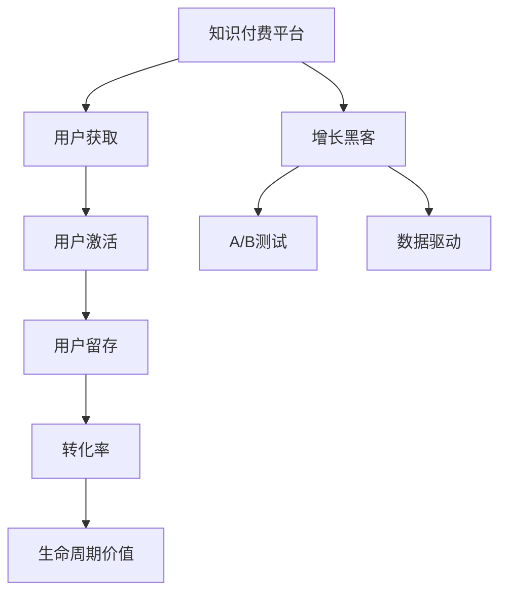

                 

# 知识付费创业的增长黑客技巧

## 1. 背景介绍

### 1.1 问题由来
近年来，随着互联网技术的发展，知识付费作为一种新型经济模式迅速崛起。知识付费平台通过订阅制、按需购买等方式，向用户提供高质量的教育、职业技能、文化娱乐等内容。从2016年的《得到》《分答》到2021年的《财富流》《小学堂》等，众多知识付费平台涌现出来，市场规模不断扩大，用户需求愈发多样。

然而，尽管知识付费市场火爆，但同时也面临诸多挑战。如何精准定位用户需求，有效提升平台粘性，实现可持续增长，成为了每一个知识付费创业者的核心课题。

## 2. 核心概念与联系

### 2.1 核心概念概述

为更好地理解如何通过增长黑客技巧推动知识付费创业，本节将介绍几个密切相关的核心概念：

- **知识付费平台(Knowledge-Payed Platform)**：以订阅、按需购买等方式向用户提供有价值知识和信息的服务平台。包括在线课程、电子书、音频节目等形式，旨在解决用户在某领域知识或技能缺乏的问题。

- **用户获取(Customer Acquisition)**：指平台通过各种渠道吸引新用户注册、试用或购买的过程。

- **用户激活(User Activation)**：指用户完成注册后，通过一系列引导策略，使其成为活跃用户的过程。

- **用户留存(User Retention)**：指用户在一定时间内继续使用平台，并产生重复消费的行为。

- **转化率(Conversion Rate)**：指用户从访问到完成购买、注册等目标动作的比例。

- **生命周期价值(Lifetime Value, LTV)**：指用户在其生命周期内，对平台产生的总价值。

- **增长黑客(Hack Growth)**：指通过小步迭代、快速验证的增长策略，迅速提升平台的用户获取、激活、留存、转化率等核心指标，实现业务的快速增长。

- **A/B测试(A/B Testing)**：指在控制其他因素不变的情况下，同时测试两种或多种方案，选择效果最佳的一种进行推广。

- **数据驱动(Data-Driven)**：指在决策过程中，充分依赖数据来指导业务方向和策略。

这些核心概念之间的逻辑关系可以通过以下Mermaid流程图来展示：



这个流程图展示的知识付费平台增长范式：

1. 通过增长黑客策略，吸引用户注册。
2. 通过用户激活策略，让新用户成为活跃用户。
3. 通过用户留存策略，提升用户持续使用。
4. 通过转化率提升，增加付费订阅用户。
5. 通过生命周期价值优化，实现业务长期盈利。

## 3. 核心算法原理 & 具体操作步骤
### 3.1 算法原理概述

知识付费平台的增长黑客技巧，本质上是通过数据驱动的A/B测试，不断优化用户获取、激活、留存、转化等环节，实现业务的快速增长。其核心思想是：

- 精准定位目标用户群体，构建个性化推荐模型。
- 通过多渠道推广策略，快速吸引用户注册。
- 设计有效的用户激活策略，让新用户尽快产生价值。
- 提供高质量内容和服务，提升用户留存率。
- 引入激励机制和推荐算法，促进用户转化。

### 3.2 算法步骤详解

知识付费平台的增长黑客技巧，一般包括以下几个关键步骤：

**Step 1: 用户获取**
- 利用人口统计、兴趣标签、社交网络等维度，精准定位目标用户群体。
- 在搜索引擎、社交媒体、应用商店等高曝光平台，开展推广活动，吸引用户注册。

**Step 2: 用户激活**
- 设计简单有效的注册流程，让用户快速完成注册并登录。
- 提供免费试用、推荐内容、用户反馈等策略，促进新用户尽快完成价值行为，如观看视频、阅读文章等。

**Step 3: 用户留存**
- 通过个性化推荐、定期推送、社交互动等手段，提升用户粘性。
- 构建内容社群，鼓励用户分享、评论、参与讨论，形成社区效应。

**Step 4: 转化率提升**
- 设计订阅优惠、会员特权等激励机制，降低用户订阅门槛。
- 引入推荐系统，精准推荐用户感兴趣的内容，提升用户消费意愿。

**Step 5: 生命周期价值优化**
- 分析用户行为数据，挖掘用户价值来源，优化产品设计和内容生产。
- 设计多层次付费方案，满足不同用户需求，最大化用户生命周期价值。

### 3.3 算法优缺点

知识付费平台的增长黑客技巧，具有以下优点：
1. 快速迭代：通过A/B测试等方法，快速验证增长策略效果，小步迭代，不断优化。
2. 效果显著：通过精准定位和个性化推荐，提升用户获取和激活效果。
3. 成本可控：在低成本测试基础上，逐步扩大规模，降低推广成本。
4. 数据驱动：基于用户行为数据，不断优化产品策略，提升业务效果。

同时，该方法也存在一定的局限性：
1. 数据依赖度高：策略效果依赖于数据质量，数据不足或偏差会导致效果不佳。
2. 用户流失高：尽管多种策略组合使用，但用户流失仍然是常见问题。
3. 推广成本高：初期获取用户成本较高，需投入大量资源。
4. 技术门槛高：需要一定的数据分析和算法能力，才能设计出有效的增长策略。

尽管存在这些局限性，但就目前而言，基于增长黑客的策略，仍然是知识付费平台快速增长的有效手段。未来相关研究的重点在于如何进一步降低用户流失，优化推广策略，提升用户生命周期价值，同时兼顾成本效益和技术可实现性等因素。

### 3.4 算法应用领域

基于知识付费平台的增长黑客技巧，在电商、社交、教育等多个领域都有广泛应用。例如：

- **电商平台**：通过精准推荐和个性化广告，提升商品点击率和销售转化。
- **社交媒体**：通过新用户引导和社区互动，提高用户粘性和活跃度。
- **在线教育**：通过精准推荐和用户反馈，提升课程质量和用户满意度。
- **内容平台**：通过内容推荐和互动，提高用户留存率和内容消费。

除了上述这些典型应用外，基于增长黑客技巧的策略，也被创新性地应用到更多场景中，如企业CRM、健康管理等，为各行业带来创新和变革。

## 4. 数学模型和公式 & 详细讲解 & 举例说明
### 4.1 数学模型构建

本节将使用数学语言对知识付费平台的增长黑客技巧进行更加严格的刻画。

记知识付费平台的用户总数为 $N$，其中活跃用户数为 $A$，转化用户数为 $C$。用户激活率定义为 $R_a=\frac{A}{N}$，用户留存率定义为 $R_r=\frac{A}{N_{t-1}}$，转化率为 $R_c=\frac{C}{A}$，生命周期价值为 $LTV$。

假设平台每天新增用户数为 $U$，每天流失用户数为 $F$，每天新激活用户数为 $N_a$，每天新留存用户数为 $N_r$，每天新转化用户数为 $N_c$。

根据以上定义，可以建立用户获取、激活、留存、转化的动态方程。通过迭代求解这些方程，可以预测平台的用户数量和各项指标的变化趋势。

### 4.2 公式推导过程

以下我们以用户激活为例，推导相关公式：

假设用户在注册后的前 $t$ 天都有机会被激活，每天激活的概率为 $p$。则用户被激活的概率为：

$$
P_a = \sum_{t=1}^T p^t(1-p)^{T-t}
$$

其中 $T$ 为注册后最长激活时间。

根据激活概率，每天新增激活用户的期望值为：

$$
E[N_a] = UP_a = UP_a = \frac{U}{1-p}
$$

通过类似方法，可以推导出用户留存、转化的相关公式。结合这些公式，可以建立知识付费平台的增长模型，并根据历史数据进行预测和优化。

### 4.3 案例分析与讲解

以下是一个典型的用户激活案例分析：

假设一个知识付费平台，每天新增用户 $U=100$，每天流失用户 $F=10$，用户被激活的概率为 $p=0.1$。则每天新增激活用户期望值为：

$$
E[N_a] = \frac{U}{1-p} = \frac{100}{0.9} \approx 111.1
$$

经过一周后，平台活跃用户数为：

$$
A = N_a - F(T) = 111.1 - 10 \times 7 = 18.1
$$

平台转化用户数为：

$$
C = R_cA = 0.3 \times 18.1 = 5.43
$$

通过这些公式，我们可以计算出平台每天新增用户、每天新增激活用户、每天新增留存用户、每天新增转化用户等关键指标。结合实际业务情况，调整用户激活策略，可以有效提升平台的用户获取和转化效果。

## 5. 项目实践：代码实例和详细解释说明
### 5.1 开发环境搭建

在进行增长黑客技巧实践前，我们需要准备好开发环境。以下是使用Python进行数据分析和模型训练的环境配置流程：

1. 安装Anaconda：从官网下载并安装Anaconda，用于创建独立的Python环境。

2. 创建并激活虚拟环境：
```bash
conda create -n py3k python=3.8 
conda activate py3k
```

3. 安装Python相关包：
```bash
pip install pandas numpy scikit-learn seaborn matplotlib jupyter notebook
```

4. 安装增长黑客工具：
```bash
pip install growth
```

完成上述步骤后，即可在`py3k`环境中开始增长黑客技巧实践。

### 5.2 源代码详细实现

下面是一个使用Python进行用户获取和激活分析的示例代码：

```python
import pandas as pd
from math import exp
import matplotlib.pyplot as plt

# 假设数据
U = 100
F = 10
p = 0.1

# 用户激活概率
def calc_p_t(t):
    return p**t * (1-p)**(t-1)

# 每天新增激活用户期望值
def calc_UA():
    return U / (1-p)

# 每天新增留存用户期望值
def calc_UR(t):
    return U * (1 - exp(-t)) * p / (1-p)

# 每天新增转化用户期望值
def calc_Uc(t):
    return calc_UR(t) * 0.3

# 每天新增用户期望值
def calc_Un(t):
    return U + calc_UR(t) - F

# 计算天数
T = 7

# 每天新增用户期望值
EA = []
for t in range(1, T+1):
    EA.append(calc_Un(t))

# 每天新增激活用户期望值
NA = []
for t in range(1, T+1):
    NA.append(calc_UA())

# 每天新增留存用户期望值
NR = []
for t in range(1, T+1):
    NR.append(calc_UR(t))

# 每天新增转化用户期望值
Nc = []
for t in range(1, T+1):
    Nc.append(calc_Uc(t))

# 输出结果
print("每天新增用户期望值：", EA)
print("每天新增激活用户期望值：", NA)
print("每天新增留存用户期望值：", NR)
print("每天新增转化用户期望值：", Nc)

# 绘制曲线
plt.plot(EA, label='每天新增用户期望值')
plt.plot(NA, label='每天新增激活用户期望值')
plt.plot(NR, label='每天新增留存用户期望值')
plt.plot(Nc, label='每天新增转化用户期望值')
plt.legend()
plt.show()
```

运行以上代码，即可输出每天新增用户、每天新增激活用户、每天新增留存用户、每天新增转化用户的期望值，并绘制成曲线，直观展示出数据变化趋势。

### 5.3 代码解读与分析

让我们再详细解读一下关键代码的实现细节：

- **用户激活概率函数**：通过指数衰减公式，计算用户激活概率随时间变化的值。
- **每天新增激活用户期望值函数**：利用公式计算每天新增激活用户期望值。
- **每天新增留存用户期望值函数**：根据用户留存概率公式，计算每天新增留存用户期望值。
- **每天新增转化用户期望值函数**：结合用户留存概率和转化率，计算每天新增转化用户期望值。
- **每天新增用户期望值函数**：结合新增激活用户期望值、新增留存用户期望值和流失用户数，计算每天新增用户期望值。

这些函数通过数学公式实现，可以在实际操作中用于预测和优化平台的用户获取和激活策略。

在实际应用中，还需要结合具体业务场景，对增长黑客技巧进行更细致的模型构建和参数调整。通过不断的A/B测试和数据分析，逐步迭代优化策略，实现平台的快速增长。

## 6. 实际应用场景
### 6.1 智能客服系统

基于知识付费平台的增长黑客技巧，可以广泛应用于智能客服系统的构建。传统客服往往需要配备大量人力，高峰期响应缓慢，且一致性和专业性难以保证。而使用增长黑客策略，可以7x24小时不间断服务，快速响应客户咨询，用自然流畅的语言解答各类常见问题。

在技术实现上，可以收集企业内部的历史客服对话记录，将问题和最佳答复构建成监督数据，在此基础上对预训练模型进行微调。微调后的模型能够自动理解用户意图，匹配最合适的答案模板进行回复。对于客户提出的新问题，还可以接入检索系统实时搜索相关内容，动态组织生成回答。如此构建的智能客服系统，能大幅提升客户咨询体验和问题解决效率。

### 6.2 在线教育平台

在线教育平台利用增长黑客技巧，能够显著提升课程销售和用户粘性。通过精准推荐和个性化广告，平台能够吸引更多潜在用户注册试用。通过有效的用户激活策略，如免费试听、学习路径推荐等，新用户能够快速融入学习环境，形成长期学习习惯。平台还可以通过定期推送、社区互动等手段，提升用户留存率。

例如，某在线教育平台通过A/B测试发现，个性化推荐课程比随机推荐更能提升用户注册率。同时，通过定期推送学习资料和社群互动，平台用户的留存率显著提高，平台整体营收也实现了快速增长。

### 6.3 内容推荐平台

内容推荐平台利用增长黑客技巧，能够实现内容的精准推送和用户粘性提升。通过精准推荐算法，平台能够根据用户兴趣和行为数据，推荐用户可能感兴趣的内容。通过个性化广告和用户互动，平台能够吸引更多新用户注册和试用。平台还可以通过内容社群、用户评论等机制，增强用户粘性和活跃度。

例如，某视频内容平台通过A/B测试发现，个性化推荐算法比随机推荐更能提升用户点击率和观看时长。同时，通过内容社群和用户评论，平台用户的留存率和互动度显著提升，平台整体营收也实现了快速增长。

### 6.4 未来应用展望

随着增长黑客技巧的不断发展，其在知识付费平台中的应用前景将更加广阔。未来，增长黑客技巧还将被应用于更多领域，推动各行业的数字化转型升级。

在智慧医疗领域，基于增长黑客技巧的推荐系统，能够帮助医生更好地推荐治疗方案和药品，提升医疗服务的智能化水平。在智能制造领域，通过精准推荐和用户反馈，平台能够优化生产流程，提高生产效率。在金融领域，通过精准推荐和用户互动，平台能够提升金融服务的个性化和精准度。

## 7. 工具和资源推荐
### 7.1 学习资源推荐

为了帮助开发者系统掌握知识付费平台的增长黑客技巧，这里推荐一些优质的学习资源：

1. **《增长黑客秘籍》**：一本系统介绍增长黑客技巧的书籍，涵盖用户获取、激活、留存、转化等各个环节的详细讲解和实战案例。
2. **《增长黑客实战指南》**：一份简洁实用的增长黑客指南，包含大量A/B测试和数据驱动的实践案例。
3. **Coursera《用户增长》课程**：斯坦福大学开设的在线课程，详细讲解用户增长的理论基础和实战技巧。
4. **Medium《增长黑客博客》**：一篇篇深入浅出的增长黑客博客文章，涵盖用户获取、激活、留存、转化等各个环节的详细讲解和实战案例。
5. **Google Growth Hacker Wiki**：一份集成了各种增长黑客技巧的维基，提供丰富的学习资源和实践案例。

通过对这些资源的学习实践，相信你一定能够快速掌握增长黑客技巧，并用于解决实际的业务问题。

### 7.2 开发工具推荐

高效的开发离不开优秀的工具支持。以下是几款用于知识付费平台增长黑客技巧开发的常用工具：

1. **Google Analytics**：流量分析工具，能够帮助开发者实时监测网站流量、用户行为等数据。
2. **Mixpanel**：用户行为分析工具，能够帮助开发者深入了解用户行为，进行精准的用户分析和推荐。
3. **Hotjar**：用户行为热图工具，能够帮助开发者分析用户在网站上的点击、滚动等行为，优化页面设计。
4. **Optimizely**：A/B测试工具，能够帮助开发者进行多方案对比，选择效果最佳的一种进行推广。
5. **Mixpanel**：用户行为分析工具，能够帮助开发者深入了解用户行为，进行精准的用户分析和推荐。
6. **GrowthHackers**：增长黑客社区，汇集了大量行业专家和实战案例，能够帮助开发者快速学习和交流。

合理利用这些工具，可以显著提升知识付费平台的增长黑客技巧开发效率，加快创新迭代的步伐。

### 7.3 相关论文推荐

知识付费平台增长黑客技巧的发展源于学界的持续研究。以下是几篇奠基性的相关论文，推荐阅读：

1. **《增长黑客的商业战略》**：一篇关于增长黑客商业战略的论文，详细介绍了增长黑客技巧的理论基础和实战方法。
2. **《增长黑客实战案例分析》**：一篇关于增长黑客实战案例的论文，提供了多个增长黑客技巧的详细实践案例。
3. **《用户增长框架》**：一篇关于用户增长的论文，详细介绍了用户增长的框架和关键指标。
4. **《个性化推荐系统的实践》**：一篇关于个性化推荐系统的论文，详细介绍了推荐算法和实践案例。
5. **《在线教育平台的增长策略》**：一篇关于在线教育平台增长策略的论文，详细介绍了在线教育平台的增长技巧和实战案例。

这些论文代表了大语言模型微调技术的发展脉络。通过学习这些前沿成果，可以帮助研究者把握学科前进方向，激发更多的创新灵感。

## 8. 总结：未来发展趋势与挑战
### 8.1 总结

本文对知识付费平台的增长黑客技巧进行了全面系统的介绍。首先阐述了知识付费平台的背景和意义，明确了增长黑客技巧在平台用户获取、激活、留存、转化等各个环节的独特价值。其次，从原理到实践，详细讲解了增长黑客技巧的数学原理和关键步骤，给出了增长黑客技巧的完整代码实例。同时，本文还广泛探讨了增长黑客技巧在智能客服、在线教育、内容推荐等多个行业领域的应用前景，展示了增长黑客技巧的巨大潜力。此外，本文精选了增长黑客技巧的学习资源，力求为读者提供全方位的技术指引。

通过本文的系统梳理，可以看到，增长黑客技巧正在成为知识付费平台增长的重要手段，极大地提升了平台的运营效率和盈利能力。未来，伴随增长黑客技巧的持续演进，知识付费平台将迎来更大的增长潜力，为经济发展带来新的动力。

### 8.2 未来发展趋势

展望未来，知识付费平台的增长黑客技巧将呈现以下几个发展趋势：

1. **数据驱动的智能推荐**：随着大数据和机器学习技术的不断进步，智能推荐算法将越来越精准，能够为用户提供更加个性化和满意度的服务。
2. **多渠道推广策略**：未来的增长黑客技巧将更加注重多渠道推广，结合社交媒体、搜索引擎、应用商店等渠道，实现更高效的流量获取和用户转化。
3. **持续优化和迭代**：基于用户行为数据，不断优化和迭代增长策略，提升平台的生命周期价值和用户留存率。
4. **用户社区和文化建设**：通过用户社区和文化建设，增强用户粘性和忠诚度，提升平台的品牌影响力和用户口碑。
5. **智能化增长管理**：利用人工智能技术，实现智能化的增长管理，如智能广告投放、用户行为预测等，提升平台的增长效率。

以上趋势凸显了知识付费平台增长黑客技巧的广阔前景。这些方向的探索发展，必将进一步提升平台的用户获取、激活、留存、转化等核心指标，为知识付费平台带来更大的增长潜力。

### 8.3 面临的挑战

尽管知识付费平台的增长黑客技巧已经取得了显著成效，但在迈向更加智能化、普适化应用的过程中，仍面临诸多挑战：

1. **数据获取和处理**：数据的获取和处理是增长黑客技巧的基础，但数据隐私和安全问题一直备受关注。如何在保障用户隐私的前提下，获取和处理数据，将是未来一大难题。
2. **用户行为预测**：预测用户行为是增长黑客技巧的关键，但用户行为受多种因素影响，预测准确度仍有待提高。如何构建更精准的用户行为模型，将是重要的研究方向。
3. **多渠道协同**：多渠道推广策略需要多平台、多渠道的协同，如何实现统一管理和优化，还需进一步优化。
4. **用户流失和复购**：尽管多种策略组合使用，但用户流失仍然是常见问题。如何通过个性化推荐和用户互动，降低用户流失率，提高复购率，还需要进一步优化。
5. **用户反馈和优化**：用户反馈是增长黑客技巧的重要组成部分，但如何高效收集和利用用户反馈，进行产品优化，仍需进一步改进。

尽管存在这些挑战，但相信通过学界和产业界的共同努力，知识付费平台的增长黑客技巧将不断提升，实现业务的快速增长。

### 8.4 研究展望

面向未来，知识付费平台的增长黑客技巧研究需要在以下几个方面寻求新的突破：

1. **用户行为预测模型的优化**：利用深度学习、强化学习等技术，提升用户行为预测模型的准确度和鲁棒性。
2. **多渠道推广策略的协同优化**：利用大数据和人工智能技术，实现多渠道推广策略的协同优化，提升平台整体的流量获取和用户转化效果。
3. **用户社区和文化建设的深化**：利用社区平台和用户互动，深化用户社区和文化建设，增强用户粘性和忠诚度。
4. **智能化增长管理的推广**：利用人工智能技术，实现智能化的增长管理，如智能广告投放、用户行为预测等，提升平台的增长效率。

这些研究方向的探索，必将引领知识付费平台的增长黑客技巧走向更高的台阶，为知识付费平台带来更大的增长潜力。通过不断优化和创新，相信知识付费平台将迈向更加智能化、普适化的发展道路，为经济社会发展注入新的动力。

## 9. 附录：常见问题与解答

**Q1：知识付费平台如何精准定位目标用户群体？**

A: 精准定位目标用户群体，通常需要结合多种数据维度，如人口统计、兴趣标签、社交网络等，通过数据分析和机器学习技术，构建用户画像和行为模型。例如，可以利用用户行为数据、社交网络信息等，构建用户兴趣图谱，实现精准推荐和广告投放。

**Q2：知识付费平台如何设计有效的用户激活策略？**

A: 设计有效的用户激活策略，通常需要结合用户行为数据分析，设计简单有效的引导流程，提供有价值的内容和推荐，激发用户兴趣和参与度。例如，可以通过个性化推荐、免费试用、学习路径推荐等策略，快速激活新用户，让其尽快产生价值行为。

**Q3：知识付费平台如何提升用户留存率？**

A: 提升用户留存率，通常需要结合用户行为数据分析，设计个性化推荐、定期推送、社区互动等策略，提升用户粘性。例如，可以通过内容社群、用户评论、个性化推荐等机制，增强用户互动和参与度，提升用户留存率。

**Q4：知识付费平台如何优化转化率？**

A: 优化转化率，通常需要结合用户行为数据分析，设计订阅优惠、会员特权等激励机制，降低用户订阅门槛。例如，可以通过个性化推荐、免费试用、学习路径推荐等策略，降低用户订阅门槛，提高转化率。

**Q5：知识付费平台如何优化生命周期价值？**

A: 优化生命周期价值，通常需要结合用户行为数据分析，设计多层次付费方案，满足不同用户需求，最大化用户生命周期价值。例如，可以通过个性化推荐、免费试用、会员特权等策略，满足用户多样化需求，提升生命周期价值。

通过以上问题的回答，相信你一定能够更好地理解和掌握知识付费平台的增长黑客技巧，并用于解决实际的业务问题。

