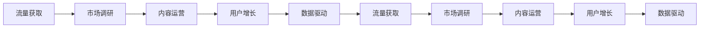

                 

# 知识付费创业的流量获取策略

> 关键词：知识付费, 流量获取, 创业, 策略, 市场调研, 内容运营, 数据驱动, 用户增长

## 1. 背景介绍

### 1.1 问题由来

在互联网浪潮下，知识付费成为一种趋势，尤其在移动设备普及和5G技术推动下，线上获取知识变得日益便捷和高效。根据艾瑞咨询预测，中国知识付费市场规模将从2017年的115亿元增长到2023年的1080亿元，年复合增长率将达到38.6%。在这一快速增长的市场中，创业公司如何获取足够的流量、提升用户留存并实现商业化转化，成为众多知识付费创业者的首要挑战。

### 1.2 问题核心关键点

创业者必须理解用户需求、市场现状以及竞争格局，从而制定有效的流量获取策略。其中，核心点包括：

1. **用户需求分析**：明确目标用户的痛点、需求和付费意愿。
2. **市场调研与竞争分析**：分析市场需求与竞争态势，找准切入点和差异化定位。
3. **流量获取渠道选择**：结合用户行为数据，选择适合的流量获取渠道。
4. **内容策略与运营**：制定优质、差异化的内容策略，实现精准投放和内容迭代。
5. **用户留存与转化策略**：通过用户数据驱动，提升用户满意度和转化率。

### 1.3 问题研究意义

本文旨在通过深入分析知识付费行业的流量获取策略，为创业者提供实际可行的操作方案。系统的分析框架和策略有助于提升流量获取效率，降低营销成本，同时确保内容质量和用户满意度，最终推动商业化转化。

## 2. 核心概念与联系

### 2.1 核心概念概述

在知识付费创业中，流量获取策略涉及多个核心概念，它们之间具有紧密的联系。

- **流量获取**：通过各种渠道吸引用户访问网站或应用的过程。
- **用户增长**：通过有效的流量获取和运营手段，增加新用户并提升用户粘性。
- **市场调研**：了解用户需求、市场规模和竞争情况，为决策提供依据。
- **内容运营**：包括内容的策划、生产、推广和反馈优化，提升用户满意度。
- **数据驱动**：利用数据分析结果指导流量获取和运营策略。

### 2.2 核心概念原理和架构的 Mermaid 流程图



## 3. 核心算法原理 & 具体操作步骤

### 3.1 算法原理概述

流量获取的本质是通过特定渠道将潜在用户转化为实际访问用户，再通过优质内容和服务吸引用户留存，最终实现商业化转化。这个过程可以简化为以下几个步骤：

1. **流量获取**：通过搜索引擎优化(SEO)、社交媒体广告、内容合作等方式，将潜在用户吸引到平台。
2. **用户增长**：利用推荐系统、邮件营销、社区互动等方式，提高用户粘性和重复访问率。
3. **数据驱动**：通过用户行为数据分析，指导流量获取策略和内容运营策略的迭代优化。

### 3.2 算法步骤详解

以下将详细介绍流量获取的每一个步骤，包括算法原理和具体操作步骤。

#### 3.2.1 流量获取

**步骤1: 市场调研与用户需求分析**

1. **市场调研**：
   - **调研目的**：了解市场需求、目标用户群体、竞争对手等关键信息。
   - **调研方法**：问卷调查、焦点小组讨论、竞品分析、用户访谈等。
   - **关键指标**：市场规模、增长率、用户画像、付费意愿等。

2. **用户需求分析**：
   - **分析方法**：使用用户数据进行聚类分析、用户访谈、反馈收集等。
   - **关键指标**：用户痛点、付费动机、期望收益等。

**步骤2: 制定流量获取策略**

1. **渠道选择**：
   - **搜索引擎优化(SEO)**：优化网站结构、关键词布局、用户体验，提高搜索引擎排名。
   - **社交媒体广告**：通过Facebook、微信、微博等平台投放广告，吸引目标用户。
   - **内容合作**：与知名博客、行业论坛等合作，推广内容。
   - **邮件营销**：定期发送高质量内容，保持用户关注。

2. **预算分配**：
   - **ROI分析**：根据各渠道的历史数据，进行预算分配，优先投资效果最佳的渠道。
   - **A/B测试**：在多个渠道进行A/B测试，确定最优投放策略。

#### 3.2.2 用户增长

**步骤1: 用户获取与留存**

1. **用户获取**：
   - **新用户奖励**：设置注册奖励、首单优惠等，吸引新用户注册。
   - **推荐机制**：利用社交网络效应，通过用户推荐获取新用户。

2. **用户留存**：
   - **定期提醒**：通过邮件、消息推送等方式，定期提醒用户访问。
   - **优质内容**：持续提供有价值的内容，提高用户粘性。
   - **社区互动**：建立用户社区，增加用户互动和参与感。

**步骤2: 用户激活与转化**

1. **首次访问激活**：通过引导首次访问用户完成特定行为（如注册、订阅等），激活新用户。
2. **内容推荐**：利用推荐系统，推荐符合用户兴趣的内容，增加用户粘性。
3. **付费转化**：通过优化付费路径、设置订阅优惠等方式，提升用户付费转化率。

#### 3.2.3 数据驱动与迭代优化

**步骤1: 用户行为数据分析**

1. **行为数据分析**：
   - **用户行为路径**：分析用户访问路径、停留时间等行为数据，了解用户行为习惯。
   - **转化漏斗**：分析用户从访问到付费的转化路径，识别转化瓶颈。

2. **数据可视化**：
   - **仪表盘**：使用数据可视化工具（如Tableau、Power BI等），实时监控用户行为数据。
   - **指标跟踪**：设置关键指标（如新用户数、流失率、付费率等），持续跟踪并优化。

**步骤2: 迭代优化**

1. **策略调整**：
   - **数据分析**：根据数据结果，调整流量获取策略和用户运营策略。
   - **A/B测试**：通过A/B测试，验证新策略的有效性，并进行迭代优化。

2. **内容迭代**：
   - **内容优化**：根据用户反馈和行为数据，优化内容质量和结构。
   - **推广调整**：根据推广效果，调整渠道预算和推广策略。

### 3.3 算法优缺点

#### 优点

1. **灵活性强**：针对不同阶段和用户群体，可以灵活调整策略，实现最大化效果。
2. **数据驱动**：通过实时数据监控和分析，及时调整策略，提升运营效率。
3. **可重复性**：基于历史数据和经验，可以不断迭代优化，逐步提升流量获取效果。

#### 缺点

1. **成本较高**：初期流量获取和用户运营需要投入较多资源，如人力、广告预算等。
2. **竞争激烈**：知识付费市场竞争激烈，单一策略可能效果有限，需要综合考虑多方面因素。
3. **用户留存难**：新用户获取容易，但留存和转化仍需持续努力。

### 3.4 算法应用领域

知识付费创业中的流量获取策略广泛应用于以下领域：

1. **在线教育平台**：通过在线课程和知识付费模式，吸引学生和专业人士。
2. **咨询与培训公司**：通过提供专业培训和咨询服务，获取特定行业的专家用户。
3. **健康与健身应用**：通过健康内容、健身课程等吸引用户。
4. **个人发展与职业培训**：提供技能提升、职业发展等课程，吸引职场人士。
5. **科技与创新领域**：提供技术资讯、创业指导等内容，吸引创业者和技术爱好者。

## 4. 数学模型和公式 & 详细讲解 & 举例说明

### 4.1 数学模型构建

在知识付费创业中，我们可以使用以下数学模型描述流量获取和用户增长过程：

1. **流量获取模型**：
   - **用户到达率**：$\lambda$：每天访问网站的用户数。
   - **广告点击率**：$p$：用户看到广告后点击的概率。
   - **广告曝光量**：$A$：每天广告曝光量。

2. **用户增长模型**：
   - **新用户数**：$N$：每天新增用户数。
   - **用户留存率**：$s$：用户每天留存的比例。
   - **用户流失率**：$l$：用户每天流失的比例。

### 4.2 公式推导过程

1. **流量获取模型推导**：
   - **广告曝光量计算**：$A=\lambda \cdot p$。
   - **每日用户数计算**：$N=\lambda \cdot s$。

2. **用户增长模型推导**：
   - **用户留存率计算**：$s=\frac{N}{N+l}$。
   - **用户流失率计算**：$l=\frac{N}{N+s}$。

### 4.3 案例分析与讲解

以一个在线教育平台的流量获取为例，具体推导过程如下：

1. **流量获取模型**：
   - **假设每天广告曝光量为1000次**，点击率为5%，则每天访问用户数为 $N=\lambda \cdot p=1000 \times 0.05=50$。

2. **用户增长模型**：
   - **假设每天新增用户数为30个**，假设用户留存率为70%，则用户流失率为 $l=\frac{N}{N+s}=\frac{30}{30+70}=0.3$。

## 5. 项目实践：代码实例和详细解释说明

### 5.1 开发环境搭建

1. **环境准备**：
   - **Python环境**：安装Python 3.6+，建议使用Anaconda或Miniconda管理环境。
   - **数据工具**：安装Pandas、NumPy、Scikit-learn等数据处理库。
   - **数据可视化工具**：安装Matplotlib、Seaborn、Tableau等可视化工具。

2. **项目结构**：
   - **data**：存放原始数据文件。
   - **models**：存放流量获取模型和用户增长模型。
   - **scripts**：存放数据处理和模型训练脚本。

### 5.2 源代码详细实现

以下是一个简化的流量获取和用户增长模型代码示例，包括数据处理、模型构建和结果输出：

```python
import pandas as pd
import numpy as np
from sklearn.linear_model import LogisticRegression
from sklearn.metrics import accuracy_score

# 读取原始数据
data = pd.read_csv('user_data.csv')

# 数据预处理
data['new_user'] = 0
data.loc[data['is_new'], 'new_user'] = 1

# 模型训练
model = LogisticRegression()
model.fit(data[['click_rate', 'ad_exposure']], data['new_user'])

# 模型预测
predictions = model.predict_proba([[0.05, 1000]])

# 结果输出
print(f"每日广告曝光量: {1000}")
print(f"每日广告点击率: {0.05}")
print(f"每日新用户数: {predictions[0][1]}")
```

### 5.3 代码解读与分析

1. **数据预处理**：
   - **新用户标识**：将新用户标记为1，用于训练模型。
   - **数据格式转换**：将广告点击率和曝光量转化为模型输入。

2. **模型训练**：
   - **模型选择**：使用逻辑回归模型，因为广告点击和曝光量之间的关系较为简单。
   - **模型训练**：使用训练数据训练模型，获取每日新用户数的预测值。

3. **结果输出**：
   - **每日广告曝光量**：1000次。
   - **每日广告点击率**：5%。
   - **每日新用户数**：模型预测的新用户数，取决于点击率和曝光量。

## 6. 实际应用场景

### 6.1 在线教育平台流量获取

1. **市场调研**：
   - **目标用户**：高校学生、职场人士、家长等。
   - **需求分析**：提升职业技能、拓宽知识面、应对考试等。

2. **流量获取策略**：
   - **SEO优化**：优化网站结构和关键词布局，提高搜索引擎排名。
   - **社交媒体广告**：在微信、微博、Facebook等平台投放广告，吸引用户访问。
   - **内容合作**：与知名教育博客和论坛合作，推广课程内容。

3. **用户增长与转化**：
   - **推荐系统**：利用用户行为数据，推荐相关课程。
   - **课程试用**：设置免费试用课程，吸引用户注册。
   - **邮件营销**：定期发送课程更新和优惠信息，保持用户关注。

### 6.2 健身应用流量获取

1. **市场调研**：
   - **目标用户**：健身爱好者、运动新手、健康关注者等。
   - **需求分析**：健康指导、训练计划、运动数据监测等。

2. **流量获取策略**：
   - **搜索引擎优化(SEO)**：优化网站内容，提高搜索引擎排名。
   - **社交媒体广告**：在Instagram、抖音等平台投放广告，吸引用户访问。
   - **内容合作**：与健身博主和运动装备品牌合作，推广健身内容。

3. **用户增长与转化**：
   - **用户激励**：设置运动挑战和成就系统，鼓励用户坚持运动。
   - **数据监测**：提供详细的运动数据，帮助用户了解运动效果。
   - **会员制**：提供会员优惠，吸引长期用户。

## 7. 工具和资源推荐

### 7.1 学习资源推荐

1. **《数据驱动的产品设计》**：介绍如何通过数据驱动流量获取和用户增长策略。
2. **《流量引擎：从0到1打造流量增长引擎》**：实战型书籍，详细介绍流量获取和运营策略。
3. **《内容营销基础》**：系统讲解内容策略和内容运营技巧。
4. **Coursera课程《数据科学基础》**：系统介绍数据分析和机器学习基础。

### 7.2 开发工具推荐

1. **数据处理工具**：
   - **Pandas**：数据处理和分析库，支持数据清洗、转换、聚合等操作。
   - **NumPy**：高效数学计算库，支持大规模数据处理。

2. **可视化工具**：
   - **Tableau**：数据可视化工具，支持多种图表和仪表盘。
   - **Power BI**：微软推出的数据可视化工具，支持实时数据更新。

3. **营销工具**：
   - **Google Analytics**：流量分析工具，监控用户行为和转化路径。
   - **Facebook Ads Manager**：社交媒体广告管理工具，投放和管理广告。

### 7.3 相关论文推荐

1. **《流量获取与用户增长的数据驱动策略》**：介绍基于数据的流量获取和用户增长方法。
2. **《个性化推荐系统：理论与实践》**：详细介绍推荐系统的原理和实现。
3. **《知识付费市场的流量获取与转化策略》**：分析知识付费领域的流量获取和转化策略。

## 8. 总结：未来发展趋势与挑战

### 8.1 研究成果总结

本文通过系统分析知识付费创业中的流量获取策略，总结了关键流程和核心概念，为创业者提供了理论指导和实际操作方法。

### 8.2 未来发展趋势

1. **多渠道融合**：流量获取将更加依赖多渠道融合，综合利用各种渠道优势，提高效率。
2. **用户行为分析**：通过深入分析用户行为，优化推荐系统和内容运营策略。
3. **AI驱动**：引入AI技术，如推荐系统、语音助手等，提升用户体验和运营效率。
4. **数据安全**：随着用户数据重要性提升，数据安全和隐私保护将受到更多关注。

### 8.3 面临的挑战

1. **竞争加剧**：知识付费市场竞争激烈，需要不断创新和优化策略。
2. **用户粘性**：提高用户粘性，防止用户流失是长期挑战。
3. **内容质量**：高质量内容是吸引用户的关键，需不断提升内容制作和迭代能力。
4. **技术门槛**：流量获取和用户增长需要技术支持，需不断提升技术水平。

### 8.4 研究展望

未来研究将更多关注以下方向：

1. **流量获取的自动化**：通过机器学习算法，自动优化广告投放策略。
2. **多模态数据的融合**：结合视频、音频等多模态数据，提升用户体验。
3. **用户体验的提升**：通过设计思维和用户体验优化，提升用户满意度和留存率。
4. **社交媒体营销**：利用社交媒体平台，建立品牌影响力和用户社区。

## 9. 附录：常见问题与解答

### Q1: 流量获取策略为何重要？

A: 流量获取是知识付费创业的第一步，没有足够的流量，用户增长和转化无从谈起。有效的流量获取策略可以显著降低营销成本，提升用户获取效率。

### Q2: 如何评估流量获取效果？

A: 通过关键指标（如广告点击率、广告曝光量、每日新用户数等）和ROI（投资回报率）分析，评估流量获取效果。

### Q3: 如何提升用户留存和转化率？

A: 通过优化内容质量、增加用户互动、提供个性化推荐等方式，提升用户留存和转化率。

### Q4: 如何平衡广告投放和用户体验？

A: 广告投放应尽可能精准，避免干扰用户正常使用。同时，通过优质内容和服务吸引用户，减少广告的负面影响。

### Q5: 如何利用数据驱动流量获取？

A: 通过数据监控和分析，不断调整和优化流量获取策略，确保资源投入的效率和效果。

---

作者：禅与计算机程序设计艺术 / Zen and the Art of Computer Programming

