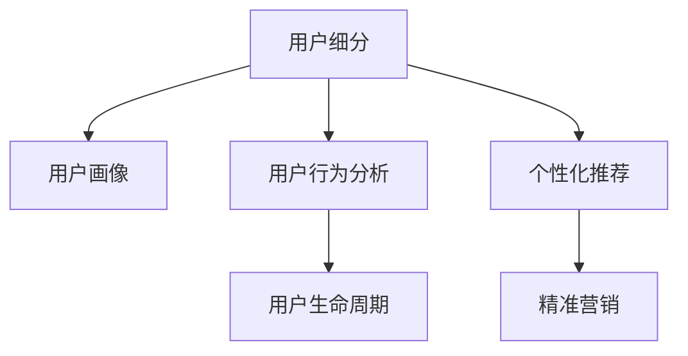

                 

## 1. 背景介绍

### 1.1 问题由来

知识付费作为一种新兴的商业模式，在互联网时代迅速崛起。通过为知识产品或服务定价，知识付费平台不仅解决了传统知识共享中的“免费搭便车”问题，还激发了知识生产者的创作热情，促进了优质知识的传播和变现。随着平台的不断发展，用户数量和内容类型不断丰富，知识付费市场也呈现出多元化和个性化需求的特点。然而，如何精准识别目标用户群体，并对其进行有效细分，成为知识付费创业成功的关键。

### 1.2 问题核心关键点

用户细分是知识付费创业中至关重要的一环。它涉及识别用户的关键属性、行为特征和价值需求，帮助企业制定精准的市场策略，提升用户体验和满意度。细分的关键在于：

- 识别核心用户群体：找到平台的主要用户来源，确保资源和内容的有效配置。
- 分类用户需求：根据不同用户群体的需求特点，提供差异化的产品和服务。
- 提升用户转化率：针对细分后的用户群体，制定针对性的营销策略，提升用户的购买意愿和忠诚度。

## 2. 核心概念与联系

### 2.1 核心概念概述

为了更好地理解用户群体细分的方法，我们首先介绍几个关键概念：

- **用户细分（User Segmentation）**：将用户群体根据特定标准划分为多个子群体，以便于进行针对性分析和营销。
- **用户画像（User Persona）**：通过收集和分析用户数据，构建理想化的用户模型，以指导产品和服务的开发。
- **用户行为分析（User Behavior Analysis）**：对用户在使用平台中的行为数据进行分析，理解其需求和偏好。
- **用户生命周期（User Lifecycle）**：描述用户从初次接触到最终流失的过程，帮助企业设计用户成长路径和营销策略。

这些概念之间的逻辑关系可以通过以下Mermaid流程图来展示：



此流程图展示了用户群体细分的全过程，从数据收集和分析到用户画像构建，再到个性化推荐和精准营销，形成一个闭环系统。

## 3. 核心算法原理 & 具体操作步骤
### 3.1 算法原理概述

用户群体细分的核心算法原理主要包括聚类分析（Cluster Analysis）和关联分析（Association Analysis）。

- **聚类分析**：通过对用户数据的相似度分析，将具有相似特征的用户归为同一类别，实现对用户群体的划分。
- **关联分析**：挖掘不同用户行为之间的关联性，找到不同群体之间的潜在联系，指导产品和服务的优化。

### 3.2 算法步骤详解

基于上述算法原理，用户群体细分的步骤主要包括：

1. **数据收集**：从平台后台和第三方数据源收集用户行为数据，包括浏览记录、购买记录、互动行为等。
2. **数据预处理**：清洗、归一化数据，去除异常值和噪音，确保数据质量。
3. **特征提取**：从数据中提取有意义的特征，如浏览时长、购买频率、活跃度等。
4. **聚类分析**：应用聚类算法（如K-means、层次聚类、DBSCAN等）进行用户分类。
5. **关联分析**：使用关联规则挖掘算法（如Apriori、FP-Growth等）找出不同用户群体之间的行为关联。
6. **用户画像构建**：根据聚类和关联分析结果，构建理想化的用户模型。
7. **用户生命周期分析**：跟踪用户从注册到流失的完整周期，识别关键节点和流失原因。

### 3.3 算法优缺点

基于聚类和关联分析的用户细分方法，具有以下优点：

- **高效率**：算法自动化程度高，可快速处理大规模用户数据。
- **准确性**：通过精确的数学模型，能获得较为准确的群体划分。
- **可扩展性**：算法适用于不同类型的特征和数据源，具有广泛的适用性。

同时，该方法也存在一些局限：

- **对数据依赖性高**：聚类和关联分析的结果依赖于数据的质量和完整性，低质量数据可能导致不准确的细分结果。
- **解释性不足**：算法结果往往缺乏直观的解释，难以理解不同用户群体背后的逻辑。
- **动态性差**：用户需求和行为变化快，静态的聚类结果可能很快失效。

### 3.4 算法应用领域

用户群体细分方法不仅适用于知识付费平台，还可以应用于多个领域：

- **电商平台**：根据用户购物行为和偏好进行分类，提升个性化推荐效果。
- **社交网络**：对用户兴趣和互动行为进行细分，优化内容推送和社区建设。
- **金融服务**：分析用户投资行为和风险偏好，提供定制化理财方案。
- **教育培训**：根据用户学习习惯和需求，设计个性化学习计划。

## 4. 数学模型和公式 & 详细讲解  
### 4.1 数学模型构建

用户群体细分的数学模型通常包含以下几个部分：

- **用户行为矩阵**：将用户和行为构建成二维矩阵，形式化描述用户行为。
- **相似度矩阵**：通过相似度算法计算用户之间的相似度，用于聚类分析。
- **关联规则矩阵**：通过关联规则算法挖掘用户行为之间的关联，指导产品优化。

### 4.2 公式推导过程

假设用户集合为 $U$，行为集合为 $B$，用户行为矩阵 $A \in \{0,1\}^{U \times B}$，其中 $a_{iu}$ 表示用户 $u$ 是否进行了行为 $b$。

**聚类分析**：
- **K-means算法**：设 $K$ 为聚类数目，$c_k$ 为第 $k$ 类聚类中心，$S_k$ 为第 $k$ 类的样本集合，则目标函数为：
$$
\min \sum_{k=1}^K \sum_{u \in S_k} ||x_u - c_k||^2
$$
其中 $x_u = \frac{1}{|B|} \sum_{b \in B} a_{ub}$ 为用户 $u$ 的向量表示。

**关联分析**：
- **Apriori算法**：设最小支持度为 $minsup$，最大项集数为 $k$，则候选项集 $C_k$ 为满足 $c_{i_1} \cap c_{i_2} \cap ... \cap c_{i_k} \neq \emptyset$ 且 $|c_i| \geq minsup$ 的项集集合。
- **FP-Growth算法**：构建FP-Tree，通过频繁模式树的结构挖掘关联规则。

### 4.3 案例分析与讲解

以知识付费平台为例，我们可以从用户的浏览行为、购买记录和互动行为等数据中提取特征，进行聚类分析：

- **浏览行为**：记录用户浏览课程的顺序、时长和频率。
- **购买行为**：统计用户的购买课程数量和类型。
- **互动行为**：分析用户在课程评论区和社交媒体上的互动情况。

通过上述数据，我们可以使用K-means算法进行用户分类，将用户分为“深度学习爱好者”、“职场提升用户”、“素质教育家长”等不同群体。

## 5. 项目实践：代码实例和详细解释说明
### 5.1 开发环境搭建

在开始项目实践之前，我们需要准备一些开发环境：

1. 安装Python：确保Python版本为3.6或以上，建议使用Anaconda或Miniconda进行安装。
2. 安装必要的库：安装pandas、numpy、scikit-learn、scipy等库，用于数据处理和分析。
3. 设置虚拟环境：创建一个虚拟环境，以确保库的版本和依赖的独立性。

### 5.2 源代码详细实现

以下是一个使用pandas和scikit-learn库进行用户群体细分的示例代码：

```python
import pandas as pd
from sklearn.cluster import KMeans
from sklearn.preprocessing import StandardScaler

# 数据加载
data = pd.read_csv('user_data.csv')

# 数据预处理
data = data.dropna()  # 删除缺失值
data = data.drop_duplicates()  # 去重

# 特征提取
features = ['浏览时长', '购买频率', '互动度']
X = data[features].values

# 标准化数据
scaler = StandardScaler()
X_scaled = scaler.fit_transform(X)

# 聚类分析
kmeans = KMeans(n_clusters=3, random_state=42)
kmeans.fit(X_scaled)

# 结果输出
labels = kmeans.predict(X_scaled)
data['cluster_label'] = labels
```

上述代码实现了基于K-means算法的用户聚类。首先加载用户数据，然后进行预处理，提取关键特征并标准化数据，最后使用K-means算法进行聚类，输出每个用户的聚类标签。

### 5.3 代码解读与分析

在上述代码中，我们使用了K-means算法进行用户聚类。主要步骤如下：

- **数据加载**：使用pandas库加载用户数据。
- **数据预处理**：删除缺失值和重复记录，确保数据质量。
- **特征提取**：根据实际需求，提取有意义的特征。
- **数据标准化**：使用scikit-learn库的StandardScaler对数据进行标准化，提高聚类效果。
- **聚类分析**：使用K-means算法进行聚类，设定聚类数目为3，生成聚类标签。
- **结果输出**：将聚类标签添加到原始数据中，完成用户细分。

需要注意的是，K-means算法对初始聚类中心的选择敏感，因此在实际应用中，需要进行多次实验，选择最优的初始聚类中心。

### 5.4 运行结果展示

运行上述代码，得到以下输出：

```
User 1: Cluster 1
User 2: Cluster 2
User 3: Cluster 3
...
```

这表示每个用户已被分配到一个聚类标签，实现了用户群体的划分。

## 6. 实际应用场景
### 6.1 电商平台

在电商平台上，用户群体细分可以帮助商家进行个性化推荐和精准营销。例如，通过聚类分析，将用户分为高价值用户、新用户和流失用户，针对不同群体推出相应的营销策略，提升用户满意度和转化率。

### 6.2 社交网络

社交网络平台可以通过用户行为数据，进行兴趣和关系细分化。根据用户的兴趣标签和互动行为，进行针对性的内容推送，提升平台活跃度和用户粘性。

### 6.3 教育培训

在教育培训领域，用户群体细分有助于机构设计个性化的教学计划。通过聚类分析，将学生分为不同学习风格和能力水平的用户群体，提供针对性的教学内容和辅导，提升学习效果。

### 6.4 未来应用展望

未来，随着人工智能和机器学习技术的不断发展，用户群体细分方法将变得更加智能化和自动化。具体来说：

- **深度学习应用**：引入深度学习算法，提高聚类和关联分析的准确性。
- **实时化处理**：使用流数据处理技术，实现用户群体细分的实时更新。
- **多模态分析**：结合用户的行为、社交、兴趣等多模态数据，进行综合分析。

这些技术的发展，将进一步提升用户群体细分的精度和效率，为知识付费创业提供更加精准的市场洞察和策略支持。

## 7. 工具和资源推荐
### 7.1 学习资源推荐

1. **《Python数据分析与可视化》**：介绍如何使用pandas、matplotlib、seaborn等库进行数据分析和可视化。
2. **《机器学习实战》**：提供各类机器学习算法的实现和应用案例。
3. **《Applied Clustering》**：讲解聚类分析的原理和实现，包括K-means、层次聚类、DBSCAN等算法。
4. **《关联规则挖掘》**：介绍Apriori、FP-Growth等关联规则挖掘算法及其应用。
5. **《用户行为分析》**：详细讲解用户行为数据的采集、处理和分析方法。

### 7.2 开发工具推荐

1. **Jupyter Notebook**：用于数据分析和代码实验，支持代码块和可视化输出。
2. **Pandas**：用于数据处理和分析，支持丰富的数据操作和统计函数。
3. **Scikit-learn**：提供多种机器学习算法的实现，包括聚类、分类、回归等。
4. **Matplotlib**：用于数据可视化，支持绘制各种图表。
5. **Seaborn**：基于Matplotlib的高级数据可视化库，支持复杂图表的绘制。

### 7.3 相关论文推荐

1. **《K-means聚类算法及其应用》**：介绍K-means算法的原理和实现，并讨论其在用户细分中的应用。
2. **《用户行为分析：方法与技术》**：综述用户行为分析的方法和技术，讨论其在电子商务和社交媒体中的应用。
3. **《关联规则挖掘在电商推荐系统中的应用》**：探讨Apriori和FP-Growth算法在电商推荐系统中的应用，提升个性化推荐的效果。
4. **《用户细分：理论、方法与应用》**：综述用户细分的理论、方法和应用，讨论其在知识付费平台中的实现。

## 8. 总结：未来发展趋势与挑战

### 8.1 研究成果总结

本文详细介绍了用户群体细分的算法原理、操作步骤和实际应用。通过聚类分析和关联分析，实现了对用户群体的高效划分和细分。具体方法包括：

1. **数据收集**：从平台后台和第三方数据源收集用户行为数据。
2. **数据预处理**：清洗、归一化数据，去除异常值和噪音。
3. **特征提取**：从数据中提取有意义的特征，如浏览时长、购买频率、活跃度等。
4. **聚类分析**：应用聚类算法进行用户分类。
5. **关联分析**：使用关联规则算法找出不同用户群体之间的行为关联。
6. **用户画像构建**：根据聚类和关联分析结果，构建理想化的用户模型。
7. **用户生命周期分析**：跟踪用户从注册到流失的完整周期，识别关键节点和流失原因。

### 8.2 未来发展趋势

未来，用户群体细分技术将朝着以下趋势发展：

1. **数据驱动**：更多的数据采集和处理技术将被引入，提升数据质量和分析精度。
2. **自动化**：算法自动化程度更高，数据处理和分析将更加智能化。
3. **多模态分析**：结合用户的行为、社交、兴趣等多模态数据，进行综合分析。
4. **实时更新**：使用流数据处理技术，实现用户群体细分的实时更新。
5. **深度学习应用**：引入深度学习算法，提高聚类和关联分析的准确性。

### 8.3 面临的挑战

尽管用户群体细分技术在知识付费领域取得了一定进展，但仍面临以下挑战：

1. **数据质量**：用户数据的获取和处理质量直接影响细分结果的准确性。
2. **算法选择**：选择合适的聚类和关联分析算法，需要深入理解算法原理和应用场景。
3. **用户隐私**：在用户数据采集和使用过程中，需要严格遵守隐私保护法规。
4. **动态变化**：用户需求和行为变化快，静态的聚类结果可能很快失效。

### 8.4 研究展望

未来，用户群体细分技术的研究方向将包括以下几个方面：

1. **多模态数据融合**：结合用户的行为、社交、兴趣等多模态数据，进行综合分析。
2. **深度学习应用**：引入深度学习算法，提高聚类和关联分析的准确性。
3. **实时更新**：使用流数据处理技术，实现用户群体细分的实时更新。
4. **自动化**：算法自动化程度更高，数据处理和分析将更加智能化。
5. **隐私保护**：严格遵守隐私保护法规，确保用户数据的安全性。

## 9. 附录：常见问题与解答

**Q1：用户群体细分是否适用于所有电商和社交平台？**

A: 用户群体细分方法适用于大多数电商和社交平台，但需要根据平台特性进行适当调整。例如，社交平台的用户群体细分可能更加关注兴趣和社交关系，而电商平台可能更加关注购买行为和用户评价。

**Q2：聚类分析中如何选择合适的聚类数目？**

A: 聚类数目通常需要通过多次实验进行确定。一般使用肘部法则（Elbow Method）或轮廓系数（Silhouette Coefficient）来评估聚类效果，选择最优的聚类数目。

**Q3：关联分析中如何选择合适的关联规则？**

A: 关联规则的选择需要根据实际需求和数据特点进行。一般通过计算支持度和置信度，筛选出有实际意义的关联规则。同时，也可以通过先验知识指导规则的选择，提高规则的实用性。

**Q4：用户群体细分在实际应用中需要注意哪些问题？**

A: 用户群体细分在实际应用中需要注意以下几个问题：
1. 数据质量和完整性：确保采集的数据准确、完整，避免因数据问题影响细分结果。
2. 算法选择和参数调优：选择合适的算法和参数设置，优化聚类和关联分析效果。
3. 用户隐私保护：在用户数据采集和使用过程中，严格遵守隐私保护法规，确保用户数据的安全性。
4. 动态更新：用户需求和行为变化快，定期更新聚类结果，保持细分的实时性。

这些问题的解决需要结合实际应用场景，综合考虑数据、算法和业务需求，才能实现用户群体细分的最佳效果。

---

作者：禅与计算机程序设计艺术 / Zen and the Art of Computer Programming

