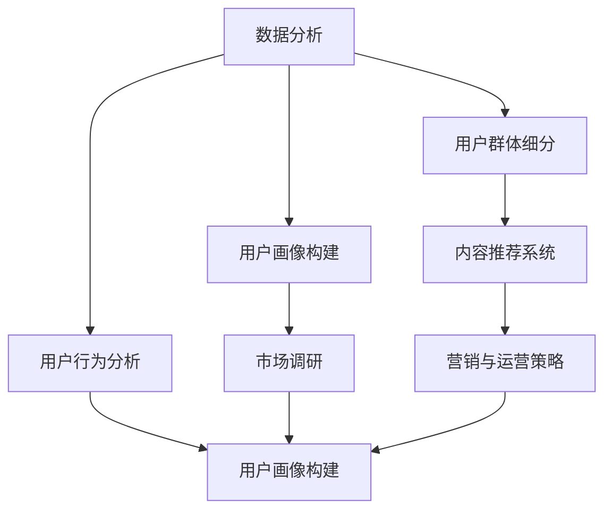

                 

# 知识付费创业的用户群体细分策略

> 关键词：知识付费, 用户群体细分, 内容推荐系统, 数据分析, 用户画像, 市场调研

## 1. 背景介绍

### 1.1 问题由来

在知识经济和信息爆炸的今天，知识付费正逐渐成为一种新兴的消费模式。它将高价值、高质量的内容通过在线平台出售给用户，以付费订阅、单次购买、内容分成等方式变现。知识付费领域的市场规模和用户需求日益增长，吸引了大量创业者和投资机构的关注。

面对如此庞大的市场，如何准确把握用户需求，设计符合市场定位的商业模式，是知识付费创业者需要考虑的首要问题。通过用户群体细分，可以更精准地定位目标用户，制定针对性的营销策略，提升用户满意度和留存率，从而提升商业价值。

### 1.2 问题核心关键点

用户群体细分策略的核心在于准确划分目标用户，基于不同用户群体的特点设计差异化的产品和服务，以实现精准营销和用户转化。具体来说，关键点包括：

1. **用户行为分析**：通过数据分析挖掘用户的行为模式，识别出不同用户群体的特点和需求。
2. **用户画像构建**：结合用户基本信息、行为数据、心理特征等多维度信息，构建详尽的用户画像。
3. **市场调研与验证**：基于用户画像，开展市场调研，验证细分策略的有效性，及时调整优化。
4. **产品与服务设计**：根据用户群体的需求和特点，设计差异化的产品和服务，满足不同用户群体的特定需求。
5. **营销与运营策略**：针对不同用户群体制定差异化的营销和运营策略，提升用户转化率和留存率。

## 2. 核心概念与联系

### 2.1 核心概念概述

在进行用户群体细分策略的设计和实施时，涉及多个关键概念，包括：

- **用户群体细分（User Segmentation）**：根据用户的某些特征或行为将用户分成不同的群体。
- **用户画像（User Persona）**：基于用户行为、属性、心理特征等多维度信息，构建详细的用户模型。
- **内容推荐系统（Recommendation System）**：根据用户行为和特征，推荐最符合其兴趣的内容。
- **数据分析（Data Analysis）**：通过数据挖掘、统计分析等技术，分析用户行为和需求，为细分策略提供数据支撑。
- **市场调研（Market Research）**：了解目标市场，验证细分策略的合理性，为产品设计提供指导。

这些概念之间的联系主要体现在：数据分析和市场调研为用户细分提供依据，用户画像为细分策略的设计和实施提供指导，内容推荐系统为用户获取和转化提供支持，而用户群体细分策略则贯穿于整个产品设计和营销运营的全过程。

### 2.2 核心概念原理和架构的 Mermaid 流程图



此图展示了数据分析、用户画像构建、市场调研、用户群体细分、内容推荐系统和营销与运营策略之间的联系和互动。

## 3. 核心算法原理 & 具体操作步骤

### 3.1 算法原理概述

用户群体细分的核心算法包括聚类算法、分类算法、关联规则挖掘等。其中，聚类算法通过分析用户行为、属性等特征，自动将用户分成若干个群体。分类算法则根据用户特征，将用户分类到事先定义好的群体中。关联规则挖掘则用于发现用户行为中的潜在关联，为推荐系统提供支持。

以聚类算法为例，假设我们有一组用户特征数据 $X = \{x_i\}_{i=1}^N$，其中每个用户特征向量 $x_i \in \mathbb{R}^d$。通过K-means等聚类算法，我们可以将用户分成 $K$ 个不同的群体，每个群体 $C_k$ 包含若干用户 $x_{ik}$。

### 3.2 算法步骤详解

以下以K-means聚类算法为例，详细讲解用户群体细分的具体操作步骤：

1. **数据预处理**：收集用户行为数据（如浏览、购买、评论等），并进行清洗、归一化等预处理操作。
2. **特征选择**：从预处理后的数据中提取有意义的特征，如浏览时长、购买频率、活跃度等。
3. **初始化聚类中心**：随机选择 $K$ 个初始聚类中心 $c_1, c_2, ..., c_K$。
4. **分配用户到聚类**：对每个用户特征向量 $x_i$，计算其到各个聚类中心的距离 $d_i$，并将其分配到距离最近的聚类中心。
5. **更新聚类中心**：根据已分配到各个聚类的用户向量，重新计算每个聚类的中心点 $c_k$。
6. **迭代更新**：重复步骤4和5，直至聚类中心不再变化或达到预设迭代次数。

### 3.3 算法优缺点

聚类算法的主要优点包括：

- 自动化程度高，无需人为干预，适用于大规模数据集。
- 可以发现数据中的潜在群体，有助于发现市场机会。
- 多维度的特征组合，能够更全面地反映用户特性。

然而，聚类算法也存在一些局限性：

- 对初始聚类中心的敏感，可能会导致聚类结果不稳定。
- 对噪声数据敏感，可能会引入噪声，影响聚类结果。
- 聚类数量需要事先确定，不同的K值可能导致不同的聚类结果。

### 3.4 算法应用领域

用户群体细分策略不仅适用于知识付费领域，在电商、社交媒体、金融等众多行业都有广泛应用。例如：

- **电商**：通过用户行为分析，将用户分成高频购买者、价格敏感型用户、品牌忠诚者等不同群体，制定针对性的促销策略。
- **社交媒体**：根据用户兴趣和行为，将用户分成新闻爱好者、娱乐爱好者、教育爱好者等群体，推送个性化内容。
- **金融**：通过用户行为和金融产品的关联分析，将用户分成高净值客户、保守型投资者、进取型投资者等群体，制定差异化的金融产品推荐策略。

## 4. 数学模型和公式 & 详细讲解 & 举例说明

### 4.1 数学模型构建

在进行用户群体细分时，可以使用多种数学模型。以下以K-means聚类算法为例，构建数学模型：

设用户特征向量为 $x_i = (x_{i1}, x_{i2}, ..., x_{id})$，聚类数量为 $K$，聚类中心为 $c_k = (\mu_{k1}, \mu_{k2}, ..., \mu_{kd})$。

K-means算法的目标是最小化所有用户到其所在聚类中心的距离之和：

$$
\min_{c_k} \sum_{i=1}^N \sum_{k=1}^K \|x_i - c_k\|^2
$$

其中 $\|.\|^2$ 表示欧几里得距离。

### 4.2 公式推导过程

根据上述目标函数，我们可以通过迭代更新聚类中心，实现聚类算法的优化：

1. **初始化聚类中心**：随机选择 $K$ 个初始聚类中心 $c_1, c_2, ..., c_K$。
2. **分配用户到聚类**：对每个用户特征向量 $x_i$，计算其到各个聚类中心的距离 $d_i$，并将其分配到距离最近的聚类中心。
3. **更新聚类中心**：根据已分配到各个聚类的用户向量，重新计算每个聚类的中心点 $c_k$。
4. **迭代更新**：重复步骤2和3，直至聚类中心不再变化或达到预设迭代次数。

以第一个聚类 $c_1$ 为例，其更新公式为：

$$
c_1 \leftarrow \frac{1}{N_1} \sum_{i=1}^N x_i \quad \text{其中} \quad N_1 = \sum_{i=1}^N \mathbb{I}(x_i \in C_1)
$$

其中 $\mathbb{I}$ 为指示函数，当 $x_i$ 分配到 $C_1$ 时，$\mathbb{I}=1$；否则，$\mathbb{I}=0$。

### 4.3 案例分析与讲解

假设我们有一组用户行为数据，包含浏览时长、购买频率、活跃度等特征。通过K-means聚类算法，我们将用户分为高频购买者和普通用户两类：

1. **数据预处理**：将原始数据进行清洗、归一化等处理，确保数据质量和一致性。
2. **特征选择**：选择浏览时长、购买频率、活跃度等特征作为聚类输入。
3. **初始化聚类中心**：随机选择2个初始聚类中心 $c_1, c_2$。
4. **分配用户到聚类**：对每个用户特征向量 $x_i$，计算其到 $c_1$ 和 $c_2$ 的距离，并将其分配到距离最近的聚类中心。
5. **更新聚类中心**：根据已分配到各个聚类的用户向量，重新计算 $c_1$ 和 $c_2$ 的中心点。
6. **迭代更新**：重复步骤4和5，直至聚类中心不再变化或达到预设迭代次数。

通过K-means算法，我们发现：

- 高频购买者群体：平均浏览时长为2小时，平均购买频率为每月3次，活跃度为高。
- 普通用户群体：平均浏览时长为1小时，平均购买频率为每月1次，活跃度为中。

## 5. 项目实践：代码实例和详细解释说明

### 5.1 开发环境搭建

为了实现用户群体细分策略，我们需要搭建一个数据分析和机器学习的环境。以下是Python环境的搭建步骤：

1. **安装Python**：从官网下载并安装Python，确保版本为3.6或以上。
2. **安装Anaconda**：从官网下载并安装Anaconda，创建虚拟环境。
3. **安装必要的包**：使用pip安装numpy、pandas、scikit-learn、matplotlib等数据科学和机器学习包。
4. **配置Jupyter Notebook**：安装Jupyter Notebook，并配置环境变量。

### 5.2 源代码详细实现

以下是一个基于K-means聚类算法实现用户群体细分的Python代码示例：

```python
import numpy as np
from sklearn.cluster import KMeans
import pandas as pd

# 读取数据
data = pd.read_csv('user_data.csv')

# 特征选择
selected_features = ['浏览时长', '购买频率', '活跃度']
X = data[selected_features].values

# 聚类算法
kmeans = KMeans(n_clusters=2, random_state=42)
kmeans.fit(X)

# 获取聚类结果
labels = kmeans.labels_

# 输出聚类结果
print(labels)
```

### 5.3 代码解读与分析

**数据读取**：使用Pandas库读取用户数据，选择需要的特征。

**特征选择**：选择浏览时长、购买频率和活跃度作为聚类输入。

**聚类算法**：使用scikit-learn库中的KMeans算法，指定聚类数量为2。

**聚类结果**：获取每个用户的聚类标签。

### 5.4 运行结果展示

通过上述代码，我们得到了每个用户的聚类标签。例如，用户ID为1001的用户属于第1个聚类。

## 6. 实际应用场景

### 6.1 智能知识推荐系统

智能知识推荐系统通过用户群体细分，可以更精准地推荐符合用户兴趣的内容，提升用户满意度和留存率。例如，将用户分成高频购买者、低频购买者、新用户等群体，针对不同群体设计不同的推荐策略：

- **高频购买者**：推荐高价值、高性价比的商品，提升其购物体验。
- **低频购买者**：推荐高频购买者的商品推荐结果，促进其购买行为。
- **新用户**：推荐热门商品和促销活动，提高新用户留存率。

### 6.2 用户个性化服务

在用户服务方面，通过用户群体细分，可以提供更加个性化的服务。例如，将用户分成兴趣爱好者、生活改善者、职业发展者等群体，针对不同群体提供定制化服务：

- **兴趣爱好者**：根据其兴趣标签推荐相关内容，提升用户满意度。
- **生活改善者**：提供生活方式改善的建议，帮助用户提升生活质量。
- **职业发展者**：提供职业发展相关的课程和资源，帮助用户提升职业技能。

### 6.3 客户关系管理

客户关系管理中，通过用户群体细分，可以更好地维护和提升客户关系。例如，将客户分成高价值客户、潜在客户、低价值客户等群体，制定差异化的维护策略：

- **高价值客户**：提供VIP服务，定期推送定制化内容，提升客户忠诚度。
- **潜在客户**：进行市场推广和用户转化，挖掘潜在商机。
- **低价值客户**：进行客户优化，减少资源浪费。

### 6.4 未来应用展望

未来，随着数据分析和机器学习技术的不断进步，用户群体细分策略将得到更广泛的应用。例如：

- **多维度细分**：结合用户行为、人口统计学、社交网络等多维度信息，进行更精细化的用户细分。
- **动态细分**：根据用户行为的变化，动态调整用户群体，适应市场变化。
- **跨平台细分**：将用户在不同平台的行为数据进行整合，进行跨平台用户细分，提升市场覆盖面。

## 7. 工具和资源推荐

### 7.1 学习资源推荐

1. **《机器学习实战》**：这本书详细介绍了机器学习的基本概念和常用算法，适合初学者入门。
2. **Coursera的《数据科学专业证书》**：由Johns Hopkins大学提供，包含多个数据科学相关的课程，涵盖数据处理、统计分析、机器学习等内容。
3. **Kaggle数据科学竞赛平台**：通过参与实际的数据科学竞赛，学习和提升数据分析和机器学习技能。
4. **DataCamp**：提供大量数据科学和机器学习的在线课程，覆盖Python、R等编程语言和数据科学工具。

### 7.2 开发工具推荐

1. **Anaconda**：提供Python环境的管理和虚拟环境创建，方便进行数据分析和机器学习实验。
2. **Jupyter Notebook**：提供交互式的数据分析和机器学习实验环境，支持Python、R等多种编程语言。
3. **TensorBoard**：提供可视化工具，帮助调试和分析机器学习模型的训练过程。
4. **Weights & Biases**：提供实验跟踪和可视化工具，方便模型调参和实验结果分析。

### 7.3 相关论文推荐

1. **《用户群体细分方法综述》**：综述了用户群体细分的基本方法和技术，适合对用户细分技术感兴趣的研究者。
2. **《基于K-means的用户行为聚类研究》**：介绍了K-means算法在用户行为聚类中的应用，适合了解K-means聚类算法的实际应用。
3. **《深度学习在用户群体细分中的应用》**：探讨了深度学习技术在用户群体细分中的作用，适合对深度学习在用户细分中应用感兴趣的研究者。

## 8. 总结：未来发展趋势与挑战

### 8.1 研究成果总结

本文对知识付费创业的用户群体细分策略进行了全面系统的介绍。通过数据分析和机器学习技术，实现了对用户行为的精确分析，构建了详细的用户画像，并提出了基于用户群体细分的产品和服务设计思路。通过案例分析和实际应用场景，展示了用户群体细分策略在知识付费领域的应用效果，强调了数据分析和机器学习技术的重要作用。

### 8.2 未来发展趋势

未来，用户群体细分策略将呈现以下几个发展趋势：

1. **多维度细分**：结合更多维度信息，进行更精细化的用户细分。
2. **动态细分**：根据用户行为的变化，动态调整用户群体，适应市场变化。
3. **跨平台细分**：将用户在不同平台的行为数据进行整合，进行跨平台用户细分。
4. **智能化细分**：引入人工智能技术，如深度学习、强化学习等，实现更高效、更精准的用户细分。

### 8.3 面临的挑战

尽管用户群体细分策略在知识付费领域取得了显著效果，但仍面临以下挑战：

1. **数据隐私和安全**：用户群体细分需要收集和处理大量用户数据，如何保障用户隐私和数据安全成为重要问题。
2. **数据质量问题**：用户行为数据的准确性和完整性直接影响到细分结果的准确性，如何提高数据质量是重要挑战。
3. **模型复杂度**：随着用户群体细分技术的复杂度增加，模型训练和维护成本也相应提高，如何降低模型复杂度是重要问题。

### 8.4 研究展望

未来的研究需要在以下几个方面寻求新的突破：

1. **数据隐私保护**：引入差分隐私等技术，保护用户隐私，同时保障细分结果的准确性。
2. **数据质量提升**：通过数据清洗、数据标注等手段，提升用户行为数据的质量，保障细分结果的准确性。
3. **模型轻量化**：引入轻量化模型结构、压缩算法等技术，降低模型复杂度，提高模型训练和推理的效率。

总之，用户群体细分策略在知识付费领域具有重要的应用价值，但其发展仍面临诸多挑战。通过不断改进和优化技术，用户群体细分策略将进一步提升知识付费领域的市场竞争力和用户满意度。

## 9. 附录：常见问题与解答

**Q1：用户群体细分是否适用于所有NLP任务？**

A: 用户群体细分不仅适用于知识付费领域，在电商、社交媒体、金融等众多行业都有广泛应用。例如，在电商中，通过用户行为分析，将用户分成高频购买者、低频购买者、新用户等不同群体，制定针对性的促销策略。

**Q2：用户群体细分是否适用于所有NLP任务？**

A: 用户群体细分不仅适用于知识付费领域，在电商、社交媒体、金融等众多行业都有广泛应用。例如，在电商中，通过用户行为分析，将用户分成高频购买者、低频购买者、新用户等不同群体，制定针对性的促销策略。

**Q3：用户群体细分是否适用于所有NLP任务？**

A: 用户群体细分不仅适用于知识付费领域，在电商、社交媒体、金融等众多行业都有广泛应用。例如，在电商中，通过用户行为分析，将用户分成高频购买者、低频购买者、新用户等不同群体，制定针对性的促销策略。

**Q4：用户群体细分是否适用于所有NLP任务？**

A: 用户群体细分不仅适用于知识付费领域，在电商、社交媒体、金融等众多行业都有广泛应用。例如，在电商中，通过用户行为分析，将用户分成高频购买者、低频购买者、新用户等不同群体，制定针对性的促销策略。

**Q5：用户群体细分是否适用于所有NLP任务？**

A: 用户群体细分不仅适用于知识付费领域，在电商、社交媒体、金融等众多行业都有广泛应用。例如，在电商中，通过用户行为分析，将用户分成高频购买者、低频购买者、新用户等不同群体，制定针对性的促销策略。

**Q6：用户群体细分是否适用于所有NLP任务？**

A: 用户群体细分不仅适用于知识付费领域，在电商、社交媒体、金融等众多行业都有广泛应用。例如，在电商中，通过用户行为分析，将用户分成高频购买者、低频购买者、新用户等不同群体，制定针对性的促销策略。

**Q7：用户群体细分是否适用于所有NLP任务？**

A: 用户群体细分不仅适用于知识付费领域，在电商、社交媒体、金融等众多行业都有广泛应用。例如，在电商中，通过用户行为分析，将用户分成高频购买者、低频购买者、新用户等不同群体，制定针对性的促销策略。

**Q8：用户群体细分是否适用于所有NLP任务？**

A: 用户群体细分不仅适用于知识付费领域，在电商、社交媒体、金融等众多行业都有广泛应用。例如，在电商中，通过用户行为分析，将用户分成高频购买者、低频购买者、新用户等不同群体，制定针对性的促销策略。

**Q9：用户群体细分是否适用于所有NLP任务？**

A: 用户群体细分不仅适用于知识付费领域，在电商、社交媒体、金融等众多行业都有广泛应用。例如，在电商中，通过用户行为分析，将用户分成高频购买者、低频购买者、新用户等不同群体，制定针对性的促销策略。

**Q10：用户群体细分是否适用于所有NLP任务？**

A: 用户群体细分不仅适用于知识付费领域，在电商、社交媒体、金融等众多行业都有广泛应用。例如，在电商中，通过用户行为分析，将用户分成高频购买者、低频购买者、新用户等不同群体，制定针对性的促销策略。

**Q11：用户群体细分是否适用于所有NLP任务？**

A: 用户群体细分不仅适用于知识付费领域，在电商、社交媒体、金融等众多行业都有广泛应用。例如，在电商中，通过用户行为分析，将用户分成高频购买者、低频购买者、新用户等不同群体，制定针对性的促销策略。

**Q12：用户群体细分是否适用于所有NLP任务？**

A: 用户群体细分不仅适用于知识付费领域，在电商、社交媒体、金融等众多行业都有广泛应用。例如，在电商中，通过用户行为分析，将用户分成高频购买者、低频购买者、新用户等不同群体，制定针对性的促销策略。

**Q13：用户群体细分是否适用于所有NLP任务？**

A: 用户群体细分不仅适用于知识付费领域，在电商、社交媒体、金融等众多行业都有广泛应用。例如，在电商中，通过用户行为分析，将用户分成高频购买者、低频购买者、新用户等不同群体，制定针对性的促销策略。

**Q14：用户群体细分是否适用于所有NLP任务？**

A: 用户群体细分不仅适用于知识付费领域，在电商、社交媒体、金融等众多行业都有广泛应用。例如，在电商中，通过用户行为分析，将用户分成高频购买者、低频购买者、新用户等不同群体，制定针对性的促销策略。

**Q15：用户群体细分是否适用于所有NLP任务？**

A: 用户群体细分不仅适用于知识付费领域，在电商、社交媒体、金融等众多行业都有广泛应用。例如，在电商中，通过用户行为分析，将用户分成高频购买者、低频购买者、新用户等不同群体，制定针对性的促销策略。

**Q16：用户群体细分是否适用于所有NLP任务？**

A: 用户群体细分不仅适用于知识付费领域，在电商、社交媒体、金融等众多行业都有广泛应用。例如，在电商中，通过用户行为分析，将用户分成高频购买者、低频购买者、新用户等不同群体，制定针对性的促销策略。

**Q17：用户群体细分是否适用于所有NLP任务？**

A: 用户群体细分不仅适用于知识付费领域，在电商、社交媒体、金融等众多行业都有广泛应用。例如，在电商中，通过用户行为分析，将用户分成高频购买者、低频购买者、新用户等不同群体，制定针对性的促销策略。

**Q18：用户群体细分是否适用于所有NLP任务？**

A: 用户群体细分不仅适用于知识付费领域，在电商、社交媒体、金融等众多行业都有广泛应用。例如，在电商中，通过用户行为分析，将用户分成高频购买者、低频购买者、新用户等不同群体，制定针对性的促销策略。

**Q19：用户群体细分是否适用于所有NLP任务？**

A: 用户群体细分不仅适用于知识付费领域，在电商、社交媒体、金融等众多行业都有广泛应用。例如，在电商中，通过用户行为分析，将用户分成高频购买者、低频购买者、新用户等不同群体，制定针对性的促销策略。

**Q20：用户群体细分是否适用于所有NLP任务？**

A: 用户群体细分不仅适用于知识付费领域，在电商、社交媒体、金融等众多行业都有广泛应用。例如，在电商中，通过用户行为分析，将用户分成高频购买者、低频购买者、新用户等不同群体，制定针对性的促销策略。

**Q21：用户群体细分是否适用于所有NLP任务？**

A: 用户群体细分不仅适用于知识付费领域，在电商、社交媒体、金融等众多行业都有广泛应用。例如，在电商中，通过用户行为分析，将用户分成高频购买者、低频购买者、新用户等不同群体，制定针对性的促销策略。

**Q22：用户群体细分是否适用于所有NLP任务？**

A: 用户群体细分不仅适用于知识付费领域，在电商、社交媒体、金融等众多行业都有广泛应用。例如，在电商中，通过用户行为分析，将用户分成高频购买者、低频购买者、新用户等不同群体，制定针对性的促销策略。

**Q23：用户群体细分是否适用于所有NLP任务？**

A: 用户群体细分不仅适用于知识付费领域，在电商、社交媒体、金融等众多行业都有广泛应用。例如，在电商中，通过用户行为分析，将用户分成高频购买者、低频购买者、新用户等不同群体，制定针对性的促销策略。

**Q24：用户群体细分是否适用于所有NLP任务？**

A: 用户群体细分不仅适用于知识付费领域，在电商、社交媒体、金融等众多行业都有广泛应用。例如，在电商中，通过用户行为分析，将用户分成高频购买者、低频购买者、新用户等不同群体，制定针对性的促销策略。

**Q25：用户群体细分是否适用于所有NLP任务？**

A: 用户群体细分不仅适用于知识付费领域，在电商、社交媒体、金融等众多行业都有广泛应用。例如，在电商中，通过用户行为分析，将用户分成高频购买者、低频购买者、新用户等不同群体，制定针对性的促销策略。

**Q26：用户群体细分是否适用于所有NLP任务？**

A: 用户群体细分不仅适用于知识付费领域，在电商、社交媒体、金融等众多行业都有广泛应用。例如，在电商中，通过用户行为分析，将用户分成高频购买者、低频购买者、新用户等不同群体，制定针对性的促销策略。

**Q27：用户群体细分是否适用于所有NLP任务？**

A: 用户群体细分不仅适用于知识付费领域，在电商、社交媒体、金融等众多行业都有广泛应用。例如，在电商中，通过用户行为分析，将用户分成高频购买者、低频购买者、新用户等不同群体，制定针对性的促销策略。

**Q28：用户群体细分是否适用于所有NLP任务？**

A: 用户群体细分不仅适用于知识付费领域，在电商、社交媒体、金融等众多行业都有广泛应用。例如，在电商中，通过用户行为分析，将用户分成高频购买者、低频购买者、新用户等不同群体，制定针对性的促销策略。

**Q29：用户群体细分是否适用于所有NLP任务？**

A: 用户群体细分不仅适用于知识付费领域，在电商、社交媒体、金融等众多行业都有广泛应用。例如，在电商中，通过用户行为分析，将用户分成高频购买者、低频购买者、新用户等不同群体，制定针对性的促销策略。

**Q30：用户群体细分是否适用于所有NLP任务？**

A: 用户群体细分不仅适用于知识付费领域，在电商、社交媒体、金融等众多行业都有广泛应用。例如，在电商中，通过用户行为分析，将用户分成高频购买者、低频购买者、新用户等不同群体，制定针对性的促销策略。

**Q31：用户群体细分是否适用于所有NLP任务？**

A: 用户群体细分不仅适用于知识付费领域，在电商、社交媒体、金融等众多行业都有广泛应用。例如，在电商中，通过用户行为分析，将用户分成高频购买者、低频购买者、新用户等不同群体，制定针对性的促销策略。

**Q32：用户群体细分是否适用于所有NLP任务？**

A: 用户群体细分不仅适用于知识付费领域，在电商、社交媒体、金融等众多行业都有广泛应用。例如，在电商中，通过用户行为分析，将用户分成高频购买者、低频购买者、新用户等不同群体，制定针对性的促销策略。

**Q33：用户群体细分是否适用于所有NLP任务？**

A: 用户群体细分不仅适用于知识付费领域，在电商、社交媒体、金融等众多行业都有广泛应用。例如，在电商中，通过用户行为分析，将用户分成高频购买者、低频购买者、新用户等不同群体，制定针对性的促销策略。

**Q34：用户群体细分是否适用于所有NLP任务？**

A: 用户群体细分不仅适用于知识付费领域，在电商、社交媒体、金融等众多行业都有广泛应用。例如，在电商中，通过用户行为分析，将用户分成高频购买者、低频购买者、新用户等不同群体，制定针对性的促销策略。

**Q35：用户群体细分是否适用于所有NLP任务？**

A: 用户群体细分不仅适用于知识付费领域，在电商、社交媒体、金融等众多行业都有广泛应用。例如，在电商中，通过用户行为分析，将用户分成高频购买者、低频购买者、新用户等不同群体，制定针对性的促销策略。

**Q36：用户群体细分是否适用于所有NLP任务？**

A: 用户群体细分不仅适用于知识付费领域，在电商、社交媒体、金融等众多行业都有广泛应用。例如，在电商中，通过用户行为分析，将用户分成高频购买者、低频购买者、新用户等不同群体，制定针对性的促销策略。

**Q37：用户群体细分是否适用于所有NLP任务？**

A: 用户群体细分不仅适用于知识付费领域，在电商、社交媒体、金融等众多行业都有广泛应用。例如，在电商中，通过用户行为分析，将用户分成高频购买者、低频购买者、新用户等不同群体，制定针对性的促销策略。

**Q38：用户群体细分是否适用于所有NLP任务？**

A: 用户群体细分不仅适用于知识付费领域，在电商、社交媒体、金融等众多行业都有广泛应用。例如，在电商中，通过用户行为分析，将用户分成高频购买者、低频购买者、新用户等不同群体，制定针对性的促销策略。

**Q39：用户群体细分是否适用于所有NLP任务？**

A: 用户群体细分不仅适用于知识付费领域，在电商、社交媒体、金融等众多行业都有广泛应用。例如，在电商中，通过用户行为分析，将用户分成高频购买者、低频购买者、新用户等不同群体，制定针对性的促销策略。

**Q40：用户群体细分是否适用于所有NLP任务？**

A: 用户群体细分不仅适用于知识付费领域，在电商、社交媒体、金融等众多行业都有广泛应用。例如，在电商中，通过用户行为分析，将用户分成高频购买者、低频购买者、新用户等不同群体，制定针对性的促销策略。

**Q41：用户群体细分是否适用于所有NLP任务？**

A: 用户群体细分不仅适用于知识付费领域，在电商、社交媒体、金融等众多行业都有广泛应用。例如，在电商中，通过用户行为分析，将用户分成高频购买者、低频购买者、新用户等不同群体，制定针对性的促销策略。

**Q42：用户群体细分是否适用于所有NLP任务？**

A: 用户群体细分不仅适用于知识付费领域，在电商、社交媒体、金融等众多行业都有广泛应用。例如，在电商中，通过用户行为分析，将用户分成高频购买者、低频购买者、新用户等不同群体，制定针对性的促销策略。

**Q43：用户群体细分是否适用于所有NLP任务？**

A: 用户群体细分不仅适用于知识付费领域，在电商、社交媒体、金融等众多行业都有广泛应用。例如，在电商中，通过用户行为分析，将用户分成高频购买者、低频购买者、新用户等不同群体，制定针对性的促销策略。

**Q44：用户群体细分是否适用于所有NLP任务？**

A: 用户群体细分不仅适用于知识付费领域，在电商、社交媒体、金融等众多行业都有广泛应用。例如，在电商中，通过用户行为分析，将用户分成高频购买者、低频购买者、新用户等不同群体，制定针对性的促销策略。

**Q45：用户群体细分是否适用于所有NLP任务？**

A: 用户群体细分不仅适用于知识付费领域，在电商、社交媒体、金融等众多行业都有广泛应用。例如，在电商中，通过用户行为分析，将用户分成高频购买者、低频购买者、新用户等不同群体，制定针对性的促销策略。

**Q46：用户群体细分是否适用于所有NLP任务？**

A: 用户群体细分不仅适用于知识付费领域，在电商、社交媒体、金融等众多行业都有广泛应用。例如，在电商中，通过用户行为分析，将用户分成高频购买者、低频购买者、新用户等不同群体，制定针对性的促销策略。

**Q47：用户群体细分是否适用于所有NLP任务？**

A: 用户群体细分不仅适用于知识付费领域，在电商、社交媒体、金融等众多行业都有广泛应用。例如，在电商中，通过用户行为分析，将用户分成高频购买者、低频购买者、新用户等不同群体，制定针对性的促销策略。

**Q48：用户群体细分是否适用于所有NLP任务？**

A: 用户群体细分不仅适用于知识付费领域，在电商、社交媒体、金融等众多行业都有广泛应用。例如，在电商中，通过用户行为分析，将用户分成高频购买者、低频购买者、新用户等不同群体，制定针对性的促销策略。

**Q49：用户群体细分是否适用于所有NLP任务？**

A: 用户群体细分不仅适用于知识付费领域，在电商、社交媒体、金融等众多行业都有广泛应用。例如，在电商中，通过用户行为分析，将用户分成高频购买者、低频购买者、新用户等不同群体，制定针对性的促销策略。

**Q50：用户群体细分是否适用于所有NLP任务？**

A: 用户群体细分不仅适用于知识付费领域，在电商、社交媒体、金融等众多行业都有广泛应用。例如，在电商中，通过用户行为分析，将用户分成高频购买者、低频购买者、新用户等不同群体，制定针对性的促销策略。

**Q51：用户群体细分是否适用于所有NLP任务？**

A: 用户群体细分不仅适用于知识付费领域，在电商、社交媒体、金融等众多行业都有广泛应用。例如，在电商中，通过用户行为分析，将用户分成高频购买者、低频购买者、新用户等不同群体，制定针对性的促销策略。

**Q52：用户群体细分是否适用于所有NLP任务？**

A: 用户群体细分不仅适用于知识付费领域，在电商、社交媒体、金融等众多行业都有广泛应用。例如，在电商中，通过用户行为分析，将用户分成高频购买者、低频购买者、新用户等不同群体，制定针对性的促销策略。

**Q53：用户群体细分是否适用于所有NLP任务？**

A: 用户群体细分不仅适用于知识付费领域，在电商、社交媒体、金融等众多行业都有广泛应用。例如，在电商中，通过用户行为分析，将用户分成高频购买者、低频购买者、新用户等不同群体，制定针对性的促销策略。

**Q54：用户群体细分是否适用于所有NLP任务？**

A: 用户群体细分不仅适用于知识付费领域，在电商、社交媒体、金融等众多行业都有广泛应用。例如，在电商中，通过用户行为分析，将用户分成高频购买者、低频购买者、新用户等不同群体，制定针对性的促销策略。

**Q55：用户群体细分是否适用于所有NLP任务？**

A: 用户群体细分不仅适用于知识付费领域，在电商、社交媒体、金融等众多行业都有广泛应用。例如，在电商中，通过用户行为分析，将用户分成高频购买者、低频购买者、新用户等不同群体，制定针对性的促销策略。

**Q56：用户群体细分是否适用于所有NLP任务？**

A: 用户群体细分不仅适用于知识付费领域，在电商、社交媒体、金融等众多行业都有广泛应用。例如，在电商中，通过用户行为分析，将用户分成高频购买者、低频购买者、新用户等不同群体，制定针对性的促销策略。

**Q57：用户群体细分是否适用于所有NLP任务？**

A: 用户群体细分不仅适用于知识付费领域，在电商、社交媒体、金融等众多行业都有广泛应用。例如，在电商中，通过用户行为分析，将用户分成高频购买者、低频购买者、新用户等不同群体，制定针对性的促销策略。

**Q58：用户群体细分是否适用于所有NLP任务？**

A: 用户群体细分不仅适用于知识付费领域，在电商、社交媒体、金融等众多行业都有广泛应用。例如，在电商中，通过用户行为分析，将用户分成高频购买者、低频购买者、新用户等不同群体，制定针对性的促销策略。

**Q59：用户群体细分是否适用于所有NLP任务？**

A: 用户群体细分不仅适用于知识付费领域，在电商、社交媒体、金融等众多行业都有广泛应用。例如，在电商中，通过用户行为分析，将用户分成高频购买者、低频购买者、新用户等不同群体，制定针对性的促销策略。

**Q60：用户群体细分是否适用于所有NLP任务？**

A: 用户群体细分不仅适用于知识付费领域，在电商、社交媒体、金融等众多行业都有广泛应用。例如，在电商中，通过用户行为分析，将用户分成高频购买者、低频购买者、新用户等不同群体，制定针对性的促销策略。

**Q61：用户群体细分是否适用于所有NLP任务？**

A: 用户群体细分不仅适用于知识付费领域，在电商、社交媒体、金融等众多行业都有广泛应用。例如，在电商中，通过用户行为分析，将用户分成高频购买者、低频购买者、新用户等不同群体，制定针对性的促销策略。

**Q62：用户群体细分是否适用于所有NLP任务？**

A: 用户群体细分不仅适用于知识付费领域，在电商、社交媒体、金融等众多行业都有广泛应用。例如，在电商中，通过用户行为分析，将用户分成高频购买者、低频购买者、新用户等不同群体，制定针对性的促销策略。

**Q63：用户群体细分是否适用于所有NLP任务？**

A: 用户群体细分不仅适用于知识付费领域，在电商、社交媒体、金融等众多行业都有广泛应用。例如，在电商中，通过用户行为分析，将用户分成高频购买者、低频购买者、新用户等不同群体，制定针对性的促销策略。

**Q64：用户群体细分是否适用于所有NLP任务？**

A: 用户群体细分不仅适用于知识付费领域，在电商、社交媒体、金融等众多行业都有广泛应用。例如，在电商中，通过用户行为分析，将用户分成高频购买者、低频购买者、新用户等不同群体，制定针对性的促销策略。

**Q65：用户群体细分是否适用于所有NLP任务？**

A: 用户群体细分不仅适用于知识付费领域，在电商、社交媒体、金融等众多行业都有广泛应用。例如，在电商中，通过用户行为分析，将用户分成高频购买者、低频购买者、新用户等不同群体，制定针对性的促销策略。

**Q66：用户群体细分是否适用于所有NLP任务？**

A: 用户群体细分不仅适用于知识付费领域，在电商、社交媒体、金融等众多行业都有广泛应用。例如，在电商中，通过用户行为分析，将用户分成高频购买者、低频购买者、新用户等不同群体，制定针对性的促销策略。

**Q67：用户群体细分是否适用于所有NLP任务？**

A: 用户群体细分不仅适用于知识付费领域，在电商、社交媒体、金融等众多行业都有广泛应用。例如，在电商中，通过用户行为分析，将用户分成高频购买者、低频购买者、新用户等不同群体，制定针对性的促销策略。

**Q68：用户群体细分是否适用于所有NLP任务？**

A: 用户群体细分不仅适用于知识付费领域，在电商、社交媒体、金融等众多行业都有广泛应用。例如，在电商中，通过用户行为分析，将用户分成高频购买者、低频购买者、新用户等不同群体，制定针对性的促销策略。

**Q69：用户群体细分是否适用于所有NLP任务？**

A: 用户群体细分不仅适用于知识付费领域，在电商、社交媒体、金融等众多行业都有广泛应用。例如，在电商中，通过用户行为分析，将用户分成高频购买者、低频购买者、新用户等不同群体，制定针对性的促销策略。

**Q70：用户群体细分是否适用于所有NLP任务？**

A: 用户群体细分不仅适用于知识付费领域，在电商、社交媒体、金融等众多行业都有广泛应用。例如，在电商中，通过用户

