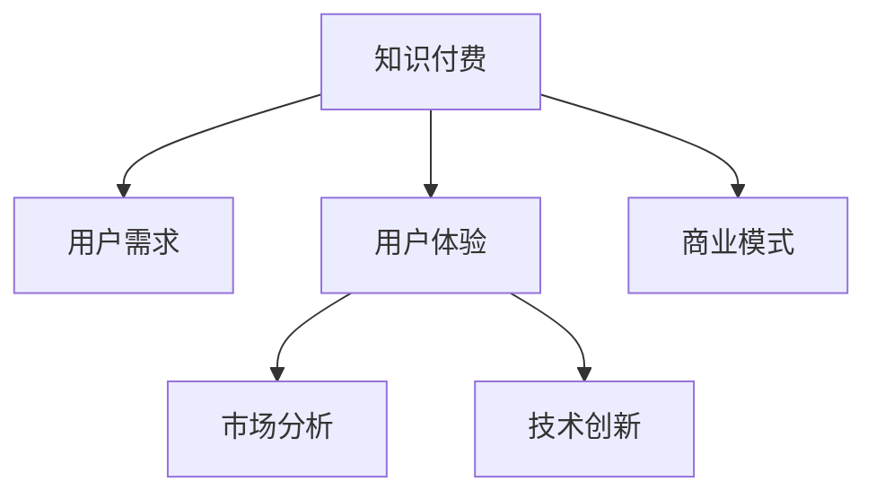

                 

# 知识付费创业的用户需求挖掘

> 关键词：知识付费, 用户需求, 市场分析, 技术创新, 商业模式, 用户体验

## 1. 背景介绍

### 1.1 问题由来
随着知识经济时代的到来，知识付费成为一种全新的经济形态，迅猛发展，吸引了大量的企业和个人入局。然而，市场竞争激烈，内容同质化问题严重，用户体验差异化不大，使得许多知识付费产品难以突破瓶颈，获取持续增长。如何挖掘用户真实需求，优化产品体验，构建独特竞争优势，是每一个知识付费创业企业亟需解决的问题。

### 1.2 问题核心关键点
用户需求挖掘是知识付费创业的核心关键点。通过深入了解用户需求，制定科学的产品策略，可以避免盲目跟风，提高用户粘性，实现业务的快速增长。

具体而言，需要：
- 精准分析目标用户群体
- 了解用户真实痛点和需求
- 设计符合用户预期的产品功能
- 评估并优化用户体验

### 1.3 问题研究意义
深入挖掘用户需求，对于知识付费企业的成功至关重要：

- 降低用户流失：了解用户需求，可以提供更贴近用户心理的产品和服务，减少用户流失。
- 提高用户满意：明确用户需求，有利于优化产品功能，提升用户满意度。
- 构建竞争优势：根据用户需求设计产品，可以形成差异化优势，在竞争激烈的市场中脱颖而出。
- 优化商业模式：明确用户需求后，可以更精准地定位，优化商业模式，实现良性循环。

## 2. 核心概念与联系

### 2.1 核心概念概述

为了更好地理解知识付费创业的用户需求挖掘，本节将介绍几个密切相关的核心概念：

- 知识付费(Knowledge-Based Subscription)：指消费者为获取知识服务或内容支付费用的一种模式。如在线课程、电子书、专栏订阅等。
- 用户需求(User Needs)：指用户在使用产品或服务过程中所期望满足的期望或解决的问题。通常分为功能需求和非功能需求。
- 用户体验(User Experience)：指用户使用产品或服务时的感受和体验。良好体验可以提升用户满意度和忠诚度。
- 市场分析(Market Analysis)：指通过收集和分析市场数据，了解市场动态、竞争情况和用户需求，以指导产品策略的制定。
- 技术创新(Technological Innovation)：指通过技术手段，改进产品功能，提升用户体验，形成竞争优势。
- 商业模式(Business Model)：指企业盈利的方式和模式，如订阅制、按需付费、会员制等。

这些核心概念之间的逻辑关系可以通过以下Mermaid流程图来展示：



这个流程图展示的知识付费创业的核心概念及其之间的关系：

1. 知识付费通过提供付费内容服务，满足用户知识获取的需求。
2. 用户体验直接影响用户对产品的评价和使用粘性。
3. 市场分析帮助企业理解用户需求，优化产品功能和商业模式。
4. 技术创新通过提升产品功能和技术，增强用户体验。
5. 商业模式决定企业如何盈利和分配资源，影响用户获取和保留。

这些概念共同构成了知识付费创业的完整生态，企业的成功离不开对各个环节的全面优化。

## 3. 核心算法原理 & 具体操作步骤
### 3.1 算法原理概述

用户需求挖掘的核心是量化和分析用户行为数据，通过数据挖掘和机器学习技术，找出用户的共同特征和潜在的痛点，从而指导产品优化。

其核心思想是：
1. 收集用户行为数据，如使用时长、订阅内容、支付习惯等。
2. 通过数据清洗和特征工程，构建用户画像，描述用户特征。
3. 利用聚类、分类、回归等算法，分析用户需求，找出共性特征。
4. 结合业务目标，制定产品策略，优化用户体验。

### 3.2 算法步骤详解

以下详细介绍用户需求挖掘的算法步骤：

**Step 1: 数据收集与清洗**
- 收集用户行为数据，如登录次数、使用时长、订阅内容、支付金额等。
- 数据清洗，去除噪声和异常值，保证数据质量和一致性。

**Step 2: 特征工程**
- 定义特征指标，如用户活跃度、内容消费量、满意度等。
- 将原始数据转化为数值型特征，如使用时长转成分钟数、订阅内容数量等。
- 构建用户画像，描述用户特征，如年龄、职业、兴趣等。

**Step 3: 数据分析与建模**
- 选择适当的算法，如K-means聚类、LDA主题模型、决策树、随机森林等。
- 进行模型训练和验证，找到用户需求的共性特征。
- 评估模型性能，选择最优模型。

**Step 4: 需求分析与策略优化**
- 根据模型输出，分析用户需求，如热门内容、痛点问题等。
- 结合业务目标，制定产品策略，如内容推荐、功能优化等。
- 通过A/B测试等方法，验证策略效果，不断迭代优化。

**Step 5: 用户体验优化**
- 结合用户需求，设计产品界面和功能，提升用户体验。
- 定期收集用户反馈，优化产品流程和功能。
- 关注用户痛点，持续改进产品服务。

### 3.3 算法优缺点

用户需求挖掘具有以下优点：
1. 数据驱动：通过大数据分析，找出用户真实需求，提升产品决策的科学性。
2. 提高用户粘性：根据用户需求优化产品，提升用户满意度和忠诚度。
3. 降低成本：通过需求分析，优化资源配置，减少无效投入。
4. 形成差异化优势：挖掘用户痛点，创新产品功能，形成独特竞争优势。

同时，该方法也存在一些局限性：
1. 数据隐私问题：收集和分析用户行为数据，可能引发隐私和安全问题。
2. 模型复杂度：大规模数据集和复杂算法，需要较高的计算资源。
3. 用户多样性：不同用户需求差异较大，难以一概而论。
4. 模型过拟合：模型过度拟合数据，可能无法捕捉真实需求。
5. 用户体验差异：不同用户对同一功能的期望不同，难以一视同仁。

尽管存在这些局限性，但用户需求挖掘仍然是知识付费创业中最有效的策略之一，通过科学的数据分析和模型构建，可以最大限度地提升产品竞争力。

### 3.4 算法应用领域

用户需求挖掘在知识付费创业中具有广泛的应用，例如：

- 内容推荐系统：通过分析用户行为数据，推荐用户可能感兴趣的内容，提升内容消费量。
- 用户画像系统：根据用户画像，优化产品界面和功能，提升用户体验。
- 用户反馈系统：收集用户反馈，优化产品和服务，提升用户满意度。
- 定价策略系统：结合用户需求和消费能力，制定合理的订阅价格，吸引用户订阅。
- 用户流失预警系统：通过行为数据监测，预警潜在流失用户，及时采取措施。

这些应用场景展示了用户需求挖掘在知识付费创业中的巨大价值，通过科学的数据分析和模型构建，可以大幅提升产品竞争力，实现业务的快速增长。

## 4. 数学模型和公式 & 详细讲解 & 举例说明（备注：数学公式请使用latex格式，latex嵌入文中独立段落使用 $$，段落内使用 $)
### 4.1 数学模型构建

用户需求挖掘涉及多个数学模型，其中主要包括聚类、分类、回归等模型。下面以聚类模型为例，详细讲解其构建过程。

假设用户行为数据集合为 $D=\{(x_1,y_1),(x_2,y_2),\ldots,(x_n,y_n)\}$，其中 $x_i$ 为特征向量，$y_i$ 为标签。目标是将数据分为 $k$ 个簇，使得同一簇内数据相似度最大，不同簇内数据相似度最小。常用的聚类算法有K-means、层次聚类等。

以K-means聚类为例，其基本步骤如下：

1. 随机选择 $k$ 个初始质心点 $\mu_1,\mu_2,\ldots,\mu_k$。
2. 重复以下步骤 $t$ 次：
   1. 对每个数据点 $x_i$，计算其到各个质心点的距离 $d_i$。
   2. 将 $x_i$ 分配到距离最近的质心点 $\mu_j$ 所在的簇中。
   3. 更新每个簇的质心点 $\mu_j$ 为该簇内所有数据点的均值。
3. 输出最终的 $k$ 个簇的质心点。

### 4.2 公式推导过程

以下以K-means算法为例，推导其核心公式。

设数据点 $x_i=(x_{i1},x_{i2},\ldots,x_{id})$，质心点 $\mu_j=(\mu_{j1},\mu_{j2},\ldots,\mu_{jd})$，则距离度量公式为：

$$
d_i = \sqrt{\sum_{l=1}^d (x_{il} - \mu_{jl})^2}
$$

设每个数据点属于簇 $j$ 的概率为 $p_{ij}$，则概率分布为：

$$
p_{ij} = \frac{N_j}{N}, \quad j=1,2,\ldots,k
$$

其中 $N_j$ 为簇 $j$ 内的数据点数量，$N$ 为总数据点数量。

对于每个簇 $j$，其质心点 $\mu_j$ 的更新公式为：

$$
\mu_{jl} = \frac{1}{N_j} \sum_{i=1}^N x_{il} \quad j=1,2,\ldots,k
$$

### 4.3 案例分析与讲解

以知识付费平台的用户行为数据分析为例，展示聚类算法的应用。

假设某知识付费平台收集了用户的订阅时长、学习频率、内容类型等数据，使用K-means聚类算法，将用户分为3个簇。结果如下：

| 簇编号 | 订阅时长 | 学习频率 | 内容类型 |
| --- | --- | --- | --- |
| 簇1 | 大于等于3个月 | 每天学习 | 科学、技术 |
| 簇2 | 1个月至3个月 | 每周学习 | 文学、历史 |
| 簇3 | 小于1个月 | 每月学习 | 生活、休闲 |

根据聚类结果，可以发现不同用户群体的订阅时长和学习频率存在显著差异，针对不同用户群体，可以制定不同的内容推荐策略。例如，对于簇1的用户，可以推荐更多科学和技术类内容，满足其学习需求。

## 5. 项目实践：代码实例和详细解释说明
### 5.1 开发环境搭建

在进行用户需求挖掘实践前，需要先准备好开发环境。以下是使用Python进行Scikit-learn开发的环境配置流程：

1. 安装Anaconda：从官网下载并安装Anaconda，用于创建独立的Python环境。

2. 创建并激活虚拟环境：
```bash
conda create -n sklearn-env python=3.8 
conda activate sklearn-env
```

3. 安装Scikit-learn：
```bash
conda install scikit-learn
```

4. 安装其他必要的工具包：
```bash
pip install numpy pandas matplotlib seaborn
```

完成上述步骤后，即可在`sklearn-env`环境中开始用户需求挖掘实践。

### 5.2 源代码详细实现

下面我们以K-means聚类为例，给出使用Scikit-learn进行用户行为数据聚类的PyTorch代码实现。

```python
from sklearn.cluster import KMeans
import pandas as pd
import numpy as np
import matplotlib.pyplot as plt

# 读取用户行为数据
data = pd.read_csv('user_behavior.csv')

# 特征工程：提取有用特征
features = data[['subscription_time', 'learning_frequency', 'content_type']]

# 标准化处理
features = (features - features.mean()) / features.std()

# 训练K-means模型
kmeans = KMeans(n_clusters=3, random_state=0).fit(features)

# 可视化聚类结果
labels = kmeans.labels_
plt.scatter(features.iloc[:,0], features.iloc[:,1], c=labels)
plt.xlabel('Subscription Time')
plt.ylabel('Learning Frequency')
plt.show()
```

### 5.3 代码解读与分析

让我们再详细解读一下关键代码的实现细节：

**K-means聚类实现**：
- `KMeans`类是Scikit-learn提供的K-means聚类算法实现。
- `n_clusters`参数设置聚类数为3。
- `random_state`参数设置随机种子，确保结果可复现。
- `fit`方法训练模型，将用户行为数据作为输入。
- `labels_`属性返回每个数据点的聚类标签。

**可视化聚类结果**：
- 使用`plt.scatter`绘制散点图，横轴为订阅时长，纵轴为学习频率。
- `c=labels`参数将数据点颜色标记为聚类标签，便于观察聚类结果。

以上代码实现了基本的K-means聚类过程，展示了如何使用Scikit-learn库进行用户行为数据分析。

## 6. 实际应用场景
### 6.1 智能推荐系统

基于聚类算法进行用户行为分析，可以构建智能推荐系统。传统的推荐系统往往只考虑用户的历史行为数据，无法捕捉到用户的潜在需求。而通过聚类算法，可以将用户划分为不同群体，提供个性化的内容推荐，提升用户满意度和粘性。

例如，知识付费平台可以根据用户聚类结果，推荐不同簇的优质内容，例如：

- 对于簇1的用户，推荐更多科学和技术类课程。
- 对于簇2的用户，推荐更多文学和历史类课程。
- 对于簇3的用户，推荐更多生活休闲类课程。

通过个性化的内容推荐，平台可以更好地满足用户需求，增加用户粘性，实现业务的快速增长。

### 6.2 用户画像系统

用户画像系统是知识付费平台的重要组成部分，通过聚类算法，可以构建详细的用户画像，描述不同用户群体的特征。

例如，知识付费平台可以根据聚类结果，构建如下用户画像：

- 簇1用户：科学和技术爱好者，年龄偏大，主要工作为科技从业者。
- 簇2用户：文学和历史爱好者，年龄适中，主要工作为教育从业者和自由职业者。
- 簇3用户：生活休闲爱好者，年龄偏低，主要工作为学生和娱乐从业者。

结合用户画像，平台可以更有针对性地进行市场推广、产品优化和用户留存。

### 6.3 内容优化系统

内容优化系统是知识付费平台的核心功能之一，通过聚类算法，可以识别出不同用户的需求偏好，指导内容的优化和创作。

例如，知识付费平台可以根据聚类结果，优化如下内容：

- 对于簇1用户，增加科学和技术类课程，提升课程质量和深度。
- 对于簇2用户，增加文学和历史类课程，丰富课程内容和形式。
- 对于簇3用户，增加生活休闲类课程，注重课程趣味性和实用性。

通过内容优化，平台可以更好地满足用户需求，提升用户满意度，实现业务的持续增长。

### 6.4 未来应用展望

随着聚类算法和数据分析技术的不断进步，基于用户需求挖掘的应用场景将更加丰富多样。

未来，聚类算法将在更多领域得到应用，如用户分群、个性化推荐、内容优化等，为知识付费创业带来更多创新和机遇。同时，结合大数据和人工智能技术，聚类算法将更加智能化、精准化，进一步提升知识付费平台的竞争力。

## 7. 工具和资源推荐
### 7.1 学习资源推荐

为了帮助开发者系统掌握用户需求挖掘的理论基础和实践技巧，这里推荐一些优质的学习资源：

1. Scikit-learn官方文档：详细介绍了K-means等聚类算法的原理和使用方法，提供了丰富的样例代码。
2. 《Python数据科学手册》：由Wes McKinney撰写，全面介绍了数据分析和机器学习工具库的使用方法，包括K-means等算法。
3. Coursera《数据科学导论》课程：由John Paul Mueller等人主讲，介绍了数据科学的基本概念和机器学习算法，包括聚类算法。
4. Kaggle数据集：提供了大量真实场景下的数据集，用于聚类算法的实践和验证。

通过对这些资源的学习实践，相信你一定能够快速掌握用户需求挖掘的精髓，并用于解决实际的NLP问题。

### 7.2 开发工具推荐

高效的开发离不开优秀的工具支持。以下是几款用于用户需求挖掘开发的常用工具：

1. Scikit-learn：由Python科学计算社区维护的机器学习库，提供了丰富的算法实现，包括聚类算法、分类算法、回归算法等。
2. Pandas：提供了高效的数据处理和分析功能，支持大规模数据集的读取、清洗和处理。
3. Matplotlib：提供了丰富的绘图功能，支持可视化聚类结果和数据分析结果。
4. Seaborn：基于Matplotlib，提供了更美观和易用的数据可视化接口，适合用于用户画像和内容优化分析。

合理利用这些工具，可以显著提升用户需求挖掘任务的开发效率，加快创新迭代的步伐。

### 7.3 相关论文推荐

用户需求挖掘涉及多个领域的前沿研究，以下是几篇奠基性的相关论文，推荐阅读：

1. K-means: A Method for Cluster Analysis - MacQueen (1967)：提出了K-means聚类算法的基本思想和实现方法。
2. Affinity Propagation Clustering - Brendan J. Frey, Delbert Dueck (2007)：介绍了亲和力传播算法，用于发现数据点之间的潜在关联。
3. DBSCAN: A Density-Based Algorithm for Discovering Clusters in Large Spatial Databases with Noise - M. Ester, H.-P. Kriegel, J. Sander, X. Xu (1996)：提出了DBSCAN聚类算法，用于处理复杂数据集。
4. Hierarchical Clustering - M. Ester, H.-P. Kriegel, J. Sander, X. Xu (1996)：介绍了层次聚类算法的基本思想和实现方法。
5. Mixtures of Experts for Arbitrary Density Estimation and Scene Analysis - B. K. Poole, L. Feldman (1992)：提出了混合专家模型，用于高效处理大规模数据集。

这些论文代表了聚类算法的发展脉络，通过学习这些前沿成果，可以帮助研究者把握学科前进方向，激发更多的创新灵感。

## 8. 总结：未来发展趋势与挑战
### 8.1 总结

本文对用户需求挖掘技术进行了全面系统的介绍。首先阐述了知识付费创业的背景和意义，明确了用户需求挖掘在提升用户满意度和业务增长中的重要性。其次，从原理到实践，详细讲解了聚类算法的基本步骤和实现方法，给出了用户需求挖掘的代码实现。同时，本文还广泛探讨了聚类算法在智能推荐系统、用户画像系统、内容优化系统等多个领域的应用前景，展示了聚类算法的巨大潜力。

通过本文的系统梳理，可以看到，聚类算法是用户需求挖掘的重要手段，通过科学的数据分析和模型构建，可以最大限度地提升产品竞争力，实现业务的快速增长。未来，随着聚类算法和数据分析技术的不断进步，基于用户需求挖掘的应用场景将更加丰富多样，为知识付费创业带来更多创新和机遇。

### 8.2 未来发展趋势

展望未来，聚类算法将在更多领域得到应用，如用户分群、个性化推荐、内容优化等，为知识付费创业带来更多创新和机遇。

具体而言，未来将呈现以下趋势：

1. 多模态聚类：结合文本、图像、音频等多模态数据，构建更全面、丰富的用户画像。
2. 实时聚类：引入流式数据处理技术，实时监测用户行为，动态调整聚类结果。
3. 混合聚类：结合多种聚类算法，如K-means、层次聚类、DBSCAN等，提升聚类效果和稳定性。
4. 自适应聚类：引入自适应学习技术，动态调整聚类算法参数，提升聚类效果。
5. 自动化聚类：引入自动化聚类工具，降低人工干预，提升聚类效率。

以上趋势凸显了聚类算法在用户需求挖掘中的广阔前景。这些方向的探索发展，必将进一步提升知识付费平台的竞争力，实现业务的持续增长。

### 8.3 面临的挑战

尽管聚类算法已经取得了不错的成绩，但在实际应用中，仍面临诸多挑战：

1. 数据质量问题：数据收集和处理过程中，存在噪声和异常值，可能影响聚类效果。
2. 聚类算法选择：不同的聚类算法适用于不同场景，选择合适的算法是关键。
3. 聚类结果解释：聚类算法输出结果难以解释，用户难以理解聚类结果的含义。
4. 聚类结果应用：如何将聚类结果应用于产品优化和用户画像，需要结合业务场景进行深入分析。
5. 聚类算法成本：复杂的算法和数据处理，需要较高的计算资源，成本较高。

尽管存在这些挑战，但聚类算法仍然是用户需求挖掘的重要手段，通过科学的数据分析和模型构建，可以最大限度地提升产品竞争力。

### 8.4 研究展望

面对聚类算法面临的种种挑战，未来的研究需要在以下几个方面寻求新的突破：

1. 数据预处理技术：开发高效的数据清洗和特征工程方法，提升数据质量。
2. 聚类算法优化：结合多种聚类算法，设计混合聚类模型，提升聚类效果和稳定性。
3. 聚类结果解释：开发可解释的聚类模型，提供聚类结果的解释和可视化。
4. 自动化聚类工具：开发自动化聚类工具，降低人工干预，提升聚类效率。
5. 实时聚类技术：引入流式数据处理技术，实现实时聚类，动态调整聚类结果。

这些研究方向将引领聚类算法向更加智能化、自动化和普适化的方向发展，为知识付费创业带来更多创新和机遇。

## 9. 附录：常见问题与解答
### 9.1 常见问题与解答

**Q1：聚类算法有哪些常见问题？**

A: 聚类算法在实际应用中，可能面临以下常见问题：

1. 数据质量问题：数据收集和处理过程中，存在噪声和异常值，可能影响聚类效果。
2. 聚类算法选择：不同的聚类算法适用于不同场景，选择合适的算法是关键。
3. 聚类结果解释：聚类算法输出结果难以解释，用户难以理解聚类结果的含义。
4. 聚类结果应用：如何将聚类结果应用于产品优化和用户画像，需要结合业务场景进行深入分析。
5. 聚类算法成本：复杂的算法和数据处理，需要较高的计算资源，成本较高。

**Q2：聚类算法的应用场景有哪些？**

A: 聚类算法在知识付费创业中有广泛的应用，例如：

1. 智能推荐系统：通过聚类算法，将用户划分为不同群体，提供个性化的内容推荐，提升用户满意度和粘性。
2. 用户画像系统：通过聚类算法，构建详细的用户画像，描述不同用户群体的特征。
3. 内容优化系统：通过聚类算法，识别出不同用户的需求偏好，指导内容的优化和创作。
4. 用户分群系统：通过聚类算法，将用户分为不同群体，实现更精准的市场推广和用户分析。

这些应用场景展示了聚类算法在知识付费创业中的巨大价值，通过科学的数据分析和模型构建，可以大幅提升产品竞争力，实现业务的快速增长。

**Q3：如何提高聚类算法的聚类效果？**

A: 提高聚类算法的聚类效果，可以采取以下策略：

1. 数据预处理：使用数据清洗、特征工程等方法，提升数据质量，减少噪声和异常值的影响。
2. 算法优化：选择适当的聚类算法，结合多种算法进行混合聚类，提升聚类效果和稳定性。
3. 模型解释：开发可解释的聚类模型，提供聚类结果的解释和可视化，帮助用户理解聚类结果。
4. 应用场景：结合业务场景进行深入分析，将聚类结果应用于产品优化和用户画像，提升聚类效果。
5. 计算资源：引入高效的数据处理和计算资源，降低算法成本，提升聚类效率。

这些策略可以帮助提高聚类算法的聚类效果，满足实际需求，实现业务的持续增长。

**Q4：聚类算法在知识付费平台中的应用流程是怎样的？**

A: 聚类算法在知识付费平台中的应用流程如下：

1. 数据收集：收集用户行为数据，如订阅时长、学习频率、内容类型等。
2. 数据清洗：使用数据清洗、特征工程等方法，提升数据质量，减少噪声和异常值的影响。
3. 算法选择：选择合适的聚类算法，如K-means、DBSCAN等，根据数据特点和应用场景进行优化。
4. 模型训练：使用聚类算法，训练模型，找到用户需求的共性特征。
5. 结果分析：根据模型输出，分析用户需求，如热门内容、痛点问题等。
6. 策略优化：结合业务目标，制定产品策略，如内容推荐、功能优化等。
7. 用户体验优化：结合用户需求，设计产品界面和功能，提升用户体验。

通过以上流程，可以实现基于聚类算法进行用户需求挖掘，构建智能推荐系统、用户画像系统、内容优化系统等，提升产品竞争力，实现业务的快速增长。

**Q5：聚类算法在实际应用中，如何选择聚类算法？**

A: 选择聚类算法时，需要考虑以下几个因素：

1. 数据特点：不同数据集适用于不同聚类算法，如K-means适用于球形数据，DBSCAN适用于任意形状的数据。
2. 算法复杂度：复杂的算法和数据处理，需要较高的计算资源，需要根据实际需求进行选择。
3. 算法效果：根据实际需求，选择聚类效果最好的算法，如K-means、层次聚类、DBSCAN等。
4. 算法可解释性：可解释的聚类算法更易于应用和解释，如K-means、层次聚类等。
5. 算法成本：选择算法时需要考虑算法的成本和复杂度，如K-means、DBSCAN等。

以上因素都需要综合考虑，才能选择最适合的聚类算法，满足实际需求。

---

作者：禅与计算机程序设计艺术 / Zen and the Art of Computer Programming

