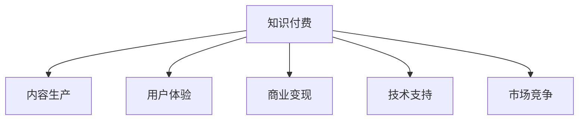

                 

# 知识付费创业者的自我提升策略

## 1. 背景介绍

### 1.1 问题由来

知识付费，作为互联网时代的新商业模式，近年来取得了飞速的发展。通过为知识付费，消费者可以更高效地获取高质量、有针对性的信息，满足个性化需求，而知识提供者则能够获得合理的回报，实现价值变现。在这一过程中，知识付费创业者的角色至关重要，他们既要懂得如何将知识转化为产品，又要能够有效提升自身的能力，持续创新，以应对市场竞争。

### 1.2 问题核心关键点

知识付费创业者的自我提升涉及多个关键方面，包括市场定位、内容生产、用户体验、商业模式创新等。本文将聚焦于这些关键点的深入分析，结合最新技术和工具，为知识付费创业者提供一套全面的自我提升策略。

## 2. 核心概念与联系

### 2.1 核心概念概述

为更好地理解知识付费创业者的自我提升策略，本节将介绍几个核心概念：

- **知识付费**：通过付费获取知识和信息的商业模式，强调专业性和深度内容，能够满足用户个性化需求，提升用户体验。

- **内容生产**：知识付费的核心在于优质内容，包括文章、视频、音频、课程等多种形式，需要深入挖掘和生产高质量内容。

- **用户体验**：用户体验是知识付费产品成功的关键，涉及界面设计、交互流畅性、个性化推荐等多个方面。

- **商业变现**：除了直接的订阅收费，知识付费还涉及会员制度、知识付费社群、广告等多元化的商业变现模式。

- **技术支持**：云计算、大数据、人工智能等技术为知识付费产品提供强有力的技术支撑，帮助优化产品运营。

- **市场竞争**：在知识付费领域，各大平台和创业者之间的竞争激烈，如何有效吸引和留住用户，成为一大挑战。

这些概念通过以下Mermaid流程图展示其联系：



这个流程图展示了知识付费的核心要素及其相互关系：

1. **知识付费**是起点，要求优质的**内容生产**作为支撑。
2. **用户体验**是产品成功的关键，与内容生产密不可分。
3. **商业变现**依赖于优质内容和良好用户体验，同时需要通过**技术支持**来实现。
4. **市场竞争**是知识付费创业者的外部挑战，需要通过产品创新和市场策略来应对。

## 3. 核心算法原理 & 具体操作步骤

### 3.1 算法原理概述

知识付费创业者的自我提升，可以通过一系列的算法和技术手段来实现。核心算法包括但不限于用户行为分析、个性化推荐、流量优化、用户留存策略等。

**用户行为分析**：通过数据分析用户的购买行为、阅读习惯、互动情况等，帮助理解用户需求和偏好。

**个性化推荐**：利用机器学习算法，如协同过滤、内容推荐等，为用户推荐最相关的知识产品。

**流量优化**：通过SEO优化、广告投放等手段，提升平台流量和转化率。

**用户留存策略**：通过持续的产品迭代和用户反馈，提高用户满意度和忠诚度，增加用户留存率。

### 3.2 算法步骤详解

**Step 1: 数据收集与分析**

- 收集用户行为数据，包括访问记录、购买记录、评论反馈等。
- 分析用户行为特征，识别热门主题、高频用户群体等。

**Step 2: 算法模型选择与训练**

- 选择合适的推荐算法，如协同过滤、深度学习等。
- 使用用户行为数据训练推荐模型，优化模型参数。

**Step 3: 算法应用与优化**

- 将训练好的推荐模型应用于产品，为不同用户推荐内容。
- 根据用户反馈和模型表现，不断优化算法，提高推荐效果。

**Step 4: 流量获取与转化**

- 进行SEO优化，提升搜索引擎排名。
- 投放定向广告，吸引目标用户群体。

**Step 5: 用户留存与互动**

- 定期进行产品迭代，增加新功能和新内容。
- 开展用户互动活动，提升用户参与度。

### 3.3 算法优缺点

知识付费创业者的自我提升算法具有以下优点：

- 提升内容匹配度：个性化推荐算法能够提高内容的匹配度，提升用户体验。
- 增加流量和收入：流量优化和商业变现策略能够带来更多的流量和收入。
- 用户留存率高：通过持续的产品迭代和用户互动，能够提高用户留存率，降低获客成本。

同时，这些算法也存在一定的局限性：

- 数据隐私问题：用户行为数据收集和分析可能涉及用户隐私，需要严格遵守相关法规。
- 模型复杂度：复杂的推荐模型需要更多的数据和计算资源，可能导致部署成本增加。
- 算法依赖性：过度依赖算法可能导致产品缺乏创意，忽视用户需求的多样性。

### 3.4 算法应用领域

这些算法在知识付费领域的应用广泛，具体包括：

- **内容推荐**：为不同用户推荐其感兴趣的内容，提升用户体验和满意度。
- **广告投放**：通过定向广告吸引潜在用户，提升平台流量。
- **流量优化**：通过SEO优化、内容推广等方式提升搜索引擎排名和流量。
- **用户留存**：通过用户互动和产品迭代，提高用户留存率，降低流失率。

## 4. 数学模型和公式 & 详细讲解

### 4.1 数学模型构建

本节将使用数学语言对知识付费创业者自我提升的算法进行严格刻画。

假设知识付费平台有 $N$ 个用户，每个用户有 $M$ 个行为数据 $D_{ui}=\{(x_i,y_i)\}_{i=1}^M$，其中 $x_i$ 表示行为特征（如访问时间、访问时长），$y_i$ 表示行为标签（如购买、收藏等）。

定义推荐系统模型的预测函数为 $f_u(x_i) = \hat{y}_i$，其中 $\hat{y}_i$ 表示预测标签。

推荐系统的目标是最小化预测错误率，即：

$$
\min_{\theta} \sum_{u=1}^N \sum_{i=1}^M \ell(f_u(x_i), y_i)
$$

其中 $\ell$ 为损失函数，常用的有均方误差、交叉熵等。

### 4.2 公式推导过程

以协同过滤算法为例，推导用户行为预测的公式：

协同过滤基于用户的协同行为，即相似用户具有相似行为。假设用户 $u$ 和 $v$ 的相似度为 $s_{uv}$，通过计算用户 $u$ 和 $v$ 的协同向量，得到用户 $u$ 对知识产品 $i$ 的预测评分：

$$
\hat{y}_{ui} = \sum_{v=1}^N s_{uv} y_{vi}
$$

其中 $s_{uv}$ 可通过余弦相似度等方法计算。

### 4.3 案例分析与讲解

以电商平台的商品推荐为例，分析协同过滤算法的效果。假设平台有 $U$ 个用户，$I$ 个商品，用户 $u$ 对商品 $i$ 的评分 $r_{ui} \in [1,5]$。通过协同过滤算法，计算用户 $u$ 对商品 $i$ 的预测评分 $\hat{r}_{ui}$，然后选择预测评分高的商品推荐给用户。

## 5. 项目实践：代码实例和详细解释说明

### 5.1 开发环境搭建

在进行知识付费产品开发前，需要准备开发环境：

1. 安装Python，推荐使用3.8及以上版本。
2. 安装Django等Web框架，用于搭建知识付费平台的后端服务。
3. 安装TensorFlow或PyTorch等机器学习库，用于实现推荐算法和流量优化策略。
4. 安装MySQL或MongoDB等数据库，用于存储用户行为数据和知识产品信息。

### 5.2 源代码详细实现

以下是使用TensorFlow实现协同过滤推荐系统的Python代码：

```python
import tensorflow as tf
import numpy as np
from sklearn.metrics import mean_squared_error

# 准备数据
user_data = np.random.rand(100, 10)  # 用户行为特征矩阵
user_ratings = np.random.rand(100, 5)  # 用户对商品评分矩阵

# 构建协同过滤模型
num_users = user_data.shape[0]
num_items = user_ratings.shape[1]
latent_dim = 10

user_factors = tf.Variable(tf.random.normal([num_users, latent_dim]))
item_factors = tf.Variable(tf.random.normal([num_items, latent_dim]))

def predict(user_idx, item_idx):
    user_factors = user_factors[user_idx]
    item_factors = item_factors[item_idx]
    rating_pred = tf.reduce_sum(tf.multiply(user_factors, item_factors), axis=1)
    return rating_pred

# 定义损失函数和优化器
rating_pred = predict(0, 0)
rating_true = user_ratings[0, 0]
loss = tf.losses.mean_squared_error(labels=tf.constant(rating_true), predictions=rating_pred)
optimizer = tf.optimizers.Adam(learning_rate=0.01)

# 训练模型
for epoch in range(100):
    for user_idx in range(num_users):
        for item_idx in range(num_items):
            rating_pred = predict(user_idx, item_idx)
            loss = tf.losses.mean_squared_error(labels=tf.constant(user_ratings[user_idx, item_idx]), predictions=rating_pred)
            optimizer.minimize(loss)

# 评估模型
mse = mean_squared_error(user_ratings, predict(np.arange(num_users), np.arange(num_items)))
print("MSE:", mse)
```

### 5.3 代码解读与分析

**协同过滤模型的实现**：
- 使用TensorFlow定义用户和商品的因子向量。
- 定义预测函数，计算用户对商品的预测评分。
- 定义损失函数，使用均方误差衡量预测误差。
- 使用Adam优化器进行模型训练。

**模型评估**：
- 通过计算均方误差评估模型性能。
- 输出最终评估结果，评估模型的预测能力。

## 6. 实际应用场景

### 6.1 在线教育平台

在线教育平台通过知识付费创业者的自我提升，能够提供更加个性化和高效的课程推荐，提升用户体验和学习效果。

具体应用包括：
- 通过学习行为数据分析，为学生推荐适合的课程和学习计划。
- 利用个性化推荐算法，向学生推荐与其兴趣和水平相匹配的课程。
- 通过广告和流量优化，增加平台流量和用户注册量。
- 通过用户互动和课程反馈，不断改进课程内容和推荐策略。

### 6.2 知识社区平台

知识社区平台为知识创作者和用户提供了一个交流和学习的平台。知识付费创业者可以通过提升产品和服务，吸引更多高质量的创作者和用户。

具体应用包括：
- 为创作者提供优质工具和资源，帮助其提升内容质量。
- 利用推荐算法，为用户推荐感兴趣的创作者和内容。
- 通过流量优化和广告投放，扩大平台影响力和用户群体。
- 通过社区互动和用户反馈，提升平台的用户粘性和活跃度。

### 6.3 专业书籍阅读平台

专业书籍阅读平台为专业人士提供高效阅读和学习资源，帮助其在繁忙的工作中提升知识和技能。

具体应用包括：
- 通过推荐算法，为用户推荐相关领域的高质量书籍。
- 利用用户行为数据分析，优化书籍推荐策略。
- 通过流量优化和广告投放，增加平台流量和收入。
- 通过用户互动和反馈，不断改进阅读体验和平台功能。

### 6.4 未来应用展望

知识付费领域的自我提升策略在未来仍有巨大的发展空间。以下是一些未来应用展望：

- **智能化推荐系统**：通过引入自然语言处理和计算机视觉技术，提升推荐系统的智能化程度，更准确地预测用户需求。
- **交互式内容**：开发更多交互式内容，如在线问答、互动视频等，提升用户参与度和满意度。
- **隐私保护**：通过加密和匿名化处理用户数据，保障用户隐私，提升平台信任度。
- **区块链技术**：利用区块链技术，确保内容的真实性和版权，增加平台的公信力和用户黏性。

## 7. 工具和资源推荐

### 7.1 学习资源推荐

为帮助知识付费创业者提升自我，这里推荐一些优质的学习资源：

1. **《深度学习》课程**：由深度学习领域的顶尖专家开设，涵盖深度学习的基础知识和高级技术。
2. **《知识付费商业模型》书籍**：探讨知识付费商业模式的核心要素和创新思路。
3. **Coursera平台**：提供大量优质的在线课程，涵盖机器学习、数据科学等多个领域。
4. **Kaggle平台**：提供丰富的数据集和竞赛，帮助开发者提升数据处理和算法建模能力。

### 7.2 开发工具推荐

以下是一些常用的开发工具，适合知识付费创业者使用：

1. **Python**：推荐使用3.8及以上版本，具有强大的数据处理和算法支持。
2. **Django**：适合搭建知识付费平台的后端服务，具有丰富的插件和扩展库。
3. **TensorFlow**：开源的机器学习框架，支持深度学习和推荐算法实现。
4. **MySQL/MongoDB**：常用的关系型/非关系型数据库，适合存储和管理用户行为数据和知识产品信息。
5. **Jupyter Notebook**：用于数据探索和算法调试，支持多种编程语言和数据可视化。

### 7.3 相关论文推荐

这些论文代表了知识付费领域的发展趋势和技术前沿，值得深入阅读：

1. **《协同过滤推荐系统》**：介绍协同过滤算法的原理和实现，为推荐系统提供理论基础。
2. **《深度学习在知识付费中的应用》**：探讨深度学习在推荐系统、广告投放和流量优化中的应用。
3. **《隐私保护在知识付费平台中的应用》**：分析隐私保护技术在知识付费平台中的重要性和实现方法。
4. **《区块链技术在知识付费中的创新应用》**：探讨区块链技术在版权保护和用户激励中的创新应用。

## 8. 总结：未来发展趋势与挑战

### 8.1 总结

本文系统地介绍了知识付费创业者在市场定位、内容生产、用户体验、商业变现等方面的自我提升策略。从算法原理到具体步骤，结合实际应用场景和工具推荐，为知识付费创业者提供了全面的指导。通过这些策略的应用，知识付费创业者能够提升产品质量，扩大市场影响力，实现商业价值最大化。

### 8.2 未来发展趋势

知识付费领域的未来发展趋势包括：

- **个性化和智能化**：随着技术的不断进步，推荐系统将更加智能化，能够更加精准地预测用户需求，提升用户体验。
- **多模态融合**：结合图像、视频等多模态数据，提升推荐系统的丰富性和用户参与度。
- **隐私保护**：随着用户隐私意识的增强，隐私保护技术将越来越重要，保障用户数据的安全和隐私。
- **区块链应用**：区块链技术将带来更多创新的应用场景，如版权保护、用户激励等。

### 8.3 面临的挑战

知识付费创业者在提升自我时，面临的挑战包括：

- **数据质量问题**：用户行为数据的质量和数量对推荐系统的准确性有重要影响，需要重视数据收集和清洗工作。
- **算法复杂度**：复杂的推荐算法需要更多的计算资源，可能需要更高的技术门槛。
- **用户体验优化**：提升用户体验是一个持续的过程，需要不断进行产品迭代和用户反馈分析。
- **商业模式创新**：知识付费创业者需要在商业模式上进行创新，探索更多元化的盈利模式。

### 8.4 研究展望

未来知识付费领域的研究方向包括：

- **跨领域知识融合**：结合不同领域知识，提升推荐系统的深度和广度。
- **用户行为分析**：深入分析用户行为，挖掘更多潜在价值。
- **智能交互系统**：开发更多智能交互系统，提升用户参与度和满意度。
- **隐私保护技术**：研发更加先进的隐私保护技术，保障用户数据的安全。

## 9. 附录：常见问题与解答

**Q1：如何提升知识付费平台的用户留存率？**

A: 提升用户留存率的关键在于不断优化用户体验和提升平台价值。具体措施包括：
1. 提供优质内容：保证内容的深度和广度，吸引用户持续关注。
2. 个性化推荐：通过推荐算法，为用户推荐感兴趣的课程和学习资源。
3. 用户互动：开展用户互动活动，如在线问答、课程讨论等，增加用户参与度。
4. 积分和奖励：通过积分和奖励机制，激励用户持续学习。

**Q2：知识付费平台如何进行流量优化？**

A: 流量优化主要通过以下方法实现：
1. 搜索引擎优化（SEO）：通过优化网站内容和结构，提升搜索引擎排名，增加自然流量。
2. 定向广告：投放精准的定向广告，吸引目标用户群体。
3. 社交媒体推广：通过社交媒体平台推广平台和课程，扩大用户群体。
4. 内容推广：通过邮件、推送等方式推广优质内容，增加用户粘性。

**Q3：知识付费平台如何保障用户隐私？**

A: 保障用户隐私主要通过以下措施：
1. 数据匿名化：对用户行为数据进行匿名化处理，保障用户隐私。
2. 数据加密：对用户数据进行加密存储和传输，防止数据泄露。
3. 隐私政策：制定透明的隐私政策，告知用户数据使用情况。
4. 合规审查：定期进行隐私合规审查，保障数据使用符合相关法规。

**Q4：知识付费平台如何进行商业模式创新？**

A: 商业模式创新可以通过以下方式实现：
1. 多元化变现：除了直接的订阅收费，还可以探索课程销售、知识付费社群、广告等多元化的盈利模式。
2. 会员制度：设计会员制度，提供优质内容和专属服务，提升用户粘性。
3. 知识付费社群：建立知识付费社群，增加用户互动和交流。
4. 知识付费联盟：与其他平台或机构合作，形成知识付费联盟，共享资源和用户。

总之，知识付费创业者需要通过持续的自我提升，结合先进的技术和创新思路，提升产品质量和用户体验，实现商业价值的最大化。未来，随着技术的不断发展，知识付费领域将迎来更多创新应用和商业模式的探索，为创作者和用户带来更多价值。

---

作者：禅与计算机程序设计艺术 / Zen and the Art of Computer Programming

