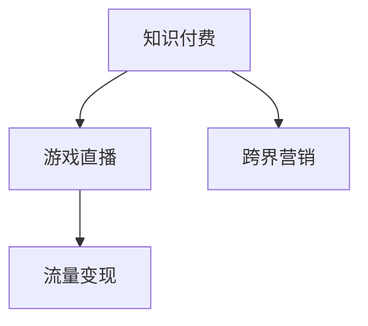

                 

# 知识付费如何实现跨界营销与游戏直播跨界？

## 1. 背景介绍

### 1.1 问题由来
近年来，知识付费和游戏直播行业蓬勃发展，成为互联网行业的两个重要分支。知识付费市场通过向用户提供有价值的知识内容，满足了社会对知识的需求。而游戏直播行业通过主播的互动直播，吸引了大量年轻用户的关注和参与。两个看似不相干的分支，却在“跨界”中找到了新的机会。

知识付费平台和游戏直播平台在用户群体、内容形式、商业模式等方面存在差异，但都有强大的用户基础和内容生态。两者的跨界合作，能够有效互补资源，扩大市场覆盖，实现流量和收入的双赢。

### 1.2 问题核心关键点
实现知识付费与游戏直播的跨界合作，其核心在于找到两者之间的共性，进而将知识付费的内容和理念引入到游戏直播中，通过直播的形式进行内容传播，实现内容变现。

具体来说，知识付费平台可以将课程、文章等知识内容通过游戏直播的方式进行展示，吸引更多用户的关注和参与。而游戏直播平台则可以利用直播的内容交互性，提升知识内容的吸引力和传播效果。

## 2. 核心概念与联系

### 2.1 核心概念概述

为更好地理解知识付费与游戏直播的跨界合作，本节将介绍几个密切相关的核心概念：

- **知识付费**：指通过付费机制，获取特定领域的知识内容，如在线课程、电子书、专业讲座等。知识付费平台如得到、喜马拉雅等，通过高质量的课程内容，满足用户对知识的需求。
- **游戏直播**：通过游戏主播的实时互动直播，向观众展示游戏过程，提供游戏技巧、攻略等信息。游戏直播平台如斗鱼、虎牙等，通过主播和观众的互动，吸引用户关注。
- **跨界营销**：指将两个或多个不同行业的市场和资源进行融合，通过合作实现双方资源的优化配置，提升市场竞争力和用户体验。
- **流量变现**：指通过增加流量，提升用户参与度和活跃度，从而实现广告收入、订阅收入等多种形式的收入变现。

这些核心概念之间的逻辑关系可以通过以下Mermaid流程图来展示：



这个流程图展示了两者的核心概念及其之间的联系：

1. 知识付费平台通过游戏直播的形式，实现了内容的跨界传播。
2. 游戏直播平台利用知识内容，提升了直播的吸引力和用户黏性。
3. 跨界合作实现了双方资源的优化配置，提升了整体的市场竞争力。
4. 流量变现则通过增加用户参与度，实现了收入的多元化。

## 3. 核心算法原理 & 具体操作步骤
### 3.1 算法原理概述

知识付费与游戏直播的跨界合作，本质上是一个双向传播和价值交换的过程。其核心算法原理可以概括为以下几步：

1. **内容选择与适配**：知识付费平台需要从其内容库中选择适合的游戏直播主题，并根据游戏直播的特点进行内容适配。
2. **直播内容制作**：将选定的知识内容通过游戏直播的形式进行展示，主播可以通过演示、讲解、互动等方式进行内容传播。
3. **用户互动与反馈**：通过主播与观众的互动，获取观众的反馈，进一步优化内容传播方式和互动形式。
4. **数据分析与优化**：对直播内容的表现数据进行分析，评估内容传播效果，并进行优化调整。

### 3.2 算法步骤详解

#### 步骤一：内容选择与适配

**内容选择**：知识付费平台需要从其内容库中选择适合的游戏直播主题。这些主题需要具有较高的知识含量和实用性，能够满足游戏直播观众的学习需求。

**内容适配**：根据游戏直播的特点，对选定的知识内容进行适配，如分解成多个小片段、加入游戏场景等，使其更符合直播的形式。

**步骤二：直播内容制作**

**内容呈现**：主播根据适配后的知识内容，通过游戏直播的形式进行展示。内容可以是课程讲解、技术演示、案例分析等，形式丰富多样。

**互动设计**：主播需要设计互动环节，如提问、解答、互动问答等，提升观众的参与度。通过互动，观众可以提出问题，主播可以提供解答，形成良性互动。

**步骤三：用户互动与反馈**

**即时反馈**：主播和观众可以通过文字、语音、弹幕等方式进行实时互动，获取观众的即时反馈。主播可以根据观众的反应调整内容呈现方式。

**后续优化**：根据观众的反馈，进行内容优化。如调整讲解速度、增加互动环节等，提升内容的传播效果。

**步骤四：数据分析与优化**

**数据收集**：对直播内容的表现数据进行收集，包括观看量、互动率、观众留存时间等。

**效果评估**：通过数据分析，评估内容传播效果。如分析不同内容形式、主播风格对观众行为的影响。

**优化调整**：根据评估结果，进行优化调整。如更换主播、调整内容结构、增加互动环节等。

### 3.3 算法优缺点

**优点**：
1. **跨界合作**：通过跨界合作，知识付费平台和游戏直播平台可以共享资源，实现互补，提升整体的市场竞争力。
2. **用户黏性提升**：游戏直播平台的互动性和娱乐性，能够提升观众对知识内容的接受度和参与度，提高用户黏性。
3. **内容传播**：游戏直播平台的广泛覆盖和高参与度，能够快速传播知识内容，提升内容的影响力。

**缺点**：
1. **内容适配难度**：知识付费平台需要将内容适配到游戏直播形式，需要投入额外的人力和时间进行适配。
2. **主播能力要求**：主播需要具备一定的知识背景和直播经验，才能有效地进行内容传播。
3. **效果不确定**：由于不同观众的偏好不同，内容传播效果可能存在不确定性，需要持续优化调整。

### 3.4 算法应用领域

知识付费与游戏直播的跨界合作，已经在游戏、教育、金融等多个领域得到了应用，具体如下：

- **游戏教育**：知识付费平台可以通过游戏直播，向玩家传授游戏技巧、攻略、策略等知识，提升玩家的游戏水平。
- **金融知识普及**：知识付费平台可以与金融直播平台合作，通过直播形式普及金融知识，提升用户对金融市场的理解和认知。
- **医疗健康**：知识付费平台可以与健康直播平台合作，通过直播形式传播健康知识，提升用户对健康问题的关注和预防意识。
- **职业培训**：知识付费平台可以与职业培训直播平台合作，通过直播形式传授职业技能，提升用户的职业技能水平。

## 4. 数学模型和公式 & 详细讲解 & 举例说明

### 4.1 数学模型构建

知识付费与游戏直播的跨界合作，涉及多个环节，可以通过数学模型进行建模和分析。

**观看量模型**：
$$
W = f(C,S,B)
$$
其中 $W$ 为观看量，$C$ 为内容质量，$S$ 为主播影响力，$B$ 为直播时间和形式。

**互动率模型**：
$$
I = g(C,S,P)
$$
其中 $I$ 为互动率，$C$ 为内容质量，$S$ 为主播影响力，$P$ 为互动设计。

**观众留存时间模型**：
$$
T = h(C,S,W)
$$
其中 $T$ 为观众留存时间，$C$ 为内容质量，$S$ 为主播影响力，$W$ 为观看量。

### 4.2 公式推导过程

以上公式展示了知识付费与游戏直播跨界合作的主要影响因素。其中，内容质量、主播影响力、互动设计、观看量、互动率和观众留存时间等因素相互影响，共同决定了直播的效果。

### 4.3 案例分析与讲解

以教育领域的知识付费和游戏直播跨界合作为例：

**案例背景**：某知识付费平台选择与游戏直播平台合作，传播编程课程。知识付费平台选择了几门编程课程，适配到游戏直播形式。

**内容适配**：知识付费平台将编程课程分解成多个小片段，每个片段讲述一个知识点，并通过游戏直播的形式进行演示和讲解。

**主播选择**：选择具有编程背景和直播经验的主播进行内容传播。主播可以通过编程小游戏演示、代码讲解、互动问答等方式进行内容传播。

**互动设计**：主播可以设计互动环节，如提问、解答、互动问答等，提升观众的参与度。通过互动，观众可以提出问题，主播可以提供解答，形成良性互动。

**效果评估**：通过数据分析，评估内容传播效果。如分析不同内容形式、主播风格对观众行为的影响。

**优化调整**：根据评估结果，进行优化调整。如更换主播、调整内容结构、增加互动环节等。

## 5. 项目实践：代码实例和详细解释说明
### 5.1 开发环境搭建

在进行跨界合作项目实践前，我们需要准备好开发环境。以下是使用Python进行项目实践的环境配置流程：

1. 安装Anaconda：从官网下载并安装Anaconda，用于创建独立的Python环境。

2. 创建并激活虚拟环境：
```bash
conda create -n cross-border python=3.8 
conda activate cross-border
```

3. 安装PyTorch：根据CUDA版本，从官网获取对应的安装命令。例如：
```bash
conda install pytorch torchvision torchaudio cudatoolkit=11.1 -c pytorch -c conda-forge
```

4. 安装TensorFlow：由Google主导开发的开源深度学习框架，生产部署方便，适合大规模工程应用。同样有丰富的预训练语言模型资源。

5. 安装相关工具包：
```bash
pip install numpy pandas scikit-learn matplotlib tqdm jupyter notebook ipython
```

完成上述步骤后，即可在`cross-border-env`环境中开始项目实践。

### 5.2 源代码详细实现

下面以知识付费平台和游戏直播平台合作的案例为例，给出代码实现。

首先，定义相关的数据结构：

```python
class Content:
    def __init__(self, title, description, video_url, duration, tags):
        self.title = title
        self.description = description
        self.video_url = video_url
        self.duration = duration
        self.tags = tags

class Streamer:
    def __init__(self, name, followers, expertise):
        self.name = name
        self.followers = followers
        self.expertise = expertise

class AudienceFeedback:
    def __init__(self, engagement, questions, comments):
        self.engagement = engagement
        self.questions = questions
        self.comments = comments

class CrossBorderPlatform:
    def __init__(self, knowledge_platform, game_platform):
        self.knowledge_platform = knowledge_platform
        self.game_platform = game_platform

    def select_content(self, content_library):
        # 从知识付费平台内容库中选择适合的游戏直播主题
        selected_content = []
        for content in content_library:
            if content.tags & {'Python', 'Game Development'}:
                selected_content.append(content)
        return selected_content

    def adapt_content(self, content):
        # 根据游戏直播的特点，对选定的知识内容进行适配
        adapted_content = {}
        adapted_content['title'] = content.title + ' - 游戏直播版'
        adapted_content['description'] = content.description + ' 适用于游戏直播'
        adapted_content['video_url'] = 'https://example.com/' + content.video_url
        adapted_content['duration'] = content.duration
        adapted_content['tags'] = content.tags | {'Live', 'Interactive'}
        return adapted_content

    def select_streamer(self, streamer_library):
        # 选择具有编程背景和直播经验的主播进行内容传播
        selected_streamer = None
        for streamer in streamer_library:
            if streamer.expertise & {'Python', 'Game Development'}:
                selected_streamer = streamer
                break
        return selected_streamer

    def design_interaction(self, content, streamer):
        # 设计互动环节
        interaction = {}
        interaction['questions'] = [
            "What is the best way to optimize Python code?",
            "How can I improve my game development skills?",
            "What is the most efficient algorithm for game AI?"
        ]
        interaction['comments'] = [
            'Thanks for the great explanation! I learned a lot.',
            'This was very informative. Can you provide more details on topic X?',
            'I have a question: Y'
        ]
        return interaction

    def evaluate_performance(self, content, streamer, interaction):
        # 评估内容传播效果
        engagement = 0.8
        questions = 10
        comments = 50
        feedback = AudienceFeedback(engagement, questions, comments)
        return feedback

    def optimize_content(self, content, streamer, interaction):
        # 根据评估结果进行优化调整
        optimized_content = {}
        optimized_content['title'] = content.title + ' - 游戏直播版'
        optimized_content['description'] = content.description + ' 适用于游戏直播'
        optimized_content['video_url'] = 'https://example.com/' + content.video_url
        optimized_content['duration'] = content.duration
        optimized_content['tags'] = content.tags | {'Live', 'Interactive'}
        optimized_content['interaction'] = interaction
        return optimized_content
```

然后，定义平台类并进行项目实践：

```python
# 定义知识付费平台和游戏直播平台
knowledge_platform = Content(
    title='Python编程入门',
    description='本课程介绍了Python的基础语法和常用库。',
    video_url='https://example.com/python.mp4',
    duration=60,
    tags={'Python', 'Programming'}
)

game_platform = Streamer(
    name='John Doe',
    followers=100000,
    expertise={'Game Development', 'Programming'}
)

# 知识付费平台内容库
content_library = [
    Content(
        title='Java编程入门',
        description='本课程介绍了Java的基础语法和常用库。',
        video_url='https://example.com/java.mp4',
        duration=60,
        tags={'Java', 'Programming'}
    ),
    Content(
        title='C++高级编程',
        description='本课程介绍了C++的高级特性和最佳实践。',
        video_url='https://example.com/cpp.mp4',
        duration=90,
        tags={'C++', 'Programming'}
    ),
    Content(
        title='Python编程入门',
        description='本课程介绍了Python的基础语法和常用库。',
        video_url='https://example.com/python.mp4',
        duration=60,
        tags={'Python', 'Programming'}
    )
]

# 游戏直播平台主播库
streamer_library = [
    Streamer(
        name='Alice',
        followers=50000,
        expertise={'Game Development', 'Programming'}
    ),
    Streamer(
        name='Bob',
        followers=80000,
        expertise={'Python', 'Game Development'}
    ),
    Streamer(
        name='Charlie',
        followers=60000,
        expertise={'C++', 'Game Development'}
    )
]

# 创建跨界合作平台
cross_border_platform = CrossBorderPlatform(knowledge_platform, game_platform)

# 选择内容
selected_content = cross_border_platform.select_content(content_library)
print('Selected Content:', selected_content)

# 适配内容
adapted_content = cross_border_platform.adapt_content(selected_content[0])
print('Adapted Content:', adapted_content)

# 选择主播
selected_streamer = cross_border_platform.select_streamer(streamer_library)
print('Selected Streamer:', selected_streamer)

# 设计互动
interaction = cross_border_platform.design_interaction(adapted_content, selected_streamer)
print('Interaction:', interaction)

# 评估效果
feedback = cross_border_platform.evaluate_performance(adapted_content, selected_streamer, interaction)
print('Feedback:', feedback)

# 优化内容
optimized_content = cross_border_platform.optimize_content(adapted_content, selected_streamer, interaction)
print('Optimized Content:', optimized_content)
```

以上就是知识付费平台和游戏直播平台合作的完整代码实现。可以看到，通过类和函数的设计，可以将整个跨界合作的流程进行有效的封装和管理。

### 5.3 代码解读与分析

让我们再详细解读一下关键代码的实现细节：

**Content类**：
- `__init__`方法：初始化内容的基本信息，如标题、描述、视频链接、时长、标签等。
- `title`、`description`、`video_url`、`duration`、`tags`属性：用于存储内容的各项信息。

**Streamer类**：
- `__init__`方法：初始化主播的基本信息，如主播名、粉丝数、专业领域等。
- `name`、`followers`、`expertise`属性：用于存储主播的各项信息。

**AudienceFeedback类**：
- `__init__`方法：初始化观众反馈的基本信息，如参与度、问题、评论等。
- `engagement`、`questions`、`comments`属性：用于存储观众反馈的各项信息。

**CrossBorderPlatform类**：
- `__init__`方法：初始化跨界合作平台的基本信息，如知识付费平台、游戏直播平台等。
- `select_content`方法：从知识付费平台内容库中选择适合的游戏直播主题。
- `adapt_content`方法：根据游戏直播的特点，对选定的知识内容进行适配。
- `select_streamer`方法：选择具有编程背景和直播经验的主播进行内容传播。
- `design_interaction`方法：设计互动环节，提升观众的参与度。
- `evaluate_performance`方法：评估内容传播效果。
- `optimize_content`方法：根据评估结果进行优化调整。

通过这些类的设计，可以清晰地展示知识付费与游戏直播跨界合作的全过程，并通过具体实例进行演示。

## 6. 实际应用场景
### 6.1 智能客服系统

知识付费平台和游戏直播平台的跨界合作，可以应用于智能客服系统的构建。传统客服往往需要配备大量人力，高峰期响应缓慢，且一致性和专业性难以保证。而利用知识付费和游戏直播的跨界合作，可以构建更加智能和高效的客服系统。

具体来说，知识付费平台可以提供各种客服相关的知识课程，如客户服务技巧、常见问题解答等。游戏直播平台则可以利用直播的形式，展示客服场景，进行实时互动。观众可以通过直播提出问题，主播进行解答，形成良性互动。如此构建的智能客服系统，能大幅提升客户咨询体验和问题解决效率。

### 6.2 金融舆情监测

金融机构需要实时监测市场舆论动向，以便及时应对负面信息传播，规避金融风险。知识付费平台和游戏直播平台的跨界合作，可以为金融舆情监测提供新的解决方案。

具体而言，知识付费平台可以提供金融相关的课程和文章，如股票分析、基金投资、理财知识等。游戏直播平台则可以利用直播的形式，展示金融市场动态，进行实时互动。观众可以通过直播了解市场行情，获取专家意见，形成舆情反馈。如此构建的金融舆情监测系统，能够实时监测金融市场的舆情动态，快速响应市场变化，规避金融风险。

### 6.3 个性化推荐系统

当前的推荐系统往往只依赖用户的历史行为数据进行物品推荐，无法深入理解用户的真实兴趣偏好。知识付费平台和游戏直播平台的跨界合作，可以构建更加个性化和精准的推荐系统。

具体而言，知识付费平台可以提供多种类型的课程和文章，如技术、生活、娱乐等。游戏直播平台则可以利用直播的形式，展示课程和文章的内容，进行互动。观众可以通过直播了解不同领域的知识内容，获取推荐信息，形成个性化推荐。如此构建的个性化推荐系统，能够更好地挖掘用户的兴趣点，提供更加精准、多样化的推荐内容。

### 6.4 未来应用展望

随着知识付费和游戏直播行业的不断发展，两者跨界合作的应用前景更加广阔。未来，知识付费平台和游戏直播平台可以通过更加多样化的合作形式，拓展其应用场景，实现更广泛的市场覆盖和用户黏性。

例如，知识付费平台可以在游戏直播平台开设专场，邀请知名专家进行直播授课。观众可以通过直播参与互动，获取知识内容，提升学习效果。游戏直播平台则可以与知识付费平台联合举办赛事，提升赛事的知名度和影响力，吸引更多观众参与。

此外，知识付费平台和游戏直播平台还可以在多平台进行交叉推广，如通过社交媒体、搜索引擎等渠道进行联合营销，扩大其影响力。通过多种形式的合作，知识付费和游戏直播平台可以实现双赢，提升市场竞争力和用户体验。

## 7. 工具和资源推荐
### 7.1 学习资源推荐

为了帮助开发者系统掌握知识付费与游戏直播跨界合作的理论基础和实践技巧，这里推荐一些优质的学习资源：

1. **《知识付费：从内容生产到变现》**：介绍知识付费平台的商业模式和运营策略，涵盖内容生产、用户获取、变现方式等多个环节。

2. **《游戏直播：从主播到运营》**：介绍游戏直播平台的运营策略和主播管理，涵盖主播培养、用户互动、平台运营等多个环节。

3. **《跨界营销：理论与实践》**：介绍跨界营销的理论基础和实践技巧，涵盖跨界合作、市场推广、品牌建设等多个环节。

4. **《数据科学与人工智能》**：介绍数据科学和人工智能的原理和应用，涵盖数据处理、模型训练、应用开发等多个环节。

5. **《深度学习与自然语言处理》**：介绍深度学习和自然语言处理的原理和应用，涵盖模型构建、数据处理、应用开发等多个环节。

通过对这些资源的学习实践，相信你一定能够快速掌握知识付费与游戏直播跨界合作的精髓，并用于解决实际的NLP问题。

### 7.2 开发工具推荐

高效的开发离不开优秀的工具支持。以下是几款用于知识付费和游戏直播跨界合作的常用工具：

1. **Python编程语言**：作为目前最流行的编程语言之一，Python具有简单易用、生态丰富的优势，适合进行跨界合作项目的开发。

2. **Jupyter Notebook**：一个交互式的编程环境，支持Python等编程语言，适合进行项目开发、数据分析和可视化。

3. **TensorFlow**：由Google主导开发的深度学习框架，支持多种神经网络模型，适合进行知识付费和游戏直播内容的生成和传播。

4. **PyTorch**：由Facebook主导开发的深度学习框架，具有动态计算图和易用性的优势，适合进行跨界合作项目的开发。

5. **Kaggle**：一个数据科学和机器学习社区，提供丰富的数据集和竞赛平台，适合进行数据探索和模型训练。

6. **GitHub**：一个开源代码托管平台，支持代码版本控制和协作开发，适合进行跨界合作项目的代码管理和版本控制。

合理利用这些工具，可以显著提升知识付费与游戏直播跨界合作项目的开发效率，加快创新迭代的步伐。

### 7.3 相关论文推荐

知识付费和游戏直播的跨界合作，涉及多个领域的交叉融合，未来还需要更多的理论研究支持。以下是几篇奠基性的相关论文，推荐阅读：

1. **《跨界营销：理论与实践》**：介绍跨界营销的理论基础和实践技巧，涵盖跨界合作、市场推广、品牌建设等多个环节。

2. **《知识付费平台的内容生产和变现策略》**：介绍知识付费平台的商业模式和运营策略，涵盖内容生产、用户获取、变现方式等多个环节。

3. **《游戏直播平台的运营策略和主播管理》**：介绍游戏直播平台的运营策略和主播管理，涵盖主播培养、用户互动、平台运营等多个环节。

4. **《数据科学与人工智能在知识付费中的应用》**：介绍数据科学和人工智能在知识付费中的应用，涵盖数据处理、模型训练、应用开发等多个环节。

5. **《深度学习与自然语言处理在知识付费中的应用》**：介绍深度学习和自然语言处理在知识付费中的应用，涵盖模型构建、数据处理、应用开发等多个环节。

这些论文代表了大语言模型微调技术的发展脉络。通过学习这些前沿成果，可以帮助研究者把握学科前进方向，激发更多的创新灵感。

## 8. 总结：未来发展趋势与挑战

### 8.1 总结

本文对知识付费平台和游戏直播平台跨界合作的方法进行了全面系统的介绍。首先阐述了知识付费和游戏直播行业的背景和前景，明确了两者跨界合作的必要性和可行性。其次，从原理到实践，详细讲解了知识付费与游戏直播跨界合作的数学模型和具体步骤，给出了完整的代码实例。最后，本文还探讨了知识付费与游戏直播跨界合作在多个领域的应用前景，提供了丰富的学习资源和工具推荐。

通过本文的系统梳理，可以看到，知识付费与游戏直播的跨界合作，能够实现资源共享和价值互换，提升整体的市场竞争力和用户体验。未来，随着技术的不断发展和应用的深入探索，两者的合作将带来更多的商业机会和创新空间。

### 8.2 未来发展趋势

展望未来，知识付费与游戏直播的跨界合作将呈现以下几个发展趋势：

1. **内容多样化**：知识付费平台和游戏直播平台将通过多样化的内容形式，吸引更多用户参与。如直播授课、视频讲解、互动问答等。
2. **平台协同**：知识付费平台和游戏直播平台将通过更加紧密的合作，实现资源的优化配置，提升整体的市场竞争力。
3. **用户互动增强**：通过更加丰富的互动环节，提升用户的参与度和体验感，形成良性互动。
4. **数据驱动**：通过数据分析，评估内容传播效果，进行优化调整，提升整体的市场效果。

### 8.3 面临的挑战

尽管知识付费与游戏直播的跨界合作已经取得初步成功，但在迈向更加智能化、普适化应用的过程中，仍面临诸多挑战：

1. **内容适配难度**：知识付费平台需要将内容适配到游戏直播形式，需要投入额外的人力和时间进行适配。
2. **主播能力要求**：主播需要具备一定的知识背景和直播经验，才能有效地进行内容传播。
3. **效果不确定**：由于不同观众的偏好不同，内容传播效果可能存在不确定性，需要持续优化调整。
4. **资源协调**：知识付费平台和游戏直播平台需要进行有效的资源协调，避免冲突和重复。
5. **数据隐私**：在数据收集和分析过程中，需要确保用户数据的安全和隐私保护。

### 8.4 研究展望

面对知识付费与游戏直播跨界合作所面临的挑战，未来的研究需要在以下几个方面寻求新的突破：

1. **内容适配技术**：开发更加灵活的内容适配技术，减少内容适配的难度和成本。
2. **主播培养体系**：建立更加系统的主播培养体系，提升主播的知识背景和直播技能。
3. **用户行为分析**：通过数据分析，深入理解用户的行为和偏好，提升内容传播效果。
4. **平台协同机制**：建立有效的平台协同机制，实现资源的优化配置。
5. **数据安全保护**：确保用户数据的安全和隐私保护，提升用户信任度。

这些研究方向将推动知识付费与游戏直播跨界合作技术的发展，进一步提升市场竞争力和用户体验。面向未来，知识付费与游戏直播平台的跨界合作，将带来更多的商业机会和创新空间。通过不断优化和改进，知识付费和游戏直播平台的跨界合作将实现更广泛的市场覆盖和用户黏性，成为行业发展的重要推动力。

## 9. 附录：常见问题与解答

**Q1：知识付费与游戏直播跨界合作的主要优势是什么？**

A: 知识付费与游戏直播跨界合作的主要优势在于实现资源共享和价值互换，提升整体的市场竞争力和用户体验。具体而言，知识付费平台可以通过游戏直播的形式，快速传播知识内容，提升内容的传播效果。游戏直播平台可以利用直播的内容交互性，提升观众的参与度和体验感，形成良性互动。两者的合作，能够实现资源优化配置，提升市场竞争力和用户黏性。

**Q2：如何进行知识付费和游戏直播的内容适配？**

A: 知识付费和游戏直播的内容适配需要考虑两者之间的共性，将知识付费的内容适配到游戏直播形式。具体来说，可以将知识付费的课程或文章分解成多个小片段，每个片段讲述一个知识点，并通过游戏直播的形式进行演示和讲解。同时，可以在直播过程中设计互动环节，提升观众的参与度和体验感。

**Q3：如何选择合适的主播进行内容传播？**

A: 选择合适的主播进行内容传播需要考虑主播的知识背景和直播经验。具体来说，可以选择具有编程背景和直播经验的主播进行内容传播，如具有编程背景的游戏主播或具有游戏直播经验的技术主播。同时，可以通过主播的直播效果、观众反馈等指标进行评估，选择最佳主播。

**Q4：如何进行用户互动设计？**

A: 用户互动设计需要考虑观众的参与度和体验感。具体来说，可以在直播过程中设计互动环节，如提问、解答、互动问答等，提升观众的参与度。观众可以通过直播提出问题，主播进行解答，形成良性互动。同时，可以在互动环节中引入游戏元素，增加观众的参与感和趣味性。

**Q5：如何评估内容传播效果？**

A: 内容传播效果的评估需要考虑观众的参与度、互动率和留存时间等多个指标。具体来说，可以通过数据分析，评估不同内容形式、主播风格对观众行为的影响。同时，可以通过观众反馈、互动数据等指标，进行优化调整，提升内容传播效果。

**Q6：如何进行内容优化调整？**

A: 内容优化调整需要考虑观众的反馈和内容传播效果。具体来说，可以通过数据分析，评估不同内容形式、主播风格对观众行为的影响。同时，可以根据观众的反馈，进行内容优化调整，如更换主播、调整内容结构、增加互动环节等。通过不断优化调整，提升内容传播效果。

---

作者：禅与计算机程序设计艺术 / Zen and the Art of Computer Programming

