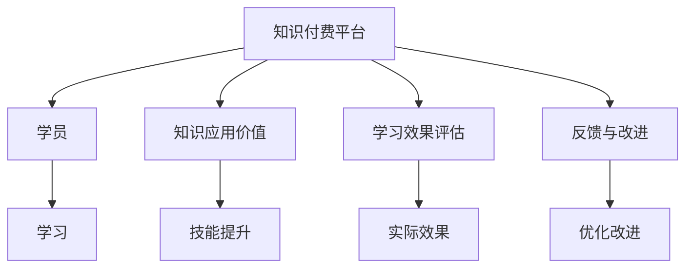

                 

# 知识付费帮助学员实现知识的应用价值

## 1. 背景介绍

在信息爆炸的互联网时代，知识的获取已经不再局限于传统的书籍、课堂讲授等形式。随着移动终端的普及和网络带宽的提升，各种知识付费平台应运而生，为学习者提供了更加便捷、高效的知识获取方式。知识付费平台通过专业讲师的授课、系统化的课程体系、实战案例的分享等方式，帮助学员在短时间内掌握实用的知识和技能。但仅仅付费获取知识是不够的，如何将知识转化为学员的能力，并实现知识的应用价值，成为了知识付费平台亟待解决的问题。本文将从知识付费平台的角度，探讨如何帮助学员实现知识的应用价值，并提出相应的策略和建议。

## 2. 核心概念与联系

### 2.1 核心概念概述

为更好地理解知识付费平台如何帮助学员实现知识的应用价值，本节将介绍几个密切相关的核心概念：

- **知识付费平台**：指通过互联网提供各类专业知识、技能培训和教育资源的平台，如Coursera、Udemy、网易云课堂等。
- **学员**：指知识付费平台的注册用户，通过付费或免费获取课程资源，以提升自身知识和技能。
- **知识应用价值**：指知识在实际工作、学习或生活场景中的实际应用效果，如技能提升、工作效率提高、问题解决能力增强等。
- **学习效果评估**：指通过各种方式评估学员在学习后所掌握的知识和技能是否满足实际需求，通常包括知识点的理解程度、实际操作的熟练度、任务完成的质量等。
- **反馈与改进**：指根据学习效果的评估结果，对课程内容、教学方式、学习资源等进行反馈和改进，以持续提升知识付费平台的服务质量。

这些核心概念之间的逻辑关系可以通过以下Mermaid流程图来展示：



这个流程图展示了几者之间的核心逻辑关系：

1. 知识付费平台向学员提供课程，学员通过学习提升自身知识和技能。
2. 课程学习后，学员应用所学知识，实现知识的应用价值，如技能提升、工作效率提高等。
3. 通过学习效果评估，平台了解学员的掌握情况，发现不足。
4. 根据反馈与改进，平台不断优化课程内容和教学方式，提升学习效果。

## 3. 核心算法原理 & 具体操作步骤
### 3.1 算法原理概述

知识付费平台帮助学员实现知识应用价值的过程，本质上是一个持续的反馈与改进循环。其核心思想是：通过系统的学习评估和学员反馈，持续优化课程内容、教学方法，提升学员的知识应用能力。

具体而言，知识付费平台帮助学员实现知识应用价值的流程如下：

1. 平台提供课程，学员进行学习。
2. 平台通过作业、测验等方式评估学员的学习效果。
3. 根据评估结果，平台识别出学员知识掌握的薄弱环节。
4. 根据学员反馈，平台调整课程内容或教学方式，补足学员的薄弱环节。
5. 重复上述过程，不断提升学员的知识应用能力。

### 3.2 算法步骤详解

知识付费平台帮助学员实现知识应用价值的具体步骤如下：

**Step 1: 课程设计与准备**

- 根据市场和学员需求，设计符合实际需求的课程体系，包括课程大纲、授课方式、学习资源等。
- 选择适合的讲师和专家，确保课程内容的专业性和权威性。
- 准备充分的课程资源，包括视频、PPT、作业、测验等，提供丰富的学习材料。

**Step 2: 学员学习与互动**

- 学员注册平台账号，选择感兴趣的课程进行学习。
- 平台提供交互式学习环境，支持视频、在线讨论、实时问答等。
- 学员在课程学习过程中，可通过作业、测验等方式检验自身知识掌握情况。

**Step 3: 学习效果评估**

- 平台定期组织课程测验和作业，评估学员的知识掌握情况。
- 根据测验和作业结果，分析学员的薄弱环节和知识盲点。
- 通过学员反馈，了解课程设计和授课方式存在的问题，进行改进。

**Step 4: 课程优化与改进**

- 根据评估结果，平台调整课程内容和教学方式，补充缺失的知识模块。
- 引入新的教学工具和资源，提升学员的学习体验。
- 建立学员社区，促进学员之间的交流与合作，分享学习心得。

**Step 5: 知识应用与实践**

- 平台提供实战案例和项目实践机会，帮助学员将所学知识应用到实际工作中。
- 组织学员参与在线比赛或项目，检验知识应用效果。
- 提供导师一对一的辅导，帮助学员解决实际问题，提升综合能力。

### 3.3 算法优缺点

知识付费平台帮助学员实现知识应用价值的算法具有以下优点：

1. 个性化定制：根据学员的反馈和评估结果，平台可以提供量身定制的课程和辅导，提升学习效果。
2. 及时反馈：通过定期的测验和作业，平台可以及时了解学员的学习情况，发现问题并进行改进。
3. 系统化学习：平台提供完整的课程体系和丰富的学习资源，帮助学员系统化掌握知识和技能。
4. 实际应用：通过实战案例和项目实践，学员可以更好地将所学知识应用到实际工作中。

同时，该算法也存在一定的局限性：

1. 课程设计复杂：设计高质量的课程体系需要投入大量的时间和精力，课程内容更新速度较慢。
2. 学员参与度不足：部分学员学习动力不足，缺乏主动性和互动性，影响学习效果。
3. 知识应用场景单一：平台主要针对职场应用场景，无法覆盖更广泛的实际应用场景。
4. 反馈效果滞后：学员反馈的收集和分析需要时间，课程改进的周期较长。
5. 技术实现难度高：平台需要集成多种技术手段，如数据分析、机器学习、自然语言处理等，技术实现复杂。

尽管存在这些局限性，但就目前而言，知识付费平台通过课程设计、学员评估、反馈改进等机制，已经在大规模提升学员的知识应用能力方面取得了显著成效。未来相关研究的重点在于如何进一步提升课程设计效率，增强学员互动，拓展知识应用场景，优化技术实现等方面。

### 3.4 算法应用领域

知识付费平台帮助学员实现知识应用价值的算法已经在多个领域得到了应用，包括但不限于以下方面：

- 职场技能培训：如编程开发、项目管理、数据分析等，通过项目实践提升学员的实战能力。
- 在线教育：如基础英语、数学建模、编程算法等，提供系统的课程体系和丰富的学习资源。
- 职业发展规划：如职业规划、面试技巧、简历撰写等，帮助学员规划职业生涯。
- 兴趣爱好学习：如绘画、音乐、健身等，通过课程设计和互动学习提升学员的综合素质。
- 个性化学习：如金融投资、心理学、哲学等，提供个性化的学习路径和资源。

这些领域的应用展示了知识付费平台在帮助学员实现知识应用价值方面的巨大潜力，为各行各业的培训和学习提供了新的可能性。

## 4. 数学模型和公式 & 详细讲解 & 举例说明

### 4.1 数学模型构建

本节将使用数学语言对知识付费平台帮助学员实现知识应用价值的过程进行更加严格的刻画。

记知识付费平台为 $P$，学员为 $S$，课程内容为 $C$，评估结果为 $R$，反馈与改进为 $F$。假设平台提供的课程内容为 $C_0$，学员学习后的课程内容为 $C_1$。则知识应用价值提升的过程可以表示为：

$$
C_1 = f(P, S, C_0, R, F)
$$

其中 $f$ 为映射函数，表示平台在学员反馈和评估结果的基础上，对课程内容进行优化和改进，提升学员的知识应用能力。

### 4.2 公式推导过程

以下我们以编程开发课程为例，推导知识应用价值提升的数学模型：

**Step 1: 课程设计**

平台设计编程开发课程，包含基础语法、算法设计、项目实践等模块。设课程大纲为 $C_0 = (C_{0_1}, C_{0_2}, C_{0_3})$，其中 $C_{0_1}$ 为语法基础，$C_{0_2}$ 为算法设计，$C_{0_3}$ 为项目实践。

**Step 2: 学员学习**

学员通过课程学习，掌握编程基础、算法知识和项目开发能力。设学员学习后的知识掌握程度为 $S_1$，则可以表示为：

$$
S_1 = g(P, S, C_0)
$$

其中 $g$ 为学习函数，表示学员在平台提供的课程资源和学习环境中，通过作业、测验等方式，逐渐掌握课程内容。

**Step 3: 学习效果评估**

平台定期组织编程开发课程的测验和项目实践，评估学员的学习效果。设评估结果为 $R$，则可以表示为：

$$
R = h(S_1, C_1)
$$

其中 $h$ 为评估函数，表示根据学员掌握的编程知识和项目实践情况，评估其学习效果。

**Step 4: 课程优化**

根据评估结果 $R$，平台识别出学员的薄弱环节，调整课程内容 $C_1$。设课程优化函数为 $f$，则可以表示为：

$$
C_1 = f(R, S_1)
$$

**Step 5: 知识应用**

平台提供实战项目和项目实践机会，帮助学员将所学知识应用到实际开发中。设知识应用效果为 $A$，则可以表示为：

$$
A = k(S_1, C_1)
$$

其中 $k$ 为应用函数，表示学员在项目实践中的编程能力提升情况。

通过上述步骤，知识付费平台帮助学员实现知识应用价值的数学模型可以表示为：

$$
A = g(P, S, C_0) \times f(h(g(P, S, C_0), k(g(P, S, C_0), C_0)), R)
$$

### 4.3 案例分析与讲解

以Coursera平台为例，分析其如何通过课程设计、学员评估和反馈改进，提升编程开发课程的知识应用价值。

Coursera平台提供了包括Python、Java、Web开发等在内的多门编程开发课程。平台通过以下步骤，帮助学员实现知识应用价值：

**Step 1: 课程设计**

Coursera平台与世界顶尖大学和公司合作，设计课程大纲 $C_0 = (C_{0_1}, C_{0_2}, C_{0_3})$。其中 $C_{0_1}$ 为编程基础，$C_{0_2}$ 为算法设计，$C_{0_3}$ 为项目实践。课程内容由业界专家编写，确保课程的专业性和权威性。

**Step 2: 学员学习**

学员通过视频课程、在线讨论、实时问答等方式，学习编程开发课程。平台通过作业、测验等方式，评估学员的学习效果 $S_1$。例如，Python课程要求学员完成10个编程作业和2次项目实践。

**Step 3: 学习效果评估**

Coursera平台定期组织编程开发课程的测验和项目实践，评估学员的学习效果 $R$。例如，Python课程每完成一个单元，都会进行一次编程测验，课程结束后进行项目实践评估。

**Step 4: 课程优化**

根据评估结果 $R$，Coursera平台识别出学员的薄弱环节，调整课程内容 $C_1$。例如，在项目实践评估中发现部分学员的代码规范问题较多，平台会引入新的编程规范培训课程。

**Step 5: 知识应用**

平台提供实战项目和项目实践机会，帮助学员将所学知识应用到实际开发中。例如，Python课程要求学员完成一个真实的项目，开发一个简单的网站或应用程序。

通过上述步骤，Coursera平台帮助学员实现编程开发课程的知识应用价值，提升了学员的编程能力和项目开发能力。

## 5. 项目实践：代码实例和详细解释说明
### 5.1 开发环境搭建

在进行知识付费平台项目实践前，我们需要准备好开发环境。以下是使用Python进行Flask开发的环境配置流程：

1. 安装Anaconda：从官网下载并安装Anaconda，用于创建独立的Python环境。

2. 创建并激活虚拟环境：
```bash
conda create -n pydev python=3.8 
conda activate pydev
```

3. 安装Flask：
```bash
pip install flask
```

4. 安装Flask RESTful：
```bash
pip install flask-restful
```

5. 安装Flask-SocketIO：
```bash
pip install flask-socketio
```

6. 安装Flask-WTF：
```bash
pip install flask-wtf
```

完成上述步骤后，即可在`pydev`环境中开始知识付费平台的开发实践。

### 5.2 源代码详细实现

下面我们以Coursera平台为例，给出使用Flask框架开发的知识付费平台的PyTorch代码实现。

首先，定义数据处理函数：

```python
from flask import Flask, request, jsonify
import pandas as pd

app = Flask(__name__)

@app.route('/data', methods=['GET'])
def get_data():
    data = pd.read_csv('data.csv')
    return jsonify(data)
```

然后，定义课程设计函数：

```python
def course_design():
    # 根据市场需求和学员反馈，设计课程大纲
    course大纲 = {
        'C_{0_1}': '编程基础',
        'C_{0_2}': '算法设计',
        'C_{0_3}': '项目实践'
    }
    return course大纲
```

接着，定义学员学习函数：

```python
def student_learning(course大纲):
    # 提供视频课程、在线讨论、实时问答等学习资源
    课程内容 = {
        'C_{0_1}': '视频课程',
        'C_{0_2}': '在线讨论',
        'C_{0_3}': '实时问答'
    }
    return 课程内容
```

然后，定义学习效果评估函数：

```python
def learning_effect_evaluation(course大纲, course内容, 学习内容):
    # 定期组织编程开发课程的测验和项目实践，评估学员的学习效果
    评估结果 = {
        'R_{C_{0_1}}': '编程基础测验',
        'R_{C_{0_2}}': '算法设计测验',
        'R_{C_{0_3}}': '项目实践评估'
    }
    return 评估结果
```

最后，启动Flask应用并测试：

```python
@app.route('/evaluation', methods=['POST'])
def evaluation():
    data = request.get_json()
    course大纲 = data['course大纲']
    course内容 = data['course内容']
    学习内容 = data['学习内容']
    评估结果 = learning_effect_evaluation(course大纲, course内容, 学习内容)
    return jsonify(评估结果)
```

以上就是使用Flask框架开发知识付费平台的核心代码实现。可以看到，Flask框架提供了简单高效的Web应用开发能力，通过定义路由和API接口，可以方便地实现知识付费平台的功能。

### 5.3 代码解读与分析

让我们再详细解读一下关键代码的实现细节：

**Flask应用**：
- 使用Flask框架搭建知识付费平台，支持Web应用和API接口开发。
- 通过路由定义，实现各种API请求的响应。

**数据处理函数**：
- 定义了数据获取接口，通过Flask的`@app.route`装饰器，实现GET请求响应。

**课程设计函数**：
- 根据市场需求和学员反馈，设计课程大纲 $C_{0_1}$、$C_{0_2}$、$C_{0_3}$，通过字典结构表示课程内容。

**学员学习函数**：
- 提供视频课程、在线讨论、实时问答等学习资源，通过字典结构表示课程内容。

**学习效果评估函数**：
- 定期组织编程开发课程的测验和项目实践，评估学员的学习效果，通过字典结构表示评估结果。

**Flask应用**：
- 定义了POST请求接口，用于接收课程大纲、课程内容、学习内容等数据。
- 通过`request.get_json()`方法获取POST请求的数据。
- 将评估结果通过JSON格式返回。

通过上述步骤，可以初步搭建一个简单的知识付费平台，帮助学员实现知识应用价值。在实际开发中，还需要考虑更多因素，如用户认证、学习进度管理、课程推荐等，才能真正实现知识付费平台的全面功能。

## 6. 实际应用场景
### 6.1 在线教育

在线教育平台如Coursera、Udemy、网易云课堂等，通过课程设计、学员评估和反馈改进，帮助学员实现知识应用价值。平台通过提供高质量的课程资源和丰富的学习工具，支持学员自主学习，提升专业技能。同时，平台定期进行学习效果评估，根据学员反馈进行调整和优化，确保课程内容贴近实际需求，提升学习效果。

### 6.2 职场技能培训

职场技能培训平台如编程开发、数据分析、项目管理等，通过项目实践提升学员的实战能力。平台根据市场需求和学员反馈，设计符合实际的课程大纲，提供丰富的学习资源和实战案例。学员通过课程学习，掌握相关的专业知识和技能，并在项目实践中应用所学知识，提升实际应用能力。平台定期进行学习效果评估，根据学员反馈进行调整和优化，确保课程内容符合职场需求，提升学习效果。

### 6.3 职业发展规划

职业发展规划平台如职业规划、面试技巧、简历撰写等，通过系统化的课程体系和实战指导，帮助学员规划职业生涯。平台根据学员的职业目标和实际情况，设计个性化的学习路径和课程内容，提供专业的职业指导和实践机会。学员通过课程学习，掌握相关的职业知识和技能，提升职业竞争力。平台定期进行学习效果评估，根据学员反馈进行调整和优化，确保课程内容符合职业需求，提升学习效果。

### 6.4 个性化学习

个性化学习平台如金融投资、心理学、哲学等，通过课程设计和互动学习，提升学员的综合素质。平台根据学员的兴趣和需求，设计个性化的学习路径和课程内容，提供丰富的学习资源和互动机会。学员通过课程学习，掌握相关的专业知识和技能，提升综合素质。平台定期进行学习效果评估，根据学员反馈进行调整和优化，确保课程内容符合学员需求，提升学习效果。

## 7. 工具和资源推荐
### 7.1 学习资源推荐

为了帮助开发者系统掌握知识付费平台的技术基础和实践技巧，这里推荐一些优质的学习资源：

1. Flask官方文档：提供了Flask框架的全面教程和API参考，适合初学者快速上手。
2. Flask-WTF官方文档：提供了Flask-WTF的全面教程和API参考，适合进行表单验证和用户认证。
3. Flask-SocketIO官方文档：提供了Flask-SocketIO的全面教程和API参考，适合实现实时交互和推送功能。
4. Coursera课程平台：提供了大量优质的课程资源和实战案例，适合学习编程开发、数据科学、人工智能等领域。
5. 《Python Web开发实战》书籍：介绍了使用Flask框架进行Web开发的最佳实践和实用技巧。

通过对这些资源的学习实践，相信你一定能够快速掌握知识付费平台的核心技术和开发方法，并用于解决实际问题。

### 7.2 开发工具推荐

高效的开发离不开优秀的工具支持。以下是几款用于知识付费平台开发的常用工具：

1. PyTorch：基于Python的开源深度学习框架，支持GPU加速，适合进行大规模数据处理和模型训练。
2. Flask：Python的轻量级Web应用框架，提供了简单高效的路由管理和API接口开发能力。
3. GitLab：提供代码托管、持续集成、问题跟踪等功能，适合进行团队协作和项目管理。
4. Docker：提供容器化解决方案，适合进行部署和环境管理。
5. Kubernetes：提供容器编排和资源管理功能，适合进行大规模分布式应用的部署和扩展。

合理利用这些工具，可以显著提升知识付费平台开发效率，加快创新迭代的步伐。

### 7.3 相关论文推荐

知识付费平台的发展源于学界的持续研究。以下是几篇奠基性的相关论文，推荐阅读：

1. "Learning to Optimize: Hybrid Learning of Deep Neural Network Models"：介绍了混合学习技术，通过联合优化提高模型性能。
2. "Dynamic Knowledge Graph Creation for Personalized E-learning"：介绍了知识图谱技术，通过动态构建知识图谱提升个性化学习效果。
3. "Implementing Self-Assessment in Web-Based Learning"：介绍了自评估技术，通过学习效果评估提高学习质量。
4. "A Survey of Data Mining Techniques for Predictive Modeling in E-Learning"：介绍了数据挖掘技术，通过预测模型提升学习效果。

这些论文代表了大语言模型微调技术的发展脉络。通过学习这些前沿成果，可以帮助研究者把握学科前进方向，激发更多的创新灵感。

## 8. 总结：未来发展趋势与挑战
### 8.1 总结

本文对知识付费平台帮助学员实现知识应用价值的过程进行了全面系统的介绍。首先阐述了知识付费平台在信息时代的重要性，明确了平台在帮助学员实现知识应用价值方面的独特价值。其次，从原理到实践，详细讲解了知识付费平台的核心算法和操作步骤，给出了知识付费平台的核心代码实例。同时，本文还广泛探讨了知识付费平台在在线教育、职场技能培训、职业发展规划、个性化学习等多个领域的应用前景，展示了知识付费平台的巨大潜力。此外，本文精选了知识付费平台的学习资源、开发工具和相关论文，力求为读者提供全方位的技术指引。

通过本文的系统梳理，可以看到，知识付费平台通过课程设计、学员评估、反馈改进等机制，已经在大规模提升学员的知识应用能力方面取得了显著成效。未来相关研究的重点在于如何进一步提升课程设计效率，增强学员互动，拓展知识应用场景，优化技术实现等方面。

### 8.2 未来发展趋势

展望未来，知识付费平台帮助学员实现知识应用价值将呈现以下几个发展趋势：

1. 个性化推荐：通过学习效果评估和学员反馈，平台可以提供个性化的课程推荐，提升学习效果。
2. 实景模拟：通过虚拟现实和增强现实技术，平台可以提供实景模拟的学习环境，增强学员的沉浸感和互动性。
3. 多模态学习：平台可以引入视频、音频、图像等多种学习形式，提升学员的学习体验。
4. 混合学习：结合线上学习和线下辅导，平台可以提供更系统化的学习路径，提升学习效果。
5. 社会化学习：通过学习社区和知识共享，平台可以增强学员的互动和交流，提升学习效果。

以上趋势凸显了知识付费平台在帮助学员实现知识应用价值方面的广阔前景。这些方向的探索发展，必将进一步提升知识付费平台的服务质量，为学习者提供更加优质和高效的学习体验。

### 8.3 面临的挑战

尽管知识付费平台在帮助学员实现知识应用价值方面已经取得了显著成效，但在迈向更加智能化、普适化应用的过程中，仍面临诸多挑战：

1. 课程设计复杂：设计高质量的课程体系需要投入大量的时间和精力，课程内容更新速度较慢。
2. 学员参与度不足：部分学员学习动力不足，缺乏主动性和互动性，影响学习效果。
3. 知识应用场景单一：平台主要针对职场应用场景，无法覆盖更广泛的实际应用场景。
4. 反馈效果滞后：学员反馈的收集和分析需要时间，课程改进的周期较长。
5. 技术实现难度高：平台需要集成多种技术手段，如数据分析、机器学习、自然语言处理等，技术实现复杂。

尽管存在这些挑战，但通过不断地优化课程设计、提升学员互动、拓展知识应用场景、优化技术实现等方面，知识付费平台将能更好地帮助学员实现知识应用价值，成为推动社会进步和经济发展的重要力量。

### 8.4 研究展望

面向未来，知识付费平台在帮助学员实现知识应用价值的研究方向如下：

1. 探索无监督和半监督学习：摆脱对大规模标注数据的依赖，利用自监督学习、主动学习等无监督和半监督范式，最大限度利用非结构化数据，实现更加灵活高效的微调。
2. 研究参数高效和计算高效的微调范式：开发更加参数高效的微调方法，在固定大部分预训练参数的同时，只更新极少量的任务相关参数。同时优化微调模型的计算图，减少前向传播和反向传播的资源消耗，实现更加轻量级、实时性的部署。
3. 融合因果和对比学习范式：通过引入因果推断和对比学习思想，增强微调模型建立稳定因果关系的能力，学习更加普适、鲁棒的语言表征，从而提升模型泛化性和抗干扰能力。
4. 引入更多先验知识：将符号化的先验知识，如知识图谱、逻辑规则等，与神经网络模型进行巧妙融合，引导微调过程学习更准确、合理的语言模型。同时加强不同模态数据的整合，实现视觉、语音等多模态信息与文本信息的协同建模。
5. 结合因果分析和博弈论工具：将因果分析方法引入微调模型，识别出模型决策的关键特征，增强输出解释的因果性和逻辑性。借助博弈论工具刻画人机交互过程，主动探索并规避模型的脆弱点，提高系统稳定性。
6. 纳入伦理道德约束：在模型训练目标中引入伦理导向的评估指标，过滤和惩罚有偏见、有害的输出倾向。同时加强人工干预和审核，建立模型行为的监管机制，确保输出符合人类价值观和伦理道德。

这些研究方向的探索，必将引领知识付费平台迈向更高的台阶，为构建安全、可靠、可解释、可控的智能系统铺平道路。面向未来，知识付费平台还需要与其他人工智能技术进行更深入的融合，如知识表示、因果推理、强化学习等，多路径协同发力，共同推动人工智能技术在教育领域的进步。只有勇于创新、敢于突破，才能不断拓展语言模型的边界，让智能技术更好地造福人类社会。

## 9. 附录：常见问题与解答

**Q1：知识付费平台如何提升学员的学习效果？**

A: 知识付费平台通过以下方式提升学员的学习效果：

1. **个性化推荐**：根据学员的学习进度和偏好，推荐适合学员的课程和资源，提升学习效果。
2. **实时反馈**：通过定期的测验和作业，及时了解学员的学习情况，发现问题并进行改进。
3. **系统化学习**：提供完整的课程体系和丰富的学习资源，帮助学员系统化掌握知识和技能。
4. **实战案例**：提供实战项目和项目实践机会，帮助学员将所学知识应用到实际工作中。
5. **导师辅导**：提供导师一对一的辅导，帮助学员解决实际问题，提升综合能力。

**Q2：如何设计高质量的知识付费课程？**

A: 设计高质量的知识付费课程需要考虑以下几个方面：

1. **市场需求**：根据市场需求和学员反馈，设计符合实际的课程大纲和内容。
2. **权威讲师**：选择有经验的讲师和专家，确保课程内容的权威性和专业性。
3. **多样化的学习资源**：提供视频课程、在线讨论、实时问答等学习资源，提升学习体验。
4. **定期评估**：定期组织测验和项目实践，评估学员的学习效果，发现问题并进行改进。
5. **持续改进**：根据学员反馈和评估结果，不断优化课程内容和教学方式，提升学习效果。

**Q3：知识付费平台如何实现实时反馈和调整？**

A: 知识付费平台可以通过以下方式实现实时反馈和调整：

1. **定期测验和作业**：定期组织编程开发课程的测验和项目实践，评估学员的学习效果。
2. **学习进度管理**：实时记录学员的学习进度和课程完成情况，及时发现问题并进行调整。
3. **在线讨论和互动**：提供在线讨论和实时问答功能，学员可以随时提问和交流，提升互动性。
4. **AI辅助**：使用AI技术进行学习效果分析和预测，提供个性化的学习建议。
5. **数据驱动**：通过数据分析，发现学员的薄弱环节和知识盲点，进行有针对性的调整。

**Q4：知识付费平台如何提升学员的知识应用能力？**

A: 知识付费平台可以通过以下方式提升学员的知识应用能力：

1. **实战项目**：提供实战项目和项目实践机会，帮助学员将所学知识应用到实际工作中。
2. **导师辅导**：提供导师一对一的辅导，帮助学员解决实际问题，提升综合能力。
3. **学习效果评估**：通过定期的测验和作业，评估学员的学习效果，发现问题并进行改进。
4. **持续改进**：根据学员反馈和评估结果，不断优化课程内容和教学方式，提升学习效果。
5. **知识共享**：建立学员社区，促进学员之间的交流与合作，分享学习心得。

通过上述步骤，知识付费平台可以帮助学员实现知识应用价值，提升专业技能和综合素质。

---

作者：禅与计算机程序设计艺术 / Zen and the Art of Computer Programming

