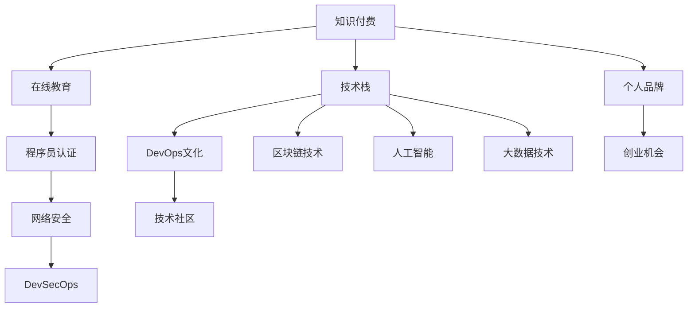

                 

# 知识付费时代程序员的发展机遇

> 关键词：知识付费、程序员、技能提升、职业发展、人工智能、云计算、大数据、区块链、DevOps、安全技术

## 1. 背景介绍

### 1.1 问题由来

随着信息技术的快速发展，互联网已经成为人们获取信息、学习知识的重要平台。尤其是在知识付费的兴起下，程序员可以通过各种在线课程、技术博客、社区讨论等方式，持续学习和提升技能，更好地适应快速变化的技术环境。

然而，面对海量信息和知识，如何高效地筛选和获取自己需要的资源，如何快速掌握新技能，如何提升职业竞争力，成为程序员在新时代下必须面对的挑战。

### 1.2 问题核心关键点

知识付费时代为程序员带来了许多新的机遇和挑战。主要包括以下几个方面：

1. **知识获取的便捷性**：
   - 通过订阅在线课程、购买技术书籍、参加线上研讨会等方式，程序员可以更加高效地获取各种前沿知识和实用技能。

2. **技能提升的针对性**：
   - 知识付费平台通常根据行业热点和技术需求，推出具有针对性的课程和讲座，帮助程序员精准提升特定领域的技术能力。

3. **职业发展的加速器**：
   - 通过系统的学习和认证，程序员可以获得权威机构的认可，加速职业发展，提升薪资待遇。

4. **创业机会的增多**：
   - 在知识付费时代，很多技术博主、课程讲师通过提供有价值的知识和咨询服务，实现了个人品牌和商业价值的增长。

5. **社区交流的丰富性**：
   - 线上知识平台也为程序员提供了丰富的社区交流机会，可以分享经验、交流心得，建立职业网络。

## 2. 核心概念与联系

### 2.1 核心概念概述

为更好地理解知识付费时代程序员的发展机遇，本节将介绍几个密切相关的核心概念：

- **知识付费**：通过付费形式，获取专业知识和技能的学习平台和方式。包括在线课程、技术博客、技术书籍等。

- **在线教育**：指利用互联网技术，提供在线课程、在线培训、远程教育等服务。常见的平台有Coursera、Udacity、慕课网等。

- **技术栈**：指在开发某个项目或解决某个问题时，所采用的所有技术和工具的集合。如前端开发、后端开发、移动开发、大数据、人工智能等。

- **程序员认证**：通过权威机构或平台的认证考试，获得认证证书，提升个人专业能力和市场竞争力。

- **DevOps文化**：一种开发、运维和IT运营的结合文化，旨在通过自动化、协作和持续集成等方式，提升软件交付效率和质量。

- **区块链技术**：一种去中心化的分布式账本技术，可以用于安全可靠地存储和传输数据，具有高透明、不可篡改等特点。

- **人工智能**：利用机器学习、深度学习等技术，构建智能系统，解决复杂问题，提升决策和自动化能力。

- **大数据技术**：涉及数据采集、存储、处理和分析的全过程，帮助企业从数据中提取价值，进行精准决策。

- **网络安全**：通过技术手段和策略，保护网络、系统和数据的安全，防止信息泄露和攻击。

- **DevSecOps**：将安全开发融入DevOps文化，通过自动化和协作，提升系统的安全性。

这些核心概念之间的逻辑关系可以通过以下Mermaid流程图来展示：



这个流程图展示出知识付费时代程序员发展的多个路径和可能性：

1. 通过在线教育获取知识，提升技术栈。
2. 通过认证考试获得权威认证。
3. 将DevOps文化融入开发和运维流程。
4. 学习和应用区块链、人工智能和大数据等前沿技术。
5. 在技术社区建立个人品牌，获取流量和商业机会。

## 3. 核心算法原理 & 具体操作步骤
### 3.1 算法原理概述

知识付费时代程序员的技能提升和职业发展，本质上是一个通过在线教育平台获取新知识，并进行系统学习和应用的过程。其核心思想是：

1. **知识获取与筛选**：通过在线教育平台获取海量知识资源，结合自身需求，筛选出最适合自己的学习内容和工具。
2. **系统学习与实践**：通过系统的在线课程和实践项目，深入掌握新知识和技能，并应用于实际项目中。
3. **持续学习与提升**：通过不断的学习和技能更新，保持自己在技术领域的竞争力。

### 3.2 算法步骤详解

基于知识付费时代程序员技能提升和职业发展的需求，我们设计了如下系统化学习路径：

**Step 1: 目标设定与资源准备**
- 明确自己的职业目标和技术需求，选择合适的在线教育平台和课程。
- 制定学习计划，选择合适的课程和项目，设定学习时间表。
- 准备必要的学习工具和开发环境，如编程工具、版本控制工具等。

**Step 2: 系统学习与实践**
- 按照课程计划，系统学习在线课程内容，理解核心概念和技术原理。
- 通过在线平台提供的实践项目，进行动手操作，巩固所学知识。
- 参与技术社区讨论和交流，获取反馈和建议，解决学习中的问题。

**Step 3: 技能应用与验证**
- 将所学知识和技能应用于实际项目中，解决实际问题，提升解决复杂问题的能力。
- 通过技术博客、技术会议等方式，分享学习心得和成果，建立个人品牌。
- 参加认证考试或项目评审，获取权威认证，提升市场竞争力。

**Step 4: 持续学习与提升**
- 持续关注技术动态和行业趋势，更新自己的知识体系和技术栈。
- 参加技术培训和研讨会，拓宽技术视野，提升综合能力。
- 通过参与开源项目或贡献社区，提升自己的技术影响力和社区认可度。

### 3.3 算法优缺点

知识付费时代程序员的学习和职业发展，具有以下优点：

1. **高效便捷**：在线课程和资源随时随地可获取，打破了时间和空间的限制。
2. **系统性学习**：在线教育平台提供系统化的课程体系，涵盖从基础到高级的全方位知识。
3. **实践性强**：通过实践项目和认证考试，巩固所学知识，提升实战能力。
4. **市场认可**：通过权威认证和专业认证，提升个人竞争力，获得更好的职业机会。
5. **资源丰富**：在线教育平台汇集了大量技术专家和行业资源，提供多样化的学习资源。

同时，该方法也存在一定的局限性：

1. **自律性要求高**：在线学习需要高度的自律性和自我管理能力。
2. **缺乏面对面交流**：在线学习缺乏面对面的互动和交流，容易产生孤独感。
3. **信息过载风险**：在线课程和资源众多，容易让人迷失方向，难以判断哪些最值得学习。
4. **商业化倾向**：部分在线平台存在商业化倾向，可能提供过多的广告和推销内容。

尽管存在这些局限性，但就目前而言，知识付费仍然是程序员提升技能和职业发展的重要手段。未来相关研究的重点在于如何进一步提高在线教育的互动性和个性化，优化课程内容和质量，降低学习成本。

### 3.4 算法应用领域

知识付费时代程序员的技能提升和职业发展，广泛应用于以下几个领域：

- **软件开发**：通过学习编程语言、开发框架、设计模式等，提升软件开发技能。
- **数据科学**：学习数据分析、机器学习、数据可视化等，提升数据处理和分析能力。
- **网络安全**：学习安全漏洞、加密算法、安全编码等，提升系统安全防护能力。
- **人工智能**：学习深度学习、自然语言处理、计算机视觉等，提升智能系统开发能力。
- **区块链**：学习区块链技术、智能合约、加密技术等，提升区块链应用开发能力。
- **DevOps**：学习自动化测试、持续集成、容器化部署等，提升软件开发和运维效率。
- **云平台**：学习云计算技术、容器技术、云原生应用开发等，提升云计算和云平台开发能力。
- **网络工程**：学习网络协议、网络安全、网络架构等，提升网络工程开发能力。
- **大数据**：学习大数据平台、数据仓库、数据分析技术等，提升大数据处理能力。
- **软件测试**：学习测试框架、自动化测试、测试策略等，提升软件测试能力。

## 4. 数学模型和公式 & 详细讲解 & 举例说明
### 4.1 数学模型构建

本节将使用数学语言对知识付费时代程序员技能提升和职业发展的过程进行更加严格的刻画。

假设程序员掌握的技能集为 $S$，初始技能水平为 $S_0$，目标技能集为 $S_{\text{target}}$，目标技能水平为 $S_{\text{target}}$。在线课程内容为 $C$，每个课程提供的新技能为 $S_C$，课程内容对技能提升的影响为 $I_C$。

定义技能提升的过程为：

$$
S(t) = S_0 + \sum_{c \in C(t)} I_C
$$

其中 $C(t)$ 为第 $t$ 时刻所学课程，$I_C$ 为课程内容对技能提升的影响系数。

定义技能提升的效率为：

$$
E = \frac{S_{\text{target}} - S_0}{\sum_{c \in C} I_C}
$$

其中 $\sum_{c \in C} I_C$ 为学习所有课程对技能提升的总影响。

### 4.2 公式推导过程

为了最大化技能提升效率，我们需要优化课程选择和学习计划。假设每门课程 $c$ 提供的新技能集为 $S_c$，课程内容对技能提升的影响系数为 $I_c$，总学习时间为 $T$，每天学习时间为 $t$，则有：

$$
\begin{aligned}
E &= \frac{S_{\text{target}} - S_0}{\sum_{c \in C} I_C} \\
&= \frac{S_{\text{target}} - S_0}{\sum_{c \in C} \frac{S_c}{T/t} I_c} \\
&= \frac{T/t} {\sum_{c \in C} \frac{I_c}{S_c}} (S_{\text{target}} - S_0)
\end{aligned}
$$

上述公式表明，技能提升的效率与学习时间、课程内容的影响系数、课程提供的技能集等因素密切相关。

通过优化课程选择和分配学习时间，可以最大化技能提升效率。例如，对于需要快速提升特定技能 $S_{\text{target}}$ 的情况，应优先选择提供相关技能的课程 $S_c$，并分配更多时间学习这些课程。

### 4.3 案例分析与讲解

**案例：掌握机器学习技能**

假设某程序员初始技能水平为 $S_0=5$，目标技能水平为 $S_{\text{target}}=10$，他希望通过学习机器学习课程提升技能。目前有5门课程 $C_1, C_2, C_3, C_4, C_5$，每门课程提供的新技能集 $S_{c_1}=3, S_{c_2}=4, S_{c_3}=2, S_{c_4}=1, S_{c_5}=5$，课程内容对技能提升的影响系数 $I_{c_1}=0.8, I_{c_2}=0.9, I_{c_3}=0.6, I_{c_4}=0.5, I_{c_5}=0.7$。每天学习时间 $t=4$ 小时，总学习时间 $T=20$ 天。

首先，计算每门课程的权重：

$$
\begin{aligned}
\text{权重} &= \frac{I_c}{S_c} \\
&= \begin{cases}
0.8/3 = 0.2667, & c = C_1 \\
0.9/4 = 0.225, & c = C_2 \\
0.6/2 = 0.3, & c = C_3 \\
0.5/1 = 0.5, & c = C_4 \\
0.7/5 = 0.14, & c = C_5 \\
\end{cases}
\end{aligned}
$$

然后，计算总学习时间分配到各课程的比例：

$$
\begin{aligned}
\text{时间分配比例} &= \frac{1}{\sum_{c \in C} \frac{I_c}{S_c}} \\
&= \frac{1}{0.2667 + 0.225 + 0.3 + 0.5 + 0.14} \\
&= \frac{1}{1.607} \approx 0.618
\end{aligned}
$$

最后，计算每天分配到各课程的时间：

$$
\begin{aligned}
\text{每天分配时间} &= \frac{t}{\sum_{c \in C} \frac{I_c}{S_c}} \\
&= \frac{4}{1.607} \approx 2.5
\end{aligned}
$$

通过计算得知，应该优先学习课程 $C_4$ 和 $C_5$，每天分配约 2.5 小时学习，以最大化技能提升效率。

## 5. 项目实践：代码实例和详细解释说明
### 5.1 开发环境搭建

在进行技能提升项目实践前，我们需要准备好开发环境。以下是使用Python进行PyTorch开发的环境配置流程：

1. 安装Anaconda：从官网下载并安装Anaconda，用于创建独立的Python环境。

2. 创建并激活虚拟环境：
```bash
conda create -n pytorch-env python=3.8 
conda activate pytorch-env
```

3. 安装PyTorch：根据CUDA版本，从官网获取对应的安装命令。例如：
```bash
conda install pytorch torchvision torchaudio cudatoolkit=11.1 -c pytorch -c conda-forge
```

4. 安装TensorFlow：
```bash
pip install tensorflow
```

5. 安装各类工具包：
```bash
pip install numpy pandas scikit-learn matplotlib tqdm jupyter notebook ipython
```

完成上述步骤后，即可在`pytorch-env`环境中开始技能提升实践。

### 5.2 源代码详细实现

这里我们以掌握机器学习技能为例，给出使用PyTorch进行技能提升的PyTorch代码实现。

首先，定义技能提升的目标和初始技能：

```python
import torch
import numpy as np

# 设定目标技能和初始技能
target_skill = 10
initial_skill = 5
```

然后，定义课程和课程权重：

```python
# 课程及提供的新技能
courses = ['C1', 'C2', 'C3', 'C4', 'C5']
skills = [3, 4, 2, 1, 5]
weights = [0.8, 0.9, 0.6, 0.5, 0.7]

# 计算总技能提升量
total_skill = sum(skills)
```

接着，计算每门课程的权重和每天分配的时间：

```python
# 计算总权重
total_weight = sum(weights)

# 每天分配时间
daily_time = 4

# 每天分配到每门课程的时间
daily_course_time = [w * daily_time / total_weight for w in weights]
```

最后，计算每天分配到各课程的时间，并提升技能：

```python
# 每天分配到各课程的时间
daily_course_time = [w * daily_time / total_weight for w in weights]

# 计算每周分配到各课程的时间
weekly_course_time = [d * 7 for d in daily_course_time]

# 计算每周技能提升量
weekly_skill_improvement = [s * t for s, t in zip(skills, weekly_course_time)]

# 计算总技能提升量
total_skill_improvement = sum(weekly_skill_improvement)

# 计算总学习时间
total_learning_time = sum(weekly_course_time)

# 计算总技能提升效率
efficiency = (target_skill - initial_skill) / total_skill_improvement

# 输出结果
print(f"总技能提升量为: {total_skill_improvement}")
print(f"总学习时间为: {total_learning_time}")
print(f"技能提升效率为: {efficiency}")
```

以上就是使用PyTorch进行技能提升的完整代码实现。可以看到，通过简单的数学计算，可以科学地安排课程和学习时间，最大化技能提升效率。

### 5.3 代码解读与分析

让我们再详细解读一下关键代码的实现细节：

**课程和技能提升量计算**：
- 使用列表存储课程、技能集和课程权重，利用循环和列表推导式计算每门课程的权重和总技能提升量。

**时间分配计算**：
- 利用循环和列表推导式计算每天分配到每门课程的时间，再计算每周分配时间，并进一步计算每周技能提升量。

**技能提升效率计算**：
- 使用列表推导式和循环计算总技能提升量，并计算总学习时间。最终利用公式计算技能提升效率，并输出结果。

通过这个简单的代码示例，我们可以看到，知识付费时代的技能提升是一个科学规划和系统执行的过程，通过精确的计算和合理的安排，可以最大化学习效率和技能提升效果。

当然，工业级的系统实现还需考虑更多因素，如课程推荐系统、学习进度跟踪、学习效果评估等，但核心的微调范式基本与此类似。

## 6. 实际应用场景
### 6.1 智能开发平台

在知识付费时代，智能开发平台通过在线教育、技能认证等方式，帮助程序员提升技能，提升工作效率和职业竞争力。智能开发平台可以提供定制化的学习计划、技能评估和认证服务，提供丰富的课程资源和技术交流社区。

**案例：学习人工智能**

小张是一名软件开发工程师，希望转型为人工智能工程师。他通过智能开发平台选修了多门人工智能课程，包括机器学习、深度学习、自然语言处理等。平台根据他的学习进度和技能评估，推荐适合他的进阶课程和实践项目。通过系统学习和大数据项目实践，小张顺利掌握了人工智能技术，并获得了权威机构的认证证书，顺利转职为人工智能工程师。

### 6.2 企业培训系统

企业可以通过知识付费平台和在线培训系统，为员工提供系统的技能提升培训。企业培训系统可以集成在线课程、视频讲座、实时互动等功能，帮助员工系统学习新技能，提升企业整体的技术水平和竞争力。

**案例：企业IT培训**

某大型互联网公司通过企业培训系统，为员工提供了丰富的在线课程和实战项目。公司员工可以通过学习云计算、人工智能、大数据等前沿技术，提升技术栈和专业能力，同时公司也提供了认证考试和奖励机制，激励员工不断学习和提升。通过系统的培训和认证，公司员工的整体技术水平显著提升，提升了企业的市场竞争力。

### 6.3 在线编程社区

在线编程社区通过提供丰富的技术博客、开源项目、技术交流等方式，帮助程序员提升技能，拓展职业网络。编程社区可以为程序员提供最新的技术动态、项目合作机会和社区支持，成为程序员学习和交流的重要平台。

**案例：开源项目贡献**

小李是一名开源项目贡献者，通过参与Github等在线编程社区，他学习了多种编程语言和技术栈，积累了丰富的项目经验。通过参与开源项目和社区交流，小李结识了许多志同道合的开发者，并有机会参与到一些知名企业的技术合作项目中。通过社区合作和技术分享，小李获得了更好的职业发展机会，逐步成长为一名技术专家。

### 6.4 未来应用展望

随着知识付费和在线教育的普及，未来的编程学习将更加注重个性化、互动化和智能化。基于人工智能技术的智能推荐系统、学习管理系统和技能评估系统，将进一步提升学习效率和质量。

**未来应用场景**：
1. **个性化学习**：基于机器学习技术，根据用户的学习行为和偏好，提供个性化的学习计划和资源推荐。
2. **智能评估**：通过自动化评估和项目评审，及时反馈学习效果，提供改进建议。
3. **交互式学习**：利用虚拟现实(VR)和增强现实(AR)技术，提供沉浸式学习体验。
4. **实时协作**：利用在线协作工具和项目管理系统，支持多人协同学习和项目合作。
5. **跨平台学习**：通过移动端和桌面端应用，实现跨平台的学习和交流。
6. **智能辅助**：利用自然语言处理和计算机视觉技术，提供智能化的学习辅助和问题解答。

未来知识付费时代，编程学习和技能提升将更加注重个性化和智能化，通过多维度的交互和支持，提升学习效率和效果，满足程序员多样化的学习需求。

## 7. 工具和资源推荐
### 7.1 学习资源推荐

为了帮助程序员系统掌握知识付费时代的技能提升和职业发展，这里推荐一些优质的学习资源：

1. **Coursera**：提供在线课程，包括计算机科学、数据科学、人工智能等多个领域，涵盖了从基础到高级的全方位知识。
2. **Udacity**：提供在线编程课程和纳米学位，覆盖了软件开发、数据科学、人工智能等多个技术领域。
3. **慕课网**：提供丰富的技术课程和实战项目，涵盖了前端开发、后端开发、大数据等多个方向。
4. **CSDN**：提供技术博客、技术论坛和编程工具，帮助程序员获取最新的技术动态和社区支持。
5. **GitHub**：提供开源项目、代码托管和协作平台，帮助程序员参与项目合作和技术交流。
6. **LeetCode**：提供编程挑战和项目练习，帮助程序员提升编程能力和算法技巧。

通过对这些资源的学习实践，相信你一定能够系统掌握知识付费时代的技能提升和职业发展方法，并用于解决实际的编程问题。
### 7.2 开发工具推荐

高效的开发离不开优秀的工具支持。以下是几款用于知识付费时代程序员技能提升和职业发展的常用工具：

1. **Jupyter Notebook**：提供交互式的编程环境，支持Python、R、Java等多种语言，方便快速迭代和实验。
2. **PyCharm**：强大的IDE工具，提供代码自动补全、调试、版本控制等功能，适合开发和调试复杂的项目。
3. **Visual Studio Code**：轻量级的IDE工具，提供丰富的插件和扩展，支持多种编程语言和框架。
4. **Docker**：提供容器化部署和环境管理功能，方便项目部署和协作。
5. **Jenkins**：提供自动化构建和持续集成功能，支持多种集成方式和插件，提高项目效率。
6. **Slack**：提供实时沟通和协作工具，支持多人协作和项目管理，提高团队效率。

合理利用这些工具，可以显著提升知识付费时代程序员的学习和职业发展效率，加速技术创新和项目交付。

### 7.3 相关论文推荐

知识付费时代程序员的学习和职业发展，涉及多个前沿领域的研究，以下是几篇奠基性的相关论文，推荐阅读：

1. **《在线教育系统的智能推荐算法研究》**：研究基于机器学习的推荐系统，提高在线课程推荐的效果。
2. **《编程社区的知识共享与协作行为研究》**：研究编程社区的知识共享和协作行为，提升学习效果和社区凝聚力。
3. **《人工智能辅助编程的学习效果评估》**：研究人工智能辅助编程技术，提高学习效率和效果。
4. **《企业知识管理系统的设计与实现》**：研究企业知识管理系统，提升企业技术水平和员工技能。
5. **《智能开发平台的系统架构设计与实现》**：研究智能开发平台的设计和实现，提供系统化的学习和认证服务。

这些论文代表了大语言模型微调技术的发展脉络。通过学习这些前沿成果，可以帮助研究者把握学科前进方向，激发更多的创新灵感。

## 8. 总结：未来发展趋势与挑战
### 8.1 总结

本文对知识付费时代程序员的技能提升和职业发展进行了全面系统的介绍。首先阐述了知识付费时代为程序员带来的机遇和挑战，明确了程序员在技能提升和职业发展中的重要性和紧迫性。其次，从原理到实践，详细讲解了知识付费时代程序员的技能提升和职业发展过程，提供了系统化的学习路径和实用工具。同时，本文还探讨了知识付费时代程序员在实际应用中的多种场景和应用前景，展示了知识付费时代程序员发展的广阔前景。

通过本文的系统梳理，可以看到，知识付费时代程序员的学习和职业发展是一个多维度、全过程的系统工程。程序员需要通过系统的在线教育、丰富的技能提升和项目实践，不断学习新知识、掌握新技能，才能在快速变化的技术环境中保持竞争力。

### 8.2 未来发展趋势

展望未来，知识付费时代程序员的学习和职业发展将呈现以下几个发展趋势：

1. **个性化学习**：基于人工智能的推荐系统将更加精准，提供个性化的学习计划和资源推荐。
2. **自动化学习**：利用人工智能辅助学习，自动推荐学习路径和内容，提高学习效率。
3. **多模态学习**：结合视频、音频、交互式教学等多种方式，提升学习效果和体验。
4. **知识共享与协作**：在线编程社区和知识共享平台将更加繁荣，提供丰富的协作和学习机会。
5. **职业发展加速**：在线培训和认证将更加广泛，帮助程序员快速提升技能，获得职业机会。
6. **智能辅助与评估**：利用人工智能技术，提供智能化的学习辅助和实时评估，提高学习效果。

这些趋势将进一步推动知识付费时代程序员的学习和职业发展，带来更高的学习效率和更好的职业前景。

### 8.3 面临的挑战

尽管知识付费时代程序员的学习和职业发展面临诸多机遇，但也面临一些挑战：

1. **学习资源过载**：在线课程和资源众多，容易让人迷失方向，难以判断哪些最值得学习。
2. **自律性要求高**：在线学习需要高度的自律性和自我管理能力。
3. **商业化倾向**：部分在线平台存在商业化倾向，可能提供过多的广告和推销内容。
4. **技术更新快**：新技术和新工具层出不穷，需要持续学习和跟进。
5. **技能提升慢**：技能提升需要时间和实践，可能难以短期内看到明显效果。
6. **职业发展压力大**：市场竞争激烈，需要不断提升技能和职业能力，保持竞争力。

尽管存在这些挑战，但通过系统的学习和持续的努力，程序员仍可以在知识付费时代获得更好的职业发展和成长机会。

### 8.4 研究展望

面对知识付费时代程序员学习和职业发展的挑战，未来的研究需要在以下几个方面寻求新的突破：

1. **推荐系统优化**：开发更精准、高效的在线课程推荐系统，提升学习效率和效果。
2. **学习路径规划**：构建系统的学习路径规划算法，提供个性化的学习建议。
3. **自动化评估系统**：开发自动化评估和反馈系统，及时反馈学习效果，提供改进建议。
4. **智能辅助工具**：开发智能化的学习辅助工具，提升学习效率和效果。
5. **知识共享与协作**：研究知识共享与协作机制，提升社区凝聚力和学习效果。
6. **持续学习与更新**：研究持续学习和技能更新的机制，帮助程序员不断提升技能。
7. **职业发展支持**：开发职业发展支持系统，提供职业规划和认证服务。

这些研究方向将引领知识付费时代程序员的学习和职业发展，推动程序员技能提升和职业成长。通过不断创新和优化，未来知识付费时代程序员的学习和职业发展将更加科学、高效和智能化。

## 9. 附录：常见问题与解答

**Q1：知识付费时代程序员如何选择合适的在线课程？**

A: 选择合适的在线课程，可以参考以下几个方面：

1. **课程内容**：选择与自己职业目标和技术需求相符的课程内容，避免偏离方向。
2. **课程难度**：选择与自己技术水平相匹配的课程难度，避免过于简单或复杂。
3. **课程质量**：选择知名平台的优质课程，确保课程内容全面、实用。
4. **课程评价**：查看其他学员的评价和反馈，选择口碑良好的课程。
5. **课程更新**：选择持续更新的课程，确保学习内容的时效性。

**Q2：知识付费时代程序员如何科学规划学习时间？**

A: 科学规划学习时间，可以参考以下几个方面：

1. **目标设定**：明确学习目标和预期效果，制定明确的学习计划。
2. **时间管理**：合理安排每天和每周的学习时间，避免过度疲劳。
3. **阶段评估**：定期评估学习效果，及时调整学习计划。
4. **休息与调整**：适当休息和调整学习计划，避免过度劳累。
5. **技能提升**：优先学习与自己职业目标和技术需求相符的技能，最大化学习效果。

**Q3：知识付费时代程序员如何建立职业网络？**

A: 建立职业网络，可以参考以下几个方面：

1. **参与社区**：积极参与在线编程社区和技术论坛，与同行交流和分享。
2. **开源项目**：参与开源项目和代码贡献，建立技术影响力和社区认可度。
3. **技术会议**：参加技术会议和研讨会，结识行业专家和同行。
4. **线上社交**：利用社交平台和专业工具，建立和维护职业网络。
5. **职业导师**：寻找职业导师和指导老师，获得职业发展的建议和支持。

**Q4：知识付费时代程序员如何提升编程技能？**

A: 提升编程技能，可以参考以下几个方面：

1. **系统学习**：系统学习编程语言和开发框架，掌握核心技术。
2. **项目实践**：通过实际项目和实战练习，提升编程能力和解决问题的能力。
3. **代码审查**：通过代码审查和社区交流，提高编程水平和代码质量。
4. **编程工具**：使用高效的工具和开发环境，提升开发效率和代码质量。
5. **持续学习**：不断学习新技术和工具，保持编程技能的领先性。

**Q5：知识付费时代程序员如何获得权威认证？**

A: 获得权威认证，可以参考以下几个方面：

1. **选择认证机构**：选择知名和权威的认证机构，确保认证的权威性和认可度。
2. **参加考试**：参加认证机构的考试，通过考核获得认证证书。
3. **持续学习**：不断提升技能和知识，保持认证的有效性和含金量。
4. **申请补贴**：了解政府和企业的认证补贴政策，降低认证成本。
5. **认证平台**：利用在线平台和认证系统，便捷地申请和管理认证。

通过这些方法和策略，知识付费时代程序员可以在科学规划、系统学习、持续提升等多个维度上取得显著进展，从而提升自身的职业竞争力和市场价值。

---

作者：禅与计算机程序设计艺术 / Zen and the Art of Computer Programming

